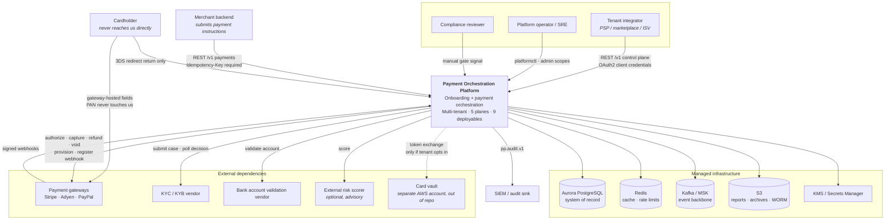
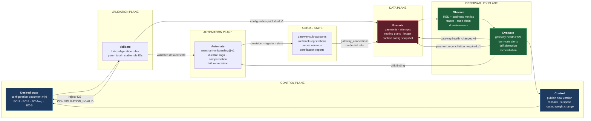
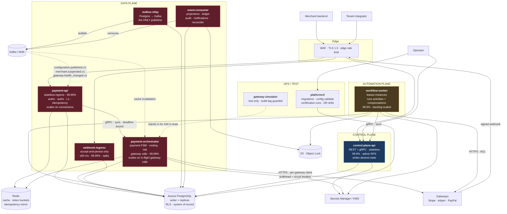

# Architecture — High Level Design

> Purpose: the system-level decomposition, styles, trade-offs and scaling model for the multi-tenant payment gateway onboarding and orchestration platform.
> **Derived from and subordinate to [`docs/spec/00-design-baseline.md`](spec/00-design-baseline.md).** Where this document disagrees with the baseline, the baseline wins and this document is a defect.

---

## 1. System context

### 1.1 Actors and external systems

| Actor / system | Kind | Interacts via | Plane touched | Trust |
|---|---|---|---|---|
| **Tenant integrator** (PSP / marketplace / ISV back-office) | Human + machine | `control-plane-api` REST `/v1` (OAuth2 client credentials) | Control | Authenticated, tenant-scoped |
| **Merchant** (business onboarded under a tenant) | Machine | `payment-api` REST `/v1` (OAuth2 / mTLS) | Data | Authenticated, merchant-scoped within tenant |
| **Merchant's customer** (cardholder) | Human | Never touches us directly. Gateway-hosted fields / SDK tokenization; returns to us only via 3DS redirect completion | — | Untrusted; no PAN reaches us (§17, A2) |
| **Platform operator / SRE** | Human | `platformctl`, control-plane admin scopes, Grafana, workflow operator surface | Control + Observability | Privileged, audited, break-glass |
| **Compliance reviewer** | Human | `POST /v1/merchants/{id}/onboarding/signals/{signal}` (`onboarding:approve`) | Automation | Privileged, audited manual gate |
| **Payment gateways** — Stripe, Adyen, PayPal | External SaaS | Outbound HTTPS via adapters; inbound webhooks to `webhook-ingress` | Data | Untrusted input, signature-verified, wrapped in an ACL |
| **KYC/KYB vendor** | External SaaS | `KYCProvider` port, called only from `workflow-worker` | Automation | Untrusted input, ACL |
| **Bank account validation vendor** | External SaaS | `BankValidator` port, called only from `workflow-worker` | Automation | Untrusted input, ACL |
| **External risk scorer** (optional) | External SaaS | `RiskScorer` port, hot path, hard 15 ms budget, fail to *policy default* | Data | Untrusted, advisory |
| **AWS KMS / Secrets Manager** | Cloud service | `Secrets` port | All | Trusted infrastructure |
| **Aurora PostgreSQL, Redis, Kafka (MSK), S3** | Cloud service | Infrastructure adapters | All | Trusted infrastructure |
| **Card vault** (only if a tenant requires it) | Separate system, separate AWS account, **not in this repo** | `TokenVault` port | Data | Segregated PCI SAQ-D estate (§17.1) |
| **SIEM / audit sink** | External | `pp.audit.v1` Kafka topic → sink | Observability | Trusted consumer |

### 1.2 C4 Level 1 — System context



### 1.3 What the platform is responsible for, and what it refuses

Restating the baseline's non-goals as architectural constraints, because each one removes an entire subsystem:

| We do not | Architectural consequence |
|---|---|
| Hold funds (A1) | No money-custody ledger, no safeguarding accounts, no settlement computation. `internal/domain/ledger` is a **shadow** ledger: append-only double-entry records used solely for reconciliation against gateway-reported truth. |
| Accept PAN (A2) | Eight of nine deployables sit outside the CDE. The L1 PAN detector is an *ingress* control, not a storage control — it exists so the boundary cannot erode by accident. |
| Decide KYC | `KYCProvider` is a port; the workflow owns the *state machine*, the vendor owns the *decision*. This is why step 3 `await-kyc-decision` is a signal wait with a 7-day timeout rather than a polling loop with a business rule. |
| Run a general BPM engine | `internal/workflows/engine` implements exactly the semantics §11 requires and nothing more. The Temporal adapter exists behind the same port so the choice stays reversible. |
| Score fraud | `internal/domain/risk` evaluates *policy* (limits, velocity, blocked countries, 3DS thresholds). Machine-learned scoring is an optional external port with a fail-to-policy-default contract. |

---

## 2. The five-plane model

### 2.1 Why planes are the primary decomposition

The obvious decomposition for a system with nine bounded contexts is nine services, one per context. We deliberately did not do that. The primary axis of decomposition is the **plane** (§2 ubiquitous language: *"a horizontal slice of the platform with its own availability target, scaling behaviour and blast radius"*), and bounded contexts are arranged *within* planes.

The argument, stated as three claims:

1. **Availability targets differ by an order of magnitude, and that difference is the real design constraint.** The data plane targets 99.99 % (≤ 4 m 23 s/month); the control plane targets 99.9 % (≤ 43 m/month). A 43-minute control-plane outage must be a non-event for money movement. If Merchant Registry and Payment Orchestration were peers in a flat service mesh, the payment path would acquire a synchronous dependency on a 99.9 % component and inherit its availability. Planes force the question "which side of the availability boundary is this on?" to be answered *before* the service boundary is drawn.

2. **Scaling signals differ in kind, not degree.** The control plane scales on admin request rate (tens of requests per second, bursty at business hours). The data plane scales on payment TPS (thousands per second, diurnal). The automation plane scales on onboarding volume *and retry backlog* — a queue-depth signal, not a request-rate signal. The observability plane scales on event volume, which is a multiple of data-plane volume. Co-scaling components with different signals means either over-provisioning the cheap one or under-provisioning the expensive one.

3. **Blast radius is a plane property.** A bug in routing configuration can stop payments for one tenant; a bug in the payment FSM can corrupt money state for all of them; a bug in the audit consumer costs a compliance gap but no revenue. Planes let us give each blast-radius class its own deploy cadence, its own error budget policy, its own change control, and its own on-call severity mapping. Bounded contexts do not naturally align with blast radius — BC-4 (Gateway Registry & Integration) deliberately straddles two planes precisely because its *registry* half is control-plane configuration and its *integration* half is data-plane hot path, and they must not share a failure domain.

Bounded contexts remain the unit of **model ownership** (each owns its aggregates, its tables, its published events). Planes are the unit of **operational ownership**. The two are orthogonal, and conflating them is the classic mistake that produces a distributed monolith with microservice operational cost.

### 2.2 The planes

| Plane | Contexts | Deployables | Availability | Scaling signal | Blast radius | Change cadence |
|---|---|---|---|---|---|---|
| **Control** | BC-1 Tenant & Identity, BC-2 Merchant Registry, BC-4 (registry half), BC-5 Configuration & Policy | `control-plane-api` | 99.9 % | Admin RPS | One tenant's configuration; **never** live payments | Daily, standard change |
| **Automation** | BC-3 Onboarding | `workflow-worker` | 99.9 % | Onboarding starts + retry backlog + DLQ depth | Onboarding latency; never live payments | Daily |
| **Validation** | Cross-cutting (L1–L7) | *No deployable.* A library (`internal/validation`) linked into every binary | Inherits host | — | Inherits host | With host |
| **Data** | BC-4 (integration half), BC-6 Payment Orchestration, BC-7 Webhook Ingestion, BC-8 Ledger & Reconciliation | `payment-api`, `payment-orchestrator`, `webhook-ingress`, `outbox-relay`, `event-consumer` | 99.99 % | Payment TPS, webhook rate, outbox backlog, consumer lag | Money. Highest severity. | Weekly, progressive delivery, error-budget gated |
| **Observability** | BC-9 Audit | `event-consumer` (audit + projection handlers), plus collectors | 99.9 % | Event volume | Compliance gap, blind operators; no revenue impact | Daily |

**The Validation plane has no deployable, and that is deliberate.** Validation is a *contract* (§21: seven levels, stable rule IDs, `Rule[T]` interface), not a service. Making it a service would put a network hop in the middle of the L1/L5/L6/L7 stages of the request pipeline, adding latency and a failure mode to the money path in exchange for nothing — the rules are pure and total. It is a plane rather than merely a package because it has its own governance: rule IDs are stable and documented, `TestEveryRuleIsDocumented` gates the build, and a rule change is reviewed as a behavioural change even though it ships as a library upgrade. L3 (Gateway) is the one impure level; it is explicitly barred from the hot path and runs only in `workflow-worker` and scheduled probes.

### 2.3 Plane interaction rules (invariants, CI- and review-enforced)

| # | Rule | Enforcement |
|---|---|---|
| P1 | The Data plane may **never** make a synchronous call to the Control plane on the payment path. | Architecture check: no import of `internal/application/config` write-side use cases from `internal/application/payment`; no `control-plane-api` host in `payment-*` config schema. |
| P2 | Configuration reaches the Data plane by **event + cache** only (`configuration.published.v1`), with bounded staleness ≤ 30 s (A5). | Synthetic propagation probe, `pp_config_snapshot_age_seconds`. |
| P3 | The Automation plane may call the Control plane synchronously (step 8 `apply-configuration`). It is not latency-critical and shares the control plane's availability target. | Design intent; timeout 10 s, retry 3 × exp. |
| P4 | The Observability plane is **downstream only**. Nothing in Control, Automation or Data may block on it. | Audit writes go through the outbox; a Kafka outage backs up the outbox, it does not fail a payment (§24). |
| P5 | The Data plane fails **static**, not open and not closed, when Control is unreachable — with a defined cliff at `max_config_staleness` (default 15 min), after which new merchants fail closed and existing merchants continue (§15). | `internal/platform/config` snapshot age check; see `docs/control-plane.md` §5. |
| P6 | Every cross-plane message carries the full context set (`tenant_id`, `correlationid`, `causationid`, `traceparent`) (§13.1, §22.1). | Envelope schema validation in `internal/events`. |

---

## 3. The control loop

### 3.1 The loop, stated precisely

The platform is a **reconciliation system**, not a request/response system with some background jobs bolted on. The loop is:

```
desired state → validate → automate → actual state → data plane → observe → evaluate → control
      ▲                                                                                    │
      └────────────────────────────────────────────────────────────────────────────────────┘
```

Each arrow is a real mechanism with a real artifact, not a metaphor:

| Stage | Owner | Input | Output artifact | Failure behaviour |
|---|---|---|---|---|
| **Desired state** | Control plane, BC-5 | Operator/API authored configuration document (§23) | `configurations` row + `configuration_versions` row, monotonic `version` | Rejected before persistence |
| **Validate** | Validation plane, **L4** | Candidate configuration document | `Outcome` per rule ID; `422 CONFIGURATION_INVALID` on any ERROR | Publish refused; prior version remains the desired state |
| **Automate** | Automation plane, BC-3 | Validated desired state + merchant FSM position | Workflow instance progress; activities that mutate the world (provision, register webhook, store credential) | Step retries, then compensation in reverse order, then DLQ |
| **Actual state** | External world + BC-4 | Gateway sub-account refs, webhook registrations, secret versions, certification reports | `gateway_connections`, `gateway_credentials_meta`, `CertificationReport` in S3 | Drift |
| **Data plane** | BC-6/7/8 | Cached configuration snapshot + actual connections | Payments, attempts, ledger entries, domain events | Fail-static on stale config; fail-closed past the cliff |
| **Observe** | Observability plane | Metrics, traces, logs, domain events, audit records | `pp_*` series, spans, `audit_records` hash chain | Degrades visibility only (P4) |
| **Evaluate** | Observability plane + BC-4 health FSM | Observed signals vs thresholds (§10, §22.4) | `gateway.health_changed.v1`, burn-rate alerts, reconciliation exceptions, drift findings | Alerts on detector failure (staleness of the detector itself is monitored) |
| **Control** | Control plane / operator / automation | Evaluation output | New configuration version, suspension, circuit state, routing weight change, rollback | Manual escalation |

### 3.2 Four concrete instances of the loop closing

A control loop that cannot be pointed at is decoration. These four are implemented, measured and tested.

#### Loop 1 — Configuration propagation (the reference loop)

1. **Desired.** Tenant integrator issues `PUT /v1/merchants/mrc_.../configuration` with `If-Match: "6"`, changing `routing.primary` from `stripe` to `adyen` for EUR/CARD.
2. **Validate.** L4 runs: does the merchant have a `CERTIFIED` `GatewayConnection` to Adyen for EUR/CARD? Do Adyen's capability descriptors cover `EUR` and `CARD` in the merchant's countries? Does the fallback list contain at least one distinct eligible gateway? A failure here returns `422 CONFIGURATION_INVALID` with the rule ID — and critically, the *old* configuration remains in force; there is no partial application.
3. **Publish.** Version 7 persisted with the version-6 document retained; audit record written with actor and diff; `configuration.published.v1` written to the **outbox in the same transaction** as the configuration row.
4. **Propagate.** `outbox-relay` publishes to `pp.config.configuration.v1` (compacted, keyed by `merchant_id`). `payment-api` and `payment-orchestrator` consume it as a cache-invalidation signal and refresh their snapshot.
5. **Data plane effect.** The next payment for that merchant in EUR/CARD produces a `RoutingPlan` with `adyen` first, and the plan is persisted with the payment — so the decision is auditable after the fact.
6. **Observe.** A synthetic probe publishes a configuration change to a canary merchant every 60 s and measures publish→effect. That is the `Config propagation` SLI: p99 ≤ 30 s, page at > 5 min (§22.4). `pp_config_snapshot_age_seconds` is exported per service.
7. **Evaluate → Control.** If propagation p99 breaches, the burn-rate alert fires; if a specific pod's snapshot age exceeds `max_config_staleness`, its `/readyz` fails and the load balancer sheds it — the control action here is automatic and takes the unhealthy pod out of the money path rather than letting it serve stale limits past the cliff.

**The loop closes** because step 6 measures the same quantity step 1 intended to change, and step 7 has an actuator.

#### Loop 2 — Gateway health

1. **Observe.** `payment-orchestrator` records per-`(gateway_id, operation)` outcomes into a sliding window (`pp_gateway_errors_total`, `pp_gateway_request_duration_seconds`).
2. **Evaluate.** The health FSM (§10) transitions `HEALTHY → DEGRADED` at > 5 % error rate over 30 s with ≥ 20 samples; `DEGRADED → UNHEALTHY` at > 25 % or p99 > 5 s, which **opens the circuit**.
3. **Control.** `gateway.health_changed.v1` is published to `pp.gateways.health.v1` (compacted, keyed by `gateway_id`). The routing engine in every orchestrator pod consumes it and drops the gateway from candidate sets; the control plane records it as observed actual state and surfaces it on `GET /v1/gateways/{id}/health`.
4. **Actual state changes.** Traffic shifts to the fallback gateway. The `PROBING` state re-admits traffic after cool-down; three consecutive successes restore `HEALTHY`, any failure doubles the cool-down to a 5-minute cap.
5. **Closes because** the actuator (routing candidate set) directly changes the signal (error rate) that drove the transition, and the negative feedback is damped by the `PROBING`/cool-down hysteresis. Without hysteresis this loop oscillates; the `min 20 samples` floor and the doubling cool-down are the damping terms.

Note the **deliberate asymmetry**: health is evaluated per `(gateway, operation)`, not per merchant, because per-merchant samples are statistically meaningless at typical volumes. Per-merchant overrides exist but are *configuration* (control), not *observation* (evaluate).

#### Loop 3 — Desired/actual drift on gateway provisioning

1. **Desired.** Merchant configuration says webhooks are registered at Adyen for `payment.*`.
2. **Actual.** Someone rotated credentials manually in the Adyen dashboard, or Adyen expired a webhook registration.
3. **Observe.** A scheduled **L3 Gateway** validation probe (impure, off the hot path, run from `workflow-worker`) calls the gateway's describe APIs and compares to `gateway_connections`.
4. **Evaluate.** Drift detected: registered endpoint absent. A reconciliation exception is raised with severity, and the connection is marked unhealthy.
5. **Automate → Control.** A remediation workflow instance is started that re-runs the `register-webhooks` activity (idempotent by external ref). If it succeeds, actual converges to desired and the exception closes. If it fails, the merchant's gateway connection leaves `CERTIFIED`, which — via the `→ ACTIVE` guard in §8 — is enough to make the platform stop routing to that gateway.
6. **Closes because** the detector and the remediator use the same identity (`gateway_connections.external_ref`), so remediation is idempotent and the next probe verifies it.

#### Loop 4 — Payment reconciliation (the loop that exists because timeouts lie)

1. **Data plane.** A gateway call times out at 8 s. Per §12.3 the attempt becomes `TIMEOUT_UNKNOWN`, the payment stays `PROCESSING`, and `payment.reconciliation_required.v1` is emitted. **No timer may fail a payment.**
2. **Observe.** The reconciler consumes the event and enqueues the attempt. `pp_reconciliation_exceptions` gauges the backlog by severity.
3. **Evaluate.** Resolution is attempted in order of speed: (a) a gateway webhook arrives and resolves it; (b) the reconciler polls the gateway's lookup API using the **deterministic** `gateway_idempotency_key` = `base32(HMAC-SHA256(attempt_id, gateway_salt))[:32]` — reproducible after a crash, which is the whole point of deriving it rather than generating it; (c) the settlement report resolves it.
4. **Control.** The payment moves `PROCESSING → AUTHORIZED | CAPTURED | FAILED` through the normal FSM, with the transition and outbox event in one transaction.
5. **Closes because** the key that made the request is recomputable from the attempt row, so an ambiguous outcome is always resolvable without guessing. This is the single most important loop in the system: A7 exists because auto-failing a timed-out authorization and retrying elsewhere is the most common source of double charges in real platforms.

### 3.3 Control loop diagram



### 3.4 Why the loop is drawn this way

- **Validate sits between desired state and everything else**, not inside the automation plane. If validation lived in the workflow, an invalid configuration would be discoverable only after a workflow started, which means partial application and compensation for a problem that was statically detectable. L4 is pure precisely so it can run synchronously on the write path.
- **Evaluate is separate from observe.** Observation is lossless and unopinionated; evaluation applies thresholds and hysteresis. Merging them produces alerting logic embedded in instrumentation, which cannot be changed without a deploy. Our evaluators (health FSM, burn-rate rules, drift detector) are configuration-driven.
- **The control arrow is the only one that writes desired state.** Nothing in the data plane may write configuration. An automatic suspension (risk breach, compliance expiry) is modelled as the automation plane calling the control plane, which then publishes — not as the data plane mutating its own cache. This keeps the audit trail single-sourced.

---

## 4. Container and component view

### 4.1 C4 Level 2 — Containers



### 4.2 The nine deployables

| Binary | Plane | Owns (contexts) | Ingress | Egress | Statefulness | Scaling driver | Availability |
|---|---|---|---|---|---|---|---|
| `control-plane-api` | Control | BC-1, BC-2, BC-4 (registry), BC-5 | REST `/v1` + internal gRPC | Postgres (writer), Secrets Manager, outbox | Stateless | Admin RPS (low) | 99.9 % |
| `payment-api` | Data | BC-6 (ingress half) | REST `/v1/payments*` | gRPC → `payment-orchestrator`, Postgres (idempotency), Redis | Stateless; holds a config snapshot in memory | Payment TPS / connection count | 99.99 % |
| `payment-orchestrator` | Data | BC-6 (FSM), BC-4 (integration), routing, risk | Internal gRPC only | Gateways (HTTPS), Postgres (writer), Redis, outbox | Stateless; per-gateway connection pools and breakers | In-flight gateway calls | 99.99 % |
| `workflow-worker` | Automation | BC-3 | None (poller) | Postgres (lease + checkpoint), KYC/bank vendors, gateways, `control-plane-api`, S3 | Stateless; holds leases | Runnable-instance backlog + DLQ depth | 99.9 % |
| `webhook-ingress` | Data | BC-7 | REST `/v1/webhooks/{gateway}` | Postgres (insert + outbox) | Stateless | Gateway webhook rate (spiky) | 99.99 % |
| `outbox-relay` | Data | — (infrastructure role) | None (poller) | Postgres, Kafka | Stateless; leases outbox rows | Outbox backlog | 99.99 % |
| `event-consumer` | Data + Observability | BC-8, BC-9, projections, notifications, reconciler | Kafka | Postgres, S3, notification sinks, gateway lookup APIs (reconciler) | Stateless; Kafka consumer-group state | Consumer lag | 99.9 % |
| `gateway-simulator` | Test | — | HTTP | — | Stateless | — | Never in production; `//go:build simulator` excluded from prod images and asserted by an image-content test |
| `platformctl` | Ops | — | CLI | Postgres, S3, gateways (certification) | — | — | — |

### 4.3 Why `payment-api` and `payment-orchestrator` are two binaries

This is the least obvious split, so it gets its own justification (baseline §5 states the conclusion; here is the reasoning).

The two components have **antagonistic resource profiles**:

- `payment-api` is dominated by *connection count*. It terminates keep-alive connections from merchant backends, parses and validates JSON, verifies JWTs, and claims idempotency. Its concurrency is bounded by inbound sockets and its latency is measured in single-digit milliseconds.
- `payment-orchestrator` is dominated by *in-flight outbound calls*. A single slow gateway holds a goroutine and a connection for up to 8 seconds.

If they were one process, a gateway degrading from 200 ms to 6 s would multiply in-flight work by 30× in a component that also owns the inbound connection pool. The listener backlog fills, health checks fail, the load balancer sheds the pod, and the outage generalizes from "one gateway is slow" to "the platform is down". This is the classic thread-pool-exhaustion cascade, and no amount of in-process bulkheading fully prevents it because the two workloads still share the same GC heap, the same scheduler, the same file-descriptor limit, and — decisively — the same **liveness verdict**.

Splitting them gives us a **bulkhead at the deployment level**: the orchestrator can be saturated, restarted, or scaled independently while ingress continues to accept traffic and return well-formed `503 SERVICE_UNAVAILABLE` / `GATEWAY_CIRCUIT_OPEN` responses with `Retry-After`. It also lets each scale on its own signal (HPA on connections/RPS vs. HPA on in-flight-call gauge), which the arithmetic in §7 shows produce different pod counts.

The cost is one extra network hop (~1.2 ms p99 in-mesh) and a distributed-tracing seam. We pay it.

### 4.4 Synchronous vs asynchronous boundaries

Every boundary is one shape or the other for a stated reason. "It was easier" is not a reason.

| # | Boundary | Shape | Protocol | Why this shape | What breaks if inverted |
|---|---|---|---|---|---|
| B1 | Merchant → `payment-api` | **Sync** | REST/HTTPS, `Idempotency-Key` required | The caller needs an authorization decision to show a customer. Async here pushes a polling burden onto every integrator. | Merchant checkout UX becomes a polling loop; integration cost explodes. |
| B2 | `payment-api` → `payment-orchestrator` | **Sync** | gRPC, deadline propagated from the inbound request | The response is the caller's response. Making this async would require the API to hold the request open on a queue round-trip — all the cost of async with none of the decoupling. | Latency budget (§12) becomes unenforceable; deadline propagation is lost. |
| B3 | `payment-orchestrator` → gateway | **Sync**, hard 8 s timeout, bulkheaded and circuit-broken per gateway | The gateway API is synchronous. We cannot change that. | — |
| B4 | Gateway → `webhook-ingress` | **Async**, accept-and-persist ≤ 50 ms | The gateway retries on non-2xx with its own backoff. Doing work inline means gateway-visible latency and gateway-side retries triggered by *our* slow processing. We must ACK fast and process from our own queue. | Gateway marks our endpoint unhealthy and disables it; we lose the async resolution path that Loop 4 depends on. |
| B5 | `webhook-ingress` → webhook processing | **Async** | Postgres insert + outbox → Kafka → `event-consumer` | Decouples spiky arrival from steady processing; gives us replay and DLQ. | Spikes (a gateway replaying a day of webhooks) would take down ingress. |
| B6 | Any state change → event publication | **Async, transactionally staged** | Outbox table → `outbox-relay` → Kafka (§13.4) | Eliminates the dual-write failure mode. Publishing inline would mean either "committed but event lost" or "event published but transaction rolled back". | Ledger and audit diverge from payment state; reconciliation becomes unfalsifiable. |
| B7 | Control plane → data plane (configuration) | **Async**, event + cache, ≤ 30 s bounded staleness | P1: the data plane must not inherit the control plane's 99.9 %. | Payment availability caps at 99.9 %; a control-plane deploy becomes a money-path incident. |
| B8 | `workflow-worker` → `control-plane-api` (step 8) | **Sync** | gRPC, 10 s timeout, 3 × exp retry | Not latency-critical; same availability class; a synchronous acknowledgement makes the step's success/failure unambiguous, which matters because it has a compensation. | Compensation ordering becomes ambiguous — we would have to reconcile whether the config was applied. |
| B9 | `workflow-worker` → KYC vendor decision | **Async** (signal wait, 7 d timeout) | Step 3 is a `signal wait`, resolved by vendor webhook or operator | The decision takes hours to days. A synchronous call or a polling loop holding a lease for days is a resource leak and a false model of the vendor's behaviour. | Worker leases pinned for days; onboarding throughput collapses. |
| B10 | Compliance review (step 11) | **Async** manual gate, 5 d timeout | Signal via `POST .../signals/{signal}`, audited | Humans are not synchronous. | — |
| B11 | `event-consumer` → notifications / SIEM | **Async**, at-least-once | P4: observability is downstream-only. | A slow SIEM would back-pressure the money path. |
| B12 | Reconciler → gateway lookup API | **Sync** per item, but the *loop* is async | Deterministic idempotency key makes lookup safe and repeatable. | Ambiguous attempts would stay ambiguous. |

**The general rule we applied:** a boundary is synchronous if and only if (a) the caller cannot proceed without the answer, **and** (b) both sides share an availability target. B7 fails (b). B4/B5 fail (a) from the gateway's perspective — the gateway needs an ACK, not a result. B9 fails (a) on a timescale that makes synchrony absurd.

### 4.5 Component view inside `payment-orchestrator`

```mermaid
flowchart TB
    subgraph app["internal/application/payment · use cases (ports owned here)"]
        UC1["CreatePayment"]
        UC2["CapturePayment"]
        UC3["RefundPayment"]
        UC4["VoidPayment"]
        UC5["ResolveAttempt<br/><i>reconciler entry point</i>"]
    end

    subgraph dom["internal/domain · stdlib only"]
        PAY["payment.Payment<br/>FSM · invariants I1–I5"]
        ATT["payment.Attempt<br/>PENDING→DISPATCHED→{SUCCESS,DECLINED,ERROR,TIMEOUT_UNKNOWN}"]
        RTE["routing.Engine<br/>pure: candidates → RoutingPlan"]
        RSK["risk.Policy<br/>pure evaluation"]
        MON["shared.Money<br/>minor units · no float"]
    end

    subgraph val["internal/validation"]
        L5["L5 payment rules"]
        L6["L6 response rules"]
        L7["L7 state transition"]
    end

    subgraph ports["internal/application/ports"]
        P1["PaymentRepository"]
        P2["GatewayAdapter (SPI)"]
        P3["ConfigSnapshotProvider"]
        P4["OutboxWriter"]
        P5["RiskScorer"]
        P6["Clock · IDGenerator"]
    end

    subgraph adapters["internal/adapters + internal/infrastructure"]
        AD1["gateway/stripe"]
        AD2["gateway/adyen"]
        AD3["gateway/paypal"]
        AD4["gateway/registry<br/>capability descriptors"]
        IN1["postgres.PaymentRepository"]
        IN2["redis.ConfigCache"]
        IN3["resilience<br/>breaker · bulkhead · retry"]
        IN4["httpx<br/>per-gateway tuned clients"]
    end

    UC1 --> PAY
    UC1 --> RTE
    UC1 --> RSK
    UC1 --> L5
    UC1 --> P1
    UC1 --> P2
    UC1 --> P3
    UC1 --> P4
    UC2 --> PAY
    UC3 --> PAY
    UC4 --> PAY
    UC5 --> ATT
    PAY --> MON
    PAY --> L7
    UC1 --> L6

    P1 -.->|implemented by| IN1
    P2 -.->|implemented by| AD1
    P2 -.->|implemented by| AD2
    P2 -.->|implemented by| AD3
    P3 -.->|implemented by| IN2
    AD1 --> IN3
    AD1 --> IN4
    AD2 --> IN3
    AD2 --> IN4
    AD3 --> IN3
    AD3 --> IN4
    AD4 --> RTE
```



Note the direction of every dashed arrow: adapters point *at* ports. `internal/domain` has no outgoing arrow to anything outside itself.

---

## 5. Architectural styles, and where each applies

### 5.1 Clean / Hexagonal — ports and adapters

Applied to **all** business logic; not applied to `pkg/**` (stdlib-only utilities) or `cmd/**` (composition roots).

| Hexagon element | Our package | Rule |
|---|---|---|
| Domain (the centre) | `internal/domain/**` | Imports **only** stdlib and other `internal/domain`. No `database/sql`, no `net/http`, no OTel, no AWS SDK, no third-party UUID library. |
| Application / use cases | `internal/application/**` | Orchestrates domain objects. **Owns the port interfaces** (`internal/application/ports`) — this is the Dependency Inversion Principle made structural: the consumer declares the interface, the provider conforms. |
| Driving adapters (primary) | `internal/infrastructure/httpx`, `grpcx`; handlers in `cmd/*` | Translate transport into use-case calls. Contain no business rules. |
| Driven adapters (secondary) | `internal/adapters/gateway/**`, `internal/infrastructure/{postgres,redis,kafka,secrets}` | Implement ports. |
| Composition root | `cmd/*/main.go` | The only place concrete types meet interfaces. |

**Why the ports live in `application` and not in `domain`:** a port such as `GatewayAdapter` is a use-case concern (the domain does not know that gateways exist as *remote things*; it knows about `Gateway` as an entity with a capability descriptor). Putting driven ports in the domain would drag `context.Context` and I/O-shaped signatures into a layer that must remain pure and synchronously testable.

**The one deliberate exception:** `shared.Clock` and `shared.IDGenerator` are declared in `internal/domain/shared` even though they are ports, because domain objects legitimately need "now" and "a new ID" and threading them through every call from the application layer produces worse code than a narrow injected interface. They are stdlib-only interfaces (`Now() time.Time`, `New(prefix string) string`), so the dependency rule holds.

### 5.2 Domain-Driven Design

| DDD element | Applied where | Notes |
|---|---|---|
| **Bounded contexts** | The nine of §3 | Each owns its tables. No cross-context table reads — ever, including "just a join for a report" (that is what projections are for). |
| **Ubiquitous language** | §2 of the baseline | Enforced in review. `Payment` vs `PaymentAttempt` vs `Authorization` vs `Capture` are distinct and never used loosely. A PR that says "transaction" where it means "attempt" is blocked. |
| **Aggregates** | `Payment` (root, with `PaymentAttempt` and `Refund` inside its consistency boundary), `Merchant`, `OnboardingCase`, `GatewayConnection`, `LedgerEntry` | The aggregate boundary **is** the transaction boundary. One aggregate per transaction, except the outbox row, which is part of the same write by construction. |
| **Value objects** | `Money`, `Currency`, `Country`, `TenantID`, `MerchantID`, `RoutingPlan` | Immutable, equality by value, self-validating on construction. |
| **Domain events** | §13.2 catalog | Named in the past tense, versioned in the type. |
| **Anti-Corruption Layer** | Every gateway adapter, every vendor client | **No gateway type ever appears in `internal/domain`.** A Stripe `charge.status` becomes our `AttemptOutcome` inside the adapter, using a mapping table that is itself tested. |
| **Shared Kernel** | `internal/domain/shared` | Deliberately tiny: IDs, `Money`, `Currency`, `Country`, `Clock`, `DomainError`. Changes require review from every context owner, which is friction *by design* — a growing shared kernel is a monolith forming. |
| **Published Language** | Event envelope (§13.1) + OpenAPI (§19) | Additive-only within a major version. |
| **Customer/Supplier** | Data plane is a customer of Configuration (BC-5) | The supplier may not break the customer without a `.v2` event type. |
| **Conformist** | Onboarding (BC-3) conforms to Merchant Registry (BC-2) | We accept BC-2's model rather than translating, because BC-2 is upstream, stable, and the translation would add no value. |

**Aggregate design decision worth calling out.** `PaymentAttempt` is inside the `Payment` aggregate rather than being its own aggregate root. It has its own FSM (§9.1) and its own table, but it is never loaded or modified independently of its payment. The reason is invariant **I3** — *at most one attempt per payment may be in a successful terminal state*. That invariant spans payment and attempts; enforcing it across aggregate boundaries would require a saga, and a saga cannot make double-charging *structurally* impossible. Instead it is a partial unique index `(payment_id) WHERE outcome='SUCCESS'` inside one consistency boundary. Aggregate boundaries follow invariants, not table counts.

### 5.3 Event-driven architecture

Applied to: state propagation, projections, ledger, audit, notifications, webhook processing, configuration propagation, gateway health gossip.
**Not** applied to: the synchronous request path (B1–B3), where a queue would add latency and an ordering problem without adding decoupling.

| Property | Our choice | Consequence |
|---|---|---|
| Delivery | At-least-once (A8) | Every consumer is idempotent by construction (§13.5 dedup table) plus DB invariants I1–I3 as a backstop. |
| Ordering | Per partition key only — the key is the aggregate ID | All events for one payment are ordered. **No consumer may assume global order.** A consumer that needs to correlate two aggregates must be written to tolerate either arrival order. |
| Publication | Transactional outbox, `outbox-relay` is the **only** publisher | No service produces to Kafka directly. This is a hard rule; a direct producer reintroduces the dual-write bug. |
| Schema evolution | Additive-only within a major; `.v2` published alongside `.v1` until all consumers migrate | Registry + JSON Schema in `api/events/`, contract-tested. |
| Poison handling | `.retry` topic with backoff, then `.dlq`; consumer never blocks | `pp_dlq_depth` alerts. |
| Compaction | `pp.config.configuration.v1` and `pp.gateways.health.v1` are compacted | A newly started pod can rebuild current desired state and current health from the log tail without querying the control plane — this is what makes P1 achievable. |

### 5.4 CQRS — where used and where deliberately not

**Used** (command model and read model separated, read model built from events):

| Read model | Built by | Store | Staleness | Why |
|---|---|---|---|---|
| Merchant list / search (`GET /v1/merchants`) | `event-consumer` from `pp.merchants.merchant.v1` | Postgres projection table, denormalized, cursor-paginated | ≤ seconds | The write model is a normalized aggregate across `merchants`, `merchant_business_profile`, `merchant_bank_accounts`; listing 50 000 merchants with filters against that shape needs joins that fight the write path's index layout. |
| Onboarding dashboard | `event-consumer` from merchant + workflow events | Postgres projection | ≤ seconds | Operators want cross-merchant, cross-step views; the workflow tables are optimized for lease acquisition, not for reporting. |
| Payment analytics / reporting | `event-consumer` from `pp.payments.payment.v1` | Columnar store / warehouse export | minutes | Analytical access patterns must never share capacity with the money path. |
| Gateway health view (`GET /v1/gateways/{id}/health`) | `event-consumer` from `pp.gateways.health.v1` | Postgres projection | ≤ seconds | The authoritative health state lives in orchestrator memory windows; the control plane's copy is a read model of an observation. |
| Ledger balances | `event-consumer` from payment events | `ledger_entries` (append-only) + rolled-up balances | ≤ seconds | Ledger is a downstream consumer by design (BC-8), strictly append-only. |

**Deliberately not used** — the payment write path:

`GET /v1/payments/{paymentId}` is served from the **same model** the command side writes (a replica read, with a write-token fallback to the primary for read-your-writes). We did not build a payment read projection, and the reason is not laziness:

1. **Read-your-writes on money is non-negotiable.** A merchant that POSTs a payment and immediately GETs it must see it. An eventually consistent projection makes that a race. The `AP with read-your-writes` cell in §15 is exactly this: replica reads with a fallback to the primary when the caller presents a write token newer than the replica's applied LSN.
2. **The payment aggregate is small and its access pattern is a point lookup by primary key.** CQRS pays for itself when read and write shapes diverge. Here they do not.
3. **A projection is another place payment state can be wrong.** Every additional representation of money state is another reconciliation surface. The cost of that is not worth the read performance we do not need.

We are also **not event-sourced.** The payment's authoritative state is a row with a version column, plus an append-only `payment_events` log used for audit and replay-for-inspection — not for state reconstruction. Event sourcing was considered and rejected (§6, TR-6): rebuilding a payment's state by replaying events puts the correctness of money on the correctness of every historical projection function, and makes a schema migration a rewrite-history exercise. We take the simpler model and pay for it with a slightly less flexible audit story, which the hash-chained `audit_records` covers anyway.

### 5.5 The dependency rule and its CI enforcement

The layering (§4 of the baseline) is worthless if it is a convention. It is a build gate.

| Package | May import | May **not** import |
|---|---|---|
| `internal/domain/**` | stdlib, `internal/domain/**` | anything else — no `database/sql`, `net/http`, OTel, AWS SDK, uuid libs |
| `internal/application/**` | stdlib, `internal/domain/**`, `internal/application/ports` | `internal/infrastructure/**`, `internal/adapters/**`, any driver |
| `internal/validation/**`, `internal/workflows/engine` | stdlib, `domain`, `application/ports` | infrastructure |
| `internal/infrastructure/**`, `internal/adapters/**` | anything | other adapters' internals |
| `cmd/**` | anything | business logic (composition only) |
| `pkg/**` | stdlib only | everything internal |

**Enforcement — `scripts/check-architecture.sh`, wired into CI as a required check:**

1. **Import-graph assertion.** Walk every package with `go list -deps -json ./...`, build the import graph, and assert each rule above. A violation prints the offending import path *and the shortest path that introduced it*, because transitive violations are the ones people miss.
2. **Symbol assertion for the domain.** `internal/domain/**` is additionally checked for forbidden *identifiers* — `context.Context` in any exported domain method signature except where `shared.Clock`/`shared.IDGenerator` are involved, and any `struct` tag containing `db:` or `json:` (persistence and transport concerns leaking into entities).
3. **Cycle detection.** No import cycles between contexts. `internal/domain/payment` may not import `internal/domain/merchant`; they communicate through IDs in the shared kernel.
4. **`pkg` purity.** `pkg/**` must have an empty non-stdlib dependency set. Rationale from the baseline: `pkg` is the extractable, publishable part of the repo; a dependency there is a dependency imposed on every future consumer.
5. **Adapter isolation.** `internal/adapters/gateway/stripe` may not import `internal/adapters/gateway/adyen`. Shared adapter behaviour goes into `internal/adapters/gateway/spi` (the SPI) or `internal/infrastructure/resilience` (mechanism), never sideways.
6. **Test-only leakage.** `gateway-simulator` code is `//go:build simulator` guarded, and a CI job builds the production images without that tag and asserts the simulator symbols are absent.

The check runs in under three seconds on the full tree and is a **required** status check, not an advisory lint. Architecture erosion happens one "temporary" import at a time; the only defence that works is a red build.

---

## 6. Trade-off register

Each row: what we were choosing between, what we chose, and — the part usually omitted — **what it costs us**, including how we would detect that the cost has become unacceptable.

### TR-1 — Primary decomposition: planes vs. service-per-context vs. modular monolith

| Option | For | Against |
|---|---|---|
| Service per bounded context (9 services) | Clean model ownership; independent deploys | Nine services with four different availability targets mixed arbitrarily; payment path acquires synchronous control-plane dependencies; operational cost of nine on-call surfaces for a system with one money path |
| Modular monolith (1 binary) | Simplest ops, no network in the middle, easy transactions | A slow gateway saturates ingress (§4.3); control-plane deploys become money-path risk; cannot scale the four workloads independently; blast radius is the whole platform |
| **Planes, with contexts inside them (chosen): 9 deployables aligned to blast radius and scaling behaviour** | Availability boundary is explicit and enforceable (P1); each deployable scales on one signal; blast radius is bounded | More deployables than contexts in some places and fewer in others, so "which binary owns this?" is not derivable from the model alone and must be documented (this file) |

**Cost:** a new engineer cannot infer the deployment topology from the domain model. Mitigation: §4.2's table is the canonical mapping and is referenced from every plane doc. **Detection that this is wrong:** if we repeatedly need to deploy two binaries in lockstep for a single feature, the split is in the wrong place.

### TR-2 — Consistency for money state: CP vs AP

| Option | For | Against |
|---|---|---|
| AP with conflict resolution (multi-writer) | Survives partitions; higher write availability | Requires a merge function for financial state. There is no correct merge for "authorized twice". |
| **CP — single regional Aurora writer, reject on partition (chosen, A4)** | Double-charging is structurally impossible; invariants I1–I3 are enforceable by the database | Under a writer partition we return `503` and lose sales for up to the Aurora failover window (≤ 60 s AZ, ≤ 15 min region) |

**Cost, quantified:** at 5 000 TPS, a 60-second writer failover costs ~300 000 rejected payment attempts. **We accept this** because the alternative cost — chargebacks, scheme fines, and the loss of merchant trust from double charges — is not bounded and not recoverable. One lost sale is a retry; one double charge is an incident, a refund, a chargeback fee, and a support ticket. **Detection:** if failover frequency × duration starts exceeding the 99.99 % budget, the answer is faster failover (Aurora writer endpoint tuning, connection-pool failover awareness), not weaker consistency.

### TR-3 — Configuration consistency: strong vs bounded-staleness

| Option | For | Against |
|---|---|---|
| Synchronous config read from control plane per payment | Always current | Adds a network hop (~3–8 ms) to every payment and caps data-plane availability at the control plane's 99.9 % |
| Long-TTL cache, no invalidation | Simplest | A suspension takes minutes to take effect — unacceptable for risk and compliance |
| **Cached snapshot + Kafka push invalidation, ≤ 30 s bounded staleness, fail-static (chosen, A5)** | No synchronous dependency; sub-second effect for priority invalidations; survives total control-plane loss | A window (≤ 30 s typical, up to `max_config_staleness` = 15 min during an outage) where a payment can be processed under superseded limits |

**Cost:** during a control-plane outage a merchant whose limit was just lowered can transact at the old limit for up to 15 minutes. We bound the exposure explicitly rather than pretending it does not exist. `merchant.suspended.v1` is a **priority invalidation** — it bypasses the normal refresh cadence — because suspension is the one config change where the staleness window is a real risk. **Detection:** `pp_config_snapshot_age_seconds` per service, alert at 5 min, hard cliff at 15 min.

### TR-4 — Workflow engine: build vs Temporal vs Step Functions

| Option | For | Against |
|---|---|---|
| AWS Step Functions | Managed, no ops | State lives outside our database; correlating a workflow with a merchant row means a cross-system join; vendor lock-in on the automation plane; poor local testing |
| Temporal (as the primary) | Mature, excellent primitives, replay-based determinism | Another stateful cluster to run (or a vendor dependency); determinism constraints on activity code that are easy to violate; a heavy dependency for 12 steps |
| **Postgres-backed engine behind a `WorkflowEngine` port, with a Temporal adapter behind the same port (chosen)** | Workflow state is in the same database and the same transaction as merchant state — a step result and an FSM transition commit together; no extra cluster; trivially testable; the port keeps the decision reversible | We own the engine: leases, heartbeats, retries, DLQ, poison handling, an operator surface. That is real, ongoing work. |

**Cost:** roughly 2 500 lines of engine plus an operator surface and a runbook that we maintain forever, and a class of bugs (lease expiry races, clock skew) that Temporal has already solved. We accept it because the transactional coupling between workflow progress and domain state is worth more than the code we save, and because the port means we can move to Temporal without touching the onboarding definition. See `docs/automation-plane.md` §1.6 for the mapping table and the decision criteria for switching.

### TR-5 — Cross-service consistency: saga vs 2PC/XA

| Option | For | Against |
|---|---|---|
| 2PC / XA across our DB, the KYC vendor, gateways and the secrets store | Atomicity | Third-party HTTP APIs do not offer prepare/commit. Full stop. XA would also mean a blocking coordinator holding locks across a 7-day KYC wait. |
| **Saga with per-step compensation, reverse order (chosen)** | Works with real external systems; each step is independently retryable; failures are explicit and auditable | Intermediate states are visible; compensation is business logic that can itself fail; some steps are **not** compensatable |

**Cost:** the non-compensatable steps (a KYC submission cannot be un-submitted from the vendor's records; a certification run cannot be un-run) force a **pivot transaction** design — see `docs/automation-plane.md` §2. Detail there.

### TR-6 — Event sourcing vs state + event log

| Option | For | Against |
|---|---|---|
| Full event sourcing for `Payment` | Perfect audit; temporal queries; replay | Current state depends on the correctness of every historical fold; schema evolution becomes history rewriting; a point lookup becomes a fold; database-enforced invariants (I1–I3) become impossible because there is no state row to constrain |
| **Current-state row + version + append-only `payment_events` (chosen)** | Point lookups are point lookups; I1–I3 are `CHECK` constraints and partial unique indexes; migrations are ordinary | Less flexible retroactive analysis; the event log and the state row could theoretically diverge |

**Cost:** divergence risk between the state row and the event log. Mitigated because both are written in **one transaction** (I5: every state change appends exactly one row and increments the version), and a nightly consistency job folds the log and compares to the row, raising a reconciliation exception on mismatch. **The decisive argument:** I3's partial unique index is what makes double-charging structurally impossible, and it requires a row to exist.

### TR-7 — Idempotency store: Postgres-authoritative vs Redis-authoritative

| Option | For | Against |
|---|---|---|
| Redis authoritative | Sub-millisecond claims | A Redis failover with data loss means duplicate processing of money operations. Redis persistence guarantees are not the ones we need here. |
| **Postgres authoritative (unique index), Redis as a completed-record mirror for latency (chosen, §14.3)** | A Redis outage degrades latency, never correctness | ~6–8 ms of the request budget spent on a database round-trip for the claim |

**Cost:** 8 ms of the 250 ms p99 budget (stage 8). Accepted. **Detection:** if the claim becomes the p99 bottleneck we co-locate the claim with the payment insert in one transaction rather than weakening the store.

### TR-8 — Duplicate in-flight idempotent request: block vs 409

| Option | For | Against |
|---|---|---|
| Block the second caller until the first completes | Nicer client semantics: the caller eventually gets the real answer | Holds a request thread/goroutine and a connection for the duration of a gateway call. Under a retry storm this is how thread pools die. |
| **`409 IDEMPOTENT_REQUEST_IN_PROGRESS` + `Retry-After: 1` (chosen, A6)** | Constant resource cost per duplicate; the system stays alive under retry storms | Clients must handle a 409 and retry — an integration burden we document and put in the SDKs |

**Cost:** integration friction and a support-question class. Accepted; `409` is marked `retryable: true` in the machine-readable error model precisely so SDKs can handle it automatically.

### TR-9 — Gateway timeout handling: auto-fail vs stay-processing

| Option | For | Against |
|---|---|---|
| Fail the payment on timeout and fail over | Simple; the caller gets a definitive answer fast | **Double charges.** The gateway may have authorized. This is the single most common cause of double charges in real platforms (A7). |
| **`TIMEOUT_UNKNOWN` attempt, payment stays `PROCESSING`, reconciler resolves (chosen)** | Correct | The merchant gets `status: "processing"` and must handle a non-terminal outcome; resolution can take seconds (webhook) to hours (settlement report) |

**Cost:** a non-terminal API outcome that every integrator must handle, and a reconciliation subsystem we would not otherwise need. Non-negotiable. **No timer may fail a payment.**

### TR-10 — Tenancy: pooled + RLS vs silo-per-tenant

| Option | For | Against |
|---|---|---|
| Silo everything | Strongest isolation; simple mental model | Does not scale economically to 500 tenants / 50 000 merchants; 500 database clusters is 500 upgrade windows |
| Pooled only | Cheapest | Some tenants have contractual isolation requirements we cannot meet |
| **Pooled by default with PostgreSQL RLS; siloed schema/cluster available per tenant tier (chosen, A3)** | Economics of pooled, escape hatch for contractual needs | Two data-access modes to test; RLS adds per-query planning overhead; a `BYPASSRLS` role in the wrong place is a catastrophic bug |

**Cost:** RLS costs single-digit percent on query planning, and the correctness of tenant isolation depends on `SET LOCAL app.tenant_id` on every connection checkout. Mitigated by defence in depth (§16.2): application guard → RLS policy → the integration test `TestCrossTenantAccessIsImpossible`, which asserts *at the database level* that a query for tenant B under tenant A's context returns zero rows. That test is a required check.

### TR-11 — Single Kafka publisher (outbox-relay) vs direct producers

| Option | For | Against |
|---|---|---|
| Each service produces directly | Lower latency to the broker; fewer moving parts | Reintroduces the dual-write bug in every service that does it |
| **Transactional outbox, `outbox-relay` is the only publisher (chosen, §13.4)** | Dual-write is structurally impossible; a Kafka outage is a backlog, not data loss | Extra hop (publication lag typically 50–200 ms); one more deployable; the outbox table is write amplification on the primary |

**Cost:** ~15 000 additional row inserts/second at 5 000 TPS (see §7) on the primary writer, plus the relay's polling load. This is the single largest contributor to database write pressure and is called out as a scaling bottleneck in §7.4.

### TR-12 — Per-gateway HTTP clients vs one shared client

| Option | For | Against |
|---|---|---|
| One shared `http.Client` | Fewer connections; simpler | One slow gateway's connections occupy the shared pool; one gateway's TLS/timeout profile is imposed on all |
| **A dedicated, separately tuned client + connection pool + circuit breaker + bulkhead per gateway (chosen)** | True isolation: Adyen degrading cannot starve Stripe | More file descriptors, more idle connections, more configuration surface |

**Cost:** roughly `gateways × MaxIdleConnsPerHost` idle connections per pod (see `docs/lld.md` §5 for the arithmetic and the numbers). Accepted; this is the bulkhead pattern and it is the difference between one degraded gateway and one degraded platform.

### TR-13 — REST for external, gRPC for internal

| Option | For | Against |
|---|---|---|
| REST everywhere | One protocol | Loses schema-enforced internal contracts and efficient deadline propagation |
| gRPC everywhere | One protocol, strong contracts | Merchant integrators overwhelmingly expect REST/JSON; forcing gRPC on the public API is a business decision disguised as a technical one |
| **REST `/v1` public, gRPC internal (chosen, §19)** | Right tool per audience; gRPC deadlines propagate naturally on B2 | Two contract surfaces to maintain and keep consistent (`api/openapi/` and `api/proto/`) |

**Cost:** contract drift risk between the two. Mitigated by generating both from a single source where the shapes overlap, plus contract tests in `tests/contract/`.

### TR-14 — Fail-static configuration vs fail-open or fail-closed

| Option | Under total control-plane loss | Cost |
|---|---|---|
| Fail-open (ignore limits) | Payments continue unbounded | Compliance breach, risk exposure. Unacceptable. |
| Fail-closed (stop) | Payments stop | Revenue goes to zero for a 99.9 %-target component's outage. Violates P1 in spirit. |
| **Fail-static with a defined cliff (chosen, §15)** | Serve last-known-good; alert at 5 min; past `max_config_staleness` (15 min) fail closed **for new merchants only**, continue for existing | A bounded window of superseded-configuration exposure |

**Cost and its bound:** ≤ 15 minutes of possibly-stale limits for merchants that were already active, and immediate failure for merchants the snapshot has never seen (which is correct — we have no configuration for them at all). The cliff is what makes this "graceful degradation" rather than "hoping".

### TR-15 — Cardholder data: never touch it

| Option | For | Against |
|---|---|---|
| Accept PAN, vault it ourselves | Maximum flexibility, gateway portability via our own tokens | Drags all nine services into PCI DSS SAQ-D: quarterly ASV scans, annual on-site assessment, segmentation testing, file-integrity monitoring, and a compliance burden on every deploy |
| **Reject PAN at the edge; tokens only; optional vault in a separate estate (chosen, A2, §17)** | Eight of nine services assessed at SAQ-A/A-EP | Gateway token portability is limited — a merchant's Stripe token is not usable at Adyen, which constrains failover for stored-credential flows to network tokens or per-gateway re-tokenization |

**Cost, and it is a real one:** **failover between gateways is not always possible for stored-credential (card-on-file) payments**, because a gateway-scoped token is not portable. Mitigations: prefer network tokens (scheme-issued, gateway-agnostic) where the scheme and merchant support them; for gateway-scoped tokens, routing is pinned to the issuing gateway and the routing plan records `reason: TOKEN_PINNED_TO_GATEWAY`. This is a design constraint that surfaces in the routing engine, and it is honest to state it here rather than discover it in production.

### 6.1 CAP positioning per operation

Restating §15 with the mechanism made explicit, because "we're CP" is not an engineering statement — CAP is a per-operation choice.

| Operation | Choice | Behaviour under partition | Mechanism | Client-visible |
|---|---|---|---|---|
| Payment write (create / authorize / capture / refund / void) | **CP** | Reject; do not degrade | Single regional Aurora writer; no cross-region writes | `503 SERVICE_UNAVAILABLE`, retryable |
| Idempotency claim | **CP**, linearizable | Reject | Unique index on the primary; `INSERT … ON CONFLICT DO NOTHING` | `503` |
| Ledger append | **CP** | Reject | Same transaction as the state change | Payment fails; nothing half-written |
| Payment read (`GET`) | **AP**, read-your-writes for the caller | Serve from replica, ≤ 1 s stale | Replica read; write-token fallback to primary when the caller's token is newer than the replica LSN | Possibly ≤ 1 s stale for third parties, never for the writer |
| Merchant/config read on the payment path | **AP**, bounded staleness ≤ 30 s | Serve last-known-good from local snapshot | Cache + Kafka invalidation; **fail-static** with the 15-min cliff | Transparent, until the cliff |
| Merchant/config write | **CP** | Reject | Control-plane primary | `503` |
| Gateway health | **AP** | Serve stale, decay confidence | Local sliding windows + Kafka gossip | Routing may briefly prefer a gateway that just degraded |
| Audit write | **CP** for the hash chain | Buffer to local WAL, replay | Append-only chained digests | None (P4: never blocks) |
| Analytics / projections | **AP** | Lag | Kafka consumers | Reports lag |

The pattern: **anything that can move money is CP; anything that describes or reports is AP.** The one interesting cell is *gateway health*, which is AP even though it influences money routing — because a stale health verdict costs at worst a failed attempt on a degraded gateway (recoverable, and the attempt FSM handles it), while a strongly consistent health store would put a consensus round-trip on the payment path.

### 6.2 SOLID, DRY, KISS — concretely

#### Single Responsibility

- `payment-api` owns *admission* (authn, authz, rate limit, L1, idempotency claim); `payment-orchestrator` owns *execution* (routing, risk, FSM, gateway calls). Two reasons to change, two binaries (§4.3).
- `PaymentRepository` persists; it does **not** publish events. The outbox row is written by the use case in the same transaction, through a separate `OutboxWriter` port. A repository that also publishes has two reasons to change and makes "save without publishing" impossible to express in tests.
- The health FSM (§10) *evaluates*; the routing engine *decides*; the circuit breaker *actuates*. Three collaborators, three responsibilities. Merging them (the tempting "smart gateway client") produces a component that cannot be unit-tested without a network.

#### Open/Closed

Adding a fourth gateway is: a new package under `internal/adapters/gateway/`, implementing the SPI; a capability descriptor; a registry entry; a credential path. **Zero changes** to `internal/domain`, `internal/application`, the routing engine, or the payment FSM. This is verified — the gateway contract suite in `internal/adapters/gateway/contract` is a table-driven suite that every adapter must pass, so "extended without modification" is a test result, not an aspiration.

#### Liskov Substitution

Every gateway adapter is substitutable for every other **at the SPI level**, and this is machine-checked by the contract suite. The substitutability contract includes behavioural clauses that are easy to violate:

- An adapter must map a transport failure to `ERROR` or `TIMEOUT_UNKNOWN` — **never** to `DECLINED`. Reporting a network error as a decline would let a retryable condition masquerade as a terminal one and would corrupt the failover decision.
- An adapter must never return `SUCCESS` without a gateway reference it can later use for lookup.
- An adapter must echo amount and currency for L6 to verify.
- Capability differences are expressed in the **capability descriptor**, not in behaviour. PayPal not supporting partial capture is a descriptor fact the routing engine reads, not a runtime `ErrNotSupported` surprise.

#### Interface Segregation

Ports are split by role, not by provider:

- `PaymentReader` / `PaymentWriter` are separate, so the reconciler and the projection builder do not depend on write methods.
- The gateway SPI is a small required core (`Authorize`, `Capture`, `Refund`, `Void`, `Lookup`) plus **optional** capability interfaces (`PartialCapturer`, `WebhookRegistrar`, `Provisioner`, `ThreeDSInitiator`) discovered by type assertion and cross-checked against the capability descriptor. This is what stops PayPal's adapter from having a `PartialCapture` method whose body is `panic("unsupported")` — which is an LSP violation dressed as ISP compliance.
- `Clock` is `Now() time.Time` and nothing else. Not a `TimeService` with sleeps, timers and tickers.

#### Dependency Inversion

`internal/application` declares the interfaces it needs, in `internal/application/ports`. `internal/adapters` and `internal/infrastructure` implement them. `cmd/*/main.go` is the only place the two meet. The dependency arrow at compile time points from infrastructure toward application, which is the inverse of the runtime call direction — that inversion is the whole point, and the architecture check (§5.5) is what keeps it true.

#### DRY, and where we deliberately violated it

DRY applied: `Money` exists once (`pkg/money` + `internal/domain/shared`), the ULID scheme exists once (`pkg/ids`), the error envelope exists once (`pkg/apierror`), the event envelope exists once (`internal/events`), the retry/backoff *mechanism* for in-process calls exists once (`internal/infrastructure/resilience`).

**Deliberate violations**, each because sharing would couple things that must change independently:

| Duplication | Why we did not extract it |
|---|---|
| `Address` exists separately in BC-2 (`merchant_business_profile`, a legal-entity address driven by KYC requirements) and in BC-6 (payment billing address, driven by AVS and gateway echo semantics) | The two have identical *shape* today and completely different *reasons to change*. A shared `Address` type would mean a KYC vendor adding `registrationNumber` forces a change in the payment path's compile unit, and an AVS rule change forces review by the compliance context owner. Coupling two contexts through a struct because their fields currently match is the most common way a "shared kernel" metastasizes into a distributed monolith. Two types, one mapping function per boundary, reviewed independently. |
| Retry/backoff is implemented **twice**: `internal/infrastructure/resilience` (in-process, in-memory, for gateway calls) and `internal/workflows/engine` (durable, checkpointed to Postgres, survives process death) | They look identical — exponential backoff with full jitter and a cap. They are not: one holds state in a goroutine and loses it on crash (correctly — a gateway call must not be retried after a crash without a lookup, per A7); the other holds state in a row and *must* survive. Unifying them would force durable semantics into the hot path or in-memory semantics into the workflow engine. |
| `MerchantSnapshot` in the data plane duplicates fields from `Merchant` in BC-2 | The snapshot is a *published-language projection* with bounded staleness, not the aggregate. Sharing the type would make the data plane depend on BC-2's internal model and would let a BC-2 refactor break the payment path at compile time — exactly the coupling the customer/supplier pattern exists to prevent. |
| The merchant FSM transition table appears in `internal/domain/merchant` and, as data, in the workflow definition's step→transition mapping | The workflow drives transitions; the domain enforces them. If the workflow "knew" the table by importing it, an invalid workflow definition would be undetectable until runtime. Instead the workflow declares the transition it intends and the domain rejects it if invalid — the duplication is a **cross-check**, and a test asserts every transition the workflow can drive is legal in the domain table. |

The principle we actually follow is not "don't repeat yourself" but **"don't repeat knowledge that has a single owner."** Two contexts having structurally identical code for different reasons is not duplicated knowledge; it is coincidence, and coupling to a coincidence is worse than typing the struct twice.

#### KISS

Things we did not build, and would have been able to justify:

- No service mesh custom filters or WASM extensions. mTLS and nothing else.
- No CRDT, no vector clocks, no consensus store of our own.
- No event sourcing (TR-6).
- No DI framework (`wire`, `fx`, `dig`) — explicit constructor wiring in `cmd/*/main.go`; see `docs/lld.md` §2.
- No GraphQL layer.
- No in-house feature-flag service beyond what BC-5 already stores.
- No custom serialization format; JSON on the wire, with the one non-negotiable rule that money is an integer in minor units.
- The workflow engine implements exactly §11's semantics and nothing more — no dynamic workflow authoring, no visual designer, no sub-workflow trees.

### 6.3 Twelve-factor, point by point

| # | Factor | Compliance | How |
|---|---|---|---|
| I | **Codebase** — one codebase, many deploys | ✅ | One repo, nine deployables, one commit SHA per release. Environments differ only by configuration (`config/`, kustomize overlays), never by branch. |
| II | **Dependencies** — explicitly declared, isolated | ✅ | `go.mod` with a checked-in `go.sum`; vendored where required by the build; container images built `FROM scratch`/distroless with no implicit system packages; `govulncheck` in CI. |
| III | **Config** — in the environment | ⚠️ **Deliberate partial** | Deploy-time configuration (DSNs, broker lists, secret ARNs, region, log level) is environment variables, per twelve-factor. **Business configuration is not** — merchant limits, routing, risk policy live in the control plane as versioned, validated, audited documents (§23). Treating a merchant's risk limit as an env var would mean a deploy to change a limit, no audit trail, no rollback, no per-tenant scoping. We consider this a correct *extension* of factor III, not a violation: the factor's intent is "config that varies between deploys must not be in code", and business config varies between *merchants*, not between deploys. |
| IV | **Backing services** — attached resources | ✅ | Postgres, Redis, Kafka, S3, KMS, gateways, KYC vendor are all reached through ports and are swappable by configuration. `gateway-simulator` substituting for a real gateway in tests is the proof. |
| V | **Build, release, run** — strictly separated | ✅ | Build → immutable image tagged by SHA. Release → image + config → a versioned Helm/kustomize release. Run → the release, unmodified. No `exec` into a pod to change anything; containers run read-only root filesystems. |
| VI | **Processes** — stateless, share-nothing | ✅ with a stated exception | All nine are stateless. Two carry *ephemeral, recoverable* state: `workflow-worker` holds leases (recoverable — lease expiry lets another worker take over) and every service holds an in-memory config snapshot (recoverable — rebuilt from the compacted Kafka topic on start). Neither is sticky; neither survives a restart; neither is required to. |
| VII | **Port binding** — self-contained service export | ✅ | Each binary binds its own port and serves HTTP/gRPC directly. No external application server. The mesh sidecar is transport, not a container. |
| VIII | **Concurrency** — scale out via the process model | ✅ | Horizontal scaling per deployable, each on its own HPA signal (§7). No vertical-only components. Ordering constraints are handled by Kafka partition assignment, not by pinning a singleton. |
| IX | **Disposability** — fast startup, graceful shutdown | ✅ | Startup: bind and serve fast; `/readyz` gates on dependencies (see `docs/lld.md` §2.4). Shutdown: SIGTERM → fail `/readyz` → drain (`terminationGracePeriodSeconds` sized to the longest in-flight operation) → close in reverse dependency order. `payment-orchestrator`'s grace period is 45 s because a gateway call can run 8 s and we allow retries within the request. `workflow-worker` releases leases explicitly on shutdown so another worker picks up immediately instead of waiting for expiry. |
| X | **Dev/prod parity** | ✅ | Same images across environments. Local and CI use real Postgres, Redis and Kafka via testcontainers — **never** an in-memory fake for an integration test, because RLS, `FOR UPDATE SKIP LOCKED`, partial unique indexes and Kafka rebalancing are precisely the behaviours a fake does not have. Gateways are the one substitution, via `gateway-simulator`, and adapters are separately verified against recorded real-gateway contracts. |
| XI | **Logs** — event streams | ✅ | Structured JSON to stdout, never to files, never rotated by the app. The **allowlist** serializer (§17.2) means only registered field names are emitted — there is no `%+v` path. Collection is the platform's problem, not the app's. |
| XII | **Admin processes** — one-off processes as first-class | ✅ | `platformctl` is a first-class deployable built from the same image base and the same code: migrations, config validation, certification runs, DR drills, DLQ triage. Run as a Kubernetes Job with the same config and IAM role, never by `exec`-ing into a running pod. |

**Where we knowingly go beyond twelve-factor:** factor III as noted above, and the transactional outbox, which requires the application to write to a database table it also reads — a stateful pattern in a stateless process. It is nonetheless share-nothing (any relay instance can process any row, arbitrated by `FOR UPDATE SKIP LOCKED`), so factor VI holds in substance.

---

## 7. Scaling model

### 7.1 What scales on what signal

| Component | HPA / scaling signal | Why this signal | Floor | Notes |
|---|---|---|---|---|
| `payment-api` | RPS per pod **and** active connection count | Work is admission-shaped: CPU tracks request rate closely, and keep-alive connections are the other constraint | 6 (2 per AZ) | CPU is a poor proxy here because JWT verification is bursty |
| `payment-orchestrator` | **In-flight gateway calls** (custom gauge), secondarily CPU | Little's law: concurrency, not request rate, is what saturates it. A gateway slowing from 200 ms to 2 s multiplies in-flight work 10× at constant TPS — CPU barely moves while the bulkhead fills | 9 (3 per AZ) | Scaling on CPU here would fail to scale exactly when it is needed |
| `webhook-ingress` | RPS, with aggressive scale-up (`stabilizationWindowSeconds: 0` up, 300 down) | Arrival is spiky and adversarial: a gateway replaying a backlog can 20× the rate in seconds | 6 | Accept-and-persist only; ≤ 50 ms budget |
| `outbox-relay` | `pp_outbox_backlog` (rows unpublished) | Backlog is the only signal that reflects whether it is keeping up | 3 | Scaling on CPU misses a Kafka-induced stall entirely |
| `event-consumer` | `pp_consumer_lag` per group | Same argument | 6 | Hard ceiling: partition count (48 for payments) |
| `workflow-worker` | Runnable-instance backlog + DLQ depth | Onboarding is low-volume and bursty; the retry backlog is the real load | 2 | Never scales on CPU — it is I/O-bound on vendor calls |
| `control-plane-api` | RPS | Low, business-hours diurnal | 3 | |
| Aurora writer | **Does not autoscale.** Vertical, planned | Writer capacity is a planning decision, not a reactive one | — | The bottleneck; see §7.4 |
| Aurora readers | Reader-endpoint autoscaling on replica CPU | Read load is elastic | 2 | |
| Redis | Cluster shards, planned | | 3 shards | |
| Kafka | Partition count, planned; brokers vertical | Partition count is a schema-level decision (§13.3) and cannot be lowered | 6 brokers | |

### 7.2 The arithmetic for 5 000 TPS

All figures are per region, sustained, with the baseline's 3× headroom target and a 15 000 TPS peak. Assumptions are stated so they can be falsified by the load tests in `tests/load`.

**Assumptions**

| Symbol | Value | Source |
|---|---|---|
| `T` | 5 000 payments/s sustained; 15 000 peak | §18 |
| `L_gw_mean` | 350 ms mean gateway latency | Load-test baseline against `gateway-simulator` calibrated to observed gateway p50/p99 |
| `L_gw_p99` | 3 s (hard timeout 8 s) | §12 stage 14 |
| `C_api` | 1.8 ms CPU per request | JSON parse + JWT verify (cached JWKS) + L1 including PAN scan + idempotency claim marshalling |
| `C_orc` | 2.6 ms CPU per request | Routing + risk policy + 3 transactions + gateway request/response marshal + HMAC + L6 |
| `U` | 0.70 target CPU utilization | Leaves headroom for GC and burst |
| Writes/payment | 10 statements across 3 transactions | §7.3 |
| Events/payment | 3.0 | `payment.created`, `payment.attempted`, one terminal event |
| Webhooks/payment | 1.2 | auth + capture confirmations, settlement notifications |

**`payment-api`**

```
CPU demand      = T × C_api          = 5000 × 0.0018 s = 9.0 vCPU-s/s
Pods (2 vCPU)   = 9.0 / (2 × 0.70)   = 6.4  → 7 pods
Rounded to AZ   = 9 pods (3 per AZ)
Peak (15k TPS)  = 27 pods
HPA             = min 9, max 40
```
Cross-check on connections: at 5 000 TPS with keep-alive and ~40 requests/connection/s, ≈ 125 concurrent connections spread over 9 pods = ~14 per pod. Not binding. CPU is the constraint.

**`payment-orchestrator`** — concurrency, not CPU, is the binding constraint.

```
CPU demand      = T × C_orc          = 5000 × 0.0026 s = 13.0 vCPU-s/s
Pods by CPU     = 13.0 / (4 × 0.70)  = 4.6  → 5 pods

Little's law:
In-flight calls = T × L_gw_mean      = 5000 × 0.350 s = 1750 concurrent gateway calls
Per-pod bulkhead budget              = 256 concurrent (sum across gateways)
Pods by concurrency                  = 1750 / 256 = 6.8 → 7 pods

Degraded case (a gateway at p99 = 3 s carrying 30% of traffic):
In-flight = (0.7 × 5000 × 0.35) + (0.3 × 5000 × 3.0)
          = 1225 + 4500 = 5725 concurrent
Pods needed                          = 5725 / 256 = 22.4 → 23 pods
```
The degraded case, not the healthy case, sets the ceiling — which is exactly why the HPA signal is in-flight calls rather than CPU. **`HPA: min 9, max 48.`** The bulkhead is what makes over-subscription safe: once per-gateway permits are exhausted the adapter returns `GATEWAY_CIRCUIT_OPEN`/`503` immediately rather than queueing, so the failure is fast and bounded instead of a latency collapse.

**`webhook-ingress`**

```
Webhook rate    = 5000 × 1.2         = 6 000 /s sustained
Spike factor    = 3×                 = 18 000 /s
CPU per webhook = 0.9 ms             (HMAC verify + dedup check + 2 inserts)
CPU demand      = 6000 × 0.0009      = 5.4 vCPU-s/s   → 4 pods (2 vCPU) at U=0.7
Spike           = 16.2 vCPU-s/s      → 12 pods
HPA             = min 6, max 40, scale-up stabilization 0 s
```

**`outbox-relay`**

```
Outbox rows/s   = 5000 × 3.0 events  = 15 000 /s
                  (+ config/audit rows, ≈ 5% → 15 750 /s)
Batch size      = 500 rows per claim (FOR UPDATE SKIP LOCKED)
Cycle time      = ~40 ms (claim 8 ms + Kafka produce 25 ms + mark 7 ms)
Per-worker rate = 500 / 0.040        = 12 500 rows/s
Workers needed  = 15 750 / 12 500    = 1.26 → 2
With headroom + AZ spread            = 3 pods
HPA             = min 3, max 12 on pp_outbox_backlog > 20 000
```
Sizing note: three relay pods each claiming 500-row batches means at most 1 500 rows locked at any instant, which is well inside what `SKIP LOCKED` handles without contention. The relay is *not* the bottleneck; the outbox **table** is (§7.4).

**`event-consumer`**

```
Events/s        = 15 000
Handling cost   = 2.0 ms CPU per event (dedup insert, projection upsert, ledger append)
CPU demand      = 15 000 × 0.002     = 30 vCPU-s/s
Pods (4 vCPU)   = 30 / (4 × 0.70)    = 10.7 → 11 pods
Partition cap   = 48 (pp.payments.payment.v1)  → headroom to 48 consumers
HPA             = min 6, max 24 on consumer lag
```
The 48-partition choice for payments gives 4.4× headroom over the 11 pods needed at 5 000 TPS, which covers the 15 000 TPS peak (33 pods) with room. **Partition count cannot be reduced later**, which is why it was chosen against peak, not against steady state.

**`workflow-worker`** — a different régime entirely.

```
Onboardings     = 50 000 merchants over 24 months ≈ 70/day ≈ 0.0008/s
Steps/onboarding= 12, plus retries ≈ 1.4× ≈ 17 activity executions
Activity rate   = ~0.014/s   — trivially small
Binding constraint = long-lived leases (steps 3 and 11 wait days, but as
                     signal waits they hold NO lease)
Pods            = 2 (AZ redundancy), HPA max 8 on runnable backlog
```
The worker is sized for **availability and burst**, not throughput. A bulk onboarding import of 5 000 merchants is the real load case: at 12 steps × 5 000 = 60 000 activity executions with a p95 activity duration of 3 s, 8 pods × 32 concurrent slots = 256 concurrent activities clears it in ~12 minutes.

### 7.3 Database arithmetic — the real constraint

Writes per payment, counted precisely:

| Transaction | Statements | Detail |
|---|---|---|
| T1 — idempotency claim | 1 | `INSERT INTO idempotency_records … ON CONFLICT DO NOTHING` |
| T2 — create + route + dispatch prep | 4 | `payments` INSERT, `routing_plans` INSERT, `payment_attempts` INSERT, `outbox_events` INSERT (`payment.created`, `payment.attempted` batched as 2 rows in 1 statement) |
| *(gateway call — no transaction held)* | | **Critical: no database transaction is open across the gateway call.** Holding a transaction for up to 8 s would pin a connection and a snapshot, bloat the writer, and make vacuum impossible. |
| T3 — settle | 5 | `payment_attempts` UPDATE, `payments` UPDATE (state + version), `payment_events` INSERT, `outbox_events` INSERT (terminal event), `idempotency_records` UPDATE (completion + snapshot) |
| **Total** | **10 statements / 3 transactions** | |

```
Write transactions/s = 5000 × 3   = 15 000 txn/s
Write statements/s   = 5000 × 10  = 50 000 stmt/s
Read statements/s    ≈ 5000 × 2   = 10 000 stmt/s   (idempotency lookup on replay, merchant snapshot miss)
```

Measured ceiling for the target instance class (`db.r7g.16xlarge`, 64 vCPU, 512 GiB, Aurora PostgreSQL, quorum writes to 6 storage nodes across 3 AZs), from `tests/load`: **≈ 28 000 write transactions/s** on this statement mix before commit latency p99 exceeds 10 ms.

```
Utilization at 5 000 TPS  = 15 000 / 28 000 = 54 %   ✅ holds with margin
Sustained cliff           = 28 000 / 3 txn  ≈ 9 300 TPS
Peak target (15 000 TPS)  = 45 000 txn/s    ❌ 1.6× over the ceiling
```

**This is the bottleneck, and it bites before the 15 000 TPS peak target.** Stating it plainly is the point of this section.

### 7.4 Bottlenecks, in order

| # | Bottleneck | Binds at | First mitigation (in scope) | Second mitigation (requires a baseline amendment) |
|---|---|---|---|---|
| 1 | **Aurora writer commit throughput** | ~9 300 TPS sustained | (a) Batch the two T2 outbox rows into one multi-row INSERT (already assumed above). (b) Collapse `payment_events` into the `payments` version column plus the outbox row, removing one statement — saves 10 %. (c) Merge T1 into T2 where the endpoint permits, taking 3 transactions to 2: **15 000 → 10 000 txn/s, moving the cliff to ~14 000 TPS.** | Cell-based sharding: partition tenants by hash across N Aurora writer clusters, one writer per cell. This contradicts §15's "single regional Aurora writer" and therefore requires an amendment to the baseline plus an ADR. Pre-analysed, not implemented. |
| 2 | **Outbox table write amplification** | Contributes 20 % of write statements | Partition `outbox_events` by hour with `DROP PARTITION` reclamation instead of `DELETE` — avoids the dead-tuple churn that would otherwise dominate autovacuum on the busiest table. | Move the outbox to a dedicated Aurora cluster (breaks single-transaction atomicity with the state write — **rejected**, this is the one thing the outbox exists to guarantee). |
| 3 | **In-flight gateway concurrency during degradation** | 30 % of traffic at p99 = 3 s → 23 orchestrator pods | Per-gateway bulkheads shed load fast (`GATEWAY_CIRCUIT_OPEN`) rather than queueing; adaptive concurrency limiter. | Regional traffic shaping. |
| 4 | **Kafka partition count** | Consumer parallelism caps at 48 for payments | Sized against the 15 000 TPS peak already. | Repartitioning requires a new topic version and a dual-read migration — expensive, which is why it was sized for peak up front. |
| 5 | **Redis** | ~20 000 ops/s at 5 000 TPS, ≈ 20 % of a 3-shard cluster | Not binding. | — |
| 6 | **Idempotency table growth** | 5 000 TPS × 7 d retention = 3.0 billion rows | Daily range partition, `DROP PARTITION` at expiry, archive to S3 with the audit trail. Never `DELETE`. | — |

### 7.5 What we monitor to know the model is still true

| Assumption | Metric that falsifies it | Alert |
|---|---|---|
| `C_orc` = 2.6 ms CPU/request | CPU-seconds ÷ `pp_payments_total` | Drift > 25 % → capacity review |
| `L_gw_mean` = 350 ms | `pp_gateway_request_duration_seconds` | p50 drift → re-derive in-flight sizing |
| 3 events/payment | `pp_outbox_backlog` growth rate ÷ TPS | Ratio change → recompute relay sizing |
| 10 write statements/payment | `pg_stat_statements` calls ÷ `pp_payments_total` | Any increase is a regression and is reviewed as one |
| Writer ceiling 28 000 txn/s | Quarterly `tests/load` re-run against the production instance class | Ceiling drop > 10 % → capacity review |
| 1.2 webhooks/payment | `webhook.received.v1` rate ÷ TPS | Gateway behaviour change |

---

## 8. Cross-references

| Topic | Document |
|---|---|
| Canonical baseline (binding) | [`docs/spec/00-design-baseline.md`](spec/00-design-baseline.md) |
| Package-level design, concurrency, pools, sequences | [`docs/lld.md`](lld.md) |
| Desired-state lifecycle, propagation, credentials, flags | [`docs/control-plane.md`](control-plane.md) |
| Workflow engine, saga, onboarding definition, worker model | [`docs/automation-plane.md`](automation-plane.md) |
| Validation rule catalogue (L1–L7) | `docs/validation-plane.md` |
| Traceability matrix | `docs/spec/09-traceability.md` |
