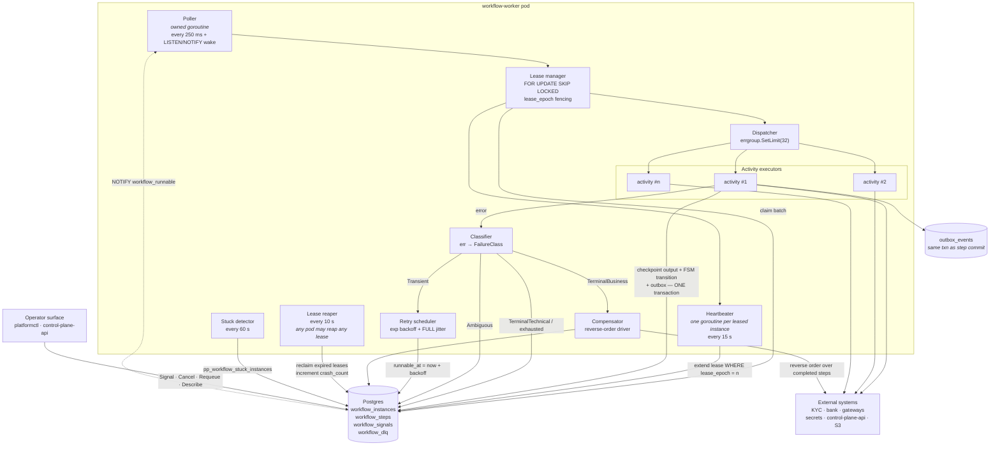
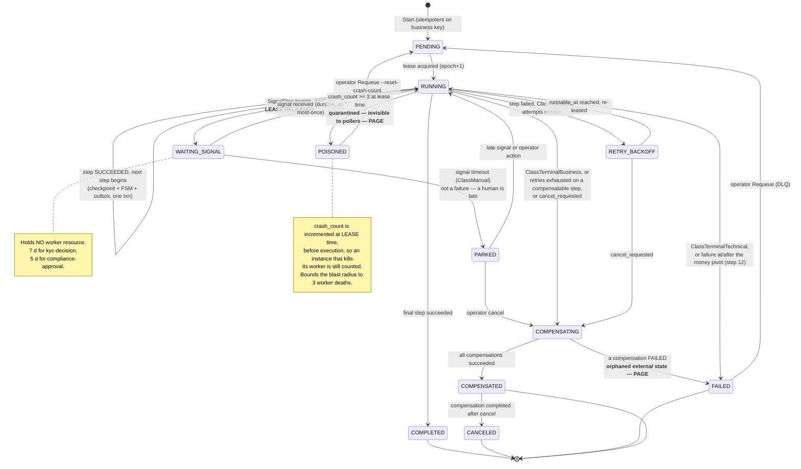

# Automation Plane

> Purpose: the durable workflow/saga engine behind the `WorkflowEngine` port, the `merchant-onboarding@v1` definition in full, the worker execution model, and the guarantees that make a crashed worker safe.
> **Derived from and subordinate to [`docs/spec/00-design-baseline.md`](spec/00-design-baseline.md); see also [`docs/architecture.md`](architecture.md) §2–§3 and [`docs/lld.md`](lld.md) §3.** Where this document disagrees with the baseline, the baseline wins.

---

## 0. Scope

| Property | Value | Source |
|---|---|---|
| Deployable | `workflow-worker` | §5 |
| Bounded context | BC-3 Onboarding | §3 |
| Owns tables | `onboarding_cases`, `workflow_instances`, `workflow_steps`, `workflow_dlq` (+ `workflow_signals`, `workflow_compensations`) | §3 |
| Availability | 99.9 % | §5 |
| Scaling driver | Onboarding volume (low) + retry backlog + DLQ depth | §5 |
| Consistency | **CP.** Workflow state lives in the same database and the same transaction as merchant state | §15 |
| Never | On the payment hot path. A payment never waits on a workflow. | architecture.md §2.3 P1 |

---

## 1. The durable workflow engine

### 1.1 The `WorkflowEngine` port

The port lives in `internal/workflows/engine` and depends only on `internal/domain` and `internal/application/ports`. Two implementations satisfy it: `engine/postgres` (default) and `engine/temporal` (adapter). Nothing in `internal/application/onboarding` knows which is wired.

```go
package engine

// ---------- Definition (declared once, at startup) ----------

type WorkflowType string   // "merchant-onboarding"
type Version int           // 1

type Definition struct {
    Type    WorkflowType
    Version Version
    // BusinessKey extracts the deduplication key from the input. Starting a
    // workflow twice with the same business key is a NO-OP that returns the
    // existing instance (§11: one live instance per merchant).
    BusinessKey func(input []byte) (string, error)
    Steps       []StepDef
    // OnTerminal is invoked inside the same transaction that marks the instance
    // terminal, so a terminal workflow and its domain effect commit together.
    OnTerminal  func(ctx context.Context, tx ports.Tx, inst Instance) error
}

type StepDef struct {
    Name         StepName
    Kind         StepKind          // ActivityStep | SignalStep | FanOutStep
    Activity     Activity          // nil for SignalStep
    Signal       SignalSpec        // zero for ActivityStep
    Timeout      time.Duration     // per ATTEMPT, not per step lifetime
    Retry        RetryPolicy
    Compensation Compensation      // nil when the step is not compensatable
    // Classify maps an activity error to a failure class. A step with no
    // Classify uses DefaultClassify. This is the function that decides
    // retry vs compensate vs DLQ, and it is a first-class part of the
    // definition rather than a property of the error type.
    Classify     func(err error) FailureClass
    // FSM is the merchant state transition this step drives on success.
    // Empty means "no transition". Validated at startup against the
    // domain's transition table.
    FSMOnStart   merchant.State
    FSMOnSuccess merchant.State
    FSMOnFailure merchant.State
}

type StepKind int
const (ActivityStep StepKind = iota; SignalStep; FanOutStep)

// Activity is the unit of side effect. It is given a checkpointed, immutable
// input and returns an output that the engine checkpoints before the next
// step begins.
type Activity interface {
    Name() StepName
    // IdempotencyKey is DETERMINISTIC in (instanceID, stepName) and MUST NOT
    // vary with attempt number. That is what makes a retry after a crash a
    // deduplicated no-op at the external system rather than a duplicate
    // side effect. See §4.4.
    IdempotencyKey(instanceID string, step StepName) string
    Execute(ctx Context, in []byte) ([]byte, error)
}

// Compensation undoes a completed step. It receives the step's checkpointed
// OUTPUT (not its input), because undoing requires the external references
// the step produced.
type Compensation interface {
    Name() StepName
    IdempotencyKey(instanceID string, step StepName) string
    Compensate(ctx Context, stepOutput []byte) error
}

// Context is what an activity sees. It is deliberately NOT context.Context:
// activities need heartbeating and instance identity, and hiding those in
// context values would make them invisible in signatures.
type Context interface {
    context.Context
    InstanceID() string
    TenantID() shared.TenantID
    Step() StepName
    Attempt() int
    // Heartbeat extends the lease and reports optional progress. An activity
    // longer than heartbeatInterval MUST call it; the engine's arithmetic
    // (§4.1) assumes it. Returns ErrLeaseLost if this worker no longer owns
    // the instance — the activity must then abandon its work immediately.
    Heartbeat(ctx context.Context, progress []byte) error
    // Checkpoint persists intermediate progress within a long activity so a
    // resumed attempt can skip completed sub-work (used by fan-out
    // provisioning and by the certification suite).
    Checkpoint(ctx context.Context, key string, value []byte) error
    Lookup(ctx context.Context, key string) ([]byte, bool, error)
}

type RetryPolicy struct {
    MaxAttempts     int
    InitialInterval time.Duration
    MaxInterval     time.Duration
    BackoffFactor   float64       // 2.0
    Jitter          JitterKind    // JitterFull — the only value we use
    NonRetryable    []FailureClass
}

type FailureClass int
const (
    ClassTransient        FailureClass = iota // retry per policy
    ClassTerminalBusiness                     // no retry; compensate; a business "no"
    ClassTerminalTechnical                    // no retry; DLQ; a bug or contract break
    ClassAmbiguous                            // no retry; reconcile via lookup-before-act
    ClassManual                               // needs a human; park, do not fail
)

// ---------- Runtime ----------

type Instance struct {
    ID           string        // wfr_<ULID>
    TenantID     shared.TenantID
    Type         WorkflowType
    Version      Version
    BusinessKey  string
    State        InstanceState
    CurrentStep  StepName
    Input        []byte
    Context      []byte        // accumulated step outputs, checkpointed
    Attempt      int
    CrashCount   int
    LeaseOwner   string
    LeaseEpoch   int64
    LeaseExpires time.Time
    Failure      *FailureRecord
    CreatedAt    time.Time
    CompletedAt  *time.Time
}

type Engine interface {
    // Register validates a definition at STARTUP: every FSM transition it can
    // drive must be legal in the domain's transition table; every
    // compensatable step must declare a Compensation; every step name must be
    // unique. A bad definition fails the process, never a running instance.
    Register(d Definition) error

    // Start is idempotent on (tenantID, type, businessKey). If a live instance
    // exists it is returned unchanged with started=false.
    Start(ctx context.Context, req StartRequest) (inst Instance, started bool, err error)

    // Signal delivers a signal to a waiting instance. Delivery is durable and
    // audited; the signal is recorded even if no step is currently waiting for
    // it, so a signal that races ahead of the wait is not lost.
    Signal(ctx context.Context, instanceID string, sig Signal) error

    // Cancel requests cooperative cancellation. The current activity is
    // allowed to finish or to observe ctx.Done(); compensations then run in
    // reverse order. Cancel never abandons an in-flight side effect.
    Cancel(ctx context.Context, instanceID string, reason string, actor string) error

    // Describe / History back the operator surface (§5.3).
    Describe(ctx context.Context, instanceID string) (InstanceDetail, error)
    History(ctx context.Context, instanceID string) ([]StepRecord, error)

    // Requeue moves a DLQ entry back to RUNNING at the failed step,
    // optionally with a patched step input. Operator action; fully audited.
    Requeue(ctx context.Context, dlqID string, patch *StepInputPatch, actor string) error
}
```

**Two design points worth defending.**

*`Activity.IdempotencyKey` is deterministic in `(instanceID, stepName)` and explicitly not in attempt number.* The instinct is to include the attempt so each try is distinguishable. That instinct produces duplicate side effects: a worker that crashes after calling a vendor but before checkpointing will retry, and with an attempt-varying key the vendor sees a *new* request. With a stable key the vendor dedupes and returns the original result. This is the same reasoning as §14.4's gateway idempotency key.

*`Compensation.Compensate` receives the step's **output**, not its input.* Undoing a provisioning step needs the external account reference the step produced. A compensation that only sees the input would have to re-derive or re-discover the reference, which is both fragile and, in the crash case, impossible.

### 1.2 The Postgres implementation — schema

```sql
CREATE TABLE workflow_instances (
  id                text PRIMARY KEY,                    -- wfr_<ULID>
  tenant_id         text NOT NULL,
  workflow_type     text NOT NULL,
  workflow_version  int  NOT NULL,
  business_key      text NOT NULL,                       -- merchant_id
  state             text NOT NULL,                       -- §6.3
  current_step      text,
  input             jsonb NOT NULL,
  context           jsonb NOT NULL DEFAULT '{}',         -- accumulated step outputs
  attempt           int  NOT NULL DEFAULT 0,
  crash_count       int  NOT NULL DEFAULT 0,             -- §4.3 poison detection
  cancel_requested  boolean NOT NULL DEFAULT false,
  cancel_reason     text,
  lease_owner       text,                                -- pod name + pid + boot id
  lease_epoch       bigint NOT NULL DEFAULT 0,           -- fencing token
  lease_expires_at  timestamptz,
  heartbeat_at      timestamptz,
  runnable_at       timestamptz NOT NULL DEFAULT now(),  -- retry backoff / signal timeout
  failure           jsonb,
  created_at        timestamptz NOT NULL DEFAULT now(),
  updated_at        timestamptz NOT NULL DEFAULT now(),
  completed_at      timestamptz
);

-- One LIVE instance per business key. Terminal instances do not block a restart.
CREATE UNIQUE INDEX wfi_live_business_key
  ON workflow_instances (tenant_id, workflow_type, business_key)
  WHERE state NOT IN ('COMPLETED','FAILED','COMPENSATED','CANCELED');

-- The lease-acquisition index. Partial, so it stays small and hot.
CREATE INDEX wfi_runnable
  ON workflow_instances (runnable_at, id)
  WHERE state IN ('PENDING','RUNNING','RETRY_BACKOFF','COMPENSATING');

CREATE TABLE workflow_steps (
  id                 text PRIMARY KEY,                   -- wfs_<ULID>
  instance_id        text NOT NULL REFERENCES workflow_instances(id),
  step_name          text NOT NULL,
  sequence           int  NOT NULL,                      -- position in the definition
  state              text NOT NULL,                      -- §6.4
  attempt            int  NOT NULL DEFAULT 0,
  idempotency_key    text NOT NULL,                      -- deterministic, §4.4
  input_digest       bytea NOT NULL,                     -- SHA-256, detects definition drift
  output             jsonb,                              -- THE checkpoint
  progress           jsonb,                              -- intra-activity checkpoints
  error              jsonb,                              -- full error chain
  failure_class      text,
  lease_epoch        bigint NOT NULL,                    -- fencing: whose write is this
  started_at         timestamptz,
  timeout_at         timestamptz,
  next_retry_at      timestamptz,
  completed_at       timestamptz,
  compensation_state text,                               -- NULL | PENDING | RUNNING | DONE | FAILED
  compensated_at     timestamptz
);

-- A step executes at most once per (instance, step, attempt).
CREATE UNIQUE INDEX wfs_unique_attempt
  ON workflow_steps (instance_id, step_name, attempt);

CREATE TABLE workflow_signals (
  id            text PRIMARY KEY,
  instance_id   text NOT NULL REFERENCES workflow_instances(id),
  signal_name   text NOT NULL,
  payload       jsonb NOT NULL,
  actor         jsonb NOT NULL,                          -- who signalled; audited
  received_at   timestamptz NOT NULL DEFAULT now(),
  consumed_at   timestamptz
);
-- A signal may be delivered at most once, and may arrive BEFORE the wait begins.
CREATE UNIQUE INDEX wfsig_once ON workflow_signals (instance_id, signal_name);

CREATE TABLE workflow_dlq (
  id             text PRIMARY KEY,
  instance_id    text NOT NULL,
  step_id        text,
  step_name      text,
  tenant_id      text NOT NULL,
  business_key   text NOT NULL,
  failure_class  text NOT NULL,
  error_chain    jsonb NOT NULL,                         -- full wrapped chain, ordered
  step_input     jsonb NOT NULL,                         -- replayable
  instance_ctx   jsonb NOT NULL,
  created_at     timestamptz NOT NULL DEFAULT now(),
  triaged_by     text,
  triaged_at     timestamptz,
  resolution     text                                    -- REQUEUED | ABANDONED | FIXED_FORWARD
);
CREATE INDEX wfdlq_open ON workflow_dlq (created_at) WHERE triaged_at IS NULL;
```

**`context jsonb` is the accumulated output of completed steps**, which is what makes resume *replay-free*: a resuming worker reads `context`, not a history it must fold.

### 1.3 Engine architecture



### 1.4 Lease acquisition

```sql
-- Claim up to $batch runnable instances. Non-blocking by construction.
WITH claimed AS (
  SELECT id
    FROM workflow_instances
   WHERE state IN ('PENDING','RUNNING','RETRY_BACKOFF','COMPENSATING')
     AND runnable_at <= now()
     AND (lease_expires_at IS NULL OR lease_expires_at < now())
     AND crash_count < $poison_threshold          -- never lease a poison instance
   ORDER BY runnable_at
   FOR UPDATE SKIP LOCKED
   LIMIT $batch
)
UPDATE workflow_instances w
   SET lease_owner      = $worker_id,
       lease_epoch      = w.lease_epoch + 1,      -- FENCING TOKEN
       lease_expires_at = now() + $lease_duration,
       heartbeat_at     = now(),
       crash_count      = w.crash_count + 1,      -- optimistic: decremented on
                                                  -- clean step completion (§4.3)
       updated_at       = now()
  FROM claimed
 WHERE w.id = claimed.id
RETURNING w.*;
```

| Element | Why |
|---|---|
| `FOR UPDATE SKIP LOCKED` | Row-level work distribution with no coordinator, no ZooKeeper, no partition assignment. Concurrent workers never block each other; each takes a disjoint set. |
| `lease_epoch + 1` on every acquisition | The **fencing token**. Every subsequent write by that worker carries `WHERE lease_epoch = $n`. A worker whose lease expired and was reclaimed elsewhere writes zero rows — its `UPDATE` silently affects nothing, it detects the zero row count, and it aborts. This is what makes split-brain harmless rather than merely unlikely. |
| `crash_count + 1` **at lease time, before execution** | An instance that kills its worker (OOM, panic, infinite loop) would otherwise never increment a counter, because the increment would be in code that never runs. Incrementing on acquisition and *decrementing on clean step completion* means a worker-killing instance is detected after `$poison_threshold` acquisitions. |
| `crash_count < $poison_threshold` in the predicate | A quarantined instance is invisible to the poller. It cannot be leased again, so it cannot take down a rolling series of workers. |
| `now()` is the **database clock**, everywhere | Lease expiry, timeouts and backoff are all evaluated against one clock. Worker wall clocks are never compared to each other. This removes clock skew from the correctness argument entirely — a worker with a 30-second-fast clock cannot steal a live lease. |
| `runnable_at` in the index predicate | The partial index covers only non-terminal instances, so it stays small (thousands of rows) regardless of how many millions of completed instances accumulate. |
| `LISTEN/NOTIFY` wake | The 250 ms poll is a floor; a newly started or newly signalled instance issues `NOTIFY workflow_runnable` in its commit, so latency is milliseconds in the common case without a tight poll loop. |

### 1.5 Execution semantics

#### Checkpointing and replay-free resume

The engine's contract (§11): *every step's result is checkpointed before the next step begins; resuming an instance replays no completed step.*

Each step commits in **one transaction**:

```sql
BEGIN;
  SET LOCAL app.tenant_id = $tenant;

  UPDATE workflow_steps
     SET state = 'SUCCEEDED', output = $out, completed_at = now()
   WHERE id = $step_id AND lease_epoch = $epoch;     -- fencing
  -- 0 rows → lease lost → abort without side effect on our state

  UPDATE workflow_instances
     SET context      = context || $step_output_fragment,
         current_step = $next_step,
         crash_count  = 0,                            -- progress ⇒ not poison
         lease_expires_at = now() + $lease_duration,
         updated_at   = now()
   WHERE id = $instance_id AND lease_epoch = $epoch;

  UPDATE merchants                                    -- the FSM transition this step drives
     SET state = $fsm_next, version = version + 1
   WHERE id = $merchant_id AND state = $fsm_expected;

  INSERT INTO outbox_events (...) VALUES (...);       -- merchant.kyc_approved.v1 etc.
COMMIT;
```

**The workflow's progress, the merchant's FSM transition, and the domain event commit together.** This is the central benefit of a Postgres-backed engine over an external one (architecture.md TR-4): there is no window in which the workflow believes KYC is approved and the merchant record does not, or in which the merchant is `ACTIVE` but no `merchant.activated.v1` was published.

Resume is then trivial and, importantly, **not a replay**: a worker leasing an instance reads `state`, `current_step` and `context`, and executes the *next* step. It does not re-execute completed steps, does not fold a history, and does not require activity code to be deterministic. (Temporal takes the opposite approach — deterministic replay of workflow code — which is the single biggest conceptual difference between the two implementations; see §1.7.)

#### Retry with exponential backoff and full jitter

```
delay(n) = rand(0, min(MaxInterval, InitialInterval × BackoffFactor^n))
```

**Full jitter, not equal jitter, not a fixed multiplier.** When a vendor has a blip, every affected instance across every worker retries. Deterministic backoff synchronizes them into waves that hit the recovering vendor at exactly the wrong moment. Full jitter is the variant that minimizes both contention and completion time.

Backoff is persisted as `runnable_at`, not held in a timer. A worker that dies during a backoff loses nothing: the instance is simply not runnable until `runnable_at`, and any worker may pick it up then. Timers in memory are lost on restart; a column is not.

`MaxAttempts` counts **attempts**, not retries: `3 × 200 ms` in §11 means three total executions.

#### Per-step timeout

`StepDef.Timeout` is per **attempt**. It is enforced twice, deliberately:

1. **In-process:** the activity receives a `Context` with that deadline. A well-behaved activity returns promptly.
2. **In the database:** `workflow_steps.timeout_at` is set at attempt start. The reaper marks a step `TIMED_OUT` when `timeout_at < now()` and the lease has expired.

Belt and braces, because an activity blocked in a syscall or a non-context-aware library will not observe an in-process deadline. Without the database-side check such a step would hang until the process died.

**A timeout is classified `ClassAmbiguous`, never `ClassTransient`, for any step with an external side effect.** The same reasoning as §12.3 for payments: we do not know whether the vendor acted. Resolution is lookup-before-act on the next attempt (§4.4), never a blind retry.

#### Compensation in strict reverse order

On abort (terminal business failure, retry exhaustion of a compensatable step, or cancellation), the instance enters `COMPENSATING`. The compensator walks `workflow_steps WHERE state = 'SUCCEEDED' ORDER BY sequence DESC` and runs each declared `Compensation`.

| Property | Contract |
|---|---|
| Order | Strict reverse of completion. A webhook registration must be deleted before the sub-account it belongs to is de-provisioned. |
| Input | The step's checkpointed **output** — the external references it produced. |
| Idempotency | Deterministic key on `(instanceID, stepName, "compensate")`. A compensation is retried with the same key, so a crash mid-compensation is safe. |
| Retry | Compensations retry with their own policy (default `5 ×` exponential, cap 5 min) because a failed compensation leaves the world inconsistent and is more urgent than the original failure. |
| Failure | A compensation that exhausts retries sets `compensation_state = 'FAILED'`, moves the instance to `FAILED`, writes a DLQ entry classified `COMPENSATION_FAILED`, and **pages**. This is the highest-severity workflow alert: real external state is now orphaned. |
| Continuation | A failed compensation does **not** stop the remaining compensations. Skipping them would orphan more state. Each failure is recorded separately. |
| Steps with no `Compensation` | Skipped silently. `Compensation == nil` is a *declaration that nothing needs undoing*, validated at registration and reviewed like any other design decision. |

#### Manual gates via signals

A `SignalStep` sets `state = 'WAITING_SIGNAL'`, sets `runnable_at` to the step timeout, and **releases the lease**. This matters: a 5-day compliance review or a 7-day KYC wait holds **no worker resource at all**. Holding a lease for days would be a resource leak and would make the lease/heartbeat arithmetic meaningless.

| Property | Contract |
|---|---|
| Delivery | `POST /v1/merchants/{merchantId}/onboarding/signals/{signal}`, scope `onboarding:approve`, `Idempotency-Key` required |
| Durability | The signal row is inserted in the same transaction that makes the instance runnable and `NOTIFY`s the pollers |
| Early arrival | `workflow_signals` has a unique index on `(instance_id, signal_name)` and no requirement that a wait be active. A signal arriving before the wait begins is recorded and consumed the instant the wait starts. Losing a racing signal is a classic bug in naive implementations; the table shape prevents it. |
| At-most-once consumption | `consumed_at` is set in the transaction that advances the step |
| Audit | The signal's actor, scopes, source IP, reason and payload are written to `audit_records` (§11: *the signal is itself audited*) |
| Timeout | Reaching `runnable_at` without a signal classifies the step `ClassManual`-timed-out: the instance is **parked**, not failed, and an operator alert fires. A compliance review that nobody performed is not a system failure. |

#### Cancellation

`Cancel` sets `cancel_requested = true` and `NOTIFY`s. It is **cooperative**:

- Between steps, the engine observes the flag and moves to `COMPENSATING`.
- During a step, the activity's `Context` is cancelled; the activity may return promptly or finish its current external call.
- **An in-flight external call is never abandoned.** Abandoning it produces exactly the ambiguity of §12.3 — we would not know whether the side effect happened, and we would then need a reconciliation path we do not otherwise need. Waiting out an 8-second call is cheaper than owning an unknown.
- After the current step settles, compensation runs in reverse order, then the instance reaches `CANCELED`.
- Cancellation reason and actor are audited.

### 1.6 The Temporal adapter

`internal/workflows/engine/temporal` implements the same `Engine` interface. `internal/workflows/onboarding` — the definition and its activities — is **unchanged** between implementations. That is the payoff of the port, and it is what makes TR-4 a reversible decision.

The adapter maps our concepts onto Temporal's:

| Our concept | Temporal concept | Notes on the mapping |
|---|---|---|
| `Definition` (`merchant-onboarding@v1`) | Workflow Type + a generated workflow function that drives the step list | The workflow function is *generated from* the `Definition`, so the definition remains the single source of truth |
| `Version` | Workflow Type name suffix + `GetVersion` for in-flight changes | Temporal's patching model; ours is "new version, new definition, old instances finish on the old one" |
| `Instance` | Workflow Execution | |
| `BusinessKey` (`merchant_id`) | Workflow ID + `WorkflowIDReusePolicy: AllowDuplicateFailedOnly` | Gives us the same "starting twice is a no-op" semantics |
| `StepDef` / `Activity` | Activity Type | 1:1 |
| Step **checkpoint** (`workflow_steps.output`) | Activity result recorded in Event History | Same guarantee, different storage |
| **Replay-free resume** (read `context`, run next step) | **Deterministic replay** of workflow code, activities not re-executed | *The fundamental difference.* Temporal re-executes the *workflow function* deterministically and short-circuits completed activities from history. Ours never re-executes anything. Consequence: Temporal imposes determinism constraints on workflow code (no `time.Now`, no `rand`, no map iteration, no direct I/O); we impose none, because we never replay |
| `LeaseEpoch` fencing | Activity task token validity + workflow task versioning | Temporal rejects a stale task token; we reject a stale epoch |
| `lease_duration` | `ScheduleToStartTimeout` + `StartToCloseTimeout` + `HeartbeatTimeout` | Ours is one lease covering the instance; Temporal's are three per-activity timeouts |
| `Context.Heartbeat` | `activity.RecordHeartbeat` | 1:1, including "heartbeat details" ≈ our `progress` |
| `Context.Checkpoint` / `Lookup` | Heartbeat details + `activity.GetHeartbeatDetails` | Same idea |
| `RetryPolicy` | `temporal.RetryPolicy` (`InitialInterval`, `BackoffCoefficient`, `MaximumInterval`, `MaximumAttempts`, `NonRetryableErrorTypes`) | Near 1:1. **Temporal jitter is fixed at ±20 %**, not full jitter — a real behavioural difference under vendor-wide blips |
| `FailureClass` | `NonRetryableErrorTypes` + `ApplicationError` type strings | Our classifier is a function; Temporal's is a type list. Ours can classify on error *content* (an HTTP status inside a wrapped chain); Temporal's needs the class encoded in the error type |
| `Compensation`, reverse order | **No native construct.** Implemented as an explicit saga/`defer` stack in generated workflow code | Temporal has no first-class compensation. Our generated code maintains the stack |
| `SignalStep` | `workflow.GetSignalChannel` + `workflow.Await` with a timer | 1:1, including durable early-arriving signals |
| `Cancel` | Cancellation scope + `CancelWorkflow` | 1:1 |
| `workflow_dlq` | **No native DLQ.** A terminally failed Workflow Execution + a custom archival/requeue handler | Ours is a first-class table with a triage workflow |
| `Requeue` | `ResetWorkflowExecution` to an event ID, or a new execution seeded from history | Temporal's reset is more powerful; ours is simpler to reason about |
| Operator surface | Temporal Web UI + `tctl` | Theirs is far better out of the box; this is Temporal's strongest single argument |
| Audit | Event History + Search Attributes | Ours is `audit_records`, hash-chained, in the same store and the same retention regime as everything else |
| **Transactional coupling to domain state** | **Not available.** An activity commits to our database; the workflow's progress commits to Temporal's. Two stores, two commits | *The fundamental cost.* Our step commit updates `workflow_steps`, `workflow_instances`, `merchants` and `outbox_events` in one transaction. With Temporal, "activity succeeded" and "merchant is KYC_APPROVED" are two commits with a window between them, and closing that window requires making every activity idempotent against its own partial completion — which we must do anyway, but here it becomes load-bearing rather than defence-in-depth |

#### When to choose each

| Choose the **Postgres engine** when | Choose **Temporal** when |
|---|---|
| Workflow progress must commit atomically with domain state (our case: step 3's KYC approval and the merchant's `KYC_APPROVED` transition) | Workflows span systems that do not share a database |
| Volume is low (tens to hundreds of instances/day) and the engine's cost is dominated by *our* code, not by throughput | Volume is high (thousands/second) or workflows are long-lived at large fan-out |
| The workflow catalogue is small and stable (one definition, twelve steps) | Many teams author many workflows and need a shared platform |
| We want zero additional stateful infrastructure and one backup/DR story | Running one more stateful cluster (or paying for Temporal Cloud) is acceptable |
| Activity code should be free of determinism constraints | The team is disciplined about determinism, or the workflows need Temporal's timers/child-workflows/continue-as-new |
| Auditability must live in our own hash-chained store under our own retention policy | Temporal's Event History plus archival is sufficient for audit |
| **Trigger to switch:** > 3 distinct workflow definitions, or > 10⁵ instances/day, or a workflow that must span a system without a shared database | |

The port means switching costs an adapter and a migration of live instances (drain the old engine, start new instances on the new one), **not a rewrite of the onboarding definition**.

---

## 2. Saga, not 2PC/XA

### 2.1 Why not 2PC/XA

| Requirement of XA | Reality of onboarding |
|---|---|
| Every participant implements `prepare`/`commit`/`rollback` | Stripe, Adyen, PayPal, the KYC vendor and the bank validator expose ordinary HTTP APIs. None of them offers a prepare phase. **This alone ends the discussion** — the remaining rows are why we would not want it even if they did. |
| Participants hold locks between prepare and commit | Step 3 waits up to **7 days** for a KYC decision. A coordinator holding a prepared transaction across seven days would pin database resources, block vacuum, and make any coordinator restart a catastrophe. |
| A blocking coordinator is acceptable | A coordinator crash after prepare leaves every participant blocked and holding locks until it recovers. On a 99.9 % automation plane, that is a guaranteed recurring incident. |
| Uniform failure semantics | KYC "denied" is not a *rollback*; it is a legitimate business outcome that must be recorded, retained for ≥ 5 years, and surfaced to the merchant. XA has no vocabulary for "the transaction correctly concluded that the answer is no". |
| Cross-system atomicity is what we need | We need **eventual consistency with explicit, auditable compensation**, and intermediate states that are *visible* — a merchant is legitimately `KYC_PENDING` for days, and that is a state the product exposes, not an implementation artefact to be hidden. |

### 2.2 What saga gives us instead

| Property | Consequence |
|---|---|
| Each step commits independently | No distributed locks. No blocking coordinator. A worker crash costs a lease timeout, not a stuck fleet. |
| Failure is explicit and classified | `FailureClass` drives retry vs compensate vs DLQ. XA gives one bit. |
| Compensation is business logic, reviewed as such | "De-provision the sub-account" is a real operation with real semantics, written and tested by the team that owns provisioning. |
| Intermediate states are first-class | They map directly onto the merchant FSM (§8), which is what the product exposes and what operators reason about. |
| Long waits are free | A signal wait holds no resource. |
| **Cost:** intermediate states are visible; compensations can themselves fail; some steps cannot be compensated | §2.3 handles the last one, which is the interesting one. |

### 2.3 Non-compensatable steps and the pivot

The textbook saga is *compensatable transactions → **pivot** → retriable transactions*. Onboarding has **two independent irreversibility dimensions**, and conflating them produces a wrong design.

#### Dimension 1 — external/regulatory irreversibility. Pivot: **step 3, KYC decision received.**

| Why it is a pivot | Consequence |
|---|---|
| Submitting a merchant's principals to a regulated KYC vendor creates a record the vendor **must retain**. Our compensation "cancel KYC case" stops the *process*; it cannot un-submit the data. | Steps 1–2 are genuinely reversible: cancel the case, and the world is as it was. |
| The decision and its evidence are retained ≥ 5 years, immutable, in object storage with Object Lock (§17.3), under a legal-obligation basis. | Once the decision lands, there is nothing to compensate — the record is *supposed* to persist. |
| GDPR erasure of the merchant is crypto-shredding of the tenant data key, with financial and AML records retained under legal obligation (§17.3) — not deletion. | "Undo the onboarding" and "erase the merchant" are different operations with different legal bases. Conflating them would be a compliance defect. |

**Design consequence:** after step 3, aborting the saga produces a merchant in a *failed* terminal state with a retained KYC record — never a merchant that looks as though it never applied. `TERMINATED` (§8) is the terminal state, and it is reached with the KYC evidence intact.

#### Dimension 2 — money-path irreversibility. Pivot: **step 12, `activate`.**

| Why it is a pivot | Consequence |
|---|---|
| Once the merchant is `ACTIVE`, real payments can exist. §8: `→ TERMINATED` requires **zero payments in a non-terminal state**. | The saga cannot unilaterally undo activation; a payment in flight has its own lifecycle that must complete. |
| The declared compensation for step 12 is `suspend merchant` (`ACTIVE → SUSPENDED`), which is **forward recovery, not rollback**: suspension rejects new payments but deliberately permits refunds, voids and webhook processing (§8). | This is correct and intentional. "Undoing" activation by blocking refunds would trap merchant money. |

**Design consequence:** aborting at or after step 12 is **roll-forward only**. The engine suspends, raises an operator case, and leaves termination to a separate, guarded process that waits for payment quiescence.

#### The full classification

| Steps | Class | Behaviour on abort |
|---|---|---|
| 1 `validate-merchant` | **Compensatable (no-op)** — pure, no side effect | Nothing to undo |
| 2 `submit-kyc` | **Compensatable** — cancel the vendor case | Case cancelled; submitted data persists (dimension-1 caveat) |
| **3 `await-kyc-decision`** | **PIVOT (dimension 1)** | Decision is a retained regulated record. Compensation cancels a *pending* case only; once decided, nothing to undo |
| 4 `validate-bank-account` | **Non-compensatable, harmless** — a read-only verification | No compensation declared (§11 shows `—`); nothing was created |
| 5 `provision-gateways` | **Compensatable** — de-provision sub-account | Full undo |
| 6 `store-credentials` | **Compensatable** — delete secret version | Full undo |
| 7 `register-webhooks` | **Compensatable** — delete webhook registration | Full undo |
| 8 `apply-configuration` | **Compensatable** — roll back to the previous configuration version, which itself publishes a *new* version (control-plane.md §3.3) | Full undo, append-only history preserved |
| 9 `sandbox-validation` | **Retriable, non-compensatable** — sandbox transactions against a sandbox account | Nothing to undo; sandbox activity is inert by construction |
| 10 `certification` | **Retriable, non-compensatable** — produces a signed, immutable `CertificationReport` in object storage | The report is *evidence* and is meant to survive. It is marked superseded, never deleted |
| 11 `compliance-review` | **Retriable, non-compensatable** — a human decision, audited | A human decision is a record, not a mutation |
| **12 `activate`** | **PIVOT (dimension 2)** | Compensation is `suspend`, i.e. forward recovery. No rollback |

#### The rule the engine enforces

```
abort before step 3 decision   → full compensation; merchant → TERMINATED,
                                 world is as it was
abort between 3 and 12         → compensate steps 8→5 in reverse order;
                                 merchant → the FSM's failure state for the
                                 step that failed; KYC record retained
abort at or after step 12      → NO rollback. Suspend, raise an operator case,
                                 do not attempt to de-provision a merchant
                                 that may have live payments
```

`Definition.Register` validates this at startup: a step marked as post-pivot may not declare a `Compensation` that mutates external state destructively, and a compensatable step must declare a `Compensation`. A definition violating either fails the process, not an instance.

---

## 3. `merchant-onboarding@v1` in full

Workflow type `merchant-onboarding`, version `1`. Business key `merchant_id` — starting it twice returns the existing instance unchanged (`started=false`).

Common conventions for the tables below:

- **Idempotency key** is always deterministic in `(instance_id, step_name)` and never varies with attempt (§1.1). Written as `K = HMAC-SHA256(instance_id ‖ step_name, workflow_salt)` truncated to 32 Base32 chars.
- **Retry** notation matches §11: `n × exp a→b` means `n` total attempts, exponential backoff with full jitter from `a` capped at `b`.
- **FSM** columns name the merchant transition the step drives; all are validated against `internal/domain/merchant`'s transition table at registration.

### Step 1 — `validate-merchant`

| Field | Value |
|---|---|
| Activity contract | `Execute(ctx Context, in ValidateMerchantInput) (ValidateMerchantOutput, error)` |
| Implementation | Validation Plane **L2** (`internal/validation/rules/l2merchant`), pure |
| Input | `{merchantId, tenantId, businessProfile, requestedCountries, requestedCurrencies, requestedPaymentMethods, selectedGateways}` |
| Output | `{valid: true, ruleOutcomes: [...], normalizedProfile: {...}}` |
| Idempotency | Pure function — inherently idempotent. `K` recorded for uniformity |
| Timeout | **5 s** |
| Retry | **3 × 200 ms** (a pure step retries only to absorb a transient database read) |
| Compensation | **None** — nothing was created |
| Failure classification | Rule failure → `ClassTerminalBusiness`; DB error → `ClassTransient` |
| FSM | on start `CREATED → VALIDATING`; on success no transition; on terminal failure `VALIDATING → VALIDATION_FAILED` |
| Events | `merchant.validated.v1` on success |
| Notes | Runs first and is pure so that a malformed merchant is rejected **before** any external side effect exists to compensate. Everything statically detectable is detected here. |

### Step 2 — `submit-kyc`

| Field | Value |
|---|---|
| Activity contract | `Execute(ctx Context, in SubmitKYCInput) (SubmitKYCOutput, error)`; port `ports.KYCProvider.Submit(ctx, KYCCase) (VendorRef, error)` |
| Input | `{merchantId, legalEntity, principals[], documents[] (S3 refs), jurisdiction}` |
| Output | `{vendorCaseRef, submittedAt, expectedDecisionBy}` |
| Idempotency | **Vendor reference key** — `K` is sent as the vendor's client-reference field. The vendor dedupes and returns the existing case. Before submitting, the activity performs **lookup-before-act**: `KYCProvider.FindByClientRef(K)`; a hit short-circuits to the existing case |
| Timeout | **30 s** per attempt |
| Retry | **5 × exp 1 s → 60 s**, full jitter |
| Compensation | **`cancel KYC case`** — `KYCProvider.CancelCase(vendorCaseRef)`, idempotent, safe if already cancelled or already decided |
| Failure classification | 5xx / network → `ClassTransient`; vendor timeout → `ClassAmbiguous` (resolved by lookup-before-act on the next attempt); 4xx validation → `ClassTerminalBusiness`; 401/403 → `ClassTerminalTechnical` (our credentials are wrong — a deploy problem, not a merchant problem) |
| FSM | on success `VALIDATING → KYC_PENDING`; on terminal failure `VALIDATING → VALIDATION_FAILED` |
| Events | — |
| Notes | PII leaves our system here. Documents are passed as pre-signed S3 references, never inlined, so PII never enters the workflow `context` column and therefore never enters a workflow diagnostic export. |

### Step 3 — `await-kyc-decision` · **PIVOT (dimension 1)**

| Field | Value |
|---|---|
| Kind | **`SignalStep`** — no activity, no lease held |
| Signal | `kyc-decision`, payload `{decision: APPROVED|REJECTED|MORE_INFO, reasonCodes[], evidenceRef, decidedAt}` |
| Source | KYC vendor webhook (signature-verified, translated by an ACL) or an operator via `POST .../onboarding/signals/kyc-decision` |
| Idempotency | Unique index `(instance_id, 'kyc-decision')`. A duplicate vendor webhook is a no-op |
| Timeout | **7 d** |
| Retry | **n/a** |
| Compensation | `cancel KYC case` — meaningful only while the case is still pending |
| Failure classification | `REJECTED` → `ClassTerminalBusiness`; `MORE_INFO` → parks the instance and notifies the merchant (**not** a failure); 7-day expiry → `ClassManual`, instance parked, operator alert |
| FSM | `APPROVED` → `KYC_PENDING → KYC_APPROVED`; `REJECTED` → `KYC_PENDING → KYC_FAILED` |
| Events | `merchant.kyc_approved.v1` / `merchant.kyc_failed.v1` |
| Notes | **This is the pivot for dimension 1.** After a decision lands, the record is retained ≥ 5 years under Object Lock and there is nothing to compensate. `KYC_FAILED → KYC_PENDING` is a legal transition (§8), so a resubmission starts a **new** workflow instance rather than resurrecting this one — keeping each instance a single, auditable attempt. |

### Step 4 — `validate-bank-account`

| Field | Value |
|---|---|
| Activity contract | `ports.BankValidator.Validate(ctx, BankAccount) (BankValidationResult, error)` |
| Input | `{merchantId, accountRef (tokenized), country, currency, holderName}` |
| Output | `{validated: bool, method: PENNY_DROP|OPEN_BANKING|DIRECTORY, matchScore, validatedAt}` |
| Idempotency | Vendor reference key `K`; lookup-before-act by client reference. **Critical for penny-drop**: a duplicate submission would initiate a second micro-deposit |
| Timeout | **30 s** |
| Retry | **5 × exp 1 s → 60 s** |
| Compensation | **None** — a verification creates nothing to undo (§11 shows `—`) |
| Failure classification | Network/5xx → `ClassTransient`; timeout → `ClassAmbiguous`; account-not-found / name-mismatch → `ClassTerminalBusiness`; malformed request → `ClassTerminalTechnical` |
| FSM | on success `KYC_APPROVED → BANK_VALIDATED`; on terminal failure `KYC_APPROVED → BANK_VALIDATION_FAILED` |
| Events | `merchant.bank_validated.v1` |
| Notes | `BANK_VALIDATION_FAILED → KYC_APPROVED` (retry with a new account, §8) is driven by an operator or merchant action that starts a fresh instance. Account numbers are tokenized before reaching the workflow. |

### Step 5 — `provision-gateways`

| Field | Value |
|---|---|
| Kind | **`FanOutStep`** — one sub-execution per selected gateway, concurrent, bounded at 4 |
| Activity contract | `spi.Provisioner.Provision(ctx, ProvisionRequest) (ProvisionResult, error)` |
| Input | `{merchantId, gateways[], businessProfile, bankAccountRef, countries, currencies, paymentMethods}` |
| Output | `{connections: [{gatewayId, externalRef, subAccountId, status, provisionedAt}]}` |
| Idempotency | **External reference key** — `K ‖ gatewayId` is sent as the gateway's idempotency/reference field. **Lookup-before-act** is mandatory: `Provisioner.FindByReference(K‖gatewayId)` before any create, because a duplicate sub-account is expensive to clean up and visible to the merchant |
| Per-branch checkpoint | Each gateway's result is written via `Context.Checkpoint(gatewayId, result)` as it completes, so a crash mid-fan-out does not re-provision the gateways that already succeeded |
| Timeout | **60 s** per attempt (covers the whole fan-out; individual gateway calls get 30 s) |
| Retry | **5 × exp 1 s → 60 s**, **per branch** — one failing gateway does not retry the successful ones |
| Compensation | **`de-provision sub-account`** — `Provisioner.Deprovision(externalRef)` per successfully provisioned gateway, in reverse completion order, idempotent |
| Failure classification | Gateway 5xx/network → `ClassTransient`; timeout → `ClassAmbiguous` (→ lookup-before-act); rejected business profile / unsupported country → `ClassTerminalBusiness`; our credentials invalid → `ClassTerminalTechnical` |
| Partial success | If ≥ 1 gateway provisions and ≥ 1 fails terminally, the step succeeds with a **degraded** result **if** the remaining set still satisfies `L4.ROUTING_CAPABILITY_COVERAGE` for the merchant's declared corridors; otherwise the step fails. Judged by the pure coverage rule, not by a count |
| FSM | on start `BANK_VALIDATED → GATEWAY_PROVISIONING`; on terminal failure `GATEWAY_PROVISIONING → PROVISIONING_FAILED` |
| Events | `merchant.gateway_provisioned.v1` per gateway |

### Step 6 — `store-credentials`

| Field | Value |
|---|---|
| Activity contract | `ports.Secrets.Put(ctx, SecretRef, crypto.Secret[GatewayCredential]) (Version, error)` |
| Input | `{merchantId, credentials: [{gatewayId, material: Secret[...]}]}` — material arrives from step 5's output and is `Secret[T]`-wrapped end to end |
| Output | `{refs: [{gatewayId, secretRef, version, fingerprint}]}` — **references and fingerprints only; never material** |
| Idempotency | Secrets Manager `PutSecretValue` with `ClientRequestToken = K‖gatewayId`. A retry with the same token returns the existing version rather than creating a new one |
| Timeout | **10 s** |
| Retry | **3 × exp 1 s → 10 s** |
| Compensation | **`delete secret version`** — `Secrets.DeleteVersion(ref, version)`; scheduled deletion with a 30-day recovery window, never immediate destruction |
| Failure classification | KMS/Secrets Manager throttling → `ClassTransient`; access denied → `ClassTerminalTechnical` (IAM misconfiguration); quota exhausted → `ClassTerminalTechnical` with a distinct alert |
| FSM | none (inside `GATEWAY_PROVISIONING`) |
| Events | — |
| Notes | The step's **output must never contain material**. A unit test marshals the output and asserts it contains only `secret://` references and fingerprints, because this output is checkpointed into `workflow_instances.context` and would otherwise be readable by anyone with database access — defeating the entire §5 split in control-plane.md. |

### Step 7 — `register-webhooks`

| Field | Value |
|---|---|
| Activity contract | `spi.WebhookRegistrar.RegisterWebhook(ctx, RegisterWebhookRequest) (WebhookRegistration, error)` |
| Input | `{merchantId, connections[], callbackUrl (our webhook-ingress URL), events[], secretRef}` |
| Output | `{registrations: [{gatewayId, registrationRef, url, events[], signingSecretRef}]}` |
| Idempotency | External reference `K‖gatewayId`; **lookup-before-act** via `ListWebhooks`, since most gateways permit duplicate registrations and duplicates cause duplicate webhook deliveries (harmless thanks to `webhook_dedup`, but noisy and rate-limit-consuming) |
| Timeout | **30 s** |
| Retry | **5 × exp 1 s → 60 s** |
| Compensation | **`delete webhook registration`** — `DeleteWebhook(registrationRef)`, idempotent |
| Failure classification | 5xx/network → `ClassTransient`; timeout → `ClassAmbiguous`; URL rejected (not HTTPS, unreachable) → `ClassTerminalTechnical` (our configuration is wrong); quota exceeded → `ClassTerminalBusiness` |
| FSM | on success `GATEWAY_PROVISIONING → CONFIGURING`; on terminal failure `GATEWAY_PROVISIONING → PROVISIONING_FAILED` |
| Events | — |
| Notes | Registered **before** any sandbox transaction, so certification's *"a webhook is received, signature-verified, and moves the payment state"* assertion (§11.4) can actually be tested. Registering after certification would make that assertion unverifiable. |

### Step 8 — `apply-configuration`

| Field | Value |
|---|---|
| Activity contract | Synchronous gRPC to `control-plane-api`: `PublishConfiguration(ctx, req) (ConfigurationVersion, error)` |
| Input | The §23 configuration document assembled from steps 1, 5 and 7 outputs, plus tenant defaults |
| Output | `{configVersion, etag, digest, publishedAt}` |
| Idempotency | **Version-based** — `Idempotency-Key = K`, plus `If-Match` on the merchant's current ETag. A retry replays the stored `200` and does **not** create a duplicate version (control-plane.md §3.2) |
| Timeout | **10 s** |
| Retry | **3 × exp 1 s → 10 s** |
| Compensation | **`roll back to previous version`** — `POST .../configuration/rollback {toVersion: n-1}`, which itself publishes a **new** version (append-only history) |
| Failure classification | `422 CONFIGURATION_INVALID` → `ClassTerminalBusiness` (L4 rejected our assembled document; the failing rule IDs go into the DLQ entry); `412` → `ClassTransient` (someone else published concurrently — re-read and retry); `503` → `ClassTransient` |
| FSM | on success `CONFIGURING → SANDBOX_VALIDATION`; on terminal failure `CONFIGURING → CONFIGURATION_FAILED` |
| Events | `configuration.published.v1` (emitted by the control plane) |
| Notes | This is boundary **B8** (architecture.md §4.4): synchronous on purpose, because a compensatable step needs an unambiguous success/failure verdict. If it were asynchronous, compensation would have to first *determine* whether the configuration had been applied. |

### Step 9 — `sandbox-validation`

| Field | Value |
|---|---|
| Activity contract | `ports.CertificationRunner.Run(ctx, RunSpec) (RunResult, error)` — sandbox subset |
| Input | `{merchantId, runId, matrix: [(gateway, paymentMethod, currency)], environment: "sandbox"}` |
| Output | `{runId, passed, assertions: [{id, matrixCell, passed, detail}], reportRef (S3)}` |
| Idempotency | **Run id** — `runId = K`. A retry with the same `runId` resumes from the last per-cell checkpoint rather than re-running the whole matrix |
| Intra-activity checkpointing | `Context.Checkpoint(matrixCellKey, cellResult)` after each cell. A 15-minute activity that crashes at minute 12 resumes at cell *n*, not cell 0 |
| Timeout | **15 m** per attempt; heartbeat every 15 s |
| Retry | **2 ×** |
| Compensation | **None** (§11 shows `—`) — sandbox transactions are inert |
| Failure classification | Assertion failure → `ClassTerminalBusiness`; infrastructure error → `ClassTransient`; gateway sandbox down → `ClassTransient` with an extended backoff cap (10 min) |
| FSM | on success `SANDBOX_VALIDATION → CERTIFICATION`; on failure `SANDBOX_VALIDATION → CONFIGURATION_FAILED` |
| Events | — |
| Notes | The longest activity in the workflow, and the reason `Context.Heartbeat` exists. Without heartbeating, a 15-minute activity would exceed a 60-second lease and be reclaimed mid-run by another worker. |

### Step 10 — `certification`

| Field | Value |
|---|---|
| Activity contract | `ports.CertificationRunner.Run(ctx, RunSpec) (RunResult, error)` — **full matrix** (§11.4) |
| Input | `{merchantId, runId, full matrix over every enabled (gateway, paymentMethod, currency)}` |
| Output | `{runId, passed, report: CertificationReport (signed), reportRef (S3, Object Lock)}` |
| Assertions | Exactly §11.4: authorize→capture→refund round trip; authorize→void; declined test card yields a mapped `DECLINED` with a normalized reason code; a webhook is received, signature-verified, and moves the payment state; 3DS reaches `REQUIRES_ACTION` and completes; duplicate submission with the same idempotency key returns the same result; amount/currency echoed match what we sent |
| Idempotency | Run id `K`; per-cell checkpointing as in step 9 |
| Timeout | **30 m** per attempt; heartbeat every 15 s |
| Retry | **2 ×** |
| Compensation | **None** — the report is immutable evidence and is meant to survive. A superseded report is marked superseded, never deleted |
| Failure classification | Assertion failure → `ClassTerminalBusiness` with the failing assertion IDs; infrastructure → `ClassTransient` |
| FSM | on success `CERTIFICATION → APPROVED`; on failure `CERTIFICATION → CERTIFICATION_FAILED` |
| Events | `merchant.certified.v1` |
| Notes | The signed report is referenced from the merchant record; **`PRODUCTION_READY` is unreachable without a passing report** (§11.4). `CERTIFICATION_FAILED → CONFIGURING` (§8) means a remediation path re-enters at step 8 via a new instance. |

### Step 11 — `compliance-review`

| Field | Value |
|---|---|
| Kind | **`SignalStep`** — manual gate, no lease held |
| Signal | `compliance-approval`, payload `{decision: APPROVE|REJECT, reviewerId, reason, attestationRef}` |
| Auth | `POST .../onboarding/signals/compliance-approval`, scope `onboarding:approve`, `Idempotency-Key` required |
| Idempotency | Unique index `(instance_id, 'compliance-approval')` |
| Timeout | **5 d** |
| Retry | **n/a** |
| Compensation | **None** — a human decision is a record |
| Failure classification | `REJECT` → `ClassTerminalBusiness`; 5-day expiry → `ClassManual`, instance **parked** (not failed), escalation alert |
| FSM | `APPROVE` → `APPROVED → PRODUCTION_READY`. `REJECT` → **see the note below** |
| Events | — |
| Audit | The signal, its actor, scopes, source IP, reason and attestation reference are written to `audit_records` (§11: *the signal is itself audited*) |

> **Modelling gap, flagged rather than papered over.** §8's transition table gives `APPROVED` exactly one outgoing transition: `APPROVED → PRODUCTION_READY`. A compliance **rejection** therefore has no legal destination state. This implementation obeys the baseline: on `REJECT` the merchant **stays in `APPROVED`**, the workflow instance transitions to `FAILED`, compensations run for steps 8→5, a compliance exception is raised, and the merchant cannot reach `ACTIVE` (the `→ ACTIVE` guard requires a completed compliance attestation, which does not exist). It is deliberately **not** advanced to `PRODUCTION_READY`-then-`SUSPENDED`, which would be a legal path but a lie in the audit trail — the record would show a merchant that was production-ready when compliance had in fact refused. **Proposed baseline amendment (ADR required, not applied here):** add a `COMPLIANCE_REJECTED` state with `APPROVED → COMPLIANCE_REJECTED` and `COMPLIANCE_REJECTED → {CERTIFICATION, TERMINATED}`. Until the baseline is amended, the behaviour above stands.

### Step 12 — `activate` · **PIVOT (dimension 2)**

| Field | Value |
|---|---|
| Activity contract | `merchant.TransitionTo(ACTIVE, guards, now)` via `application/merchant` |
| Input | `{merchantId}` |
| Output | `{activatedAt, guardsEvaluated: {certifiedConnections: n, configVersion: v, attestationRef, openCriticalExceptions: 0}}` |
| Guards (§8, all required) | ≥ 1 `GatewayConnection` in `CERTIFIED`; a non-empty validated `MerchantConfiguration`; a completed compliance attestation; **no open critical reconciliation exception** |
| Idempotency | FSM-inherent — `PRODUCTION_READY → ACTIVE` applied twice is a no-op returning the current state (`CanTransitionTo(ACTIVE, ACTIVE)` is false, and the activity treats "already ACTIVE" as success) |
| Timeout | **5 s** |
| Retry | **3 × exp 200 ms → 2 s** |
| Compensation | **`suspend merchant`** (`ACTIVE → SUSPENDED`) — **forward recovery, not rollback** |
| Failure classification | Guard failure → `ClassTerminalBusiness` with the specific unmet guard; DB error → `ClassTransient` |
| FSM | `PRODUCTION_READY → ACTIVE` |
| Events | `merchant.activated.v1` — consumed by the data-plane cache (§13.2), which is what actually lets payments through |
| Notes | Guards are re-evaluated **at activation time**, not trusted from earlier steps. A certification that expired, or a critical reconciliation exception opened while compliance review was pending, blocks activation. This is the last synchronous check before real money is possible, and it is the correct place to be paranoid. |

### 3.1 Onboarding saga sequence, with a compensation path

```mermaid
sequenceDiagram
    autonumber
    participant OPS as Tenant / Operator
    participant CP as control-plane-api
    participant EN as WorkflowEngine (postgres)
    participant WW as workflow-worker
    participant KYC as KYC vendor
    participant BNK as Bank validator
    participant GW as Gateways
    participant SM as Secrets Manager
    participant PG as Postgres

    OPS->>CP: POST /v1/merchants/{id}/onboarding
    CP->>EN: Start(merchant-onboarding@v1, businessKey=mrc_…)
    EN->>PG: INSERT workflow_instances (unique on live business key)
    EN-->>CP: wfr_… started=true
    CP-->>OPS: 202 Accepted

    WW->>PG: lease (FOR UPDATE SKIP LOCKED, epoch+1)
    WW->>WW: 1 validate-merchant (L2, pure, 5 s)
    WW->>PG: checkpoint · merchants CREATED→VALIDATING · outbox merchant.validated.v1 — ONE TXN

    WW->>KYC: 2 submit-kyc (lookup-before-act by K)
    KYC-->>WW: vendorCaseRef
    WW->>PG: checkpoint · VALIDATING→KYC_PENDING — ONE TXN

    Note over WW,PG: 3 await-kyc-decision — SignalStep.<br/>LEASE RELEASED. 7-day timeout.<br/>Zero worker resource held.
    KYC-->>CP: webhook: APPROVED
    CP->>EN: Signal(kyc-decision, APPROVED)
    EN->>PG: INSERT workflow_signals · runnable_at = now · NOTIFY
    Note over EN: ◆ PIVOT (dimension 1):<br/>the decision is a retained regulated record

    WW->>PG: re-lease (new epoch)
    WW->>PG: KYC_PENDING→KYC_APPROVED · outbox merchant.kyc_approved.v1
    WW->>BNK: 4 validate-bank-account
    BNK-->>WW: validated
    WW->>PG: KYC_APPROVED→BANK_VALIDATED

    WW->>GW: 5 provision-gateways (fan-out, per-branch checkpoint)
    GW-->>WW: stripe ✓ · adyen ✓
    WW->>PG: BANK_VALIDATED→GATEWAY_PROVISIONING · checkpoint connections
    WW->>SM: 6 store-credentials (ClientRequestToken = K‖gatewayId)
    SM-->>WW: v1 refs (references + fingerprints only)
    WW->>GW: 7 register-webhooks (lookup-before-act via ListWebhooks)
    GW-->>WW: registrationRefs
    WW->>PG: GATEWAY_PROVISIONING→CONFIGURING
    WW->>CP: 8 apply-configuration (If-Match + Idempotency-Key)
    CP-->>WW: configVersion 1
    WW->>PG: CONFIGURING→SANDBOX_VALIDATION

    rect rgb(70,35,35)
    Note over WW,GW: FAILURE — step 9 sandbox-validation
    WW->>GW: 9 sandbox-validation (15 m, heartbeat 15 s, per-cell checkpoint)
    GW-->>WW: assertion failed — refund round-trip returns UNSUPPORTED for EUR/CARD on adyen
    WW->>WW: retry 1 of 2 → same deterministic failure
    WW->>WW: Classify → ClassTerminalBusiness (not transient)
    WW->>PG: step FAILED · instance → COMPENSATING · SANDBOX_VALIDATION→CONFIGURATION_FAILED
    end

    rect rgb(70,50,35)
    Note over WW,SM: COMPENSATION — strict reverse order, 8 → 5
    WW->>CP: compensate 8: rollback to configuration version 0<br/>(publishes a NEW version — append-only)
    CP-->>WW: ok
    WW->>GW: compensate 7: DeleteWebhook(registrationRef) × 2
    GW-->>WW: ok (idempotent)
    WW->>SM: compensate 6: DeleteVersion (30-day recovery window)
    SM-->>WW: scheduled
    WW->>GW: compensate 5: Deprovision(externalRef) × 2 — reverse completion order
    GW-->>WW: ok
    Note over WW: Steps 4, 3, 2, 1 have no compensation:<br/>4 created nothing; 3 is PAST THE PIVOT —<br/>the KYC record is retained by law.
    WW->>PG: instance → FAILED · DLQ entry with the full error chain
    WW->>PG: outbox: onboarding.failed.v1 · audit record
    end

    OPS->>CP: GET .../onboarding
    CP-->>OPS: CONFIGURATION_FAILED · step 9 · assertion ids ·<br/>compensations: 4 done, 0 failed · DLQ id
    Note over OPS: Remediate (drop EUR/CARD on adyen or fix the<br/>connection), then start a NEW instance.<br/>CONFIGURATION_FAILED → CONFIGURING is legal (§8).
```

---

## 4. Worker execution model

### 4.1 Lease, heartbeat and visibility arithmetic

| Symbol | Value | Meaning |
|---|---|---|
| `L` lease duration | **60 s** | How long a lease is valid without a heartbeat |
| `H` heartbeat interval | **15 s** | `L / 4` |
| `M` missed heartbeats tolerated | **2** | |
| `R` reaper scan interval | **10 s** | How often expired leases are reclaimed |
| `S` clock-skew allowance | **0 s** | **Not needed** — all times come from `now()` on the database, so there is exactly one clock |
| `V` visibility timeout (worst-case takeover) | **`L + R` = 70 s** | Time from a silent worker death to another worker owning the instance |
| `T_step` per-attempt step timeout | 5 s – 30 m | §3 |
| `G` shutdown grace | **120 s** | lld.md §2.5 |

**The constraints, and why each holds:**

```
(1)  H × (M + 1) < L
     15 × 3 = 45 < 60                              ✓ 15 s of margin

     A worker that misses two heartbeats still owns its lease. Only three
     consecutive misses — 45 s of silence — put it at risk. This tolerates a
     GC pause, a brief database hiccup, and a transient network partition
     without a spurious takeover. A spurious takeover is not a correctness
     problem (fencing handles it) but it wastes work and looks like an
     incident.

(2)  V = L + R = 60 + 10 = 70 s
     Worst case from silent death to takeover. Acceptable because onboarding
     latency is measured in minutes (§18: ≤ 30 min p95 for the automated
     portion) and 70 s is 4 % of that budget.

(3)  T_step may EXCEED L, provided the activity heartbeats.
     Certification: T_step = 30 m, L = 60 s.
     Heartbeats every 15 s extend the lease to now() + L each time, so the
     lease never expires during a healthy long activity.
     Required: the activity calls Heartbeat at least every (L − H) = 45 s.
     Our activities call it every 15 s — a 3× margin.

(4)  Graceful shutdown must release leases FASTER than they expire:
     G = 120 s ≫ L = 60 s, and shutdown releases leases EXPLICITLY.
     A rolling deploy therefore costs ~0 s of takeover latency instead of
     up to V = 70 s per instance. Explicit release is what makes deploys
     invisible in the onboarding-duration histogram.

(5)  Reaper cost: the partial index wfi_runnable covers only non-terminal
     instances (thousands of rows at 50 000 merchants), so a 10 s scan is
     an index-only scan costing microseconds. R could be lowered; 10 s is
     chosen because there is no benefit to reclaiming faster than the
     250 ms poll can dispatch.
```

**Fencing is what makes all of this safe.** Suppose worker A is paused by a 90-second GC pause (violating constraint 1). Its lease expires; the reaper reclaims it; worker B leases it with `lease_epoch = n+1`. Worker A then wakes and tries to commit its step result with `WHERE lease_epoch = n`. **Zero rows are affected.** Worker A observes the zero row count, logs `ErrLeaseLost`, increments `pp_workflow_lease_lost_total`, and abandons the instance without having corrupted anything. The system does not depend on the arithmetic being right; the arithmetic only determines how *often* the safe-but-wasteful path is taken.

### 4.2 The poller and dispatcher

| Component | Owner | Goroutines | Behaviour |
|---|---|---|---|
| Poller | `Worker` | 1 | Every 250 ms, or on `NOTIFY workflow_runnable`. Claims `min(batch, free_slots)` where `batch = 16` |
| Dispatcher | `Worker` | `errgroup.SetLimit(32)` | 32 concurrent activities per pod. Bounded queue = the leased set itself; there is no separate queue |
| Heartbeater | `Worker` | 1 per leased instance | Ticks at 15 s; on `ErrLeaseLost` cancels the activity's context immediately |
| Reaper | `Worker` | 1 | Every 10 s; any pod may reap any expired lease — no leader election |
| Stuck detector | `Worker` | 1 | Every 60 s (§5.2) |

**Backpressure is the lease model itself.** When all 32 slots are busy the poller claims nothing. Unclaimed instances stay in the table with `runnable_at` in the past — visible, durable, and countable. `pp_workflow_runnable_backlog` is the HPA signal. There is no in-memory queue to overflow, no work to lose on a crash, and no unbounded growth: the "queue" is a Postgres table with a partial index, and its depth is a first-class metric.

**Fairness.** `ORDER BY runnable_at` is FIFO on readiness. To stop one tenant's bulk import from starving others, the claim query in the bulk-import case is partitioned by tenant using a window function that caps per-tenant claims at `ceil(batch / active_tenants)`. This is off by default (it costs a window scan) and enabled by a flag when a bulk import is scheduled.

### 4.3 Poison-instance handling

A **poison instance** is one that damages its worker rather than merely failing: a panic in activity code, an OOM from an unexpectedly large payload, an infinite loop, or a pathological input that wedges a driver.

Ordinary failure handling never sees it, because the code that would record the failure is the code that died.

| Mechanism | Detail |
|---|---|
| **Increment before execute** | `crash_count` is incremented **in the lease-acquisition UPDATE**, before any activity runs. A worker-killing instance increments a counter even though it never executes a line of our failure-handling code. |
| **Decrement on progress** | A successful step commit sets `crash_count = 0`. Progress proves the instance is not poison. |
| **Quarantine threshold** | `crash_count ≥ 3` → the lease query's `crash_count < $poison_threshold` predicate makes the instance invisible to every poller. It is set to `POISONED`, written to the DLQ classified `POISON_INSTANCE`, and **pages**. |
| **Blast radius bound** | At most `3 × pods_that_leased_it` worker deaths, and in practice 3, before the instance is quarantined. Without this a single poison instance would cycle the entire fleet indefinitely — the classic poison-message fleet outage. |
| **Panic containment** | Every activity executes inside a `recover()` that converts the panic into `ClassTerminalTechnical` with the stack in the error chain, increments `pp_panics_total`, and lets the worker continue. This catches most cases *before* `crash_count` is needed; the counter is the backstop for what `recover` cannot catch (OOM kill, `SIGKILL`, a stack overflow). |
| **Memory guard** | Activity inputs are size-capped (1 MiB) at checkpoint time, so an oversized document cannot OOM a worker. Documents travel as S3 references. |
| **Recovery** | An operator triages the DLQ entry, fixes the cause, and `Requeue`s with an optional patched step input; requeue resets `crash_count` to 0. |

### 4.4 The guarantee: a crashed worker never causes a duplicate side effect

This is the central correctness claim of the automation plane. It rests on **four** mechanisms, not one — because any single mechanism has a hole.

```
┌─ 1. DETERMINISTIC IDEMPOTENCY KEY ────────────────────────────────────────┐
│ K = HMAC-SHA256(instance_id ‖ step_name, workflow_salt)[:32]              │
│ Stable across attempts, across workers, across process restarts, and      │
│ recomputable from the row after a total loss of process memory.           │
│ Sent to the external system as its idempotency / client-reference field.  │
│ ⇒ A retry after a crash is DEDUPLICATED BY THE VENDOR.                    │
│ Hole: not every vendor honours idempotency keys on every endpoint.        │
└──────────────────────────────────────────────────────────────────────────┘
┌─ 2. LOOKUP-BEFORE-ACT ───────────────────────────────────────────────────┐
│ Every activity with a create-shaped side effect queries first:           │
│   FindByClientRef(K) → if found, return it as the result; do not create. │
│ Covers vendors that do not dedupe, and vendors that dedupe on some        │
│ endpoints but not others.                                                 │
│ ⇒ A retry after a crash FINDS ITS OWN PRIOR EFFECT.                       │
│ Hole: a lookup can race with a create that is still propagating.          │
└──────────────────────────────────────────────────────────────────────────┘
┌─ 3. FENCING TOKEN (lease_epoch) ─────────────────────────────────────────┐
│ Every write carries WHERE lease_epoch = $n. A resurrected worker whose    │
│ lease was reclaimed writes ZERO rows and aborts.                          │
│ ⇒ Two workers can never both commit progress for one instance,            │
│   so a step is never marked done twice, and the FSM never advances twice. │
│ Hole: fencing protects OUR state, not the vendor's.                       │
└──────────────────────────────────────────────────────────────────────────┘
┌─ 4. CHECKPOINT-AFTER, IN ONE TRANSACTION ────────────────────────────────┐
│ The step output, the instance context, the merchant FSM transition and    │
│ the outbox event commit TOGETHER, after the side effect.                  │
│ ⇒ There is no state where a step is "done" but its domain effect is not,  │
│   or where an event was published but the step rolled back.               │
│ Hole: the window between side effect and commit — closed by 1 and 2.      │
└──────────────────────────────────────────────────────────────────────────┘
```

**Walk the crash windows:**

| Crash point | What the vendor has | What we have | On resume | Duplicate? |
|---|---|---|---|---|
| Before the external call | nothing | step `RUNNING`, attempt *n* | Re-execute; lookup-before-act finds nothing; create with `K` | **No** |
| **After the call, before the response** | the effect | step `RUNNING`, no output | Re-execute; **lookup-before-act finds the effect by `K`** and returns it as the result; or the vendor dedupes on `K` | **No** — this is the window that mechanisms 1 and 2 exist for |
| After the response, before commit | the effect | step `RUNNING`, no output | Same as above | **No** |
| Mid-commit | the effect | transaction rolled back atomically | Same as above | **No** |
| After commit, before the next step | the effect | step `SUCCEEDED` with output checkpointed | Resume reads `context`, runs the **next** step. **Replay-free.** | **No** |
| Zombie worker returns after takeover | the effect (once) | new worker owns `lease_epoch = n+1` | Zombie's write matches zero rows; it aborts. New worker's lookup-before-act finds the effect | **No** |
| Mid-fan-out (step 5, 2 of 4 gateways done) | 2 effects | 2 per-branch checkpoints via `Context.Checkpoint` | Resume skips the 2 checkpointed branches; for the others, lookup-before-act | **No** |
| Mid-compensation | some undone | `compensation_state` per step | Compensations are idempotent on `K‖"compensate"`; re-running a completed one is a no-op | **No** |

**What we do *not* claim.** We do not claim exactly-once *delivery* — that is not achievable across a process boundary (A8). We claim **effectively-once business effect**, achieved by idempotent activities plus deterministic keys plus fencing plus transactional checkpointing, exactly as §13.5 achieves it for event consumption. And, as there, the last line of defence is a database invariant: the unique index `(instance_id, step_name, attempt)` on `workflow_steps` means even a bug in the above cannot record the same attempt twice.

**Ambiguity is never resolved by guessing.** A step timeout classified `ClassAmbiguous` does **not** retry blindly. The next attempt begins with lookup-before-act; if the lookup itself is inconclusive, the step is parked as `ClassManual` with an operator alert. This mirrors §12.3's rule for payments, and for the same reason: an unknown outcome resolved by assumption is how duplicate side effects reach production.

### 4.5 Backpressure when the queue grows

| Stage | Signal | Response |
|---|---|---|
| Normal | `pp_workflow_runnable_backlog` < 50 | — |
| Elevated | backlog > 50 for 5 min | HPA scales `workflow-worker` (min 2 → max 8) |
| High | backlog > 500 | Scale to max; **enable per-tenant fair-share claiming** (§4.2) so a bulk import cannot starve interactive onboardings |
| Saturated | backlog > 2000 or growing while at max pods | Admission control: `POST .../onboarding` returns `429 RATE_LIMITED` with `Retry-After` computed from `backlog / drain_rate`. **Rejecting a start is cheap and honest; accepting one we cannot run for an hour is not.** Alert. |
| Vendor-bound | backlog high but activity concurrency low and `pp_workflow_step_retries_total{step="submit-kyc"}` climbing | Scaling workers will **not** help — we are blocked on a vendor. Alert names the vendor; the runbook says do not scale. Extend the backoff cap for that step's policy via configuration. |

The last row is the one that matters operationally: the naive response to a growing queue is "add workers", which against a rate-limited vendor makes things strictly worse. The metric pair (backlog high, concurrency low, retries climbing) distinguishes the two cases automatically, and the alert carries the diagnosis rather than the raw number.

### 4.6 DLQ triage runbook

**Entry criteria.** A DLQ row is written when: a step exhausts its retries with `ClassTransient`; a step fails with `ClassTerminalTechnical`; a compensation fails; an instance is quarantined as `POISON_INSTANCE`; or a signal step times out with `ClassManual`.

**Alerting.** `pp_dlq_depth{queue="workflow"}` > 0 for 15 min → ticket. Any `COMPENSATION_FAILED` or `POISON_INSTANCE` → **page immediately** (orphaned external state, or a fleet-damaging instance).

**Triage, in order:**

| # | Question | How | Action |
|---|---|---|---|
| 1 | What failed, and is external state orphaned? | `platformctl workflow dlq show <id>` — step, class, full ordered error chain, step input, instance context, compensation states | If `COMPENSATION_FAILED`: **stop and handle this first.** A sub-account, webhook or secret exists that we believe does not. Go to row 7. |
| 2 | Is it one instance or many? | `platformctl workflow dlq list --group-by step,class --since 1h` | Many with the same class → systemic (vendor outage, expired credentials, a bad deploy). Fix the cause; do **not** requeue one at a time |
| 3 | Is it transient-exhausted? | class = `ClassTransient`, error chain shows 5xx/timeouts | Verify the dependency is healthy (`GET /v1/gateways/{id}/health`, vendor status), then `platformctl workflow dlq requeue <id>` |
| 4 | Is it a business rejection? | class = `ClassTerminalBusiness` | **Not an engineering failure.** Notify the merchant with the specific reason (rule IDs / assertion IDs are in the payload). Resolve `ABANDONED`. Remediation is a **new** instance after the merchant corrects the input |
| 5 | Is it our bug or our misconfiguration? | class = `ClassTerminalTechnical` — 401/403 to a vendor, malformed request, panic stack | Fix forward. If it is credentials, run the rotation workflow. If it is code, the requeue must wait for the deploy — requeuing onto a known-broken binary just re-fills the DLQ |
| 6 | Is it ambiguous? | class = `ClassAmbiguous` | **Never requeue blindly.** Run `platformctl workflow probe <id>` which executes lookup-before-act for that step and reports what the vendor actually has. Then requeue (the lookup makes it a no-op) or patch the step input with the discovered reference and requeue |
| 7 | Compensation failed | `compensation_state = FAILED` | Identify the orphaned resource from the step output (external ref). Attempt manual cleanup via `platformctl gateway deprovision --ref …` / `secrets delete-version` / `webhook delete`. If the vendor is down, **record the orphan in the reconciliation exception register** so the drift detector (architecture.md §3.2 Loop 3) picks it up when the vendor recovers. Never mark it resolved without either cleaning up or registering it |
| 8 | Poison instance | class = `POISON_INSTANCE` | Reproduce locally with the checkpointed input (it is in the DLQ row). Almost always an unhandled panic or an oversized payload. Fix, deploy, then requeue with `--reset-crash-count` |
| 9 | Signal timeout | class = `ClassManual` | Chase the human. The instance is **parked**, not failed — a signal delivered now resumes it normally. Only abandon if the review is genuinely never coming |

**Resolution is mandatory.** Every DLQ row must reach `REQUEUED`, `ABANDONED` or `FIXED_FORWARD` with `triaged_by` and `triaged_at` set. `pp_dlq_untriaged_age_seconds` alerts at 24 h. An untriaged DLQ is an outage nobody has noticed yet.

---

## 5. Observability of workflows

### 5.1 Metrics

Baseline metrics (§22.2), plus the engine-specific series required to operate it. Cardinality rule (§22.3) holds throughout: **`merchant_id` and `payment_id` are never labels**; they appear in logs, traces and exemplars.

| Metric | Type | Labels | Purpose |
|---|---|---|---|
| `pp_workflow_step_duration_seconds` | histogram | `workflow,step,outcome` | §22.2. p99 per step feeds the stuck detector's thresholds |
| `pp_workflow_instances` | gauge | `workflow,state` | §22.2. Live distribution across the state machine |
| `pp_onboarding_duration_seconds` | histogram | `outcome` | §22.2. The `≤ 30 min p95 automated portion` SLI (§18) — computed **excluding** time in `WAITING_SIGNAL`, since the external KYC SLA is explicitly out of scope |
| `pp_dlq_depth` | gauge | `queue` | §22.2 |
| `pp_workflow_runnable_backlog` | gauge | `workflow` | HPA signal + §4.5 |
| `pp_workflow_lease_acquisitions_total` | counter | `workflow,outcome` | `outcome ∈ {acquired, contended}` |
| `pp_workflow_lease_expirations_total` | counter | `workflow` | Reaper reclaims. A rising rate means workers are dying or overloaded |
| `pp_workflow_lease_lost_total` | counter | `workflow,step` | Fencing rejections — a zombie worker tried to write. Should be ~0; non-zero means constraint (1) in §4.1 is being violated |
| `pp_workflow_step_retries_total` | counter | `workflow,step,class` | Split by `FailureClass`; the vendor-bound detector in §4.5 |
| `pp_workflow_compensations_total` | counter | `workflow,step,outcome` | `outcome ∈ {succeeded, failed}` |
| `pp_workflow_poison_quarantines_total` | counter | `workflow` | Any increment pages |
| `pp_workflow_stuck_instances` | gauge | `workflow,step` | §5.2 |
| `pp_workflow_signal_waits` | gauge | `workflow,signal` | How many instances are parked on each gate; the compliance-review backlog |
| `pp_workflow_signal_wait_age_seconds` | histogram | `workflow,signal` | How long humans are taking |
| `pp_workflow_activity_concurrency` | gauge | `workflow` | Used slots of 32; distinguishes "worker-bound" from "vendor-bound" |
| `pp_dlq_untriaged_age_seconds` | gauge | `queue` | Oldest untriaged entry |

**Tracing.** One trace spans the whole instance: a root span per instance, a child span per step attempt, and a grandchild per external call. The trace context is checkpointed into `workflow_instances.context` so a resumed step **continues the original trace** rather than starting a new one — a 7-day onboarding is a single, navigable trace. Span attributes carry `instance_id`, `step`, `attempt`, `lease_epoch`, `failure_class`.

**Logs.** Every workflow log line carries `instance_id`, `business_key`, `step`, `attempt`, `lease_epoch`, `worker_id`, plus the mandatory context of §22.1. `lease_epoch` in logs is what makes a split-brain investigation tractable — two workers logging the same instance with different epochs is immediately visible.

### 5.2 The stuck-workflow detector

A workflow that is *failing* is visible. A workflow that is **silently not progressing** is not, and is the failure mode that lets an onboarding sit for three days before a customer asks about it.

Runs every 60 s in every worker (idempotent; results are a gauge, so duplicate evaluation is harmless).

An instance is **stuck** when **all** hold:

| # | Condition | Reason |
|---|---|---|
| 1 | `state ∈ {PENDING, RUNNING, RETRY_BACKOFF, COMPENSATING}` | Terminal instances are not stuck |
| 2 | `state ≠ WAITING_SIGNAL` | A signal wait is *supposed* to be long; it has its own timeout and its own metric (`pp_workflow_signal_wait_age_seconds`). Counting it as stuck would drown the signal in noise |
| 3 | `now() − updated_at > threshold(step)` | See below |
| 4 | `runnable_at < now()` | It should be runnable and is not being picked up |
| 5 | `crash_count < poison_threshold` | Quarantined instances have their own alert |

```
threshold(step) = max( 15 min,
                       3 × p99(pp_workflow_step_duration_seconds{step}),
                       2 × step.Timeout × step.Retry.MaxAttempts )
```

The threshold is derived from the step's own observed behaviour, so a 30-minute certification is not flagged at the same threshold as a 5-second activation, and the thresholds adapt as vendor latencies drift instead of needing manual retuning.

**What being stuck usually means, in order of likelihood:**

| Cause | Distinguishing signal | Fix |
|---|---|---|
| No worker capacity | `pp_workflow_runnable_backlog` high, `pp_workflow_activity_concurrency` at 32 | Scale (§4.5) |
| All workers dead or crash-looping | `pp_workflow_lease_acquisitions_total` flat at zero | Investigate the deployment |
| Lease held by a zombie that is neither progressing nor dying | `lease_expires_at` far in the future, `heartbeat_at` recent, `updated_at` old — heartbeating but not working | The worst case, and the reason the detector checks `updated_at` rather than `heartbeat_at`. Restart the pod named in `lease_owner`; the explicit lease release on shutdown makes takeover immediate |
| A `runnable_at` far in the future from a backoff bug | `runnable_at − now()` exceeds `MaxInterval` | Code defect; `platformctl workflow reschedule <id> --now` |
| Poison instance just below threshold | `crash_count = 2` | Watch; it quarantines on the next acquisition |
| Database contention on the lease query | Lease acquisitions slow, `contended` outcome rising | Index/vacuum investigation |

**Alerting.** `pp_workflow_stuck_instances > 0` for 10 min → ticket. `> 5` or any instance stuck > 1 h → page. The alert carries the instance IDs and `lease_owner` values so the responder starts from a pod name rather than a query.

### 5.3 Operator surface

Two front doors over the same `Engine` methods and the same audit trail. Every mutating operation requires a scope, an `Idempotency-Key`, and a `reason`, and writes an `audit_records` entry.

| Operation | `platformctl` | API | Scope | Audited |
|---|---|---|---|---|
| Describe an instance | `workflow describe <id>` | `GET /v1/merchants/{id}/onboarding` | `onboarding:read` | read-audit |
| Step history with error chains | `workflow history <id>` | `GET .../onboarding/history` | `onboarding:read` | read-audit |
| List by state / step / age / tenant | `workflow list --state RETRY_BACKOFF --older-than 1h` | `GET /v1/workflows?...` | `onboarding:read` | — |
| **Signal a gate** | `workflow signal <id> compliance-approval --decision APPROVE --reason …` | `POST .../onboarding/signals/{signal}` | `onboarding:approve` | ✅ actor, scopes, IP, reason, payload |
| **Cancel** | `workflow cancel <id> --reason …` | `POST .../onboarding:cancel` | `onboarding:write` | ✅ |
| **Requeue from DLQ** | `workflow dlq requeue <id> [--patch f.json] [--reset-crash-count]` | `POST /v1/workflows/dlq/{id}:requeue` | `onboarding:admin` | ✅ including the patch diff |
| DLQ list / show | `workflow dlq list|show` | `GET /v1/workflows/dlq` | `onboarding:read` | — |
| **Probe an ambiguous step** | `workflow probe <id>` — runs lookup-before-act and reports what the vendor has | — | `onboarding:admin` | ✅ |
| **Reschedule** | `workflow reschedule <id> --now` | — | `onboarding:admin` | ✅ |
| **Force-release a lease** | `workflow release-lease <id>` — bumps `lease_epoch`, fencing the current holder out | — | `onboarding:admin` | ✅ |
| Replay a compensation | `workflow compensate <id> --step register-webhooks` | — | `onboarding:admin` | ✅ |
| Export an instance for support | `workflow export <id>` — full state, **redacted** | — | `onboarding:admin` | ✅ |

**Constraints on the operator surface, stated as rules:**

| Rule | Why |
|---|---|
| There is **no** "force the merchant to `ACTIVE`" command | Every FSM transition goes through the domain's guards. A break-glass activation would bypass certification and compliance — the two things that exist to stop a merchant processing money they should not. If a merchant must be activated, the guards must be satisfied. |
| There is **no** "edit the instance context" command | Arbitrary state mutation makes the audit trail meaningless and the workflow's invariants unenforceable. `Requeue --patch` patches a **step input**, is diffed, and is audited. |
| There is **no** "skip a step" command | Skipping `certification` or `compliance-review` is precisely the action the control is designed to prevent. The remediation path is to fix the cause and re-run. |
| `workflow export` redacts | `Secret[T]` renders `[REDACTED]`; PII fields are allowlist-filtered; document contents are S3 references. A support export must be safe to attach to a ticket. |
| Every mutating command requires `--reason` | It lands in the audit record. An operator action with no recorded reason is unreviewable six months later. |

---

## 6. State machines

### 6.1 Workflow instance



### 6.2 Workflow step

```mermaid
stateDiagram-v2
    [*] --> PENDING : instance reaches this step

    PENDING --> RUNNING : attempt n starts<br/>timeout_at = now + StepDef.Timeout<br/>lease_epoch stamped

    RUNNING --> SUCCEEDED : activity returned, output checkpointed<br/>+ merchant FSM transition + outbox — ONE TXN
    RUNNING --> FAILED : activity returned an error
    RUNNING --> TIMED_OUT : timeout_at passed<br/>(enforced in-process AND by the reaper)
    RUNNING --> LEASE_LOST : fencing rejected the write<br/>(WHERE lease_epoch = n matched 0 rows)

    LEASE_LOST --> PENDING : another worker owns it;<br/>this worker abandons without side effect

    FAILED --> RETRY_SCHEDULED : ClassTransient and attempts remain<br/>next_retry_at = now + rand(0, min(cap, base*2^n))
    TIMED_OUT --> RETRY_SCHEDULED : only for steps with NO external side effect
    TIMED_OUT --> AMBIGUOUS : any step WITH an external side effect

    RETRY_SCHEDULED --> RUNNING : attempt n+1<br/><b>SAME deterministic idempotency key</b>

    AMBIGUOUS --> RUNNING : next attempt begins with LOOKUP-BEFORE-ACT
    AMBIGUOUS --> DLQ : lookup inconclusive → ClassManual

    FAILED --> DLQ : ClassTerminalTechnical,<br/>or ClassTransient with attempts exhausted
    FAILED --> COMPENSATING_PEERS : ClassTerminalBusiness<br/>(instance aborts; peers compensate)

    SUCCEEDED --> COMPENSATING : instance aborted; reverse-order walk
    COMPENSATING --> COMPENSATED : compensation succeeded (idempotent on K‖"compensate")
    COMPENSATING --> COMPENSATION_FAILED : retries exhausted<br/><b>orphaned external state — PAGE</b>

    SUCCEEDED --> [*]
    COMPENSATED --> [*]
    DLQ --> PENDING : operator Requeue (optional input patch)

    note right of RETRY_SCHEDULED
        Backoff lives in next_retry_at (a COLUMN),
        never an in-memory timer. A worker that dies
        during backoff loses nothing.
    end note

    note right of AMBIGUOUS
        A timeout on a step with a side effect is
        NEVER a blind retry. Same rule as §12.3
        for payments: we do not guess whether
        the external system acted.
    end note
```

### 6.3 Instance states — reference

| State | Leased? | Runnable? | Meaning |
|---|---|---|---|
| `PENDING` | no | yes | Created or requeued; awaiting first lease |
| `RUNNING` | **yes** | — | A worker owns it and is executing a step |
| `RETRY_BACKOFF` | no | at `runnable_at` | Transient failure; waiting out jittered backoff |
| `WAITING_SIGNAL` | **no** | at timeout | Parked on a manual/external gate. Zero resource held |
| `PARKED` | no | on signal | Signal timed out; a human is late. Not a failure |
| `COMPENSATING` | **yes** | — | Walking completed steps in reverse |
| `COMPLETED` | no | no | Terminal, success |
| `COMPENSATED` | no | no | Terminal, cleanly undone |
| `CANCELED` | no | no | Terminal, cancelled and compensated |
| `FAILED` | no | no | Terminal, failed. DLQ entry exists |
| `POISONED` | no | **no** | Quarantined; invisible to pollers; requires operator action |

### 6.4 Step states — reference

| State | Meaning |
|---|---|
| `PENDING` | Not yet attempted |
| `RUNNING` | Attempt *n* in flight; `timeout_at` set; `lease_epoch` stamped |
| `SUCCEEDED` | Output checkpointed; the transaction that recorded it also moved the merchant FSM and wrote the outbox row |
| `FAILED` | Attempt returned an error; awaiting classification |
| `TIMED_OUT` | `timeout_at` passed |
| `AMBIGUOUS` | Timed out with an external side effect; next attempt does lookup-before-act |
| `LEASE_LOST` | A fenced write matched zero rows; this worker abandoned it |
| `RETRY_SCHEDULED` | `next_retry_at` set; the same deterministic key will be reused |
| `DLQ` | Parked for operator triage |
| `COMPENSATING` / `COMPENSATED` / `COMPENSATION_FAILED` | Compensation lifecycle |
| `SKIPPED` | Not applicable for this instance (e.g. a fan-out branch for an unselected gateway) |

---

## 7. Cross-references

| Topic | Document |
|---|---|
| Canonical baseline (binding) | [`docs/spec/00-design-baseline.md`](spec/00-design-baseline.md) — §11 workflow, §8 merchant FSM, §11.4 certification |
| Plane model, control loop, saga vs 2PC trade-off (TR-5), engine build-vs-buy (TR-4) | [`docs/architecture.md`](architecture.md) |
| Goroutine ownership, bounded queues, shutdown and lease release | [`docs/lld.md`](lld.md) §2.5, §3 |
| Step 8's target, credential rotation workflow, pivot in rotation | [`docs/control-plane.md`](control-plane.md) §3, §5.3 |
| L2/L3/L4 rule catalogue | `docs/validation-plane.md` |
