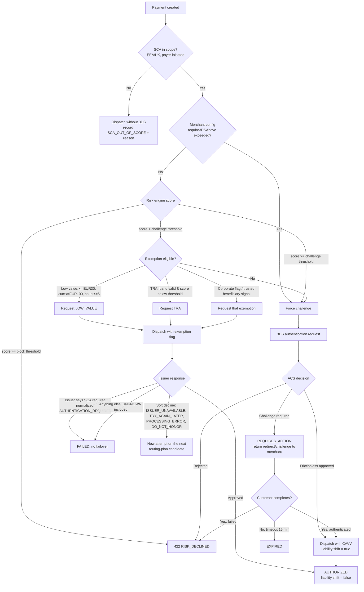

# Compliance

> **Purpose:** the regulatory position of the platform — PCI DSS scope and its enforcement, PSD2/SCA, GDPR, AML/KYC, retention, and the auditability design that makes all of it evidenceable.
> **Derived from:** `docs/spec/00-design-baseline.md` §17 (PCI scope boundary and regulatory boundaries), with §13 (events), §16 (multi-tenancy), §23 (configuration), §24 (failure catalog). Where this document and the baseline disagree, the baseline wins and this document is a defect.

The two decisions everything else follows from are baseline A1 (**we do not take custody of funds** — we are a technical orchestrator, not a payment institution) and A2 (**the API does not accept raw card data** — tokens only). Together they keep the platform out of e-money licensing and out of PCI SAQ-D.

---

## 1. PCI DSS scope boundary

### 1.1 The boundary and the data flows

```
┌── OUT OF SCOPE ─────────────────────────────────────────────────────────────┐
│                                                                              │
│  Cardholder ──PAN──► Gateway-hosted fields / SDK (Stripe.js, Adyen Web       │
│                      Components, PayPal SDK) — served from the GATEWAY's     │
│                      origin, inside an iframe we do not script into          │
│                              │                                               │
│                              │ tokenize (browser → gateway, direct)          │
│                              ▼                                               │
│                      token: tok_… / network token / pm_…                     │
│                              │                                               │
│  Merchant server ◄───────────┘                                               │
│        │                                                                     │
│        │ POST /v1/payments { paymentMethodToken, amount, currency, … }       │
│        ▼                                                                     │
│  ┌──────────────────────────────────────────────────────────────────────┐   │
│  │ payment-api → payment-orchestrator → gateway adapter → GATEWAY       │   │
│  │ 8 of 9 services. Handle: token references, amounts, IDs, last-4      │   │
│  │ and brand as GATEWAY-SUPPLIED DISPLAY FIELDS. Never PAN, CVV, track. │   │
│  └──────────────────────────────────────────────────────────────────────┘   │
│                                                                              │
└──────────────────────────────────────────────────────────────────────────────┘
                               │ token reference only, never PAN
┌── IN SCOPE (optional, segregated, NOT in this repository) ───────────────────┐
│  card-vault: separate AWS account, VPC, cluster, HSM/KMS, change control,    │
│  its own SAQ-D assessment and its own QSA engagement.                        │
└──────────────────────────────────────────────────────────────────────────────┘
```

**Flow A — tokenized payment (the only supported flow).** Cardholder enters the PAN into gateway-hosted fields rendered in the gateway's own iframe. The browser posts the PAN directly to the gateway; it never transits the merchant's page DOM in a way we can read, and it never reaches our infrastructure. The gateway returns a token. The merchant's server sends us the token. We dispatch. The PAN exists only between the cardholder's browser and the gateway.

**Flow B — network token / card-on-file.** Merchant supplies a stored payment-method reference issued by the gateway. Same property: no PAN.

**Flow C — MIT / recurring.** We supply the stored reference plus the scheme's MIT indicators. Same property.

**Flow D — webhook inbound.** The gateway posts an event containing the payment reference, amount, outcome, and typically `last4` + `brand` + `exp_month/exp_year`. Under PCI DSS, the PAN's last four digits are explicitly permitted to be stored and displayed; expiry and brand are cardholder data elements that may be stored when there is a business need and they are protected. We store them encrypted, we do not log them, and we never store them together with anything that would reconstruct a PAN — because nothing can.

**Flow E — settlement report ingest.** Aggregate financial records from the gateway. Masked references only.

### 1.2 Why each service is out of scope

Scope, under PCI DSS v4.0, attaches to systems that store, process or transmit account data, and to systems connected to or that could impact the security of those systems. The argument per service:

| Service | Handles | Why out of scope | What would drag it in |
|---|---|---|---|
| `payment-api` | Tokens, amounts, IDs | Never receives account data; the L1 PAN detector actively rejects it | Accepting a raw `pan` field, or relaxing the detector |
| `payment-orchestrator` | Tokens, gateway credentials | Transmits a token reference to the gateway, not account data. Credentials are not account data | Constructing a card object to send to a gateway's raw-PAN endpoint |
| `webhook-ingress` | Gateway events with `last4`/`brand` | Truncated PAN (first 6 / last 4) is not account data when the full PAN is not also present, and it never is | Storing a full PAN from a gateway payload |
| `control-plane-api` | Merchant config, no payment data | No account-data path at all | Adding a vault-configuration surface that handles keys for card data |
| `workflow-worker` | KYC/bank data | Merchant business data, not cardholder data. In GDPR and AML scope, not PCI | Handling test PANs in a certification run against a real gateway |
| `outbox-relay`, `event-consumer` | Domain events | Events are schema-validated; no schema contains a PAN field, and the codec would have nothing to encode | Adding a PAN field to an event schema |
| `gateway-simulator` | Test PANs | **Never deployed to production** — `//go:build` guarded out of production images (baseline §5). Test PANs are scheme-published test numbers, not real account data | Deploying it to production, which the build guard and admission policy both prevent |
| `platformctl` | Admin operations | No account-data path | — |

**Connected-to scope.** A system that can affect the security of the CDE is in scope even if it never touches account data. Since there is no CDE inside this platform, there is nothing to be connected to. If a tenant enables the segregated card-vault (§1.5), the vault lives in a different AWS account with no network path from this platform other than a mutually-authenticated, allowlisted API — and *that* API's client (the orchestrator's vault adapter) becomes a connected-to system requiring its own assessment. That is the explicit price of enabling vaulting, and it is why vaulting is opt-in and separately contracted.

### 1.3 Compensating and supporting controls

Strictly, "compensating control" is a PCI term for an alternative to a stated requirement. Most of what follows are *supporting* controls that make the scope claim durable rather than aspirational — the distinction matters to a QSA and is preserved here.

| Control | Type | Implementation | Evidence |
|---|---|---|---|
| PAN detector at L1 | Scope-preserving | 13–19 digits, Luhn-valid, separators stripped, IIN-checked, recursive over every string field, depth-capped 32 → `400 SENSITIVE_DATA_IN_REQUEST`, value never logged, security event raised (baseline §17.2) | rule `L1.NO_PAN_IN_ANY_STRING_FIELD` in `internal/validation/rules/l1api/rules.go`, over the detector in `internal/platform/secret/pan.go`; `internal/platform/secret/pan_test.go` carries the scheme corpus and the Luhn-valid-but-not-a-PAN negative corpus, and `internal/infrastructure/postgres/invariants_integration_test.go::TestPANTripwireRejectsABareCardNumber` is the database tripwire behind it |
| PAN detector at the edge | Defence in depth | WAF rule W2 (`security.md` §2.1) blocks before the request reaches an application buffer | AWS WAF rule export + a synthetic probe asserting a `403` |
| PAN detector in the log pipeline | Detective | Firehose transform re-scans every record; a hit quarantines and pages | Quarantine bucket (empty is the evidence); alert configuration |
| Allowlist log serializer | Scope-preserving | Only registered fields serialize; no reflective logging path exists (`security.md` §6.2) | `logx` field registry; the `no-reflective-log` and `no-verbose-format-on-requests` lint passes, CI-blocking |
| `Secret[T]` | Scope-preserving | `String`/`Format`/`MarshalJSON`/`LogValue` all return `[REDACTED]` | `internal/platform/secret/`; `TestSecretRedactsEveryFormattingVerb` covers every format verb, with `::TestSecretRedactsThroughJSON`, `::TestSecretRedactsThroughSlog` and `::TestUnmarshalJSONDoesNotEchoTheValue` beside it |
| No card-data storage schema | Scope-preserving | No column anywhere in `migrations/` is capable of holding a PAN. `TestNoSchemaColumnAcceptsPAN` asserts that every `text`/`varchar` column on a payment table is either length-constrained below 13 or on a reviewed allowlist | Migration review + the test |
| Encryption in transit | Requirement 4 | TLS 1.3 external and internal; mTLS between services; `verify-full` to Postgres; SASL_SSL to Kafka | TLS policy export, `TestPlaintextConnectionRefused` |
| Encryption at rest | Requirement 3 | KMS CMK per environment/tenant across Aurora, S3, EBS, MSK, ElastiCache; field-level envelope encryption with AAD binding | Terraform state, KMS key policies, `TestEnvelopeAADBinding` |
| Key management | Requirement 3 | KMS annual rotation; gateway credentials ≤ 90 d with dual-run; JWT signing 30 d two-key window (baseline §17.2) | Rotation workflow runs, credential-age metric history |
| Access control | Requirement 7 | Default-deny RBAC+ABAC; `secrets:*` denied to every principal; no human holds `payments:write` (`security.md` §4.2) | Role matrix, `authz` property tests, IAM policies, SCP |
| Authentication | Requirement 8 | MFA mandatory for humans, WebAuthn for admin; 15-min tokens; no shared accounts; no static AWS keys | IdP configuration export, IAM credential report |
| Logging and monitoring | Requirement 10 | Hash-chained audit records (§6), 400 d hot / 7 y WORM, time-synchronized, tamper-evident | Audit chain verification report, S3 Object Lock configuration |
| Vulnerability management | Requirement 6, 11 | `govulncheck` + Trivy gates, daily rescan of production digests, dated exceptions | CI run history, and a time-boxed exception file. **Neither exists**: there is no `.security/exceptions.yaml` and no CI step that expires an exception <!-- doc-refs: allow-missing --> |
| Segmentation | Requirement 1 | No CDE to segment; the vault, if enabled, is a separate account with a single allowlisted path. Segmentation testing applies to the vault boundary | VPC/SG/NetworkPolicy exports, penetration test report |
| Secure development | Requirement 6 | Spec-driven (baseline §27), architecture check, SAST, mandatory review, signed commits | CI configuration, PR history |

### 1.4 What would put a service *into* scope — and the guardrails

| Change that would create scope | Guardrail |
|---|---|
| Accepting a `pan`/`cardNumber` field in an API request | The OpenAPI contract is the source of truth and has no such field; `additionalProperties: false` on every request schema; a contract test fails the build if one appears; the PAN detector rejects the value at runtime regardless of the schema |
| Logging a PAN received from a gateway | Allowlist serializer + `Secret[T]` + log-pipeline detector; three independent layers |
| Storing a PAN in a database column | No column can hold one (§1.3); migrations are reviewed by a named owner; `TestNoSchemaColumnAcceptsPAN` |
| Adding a PAN field to an event schema | Event schemas live in `api/events/` as JSON Schema with `additionalProperties: false`; the codec validates on encode; a schema change is a reviewed PR with a compatibility check |
| Proxying a gateway's raw-card endpoint | The gateway SPI (`internal/adapters/gateway/spi`) has no method that takes a PAN; adding one is a shared-kernel-adjacent change requiring review from every context owner (baseline §3) |
| Deploying `gateway-simulator` to production | `//go:build !prod` guard; the production image does not contain the binary; admission policy rejects an image whose SBOM lists the simulator package |
| Relaxing the PAN detector for a "difficult" merchant | The detector has no per-merchant configuration. There is no flag. Adding one would be a spec change to baseline §17.2 |
| Terminating TLS somewhere we could observe card data | We never sit between the browser and the gateway; the hosted-fields integration is architectural, and certification (baseline §11.4) asserts the merchant is using it |
| A support tool that displays "the full card number" | No such data exists to display; the merchant-facing UI shows `brand` + `last4` from the gateway's own display fields |

The general principle: scope is prevented by **absence of capability**, not by policy. Where the capability does not exist, no one can be persuaded to use it in an incident.

### 1.5 Segregated card vault (if a tenant requires vaulting)

Offered as a separately contracted, separately assessed capability. Not part of this repository.

| Aspect | Design | Reasoning |
|---|---|---|
| Account | A dedicated AWS account in its own OU, with its own SCPs, its own CloudTrail organization trail destination and its own billing | Account boundary is the strongest AWS isolation primitive |
| Network | Dedicated VPC, no peering, no transit gateway attachment to platform VPCs. The only ingress is a private API endpoint reachable from the orchestrator's egress proxy over mTLS with a dedicated CA | One path, mutually authenticated, enumerable |
| Cryptography | Dedicated KMS CMK backed by CloudHSM; per-tenant DEK; format-preserving tokenization with a token that is not derivable from the PAN (random surrogate in a token vault, not FPE of the PAN itself) | A derivable token is a PAN in a costume |
| Interface | `Tokenize(pan) → token`, `Detokenize(token) → pan` (restricted to a gateway-dispatch role), `Delete(token)`. Detokenization requires a per-call authorization with a payment context and is rate-limited and alerted per token | Detokenization is the crown-jewel operation; it is metered like one |
| What the platform receives | Only the surrogate token. The orchestrator holds no detokenization right except through the vault's own dispatch path | The platform stays out of scope; the vault is the CDE |
| Assessment | Its own SAQ-D / ROC, its own ASV scans, its own segmentation penetration test, its own change control | |
| Effect on this platform | A vault adapter — which this repository does not have; there is no `internal/adapters/vault` — would become a **connected-to** system <!-- doc-refs: allow-missing -->: in scope for Requirements 1, 2, 6, 7, 8, 10, 11 but not 3 and 4 as a storer of account data | Stated explicitly so the scope delta is a decision, not a surprise |
| Default | **Not enabled.** A tenant asking for vaulting is asked first whether network tokens or gateway-side card-on-file meet the need — they usually do | The cheapest CDE is the one that does not exist |

### 1.6 Evidence a QSA would ask for

| Evidence | Where it comes from |
|---|---|
| Network and data-flow diagrams, current | `docs/diagrams/`, this section, `docs/spec/00-design-baseline.md` §17.1 |
| Scope statement with justification per system | §1.2 of this document |
| Inventory of system components | Terraform state + the Kubernetes manifest set + the image digest inventory in ECR |
| Proof that account data does not enter | The PAN-detector implementation and its test corpus; WAF rule export; the log-pipeline transform; sampled production log records showing the allowlisted field set; the empty quarantine bucket |
| Cardholder-data discovery scan results | Quarterly automated scan across Aurora, S3 and the log index using the same detector, results archived to the evidence bucket |
| Encryption inventory: what, where, which key | KMS key policies + Terraform + `docs/security.md` §2.5 |
| Key management procedures and rotation evidence | Rotation workflow run history (`workflow_instances` for `credential-rotation@v1`), credential-age metric history, KMS key rotation status |
| Access control policy and the role matrix | `security.md` §4.2, `roles`/`role_bindings` tables, IAM policies, SCPs |
| User access review | Quarterly attestation export from `role_bindings` + IdP group membership, signed by each tenant admin and by the platform owner |
| MFA enforcement | IdP configuration export + authentication log sample |
| Audit log completeness and integrity | The hash-chained `audit_records` (§6), the chain verification report, S3 Object Lock configuration, and the anchor records |
| Change control | PR history with required reviews, signed commits, the deployment record linking image digest → commit → approver, admission-policy configuration |
| Secure SDLC | Baseline §27 definition of done, CI configuration, SAST/DAST/dependency-gate results |
| Vulnerability management | `govulncheck`/Trivy history, ASV scan reports (for the vault, if enabled), the dated exception register |
| Penetration test | Annual external test plus a segmentation test whenever the vault boundary changes; report in the evidence bucket |
| Incident response plan and evidence of testing | `docs/runbooks/security-*.md`, tabletop exercise records, DR drill records |
| Third-party (gateway) PCI compliance | Each gateway's AOC, tracked in `gateways` with an expiry date; an expiring AOC raises a compliance ticket at 60 days and blocks new merchant provisioning to that gateway at expiry |
| Evidence that test PANs never reach production | The `//go:build` guard, the SBOM check, the production image inventory |

Evidence is not assembled at audit time. Every item above is either version-controlled in this repository or continuously exported to `s3://pp-{env}-evidence/{year}/{control-id}/` with Object Lock, by a scheduled job. Assembling evidence during an audit is how gaps get discovered too late to fix.

---

## 2. PCI DSS v4.0 requirement families → controls

| Req | Family | Applicability here | Controls implemented | Reference |
|---|---|---|---|---|
| **1** | Network security controls | Applicable (no CDE to segment; still assessed for the connected-to argument) | VPC three-tier design, SG-by-SG-reference, NACL backstop, NetworkPolicy default-deny with an enumerated flow table, no public data-plane egress, VPC endpoints, egress allowlist proxy | `security.md` §2.2, §2.3 |
| **2** | Secure configurations | Applicable | Distroless non-root images, no default credentials anywhere (IAM auth to the database), PodSecurity `restricted`, seccomp `RuntimeDefault`, dropped capabilities, read-only rootfs, admission policies, IaC scanning | `security.md` §2.3, §8 |
| **3** | Protect stored account data | **Not applicable** — no account data is stored. The controls are nonetheless implemented for the data we do hold | Field-level envelope encryption with AAD binding, KMS CMK per environment/tenant, no PAN-capable column, crypto-shredding for erasure | `security.md` §2.5, §4.5 below |
| **4** | Protect data in transit over public networks | Applicable | TLS 1.3 (1.2 floor externally with AEAD-only suites), HSTS preload, `verify-full` everywhere internal, mTLS service-to-service, no cleartext port bound | `security.md` §2.1, §2.5 |
| **5** | Malicious software | Partially applicable (no general-purpose OS in the container) | Distroless with no shell or package manager; image scanning; Falco runtime detection; node-level GuardDuty and EDR | `security.md` §2.3, §8 |
| **6** | Secure systems and software | Applicable | Spec-driven SDLC (baseline §27), mandatory review, SAST/`gosec`/`staticcheck`/custom passes, `govulncheck` + Trivy gates with dated exceptions, dependency pinning, SBOM, change control via signed commits and provenance-verified deploys | `security.md` §8, baseline §27 |
| **7** | Restrict access by business need to know | Applicable | Default-deny RBAC + ABAC with a full role×permission matrix; `secrets:*` denied to all principals; no human holds `payments:write`; tenant and merchant scoping; RLS at the database | `security.md` §4, `multi-tenancy.md` §2 |
| **8** | Identify and authenticate access | Applicable | Unique identity per principal (no shared accounts), MFA mandatory for humans with WebAuthn for admin, 15-minute tokens, JWT validation rules, IRSA/SPIFFE for workloads, IAM database auth, no static AWS keys, session timeouts | `security.md` §1.1, §3 |
| **9** | Physical access | Inherited from AWS | AWS SOC 2 / PCI AOC on file; no on-premises infrastructure; no media handling | Vendor AOC in the evidence bucket |
| **10** | Log and monitor all access | Applicable | Hash-chained audit records, mandatory context on every log line, 400 d hot / 7 y WORM retention, NTP discipline with skew monitoring, SIEM ingestion, alerting per `security.md` §9.1, tamper detection with periodic anchoring | §6 below, baseline §22 |
| **11** | Test security of systems | Applicable | Quarterly cardholder-data discovery scans, annual external penetration test, segmentation test at the vault boundary, daily image rescan, chaos suite, `tests/integration` isolation negative tests, admission-policy tests | §1.6, `failure-handling.md` §2 |
| **12** | Organizational policy and programs | Applicable | Documented policies in `docs/`, annual risk assessment, security awareness training, incident response plan with tabletop exercises, third-party AOC tracking with expiry enforcement, defined roles and responsibilities | §1.6, `docs/runbooks/` |
| **A1** | Multi-tenant service providers | **Applicable — this is a service provider** | Per-tenant isolation matrix with a test per dimension; RLS with forced policies; per-tenant keys for siloed tenants; per-tenant log views; the ability to support a tenant's own audit; documented shared-responsibility matrix | `multi-tenancy.md` §1, §5 |
| **A2** | SSL/early TLS | Not applicable | TLS 1.2 floor with AEAD-only suites; no early TLS accepted | `security.md` §2.1 |
| **A3** | Designated entities supplemental validation | Applicable only if an acquirer designates us | The Req 10 and 12 controls above already satisfy most of DESV; the gap is a formal BAU-monitoring program, tracked as a compliance backlog item | — |

**Requirement 12.8 / shared responsibility.** As a service provider to tenants who are themselves merchants or PSPs, the split is published to each tenant: we are responsible for the platform's Req 1, 2, 6, 7, 8, 10, 11 controls; the tenant is responsible for using hosted fields/SDK tokenization at checkout (which is what keeps *their* scope at SAQ-A/A-EP), for protecting their API credentials, and for their own cardholder-facing environment. Certification (baseline §11.4) machine-checks that the tenant's integration actually uses tokenization before `PRODUCTION_READY` — the shared-responsibility matrix is enforced, not merely published.

---

## 3. PSD2 / SCA

Baseline §17.3: 3DS is a **policy outcome of the risk engine**, per-merchant and per-corridor configurable; exemptions are modelled explicitly and audited.

### 3.1 When SCA applies

| Condition | SCA required? | Basis |
|---|---|---|
| Payer-initiated, both PSPs in the EEA/UK | Yes, unless an exemption applies | PSD2 Art. 97 |
| Payee-initiated (MIT) with a prior SCA-authenticated mandate | No | Out of scope for SCA; the initial mandate setup required SCA |
| Mail-order/telephone-order | No | Out of scope |
| Anonymous prepaid instrument | No | Out of scope |
| One-leg-out (payer's or payee's PSP outside the EEA) | Best-effort | Not mandatory; we still request 3DS where the issuer supports it, because liability shift is valuable independently |
| Recurring, same amount and payee | SCA on the first only | Art. 14 RTS |
| Merchant-initiated, variable amount, with mandate | No, if correctly flagged as MIT | Correct flagging is what makes it compliant; mis-flagging is fraud exposure |

Determination happens at §12 stage 11 (risk engine) and produces one of: `SCA_REQUIRED` (force 3DS → `REQUIRES_ACTION`), `SCA_EXEMPTION_REQUESTED(type)` (dispatch with the exemption flag; the issuer may still soft-decline and force a challenge), or `SCA_OUT_OF_SCOPE(reason)`.

### 3.2 Exemptions modelled

| Exemption | RTS Art. | Condition modelled | Liability | Notes |
|---|---|---|---|---|
| **Low value** | 16 | `amount ≤ €30` **and** cumulative since last SCA `≤ €100` **and** count since last SCA `≤ 5` | Stays with the merchant/acquirer | Both counters are tracked per payment instrument in the risk engine and reset on any SCA. Requesting the exemption without tracking the counters is a common and expensive mistake |
| **Transaction Risk Analysis (TRA)** | 18 | Acquirer's fraud rate below the band threshold for the amount tier: ≤ €100 at ≤ 0.13 %, ≤ €250 at ≤ 0.06 %, ≤ €500 at ≤ 0.01 %; plus a per-transaction risk score below the configured threshold | Stays with the acquirer | The fraud-rate band is a property of the **acquirer**, not us. It is stored per gateway connection, refreshed from the gateway's reporting, and has a validity date; an expired band disables the exemption automatically rather than silently over-claiming |
| **MIT** | n/a (out of scope) | Valid mandate reference exists, correct scheme MIT indicators sent, initial SCA evidenced | Merchant | Requires the original authentication reference to be retained and transmitted — held on the payment method record |
| **Trusted beneficiary** | 13 | Payer has whitelisted the merchant with their issuer; the issuer signals this | Issuer | We do not create the whitelist; we detect the signal in the 3DS response and record it |
| **Corporate / secure corporate payments** | 17 | Dedicated corporate process/protocol (lodged cards, virtual cards) on a merchant flagged as corporate | Merchant | Enabled per merchant by configuration only, never inferred |
| **Delegated authentication** | n/a | SCA performed by the merchant or wallet under a delegation agreement, evidenced to the gateway | Per agreement | Off by default; requires contractual evidence recorded on the merchant |

### 3.3 Recording and auditing an exemption request

Every exemption decision is persisted with the payment, published as an event, and written to the audit chain. An exemption is a claim to a regulator that a mandatory control was legitimately skipped, so it must be reconstructable years later.

```json
{
  "paymentId": "pay_01J...",
  "attemptId": "att_01J...",
  "scaDecision": "EXEMPTION_REQUESTED",
  "exemption": {
    "type": "TRA",
    "requestedBy": "PLATFORM",
    "ruleId": "RISK.SCA.TRA_ELIGIBLE",
    "policyVersion": 14,
    "evidence": {
      "riskScore": 12,
      "riskScoreThreshold": 25,
      "acquirerFraudRateBps": 4,
      "acquirerFraudRateBand": "LTE_250_EUR",
      "acquirerFraudRateAsOf": "2026-08-01",
      "amountMinor": 18500,
      "currency": "EUR",
      "corridor": "DE→DE",
      "lowValueCounterAtRequest": null
    },
    "requestedAt": "2026-08-26T14:03:11.412Z"
  },
  "outcome": {
    "gatewayAccepted": true,
    "issuerResponse": "EXEMPTION_ACCEPTED",
    "softDeclined": false,
    "liabilityShift": false,
    "threeDSVersion": null,
    "acsTransactionId": null
  }
}
```

| Rule | Reasoning |
|---|---|
| The evidence snapshot records the **inputs at decision time**, including the policy version and the acquirer's fraud-rate band with its as-of date | A policy that changed last month must not be used to justify a decision made last year. This is the field an auditor asks for first |
| The exemption is recorded even when the issuer **rejects** it and soft-declines | The soft-decline rate per exemption type is the leading indicator that a band has moved or a threshold is mis-set. `pp_sca_exemption_outcomes_total{type,outcome}` |
| A soft decline (`65`/`1A`) triggers an automatic step-up to 3DS on a **new attempt**, never a silent retry of the same attempt | Baseline §9: failover creates a new attempt; it never mutates the old one |
| Liability shift is recorded per attempt | It determines who eats a subsequent chargeback, and disputes arrive months later |
| Exemption *rates* per merchant are monitored | A merchant whose TRA exemption rate spikes is either mis-configured or being defrauded |
| Retention | 7 years with the payment record (§5) |

### 3.4 3DS decisioning flow



Notes binding this to the baseline. `REQUIRES_ACTION` is a first-class payment state (§9) with an `EXPIRED` exit at 15 minutes. A soft decline produces a **new attempt** on the next routing-plan candidate (§9.1, §14.4 — new attempt, new gateway idempotency key, new `connectionId`), and the soft set is an allowlist of exactly four normalized reasons. A hard decline is terminal with **no failover** (§24), because retrying a hard decline elsewhere is card-testing behaviour. The certification suite (§11.4) asserts that the 3DS challenge flow reaches `REQUIRES_ACTION` and completes before a merchant can go live.

One case the diagram is deliberately explicit about: an issuer that declines with "SCA required" after an exemption was claimed normalizes to `AUTHENTICATION_REQUIRED`, which is **not** in the soft set, so the orchestrator does not automatically re-attempt with a forced challenge. The payment fails and the merchant re-submits with `require3DS`. Automatic step-up on a decline would mean the platform deciding, on the issuer's behalf, that a second authorization attempt is warranted — and the four-member allowlist exists precisely so that no such decision is taken implicitly.

---

## 4. GDPR

### 4.1 Positioning

| Relationship | Role | Reasoning |
|---|---|---|
| Platform ↔ tenant | We are **processor**; the tenant is **controller** for their merchants' and their merchants' customers' data | The tenant determines the purposes and means for the merchant data they submit. Governed by a DPA with Art. 28 terms, a documented sub-processor list, and change notification |
| Platform ↔ merchant principals (KYC subjects) | We are **controller** for the KYC/AML processing we are legally obliged to perform, and **processor** for the rest | We cannot be a processor for an obligation the law places on us directly. This dual position is stated explicitly in the DPA because getting it wrong invalidates the lawful-basis analysis |
| Platform ↔ cardholders | Neither, in practice | We never receive cardholder personal data. Where a gateway returns `last4`/`brand`, it is not identifying on its own; the tenant remains controller |
| Sub-processors | Gateways, KYC vendor, bank-validation vendor, cloud provider | Listed, DPA'd, assessed, with 30-day change notification and a tenant objection right |

### 4.2 Lawful bases

| Processing | Lawful basis | Notes |
|---|---|---|
| Merchant onboarding and account administration | Art. 6(1)(b) contract | Between the tenant and their merchant; we process on instruction |
| KYC/KYB identity verification, sanctions and PEP screening | Art. 6(1)(c) legal obligation (AMLD) | Not consent — a consent that cannot be withdrawn without terminating the relationship is not freely given, and the obligation exists regardless |
| Payment execution | Art. 6(1)(b) contract, Art. 6(1)(c) for the regulatory elements | |
| Fraud prevention and risk scoring | Art. 6(1)(f) legitimate interests, with a documented LIA; PSD2 Recital 49 recognizes fraud prevention explicitly | The LIA would be version-controlled alongside this document; **it has not been written** <!-- doc-refs: allow-missing --> |
| Transaction and audit records retention | Art. 6(1)(c) legal obligation | This is the basis that survives an erasure request (§4.5) |
| Security monitoring and logging | Art. 6(1)(f) legitimate interests | Bounded by 30 d hot / 400 d archive and the no-PII-in-logs rule |
| Service improvement analytics | Art. 6(1)(f), on aggregated/pseudonymized data only | Never on identifiable payment data |
| Marketing to tenant contacts | Art. 6(1)(a) consent | Separate system, out of this platform's scope |

**Special categories (Art. 9).** Not processed. KYC documents may incidentally reveal special-category data (a passport photograph implies ethnicity); they are stored encrypted, access is restricted to the automated KYC pipeline and to a narrowly-scoped compliance role, and they are never used for any purpose other than the identity check. **Automated decision-making (Art. 22):** risk decisions that decline a payment are not decisions producing legal effects on a natural person in the relevant sense (the merchant is a business), but a KYC rejection can be — so KYC rejection always carries a human-review path (baseline §11 step 11, the manual compliance gate) and the case records the reviewer.

### 4.3 Data categories

| Category | Examples | Storage | Encryption | Residency-bound |
|---|---|---|---|---|
| Merchant business data | Legal name, registration number, address, MCC | `merchants`, `merchant_business_profile` | At rest (KMS) | Yes |
| Merchant principal PII | Director name, DOB, national ID reference, address, email | `merchant_business_profile` | **Field-level envelope encryption** | Yes |
| KYC evidence | Documents, verification reports, screening hits | S3, `{tenant}/kyc/` | SSE-KMS + envelope, Object Lock | Yes |
| Bank account data | IBAN/account number, sort code | `merchant_bank_accounts` | **Field-level envelope encryption**, last-4 stored separately in cleartext for display | Yes |
| Payment data | Amount, currency, timestamps, state, gateway refs, token references, `last4`/`brand` | `payments`, `payment_attempts` | At rest; `last4`/`brand` envelope-encrypted | Yes |
| Operational metadata | IDs, correlation IDs, trace IDs, rule IDs | Logs, traces, metrics | At rest | No — opaque IDs are not personal data |
| Audit records | Actor, action, before/after diff | `audit_records`, S3 WORM | At rest; personal-data fields envelope-encrypted under the **retention key** | Yes |

### 4.4 Residency enforcement

Residency is a tenant property, declared at provisioning, and it is enforced in four places — because a policy check alone is one deploy away from being bypassed.

| Layer | Enforcement |
|---|---|
| Storage | Personal data is written only in the tenant's declared residency region. An EU-resident tenant's data lives in `eu-west-1`; there is no copy in `us-east-1`. Cross-region Aurora Global replication for DR targets a region inside the same residency bloc (`eu-west-1` → `eu-central-1`), never across it |
| Routing | The routing engine will not select a gateway whose processing region violates the tenant's residency policy (baseline §17.3). A gateway's regions come from its capability descriptor; an ineligible gateway is filtered out **before** scoring, and the exclusion is recorded on the routing plan with a reason, so "why did this not route to X" is answerable |
| Authorization | The ABAC residency condition (`security.md` §4.3): a read of EU-resident data from a US-region deployment is denied at the policy layer — and the data is not present there anyway |
| Object storage | Buckets are regional; the tenant prefix lives in the residency-region bucket, and the IAM condition ties the role to it |

If routing filtering leaves no eligible gateway, the payment fails with `503 NO_ELIGIBLE_GATEWAY` (baseline §24) rather than routing outside the residency bloc. Fail closed: a lost sale is recoverable, an unlawful transfer is not.

### 4.5 DSAR handling

| Right | Handling | SLA | Notes |
|---|---|---|---|
| Access (Art. 15) | As processor, we forward to the tenant-controller and support them with an export API (`GET /v1/merchants/{id}/personal-data-export`, `platform-admin` or `tenant-admin`, dual-controlled, delivered as a signed, expiring link). As controller for KYC, we respond directly | 30 days, extendable to 90 with notice | The export is generated from the primary store under the requester's tenant scope, so it cannot over-disclose |
| Rectification (Art. 16) | Standard merchant update path; the prior value is retained in the audit chain because rectifying a record must not erase the evidence that it changed | 30 days | |
| Erasure (Art. 17) | Crypto-shredding, with the carve-out (below) | 30 days | `multi-tenancy.md` §6.1 |
| Restriction (Art. 18) | Merchant `→ SUSPENDED` plus a processing-restriction flag that stops all non-essential processing while retaining the data | 30 days | |
| Portability (Art. 20) | The same export, in JSON against a published schema | 30 days | |
| Objection (Art. 21) | Assessed against the legitimate-interests basis; fraud prevention and legal-obligation processing generally survive an objection | 30 days | Assessment recorded |

Every DSAR action is an audit event with the requester, the legal basis, the approver and the scope of data touched.

### 4.6 Erasure via crypto-shredding, and the carve-out

The mechanism is in `multi-tenancy.md` §6.1. The legal reasoning:

- **Art. 17(3)(b)** — erasure does not apply where processing is necessary for compliance with a legal obligation. Transaction records (payment services regulations, tax law, national accounting law: 5–10 years depending on jurisdiction, 7 years applied uniformly per baseline §17.3) and AML/KYC evidence (AMLD: 5 years minimum) fall squarely here.
- **Art. 17(3)(e)** — nor where processing is necessary for the establishment, exercise or defence of legal claims. Dispute and chargeback evidence lives here, and scheme dispute windows run up to 540 days.
- **The audit chain** is retained in full, because a hash chain with records removed is not a hash chain — the tamper-evidence property is exactly what would be destroyed. Personal data *inside* an audit record is envelope-encrypted under the separate **retention key**, so the record stays verifiable while the personal data stays protected and is destroyed on the retention key's own schedule.
- **Everything outside the carve-out** is genuinely unrecoverable once the tenant DEK/CMK is destroyed: merchant principal PII, KYC document contents, contact data, support correspondence, projections, caches and logs.
- **The data subject is told** precisely what was erased, what was retained, under which basis, and when the retained data will itself be deleted. A vague "some data is retained for legal reasons" is not a compliant response.

### 4.7 Cross-border transfers

| Route | Mechanism |
|---|---|
| Within the EEA | No transfer mechanism required |
| EEA → UK | UK adequacy decision |
| EEA → US (cloud provider control-plane metadata, support access) | EU-US Data Privacy Framework where the provider is certified; SCCs (2021/914, Module 2/3) as a fallback, plus a documented Transfer Impact Assessment |
| EEA → gateway in a third country | Blocked by residency routing (§4.4). A gateway is only selectable if its processing region satisfies the tenant's policy |
| Support access from a non-EEA region | Not permitted for EEA-resident tenant data. Support tooling enforces the residency ABAC condition; a non-EEA-located operator cannot read EEA personal data |
| Sub-processor list | Published, versioned, 30-day change notice, tenant objection right |
| Supplementary measures | Encryption at rest with keys we control (not the provider's), field-level encryption for personal data, no plaintext personal data in any US-region system, and a documented policy for responding to third-country government access requests (challenge, notify where lawful, disclose the minimum) |

---

## 5. AML / KYC

| Aspect | Design |
|---|---|
| **Position** | We are not an obliged entity in our own right for our tenants' merchants in most structures; the tenant (PSP/acquirer) is. We provide the **workflow and the evidence store**, and we own the decision *record*, not the decision (baseline §1.2). Where a tenant's structure makes us an obliged entity, the same controls satisfy the obligation directly |
| **KYC/KYB port** | `internal/application/ports.KYCProvider` — `Submit(case) → vendorRef`, `Poll(vendorRef) → decision`, `Cancel(vendorRef)`. Vendor-agnostic; the workflow (baseline §11 steps 2–3) owns retries, timeouts, the 7-day signal wait and compensation |
| **Sanctions / PEP screening** | A separate port, `ScreeningProvider` — `Screen(subject, lists) → hits`. Screening runs at onboarding **and** on an ongoing basis (below). Lists: consolidated UN, EU, OFAC SDN, UK HMT, plus the tenant's own additions. A hit blocks the merchant at the compliance gate and requires human disposition; a disposition is dual-controlled and audited with the reviewer's reasoning |
| **Ongoing monitoring** | Daily re-screening of every active merchant's principals and the merchant entity against refreshed lists; a new hit on an existing merchant suspends them pending review (`ACTIVE → SUSPENDED`, which per baseline §8 still permits refunds and voids). Periodic KYC refresh by risk rating: high 1 y, medium 2 y, low 3 y — expiry moves the merchant to `SUSPENDED`, not to `TERMINATED`, because the relationship is recoverable |
| **Transaction monitoring** | Velocity, amount-threshold, structuring-pattern and unusual-corridor rules evaluated by the risk engine; alerts create a `compliance_case` for human review. We surface the signal; we do not file on the tenant's behalf |
| **SAR-adjacent record keeping** | We do not file Suspicious Activity Reports — the tenant's obliged entity does. We retain everything a filing needs: the alert, the rules that fired with their versions, the transaction set, the reviewer's disposition and reasoning, the timestamps, and an export bundle. Retained ≥ 5 years from the case closing, WORM. **Tipping-off:** case content is visible only to the compliance role; it is never surfaced in merchant-facing APIs, notifications or support views, and it is excluded from the DSAR export by an explicit rule |
| **Evidence retention** | ≥ 5 years from the end of the business relationship (AMLD Art. 40); 7 years applied uniformly to align with the financial-records schedule. Stored in S3 with **Object Lock in Compliance mode** — no principal, including the root account, can delete or shorten the retention before expiry. Governance mode is deliberately not used: it can be bypassed by a privileged principal, which defeats the purpose |
| **Immutability proof** | Object Lock configuration is exported as evidence; a quarterly control test attempts a delete with an administrative principal and records the expected `AccessDenied` |
| **Screening evidence** | Every screening run stores the request, the list versions and effective dates, the raw response and the normalized hits. "Which list version cleared this merchant on this date" must be answerable years later — list contents change, so a bare "no hit" is not evidence |

---

## 6. Retention and deletion schedule

| Data class | Retention | Storage | Deletion mechanism | Legal basis / driver |
|---|---|---|---|---|
| Payments, attempts, refunds | **7 years** from terminal state | Aurora + S3 archive after 2 y | Batch delete after expiry; personal-data fields crypto-shredded earlier on erasure request | Payment services + tax/accounting retention; GDPR Art. 17(3)(b) |
| Ledger entries | **7 years** | Aurora (append-only) + S3 archive | Batch delete after expiry | Accounting obligation |
| Audit records | **7 years**, WORM | Aurora + S3 Object Lock (Compliance) | Expiry only; never deleted early, and never rewritten (chain integrity) | PCI Req 10; evidential value; GDPR Art. 17(3)(e) |
| KYC decisions and evidence | **≥ 5 years** from relationship end (7 applied) | S3 Object Lock (Compliance) | Expiry only | AMLD Art. 40 (baseline §17.3) |
| Sanctions/PEP screening runs | 7 years | S3 Object Lock | Expiry | AMLD |
| Compliance cases (SAR-adjacent) | ≥ 5 years from closure (7 applied) | S3 Object Lock, restricted access | Expiry | AMLD; tipping-off rules |
| Merchant business data | Life of relationship + 7 years | Aurora | Crypto-shredding on erasure, subject to the carve-out | Contract + legal obligation |
| Merchant principal PII | Life of relationship + 7 years for the carve-out subset; erasable on request otherwise | Aurora, field-level envelope-encrypted | Crypto-shredding (tenant DEK) | Art. 6(1)(b)/(c) |
| Bank account data | Life of relationship + 7 years | Aurora, field-level envelope-encrypted | Crypto-shredding | Contract + accounting |
| Configuration versions | 7 years | Aurora (append-only, baseline §23) | Expiry | Change evidence for PCI Req 6 and 10 |
| Certification reports | Life of the gateway connection + 7 years | S3, immutable | Expiry | Baseline §11.4; evidence of secure integration |
| Idempotency records | **7 days**, then archived with the audit trail | Aurora + Redis mirror; S3 archive | TTL sweep | Baseline §14.3 — must exceed the longest client retry window |
| Event log (Kafka) | Per topic: 1–30 d (baseline §13.3); `pp.audit.v1` 400 d → S3 | MSK → S3 | Topic retention | Operational; audit stream is the exception |
| Outbox rows | Deleted 24 h after publication confirmation | Aurora | Batch sweep | Operational |
| Application logs | **30 d hot / 400 d archive** | OpenSearch → S3 Glacier | Lifecycle policy | PCI Req 10 (12 months, 3 immediately available); no PII in logs |
| Security events | 400 d hot / 7 y | SIEM → S3 Object Lock | Expiry | PCI Req 10; incident forensics |
| Traces | 7 d full, 30 d sampled | Tempo/X-Ray → S3 | Lifecycle | Operational |
| Metrics | 15 d raw, 13 months downsampled | Prometheus/Thanos | Lifecycle | Operational + capacity planning |
| Backups and snapshots | 35 d automated PITR; monthly snapshot 7 y for the financial dataset | Aurora + S3 | Lifecycle; keys destroyed on shred | DR + retention |
| CloudTrail | 400 d hot, 7 y archive | S3 Object Lock | Expiry | PCI Req 10; account forensics |
| Access review attestations | 7 years | S3 Object Lock | Expiry | PCI Req 7/8 evidence |
| DSAR records | 3 years from response | Aurora + S3 | Batch delete | Demonstrating Art. 5(2) accountability |
| Deleted-tenant erasure certificates | **Permanent** | S3 Object Lock | Never | Proof that erasure occurred |

The schedule is code: `internal/domain/compliance/retention.go` carries one `RetentionClass` per row of the table above, and `internal/domain/compliance/retention_test.go::TestEveryDataClassIsClassified` fails the build if a class is added without one. The design intends a machine-readable `config/retention-policy.yaml` as the join key between this table, the retention job and the storage-tier lifecycle configuration — `retention.go` says so in its own comment — but **that file does not exist**, so today the Go table is the only copy. <!-- doc-refs: allow-missing -->

---

## 7. Auditability

### 7.1 What generates an audit event

| Trigger | Examples |
|---|---|
| Any control-plane mutation | Merchant create/update/suspend/terminate, configuration publish/rollback, gateway registration, credential rotation trigger, role binding change, tenant provisioning/offboarding |
| Any authorization decision on a mutating permission, and **every denial** | `config:write` allowed; `payments:refund` denied for `CONDITION_FAILED:AMOUNT_THRESHOLD` |
| Any manual gate signal | Compliance approval (baseline §11 step 11), dual-control approvals, KYC hit disposition |
| Any money-affecting operation | Payment created/authorized/captured/refunded/voided, dispute outcome, ledger entry |
| Any security event | `security.md` §9.2 — forked to the audit chain as well as the SIEM |
| Any access to sensitive data | KYC document read, personal-data export, audit export, log-view query returning personal data |
| Any credential lifecycle event | Rotation started/promoted/rolled back, client secret created/revoked, break-glass session opened/closed |
| Any compliance decision | SCA exemption requested and its outcome, residency routing exclusion, screening disposition |
| Any schema or policy change | Migration applied, policy version published, retention policy change |

Not audited: reads of non-sensitive data, health checks, metric scrapes. An audit log that records everything records nothing usefully — it becomes too large to search and too noisy to alert on.

### 7.2 Record shape

```json
{
  "auditId": "aud_01JB8Z9K2QW3E4R5T6Y7U8I9O0",
  "sequence": 88421,
  "tenantId": "ten_01J...",
  "occurredAt": "2026-03-03T09:14:22.881Z",
  "recordedAt": "2026-03-03T09:14:22.903Z",
  "actor": {
    "type": "HUMAN",
    "id": "usr_01J...",
    "displayName": "j.okafor",
    "authMethod": "OIDC_WEBAUTHN",
    "sessionId": "ses_01J...",
    "tokenId": "jti-...",
    "roles": ["tenant-admin"],
    "sourceIp": "203.0.113.7",
    "userAgent": "Mozilla/5.0 …",
    "deviceId": "dev_01J...",
    "onBehalfOf": null
  },
  "action": "configuration.publish",
  "outcome": "SUCCESS",
  "resource": {
    "type": "configuration",
    "id": "cfv_01J...",
    "merchantId": "mrc_01J...",
    "versionBefore": 6,
    "versionAfter": 7
  },
  "changes": [
    { "path": "/routing/primary",           "before": "stripe",   "after": "adyen" },
    { "path": "/routing/fallback/0",        "before": "adyen",    "after": "stripe" },
    { "path": "/routing/weights/cost",      "before": 0.2,        "after": 0.35 },
    { "path": "/routing/weights/latency",   "before": 0.1,        "after": 0.05  }
  ],
  "reason": "Adyen EUR pricing renegotiated; CHG-2026-0412",
  "approval": { "required": true, "approverId": "usr_01J...", "approvedAt": "2026-03-03T09:12:40Z", "ticket": "CHG-2026-0412" },
  "context": {
    "requestId": "req_01J...",
    "correlationId": "req_01J...",
    "traceId": "4bf92f3577b34da6a3ce929d0e0e4736",
    "service": "control-plane-api",
    "version": "1.14.2",
    "environment": "production",
    "region": "eu-west-1"
  },
  "prevDigest": "9f2c…a11b",
  "digest":     "c3d8…7e42"
}
```

| Field | Rule |
|---|---|
| `sequence` | Monotonic per tenant, allocated inside the same transaction as the record. Gaps are detectable; a gap is a tamper signal |
| `occurredAt` vs `recordedAt` | Both retained. A divergence beyond a few hundred milliseconds indicates buffering or clock skew, both of which matter to an investigation |
| `actor.onBehalfOf` | Set when platform support acts for a tenant. Impersonation is always visible; there is no silent impersonation |
| `changes` | RFC 6902-style paths with before and after. Secrets and personal data are `[REDACTED]` in the diff but the *path* is retained, so "a credential was rotated" is provable without the material |
| `reason` + `approval.ticket` | Mandatory for dual-controlled actions. A change without a reason is a finding |
| `outcome` | `SUCCESS` \| `DENIED` \| `FAILED`. Denials are audited — a denied `merchants:terminate` is more interesting than most successes |
| Immutability | `pp_app` has no `DELETE` on `audit_records` (`multi-tenancy.md` §2.1) and no `UPDATE` grant; the table has a trigger raising an exception on `UPDATE`/`DELETE` as a second layer |
| Write path | Same transaction as the state change it describes, via the outbox (baseline §13.4). An audited action whose audit record failed to write does not commit |

### 7.3 Chain digest computation

```
digest[0] = SHA-256( "pp.audit.v1" || tenant_id || genesis_nonce )

digest[n] = SHA-256(
    digest[n-1]                       ||  // previous digest: the chain link
    canonical_json(record[n] minus {digest})  // JCS canonicalization (RFC 8785),
)                                          // identical to the idempotency fingerprint
                                           // canonicalization in baseline §14.2
```

| Property | Reasoning |
|---|---|
| Per-tenant chains | A single global chain would serialize every write across 500 tenants into one contended row and would let one tenant's volume delay another's audit commit. Per-tenant chains are independent and parallel |
| JCS canonicalization | Byte-identical serialization is required or the digest is not reproducible. Reusing the same canonicalizer as the idempotency fingerprint means one implementation, one test suite, one place to be wrong |
| Digest excludes itself | Obvious but worth stating: `digest` is computed over the record *minus* the `digest` field |
| Computed in-transaction | The previous digest is read `FOR UPDATE` on the tenant's chain head row, so concurrent writers serialize per tenant and the chain cannot fork |
| Chain head | `audit_chain_heads (tenant_id PK, sequence, digest, updated_at)` — one row per tenant, the single point of contention, deliberately tiny |
| Not a signature | The chain proves *ordering and integrity*, not *authorship*. Authorship comes from the anchoring step, which is signed |

### 7.4 Periodic anchoring

A hash chain alone is only tamper-evident against someone who cannot rewrite the whole chain. Anyone with write access to the entire table could recompute every digest. Anchoring closes that.

| Cadence | Action |
|---|---|
| Every 15 minutes | The anchoring job reads each tenant's chain head, builds a Merkle tree over the tenant heads, and writes the root plus the per-tenant heads as an **anchor record** to S3 Object Lock (Compliance mode, 7-year retention). Object Lock means the anchor cannot be altered or deleted by anyone, including root |
| Every 15 minutes | The anchor is signed with an asymmetric KMS key (`ECC_NIST_P256`, sign-only, whose key policy grants `Sign` **only** to the anchoring job's role and `Verify` to auditors). The private key is never exportable |
| Daily | The daily root is written to a separate AWS account's Object-Locked bucket, so an attacker who fully compromises the production account still cannot alter yesterday's anchor |
| Daily | The daily root is published to the tenant in their audit feed, so a tenant can independently retain the value they were told at the time |
| Monthly | The monthly root is submitted to an external timestamping authority (RFC 3161) and the token is retained. This gives an independently verifiable "this state existed by this date" |

Because anchors are external and immutable, rewriting history requires forging the chain **and** every anchor in every location **and** the KMS signatures **and** the external timestamp. That is the property the design is buying.

### 7.5 Tamper detection

| Check | Cadence | Action on failure |
|---|---|---|
| Continuous verification | Every new record verifies `prevDigest` against the stored chain head before insert | Insert fails; the action does not commit; **page** |
| Rolling verification | A background job re-verifies the last 24 h of every tenant's chain every hour | **Page** Sev-1; freeze audit exports for the affected tenant; preserve the divergence range |
| Anchor verification | Hourly, recompute the chain from the last anchor forward and compare to the anchored head; verify the KMS signature on each anchor | **Page** Sev-1 |
| Sequence-gap check | Hourly per tenant | Investigate — a gap is either a failed transaction (benign, correlatable with an error) or deletion (not benign) |
| Full historical verification | Weekly, from genesis, over the S3 export | Ticket, escalating to Sev-1 on any divergence |
| Cross-account anchor comparison | Daily | **Page** Sev-1 — a divergence between accounts means one of them was altered |
| Row-count vs sequence reconciliation | Daily | Investigate |

**Procedure on a detected divergence** (`docs/runbooks/audit-tamper.md`):

1. Freeze audit exports for the affected tenant. Do not stop audit *writes* — they buffer to the local WAL and continue (baseline §15), because losing new evidence while investigating old evidence is the wrong trade.
2. Snapshot the affected table range and the current chain head before anything else touches them.
3. Binary-search from the last **verified anchor** to locate the first divergent sequence number. The anchor gives a trusted starting point; without it the search has no floor.
4. Correlate that timestamp window with CloudTrail (`rds:*`, `kms:*`, `s3:*`), Postgres audit-extension DDL logs, the deployment record and break-glass sessions.
5. Reconstruct the authoritative range from the WORM S3 export and the Kafka `pp.audit.v1` stream (400 d retention), which are independent copies written by different paths.
6. Do **not** repair the chain in place. Write a `audit.chain_divergence_detected` record documenting the range, the finding and the reconstruction, and continue the chain forward from a new genesis linked to the last verified anchor. A silently repaired chain is indistinguishable from a successfully tampered one.
7. Treat as a Sev-1 security incident with regulator/QSA notification per contract.

### 7.6 WORM export

| Aspect | Design |
|---|---|
| Cadence | Hourly incremental, daily full-day bundle |
| Destination | `s3://pp-{env}-audit-worm/{tenant_id}/{yyyy}/{mm}/{dd}/` |
| Object Lock | **Compliance mode**, 7-year retention. Compliance mode cannot be shortened or bypassed by any principal including root — Governance mode can, which makes it useless as evidence |
| Format | Newline-delimited canonical JSON, one record per line, plus a manifest listing the sequence range, the record count, the start and end digests, and the anchor reference |
| Integrity | Each bundle is hashed and the hash is included in the next anchor, so the export is itself chained |
| Encryption | SSE-KMS with the tenant CMK (siloed) or the environment CMK (pooled). Note the interaction with crypto-shredding: shredding a tenant's CMK would make their audit export unreadable, so audit exports are encrypted under the **retention key**, not the tenant key (`multi-tenancy.md` §6.1) |
| Access | `audit:export` is dual-controlled; an auditor role has read access to their scope; every read is itself audited |
| Replication | Cross-region replication to a second Object-Locked bucket in a different account |

### 7.7 Worked example: "who changed this merchant's routing on 3 March, and what did it look like before?"

| Step | Query | Result |
|---|---|---|
| 1 | `SELECT * FROM pp.audit_records WHERE tenant_id = $1 AND resource->>'merchantId' = 'mrc_01J…' AND action = 'configuration.publish' AND occurred_at::date = '2026-03-03' ORDER BY sequence` — runs under RLS, so an auditor sees only their tenant | The record in §7.2: `aud_01JB8Z…`, sequence 88421 |
| 2 | Read `actor` | `j.okafor` (`usr_01J…`), `tenant-admin`, OIDC with WebAuthn, session `ses_01J…`, from `203.0.113.7`, device `dev_01J…`, not acting on behalf of anyone |
| 3 | Read `changes` | Primary gateway `stripe → adyen`; fallback reordered; cost weight `0.20 → 0.35`; latency weight `0.10 → 0.05` |
| 4 | Read `reason` and `approval` | "Adyen EUR pricing renegotiated; CHG-2026-0412", approved by a **different** principal at 09:12:40 — self-approval is structurally impossible (`security.md` §4.4 plus the `CHECK (approver_id <> requester_id)` constraint) |
| 5 | Fetch the **before** document in full | `GET /v1/merchants/mrc_01J…/configuration/versions/6` — baseline §23 retains the complete prior document on every write, so the before-state is the actual artifact, not a reconstruction from diffs |
| 6 | Fetch the **after** document | `…/versions/7` |
| 7 | Establish blast radius | `SELECT payment_id, gateway_id, created_at FROM pp.payments WHERE merchant_id = $1 AND created_at > $2` joined to `routing_plans`, which are persisted per payment (baseline §2, §12 stage 12). Every affected payment names the gateway it chose and the reason |
| 8 | Prove the record is untampered | Recompute `digest` from `prevDigest` and the canonical record; verify the chain from sequence 88421 to the 09:15 anchor; verify that anchor's KMS signature; confirm the same anchor value in the cross-account bucket and in the March monthly RFC 3161 token |
| 9 | Corroborate independently | The same event exists as `configuration.published.v1` in the `pp.audit.v1` S3 archive, written by a different path (outbox → Kafka → archiver) from the `audit_records` row. Two independent copies agreeing is the strongest available evidence |

Total time: a single indexed query plus a verification run. The design goal is that this question is answered in minutes from primary evidence, not reconstructed in days from logs — which is exactly the difference between an audit finding and a clean audit.
