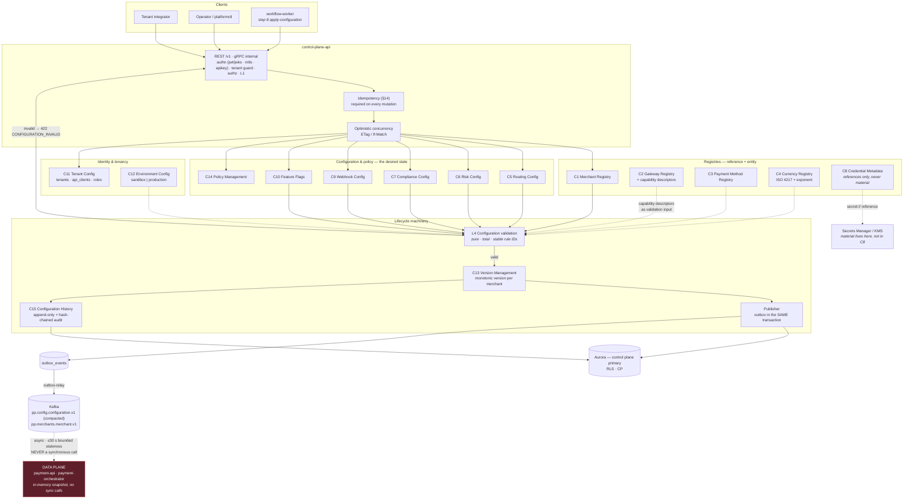
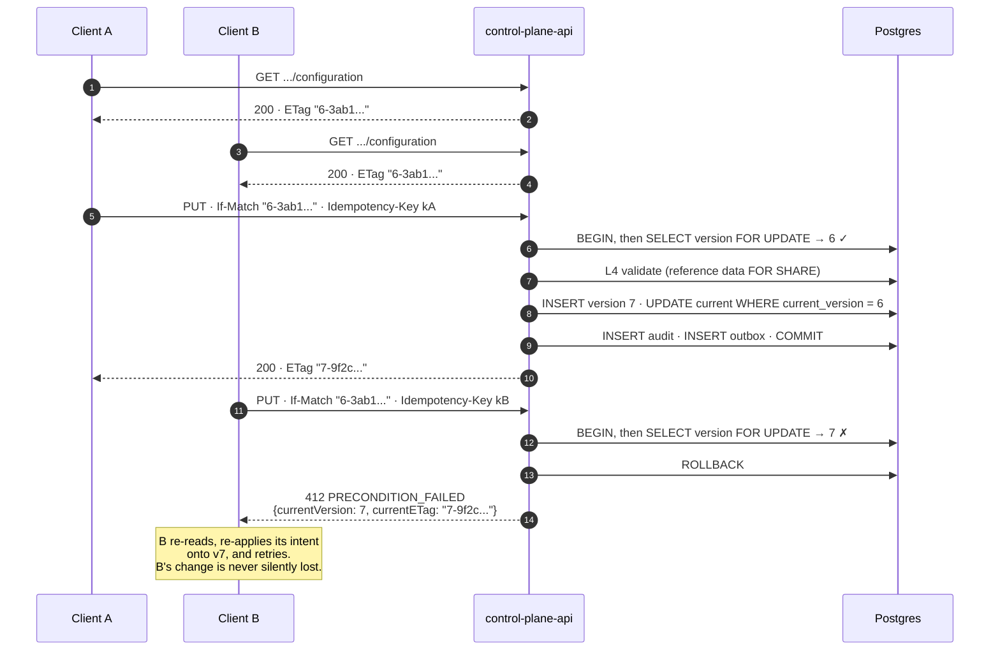
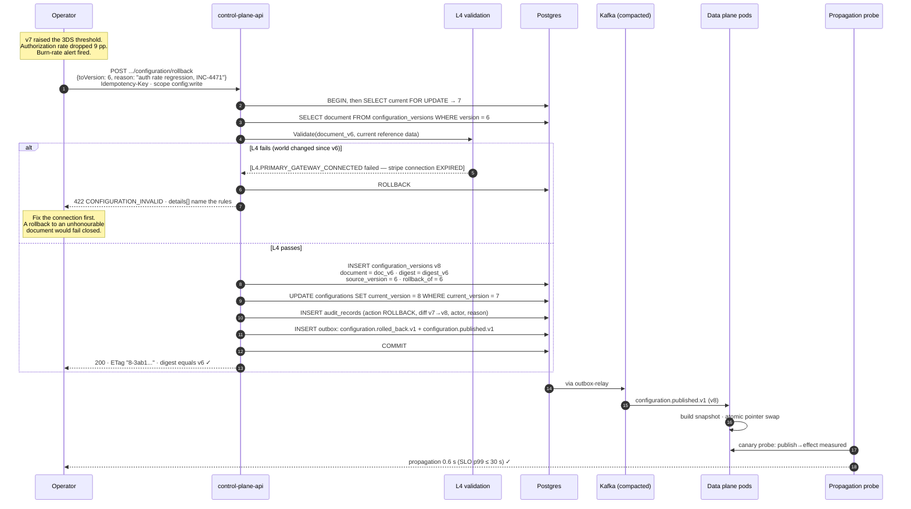

# Control Plane

> Purpose: the authoring, validation, versioning, publication, propagation, rollback and audit of **desired state** — and the rules that keep it off the payment hot path.
> **Derived from and subordinate to [`docs/spec/00-design-baseline.md`](spec/00-design-baseline.md); see also [`docs/architecture.md`](architecture.md) §2–§3.** Where this document disagrees with the baseline, the baseline wins.

---

## 1. Purpose and boundaries

The control plane owns **desired state**: the declared, versioned, validated, audited intent for how every tenant, merchant, gateway and policy should behave. It owns nothing about individual payments.

| Property | Value | Source |
|---|---|---|
| Deployable | `control-plane-api` (REST `/v1` + internal gRPC) | §5 |
| Bounded contexts | BC-1 Tenant & Identity, BC-2 Merchant Registry, BC-4 Gateway Registry (registry half only), BC-5 Configuration & Policy | §3 |
| Availability target | 99.9 % monthly (≤ 43 m) | §18 |
| Scaling driver | Admin request rate (low, business-hours diurnal) | §5 |
| Consistency | **CP** for every write; reject under partition | §15 |
| Blast radius | One tenant's configuration. **Never live payments.** | architecture.md §2.2 |
| Relationship to Data plane | Published-language *supplier*; the Data plane is a *customer* and may not be broken without a new major event version | §3 |

**The one-sentence contract:** the control plane may make a merchant's future payments behave differently; it may never make a merchant's payments *stop* because it is unavailable.

---

## 2. Components

Fifteen components inside one deployable. They are components, not services, because they share an availability target, a scaling signal and a transaction boundary — splitting them would buy nothing and would cost cross-service transactions in a system whose entire value is a coherent, versioned, auditable desired state.

| # | Component | Owns (tables) | Aggregate | Write path | Read path | Published event |
|---|---|---|---|---|---|---|
| C1 | **Merchant Registry** | `merchants`, `merchant_business_profile`, `merchant_bank_accounts` | `Merchant` | `POST/PATCH /v1/merchants` (L2) | `GET /v1/merchants[/{id}]`, projection for list/search | `merchant.created.v1`, `merchant.activated.v1`, `merchant.suspended.v1`, `merchant.terminated.v1` |
| C2 | **Gateway Registry** | `gateways`, `gateway_connections`, `gateway_health` | `Gateway`, `GatewayConnection` | Internal only + onboarding step 5 | `GET /v1/gateways[/{id}][/health]` | `merchant.gateway_provisioned.v1`, `gateway.health_changed.v1` (produced by the Data plane, *recorded* here) |
| C3 | **Payment Method Registry** | `payment_methods`, `payment_method_gateway_support` | reference data | `platformctl` seed + reviewed migration | Embedded in config snapshots | via `configuration.published.v1` |
| C4 | **Currency Registry** | `currencies` (ISO 4217 code, exponent, status) | reference data | Reviewed migration only | Compiled into `pkg/money`'s embedded table **and** served for validation | — |
| C5 | **Routing Config** | `configurations.routing` (document subtree) | `MerchantConfiguration` | `PUT /v1/merchants/{id}/configuration` | Snapshot | `configuration.published.v1` |
| C6 | **Risk Config** | `configurations.risk` | `MerchantConfiguration` / `RiskPolicy` | Same | Snapshot | Same |
| C7 | **Compliance Config** | `policies` (compliance), `attestations`, `residency_policies` | `CompliancePolicy` | `PUT` + attestation upload | Snapshot + `routing.BuildPlan` exclusion input | Same |
| C8 | **Credential Metadata** | `gateway_credentials_meta` | `GatewayConnection` | Rotation workflow only | Reference resolution at dispatch | `credential.rotated.v1` |
| C9 | **Webhook Config** | `configurations.webhooks` | `MerchantConfiguration` | `PUT` | Snapshot (outbound delivery) + gateway registration state | Same |
| C10 | **Feature Flags** | `feature_flags`, `feature_flag_targets` | `FeatureFlag` | `PUT /v1/flags/{key}` (+ kill-switch endpoint) | Snapshot | `configuration.published.v1` (flags travel in the config document, §23) |
| C11 | **Tenant Config** | `tenants`, `api_clients`, `roles`, `role_bindings` | `Tenant`, `ApiClient` | `POST/PATCH /v1/tenants` (platform scope) | JWKS/authz cache | `tenant.updated.v1` |
| C12 | **Environment Config** | `environments` (sandbox / production per tenant) | `Environment` | Platform scope | Snapshot key component | — |
| C13 | **Version Management** | `configuration_versions` | `ConfigurationVersion` | Assigned by the publish transaction | `GET .../configuration/versions` | — |
| C14 | **Policy Management** | `policies` (RBAC/ABAC, risk, compliance policy documents) | `Policy` | `PUT /v1/policies/{id}` | `internal/policies` snapshot | `policy.published.v1` |
| C15 | **Configuration History** | `configuration_versions` (full prior documents) + `audit_records` (hash-chained) | `AuditRecord` | Append-only, written in the publish transaction | `GET .../configuration/versions`, audit export | `audit.recorded.v1` |

### 2.1 Component diagram



---

## 3. The desired-state model

### 3.1 Lifecycle of a configuration document

```
author → validate (L4) → version → persist+audit+outbox (one txn) → relay
       → propagate (Kafka, compacted) → cache (in-memory snapshot)
       → invalidate → [rollback] → audit
```

Each stage below is stated as a contract, not a description.

#### Stage 1 — Author

| Property | Contract |
|---|---|
| Endpoint | `PUT /v1/merchants/{merchantId}/configuration` (full document, §23 schema) |
| Auth | scope `config:write`, plus ABAC: the principal's tenant must own the merchant |
| Idempotency | `Idempotency-Key` **required** (§14.1: every control-plane mutation) |
| Concurrency | `If-Match` **required** (§19.3) — see §3.5 |
| Semantics | **Whole-document replace, never patch.** A partial update makes "what is the desired state?" a function of arrival order. The client fetches (getting an `ETag`), modifies, and puts back. |
| Payload | The §23 document, minus server-owned fields (`version`, `status`) — supplying those is `400 VALIDATION_FAILED` |

The whole-document rule is worth defending: with `PATCH`-style merge semantics, two concurrent partial updates can produce a document neither author intended and that neither would have approved. With whole-document replace plus `If-Match`, the second writer is told to re-read. The cost is a slightly chattier API; the benefit is that the desired state is always exactly what somebody looked at and approved.

#### Stage 2 — Validate (L4)

L4 is **pure and total**: no network, no clock-dependent behaviour, no panics. Its inputs are the candidate document plus reference data read in the same transaction (gateway capability descriptors, currency table, payment-method table, the merchant's connections, the tenant's residency policy). Purity is what allows L4 to run synchronously on the write path with a 5 ms budget and to be exhaustively table-tested.

Representative rules (the full catalogue with remediation text is `docs/validation-plane.md`; `TestEveryRuleIsDocumented` fails the build on an undocumented rule):

| Rule ID | Assertion | Failure |
|---|---|---|
| `L4.SCHEMA_VALID` | Document conforms to the §23 JSON Schema | `422 CONFIGURATION_INVALID` |
| `L4.CURRENCY_KNOWN` | Every `supportedCurrencies` entry exists in C4 and is active | `422 CURRENCY_NOT_SUPPORTED` |
| `L4.MONEY_IS_MINOR_UNITS` | Every money object is `{amount:int, currency:string}`; no decimal strings, no floats | `422 CONFIGURATION_INVALID` |
| `L4.PRIMARY_GATEWAY_CONNECTED` | `routing.primary` has a `GatewayConnection` for this merchant in state `CERTIFIED` | `422` |
| `L4.ROUTING_CAPABILITY_COVERAGE` | For every `(currency, paymentMethod, country)` in the document, at least one gateway in the routing plan declares that capability | `422` |
| `L4.FALLBACK_DISTINCT` | Every fallback is distinct from the primary and from each other | `422` |
| `L4.WEIGHTS_NORMALIZED` | `routing.weights` values are non-negative and sum to 1.0 within 1e-9 | `422` |
| `L4.RISK_LIMIT_ORDERING` | `require3DSAbove ≤ maxTransactionAmount ≤ dailyVolumeLimit`, all in the same currency | `422` |
| `L4.RISK_CURRENCY_CONSISTENT` | Every risk limit's currency is in `supportedCurrencies` | `422` |
| `L4.BLOCKED_COUNTRIES_VALID` | ISO 3166-1 alpha-2, and the sanctions baseline set is a subset of `blockedCountries` | `422` |
| `L4.RESIDENCY_COMPATIBLE` | No routed gateway's processing region violates the tenant's residency policy | `422` |
| `L4.WEBHOOK_URL_HTTPS` | Every endpoint is `https://`, is not a private/link-local/loopback address, and resolves publicly (SSRF defence) | `422` |
| `L4.WEBHOOK_SECRET_REF_VALID` | `secretRef` parses as a `secret://` URI **and resolves to an existing secret**, checked by metadata lookup — never by fetching material | `422` |
| `L4.REFUND_WINDOW_BOUNDED` | `maxRefundWindowDays ∈ [1, 540]` and ≤ the minimum refund window of every routed gateway | `422` |
| `L4.PARTIAL_CAPTURE_SUPPORTED` | If `featureFlags.partialCapture` is true, every routed gateway implements `PartialCapturer` | `422` |
| `L4.FLAG_MONEY_SEMANTIC_DECLARED` | Any flag classified `MONEY_SEMANTIC` (§6) present in the document carries an explicit `changeReason` | `422` |
| `L4.NO_SECRET_MATERIAL` | No field in the document looks like a credential (entropy + known-prefix heuristics), and the PAN detector finds nothing | `400 SENSITIVE_DATA_IN_REQUEST` |

**Every ERROR-severity outcome is returned**, not just the first. `Report.AsError()` produces RFC 9457 `details[]` entries carrying `field` (JSON pointer), `code` and the rule ID, so an integrator fixes everything in one round trip.

**Validation is transactional with reference data.** Capability descriptors are read `FOR SHARE` inside the publish transaction, so a concurrent gateway de-registration cannot slip between validation and persistence.

#### Stage 3 — Version

| Property | Contract |
|---|---|
| Scope | `version` is a monotonic integer **per merchant**, assigned by the publish transaction — never by the client, never a timestamp, never a UUID |
| Allocation | `SELECT COALESCE(MAX(version),0)+1 FROM configuration_versions WHERE merchant_id = $1 FOR UPDATE` inside the transaction. Serialized by the row lock, so gaps are impossible |
| Identity | Each version also gets a `cfv_<ULID>` id for external reference |
| Digest | `SHA-256` over the JCS-canonical document, stored on the version row. Two publishes producing an identical document produce different versions but the **same digest** — which is how the propagation probe detects a genuine no-op and how rollback identity is verified |
| Immutability | A published version's document is never updated. Ever. |

**Rollback publishes the previous document as a *new* version, never restores an old one** (§23). History is strictly append-only, so "what was the desired state at 14:03 on Tuesday" always has exactly one answer.

#### Stage 4 — Persist, audit and stage the event: one transaction

```sql
BEGIN;
  SET LOCAL app.tenant_id = 'ten_...';                 -- RLS

  SELECT version FROM configurations
   WHERE merchant_id = $1 FOR UPDATE;                  -- ETag check under lock

  INSERT INTO configuration_versions
        (id, merchant_id, version, document, digest, created_by, created_at, source_version)
  VALUES ('cfv_...', $1, 7, $2::jsonb, $3, $4, now(), 6);

  UPDATE configurations
     SET current_version = 7, document = $2::jsonb, digest = $3, updated_at = now()
   WHERE merchant_id = $1 AND current_version = 6;     -- optimistic guard, second line of defence

  INSERT INTO audit_records (...)                      -- hash-chained, §3.6
  VALUES (...);

  INSERT INTO outbox_events (...)                      -- configuration.published.v1
  VALUES (...);
COMMIT;
```

The **entire publish is one transaction**: version row, current pointer, audit record and outbox event. This is §13.4's transactional outbox applied to configuration. There is no state in which a configuration is published but its event is lost, or an event is published but the configuration rolled back. `outbox-relay` is the only Kafka publisher; `control-plane-api` never produces directly.

#### Stage 5 — Propagate

| Hop | Mechanism | Typical latency |
|---|---|---|
| Commit → relay claim | `outbox-relay` polls with `FOR UPDATE SKIP LOCKED`, batch 500, ~100 ms cycle | 50–150 ms |
| Relay → Kafka | Produce to `pp.config.configuration.v1`, `acks=all`, key `merchant_id` | 10–40 ms |
| Kafka → data-plane pod | Consumer fetch | 10–100 ms |
| Pod applies | Decode → validate envelope → build snapshot → `atomic.Pointer` swap | < 1 ms |
| **Total p50 / p99** | | **~0.4 s / ≤ 30 s** |

The topic is **compacted** with key `merchant_id` (§13.3), which is what makes the whole model work: a pod starting cold reads the log tail to its high-water mark and has the current desired state for every merchant **without a single call to the control plane**. That is the mechanism behind rule P1 (architecture.md §2.3) and behind fail-static (§5 below).

The p99 budget of 30 s is generous relative to the ~0.4 s typical path. The slack is deliberate: it covers a relay scale-up, a Kafka partition leader election, and a consumer-group rebalance happening simultaneously without breaching the SLO.

#### Stage 6 — Cache

| Property | Contract |
|---|---|
| Location | Process memory in every data-plane pod: `internal/platform/config.SnapshotStore` |
| Structure | `map[MerchantID]Snapshot` behind `atomic.Pointer[snapshotSet]`; readers never take a lock |
| Swap | Copy-on-write: build the new set, swap the pointer. A reader either sees the whole old snapshot or the whole new one — **never a torn view** where routing came from v7 and limits from v6 |
| Bootstrap | At startup, consume the compacted topic to its high-water mark before `/readyz` passes (lld.md §2.4) |
| Redis | A *second-level* cache only, for a snapshot miss on an unknown merchant. Never authoritative; a Redis outage costs a Postgres read on the miss path, nothing more |
| Staleness metric | `pp_config_snapshot_age_seconds{service}` = now − the timestamp of the newest applied event |
| Never | The snapshot path performs **no** network I/O. `ConfigSnapshotProvider.Get` is a map lookup, and the interface has no way to express a remote call |

#### Stage 7 — Invalidate

Two classes, deliberately different:

| Class | Trigger | Path | Target latency |
|---|---|---|---|
| **Normal** | `configuration.published.v1` | Kafka → snapshot swap | ≤ 30 s p99 |
| **Priority** | `merchant.suspended.v1`, `merchant.terminated.v1`, `credential.rotated.v1`, a `MONEY_SEMANTIC` kill switch | Same Kafka path, but consumed by a **dedicated high-priority consumer goroutine** on its own topic partition assignment, ahead of the general handler queue, and applied before any other pending update | ≤ 2 s p99 |

Priority invalidation exists because §13.2 marks `merchant.suspended.v1` as a priority invalidation and because suspension is the one configuration change where the staleness window is a *risk* exposure rather than a *behaviour* delay. Suspension rejects new payments but continues to permit refunds, voids and webhook processing (§8) — the snapshot carries that distinction, so a suspended merchant's refunds keep working the instant suspension lands.

There is deliberately **no cache-busting call from the control plane to data-plane pods**. A fan-out HTTP invalidation would (a) reintroduce a control→data dependency, inverting P1, (b) require the control plane to know the data-plane topology, and (c) fail exactly when it is most needed — during a partition. The compacted log is both the transport and the recovery mechanism.

### 3.2 Optimistic concurrency: the ETag / If-Match protocol

| Element | Value |
|---|---|
| ETag format | `"<version>-<digest12>"`, e.g. `"7-9f2c4a1b8e03"` — a **strong** validator (byte-exact, since the document is canonicalized) |
| Returned on | `GET /v1/merchants/{id}/configuration`, and on `200/201` from `PUT` and `POST .../rollback` |
| Required on | `PUT /v1/merchants/{id}/configuration`, `PATCH /v1/merchants/{id}`, `PUT /v1/policies/{id}`, `PUT /v1/flags/{key}` |
| Missing `If-Match` | `428 PRECONDITION_REQUIRED`, code `CONFIGURATION_VERSION_CONFLICT`. We do **not** default to last-write-wins: a mutation without a concurrency token is a client bug, and silently accepting it is how configuration is silently lost |
| Mismatch | `412 PRECONDITION_FAILED`, code `CONFIGURATION_VERSION_CONFLICT`, body carries `currentVersion` and `currentETag` so the client can re-read and re-apply |
| `If-Match: *` | Accepted **only** on first creation (no current version exists). Never as a force-overwrite |



**Interaction with idempotency.** `If-Match` and `Idempotency-Key` solve different problems and both are required. `If-Match` answers *"has anyone else changed this since I read it?"*; `Idempotency-Key` answers *"is this a retry of my own request?"*. A retried `PUT` with the same key replays the stored `200` and its ETag — it does **not** re-evaluate `If-Match` and does not create version 8. Without idempotency, a client whose response was lost would retry, get a `412`, re-read, re-apply, and publish a duplicate version — polluting history and emitting a spurious propagation event.

### 3.3 Rollback

Rollback republishes a prior document **as a new version**. It never deletes, never restores in place, never rewinds the counter.

| Property | Contract |
|---|---|
| Endpoint | `POST /v1/merchants/{merchantId}/configuration/rollback` |
| Body | `{"toVersion": 6, "reason": "…"}` — `reason` is mandatory and lands in the audit record |
| Auth | `config:write`; an ABAC rule may additionally require `config:rollback` for production environments |
| Idempotency | `Idempotency-Key` required |
| Validation | **The target document is re-validated against L4 at rollback time**, not trusted because it was valid when published |
| Result | A new version `n+1` whose document equals version 6's document, `source_version = 6`, `rollback_of = 6` |
| Digest | Equal to version 6's digest — this is the machine-checkable proof that the rollback is faithful |
| Event | `configuration.rolled_back.v1` **and** `configuration.published.v1`. The first is the audit/operator signal; the second is what the data plane's ordinary handler consumes, so rollback needs no special path in the data plane |

**Why re-validate.** The world moves. A gateway may have been de-registered, a currency deactivated, a residency policy tightened, or a certification expired since version 6 was published. Restoring a document that references a now-uncertified gateway would produce a configuration the data plane cannot honour — the data plane would then fail closed for that merchant, converting an attempted recovery into an outage. If re-validation fails, the response is `422 CONFIGURATION_INVALID` naming the rules that now fail, and the operator is told what must be fixed first. **A rollback that cannot be validated is not a safe rollback**, and offering one would be a trap.



Rollback of *reference data* (C3, C4) is deliberately **not** an API operation — those change by reviewed migration only, because a currency exponent or a payment-method definition changing under live traffic is a money-correctness event, not a configuration change.

### 3.4 Diff and audit record shape

Every mutation writes exactly one `audit_records` row inside the mutating transaction. The chain is per tenant: `digest = SHA-256(prev_digest ‖ JCS(record_without_digest))`.

```json
{
  "id": "aud_01JB8Z9K2QW3E4R5T6Y7U8I9O0",
  "tenantId": "ten_01J...",
  "merchantId": "mrc_01J...",
  "occurredAt": "2026-08-26T14:03:11.412Z",
  "actor": {
    "principalId": "cli_01J...",
    "type": "API_CLIENT",
    "displayName": "acme-backoffice",
    "authMethod": "oauth2_client_credentials",
    "scopes": ["config:write"],
    "sourceIp": "203.0.113.7",
    "userAgent": "acme-admin/2.14.0"
  },
  "action": "CONFIGURATION_PUBLISHED",
  "resource": { "type": "MerchantConfiguration", "id": "mrc_01J...", "version": 7 },
  "outcome": "SUCCESS",
  "reason": "enable Adyen primary for EUR/CARD after certification",
  "request": {
    "requestId": "req_01J...",
    "idempotencyKey": "6f1c1b2e-…",
    "traceId": "4bf92f3577b34da6a3ce929d0e0e4736",
    "ifMatch": "6-3ab1c4d90e77"
  },
  "change": {
    "fromVersion": 6,
    "toVersion": 7,
    "fromDigest": "3ab1c4d90e77…",
    "toDigest": "9f2c4a1b8e03…",
    "patch": [
      { "op": "replace", "path": "/routing/rules/0/then/primary",
        "from": "stripe", "value": "adyen" },
      { "op": "replace", "path": "/risk/require3DSAbove/amount",
        "from": 50000, "value": 30000 },
      { "op": "add",     "path": "/paymentMethods/-", "value": "APPLE_PAY" }
    ],
    "redactedPaths": ["/webhooks/endpoints/0/secretRef"],
    "moneySemanticChange": true,
    "affectedRuleIds": ["L4.RISK_LIMIT_ORDERING", "L4.PARTIAL_CAPTURE_SUPPORTED"]
  },
  "prevDigest": "b71c…",
  "digest": "e4a9…"
}
```

| Field | Why it exists |
|---|---|
| `patch` | **RFC 6902 JSON Patch with `from` values populated** (an extension to the standard, which omits the previous value). Without `from`, reading an audit trail requires fetching both documents; with it, the record is self-contained. Computed over the JCS-canonical documents so key ordering never produces phantom diffs. |
| `redactedPaths` | Paths whose *values* are suppressed. Secret **references** are structural and are shown; nothing that could be material is ever written to the audit log. |
| `moneySemanticChange` | True when the patch touches `/risk/**`, `/routing/**`, `/limits/**` or a `MONEY_SEMANTIC` flag. Drives alerting and the operator review queue (§6.4). |
| `affectedRuleIds` | The L4 rules whose evaluation depends on a changed path. Turns "what could this break?" into a query. |
| `ifMatch` | Proves the writer had read the version they were replacing. |
| `outcome` | **Rejections are audited too.** A failed `PUT` (`422`, `412`, `403`) writes an audit record with `outcome: "REJECTED"` and the failing rule IDs — repeated rejected writes against a merchant is a security signal, and an audit trail that only contains successes cannot show it. |
| `prevDigest` / `digest` | Hash chain; `platformctl audit verify --tenant ten_… --from … --to …` folds the chain and reports the first break. |

Retention: 7 years, WORM (S3 Object Lock) after 400 days hot (§17.3). The chain is exported to `pp.audit.v1` for the SIEM.

### 3.5 Propagation SLO and its measurement

| Property | Value |
|---|---|
| SLO | **p99 ≤ 30 s from publish to data-plane effect** (§18) |
| Fast-burn alert | > 5 min → page (§22.4) |
| Definition of "effect" | A payment processed by any data-plane pod behaves according to the new document — **not** "the event was consumed", and **not** "the snapshot was swapped" |

The definition is the whole point. Measuring event consumption measures Kafka, not the system. We measure **behaviour**.

**Primary measurement — the active canary probe (authoritative for the SLO):**

1. A reserved canary merchant exists per environment and per region, `ACTIVE`, routed to `gateway-simulator`, isolated in its own tenant so it can never affect a real merchant.
2. Every 60 s the probe publishes a configuration change with a **behaviourally observable** effect: it toggles `risk.maxTransactionAmount` between two values, `A` and `A + 1000`.
3. It records `t_publish` = the `200` response time.
4. It then submits payments of amount `A + 500` in a tight loop against the canary merchant.
   - Under the old configuration these are rejected `422 AMOUNT_EXCEEDS_LIMIT`.
   - Under the new configuration they succeed.
5. `t_effect` = the timestamp of the first outcome consistent with the new configuration.
6. `propagation = t_effect − t_publish`, recorded into `pp_config_propagation_seconds` (histogram, labels `region`, `direction`).
7. The probe rotates across pods by using a fresh connection per attempt, so it samples the fleet rather than one lucky pod. A second variant sends `N × pod_count` requests and requires **every** pod to have converged before recording — that stricter figure is `pp_config_propagation_all_pods_seconds` and is the one the SLO burn-rate rule uses, because a single unconverged pod is exactly the failure this SLO exists to catch.

**Secondary measurement — passive, diagnostic, not the SLO:**

| Metric | Meaning | Use |
|---|---|---|
| `pp_config_snapshot_age_seconds{service,pod}` | now − newest applied event timestamp | Per-pod staleness; feeds `/readyz` and the §5 cliff |
| `pp_config_applied_version{service,merchant="canary"}` | Applied version per pod for the canary | Identifies *which* pod is lagging |
| `pp_outbox_backlog{topic="pp.config.configuration.v1"}` | Rows staged but unpublished | Distinguishes a relay problem from a consumer problem |
| `pp_consumer_lag{topic="pp.config.configuration.v1"}` | Kafka lag | Same |

The four secondary metrics decompose the end-to-end number into its hops, so a breach is triaged in one dashboard glance: high outbox backlog → relay; high consumer lag → broker or consumer; both low but propagation high → a stuck pod, identified by `pp_config_applied_version`.

**Why the SLO is not stricter.** A 5-second target would be achievable on the median path but would page on every relay scale-up and every consumer rebalance. Thirty seconds is what the data plane's fail-static design can actually tolerate — the exposure of a 30-second window of superseded limits is bounded and accepted (architecture.md TR-3) — and it leaves the alerting budget for the failures that matter.

---

## 4. Why the control plane is never on the payment hot path

### 4.1 The argument

| # | Reason | Consequence if violated |
|---|---|---|
| 1 | **Availability arithmetic.** Serial dependencies multiply: a 99.99 % data plane synchronously depending on a 99.9 % control plane yields ≈ 99.89 %. That is **~8.6 hours/year** of payment downtime instead of ~52 minutes. | The 99.99 % SLO becomes mathematically unreachable regardless of how well the data plane is built. |
| 2 | **Latency budget.** §12 allots 5 ms to merchant-context load (stage 9). A cross-service call is 3–8 ms p50 and 30–80 ms p99 — 6–16× the budget at the tail, in a path with a 250 ms p99 SLO. | The latency SLO breaches under control-plane GC pauses that would otherwise be invisible. |
| 3 | **Correlated failure.** A control-plane deploy, a schema migration, an admin-triggered load spike, or a runaway report query would all become payment incidents. | Routine control-plane change control would have to be raised to money-path severity, which would make the control plane slow to change — the opposite of what a control plane is for. |
| 4 | **Retry amplification.** A slow control plane would cause data-plane retries, which would add load to the slow control plane. | Metastable failure: the system stays down after the trigger is removed. |
| 5 | **Blast radius.** The control plane is multi-tenant by construction; one tenant's expensive admin operation would degrade every tenant's payments. | Noisy-neighbour failures on the money path. |

### 4.2 How it is enforced, not just intended

| Control | Mechanism |
|---|---|
| No import path | `scripts/check-architecture.sh` asserts `internal/application/payment` does not import `internal/application/config`'s write side, and that no data-plane composition root constructs a control-plane client |
| No network route | Network policy: `payment-api` and `payment-orchestrator` have **no egress rule** to `control-plane-api`. The call is not merely absent from the code; it is not routable |
| No interface to express it | `ports.ConfigSnapshotProvider.Get` returns from memory. There is no method on any port available to the payment use cases that performs a configuration fetch |
| Test | `TestPaymentPathHasNoControlPlaneDependency` runs the create-payment use case with every control-plane dependency replaced by a panicking stub and asserts a successful payment |
| Chaos | **Not implemented.** The property — `control-plane-api` at zero replicas leaves payment throughput and error rate unchanged for the first 15 minutes — rests on `internal/platform/config/provider_test.go::TestStalenessLadder` and `::TestFailedRefreshIsFailStatic`, which assert the fail-static behaviour in isolation. Nothing exercises it end to end against a running data plane |

### 4.3 What the data plane does when the control plane is unreachable

**Fail-static, not fail-open, not fail-closed — with a defined cliff** (§15).

```
t = 0        control plane unreachable (or Kafka config topic stalled)
             ↓
0 – 30 s     Normal. Snapshot is inside its bounded-staleness window.
             No behaviour change. No alert.
             ↓
30 s – 5 min Snapshot is stale but usable. Serve last-known-good.
             pp_config_snapshot_age_seconds rising. Warning only.
             ↓
5 min        ALERT (page). "Config propagation stalled."
             Behaviour still unchanged — we alert BEFORE we degrade.
             ↓
15 min       CLIFF at max_config_staleness (default 15 min, per-env configurable).
             ├─ Merchants IN the snapshot          → CONTINUE normally.
             ├─ Merchants NOT in the snapshot      → 503 SERVICE_UNAVAILABLE,
             │                                       retryable, Retry-After.
             ├─ Config-dependent NEW capabilities  → refused (a currency or
             │                                       payment method the snapshot
             │                                       does not list is not enabled)
             ├─ Refunds, voids, captures on existing payments → CONTINUE.
             │  You must always be able to give money back (§8).
             └─ Webhook ingestion + processing     → CONTINUE. Resolving an
                                                     ambiguous attempt does not
                                                     need current configuration.
```

| Behaviour | Rationale |
|---|---|
| **Not fail-open** (ignore limits) | Processing without risk limits is a compliance and financial-exposure breach. Unacceptable at any duration. |
| **Not fail-closed** (stop everything) | A 99.9 %-target component's outage would zero out revenue on a 99.99 %-target path. That inverts the entire plane model. |
| **Fail-static with a cliff** | Known merchants continue under their last approved configuration; unknown merchants — for whom we have *no* configuration and therefore *no* limits — are refused. The cliff is what makes this graceful degradation with a bound, rather than unbounded drift. |
| Why 15 minutes | Long enough to absorb a control-plane deploy, an Aurora failover, and a Kafka leader election together; short enough that a merchant whose limit was lowered for a real risk reason is not transacting on the old limit for an hour. Configurable per environment, and the value is itself part of desired state — but it is a *deploy-time* setting (env var), so a control-plane outage cannot change it. |
| What the cliff does **not** do | It never fails a payment already in `PROCESSING`, never blocks a refund, never stops webhook processing, and never fails a capture on an existing authorization. Money already in motion always completes. |

Observability during degradation: `pp_config_snapshot_age_seconds` is exported per pod; `/readyz` fails once a pod exceeds the cliff **and** the pod is the only one lagging (a fleet-wide stall does not shed the whole fleet — that would be fail-closed by accident). The distinction is made by comparing the pod's own age against a fleet-wide recorded rule; if the whole fleet is stale, pods stay ready and the cliff logic applies per merchant instead.

---

## 5. Credential metadata vs credential material

### 5.1 The split

| | **Credential metadata** (C8, `gateway_credentials_meta`) | **Credential material** |
|---|---|---|
| What | Which credential exists, for which `(tenant, merchant, gateway)`, its purpose, lifecycle state, versions, rotation timestamps, expiry, fingerprint | The API key, secret, private key, certificate |
| Where | Control-plane Postgres, ordinary RLS-protected table | AWS Secrets Manager, envelope-encrypted with a per-environment KMS CMK (per-tenant CMK for the siloed tier) |
| Who reads | `control-plane-api`, `workflow-worker`, operators | `payment-orchestrator` and `workflow-worker` **only**, at dispatch time, via the `Secrets` port |
| In the config document | The `secret://` **reference** only | Never. `L4.NO_SECRET_MATERIAL` rejects anything resembling material |
| In audit records | Reference and fingerprint | Never |
| In logs | Reference | **Structurally impossible** — the `Secret[T]` wrapper's `String()`, `MarshalJSON()` and `Format()` all return `[REDACTED]` (§17.2) |
| In a database backup | Metadata | Material is never in our database, so a database compromise does not yield credentials |

Metadata row (fields; no material anywhere):

| Column | Example | Note |
|---|---|---|
| `id` | `gwc_01J…` | |
| `tenant_id` / `merchant_id` / `gateway_id` | | RLS scope |
| `secret_ref` | `secret://production/ten_01J.../mrc_01J.../stripe/api_key` | Stable across rotations |
| `active_version` | `7` | Which material version is primary |
| `pending_version` | `8` | Present only during a dual-run overlap |
| `state` | `ACTIVE` \| `ROTATING` \| `PENDING_VERIFICATION` \| `REVOKED` | |
| `fingerprint` | `sha256:9f2c…` (first 12 hex of a salted digest) | Lets an operator confirm *which* credential is live without seeing it |
| `created_at` / `activated_at` / `expires_at` / `last_verified_at` | | `expires_at` drives the ≤ 90-day rotation schedule (§17.2) |
| `last_used_at` | | Populated asynchronously from telemetry; the signal that says an old version is safe to revoke |

### 5.2 The secret reference scheme

```
secret://{environment}/{tenant_id}/{merchant_id}/{gateway_id}/{purpose}[#v{n}]

secret://production/ten_01JB8.../mrc_01JC2.../stripe/api_key
secret://production/ten_01JB8.../mrc_01JC2.../adyen/webhook_hmac#v8
secret://sandbox/ten_01JB8.../mrc_01JC2.../paypal/oauth_client_secret
```

| Property | Consequence |
|---|---|
| Hierarchical, mirroring the IAM path `/{env}/{tenant}/{merchant}/{gateway}` (§16.1) | An IAM policy with a prefix condition grants exactly one merchant's credentials to exactly one service account. Least privilege falls out of the naming, rather than requiring a separate policy per secret |
| **Version-less by default; `#v{n}` optional** | The common case resolves to the current active version. Pinning is only used by the rotation workflow's verification step and by forensic lookup |
| Opaque to the config document | A configuration references `secretRef` and never contains material. `L4.WEBHOOK_SECRET_REF_VALID` verifies the reference **resolves** via a metadata lookup — it never fetches material during validation, so the control plane never handles credentials at all |
| Contains no secret-derived data | The reference is safe in logs, audit records, error messages and support tickets |
| Environment is the first path segment | A sandbox reference can never resolve in production: the resolver asserts the reference's environment equals the process's environment and returns `ErrEnvironmentMismatch` otherwise. This makes the classic "sandbox key in production" incident structurally impossible |

Resolution at dispatch (`payment-orchestrator`): a per-process cache keyed by `secret_ref`, TTL 5 minutes, holding `crypto.Secret[GatewayCredential]` values. `credential.rotated.v1` is a **priority invalidation** (§3.7) that evicts the entry immediately. A Secrets Manager outage is survivable for the cache TTL and then degrades to `503` for that gateway — the routing engine treats "credential unresolvable" as a gateway exclusion with reason `CREDENTIAL_UNAVAILABLE`, so traffic fails over to another gateway rather than failing the payment.

### 5.3 Rotation with dual-run overlap

Rotation is a workflow (`credential-rotation@v1`), not an inline mutation, because it spans our store, the gateway, and a verification step, and because it must be resumable and compensatable. It is triggered by `POST /v1/gateways/{gatewayId}/credentials:rotate` (scope `credentials:rotate`) or by the scheduler at `expires_at − 14 d`, enforcing the ≤ 90-day requirement in §17.2.

The **overlap** is the whole design: at no instant is there a single point at which a request could be signed with a credential the gateway does not recognise.

The inbound direction uses the same two staging labels and needs no workflow at all. `webhook-ingress` resolves a gateway's signing secret as *both* `AWSCURRENT` and `AWSPREVIOUS` and offers every value to the verifier, so a delivery signed with either verifies throughout the window. The previous version is read by *staging label* rather than by version number, deliberately: the ingress does not track version numbers and must not have to, and `AWSPREVIOUS` is exactly "the one that was current before the last rotation" — which is the set the gateway may still be signing with. An ingress that read only the current secret would turn every rotation into a rejection of the deliveries in flight, and a gateway that gets 401s eventually stops retrying.

```mermaid
sequenceDiagram
    autonumber
    participant SCH as Scheduler / Operator
    participant WW as workflow-worker
    participant SM as Secrets Manager
    participant GW as Gateway
    participant CP as control-plane-api (C8)
    participant K as Kafka
    participant ORC as payment-orchestrator

    SCH->>WW: start credential-rotation@v1<br/>business key (tenant,merchant,gateway)

    rect rgb(40,55,70)
    Note over WW,CP: PHASE 1 — mint (compensatable)
    WW->>GW: create new API credential (idempotent by external ref)
    GW-->>WW: new material (v8)
    WW->>SM: PutSecretValue v8 (staged, NOT current)
    WW->>CP: state = ROTATING, pending_version = 8
    end

    rect rgb(40,60,40)
    Note over WW,GW: PHASE 2 — verify BEFORE promoting
    WW->>WW: L3 gateway validation using secret://...#v8
    WW->>GW: sandbox/read-only probe signed with v8
    alt probe fails
        GW-->>WW: 401
        WW->>SM: delete staged v8  (compensation)
        WW->>GW: revoke new credential (compensation)
        WW->>CP: state = ACTIVE, pending_version = NULL
        Note over WW: Nothing was promoted.<br/>v7 was live throughout.
    else probe succeeds
        GW-->>WW: 200
    end
    end

    rect rgb(70,60,35)
    Note over WW,ORC: PHASE 3 — DUAL-RUN OVERLAP (both valid at the gateway)
    WW->>SM: promote v8 to AWSCURRENT (v7 → AWSPREVIOUS)
    WW->>CP: active_version = 8, state = PENDING_VERIFICATION
    CP->>K: credential.rotated.v1 (PRIORITY invalidation)
    K->>ORC: evict secret cache immediately
    ORC->>SM: resolve → v8
    Note over ORC,GW: In-flight requests signed with v7 still<br/>succeed: the gateway accepts BOTH.<br/>This is why we do not revoke yet.
    end

    rect rgb(45,45,55)
    Note over WW,GW: PHASE 4 — soak, then revoke
    WW->>WW: wait overlap_window (default 24 h — at least 10× cache TTL<br/>and at least the longest gateway retry window)
    WW->>CP: read last_used_at for v7
    alt v7 still used within the last hour
        WW->>WW: extend overlap 24 h, alert (max 3 extensions, then page)
    else v7 unused
        WW->>GW: revoke old credential v7
        WW->>SM: schedule v7 deletion (30-day recovery window)
        WW->>CP: active_version = 8, pending_version = NULL, state = ACTIVE
        WW->>CP: audit CREDENTIAL_ROTATED (refs + fingerprints only)
    end
    end
```



| Design point | Why |
|---|---|
| Verify **before** promoting | A credential that does not work must never become current. Phase 2 failing costs nothing — v7 was live the whole time. |
| Both credentials valid at the gateway during Phase 3 | Rotation is not atomic across our fleet: pods have 5-minute secret caches, and in-flight requests were signed before the swap. A hard cutover would produce a burst of `401`s — a self-inflicted authorization-failure incident on every rotation. |
| `overlap_window ≥ 10 × cache TTL` **and** ≥ the longest gateway retry window | Covers both our staleness and the gateway's own async retries of requests signed with the old credential. |
| Revoke gated on `last_used_at` | Time-based revocation alone assumes the fleet converged. Usage-based revocation *verifies* it. Three extensions then a page, so a stuck pod is discovered rather than silently keeping an old credential alive forever. |
| 30-day deletion recovery window | Revocation at the gateway is the security boundary; deletion in Secrets Manager is cleanup. Separating them means a mistaken rotation is recoverable. |
| Compensations are real | Phase 1 and 2 are fully compensatable: delete the staged secret, revoke the new credential at the gateway. **Phase 3 is the pivot** — once v8 is promoted and traffic is signing with it, we roll *forward* (rotate again) rather than back. This is the pivot-transaction pattern; see [`docs/automation-plane.md`](automation-plane.md) §2.3. |
| Audit | Every phase writes an audit record carrying references and fingerprints, never material. |

---

## 6. Feature flag semantics

### 6.1 What a flag is, and what it is not

Flags live in BC-5 and travel to the data plane inside the configuration document (§23 `featureFlags`) plus a platform-scoped global set. They are desired state: versioned, validated, audited, rolled back — identical machinery to the rest of this document. **A flag is not a config file and not a runtime switch that bypasses review.**

Every flag is declared with a mandatory **class**:

| Class | Meaning | Examples | Constraints |
|---|---|---|---|
| `PRESENTATION` | Affects only response shape or non-behavioural surface | expanded error detail, new optional response field | Standard change control |
| `OPERATIONAL` | Affects mechanism, not money outcomes | new connection-pool strategy, alternate serialization, shadow-mode call | Standard change control; must be a no-op for money outcomes, asserted by a test |
| `MONEY_SEMANTIC` | Can change whether, how much, or through whom money moves | `networkTokens`, `partialCapture`, a new routing strategy, a risk-rule set, a decline-mapping change | §6.4's rules apply. Cannot be toggled silently. |

Declaring the class is mandatory at flag creation; an undeclared flag fails L4 (`L4.FLAG_CLASS_REQUIRED`) and cannot be published.

### 6.2 Evaluation order

Deterministic, top to bottom, **first match wins**. The order is fixed in code and covered by an exhaustive table test.

| # | Stage | Rule | Notes |
|---|---|---|---|
| 1 | **Global kill switch** | If the flag's global kill switch is engaged → **`false`**, unconditionally | Short-circuits everything below. A kill switch can only ever force `false`, never `true` — a kill switch that could turn something *on* is not a safety mechanism |
| 2 | **Environment gate** | If the flag is not enabled for this environment (`sandbox` / `production`) → `false` | Prevents a sandbox-only capability leaking into production |
| 3 | **Merchant override** | Explicit `true`/`false` for this `merchant_id` → that value | Most specific wins |
| 4 | **Tenant override** | Explicit `true`/`false` for this `tenant_id` → that value | |
| 5 | **Attribute targeting** | First matching rule in an ordered list (country, currency, payment method, merchant tier, gateway) → that rule's value | Rules are ordered; order is part of the document and therefore versioned and diffed |
| 6 | **Percentage rollout** | `crc32(flag_key ‖ ":" ‖ stable_subject_id) mod 10000 < bps` | Stable subject is `merchant_id` (never `payment_id`) — see §6.3 |
| 7 | **Default** | The flag's declared default | A flag with no default fails L4 |

Evaluation is a **pure function of the snapshot and the subject**: `Evaluate(flag, subject) bool` performs no I/O, cannot fail, and returns the same answer for the same inputs. It is not permitted to consult a clock, a random source, or a remote service. That purity is what makes flag behaviour reproducible in incident reconstruction.

### 6.3 Targeting and stability

| Rule | Rationale |
|---|---|
| The bucketing subject is **`merchant_id`**, never `payment_id`, never a random draw | A merchant must get consistent behaviour across their payments. Bucketing per payment would mean the same merchant sees partial capture work on one payment and not the next — an integration nightmare and an unreconcilable support case. |
| Bucketing is a pure hash of `(flag_key, subject)` | Adding a *second* flag does not reshuffle the first flag's population. Using the subject alone would correlate every rollout onto the same merchants. |
| Increasing `bps` only ever **adds** merchants | Monotonic: a merchant enabled at 10 % is still enabled at 20 %. Ramping never removes a merchant mid-rollout, which would look like a regression to them. |
| Decreasing `bps` removes the highest-bucket merchants first | Deterministic, reversible ramp-down. |
| Rollout percentage changes are ordinary configuration versions | Every ramp step is versioned, diffed and audited. There is no out-of-band ramp mechanism. |
| Targeting rules are **ordered and versioned** | Reordering is a real semantic change and shows up in the diff. |

### 6.4 Kill switches

| Property | Contract |
|---|---|
| Endpoint | `POST /v1/flags/{key}:kill` — a distinct endpoint from `PUT /v1/flags/{key}` |
| Auth | Scope `flags:kill`, held by on-call roles. Deliberately **not** gated behind `If-Match`: during an incident you must be able to turn something off without first reading its current version |
| Semantics | Forces `false` for all subjects, evaluated at stage 1. Cannot force `true`. |
| Propagation | **Priority invalidation** (§3.7), ≤ 2 s p99 — same class as `merchant.suspended.v1` |
| Audit | Full audit record with `action: "FLAG_KILLED"`, mandatory `reason` (incident ID expected), and a page to the flag's owning team |
| Reset | Disengaging a kill switch **is** gated behind `If-Match` and requires scope `flags:write`. Turning something off in a hurry is safe; turning it back on is not. |
| Expiry | Kill switches do not auto-expire. An engaged kill switch older than 30 days raises a ticket to either remove the flag or fix the feature — dead flags are technical debt with a compliance surface. |

### 6.5 The rule: a flag may never change money semantics silently

> **A `MONEY_SEMANTIC` flag's value is resolved once, at payment creation, stamped onto the payment record, and used unchanged for that payment's entire lifecycle.**

Enforcement:

| # | Control | Detail |
|---|---|---|
| 1 | **Resolve once, stamp, freeze** | At payment creation the orchestrator evaluates every `MONEY_SEMANTIC` flag and writes the resolved set into `payments.flag_context` (a JSONB column) alongside the routing plan. Capture, refund, void, webhook resolution and reconciliation — which may occur days later — read `flag_context`, **never** the live snapshot. A flag flipped between authorization and capture cannot change how that capture behaves. Without this, a rollout ramping at 10:00 would mean payments authorized under one rule set and captured under another, and the ledger would be unreconcilable. |
| 2 | **Structural inability to evaluate late** | The API available to a capture/refund use case is `FlagContext.Get(key)` reading the stamped map. There is no `FlagEvaluator` in the constructor of `CapturePaymentUseCase` or `RefundPaymentUseCase`, so late evaluation is not expressible. A test asserts the absence. |
| 3 | **Audited and visible** | The resolved flag context is included in `payment.created.v1` and returned in the payment resource. A merchant or an auditor can always answer "which rules governed this payment?" from the payment itself. |
| 4 | **Cannot ship silently** | Publishing a document that changes a `MONEY_SEMANTIC` flag requires an explicit `changeReason` (`L4.FLAG_MONEY_SEMANTIC_DECLARED`), sets `moneySemanticChange: true` on the audit record, emits a distinct alert, and enters the operator review queue. There is no path that changes money behaviour without a reviewed, reasoned, audited record. |
| 5 | **Rollout is observed, not assumed** | Every `MONEY_SEMANTIC` flag must declare a **guard metric** (typically authorization success rate for the affected corridor) with a threshold. The rollout controller compares enabled and disabled cohorts and **automatically engages the kill switch** if the enabled cohort degrades beyond the threshold for 10 minutes. A ramp with no guard metric fails L4. |
| 6 | **Kill switch semantics are safe** | Because a kill switch can only force `false`, and because in-flight payments use their stamped context, engaging one during an incident stops *new* payments from taking the new path and leaves *existing* payments coherent. A kill switch can never strand a payment mid-lifecycle in a state its own rules do not cover. |

**Worked example of what this prevents.** Suppose `networkTokens` is ramping from 10 % to 50 % at 14:00. A payment authorized at 13:58 used a gateway-scoped token and is pinned to Stripe (`TOKEN_PINNED_TO_GATEWAY`). At 14:05 the merchant captures it. Without stamping, the capture path would re-evaluate the flag, see `networkTokens: true`, and could select a different token type or a different gateway for the capture — against an authorization that lives at Stripe. The capture would fail, or worse, succeed against the wrong authorization. With stamping, the capture reads `flag_context.networkTokens = false` from the payment row and behaves exactly as the authorization did. **This is the single most important rule in this section.**

---

## 7. Cross-references

| Topic | Document |
|---|---|
| Canonical baseline (binding) | [`docs/spec/00-design-baseline.md`](spec/00-design-baseline.md) |
| Plane model, control loop, trade-offs, scaling | [`docs/architecture.md`](architecture.md) |
| Package design, snapshot store, pools, shutdown | [`docs/lld.md`](lld.md) |
| Workflow engine, saga, pivot transactions, rotation workflow execution | [`docs/automation-plane.md`](automation-plane.md) |
| L4 rule catalogue with remediation | `docs/validation-plane.md` |
| Configuration document schema | `api/openapi/`, §23 |
