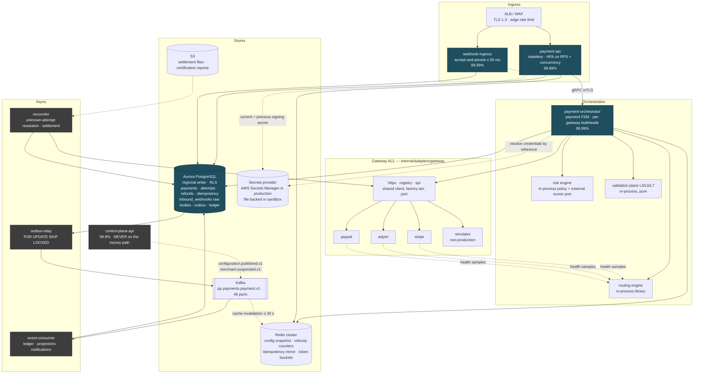
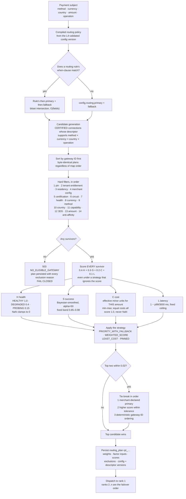
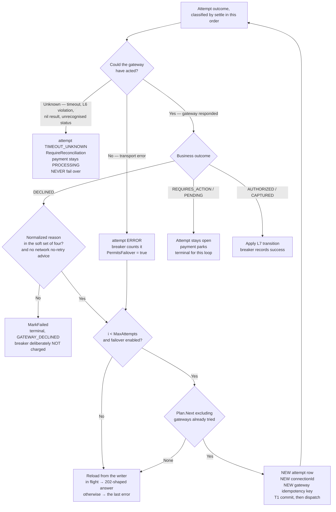

# Data Plane

> Runtime behaviour of the money path: the request pipeline, its scaling and bulkheads, the orchestrator's crash-recoverable ordering, smart routing, the risk engine, and idempotency under concurrency.
> Derived from and subordinate to [`docs/spec/00-design-baseline.md`](spec/00-design-baseline.md) — primarily §12 (pipeline), §9 (payment FSM, I1–I5), §10 (gateway health), §13 (events/outbox), §14 (idempotency), §15 (consistency), §18 (NFRs), §24 (failure modes). Rule IDs referenced here are defined in [`validation-plane.md`](validation-plane.md). If this file disagrees with the baseline, the baseline wins and this file is a defect.

---

## 1. Component map



The load-bearing property: **the control plane is on no synchronous edge of the money path.** Configuration reaches the orchestrator only as a cached snapshot refreshed by Kafka invalidation (§15, bounded staleness ≤ 30 s, fail-static past that). `control-plane-api` can be entirely down and payments continue.

---

## 2. The request pipeline, stage by stage

Ordered per §12; the order is load-bearing. Budgets sum to 62 ms of app time against a p99 SLO of 250 ms excluding gateway time (§18), leaving ~4× headroom for scheduling, connection acquisition and GC.

| # | Stage | Budget | What it does | Failure mode | Emits | Caches |
|---|---|---|---|---|---|---|
| 1 | TLS / WAF / edge rate limit | — | Terminates TLS 1.3, drops known-bad sources, applies a coarse per-IP and per-tenant edge limit ahead of the app. | `403` (WAF), `429` (edge). Never reaches the app; no app metric. | ALB access log → SIEM | — |
| 2 | Request ID + trace context | 1 ms | Adopts inbound `traceparent` or starts a trace; mints `req_…`; installs the logging context (§22.1). Always echoes `X-Request-Id`. | Cannot fail. Malformed `traceparent` → new trace + `L1.TRACEPARENT_WELL_FORMED` warning. | span `payment.request`, all downstream log lines | — |
| 3 | Authentication | 2 ms | Verifies JWT signature against cached JWKS, or validates the mTLS chain and maps SAN → `ApiClient`. | `401 UNAUTHENTICATED`. ShortCircuit: no later stage runs. | `pp_http_requests_total{status="401"}`; auth-failure spike alert | JWKS, 10 min TTL, background refresh at 60 % of TTL; **never** a synchronous fetch on the request path |
| 4 | Tenant resolution + isolation guard | 1 ms | Extracts `tenant_id` from the token only; `SET LOCAL app.tenant_id` for RLS; compares against any body-supplied tenant. | `403 TENANT_MISMATCH` + **security event** + audit record (§16.2). | `audit.recorded.v1` on mismatch | tenant row (state, tier, policy) 60 s |
| 5 | Authorization (RBAC + ABAC) | 2 ms | Resolves role bindings and attribute predicates for `(principal, route, merchant)`. | `403 FORBIDDEN`. | — | role bindings 60 s, push-invalidated on `role_binding` change |
| 6 | Rate limit + concurrency bulkhead | 2 ms | Redis token bucket per `(tenant, route class)` and `(tenant, merchant, route class)`; in-process semaphore for tenant concurrency. | `429 RATE_LIMITED` + `RateLimit-*` + `Retry-After`. **Redis down → local per-pod bucket at limit/N**, coarser but never open. | `pp_http_requests_total{status="429"}` | bucket state in Redis; local fallback bucket in memory |
| 7 | **L1 schema validation** | 3 ms | Strict decode against the route schema, bounds, enums, and the PAN/CVV/track detectors (§17.2). | `400 VALIDATION_FAILED`, or `400 SENSITIVE_DATA_IN_REQUEST` — value never logged, security event raised. | `pp_validation_outcomes_total{rule,result}` | compiled JSON Schema, process lifetime |
| 8 | **Idempotency claim** | 8 ms | `INSERT … ON CONFLICT DO NOTHING` into `idempotency_records` with fingerprint + lease. Postgres authoritative; Redis consulted first only for `COMPLETED` replay (§14.3). | `409 IDEMPOTENT_REQUEST_IN_PROGRESS` (+`Retry-After: 1`), `422 IDEMPOTENCY_KEY_REUSED`, or replay `200` + `Idempotent-Replay: true`. | `pp_idempotency_outcomes_total{outcome}` | Redis mirror of completed responses, TTL 24 h; Postgres retains 7 d |
| 9 | Merchant context load | 5 ms | Loads the merchant snapshot and the compiled configuration policy from the local snapshot store. | `404 MERCHANT_NOT_FOUND`, `409 MERCHANT_NOT_ACTIVE`. Snapshot older than `max_config_staleness` (15 min) → `503` for *new* merchants only; existing merchants continue fail-static (§15). | `pp_config_snapshot_age_seconds` | **Two-tier**: in-process LRU (10 k merchants, 30 s TTL) → Redis (`pp:{tenant}:cfg:{merchant}`, 5 min TTL) → Postgres. Invalidated by `configuration.published.v1` and *priority*-invalidated by `merchant.suspended.v1`. |
| 10 | **L5 payment validation** | 5 ms | 48 pure rules over the pre-loaded subject: limits, currency, method, velocity, SCA, state (validation-plane §3.5). CollectAll. | `422` with `details[]` of rule IDs; `402 THREE_DS_REQUIRED` when `L5.THREE_DS_REQUIRED_ABOVE_THRESHOLD` fires. | validation outcome counters; audit record carrying the failing rule IDs | velocity counters read once at stage 9 in a single pipelined Redis call |
| 11 | Risk engine | 15 ms local | Ordered policy evaluation (§6). May force 3DS, decline, or allow with an exemption claim. External scorer, when the policy selects it, is dispatched here and joined at stage 13. | `422 RISK_DECLINED`, or a `REQUIRES_ACTION` outcome. Fail-**open to the policy default**, never to "allow" (§12). | `payment.created.v1` carries the risk decision; `pp_payments_total{outcome="risk_declined"}` | blocklists (bloom filter, 5 min refresh); risk policy compiled at config publish |
| 12 | Routing engine → routing plan | 5 ms | Candidate generation → hard filters → scoring → ordering. Persists `routing_plans` row with reasons (§4). | `503 NO_ELIGIBLE_GATEWAY` + `Retry-After` — **fail closed** (§24). | `pp_routing_decisions_total{gateway,reason}`; plan persisted for audit | capability descriptors (process lifetime, versioned); health windows (local + Kafka gossip) |
| 13 | Orchestrator: create attempt, persist, dispatch | 10 ms | Writes the `payment_attempts` row (status `PENDING`, `gateway_idempotency_key` derived) **before** any network call, then transitions to `DISPATCHED` and calls the adapter (§3). | Write failure → `503`, nothing dispatched, payment stays `CREATED`. | `payment.attempted.v1` | — |
| 14 | Gateway adapter call | ≤ 8 s hard | HTTP/2 call through the ACL with a per-gateway connection pool, semaphore and circuit breaker. Transport retries ≤ 2 with jittered backoff **on the same attempt** (same gateway idempotency key). | Timeout/ambiguous transport error → attempt `TIMEOUT_UNKNOWN`, payment stays `PROCESSING` (§12.3). Circuit open → `GATEWAY_CIRCUIT_OPEN`, failover considered. | `pp_gateway_request_duration_seconds`, `pp_gateway_errors_total`, `pp_circuit_breaker_state` | connection pool; DNS pinned with a 30 s refresh |
| 15 | **L6 response validation** | 3 ms | Signature (webhooks), schema, API version echo, transaction ID, amount/currency echo, status and decline mapping (validation-plane §3.6). ShortCircuit. | `502 GATEWAY_CONTRACT_VIOLATION`; where money may have moved, `payment.reconciliation_required.v1` and no state transition. | reconciliation event; contract-violation counter | adapter mapping tables, compiled |
| 16 | **L7 state transition + outbox** | 10 ms | One transaction: transition guard, aggregate version bump, event-log row, state row update, ledger entries, `outbox_events` insert (§13.4). | `409 INVALID_STATE_TRANSITION`. Serialization failure → bounded retry of the transaction only. | `payment.authorized/captured/failed/…v1` via the outbox | — |
| 17 | Idempotency completion + response | 5 ms | Stores the response snapshot, marks the record `COMPLETED`, releases the lease, mirrors to Redis, writes the response. | Crash here is safe: the record stays `IN_FLIGHT` until the lease expires, then the replayer reconstructs from payment state (§3.2, point P4). | `pp_http_request_duration_seconds` | Redis mirror |

### 2.1 Webhook ingress: a deliberately different pipeline

`webhook-ingress` runs stages 1–2, then `L6.SIGNATURE_*`, then **persists the raw body and returns `2xx` within 50 ms**. It does no business processing at all. Rationale: gateways retry aggressively and disable endpoints that are slow or erroring, so ingress availability must not depend on the health of the orchestrator, Postgres write throughput, or the correctness of a mapping table. Processing happens asynchronously off `pp.webhooks.inbound.v1`, where a poison message can be parked in a DLQ without the gateway ever noticing.

| Property | Ingress | Processor |
|---|---|---|
| Budget | 50 ms p99 | 60 s p99 lag SLO (§22.4) |
| Validation | L6 signature family only | L6 schema/echo family + L7 |
| Store | `inbound_webhooks` row + raw body to S3 | reads the row |
| Failure | `503` only if it cannot persist — gateway retries | DLQ + alert; row retained |
| Dedup | `webhook_dedup` on `(gateway, event_id)` | dedup on `(consumer_group, event_id)` (§13.5) |

---

## 3. Payment orchestrator internals

### 3.1 The ordering, and why it is that order

```
 T1  BEGIN
       INSERT payment (state=CREATED, version=1)
       INSERT payment_event (v1, PaymentCreated)
       INSERT outbox_events (payment.created.v1)
     COMMIT                                            ← P0 boundary

 T2  BEGIN
       INSERT payment_attempt (status=PENDING, gateway=g,
                               gateway_idempotency_key = base32(HMAC(attempt_id, salt))[:32])
       UPDATE payment SET state=PROCESSING, version=2 WHERE version=1
       INSERT payment_event (v2, PaymentProcessing)
       INSERT outbox_events (payment.attempted.v1)
     COMMIT                                            ← P1 boundary

 --- no transaction is open across the network call ---
 N   dispatch to gateway with the attempt's idempotency key   ← P2 window
     receive + normalize + L6                                 ← P3 boundary

 T3  BEGIN
       UPDATE payment_attempt SET status=..., outcome=..., gateway_txn_id=...
             WHERE attempt_id=... AND status='DISPATCHED'
       L7 guard: transition allowed? invariants I1-I3 hold?
       UPDATE payment SET state=..., version=3 WHERE version=2
       INSERT payment_event (v3, PaymentAuthorized|Captured|Failed)
       INSERT ledger_entries (balanced group)
       INSERT outbox_events (payment.authorized.v1 | ...)
     COMMIT                                            ← P4 boundary

 T4  UPDATE idempotency_records SET state='COMPLETED', response=...  ← P5 boundary
 R   write HTTP response
```

Four rules produce the recoverability:

1. **The attempt row is written before the gateway call.** This is the whole game. After any crash we can enumerate every dispatch that *might* have happened, and we can regenerate the exact gateway idempotency key for each (§14.4), so we can ask the gateway what happened rather than guessing.
2. **No database transaction is held open across the network call.** An 8 s gateway timeout must not hold a Postgres transaction, an advisory lock, or a connection — that is how a single slow gateway becomes a cluster-wide write stall.
3. **State and event are one transaction (§13.4).** There is no window in which the payment is captured but the event is lost, or the event is published but the capture rolled back.
4. **Nothing is derived from wall-clock elapsed time.** No timer moves a payment (§12.3). Timeouts change the *attempt* classification only.

### 3.2 Crash recovery table

"Crash" covers pod kill, node loss, OOM, and network partition of the orchestrator. Every row assumes the client has already retried with the same idempotency key or that the reconciler has picked the record up.

| Crash point | What is durable | What the client sees | Recovery path | Time to resolution |
|---|---|---|---|---|
| **P0** — before the payment row commits | Idempotency record `IN_FLIGHT` only | Connection reset; retry gets `409 IDEMPOTENT_REQUEST_IN_PROGRESS` until the lease expires (30 s), then the retry re-executes cleanly | Lease reclaim (`UPDATE … WHERE lease_expires_at < now()`); no payment exists, so re-execution creates it. **No money moved** — nothing was dispatched. | ≤ 30 s |
| **P0′** — payment committed, attempt not | `payments` row `CREATED`, `payment.created.v1` in outbox | Same as P0 | Retry with the same key finds the existing payment via the idempotency record's `resource_id` and resumes at T2. If the client never retries, the `stale-created` sweeper cancels payments stuck in `CREATED` > 15 min → `CANCELED` (a legal transition, §9) — safe because no dispatch occurred. | ≤ 30 s (retry) / 15 min (sweeper) |
| **P1** — attempt `PENDING` committed, dispatch not yet made | Attempt row with its gateway idempotency key; payment `PROCESSING` | `409` then, after lease expiry, a `processing` response | The **unknown-attempt reconciler** treats a `PENDING`/`DISPATCHED` attempt older than 60 s as unresolved and calls the gateway's lookup API with the stored key. A "not found" answer is authoritative: the dispatch never landed → attempt `ERROR` → the orchestrator may create a *new* attempt. | 60–120 s |
| **P2** — dispatched, response not received | Attempt `DISPATCHED`; the gateway may or may not have authorized | `processing` (§12.3 semantics) | Identical to P1, but a "not found" is only accepted after two lookups 30 s apart, because some gateways index asynchronously. If found: apply the gateway's outcome through L6 + L7. A webhook usually arrives first and resolves it. **Never auto-failed, never auto-retried** (§A7). | 5 s – 5 min typical; `payment.reconciliation_required.v1` at 15 min |
| **P3** — response received and validated, transition not committed | Attempt still `DISPATCHED`; nothing about the outcome is durable | `processing` | Same as P2. The in-memory response is lost; we re-derive it from the gateway. This is why L6 validation is not allowed to have side effects. | 60–120 s |
| **P4** — state + outbox committed, idempotency not completed | Payment `AUTHORIZED`/`CAPTURED`; event in outbox | Retry with the same key: the record is `IN_FLIGHT` until lease expiry, then the **replayer** sees `resource_id` set, loads the payment, and reconstructs the response snapshot from state instead of re-executing | Deterministic response reconstruction. `L7.AT_MOST_ONE_SUCCESSFUL_ATTEMPT` (I3) guarantees a re-execution attempt would fail at the database anyway. | ≤ 30 s |
| **P5** — idempotency completed, HTTP response not written | Everything | Connection reset; retry replays the stored snapshot with `Idempotent-Replay: true` | None needed. | immediate |
| **P6** — committed, `outbox-relay` down | State and event row both durable | Correct response | Relay resumes and publishes; `pp_outbox_backlog` alerts. **No loss** (§24) — the ledger and projections lag, the payment does not. | relay restart |
| **Crash of `outbox-relay` mid-publish** | Row marked unpublished | — | At-least-once republish; consumers dedupe on `(consumer_group, event_id)` (§13.5) and invariants I1–I3 backstop. | immediate |
| **Aurora writer failover mid-T3** | Transaction aborted, nothing applied | `503` (retryable) | Client or reconciler retries; the attempt is still `DISPATCHED` → resolved as P3. | ≤ 60 s (§18 RTO) |

The general shape: **the only irrecoverable failure is one that dispatches without a durable record of the dispatch, and the ordering makes that impossible.**

### 3.3 Response classification

The adapter returns a normalized response; the orchestrator maps it to exactly one of four attempt outcomes (§9.1). The mapping is total — `L6.STATUS_IS_MAPPABLE` fails closed to `TIMEOUT_UNKNOWN` rather than guessing.

| Signal | Outcome | Payment moves to | Failover eligible |
|---|---|---|---|
| 2xx, status maps to approved | `SUCCESS` | `AUTHORIZED` / `CAPTURED` | n/a |
| 2xx, status maps to requires-action | `SUCCESS` (pending action) | `REQUIRES_ACTION` | n/a |
| 2xx, status maps to pending (async method) | `SUCCESS` (pending) | `PENDING` | n/a |
| 2xx, decline with **soft** class | `DECLINED` | stays `PROCESSING` pending failover, else `FAILED` | **yes** |
| 2xx, decline with **hard** class | `DECLINED` | `FAILED` | **never** |
| 4xx from the gateway (our request was malformed) | `ERROR` | `FAILED` + page — this is a defect, not a decline | no (same gateway would fail identically) |
| 401/403 from the gateway | `ERROR` | `FAILED` | no; marks the connection unhealthy (L3 probe follows) |
| 429 from the gateway | `ERROR` | stays `PROCESSING` | yes, after honouring `Retry-After` |
| 5xx | `ERROR` | stays `PROCESSING` | yes |
| Connection refused / DNS / TLS failure (pre-send) | `ERROR` | stays `PROCESSING` | yes — provably nothing was sent |
| Timeout after send, no response | `TIMEOUT_UNKNOWN` | stays `PROCESSING` | **never** |
| Response received but L6 fails on echo/correlation | `TIMEOUT_UNKNOWN` | stays `PROCESSING` | **never**; opens a reconciliation exception |

The `ERROR` / `TIMEOUT_UNKNOWN` distinction is the single most consequential classification in the platform, and it reduces to one question: *could the gateway have acted on this request?* Only failures that provably occurred before the request left the socket are `ERROR`.

---

## 4. Smart routing

### 4.1 Candidate generation

Input: the payment subject and the merchant's **compiled** routing policy (validation-plane §2.4). Output: an ordered `RoutingPlan` persisted as `rpl_…` with a reason per candidate.

```
candidates := ∅
for each GatewayConnection gc of merchant where gc.status = CERTIFIED:
    d := descriptor(gc.gateway, gc.account_country)
    if d supports (payment.method, payment.currency, payment.country, payment.operation):
        candidates += Candidate{gateway: gc.gateway, connection: gc, descriptor: d}
```

Capability descriptors are versioned artifacts loaded at process start and refreshed on `gateway.health_changed.v1` / registry updates; matching is a bitset intersection over pre-indexed `(method × currency × country)` triples, so generation is O(connections), typically 2–4.

### 4.2 Hard filters

Applied in this order; each removal is recorded with a reason on the plan. A hard filter is never traded off against score — no weight can resurrect a filtered candidate.

This table is the order `routing.hardFilter` applies, and the reason codes are
`routing.AllRejectionReasons` verbatim. The order determines *which* reason is recorded when a
candidate fails several, and the choice is deliberate: the most fundamental reason wins, because
"this gateway is not certified for you" is actionable and permanent while "its circuit is open" is
noise about a gateway that was never eligible.

| # | Filter | Removes when | Reason code |
|---|---|---|---|
| 1 | **Pin short-circuit** | Strategy is `PINNED` and this is not the pin. Short-circuits everything below — we may not have refreshed a non-pinned gateway's descriptor in weeks, so no further detail about it is meaningful | `PINNED_ELSEWHERE` |
| 2 | **Tenant entitlement** | The tenant's gateway allowlist does not include this gateway | `TENANT_NOT_ENTITLED` |
| 3 | **Data residency** | The gateway processes or stores in a region outside the tenant's residency policy (§17.3) | `RESIDENCY_VIOLATION` |
| 4 | **Merchant configuration** | The merchant has no configured connection to this gateway at all | `MERCHANT_NOT_CONFIGURED` |
| 5 | **Certification** | No `CERTIFIED` connection for this `(method, currency)` (§11.4) | `NOT_CERTIFIED` |
| 6 | **Circuit state** | The breaker is `OPEN` for this `(gateway, operation)` per §10 | `CIRCUIT_OPEN` |
| 7 | **Connection health** | Connection health does not permit live traffic | `UNHEALTHY` |
| 8 | **Currency** | The gateway does not settle this currency on this connection | `CURRENCY_UNSUPPORTED` |
| 9 | **Payment method** | The gateway does not offer this method on this connection | `METHOD_UNSUPPORTED` |
| 10 | **Payer country** | The gateway is not licensed for the payer's country | `COUNTRY_UNSUPPORTED` |
| 11 | **Operation capability** | The descriptor lacks the capability this operation requires | `CAPABILITY_MISMATCH` |
| 12 | **3DS** | The payment requires SCA and this gateway cannot perform it for this corridor. *Only consulted when the payment actually needs authentication* — rejecting unconditionally would shrink the candidate set for the ~90 % of traffic that is exempt | `THREE_DS_UNSUPPORTED` |
| 13 | **Amount bounds** | Amount outside the gateway's floor/ceiling for this method+currency. A zero ceiling means "no ceiling", an explicit sentinel rather than a large number | `AMOUNT_OUT_OF_BOUNDS` |
| 14 | **Anti-affinity** (failover only) | This payment already has an attempt on this gateway. Applied last because it is the only filter that depends on the payment's history rather than on the gateway; a first attempt never trips it | `ALREADY_ATTEMPTED` |

Empty after filtering → `503 NO_ELIGIBLE_GATEWAY` with `Retry-After`, and the plan is still persisted with every removal reason. That persisted empty plan is how "why did this merchant get a 503 at 14:02" gets answered.



The whole left-hand column is a lookup and a bitset intersection; the whole right-hand column is four multiplications and a sort over 2–4 elements. That is what keeps stage 12 inside a 5 ms budget while still being a genuine decision rather than a static preference list.

### 4.3 Scoring

Survivors are scored on `[0, 1]`, higher is better:

```
score(g) = w_health · H(g) + w_success · S(g) + w_cost · C(g) + w_latency · L(g)
```

Weights come from `config.routing.weights` (§23), validated by `L4.ROUTING_WEIGHTS_SUM_TO_ONE`. Defaults: health 0.4, successRate 0.3, cost 0.2, latency 0.1.

| Factor | Definition | Notes |
|---|---|---|
| `H(g)` **health** | `HEALTHY → 1.0`, `DEGRADED → 0.4`, `PROBING → 0.15` (§10). `UNHEALTHY` cannot appear — hard filter 5. | Health dominates because a gateway that is failing costs 100 % of the transactions it touches, while a 40 bps cost difference costs 0.4 %. |
| `S(g)` **success rate** | `ŝ = (successes + α·prior) / (n + α)` with `α = 50` and `prior` = the merchant's 30-day authorization baseline, over a 30-min EWMA window keyed by `(gateway, method, currency, issuer_country)`. Normalized against a **fixed band**: `S = clamp((ŝ − 0.85) / (0.98 − 0.85), 0, 1)`. | Bayesian smoothing stops a gateway with 6 samples and 6 successes from outranking one with 4 000 samples at 94 %. A fixed band, rather than min-max across candidates, keeps the score stable when candidates are close — min-max amplifies noise into flapping. |
| `C(g)` **cost** | Effective cost in minor units for *this* amount: `bps·amount/10 000 + fixed + scheme surcharges`. Normalized `C = 1 − (c − c_min)/(c_max − c_min)`; if `c_max = c_min`, all get 1.0. | Computed per payment, not per gateway, because a 30 ¢ fixed fee dominates a $3 payment and is noise on a $300 one. |
| `L(g)` **latency** | `L = 1 − clamp(p99_authorize_ms / 3000, 0, 1)` over a sliding window per `(gateway, operation)`. A **fixed** ceiling, not min-max: with min-max, a set whose fastest gateway is 600 ms and slowest 640 ms would score them 1.0 and 0.0 and hand 0.1 of score to a difference nobody can perceive. A fixed ceiling also cannot divide by zero. | Latency is weighted lowest deliberately: within the 8 s budget, a slower gateway that approves is worth more than a fast one that declines. |

**Worked example.** Merchant `mrc_01JB…`, card sale, **USD 84.50** (`amount = 8450`), customer country US. Three certified connections survive the hard filters. Weights are the defaults. Merchant 30-day baseline `prior = 0.930`.

| Input | stripe | adyen | paypal |
|---|---|---|---|
| Health state (§10) | `HEALTHY` | `DEGRADED` | `HEALTHY` |
| Window successes / samples | 3 881 / 4 120 (94.2 %) | 837 / 880 (95.1 %) | 193 / 210 (91.9 %) |
| Effective cost for 8450 | 2.90 % + 30 = **275** | 2.45 % + 12 = **219** | 3.49 % + 49 = **344** |
| p95 authorize latency | **620 ms** | **1 180 ms** | **890 ms** |

Normalization:

| Factor | stripe | adyen | paypal |
|---|---|---|---|
| `H` | 1.000 | 0.400 | 1.000 |
| `ŝ` (smoothed) | (3881 + 46.5)/4170 = **0.9419** | (837 + 46.5)/930 = **0.9499** | (193 + 46.5)/260 = **0.9212** |
| `S` = (ŝ−0.85)/0.13 | 0.707 | 0.768 | 0.548 |
| `C` = 1 − (c−219)/125 | 1 − 56/125 = 0.552 | 1.000 | 0.000 |
| `L` = 1 − p95/3000 | 0.793 | 0.607 | 0.703 |

Scores:

```
stripe = 0.4(1.000) + 0.3(0.707) + 0.2(0.552) + 0.1(0.793)
       = 0.4000 + 0.2121 + 0.1104 + 0.0793 = 0.8018
adyen  = 0.4(0.400) + 0.3(0.768) + 0.2(1.000) + 0.1(0.607)
       = 0.1600 + 0.2304 + 0.2000 + 0.0607 = 0.6511
paypal = 0.4(1.000) + 0.3(0.548) + 0.2(0.000) + 0.1(0.703)
       = 0.4000 + 0.1644 + 0.0000 + 0.0703 = 0.6347
```

Plan: **`[stripe (0.8018), adyen (0.6511), paypal (0.6347)]`**.

The instructive part is Adyen: it has the best success rate *and* the lowest cost, and it still loses — because `DEGRADED` costs it 0.24 of a possible 0.40. Restore it to `HEALTHY` and nothing else changes and its score becomes `0.8911`, taking first place. That is the intended behaviour: health is a leading indicator of imminent failure, and cheap failures are not cheap.

### 4.4 Tie-breaking

Two candidates whose scores differ by ≤ **`ScoreTieTolerance` = 0.02** are treated as tied (below that, the difference is inside the noise of a 30-minute success-rate window). `breakTopTie` breaks the *top* tie deterministically, in order, and records which rung decided on `plan.TieBreak`:

1. **Merchant-declared primary** — `routing.primary`, or the `then.primary` of the matched rule. If neither of the tied pair is the primary, this rung does not fire.
2. **Higher score within the tolerance** — recorded as `"higher score within the tie tolerance"`. Reachable only via the exact-tie ladder in `orderByStrategy`, which has already applied the cost comparison; recording it here keeps the audit trail honest about which rung actually decided.
3. **Deterministic gateway-ID ordering** — on an exact score tie, the lower gateway ID wins. Deterministic rather than random, so the same payment routes the same way on a replay from the outbox and in a test.

There is no sticky-affinity rung and no hash-based spread: affinity is expressed by the anti-affinity *filter* and by the forced-routing rules in §4.5, not by a tie-break bonus. Deterministic tie-breaking is not cosmetic — it is what makes "re-run this payment's routing decision from the persisted subject and get the same plan" true, which is what makes disputes about routing decidable.

### 4.5 Sticky affinity for retries

| Situation | Affinity |
|---|---|
| Transport retry within one attempt | **Forced** by construction — the attempt's `gateway_idempotency_key` is derived from `attempt_id ‖ operation`, so any retry of the same attempt against the same gateway dedupes there. `Config.SameGatewayRetries` declares a budget of 2 for this, but **no code reads it**: `Orchestrator.Dispatch` has no same-gateway retry loop, and neither does the `httpx` client. Today a transport error advances straight to the next candidate. |
| Capture / refund / void of an existing payment | **Forced** — the operation goes to the gateway that holds the authorization, read from `pay.SuccessfulAttempt()`. Routing is not consulted, and `followUp` opens a *new* attempt row on that same gateway rather than reusing the authorization's. |
| 3DS resume after `REQUIRES_ACTION` | **Forced** — the challenge session belongs to that gateway. |
| Failover after a soft decline or `ERROR` | **Anti-affinity** — the already-attempted gateway is removed by hard filter 14 (`ALREADY_ATTEMPTED`), and `Plan.Next(tried)` excludes it independently. There is no rate-limit exemption to this in the code. |
| Retry of a customer-initiated payment the client resubmits with a **new** idempotency key | **Weak affinity for 30 min** — a `+0.05` score bonus to the gateway that most recently approved for this `(merchant, card fingerprint)`. Improves issuer approval rates by keeping the transaction on a familiar acquirer BIN, and is a bonus rather than a rule so it can never override health. |

### 4.6 Failover decision table

Failover means: mark the current attempt terminal, create a **new** attempt with a **new** gateway idempotency key and its own `connectionId` (§14.4, A10), and dispatch to the next candidate. The budget is `Config.MaxAttempts`, default **2** — that is two *attempts* in total, not two failovers on top of the first. Two is not arbitrary: the timeout cascade proves that three gateway calls cannot fit inside the orchestrator's budget, so a third would be started only to be abandoned.

The decision is not made by the loop. `Orchestrator.settle` classifies the outcome onto the attempt, and the loop then asks `att.PermitsFailover()`, which folds three rules together and takes the most restrictive answer: a scheme-level "do not retry" advice vetoes everything; `ERROR` permits; `DECLINED` defers to the normalized reason; `SUCCESS`, `PENDING`, `DISPATCHED` and `TIMEOUT_UNKNOWN` all forbid.

| Attempt outcome | Detail | Fail over? | Why |
|---|---|---|---|
| Pre-dispatch refusal — circuit `OPEN`, bulkhead full, credential unresolvable | No attempt row is created at all | **Yes** | The gateway was provably not touched, so trying the next candidate is free of double-charge risk. This is not a failover in the FSM sense — nothing happened to fail over *from*. |
| `ERROR` — connection refused, DNS, TLS handshake, 5xx, 429, 401/403 | The gateway provably did not act | **Yes** | Zero risk of a double authorization. The orchestrator does not distinguish these classes: any non-timeout transport error is `att.Fail(code, …)` and `OutcomeError` permits failover unconditionally. |
| `DECLINED` — **soft**: `ISSUER_UNAVAILABLE`, `TRY_AGAIN_LATER`, `PROCESSING_ERROR`, `DO_NOT_HONOR` | Issuer transient | **Yes** | `softDeclines` is exactly these four. Typically recovers 8–14 % of them. |
| `DECLINED` — anything else: `INSUFFICIENT_FUNDS`, `CARD_EXPIRED`, `INCORRECT_NUMBER`, `INCORRECT_CVC`, `STOLEN_CARD`, `LOST_CARD`, `FRAUDULENT`, `RESTRICTED_CARD`, `INVALID_ACCOUNT`, `CURRENCY_NOT_SUPPORTED`, `AUTHENTICATION_REQUIRED`, `BLOCKED_BY_GATEWAY_RISK` | Issuer definitive, or the instruction itself is bad | **Never** | Card-testing behaviour, and it gets the platform de-registered by the schemes. |
| `DECLINED` — reason unmapped | Unknown | **Never** | An adapter maps an untaught reason code to `UNKNOWN`, and the soft set is an **allowlist**, so `UNKNOWN` is hard. Defaulting an unknown reason to "retry" is how a platform ends up card testing on an attacker's behalf. |
| `DECLINED` with scheme `NetworkAdviceNoRetry` | The network said do not retry | **Never** | The advice vetoes even a soft reason. |
| `TIMEOUT_UNKNOWN` | Money may have moved | **Never** (A7, §12.3) | The single most common cause of double charges in real platforms. `RequireReconciliation` is opened and the loop stops. |
| L6 contract violation | We cannot trust the response, so we do not know | **Never** | Recorded as `TIMEOUT_UNKNOWN`, not `ERROR`. It also counts against the gateway's breaker, because it is the gateway's fault. |
| Adapter returned neither a result nor an error | Broken adapter | **Never** | Treated as unknown. The contract suite asserts this cannot happen; if it ever does, the safe reading is "we do not know". |
| `REQUIRES_ACTION` or `PENDING` | Not finished | **No** | The attempt stays open and the payment parks. Recording either as a success would let a later failover be blocked by an attempt that never authorized anything. |
| `SUCCESS` | Authorized or captured | **No** | Invariant I3 forbids a second successful attempt anyway. |



### 4.7 Auditability of routing decisions

Every plan is designed to be persisted before dispatch as a `routing_plans` row (`rpl_…`), referenced by the payment and by each attempt:

```json
{
  "id": "rpl_01JB8Z…", "paymentId": "pay_01JB8Z…",
  "decidedAt": "2026-08-26T14:03:11.402Z",
  "configVersion": 7, "policyChecksum": "sha256:9f2c…",
  "descriptorVersions": { "stripe": "2026-07-01", "adyen": "2026-06-14", "paypal": "2026-05-30" },
  "weights": { "health": 0.4, "successRate": 0.3, "cost": 0.2, "latency": 0.1 },
  "matchedRule": null,
  "considered": [
    { "gateway": "stripe", "score": 0.8018, "rank": 1,
      "factors": { "H": 1.0, "S": 0.707, "C": 0.552, "L": 0.793 },
      "inputs": { "healthState": "HEALTHY", "smoothedSuccess": 0.9419, "costMinor": 275, "p99Ms": 620 } },
    { "gateway": "adyen", "score": 0.6511, "rank": 2, "…": "…" },
    { "gateway": "paypal", "score": 0.6347, "rank": 3, "…": "…" }
  ],
  "excluded": [
    { "gateway": "worldpay", "reason": "NOT_CERTIFIED", "detail": "no CERTIFIED connection for CARD/USD" },
    { "gateway": "checkout", "reason": "CIRCUIT_OPEN", "detail": "health=UNHEALTHY since 14:01:52Z" }
  ],
  "tieBreak": null,
  "selected": "stripe"
}
```

**Implementation status.** `routing.Plan` carries all of the above in memory — selections with ranks and reasons, the full rejection list with reason and detail, the weights, the matched rule and the tie-break rung — and `payments.routing_plan_id` is persisted on every payment. What is **not** yet wired is the write of the `routing_plans` row itself: `routing.Decide` builds the plan, `Orchestrator.Dispatch` walks it, and only the identifier survives the request. The table, its `rpl_` check constraint and its shape are in migration `0007`; the repository method is the missing piece. Until it exists, a routing decision is auditable to the level of "plan `rpl_…` was used", not to the level of what that plan contained.

Four properties are what will make this an audit artifact rather than a log line:

- **Inputs, not just outputs.** The raw factor inputs are stored, so the score is recomputable. `platformctl routing explain rpl_…` re-runs the scoring function offline and asserts it reproduces the stored score — a mismatch is a defect in either the code or the record.
- **Versions are pinned.** `configVersion`, `policyChecksum` and per-gateway `descriptorVersions` mean a decision made six months ago can be replayed against exactly the artifacts that produced it.
- **Exclusions are first-class.** "Why *wasn't* Adyen used" is answered by the `excluded` array with a reason code, not by inference.
- **It is on the audit chain.** The plan ID is referenced by `payment.attempted.v1` and the hash-chained audit record (BC-9), so it cannot be edited after the fact.

---

## 5. Independent scalability from the control plane

### 5.1 What drives HPA per deployable

| Deployable | Primary HPA signal | Secondary / floor | Why not CPU | Scale-up / scale-down |
|---|---|---|---|---|
| `payment-api` | `pp_http_requests_total` rate per pod, target **250 RPS/pod** | in-flight concurrency ≥ 80 % of the local limiter; min 6 pods across 3 AZs | The work is I/O-bound on gRPC to the orchestrator; CPU sits at 25 % while queues build | up: 60 s stabilization, +100 %/min; down: 300 s, −20 %/min |
| `payment-orchestrator` | **In-flight gateway calls per pod**, target 60 % of the sum of per-gateway semaphores | Postgres write-pool saturation; p99 of stages 13–17; min 6 | Pods spend their time blocked on an 8 s gateway budget; CPU is a lagging, misleading signal | up: 30 s, +100 %/min (this is the pod that absorbs a gateway slowdown); down: 600 s, −10 %/min |
| `webhook-ingress` | RPS per pod, target **800 RPS/pod** (work is persist-only) | KEDA on `pp.webhooks.inbound.v1` producer rate; min 4 | Spiky by nature — gateways batch-retry after their own incidents | up: 15 s, +200 %/min; down: 600 s |
| `outbox-relay` | KEDA on `pp_outbox_backlog`, target **< 500 rows** and < 2 s age | min 2, max 12 — bounded because relay throughput is Postgres-bound, not CPU-bound | Backlog is the actual SLI | up: 30 s; down: 300 s |
| `event-consumer` | KEDA on `pp_consumer_lag`, target **< 10 000 messages** per group | Partition count caps replicas (48 for payments) | Lag is the SLI | up: 60 s; down: 600 s |
| `workflow-worker` | KEDA on leasable workflow instances + DLQ depth | min 2 | Onboarding volume is low and bursty | up: 60 s; down: 900 s |
| `control-plane-api` | RPS per pod, target 100 | min 3 | Low volume, 99.9 % target | conventional |

Two deliberate asymmetries. **Scale-up is fast and scale-down is slow** everywhere on the money path — a scale-down that is wrong costs `503`s, a scale-up that is wrong costs a few dollars. And **the orchestrator scales on gateway concurrency, not on request rate**, because the thing that actually exhausts it is a gateway that got slow, not a client that got busy. A gateway going from 300 ms to 4 s multiplies in-flight calls by 13 at constant TPS; scaling on RPS would not notice until the semaphores were already full.

The control plane scales on none of these signals and shares none of these pods, node groups or connection pools. Its worst day (a bulk configuration import, an onboarding surge) is invisible to `payment-api`.

### 5.2 Bulkhead topology

Four nested levels of isolation, so that a failure at any level is contained by the next:

```
per-pod global limiter (adaptive, §5.3)
└── per-tenant concurrency semaphore        — one tenant cannot consume the pod
    └── per-gateway semaphore               — one gateway cannot consume the tenant's share
        └── per-(gateway, operation) semaphore + circuit breaker
            └── per-gateway HTTP connection pool (separate transport, separate DNS cache)
```

| Bulkhead | Default sizing | Effect when exhausted |
|---|---|---|
| Per-pod adaptive limit | starts 200, range 20–2 000 | `429 RATE_LIMITED` with `Retry-After`, shed by priority (§5.4) |
| Per-tenant semaphore | `max(20, ceil(tenant_tps_p99 × 0.15 s))`, hard cap 40 % of the pod limit | `429` for that tenant only; other tenants unaffected |
| Per-gateway semaphore | 120 per pod for a primary gateway, 40 for a fallback | Candidate is skipped in routing (reason `BULKHEAD_FULL`), failover proceeds — a saturated gateway degrades into a routing preference, not an outage |
| Per-`(gateway, operation)` | authorize 100, capture 40, refund 20, lookup 20 | Refunds cannot be starved by an authorization spike, which matters because §8 requires refunds to keep working even when the merchant is suspended |
| HTTP connection pool | `MaxConnsPerHost` = semaphore + 20 % headroom; `MaxIdleConnsPerHost` = 30 % of that; idle timeout 90 s | Blocks on acquisition, bounded by the semaphore that sits above it — so it never becomes the queue |
| Circuit breaker | per §10: open at > 25 % errors or p99 > 5 s over 30 s / 20 samples; half-open probe after 30 s, cool-down doubling to 5 min | Hard filter 5 removes the candidate; `gateway.health_changed.v1` published |

Separate `http.Transport` instances per gateway are not an optimization — a shared transport means Adyen's slow responses occupy connection slots that Stripe's requests need, and the whole bulkhead scheme collapses at the layer nobody looks at.

### 5.3 Adaptive concurrency limiter

Static limits are wrong at every moment except the one they were tuned for. The per-pod limiter is a gradient controller (Netflix `concurrency-limits` Gradient2 family) that infers the right limit from latency:

```
rtt_noload := minimum RTT over a 10-min sliding window   (the "no queueing" baseline)
rtt_sample := p50 RTT over the last 1 s window
gradient   := clamp(rtt_noload / rtt_sample, 0.5, 1.0)
newLimit   := limit × gradient + queueSize          where queueSize = sqrt(limit)
limit      := (1 − 0.2)·limit + 0.2·newLimit        (smoothed)
```

| Property | Behaviour |
|---|---|
| Downstream slows (gateway p50 300 ms → 1 200 ms) | `gradient → 0.5`, limit halves within ~5 s, new requests get `429` with `Retry-After` instead of queueing into a 30 s tail |
| Downstream recovers | `gradient → 1.0`, limit grows by `sqrt(limit)` per window — additive-increase, so recovery is smooth rather than a thundering re-saturation |
| Hard floor / ceiling | 20 / 2 000 per pod. The floor stops a pathological measurement from wedging a pod at zero |
| Interaction with HPA | The limiter reacts in seconds, HPA in tens of seconds. The limiter protects the pod until capacity arrives; sustained `429` at the limiter is itself an HPA input |
| Excluded traffic | `/healthz`, `/readyz`, and shed-last priority classes bypass the limiter (§5.4) |

The reason this matters more than a tuned static limit: at 5 000 TPS with an 8 s gateway budget, a static limit that is 2× too high converts a gateway slowdown into an orchestrator OOM, and a static limit that is 2× too low leaves 50 % of capacity unused every ordinary day.

### 5.4 Load-shedding priority

When the limiter or a bulkhead is saturated, requests are shed by class, lowest first. Class is derived from the route and the operation, never from a client-supplied header.

| Priority | Class | Contents | Shed at limiter utilization |
|---|---|---|---|
| 0 (shed first) | `BULK_READ` | `GET /v1/payments` listings, reporting queries, export endpoints | 70 % |
| 1 | `POINT_READ` | `GET /v1/payments/{id}` | 80 % |
| 2 | `NEW_PAYMENT_LOW` | New payments from tenants over their fair-share allocation, and retries arriving inside their own `Retry-After` window | 88 % |
| 3 | `NEW_PAYMENT` | New payments within fair share | 94 % |
| 4 | `CAPTURE` | Captures — money already authorized; failing these creates expiring authorizations and customer-visible losses | 97 % |
| 5 (shed last) | `MONEY_OUT_AND_INBOUND` | **Refunds, voids, webhook ingestion, 3DS resume** | 99.5 % — effectively never |

Refunds and webhooks are shed last for three separate reasons, and it is worth being explicit because the ranking looks counter-intuitive from a revenue standpoint:

1. **Regulatory and contractual.** §8 requires that a suspended merchant can still give money back. A platform that stops refunding under load is a platform that generates chargebacks, which cost more than the payments it protected.
2. **Webhooks are not retryable on our terms.** A dropped webhook is a gateway retry we do not control, and sustained ingress errors cause gateways to disable the endpoint outright — converting a 5-minute load spike into a multi-hour reconciliation backlog.
3. **The work is tiny.** Webhook ingress is persist-only within a 50 ms budget; refunds are low-volume (typically < 2 % of payment TPS). Protecting them costs almost no capacity, and shedding them saves almost none.

Shed responses always carry `Retry-After` and `RateLimit-Reset` and are counted in `pp_http_requests_total{status="429"}` with a `priority_class` label so the shedding curve is visible per class.

---

## 6. Risk engine

### 6.1 Evaluation order

Ordered cheapest-and-most-decisive first; evaluation stops at the first terminal decision. Total local budget: 15 ms (§12 stage 11).

| # | Check | Cost | Decision it can make | Data source |
|---|---|---|---|---|
| 1 | Platform blocklist | ~5 µs | `DECLINE` | Bloom filter in-process, refreshed 5 min; a hit confirms against Redis |
| 2 | Sanctions / blocked country | ~2 µs | `DECLINE` | Compiled from config + platform mandatory list |
| 3 | Merchant blocklist (fingerprint, email, IP, device) | ~20 µs | `DECLINE` | Redis set, read at stage 9 |
| 4 | Merchant allowlist | ~20 µs | `ALLOW` (skips 5–9) | Same |
| 5 | Velocity checks (§6.2) | ~100 µs | `DECLINE` or `REQUIRE_3DS` | Counters read at stage 9 |
| 6 | Amount and corridor policy | ~10 µs | `REQUIRE_3DS` | Compiled policy |
| 7 | Rule-based signals (BIN country ≠ IP country, prepaid BIN, high-risk MCC × amount, first-seen device) | ~200 µs | `REQUIRE_3DS` or `SCORE` | In-process, from the request + BIN table |
| 8 | External scorer (§6.5) | 150 ms budget, **overlapped** | `DECLINE`, `REQUIRE_3DS`, `ALLOW` | Port to an external ML scorer |
| 9 | SCA / exemption decisioning (§6.4) | ~30 µs | `REQUIRE_3DS`, or `ALLOW` with an exemption claim | Compiled policy + regulatory tables |

The output is a `RiskDecision{action, score, reasons[], exemptionClaimed, policyVersion}` persisted with the payment and carried on `payment.created.v1`. Reasons are rule IDs and signal names, never free text — same discipline as the validation plane.

### 6.2 Velocity checks and their storage

Velocity is a counting problem with a hard latency budget and a hard correctness floor: undercounting lets card testing through, overcounting declines good customers, and a Redis outage must do neither catastrophically.

| Counter | Window | Key | Structure | Enforced by |
|---|---|---|---|---|
| Payments per minute (merchant) | 60 s | `pp:{ten}:vel:mrc:{mrc}:pm` | Redis sliding-window counter: 6 × 10 s buckets, `HINCRBY`, TTL 120 s | `L5.VELOCITY_PAYMENTS_PER_MINUTE` |
| Per card fingerprint per hour | 3 600 s | `pp:{ten}:vel:fp:{sha256_16}` | Sorted set of timestamps, `ZREMRANGEBYSCORE` + `ZCARD`, TTL 2 h | `L5.VELOCITY_PER_CARD_PER_HOUR` |
| Per customer per day | rolling 24 h | `pp:{ten}:vel:cus:{cus}` | 24 × 1 h buckets | `L5.VELOCITY_PER_CUSTOMER_PER_DAY` |
| Distinct cards per customer per hour | 3 600 s | `pp:{ten}:vel:cus:{cus}:fps` | HyperLogLog (`PFADD`/`PFCOUNT`), 0.81 % error | `L5.VELOCITY_DISTINCT_CARDS_PER_CUSTOMER` |
| Daily volume (money) | calendar day, merchant tz | `pp:{ten}:vel:mrc:{mrc}:vol:{yyyymmdd}` | `INCRBY` on minor units, TTL 50 h | `L5.DAILY_VOLUME_WITHIN_LIMIT` |
| Decline ratio | 15 min | `pp:{ten}:vel:mrc:{mrc}:dr` | Two counters (attempts, declines) | `L5.VELOCITY_DECLINE_RATIO` |

Mechanics:

- **One read, one write.** All counters for a payment are fetched in a single pipelined `MULTI` at stage 9 (p99 ≈ 1.2 ms) and incremented in a second pipeline after the L7 commit. Counters are incremented **after** commit, not before: a payment that fails validation must not consume a customer's daily allowance.
- **Redis is the fast path, Postgres is the truth for money.** The *money* counter (daily volume) is also derivable from `payments` by a nightly job that corrects drift; the *count* counters are best-effort by design. A count that is 0.8 % wrong changes nothing; a volume limit that is wrong is a compliance finding.
- **Redis outage posture.** Count-based velocity checks **fail open to the policy default**, which for the default policy means "allow but force 3DS above the SCA floor" — not "allow". The money-based daily limit **fails closed** by falling back to a Postgres `SUM` over today's payments for that merchant (≈ 8 ms, acceptable in a degraded mode). This split is deliberate: losing fraud sensitivity for minutes is survivable; exceeding a contractual volume limit is not.
- **No cross-region aggregation.** Counters are regional. Active/passive per region (§A9) means a merchant's traffic is in one region at a time, so regional counters are complete.

### 6.3 3DS decisioning

```
if payment.method ≠ CARD                          → NO_3DS
if merchant policy forces 3DS for this corridor    → CHALLENGE
if a valid, claimable exemption applies (§6.4)     → FRICTIONLESS with exemption flag
if amount > config.risk.require3DSAbove            → REQUEST (prefer frictionless via 3DS 2.x data-only)
if risk action = REQUIRE_3DS                       → CHALLENGE
else                                               → NO_3DS
```

Three outcomes reach the gateway: `NO_3DS`, `REQUEST` (attempt 3DS 2.x, accept a frictionless result), `CHALLENGE` (force a challenge). A `CHALLENGE` outcome puts the payment in `REQUIRES_ACTION` (§9) and returns the challenge payload; `L6.THREE_DS_ACTION_HAS_PAYLOAD` guarantees the payload is usable. Liability shift is recorded on the attempt (`eci`, `cavv` presence, `threeDsVersion`, `authenticationValue` reference) because it determines who eats a subsequent chargeback and is therefore ledger-relevant.

### 6.4 SCA exemptions

| Exemption | Precondition, checked by `L5.SCA_EXEMPTION_IS_CLAIMABLE` | Who bears liability | Posture |
|---|---|---|---|
| `LOW_VALUE` | ≤ EUR 30 (or corridor equivalent), and cumulative ≤ EUR 100 or ≤ 5 consecutive exempt transactions since the last SCA | Merchant/acquirer | Counter maintained per card fingerprint alongside velocity |
| `TRA` (transaction risk analysis) | Amount within the band permitted by the **acquirer's** measured fraud rate (≤ EUR 100 at ≤ 0.13 %, ≤ EUR 250 at ≤ 0.06 %, ≤ EUR 500 at ≤ 0.01 %), and the platform's own risk score is below the TRA threshold | Acquirer | Band is a per-gateway descriptor field, refreshed quarterly from the gateway's published rate; stale > 100 days → exemption not claimable |
| `MIT` | `merchantInitiated = true` with a stored network transaction reference from a prior SCA-authenticated payment (`L5.MIT_HAS_INITIAL_REFERENCE`) | Out of scope of SCA | The initial transaction must itself have been authenticated |
| `RECURRING` | Fixed-amount, fixed-schedule mandate; first payment authenticated | Out of scope after the first | Amount change invalidates the exemption |
| `CORPORATE` | Secure corporate card BIN on a lodged/virtual account | Out of scope | BIN table flag |
| `DELEGATED` | Authentication delegated to a compliant wallet (Apple Pay, Google Pay device authentication) | Wallet | Treated as authenticated, not as an exemption, where the gateway supports it |

An exemption is **claimed, not asserted**: we send the claim, the issuer may still soft-decline with "SCA required" (`1A`), and that decline is in the retryable set — the orchestrator retries the *same* gateway with `CHALLENGE`, which is a same-attempt retry, not a failover, and therefore reuses the gateway idempotency key.

### 6.5 Fail-open vs fail-closed posture per check

"Fail-open to the policy default, not to allow" (§12) means each check declares what its unavailability *means*, and the policy declares what to do about it.

| Check | If its data source is unavailable | Rationale |
|---|---|---|
| Platform blocklist | **Fail closed** for high-risk MCCs; fail to `REQUIRE_3DS` otherwise | The blocklist exists because these are known-bad; treating unknown as clean is how a known fraudster gets through during a Redis blip |
| Sanctions / blocked country | **Fail closed** — the compiled list is in-process and cannot be unavailable; if the config snapshot is stale past the cliff, new payments are rejected (§15) | Sanctions breaches are not survivable |
| Merchant blocklist | Fail to `REQUIRE_3DS` | Merchant-specific, lower stakes |
| Count velocity | Fail to policy default (`REQUIRE_3DS` above the SCA floor) | §6.2 |
| Money velocity (daily limit) | **Fail closed** via Postgres fallback | §6.2 |
| BIN / device signals | Fail open (signal absent, score computed without it) | Signals are additive |
| External scorer | Fail to `policy.onScorerUnavailable`, default `REQUIRE_3DS` for card above the 3DS threshold and `ALLOW` below it | §6.6 |
| Whole risk engine (panic, deadline) | Fail to `policy.onEngineUnavailable`, default `REQUIRE_3DS` | Never "allow"; never "decline everything", which would be a self-inflicted outage |

Every fail-* path is recorded as a reason on the `RiskDecision` and counted in `pp_payments_total{outcome}` with a `degraded="true"` exemplar, so "we processed 40 minutes of traffic with degraded risk" is a fact in the record rather than an inference.

### 6.6 The external scorer port

```go
type Scorer interface {
    Score(ctx context.Context, in ScoreRequest) (ScoreResult, error)
}
type ScoreResult struct {
    Score      int      // 0..100, higher = riskier
    Reasons    []string // model reason codes
    ModelID    string
    Latency    time.Duration
}
```

| Concern | Contract |
|---|---|
| **When invoked** | Only when the compiled policy's `scoreWhen` predicate matches — typically amount above a floor, a new device, or a high-risk MCC. In practice ~3 % of payments. Scoring every payment would put an external dependency on 100 % of the money path for marginal benefit. |
| **Deadline** | 150 ms hard, with a 120 ms soft deadline that triggers the fallback path while the call continues in the background for training data. |
| **Overlap** | Dispatched at stage 11 and **joined at stage 13, immediately before the gateway call**, concurrently with routing and attempt creation. Its latency therefore lands in the end-to-end 1.5 s p99 (§18) rather than in the 250 ms server-side budget, in the 3 % of cases it runs at all. |
| **Isolation** | Its own connection pool, its own circuit breaker (open at > 20 % errors over 30 s), its own semaphore of 40 per pod. It cannot consume gateway capacity. |
| **Failure** | Timeout, circuit open, or malformed result → `policy.onScorerUnavailable`. Never blocks, never retries — a retry would double the latency for a signal that is already stale. |
| **Determinism for audit** | The score, `ModelID` and reasons are persisted on the `RiskDecision`. Replaying a decision uses the persisted score, not a fresh call — the model will have changed. |
| **PCI/PII** | The scorer receives a token fingerprint, BIN, amount, currency, country, device hash and velocity aggregates. Never a PAN (structurally impossible, §17), never an email or name — only salted hashes. |

---

## 7. Idempotency in the data plane

Contract per §14; this section covers the runtime behaviour and the concurrency argument.

### 7.1 Runtime

| Step | Action | Store |
|---|---|---|
| Fingerprint | `SHA-256(JCS(body) ‖ tenant ‖ merchant ‖ method ‖ path_template)` (§14.2) | — |
| Fast replay probe | `GET pp:{ten}:idem:{hash}` — only a `COMPLETED` mirror is honoured | Redis (accelerator only) |
| Claim | `INSERT INTO idempotency_records (scope_hash, key, fingerprint, state, lease_expires_at, …) VALUES (…, 'IN_FLIGHT', now()+30s) ON CONFLICT (scope_hash) DO NOTHING` | **Postgres, authoritative** |
| 1 row inserted | We own the operation; proceed | — |
| 0 rows inserted | Read the existing row and branch on `state` (§14.3): `COMPLETED` → replay; `FAILED_TERMINAL` → replay the error; `IN_FLIGHT` with a live lease → `409 IDEMPOTENT_REQUEST_IN_PROGRESS` + `Retry-After: 1`; `IN_FLIGHT` with an expired lease → reclaim atomically and re-execute | Postgres |
| Fingerprint differs | `422 IDEMPOTENCY_KEY_REUSED` regardless of state | Postgres |
| Completion | `UPDATE … SET state='COMPLETED', response_status, response_body, resource_id` then mirror to Redis | Both |

Redis failure degrades latency by roughly 3 ms on replays and nothing else — every correctness decision is a Postgres decision (§14.3).

### 7.2 Concurrency proof sketch

**Claim.** Two concurrent requests `R₁` and `R₂` carrying the same idempotency key within the same scope cannot both create a payment, under any interleaving, on any number of pods, across pod crashes.

**Setup.** `idempotency_records` has `UNIQUE (tenant_id, merchant_id, method, path_template, idempotency_key)` — call the tuple `scope_hash`, materialized as a unique index. Aurora PostgreSQL at `READ COMMITTED`; the regional writer is a single node (§15: payment writes are CP, single regional writer, no cross-region writes).

**Step 1 — the claim is linearizable.** Both requests execute `INSERT … ON CONFLICT DO NOTHING` on `scope_hash`. Unique-index insertion takes a lock on the index entry. The second inserter blocks until the first transaction commits or aborts, then sees the conflict and inserts zero rows. There is no interleaving in which both report one row inserted: that would require two live index entries for the same key, which the unique index forbids. Therefore **exactly one of `R₁`, `R₂` becomes the owner.** The unique index — not application logic, not a lock service, not Redis — is the serialization point.

**Step 2 — the non-owner cannot create a payment.** The non-owner's code path after a zero-row insert has no branch that creates a payment. It reads the existing record and returns one of: a replay (`COMPLETED`/`FAILED_TERMINAL`), or `409` (live lease), or it enters the reclaim path. The `409` branch is what makes this safe *without blocking* (§A6): the non-owner holds no lock and no connection while waiting.

**Step 3 — lease reclaim cannot produce two owners.** Reclaim is `UPDATE idempotency_records SET state='IN_FLIGHT', lease_expires_at = now() + 30s, owner = $me WHERE scope_hash = $h AND state='IN_FLIGHT' AND lease_expires_at < now()`. Row-level locking serializes concurrent reclaimers; exactly one sees `rows affected = 1` and becomes the new owner. The others re-read and see a fresh lease → `409`.

**Step 4 — a reclaimed operation cannot double-create.** This is the only genuinely dangerous case: the original owner may have crashed *after* dispatching to the gateway (crash point P2). Three independent mechanisms prevent a second money movement:

- **(a) Resource binding.** The record carries `resource_id`, written in the same transaction as the payment row (T1). A reclaimer that finds `resource_id` set does not create a payment; it loads that payment and resumes or reconstructs the response.
- **(b) Invariant I3.** Even if (a) were bypassed by a defect, the partial unique index `payment_attempts (payment_id) WHERE outcome = 'SUCCESS'` permits at most one successful attempt per payment. A second successful attempt fails at commit with a constraint violation, and the orchestrator resolves it as a duplicate rather than reporting success twice.
- **(c) Gateway idempotency.** `gateway_idempotency_key = base32(HMAC-SHA256(attempt_id, salt))[:32]` (§14.4) is derived from the attempt ID and is therefore reproducible after a crash. A re-dispatch of the *same* attempt carries the same key and the gateway dedupes. A *new* attempt gets a new key, which is correct — it is genuinely a new authorization, and the previous one is voided or reconciled.

**Step 5 — the argument survives pod loss.** No step depends on process state: the lease is a database column, the owner identity is a database column, and reclaim is a conditional `UPDATE`. A pod that is partitioned and later resumes finds `rows affected = 0` on its own completion `UPDATE … WHERE owner = $me` and aborts without writing, because ownership moved.

**What is *not* claimed.** Two requests with the same key and **different fingerprints** are rejected (`422`), not deduplicated — this is a client bug and silently returning the first result would hide it (§14.2). And two requests with **different keys** for the same logical payment *will* both create payments: that is the client's error, and the platform's defence is the merchant's own duplicate-detection window plus the `L5.VELOCITY_*` rules, not idempotency.

∎

---

## 8. What this plane emits

| Signal | Where it goes | Consumed by |
|---|---|---|
| `payment.*` domain events | outbox → `pp.payments.payment.v1` (48 partitions, keyed by `payment_id`) | ledger, projections, notifications, analytics, routing feedback |
| `payment.reconciliation_required.v1` | same topic, **alerting consumer** | reconciler + on-call |
| `gateway.health_changed.v1` | `pp.gateways.health.v1` (compacted) | routing engine of every orchestrator pod, control plane, alerting |
| `webhook.received.v1` | `pp.webhooks.inbound.v1` | webhook processor |
| Audit records | `pp.audit.v1`, hash-chained | audit sink, SIEM |
| RED + business metrics | Prometheus per §22.2 | SLO burn-rate alerts per §22.4 |
| Traces | OTLP, `traceparent` propagated to the gateway where supported | latency attribution across stages 1–17 |
| Routing plans | `routing_plans` table, referenced by attempts | `platformctl routing explain`, disputes, analytics |
