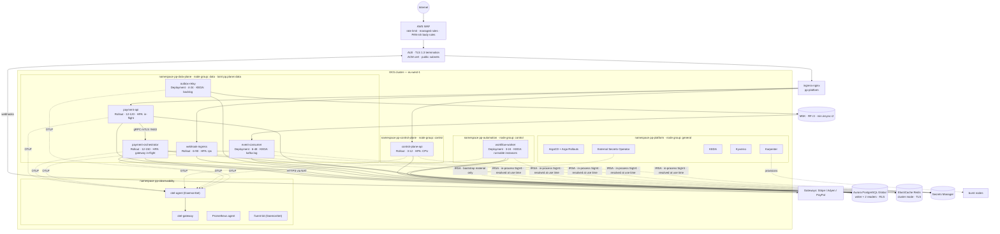
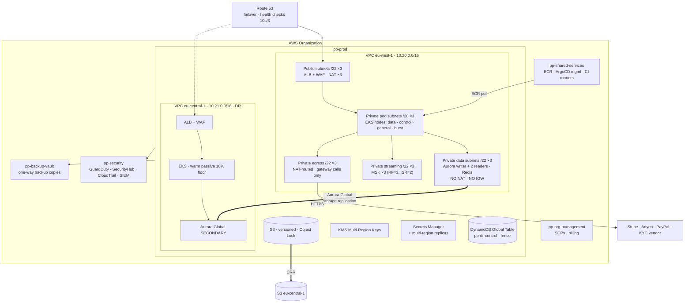
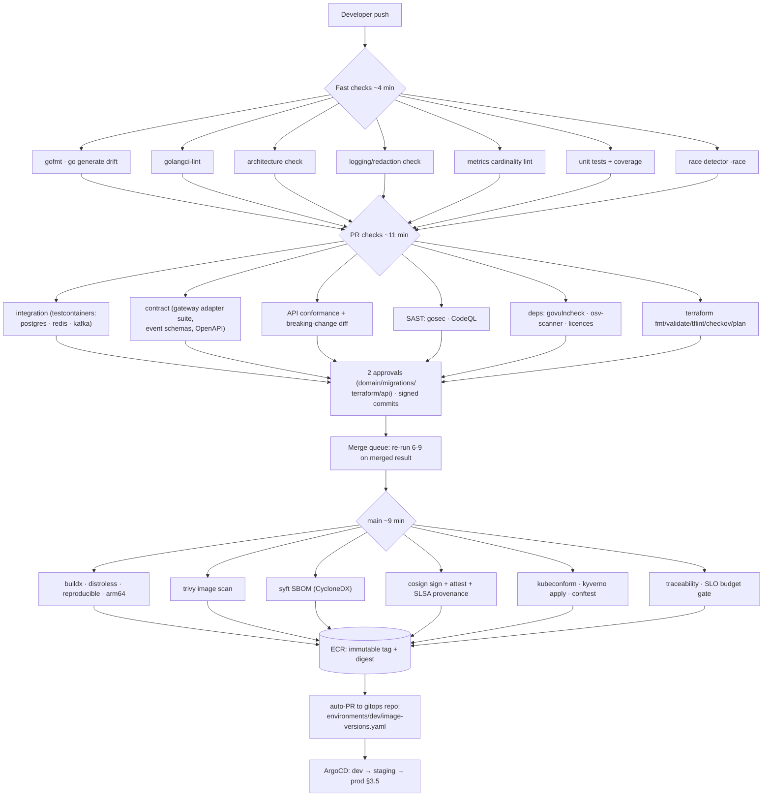

# Deployment

> **Purpose:** how the nine deployables of §5 run — Kubernetes topology and workload configuration, the AWS substrate, GitOps and progressive delivery, the CI/CD gates, zero-downtime database migrations, and environment policy.
> **Derived from and subordinate to [`docs/spec/00-design-baseline.md`](spec/00-design-baseline.md) §5 (deployables and scaling drivers), §18 (NFR targets), §16 (multi-tenancy), §17 (PCI scope, encryption, least privilege), §24 (failure catalog), §25 (repository layout).** Where this document disagrees with the baseline, the baseline wins and this document is a defect.

---

## 0. Shape of the system

| Deployable | Plane | Namespace | Node group | Scaling signal (§5) | Replicas (prod, min–max) | Availability |
|---|---|---|---|---|---|---|
| `control-plane-api` | Control | `pp-control-plane` | `control` | Admin request rate (low) | 3–12 | 99.9 % |
| `payment-api` | Data | `pp-data-plane` | `data` | Payment TPS | 12–120 | 99.99 % |
| `payment-orchestrator` | Data | `pp-data-plane` | `data` | In-flight gateway calls | 12–150 | 99.99 % |
| `workflow-worker` | Automation | `pp-automation` | `control` | Onboarding volume + retry backlog | 3–24 | 99.9 % |
| `webhook-ingress` | Data | `pp-data-plane` | `data` | Gateway webhook volume (spiky) | 6–90 | 99.99 % |
| `outbox-relay` | Data | `pp-data-plane` | `data` | Outbox backlog | 4–24 | 99.99 % |
| `event-consumer` | Data | `pp-data-plane` | `data` | Kafka lag | 6–48 (≤ partition count) | 99.9 % |
| `gateway-simulator` | Test only | `pp-dev` / `pp-staging` | `general` | — | 2 | — |
| `platformctl` | Ops | Job/CronJob, any | `control` | — | — | — |

`gateway-simulator` is `//go:build` guarded out of production images (§5) and, as a second barrier, a Kyverno `ClusterPolicy` in the prod cluster denies any Pod whose image name matches `gateway-simulator`. Two independent controls, because "it will never be deployed to prod" is a statement about intent, not about mechanism.

---

## 1. Kubernetes architecture

### 1.1 Namespaces

| Namespace | Contents | Why separate |
|---|---|---|
| `pp-control-plane` | `control-plane-api`, control-plane CronJobs | Different availability target (99.9 %), different blast radius, different scaling profile. Also the namespace with the most privileged IAM (config writes, credential rotation) |
| `pp-data-plane` | `payment-api`, `payment-orchestrator`, `webhook-ingress`, `outbox-relay`, `event-consumer` | The money path. Strictest NetworkPolicy, strictest PodSecurity, its own node group, its own quota |
| `pp-automation` | `workflow-worker`, workflow CronJobs | Long-running leases and multi-day workflows; must never be evicted by data-plane scale-up pressure |
| `pp-platform` | ArgoCD, Argo Rollouts, cert-manager, external-secrets, Karpenter, Kyverno, ingress controllers | Cluster machinery. Failure here degrades *change*, not *traffic* |
| `pp-observability` | Prometheus agent, otel-gateway, otel-agent (DaemonSet), fluent-bit, Grafana Agent | Must not compete with the money path for CPU; must survive data-plane pressure to report on it |

Every namespace carries:

```yaml
apiVersion: v1
kind: Namespace
metadata:
  name: pp-data-plane
  labels:
    pod-security.kubernetes.io/enforce: restricted
    pod-security.kubernetes.io/enforce-version: latest
    pod-security.kubernetes.io/audit: restricted
    pod-security.kubernetes.io/warn: restricted
    pp.plane: data
---
apiVersion: v1
kind: ResourceQuota
metadata: { name: pp-data-plane-quota, namespace: pp-data-plane }
spec:
  hard:
    requests.cpu: "600"
    requests.memory: 1200Gi
    limits.memory: 1800Gi
    pods: "400"
---
apiVersion: v1
kind: LimitRange
metadata: { name: pp-data-plane-defaults, namespace: pp-data-plane }
spec:
  limits:
  - type: Container
    defaultRequest: { cpu: 100m, memory: 128Mi }
    max: { memory: 8Gi }          # no default CPU limit — see §1.3
```

Default-deny NetworkPolicy in every namespace, with explicit allows:

```yaml
apiVersion: networking.k8s.io/v1
kind: NetworkPolicy
metadata: { name: default-deny, namespace: pp-data-plane }
spec:
  podSelector: {}
  policyTypes: [Ingress, Egress]
---
apiVersion: networking.k8s.io/v1
kind: NetworkPolicy
metadata: { name: payment-orchestrator, namespace: pp-data-plane }
spec:
  podSelector: { matchLabels: { app: payment-orchestrator } }
  policyTypes: [Ingress, Egress]
  ingress:
  - from:
    - podSelector: { matchLabels: { app: payment-api } }
    ports: [{ protocol: TCP, port: 9443 }]
  - from:
    - namespaceSelector: { matchLabels: { pp.plane: observability } }
    ports: [{ protocol: TCP, port: 9090 }]
  egress:
  - to: [{ ipBlock: { cidr: 10.20.32.0/20 } }]          # DB subnets
    ports: [{ protocol: TCP, port: 5432 }]
  - to: [{ ipBlock: { cidr: 10.20.48.0/20 } }]          # MSK / Redis subnets
    ports: [{ protocol: TCP, port: 9094 }, { protocol: TCP, port: 6379 }]
  - to: [{ ipBlock: { cidr: 10.20.64.0/20 } }]          # NAT egress → gateways only
    ports: [{ protocol: TCP, port: 443 }]
  - to: [{ namespaceSelector: {}, podSelector: { matchLabels: { k8s-app: kube-dns } } }]
    ports: [{ protocol: UDP, port: 53 }]
```

`payment-api` has **no** egress to the internet: it never calls a gateway. Only `payment-orchestrator` and `workflow-worker` do. That is the network expression of the bulkhead in §5.

### 1.2 Node groups, taints and tolerations

| Node group | Instance types | Capacity | Taint | Runs |
|---|---|---|---|---|
| `data` | `c7g.4xlarge`, `c7g.8xlarge` (Graviton) | On-demand, 3 AZs, 3× peak headroom (§24) | `pp.plane=data:NoSchedule` | Data-plane workloads only |
| `control` | `m7g.2xlarge` | On-demand + 30 % Spot | `pp.plane=control:NoSchedule` | Control plane, automation, ops jobs |
| `general` | `m7g.xlarge` | Spot-first, on-demand fallback | none | Platform, observability, dev/staging extras |
| `burst` (Karpenter) | `c7g.*`, `c7i.*`, diversified | On-demand, provisioned on demand | `pp.plane=data:NoSchedule` + `karpenter.sh/capacity-type` | Data-plane overflow above the managed floor |

```yaml
# payment-orchestrator pod spec fragment
nodeSelector:
  pp.plane: data
tolerations:
- key: pp.plane
  operator: Equal
  value: data
  effect: NoSchedule
```

**Why separate control-plane and data-plane workloads onto different nodes at all** — the reasoning matters more than the mechanism:

| Reason | Detail |
|---|---|
| **Noisy-neighbour isolation at the kernel level** | A `workflow-worker` running a 30-minute certification suite (§11 step 10) saturates CPU and page cache. Sharing a node with `payment-orchestrator` puts that pressure on the CFS scheduler and the memory reclaim path of a service with a 250 ms p99 SLO. Namespaces and quotas do not isolate page cache, CPU cache or network interrupt handling; nodes do |
| **Different availability targets** | 99.99 % vs 99.9 % is a 10× difference in permitted downtime. Co-locating them means the lower target's incidents (its deploys, its OOMs, its node churn) land on the higher target's compute |
| **Different eviction economics** | The control plane tolerates Spot interruption; the data plane does not. Separate groups let each use the right purchase model — worth roughly 25 % of the control plane's compute bill |
| **Blast radius** | A kernel-level problem caused by one workload (a driver bug, a conntrack exhaustion, a cgroup leak) is contained to one plane |
| **Capacity reasoning** | "Can we survive an AZ loss?" is answerable per node group with a simple sum. Mixed nodes make it a bin-packing question nobody can answer during an incident |

The cost is 10–15 % lower bin-packing efficiency. Paid deliberately.

### 1.3 Resources: requests, limits, and the CPU-limit decision

| Deployable | CPU request | CPU limit | Mem request | Mem limit | Reasoning |
|---|---|---|---|---|---|
| `payment-api` | `500m` | **none** | `512Mi` | `1Gi` | Latency-sensitive. Request = observed p95 usage per pod at target TPS; the HPA keeps utilization near 60 %, so the request is the real allocation |
| `payment-orchestrator` | `1000m` | **none** | `1Gi` | `2Gi` | Holds in-flight gateway calls (up to 8 s each); memory is dominated by connection pools and in-flight request bodies |
| `webhook-ingress` | `300m` | **none** | `256Mi` | `512Mi` | 50 ms budget, accept-and-persist only. Spiky by nature — a limit would throttle exactly during the spike it exists to absorb |
| `control-plane-api` | `300m` | `1500m` | `512Mi` | `1Gi` | Not latency-critical; a limit bounds the blast radius of a pathological admin query |
| `workflow-worker` | `500m` | `2000m` | `1Gi` | `2Gi` | Batch-ish. Certification suites are CPU-heavy and bounded; throttling delays an onboarding step, which has a 30-minute budget |
| `outbox-relay` | `250m` | `1000m` | `256Mi` | `512Mi` | Throughput work with a backlog buffer; brief throttling widens the eventual-consistency window, which is acceptable |
| `event-consumer` | `500m` | `2000m` | `768Mi` | `1536Mi` | Same reasoning; lag is the SLI and it is tolerant of seconds |
| `otel-gateway` | `500m` | `2000m` | `2Gi` | `4Gi` | Tail sampling buffers whole traces; memory is the real constraint (`memory_limiter` processor set to 75 %) |

**Memory limits are always set. CPU limits are deliberately omitted on the latency-sensitive services.** The argument, since it is the configuration most likely to be "fixed" by someone who has not read this:

- A CPU limit is implemented by the Linux CFS bandwidth controller: the cgroup receives `quota` microseconds per 100 ms `period`. When the quota is exhausted, **every thread in the cgroup is stopped until the period rolls over** — for up to the remainder of the 100 ms.
- A Go service with `GOMAXPROCS` = 8 handling a burst can consume its 100 ms quota in ~12 ms of wall clock across eight threads, then sit throttled for 88 ms. That is a **single request** absorbing 35 % of a 250 ms p99 budget while doing no work at all.
- Throttling is invisible in average CPU utilization. A pod throttled 20 % of periods can show 40 % average CPU. Teams chase phantom latency for weeks. `container_cpu_cfs_throttled_seconds_total` is panel 7 of the service-health dashboard for exactly this reason.
- The usual objection is "without a limit a pod can starve its neighbours". It cannot, meaningfully: CPU **requests** are `cpu.shares`, which guarantee a proportional floor under contention. A pod exceeding its request only consumes CPU that would otherwise be idle. The node's total requests are bounded by the scheduler, and the ResourceQuota bounds the namespace.
- Memory is different and gets a limit: memory is not compressible. A leak without a limit takes the node down; a leak with a limit takes one pod down and restarts it. `OOMKilled` on a single pod is survivable; a node under memory pressure evicting arbitrary pods across planes is not.
- `GOMEMLIMIT` is set to 90 % of the memory limit via the downward API, so the Go GC becomes aggressive before the kernel OOM killer becomes involved:

```yaml
env:
- name: GOMEMLIMIT
  valueFrom: { resourceFieldRef: { resource: limits.memory, divisor: "1" } }   # then scaled 0.9 in entrypoint
- name: GOMAXPROCS
  valueFrom: { resourceFieldRef: { resource: requests.cpu, divisor: "1" } }
```

`GOMAXPROCS` from the **request**, not the limit: with no CPU limit, the Go runtime would otherwise see the node's full core count and size its scheduler and GC workers for hardware the pod does not have a claim on.

### 1.4 HPA per deployable

The scaling signal comes from §5. Where the signal is not CPU, it is a custom or external metric.

| Deployable | Primary metric | Target | Min | Max | Notes |
|---|---|---|---|---|---|
| `payment-api` | `pp_http_inflight_requests` (Pod metric) | 40 per pod | 12 | 120 | In-flight, not CPU: it correlates with queueing (the thing that breaks the latency SLO) and reacts before CPU does |
| `payment-orchestrator` | `pp_gateway_inflight_calls` (Pod metric) | 60 per pod | 12 | 150 | Gateway calls are I/O-bound; CPU stays low while the pod is fully occupied. CPU-based HPA would under-scale badly here |
| `webhook-ingress` | `pp_http_requests_total` rate (Pod metric) | 150 rps per pod | 6 | 90 | Spiky; aggressive scale-up policy, conservative scale-down |
| `control-plane-api` | CPU utilization | 65 % | 3 | 12 | Ordinary request/response service |
| `workflow-worker` | KEDA: `workflow_instances_runnable` | 20 per pod | 3 | 24 | See §1.5 |
| `outbox-relay` | KEDA: `pp_outbox_backlog` | 5 000 rows per pod | 4 | 24 | See §1.5 |
| `event-consumer` | KEDA: Kafka lag | 10 000 msgs per pod | 6 | 48 | Capped at the partition count — 48 for `pp.payments.payment.v1` (§13.3). More pods than partitions is idle pods |

```yaml
apiVersion: autoscaling/v2
kind: HorizontalPodAutoscaler
metadata: { name: payment-api, namespace: pp-data-plane }
spec:
  scaleTargetRef: { apiVersion: argoproj.io/v1alpha1, kind: Rollout, name: payment-api }
  minReplicas: 12
  maxReplicas: 120
  metrics:
  - type: Pods
    pods:
      metric: { name: pp_http_inflight_requests }
      target: { type: AverageValue, averageValue: "40" }
  - type: Resource
    resource: { name: cpu, target: { type: Utilization, averageUtilization: 70 } }   # safety net only
  behavior:
    scaleUp:
      stabilizationWindowSeconds: 0            # react immediately: this is the money path
      policies:
      - { type: Percent, value: 100, periodSeconds: 30 }   # double every 30s
      - { type: Pods,    value: 20,  periodSeconds: 30 }
      selectPolicy: Max
    scaleDown:
      stabilizationWindowSeconds: 600          # 10 min: scaling down into a traffic wave is self-inflicted
      policies:
      - { type: Percent, value: 10, periodSeconds: 120 }
      selectPolicy: Min
```

The asymmetry between `scaleUp` and `scaleDown` is the whole design: over-provisioning costs money, under-provisioning costs payments. The minimum of 12 is not a cost floor — it is the number of pods needed to survive an AZ loss (4 per AZ) while retaining capacity headroom.

### 1.5 KEDA for queue-depth-driven scaling

CPU is a terrible proxy for "there is a backlog". Three workloads scale on depth instead.

```yaml
apiVersion: keda.sh/v1alpha1
kind: ScaledObject
metadata: { name: event-consumer, namespace: pp-data-plane }
spec:
  scaleTargetRef: { name: event-consumer }
  minReplicaCount: 6
  maxReplicaCount: 48                      # == partitions of pp.payments.payment.v1
  pollingInterval: 15
  cooldownPeriod: 300
  advanced:
    horizontalPodAutoscalerConfig:
      behavior:
        scaleDown: { stabilizationWindowSeconds: 300 }
  triggers:
  - type: kafka
    metadata:
      bootstrapServers: b-1.pp-prod.kafka.eu-west-1.amazonaws.com:9096
      consumerGroup: pp-event-consumer
      topic: pp.payments.payment.v1
      lagThreshold: "10000"
      offsetResetPolicy: earliest
      allowIdleConsumers: "false"
    authenticationRef: { name: msk-iam-auth }
---
apiVersion: keda.sh/v1alpha1
kind: ScaledObject
metadata: { name: outbox-relay, namespace: pp-data-plane }
spec:
  scaleTargetRef: { name: outbox-relay }
  minReplicaCount: 4                       # never zero: the outbox must always be draining
  maxReplicaCount: 24
  triggers:
  - type: prometheus
    metadata:
      serverAddress: http://prometheus.pp-observability:9090
      query: sum(pp_outbox_backlog)
      threshold: "5000"
---
apiVersion: keda.sh/v1alpha1
kind: ScaledObject
metadata: { name: workflow-worker, namespace: pp-automation }
spec:
  scaleTargetRef: { name: workflow-worker }
  minReplicaCount: 3
  maxReplicaCount: 24
  cooldownPeriod: 900                      # a step can hold a lease for minutes; do not churn workers
  triggers:
  - type: postgresql
    metadata:
      query: >-
        SELECT count(*) FROM workflow_instances
        WHERE state='RUNNABLE' AND (lease_expires_at IS NULL OR lease_expires_at < now())
      targetQueryValue: "20"
    authenticationRef: { name: pg-workflow-auth }
```

Nothing scales to zero. `minReplicaCount: 0` would mean the outbox stops draining when idle, the first event after quiet hours waits for a cold start, and — worse — `pp_outbox_backlog` would be the metric that both triggers the scale-up and is made worse by the delay. Scale-to-zero belongs in dev, not on the money path.

### 1.6 PDBs, spread and anti-affinity

```yaml
apiVersion: policy/v1
kind: PodDisruptionBudget
metadata: { name: payment-api, namespace: pp-data-plane }
spec:
  minAvailable: 75%              # percentage, not a count: it scales with the HPA
  selector: { matchLabels: { app: payment-api } }
```

| Deployable | PDB | Reasoning |
|---|---|---|
| `payment-api`, `payment-orchestrator`, `webhook-ingress` | `minAvailable: 75%` | Survives an AZ drain (33 %) plus a rolling node upgrade concurrently |
| `outbox-relay`, `event-consumer` | `maxUnavailable: 25%` | Throughput workloads; expressed as max-unavailable because absolute capacity matters less than not stopping entirely |
| `control-plane-api` | `minAvailable: 2` | Small deployment; a percentage rounds badly at 3 replicas |
| `workflow-worker` | `maxUnavailable: 1` | Leases; losing several workers at once means many instances waiting out lease expiry |

```yaml
topologySpreadConstraints:
- maxSkew: 1
  topologyKey: topology.kubernetes.io/zone
  whenUnsatisfiable: DoNotSchedule          # hard: AZ balance is a correctness property for AZ-loss survival
  labelSelector: { matchLabels: { app: payment-api } }
  matchLabelKeys: [pod-template-hash]       # spread is evaluated per revision, so a canary is also balanced
- maxSkew: 2
  topologyKey: kubernetes.io/hostname
  whenUnsatisfiable: ScheduleAnyway         # soft: node balance is a preference
  labelSelector: { matchLabels: { app: payment-api } }
affinity:
  podAntiAffinity:
    preferredDuringSchedulingIgnoredDuringExecution:
    - weight: 100
      podAffinityTerm:
        topologyKey: kubernetes.io/hostname
        labelSelector: { matchLabels: { app: payment-api } }
```

Zone spread is hard (`DoNotSchedule`) because §24 commits to surviving AZ loss with headroom; a deployment that drifted 8/2/2 across zones silently voids that. Host spread is soft, because refusing to schedule during a node shortage is worse than two pods sharing a host. `matchLabelKeys: [pod-template-hash]` is what keeps a 10 %-weight canary from landing entirely in one AZ — without it, a 3-pod canary is routinely zone-skewed, and its analysis then measures one AZ's behaviour.

### 1.7 Probes

| Probe | Question | Failure action | **Must not** depend on |
|---|---|---|---|
| `startupProbe` | "Has it finished booting?" | Restart, and suppress the other probes until it passes | anything slow it does not control |
| `readinessProbe` | "Should it receive traffic right now?" | Remove from Service endpoints | — (it *may* depend on downstreams) |
| `livenessProbe` | "Is it wedged such that only a restart helps?" | **Kill the container** | **any downstream — this is the critical rule** |

```yaml
startupProbe:
  httpGet: { path: /healthz, port: 8081 }
  periodSeconds: 2
  failureThreshold: 45            # 90s budget: config snapshot load, JWKS fetch, pool warm-up
readinessProbe:
  httpGet: { path: /readyz, port: 8081 }
  periodSeconds: 5
  timeoutSeconds: 2
  successThreshold: 1
  failureThreshold: 2             # 10s to leave rotation — fast, because it is reversible
livenessProbe:
  httpGet: { path: /livez, port: 8081 }
  periodSeconds: 10
  timeoutSeconds: 3
  failureThreshold: 6             # 60s — slow, because it is destructive
```

| Endpoint | Checks |
|---|---|
| `/livez` | Process responsive; the HTTP mux is serving; no deadlocked internal goroutine (a watchdog counter advanced within the last 30 s); **nothing else**. It never touches Postgres, Redis, Kafka or a gateway |
| `/readyz` | DB writer reachable (cached, 5 s TTL); DR fence says this region is writable (`disaster-recovery.md` §3); config snapshot age < `max_config_staleness`; not draining; Kafka producer connected (`outbox-relay` only) |
| `/healthz` | Deep composite for the load balancer and Route 53 health checks: `/readyz` plus dependency detail. Never used as a liveness probe |

**Why liveness must not depend on downstreams**, since this is the single most damaging probe misconfiguration in production Kubernetes: suppose `/livez` checked the database. Aurora fails over (§24: ≤ 60 s). Every pod's liveness probe fails simultaneously. The kubelet kills **every pod in the fleet**. The database recovers 40 s later into a cluster with zero warm pods, empty connection pools, cold caches and a thundering herd of restarts — turning a 60-second transparent database failover into a 10-minute total outage. The correct behaviour is: readiness fails (traffic sheds, `503` with `Retry-After`, the load balancer stops sending), liveness holds (pods stay alive, warm, and connected), and when the writer returns, readiness recovers within one probe interval. Readiness is reversible; liveness is not. Downstream state belongs only in the reversible one.

### 1.8 Graceful shutdown

The arithmetic, because getting it wrong produces `502`s during every deploy:

```yaml
terminationGracePeriodSeconds: 75
lifecycle:
  preStop:
    exec:
      command: ["/bin/sh", "-c", "sleep 15"]
```

Sequence and budget for `payment-api`:

| t | Event |
|---|---|
| 0 s | `SIGTERM` sent **and** the pod is removed from Endpoints — these are concurrent and unordered; this is the race `preStop` exists to close |
| 0 s | `preStop` sleeps 15 s. The container keeps serving normally during this window |
| 0–10 s | kube-proxy / the ALB target group converge. The ALB deregistration delay is 10 s; in-flight connections continue |
| 15 s | `preStop` returns; `SIGTERM` reaches the process. The server enters draining: `/readyz` returns 503, `Connection: close` on responses, no new connections accepted |
| 15–65 s | In-flight requests complete. Budget = the longest legitimate request: an 8 s gateway call (§12 stage 14) + 2 retries + pipeline ≈ 30 s, with headroom to 50 s |
| 65 s | Server closes; flush the OTel batcher (2 s), close DB pool, close Kafka producer (flush pending), release workflow leases |
| 75 s | Grace period ends; `SIGKILL` if still alive |

**The `preStop` sleep is not a workaround for slow shutdown — it exists because endpoint removal is asynchronous.** Without it, the process starts refusing connections while kube-proxy on some nodes still routes to it, producing connection resets that clients see as `502`. Sleeping first lets propagation win the race.

Per-deployable values:

| Deployable | `terminationGracePeriodSeconds` | `preStop` | Longest in-flight unit of work |
|---|---|---|---|
| `payment-api` | 75 | sleep 15 | Full pipeline including gateway call |
| `payment-orchestrator` | 90 | sleep 10 | 8 s gateway call + 2 retries + L6 + commit |
| `webhook-ingress` | 45 | sleep 15 | 50 ms budget — dominated by the propagation window |
| `control-plane-api` | 60 | sleep 15 | Config validation and publish |
| `workflow-worker` | 120 | sleep 5 | Finish the current activity or checkpoint it; **release the lease explicitly** so another worker resumes immediately instead of waiting out the expiry |
| `outbox-relay` | 60 | sleep 5 | Finish the in-flight publish batch and mark it published |
| `event-consumer` | 90 | sleep 5 | Finish the in-flight message, commit the offset. Never commit an offset for a message not fully handled |

None of these workloads *needs* graceful shutdown for correctness — every one is crash-safe by design (leases, outbox, dedup, idempotency). Graceful shutdown exists to avoid user-visible errors and unnecessary reconciliation work, not to protect data. That distinction is why the numbers can be tuned freely without a correctness review.

### 1.9 Priority classes

```yaml
apiVersion: scheduling.k8s.io/v1
kind: PriorityClass
metadata: { name: pp-money-path }
value: 1000000
globalDefault: false
preemptionPolicy: PreemptLowerPriority
description: "payment-api, payment-orchestrator, webhook-ingress, outbox-relay"
```

| Class | Value | Workloads |
|---|---|---|
| `pp-money-path` | 1000000 | `payment-api`, `payment-orchestrator`, `webhook-ingress`, `outbox-relay` |
| `pp-platform-critical` | 900000 | CoreDNS, kube-proxy, CNI, otel-agent, Karpenter |
| `pp-control-plane` | 500000 | `control-plane-api`, `workflow-worker`, `event-consumer` |
| `pp-observability` | 400000 | Prometheus, otel-gateway, fluent-bit |
| `pp-batch` | 100000 | CronJobs, certification runs, reconciliation sweeps |
| `pp-preview` | 0 | Ephemeral preview environments (dev cluster only) |

Under node pressure the eviction order is the reverse: batch first, then observability, then control plane. Observability ranks below the control plane but above batch — losing metrics during an incident is bad, but losing the ability to configure the platform is worse. `otel-agent` is an exception at platform-critical priority because it is a DaemonSet whose eviction produces no capacity relief anyway.

### 1.10 Security context

```yaml
spec:
  automountServiceAccountToken: false      # true only where the Kubernetes API is actually used
  serviceAccountName: payment-orchestrator # IRSA-annotated
  securityContext:
    runAsNonRoot: true
    runAsUser: 65532
    runAsGroup: 65532
    fsGroup: 65532
    seccompProfile: { type: RuntimeDefault }
  containers:
  - name: payment-orchestrator
    image: <registry>/payment-orchestrator@sha256:…    # digest, never a tag
    imagePullPolicy: IfNotPresent
    securityContext:
      allowPrivilegeEscalation: false
      readOnlyRootFilesystem: true
      privileged: false
      capabilities: { drop: ["ALL"] }
    volumeMounts:
    - { name: tmp, mountPath: /tmp }
    - { name: cache, mountPath: /var/cache/pp }
  volumes:
  - { name: tmp,   emptyDir: { medium: Memory, sizeLimit: 64Mi } }
  - { name: cache, emptyDir: { sizeLimit: 512Mi } }
```

| Control | Enforcement |
|---|---|
| Distroless base (`gcr.io/distroless/static-debian12:nonroot`) | No shell, no package manager, no `curl` — nothing for an RCE to pivot with. Also shrinks the CVE surface to the Go binary itself |
| Digest-pinned images | Kyverno `ClusterPolicy` denies any image reference containing `:` without `@sha256:`. A mutable tag means "you do not know what is running" |
| Image signature verification | Kyverno `verifyImages` against the Cosign key/Fulcio identity; unsigned images are denied at admission (§4) |
| `readOnlyRootFilesystem` | Writable paths are explicit `emptyDir`s; `/tmp` is `medium: Memory` so nothing transient touches disk |
| `automountServiceAccountToken: false` | The default of mounting a token into every pod is a lateral-movement gift. Enabled only for ArgoCD, KEDA and the operators that need it |
| Secrets | Never in env vars or ConfigMaps — env vars carry `secret://` **references**, never material. Gateway credentials and webhook signing secrets are resolved **in-process at the moment of use** through `ports.SecretsProvider`: the AWS backend talks to Secrets Manager directly over `net/http` with an in-package SigV4 signer and IRSA session credentials from STS, caches for a bounded TTL, and wraps everything in `Secret[T]`/`Material` (§17.2). External Secrets Operator is for bootstrap material that must exist as a mounted file before the process starts, not for the money path's credentials. In sandbox the same port is served by the file backend, which `secrets.New` will not select for a production environment |
| PodSecurity `restricted` | Namespace-level enforcement (§1.1) |
| Kyverno policies | Deny `hostNetwork`/`hostPID`/`hostPath`, deny `latest`, deny missing resource requests, deny missing `pp.plane` label, deny `gateway-simulator` in prod, require `securityContext` fields, require a PDB for every Deployment with > 1 replica |

### 1.11 Kubernetes architecture diagram



---

## 2. AWS architecture

### 2.1 Account structure

| Account | Purpose | Notes |
|---|---|---|
| `pp-org-management` | Organizations root, SCPs, consolidated billing | No workloads. Break-glass only |
| `pp-security` | GuardDuty/Security Hub delegated admin, CloudTrail org trail destination, SIEM ingestion | Read-only into every account |
| `pp-shared-services` | ECR, shared Route 53 zones, ArgoCD management cluster, CI runners | Cross-account ECR pull; no production data |
| `pp-prod` | Production workloads, both regions | The only account with production money data |
| `pp-staging` | Staging | Production-shaped, synthetic data only |
| `pp-dev` | Dev + ephemeral previews | Relaxed guardrails, hard cost caps |
| `pp-backup-vault` | Cross-account backup copies | One-way trust; production admin cannot delete from here (`disaster-recovery.md` §5.1) |
| `pp-card-vault` | **Reserved.** If a tenant requires vaulting, PCI SAQ-D scope lives here | Separate VPC, cluster, HSM/KMS, change control (§17.1). Not part of this repository |

Service Control Policies applied at the OU level: deny disabling CloudTrail/GuardDuty/Config; deny KMS key deletion outside a break-glass role; deny S3 public access; deny unencrypted RDS/EBS/S3 creation; deny `rds:DeleteDBCluster` without `DeletionProtection=false` having been set in a separate prior call; deny actions outside the approved regions; deny root-user actions except the documented break-glass procedure.

### 2.2 VPC and CIDR plan

One VPC per environment per region, `/16`, non-overlapping so any pair can be peered or attached to a Transit Gateway without renumbering.

| Environment | Region | VPC CIDR |
|---|---|---|
| prod | `eu-west-1` | `10.20.0.0/16` |
| prod | `eu-central-1` (DR) | `10.21.0.0/16` |
| staging | `eu-west-1` | `10.30.0.0/16` |
| dev | `eu-west-1` | `10.40.0.0/16` |

Subnet plan within `10.20.0.0/16` (prod, Region A):

| Tier | AZ-a | AZ-b | AZ-c | Size | Route |
|---|---|---|---|---|---|
| Public (ALB, NAT) | `10.20.0.0/22` | `10.20.4.0/22` | `10.20.8.0/22` | 1 022 each | IGW |
| Private — EKS pods/nodes | `10.20.16.0/20` | `10.20.80.0/20` | `10.20.96.0/20` | 4 094 each | NAT (per AZ) |
| Private — data (Aurora, Redis) | `10.20.32.0/22` | `10.20.36.0/22` | `10.20.40.0/22` | 1 022 each | **no NAT, no IGW** |
| Private — streaming (MSK) | `10.20.48.0/22` | `10.20.52.0/22` | `10.20.56.0/22` | 1 022 each | no NAT |
| Private — egress (NAT-attached, gateway calls) | `10.20.64.0/22` | `10.20.68.0/22` | `10.20.72.0/22` | 1 022 each | NAT |
| Reserved for growth | `10.20.112.0/20` … | | | | |

Pod subnets are `/20` each because the VPC CNI assigns real VPC IPs per pod: 400 pods × several ENI-attached IPs consumes address space fast, and a CNI IP exhaustion event during a scale-up is an outage that looks like a scheduling problem. Prefix delegation (`ENABLE_PREFIX_DELEGATION=true`) is enabled, allocating `/28`s per ENI, which raises pod density per node and reduces EC2 API churn during scale-out.

VPC endpoints (Interface, PrivateLink) for: `s3` (Gateway), `dynamodb` (Gateway), `ecr.api`, `ecr.dkr`, `secretsmanager`, `kms`, `sts`, `logs`, `monitoring`, `sqs`, `kafka`, `elasticache`, `aps-workspaces`. Data-tier subnets have no NAT at all — an Aurora instance has no business reaching the internet, and the absence of a route is a stronger control than a security-group rule.

### 2.3 EKS

| Aspect | Configuration |
|---|---|
| Version | N−1 of the latest EKS release; upgraded quarterly, staging first, one minor at a time |
| API endpoint | Private, with a public endpoint restricted to the CI/bastion CIDR allowlist |
| Authentication | EKS Access Entries (not `aws-auth` ConfigMap); SSO-federated roles mapped to RBAC groups |
| Control-plane logs | api, audit, authenticator, controllerManager, scheduler → CloudWatch → SIEM |
| Encryption | Envelope encryption of Kubernetes Secrets with a dedicated KMS CMK |
| **Managed node groups** | The baseline capacity: `data`, `control`, `general`. Predictable, AZ-pinned ASGs, sized for AZ-loss survival |
| **Karpenter** | Burst capacity above the managed floor. `consolidationPolicy: WhenUnderutilized`, `expireAfter: 720h`, diversified instance types, on-demand for the `data` pool |
| Why both | Managed node groups give a **guaranteed, always-warm floor** with capacity that is reserved and AZ-balanced; Karpenter gives fast, right-sized burst without maintaining a dozen ASGs. Karpenter alone would mean an incident's scale-up racing EC2 capacity availability with no floor beneath it. Managed alone would mean over-provisioning for peak permanently |

Add-ons (all as EKS managed add-ons where available, otherwise ArgoCD-managed):

| Add-on | Notes |
|---|---|
| VPC CNI | Prefix delegation, network policy enforcement enabled |
| CoreDNS | 3+ replicas, `NodeLocal DNSCache` DaemonSet — DNS latency shows up directly in the p99 |
| kube-proxy | IPVS mode |
| EBS CSI | Only for observability PVCs; no application workload uses persistent volumes |
| Pod Identity Agent | Preferred over IRSA for new workloads (no OIDC trust-policy sprawl, no token-file mounting) |
| AWS Load Balancer Controller | Manages ALB/NLB from Ingress/Service objects |
| ExternalDNS | Route 53 records from Ingress |
| Metrics Server, KEDA, Kyverno, cert-manager, External Secrets, Argo CD, Argo Rollouts | ArgoCD-managed |

**IRSA / Pod Identity:** one IAM role per deployable (§17.2 least privilege), never a shared role.

```hcl
# terraform/modules/service-identity — per deployable
resource "aws_iam_role" "payment_orchestrator" {
  name               = "pp-prod-payment-orchestrator"
  assume_role_policy = data.aws_iam_policy_document.pod_identity_trust.json
}

data "aws_iam_policy_document" "payment_orchestrator" {
  statement {                                    # gateway credentials, scoped by path
    actions   = ["secretsmanager:GetSecretValue", "secretsmanager:DescribeSecret"]
    resources = ["arn:aws:secretsmanager:*:${var.account}:secret:/prod/*/*/gateway/*"]
  }
  statement {
    actions   = ["kms:Decrypt"]
    resources = [aws_kms_key.tenant_data.arn]
    condition {
      test     = "StringEquals"
      variable = "kms:ViaService"
      values   = ["secretsmanager.${var.region}.amazonaws.com"]
    }
  }
  statement {
    actions   = ["kafka-cluster:Connect", "kafka-cluster:WriteData", "kafka-cluster:DescribeTopic"]
    resources = ["arn:aws:kafka:${var.region}:${var.account}:topic/pp-prod/*/pp.payments.*"]
  }
}
```

`payment-orchestrator` cannot read `/prod/*/*/kyc/*`; `workflow-worker` cannot write to `pp.payments.*`. The blast radius of a compromised pod is the union of one role's statements, and each role is small enough to read in one screen.

### 2.4 Data services

| Service | Configuration | Notes |
|---|---|---|
| **Aurora PostgreSQL Global** | Engine 15.x; Region A: writer + 2 readers `db.r6g.4xlarge`; Region B: 2 readers; Performance Insights 7 d; `rds.force_ssl=1`; `log_min_duration_statement=200ms`; deletion protection on; 35 d backup retention | Topology, replication and failover: [`docs/disaster-recovery.md`](disaster-recovery.md) §4.1 |
| Aurora — connections | App connects through **PgBouncer** (transaction pooling) as a sidecar-less Deployment in `pp-data-plane`; `max_connections` sized to `2 × vCPU + effective_spindles`, pool per service | Postgres connections are expensive; 120 `payment-api` pods × a 20-connection pool would exhaust the cluster |
| Aurora — RLS | App role is **not** `BYPASSRLS`; `SET LOCAL app.tenant_id` per transaction (§16.1) | PgBouncer transaction pooling is compatible precisely because the setting is `LOCAL` (transaction-scoped) |
| **MSK** | 3 brokers `kafka.m5.2xlarge`, one per AZ; RF=3; `min.insync.replicas=2`; `unclean.leader.election.enable=false`; SASL/IAM; encryption in transit and at rest (KMS); tiered storage for `pp.audit.v1` | Topics and partitions per §13.3 |
| **ElastiCache Redis** | Cluster mode enabled, 3 shards × 1 replica across 3 AZs, `cache.r7g.large`, TLS in transit, auth token from Secrets Manager, automatic failover, `maxmemory-policy: volatile-lru` | `volatile-lru` not `allkeys-lru`: keys without a TTL (rate-limit buckets) must not be evicted ahead of cache entries that have one |
| **S3** | Buckets per `disaster-recovery.md` §4.4; SSE-KMS; Block Public Access at the account level; TLS-only bucket policies; lifecycle to Glacier IR | |
| **KMS** | Multi-Region Keys: `pp-prod-rds`, `pp-prod-s3`, `pp-prod-secrets`, `pp-prod-eks`, plus a CMK per siloed tenant (§16.1); annual automatic rotation | |
| **Secrets Manager** | Multi-region replica secrets; rotation Lambdas for DB credentials (30 d) and gateway credentials (≤ 90 d with dual-run overlap, §17.2) | |
| **DynamoDB Global Table** | `pp-dr-control` (the DR fencing token, `disaster-recovery.md` §3) | The only DynamoDB in the stack; chosen for its cross-region conditional-write semantics |

### 2.5 Edge: ALB, NLB, WAF, Route 53

| Layer | Choice | Reasoning |
|---|---|---|
| **ALB** for `/v1/*` and `/v1/webhooks/*` | Layer 7: path routing, header inspection, WAF association, TLS 1.3 termination with ACM, HTTP/2, per-target deregistration delay | The API is HTTP with routing and WAF requirements — L7 is the right layer |
| **NLB** for internal gRPC (`payment-api` → `payment-orchestrator`) | Layer 4, preserves the client connection, no HTTP/2 re-framing, lower latency | Also mostly moot: internal gRPC goes pod-to-pod through the CNI with mTLS; the NLB exists for cross-cluster and for the service mesh's ingress gateway |
| **API Gateway** | **Not used** on the money path | It adds ~10–20 ms, a 29 s hard integration timeout that conflicts with the 8 s gateway budget plus retries, and a request/response size ceiling — for features (throttling, keys, usage plans) already implemented in the pipeline (§12 stages 3–6) with per-tenant semantics API Gateway cannot express. It **is** used for the low-traffic partner/webhook-registration API in `pp-shared-services`, where its managed features are worth the latency |
| **WAF** on the ALB | AWS managed rule groups (Core, Known Bad Inputs, IP Reputation, Anonymous IP), a rate-based rule at 2 000 req/5 min per IP, a body-size cap, geo-blocking for sanctioned jurisdictions (§23 `blockedCountries` is a *policy* decision; WAF geo-blocking is a coarse edge control), and a custom rule matching long digit runs in the body as a **defence-in-depth** signal for the L1 PAN detector | WAF is not the PAN control — L1 is (§17.2). WAF catches the traffic that should never have reached the app |
| **Route 53** | Public hosted zone `api.example.com`; **failover** routing policy with health checks | See below |

```hcl
resource "aws_route53_health_check" "region_a" {
  fqdn              = "alb-eu-west-1.example.com"
  type              = "HTTPS"
  resource_path     = "/healthz"
  port              = 443
  request_interval  = 10          # fast interval
  failure_threshold = 3           # → ~30s to unhealthy
  regions           = ["eu-west-1", "us-east-1", "ap-southeast-1"]
  measure_latency   = true
}

resource "aws_route53_record" "api_primary" {
  zone_id         = var.zone_id
  name            = "api.example.com"
  type            = "A"
  set_identifier  = "eu-west-1"
  health_check_id = aws_route53_health_check.region_a.id
  failover_routing_policy { type = "PRIMARY" }
  alias { name = aws_lb.a.dns_name, zone_id = aws_lb.a.zone_id, evaluate_target_health = true }
  ttl = 60
}
```

TTL 60 s balances failover speed against resolver load; the RTO budget (`disaster-recovery.md` §6) assumes 60–120 s of DNS convergence. Route 53 moves *traffic* only — write authority moves via the fencing token, never via DNS.

### 2.6 Observability infrastructure

| Component | Service | Notes |
|---|---|---|
| Metrics | **Amazon Managed Prometheus (AMP)** | Prometheus agent-mode in-cluster, `remote_write` with `send_exemplars: true`, sigv4 auth. Recording and alerting rules live in AMP's rule groups (Terraform-managed) |
| Alert routing | AMP Alert Manager → SNS → PagerDuty + Slack | |
| Dashboards | **Amazon Managed Grafana**, SSO-federated | Datasources: AMP, Tempo, Loki, CloudWatch. Dashboards as code. The intended source is a `deployments/observability/dashboards` directory, which **does not exist** — `deployments/grafana/` holds what there is | <!-- doc-refs: allow-missing -->
| Traces | Tempo on EKS, S3 backend | AWS X-Ray is not used: OTel-native, no trace-format translation, and tail sampling (`observability.md` §2.2) needs a collector we control |
| Logs | fluent-bit → Loki (S3-backed) + S3 archive | CloudWatch Logs is used only for AWS-service logs (EKS control plane, VPC flow logs, RDS) |
| Infra metrics | CloudWatch → AMP via the CloudWatch exporter | Aurora, MSK, ElastiCache, ALB, Route 53 health checks |
| Audit/security | CloudTrail (org trail) + GuardDuty + Security Hub + Config → `pp-security` → SIEM | Separate from application audit (BC-9), which is hash-chained in Aurora |

### 2.7 Cost notes

| Line | Driver | Control |
|---|---|---|
| EKS compute | ~55 % of infra spend | Graviton everywhere (~20 % better price/perf); Spot for `general` and 30 % of `control`; Karpenter consolidation; 3-year Compute Savings Plans covering the managed floor, on-demand for burst |
| Aurora | ~20 % | Reserved instances for the writer and steady readers; Region B secondary at half class (`disaster-recovery.md` §4.1.4); Graviton |
| MSK | ~8 % | Right-sized brokers; tiered storage for `pp.audit.v1` (400 d retention on broker storage would be absurd); **no cross-region replication** (`disaster-recovery.md` §4.2) — a deliberate saving that also improves correctness |
| Data transfer | ~6 % | Cross-AZ traffic is the hidden line. Topology-aware routing where safe; node-local otel-agent; VPC endpoints to keep S3/ECR/Secrets traffic off NAT. **Cross-AZ is not avoided on the money path** — HA beats the transfer bill |
| NAT Gateway | ~3 % | One per AZ (required for AZ independence); VPC endpoints remove the bulk of the volume |
| Observability | ~5 % | Head + tail sampling, log sampling, cardinality limits (`observability.md` §2.6). Without them this line doubles |
| Non-prod | ~3 % | Dev scales to zero out of hours; previews TTL 72 h; hard budget caps with automated teardown |

Cost is an SLI: `pp_observability_cost_usd_estimate` and AWS Budgets alarms at 80 % / 100 % / 120 % of the monthly forecast, routed to the platform team, not to finance.

### 2.8 AWS architecture diagram



---

## 3. GitOps

### 3.1 Repository layout

Two repositories, deliberately.

```
payments-platform/                 # application repo (this one, §25)
  cmd/ internal/ pkg/ api/ migrations/ tests/
  deployments/k8s/base/            # kustomize base per deployable
  deployments/k8s/overlays/{dev,staging,prod}/
  helm/                            # umbrella chart + per-service subcharts
  terraform/                       # modules + per-env stacks
  .github/workflows/

payments-platform-gitops/          # deployment state repo
  clusters/
    prod-eu-west-1/   { apps.yaml, platform.yaml, values/ }
    prod-eu-central-1/{ apps.yaml, platform.yaml, values/ }
    staging-eu-west-1/
    dev-eu-west-1/
  applicationsets/
    data-plane.yaml  control-plane.yaml  automation.yaml  platform.yaml  observability.yaml
  environments/
    prod/{ image-versions.yaml, config.yaml }
    staging/…  dev/…
  previews/                        # generated by the PR workflow, TTL-reaped
```

Splitting them means: a production deploy is a commit to the GitOps repo that changes one image digest, reviewable in ten seconds; the application repo's history is code, not deployment noise; and CI's write access to production is confined to "may open a PR that changes an image digest in the GitOps repository's `environments/prod/image-versions.yaml`" — it holds no cluster credentials at all. That file lives in the **separate GitOps repository**, not in this one. <!-- doc-refs: allow-missing -->

### 3.2 ArgoCD ApplicationSets

```yaml
apiVersion: argoproj.io/v1alpha1
kind: ApplicationSet
metadata: { name: pp-data-plane, namespace: argocd }
spec:
  goTemplate: true
  generators:
  - matrix:
      generators:
      - list:
          elements:
          - { cluster: prod-eu-west-1,    env: prod,    region: eu-west-1,    active: "true"  }
          - { cluster: prod-eu-central-1, env: prod,    region: eu-central-1, active: "false" }
          - { cluster: staging-eu-west-1, env: staging, region: eu-west-1,    active: "true"  }
      - list:
          elements:
          - { app: payment-api,          wave: "2" }
          - { app: payment-orchestrator, wave: "2" }
          - { app: webhook-ingress,      wave: "2" }
          - { app: outbox-relay,         wave: "3" }
          - { app: event-consumer,       wave: "3" }
  template:
    metadata:
      name: '{{.app}}-{{.cluster}}'
      annotations:
        argocd.argoproj.io/sync-wave: '{{.wave}}'
        notifications.argoproj.io/subscribe.on-sync-failed.slack: pp-deploys
    spec:
      project: pp-{{.env}}
      source:
        repoURL: https://github.com/example/payments-platform-gitops
        targetRevision: main
        path: clusters/{{.cluster}}/apps/{{.app}}
        helm:
          valueFiles:
          - ../../../../helm/values/base.yaml
          - ../../../../helm/values/{{.env}}.yaml
          - values.yaml
          parameters:
          - { name: global.region,        value: '{{.region}}' }
          - { name: global.region.active, value: '{{.active}}' }
      destination: { name: '{{.cluster}}', namespace: pp-data-plane }
      syncPolicy:
        automated: { prune: true, selfHeal: true, allowEmpty: false }
        syncOptions: [CreateNamespace=false, ApplyOutOfSyncOnly=true, ServerSideApply=true]
        retry: { limit: 5, backoff: { duration: 10s, factor: 2, maxDuration: 5m } }
```

`selfHeal: true` on production is a decision with teeth: a `kubectl edit` made during an incident is reverted within minutes. That is intentional — undocumented drift is how the DR premise ("re-apply Git and you have the cluster back", `disaster-recovery.md` §4.6) quietly becomes false. Emergency changes go through a break-glass PR with a one-approver rule, which takes about ninety seconds and leaves a record.

### 3.3 Sync waves and hooks

Ordering within a sync, lowest wave first; a wave completes (all resources Healthy) before the next begins.

| Wave | Contents | Why here |
|---|---|---|
| `-2` | Namespaces, ResourceQuotas, LimitRanges, NetworkPolicies, PriorityClasses, ServiceAccounts, RBAC | Must exist before anything references them |
| `-1` | ExternalSecrets, ConfigMaps, CRDs | Workloads mount these |
| `0` | **PreSync hook: database migrations** | See below |
| `1` | Services, ServiceMonitors, PodMonitors | Endpoints ready for the workloads that follow |
| `2` | `payment-api`, `payment-orchestrator`, `webhook-ingress`, `control-plane-api` Rollouts | The request-serving tier |
| `3` | `outbox-relay`, `event-consumer`, `workflow-worker` | Async tier, after the producers are healthy |
| `4` | HPAs, ScaledObjects, PDBs | Applied after the workloads exist, so they never scale a Deployment that is not yet there |
| `5` | **PostSync hook: smoke tests** | Verifies the deployment; failure triggers rollback |

```yaml
apiVersion: batch/v1
kind: Job
metadata:
  name: db-migrate
  annotations:
    argocd.argoproj.io/hook: PreSync
    argocd.argoproj.io/hook-delete-policy: HookSucceeded
    argocd.argoproj.io/sync-wave: "0"
spec:
  backoffLimit: 0                       # a failed migration must NOT be retried blindly
  activeDeadlineSeconds: 900
  template:
    spec:
      restartPolicy: Never
      serviceAccountName: platformctl-migrator
      containers:
      - name: migrate
        image: <registry>/platformctl@sha256:…
        args: ["migrate", "up", "--lock-timeout=30s", "--statement-timeout=60s", "--expect-version=$(EXPECT)"]
        env:
        - { name: EXPECT, value: "0142" }
```

**PreSync, not PostSync, and never as an init container.** PreSync means: migrations run once per sync, in a single Job, before any new pod starts. An init container would run the migration once per pod — N concurrent migrations racing for the advisory lock, with N−1 of them blocking pod startup while they wait. `backoffLimit: 0` because a partially-applied migration retried automatically is how a bad deploy becomes a data incident; a failed migration blocks the sync and pages a human, which is correct.

```yaml
apiVersion: batch/v1
kind: Job
metadata:
  name: post-deploy-smoke
  annotations:
    argocd.argoproj.io/hook: PostSync
    argocd.argoproj.io/hook-delete-policy: HookSucceeded
    argocd.argoproj.io/sync-wave: "5"
spec:
  backoffLimit: 1
  template:
    spec:
      restartPolicy: Never
      containers:
      - name: smoke
        image: <registry>/platformctl@sha256:…
        args: ["smoke", "--env=$(ENV)", "--assert=payment-canary,config-propagation,webhook-roundtrip"]
```

### 3.4 Progressive delivery: Argo Rollouts canary

The three request-serving data-plane deployables and `control-plane-api` are `Rollout`s, not `Deployment`s.

```yaml
apiVersion: argoproj.io/v1alpha1
kind: Rollout
metadata: { name: payment-api, namespace: pp-data-plane }
spec:
  replicas: 12
  revisionHistoryLimit: 5
  strategy:
    canary:
      canaryService: payment-api-canary
      stableService: payment-api-stable
      trafficRouting:
        alb: { ingress: payment-api, servicePort: 8443 }   # .Values.ports.http
      maxSurge: "25%"
      maxUnavailable: 0                       # never reduce capacity to deploy
      analysis:
        templates:
        - { templateName: payment-api-sli }
        startingStep: 2                       # analysis begins at the 10% step
        args:
        - { name: service, value: payment-api }
        - { name: canary-hash, valueFrom: { podTemplateHashValue: Latest } }
      steps:
      - { setWeight: 1 }
      - { pause: { duration: 3m } }           # 1%: smoke window, catches crash-loops and boot failures
      - { setWeight: 10 }
      - { pause: { duration: 10m } }          # 10%: enough traffic for the SLI analysis to be significant
      - { setWeight: 25 }
      - { pause: { duration: 10m } }
      - { setWeight: 50 }
      - { pause: { duration: 15m } }
      - { setWeight: 100 }
```

Total ~40 minutes for a full production rollout. That is deliberate: at 5 000 TPS, a 10-minute window at 10 % weight is ~300 000 requests through the new revision — a sample large enough that a 0.1 % error-rate regression is statistically detectable rather than noise.

```yaml
apiVersion: argoproj.io/v1alpha1
kind: AnalysisTemplate
metadata: { name: payment-api-sli, namespace: pp-data-plane }
spec:
  args: [{ name: service }, { name: canary-hash }]
  metrics:
  # 1. Error rate: canary must not exceed 0.1% (10x the 99.99% budget, i.e. clearly broken)
  - name: error-rate
    interval: 1m
    count: 10
    successCondition: result[0] <= 0.001
    failureLimit: 2                            # two consecutive breaches, not one blip
    provider:
      prometheus:
        address: https://aps-workspaces.eu-west-1.amazonaws.com/workspaces/ws-…
        query: |
          sum(rate(pp_http_requests_total{service="{{args.service}}",status="5xx",
                   pod=~".*{{args.canary-hash}}.*"}[2m]))
          /
          clamp_min(sum(rate(pp_http_requests_total{service="{{args.service}}",
                   pod=~".*{{args.canary-hash}}.*"}[2m])), 1e-9)
  # 2. Latency: canary p99 must stay within the SLO
  - name: latency-p99
    interval: 1m
    count: 10
    successCondition: result[0] <= 0.25
    failureLimit: 2
    provider:
      prometheus:
        query: |
          histogram_quantile(0.99, sum by (le) (
            rate(pp_http_request_duration_seconds_bucket{service="{{args.service}}",
                 pod=~".*{{args.canary-hash}}.*"}[2m])))
  # 3. Business SLI: authorization rate must not regress vs the stable revision.
  #    This is the one that catches a correct-looking deploy that quietly breaks money.
  - name: authorization-rate-vs-stable
    interval: 2m
    count: 5
    successCondition: result[0] >= -0.02
    failureLimit: 1                            # zero tolerance: one breach aborts
    provider:
      prometheus:
        query: |
          (
            sum(rate(pp_payments_total{outcome="authorized",pod=~".*{{args.canary-hash}}.*"}[5m]))
            / clamp_min(sum(rate(pp_payments_total{outcome=~"authorized|declined|failed",
                        pod=~".*{{args.canary-hash}}.*"}[5m])), 1e-9)
          )
          -
          scalar(
            sum(rate(pp_payments_total{outcome="authorized",pod!~".*{{args.canary-hash}}.*"}[5m]))
            / clamp_min(sum(rate(pp_payments_total{outcome=~"authorized|declined|failed",
                        pod!~".*{{args.canary-hash}}.*"}[5m])), 1e-9)
          )
  # 4. Global guard: the org-wide error budget
  - name: error-budget-guard
    interval: 5m
    count: 8
    successCondition: result[0] >= 0.10
    failureLimit: 1
    provider:
      prometheus: { query: 'pp:error_budget_remaining:payment_api' }
```

| Promotion criterion | Threshold | Rationale |
|---|---|---|
| Canary 5xx rate | ≤ 0.1 % over 2 m, sustained 10 m | 10× the SLO budget: unambiguous breakage, not noise |
| Canary p99 latency | ≤ 250 ms | The SLO itself (§18) |
| Authorization rate vs stable | ≥ stable − 2 pp | Catches a change that returns `200` while breaking payments — invisible to error-rate and latency checks |
| Error budget remaining | ≥ 10 % | The §18 freeze policy applies to in-flight rollouts, not only to merges |
| Manual gate | prod only, before `setWeight: 50` when the release includes a migration or a routing/risk policy change | A human confirms the migration behaved as expected under real traffic |

Automatic rollback (`abort`) triggers:

| Trigger | Mechanism |
|---|---|
| Any analysis metric exceeding its `failureLimit` | Argo Rollouts aborts and shifts 100 % to stable within one reconcile (~10 s) |
| Canary pods crash-looping | `progressDeadlineSeconds: 600` → degraded → abort |
| `PaymentAPIFastBurn` firing during the rollout | Alertmanager webhook → `kubectl argo rollouts abort` |
| Error budget dropping below 10 % mid-rollout | Metric 4 |
| Manual | `kubectl argo rollouts abort payment-api -n pp-data-plane` |

Abort shifts traffic instantly; the old ReplicaSet was never scaled down (`maxUnavailable: 0`), so rollback is a weight change, not a re-deploy. **Database migrations are not rolled back** — see §5.

### 3.5 Image promotion dev → staging → prod

```mermaid
flowchart LR
  PR[PR merged to main] --> CI[CI pipeline §4]
  CI --> IMG["Image built + SBOM + cosign sign<br/>tag: sha-abc1234<br/>digest: sha256:…"]
  IMG --> ECR[(ECR pp-shared-services<br/>immutable tags · scan on push)]
  ECR --> DEVPR["PR to gitops:<br/>environments/dev/image-versions.yaml"]
  DEVPR -->|auto-merge| DEV[dev cluster<br/>ArgoCD auto-sync]
  DEV --> DE2E["dev e2e suite + contract suite"]
  DE2E -->|green| STGPR["PR to gitops:<br/>environments/staging/image-versions.yaml"]
  STGPR -->|auto-merge| STG[staging cluster<br/>canary, same steps as prod]
  STG --> SOAK["24h soak + load test<br/>k6 steady + spike"]
  SOAK -->|green + SLOs held| PRODPR["PR to gitops:<br/>environments/prod/image-versions.yaml"]
  PRODPR -->|"2 approvals · SLO budget gate ·<br/>change record"| PRODA[prod eu-west-1<br/>Rollout canary 1→10→25→50→100]
  PRODA -->|stable ≥ 30 min| PRODB[prod eu-central-1<br/>passive region, same digest]
  PRODA -.->|abort| RB[instant traffic shift to stable]
```



Rules:

1. **The artifact never changes.** The same digest that passed dev e2e is deployed to prod. Environments differ only in configuration. Rebuilding per environment means prod runs a binary nothing tested.
2. **Tags are immutable** in ECR; manifests reference digests (§1.10). `latest` does not exist.
3. **Promotion is a PR** to the GitOps repo, so promotion history is git history: who, when, which digest, which approvals.
4. **The passive region gets the same digest**, 30 minutes after the active region stabilizes. A DR region running a different build is a DR plan that has not been tested.
5. **Staging soak is 24 h** and includes a load test. Most regressions that survive unit and integration tests are resource leaks, lock contention or lag drift — all of which need time and traffic to appear.

---

## 4. CI/CD

### 4.1 Pipeline stages and gates

Every stage below is a **required status check**. There is no "warn" tier: a check that cannot block is a check nobody fixes.

| # | Stage | Command | Gate |
|---|---|---|---|
| 1 | Format & generate drift | `gofmt -l`, `go generate ./... && git diff --exit-code` | Any diff fails |
| 2 | Lint | `golangci-lint run` (errcheck, govet, staticcheck, gosec, depguard, forbidigo, bodyclose, sqlclosecheck, exhaustive, nilerr) | Any finding fails |
| 3 | **Architecture check** | `scripts/check-architecture.sh` (§4 dependency rule) | A forbidden import fails |
| 4 | **Logging/redaction check** | The `forbidigo` rules in `.golangci.yml` (`%+v` on request types, non-`Secret[T]` credentials), plus `scripts/check-secrets.sh`. There is no separate `scripts/check-logging.sh` | Any finding fails | <!-- doc-refs: allow-missing -->
| 5 | **Metrics cardinality lint** | `scripts/check-metrics-cardinality.sh` (`observability.md` §3.3 calls it `scripts/metrics-lint.sh`; that name is stale) | Forbidden label; the series ceiling of §22.3 | <!-- doc-refs: allow-missing -->
| 6 | Unit tests | `go test ./... -short -coverprofile` | Any failure; coverage gates per `testing.md` §1 |
| 7 | **Race detector** | `go test ./... -race -count=1` | Any race fails. Non-negotiable for a concurrent money path |
| 8 | Integration | `go test -tags=integration ./tests/integration/...` with testcontainers (Postgres, Redis, Kafka) | Any failure |
| 9 | Contract | `go test -tags=contract ./tests/contract/...` — the shared gateway adapter suite + event-schema consumer contracts | Any failure |
| 10 | API conformance | `platformctl api validate --spec api/openapi/*.yaml`, spectral lint, breaking-change diff vs `main` | Breaking change without a major version bump fails |
| 11 | Event schema compat | `platformctl events validate --registry api/events/` | A non-additive change within a major version fails (§13.1) |
| 12 | **SAST** | `gosec`, CodeQL | High/critical fails |
| 13 | **Dependency scan** | `govulncheck ./...`, `osv-scanner`, license check | Known-exploitable vuln fails; GPL/AGPL fails |
| 14 | Build | `docker buildx` multi-arch (arm64 primary), distroless, reproducible (`SOURCE_DATE_EPOCH`, `-trimpath`, `-buildvcs`) | Build failure |
| 15 | **Image scan** | `trivy image --severity HIGH,CRITICAL --ignore-unfixed` | Any fixable high/critical fails |
| 16 | **SBOM** | `syft` → CycloneDX, attached as an OCI attestation | Missing SBOM fails |
| 17 | **Sign** | `cosign sign` (keyless/OIDC) + `cosign attest` SBOM + SLSA provenance | Unsigned image cannot be admitted (Kyverno `verifyImages`) |
| 18 | **Manifest validation** | `kustomize build | kubeconform -strict -schema-location …`, `helm template | kubeconform`, `kyverno apply` against prod policies | Invalid or policy-violating manifest fails |
| 19 | **Terraform** | `terraform fmt -check`, `validate`, `tflint`, `checkov`, `terraform plan` posted to the PR | Plan showing a destroy of a stateful resource requires an explicit `approved-destroy` label |
| 20 | **Policy check** | Conftest/OPA over manifests and the plan: no `:latest`, no missing requests, no privileged, no public S3, no unencrypted resource, no `0.0.0.0/0` ingress except the ALB | Any violation fails |
| 21 | Traceability | `scripts/traceability.sh` (§26) | Orphan requirement or orphan test fails |
| 22 | **SLO budget gate** | Intended as `scripts/slo-gate.sh` (`observability.md` §4.4); **not implemented**. The freeze tiers of `docs/runbooks/error-budget-policy.md` are enforced by the reviewing team | Freeze tier blocks non-exempt PRs | <!-- doc-refs: allow-missing -->

Stages 1–7 run on every push (~4 min). 8–13 run on PR (~11 min). 14–22 run on merge to `main` (~9 min).

### 4.2 Branch protection

| Rule | Value |
|---|---|
| Required approvals | 2 for `internal/domain/**`, `migrations/**`, `terraform/**`, `api/**`; 1 elsewhere |
| Code owners | `internal/domain/shared/**` requires an owner from every bounded context (§3, shared kernel) |
| Required checks | All 22 stages |
| Linear history | Squash merge only |
| Force push / branch deletion | Disabled on `main` and `release/*` |
| Signed commits | Required |
| Stale approval dismissal | On new commits |
| Admin bypass | Disabled, including for admins |
| Merge queue | Enabled; the queue re-runs stages 6–9 against the merged result, so a green PR that conflicts semantically with another green PR is caught before `main` breaks |

### 4.3 What makes the build fail

Stated explicitly, because "the build is red again" conversations are usually about ambiguity:

| Category | Failing conditions |
|---|---|
| Correctness | Any test failure; any data race; any `go vet`/staticcheck finding |
| Architecture | An import violating the §4 dependency table; a `pp_*` metric outside the registry; a domain package importing anything but stdlib |
| Contracts | A breaking OpenAPI change without a major bump; a non-additive event-schema change within a major; a gateway adapter failing the shared contract suite |
| Security | High/critical SAST; a fixable high/critical CVE in the image; a known-exploitable dependency; an unsigned image; a secret detected by gitleaks; a `%+v` on a request type |
| Coverage | Below the per-package gates in `testing.md` §1; a **decrease** in critical-path coverage even if above the floor |
| Policy | Any Kyverno/OPA violation; a Terraform plan destroying a stateful resource without the label |
| Documentation | A validation rule without a doc entry (§21); an orphan requirement or test (§26); a runbook link in an alert that 404s |
| Reliability | The SLO budget gate in hard-freeze tier |
| Flakiness | A test in the money path marked flaky (`testing.md` §9) |

### 4.4 CI/CD pipeline diagram



---

## 5. Database migrations

### 5.1 Expand / contract

Every schema change is decomposed so that **the old code and the new code both work against the intermediate schema**. This is not stylistic — during a canary rollout (§3.4) both versions run simultaneously for ~40 minutes, and during a rollback the old version runs against the new schema indefinitely.

```
Release N     : EXPAND    add the new thing, nullable/defaulted, no reads
Release N     : backfill  populate in batches, online
Release N+1   : MIGRATE   write both, read new
Release N+2   : CONTRACT  stop writing old, drop the old thing
```

Renaming `payments.amount` to `payments.amount_minor`, in full:

| Release | Migration | App behaviour | Safe to roll back to N−1? |
|---|---|---|---|
| N | `ALTER TABLE payments ADD COLUMN amount_minor bigint;` | Writes both columns; reads `amount` | Yes — `amount` is still authoritative |
| N | `UPDATE payments SET amount_minor = amount WHERE amount_minor IS NULL` in 10 000-row batches with `ON CONFLICT`-safe idempotency | — | Yes |
| N+1 | `ALTER TABLE payments ADD CONSTRAINT amount_minor_not_null CHECK (amount_minor IS NOT NULL) NOT VALID;` then `VALIDATE CONSTRAINT` | Writes both; **reads `amount_minor`** | Yes — release N wrote both |
| N+2 | `ALTER TABLE payments DROP COLUMN amount;` | Writes and reads `amount_minor` only | To N+1 yes; to N **no** — and N is by then two releases old |

### 5.2 Backward-compatibility rules

| Rule | Reason |
|---|---|
| Never rename a column or table in one step | `ALTER … RENAME` breaks every running instance of the previous version instantly |
| Never add a `NOT NULL` column without a default in one step | Old code inserting without the column fails |
| Never change a column type in place | Rewrite locks the table; old code may not parse the new type |
| Never drop a column in the same release that stops using it | Rollback would reinstate code that reads a column that no longer exists |
| Always add indexes `CONCURRENTLY` | A plain `CREATE INDEX` takes `SHARE` and blocks writes for the duration |
| Always add FKs and CHECKs `NOT VALID`, then `VALIDATE` separately | `NOT VALID` takes a brief `SHARE ROW EXCLUSIVE`; validation takes only `SHARE UPDATE EXCLUSIVE` and does not block writes |
| Always set `lock_timeout` | A migration waiting behind a long transaction accumulates a queue of blocked writers behind *it* — the classic "one `ALTER` took the site down" |
| Every migration is idempotent-safe to re-run | `IF NOT EXISTS`, existence checks. The relay/job may be retried by an operator |
| Partitioned tables: DDL is applied per-partition where Postgres requires it | `payments`/`payment_attempts` are monthly range partitions (§9 A-02) |

Standard preamble on every migration:

```sql
SET lock_timeout = '5s';          -- give up rather than queue behind a long reader
SET statement_timeout = '300s';
SET idle_in_transaction_session_timeout = '60s';
```

### 5.3 How a migration runs

1. A migration file lands in `migrations/` as `NNNN_description.up.sql` + `.down.sql`, ordered, forward-only in practice (§25).
2. CI validates it: applies it to a container Postgres seeded from a production-shaped schema, checks for a full-table `ACCESS EXCLUSIVE` lock via `pg_locks` sampling, runs the app's integration suite against the migrated schema **with the previous release's binary** (the backward-compatibility test), and rejects any statement on the dangerous list without an accompanying `-- zero-downtime-reviewed: <ticket>` annotation.
3. On sync, the **PreSync hook Job** (§3.3) runs `platformctl migrate up`, which takes a Postgres advisory lock (`pg_advisory_lock(hashtext('pp_migrations'))`), applies pending migrations in order inside individual transactions, and records each in `schema_migrations` with its checksum, duration and the operator/job identity.
4. `--expect-version` is passed from the release manifest; if the database is at an unexpected version the job fails before applying anything — this catches a re-ordered or skipped migration.
5. The Job fails → the sync fails → the new pods never start → the previous version keeps serving. A failed migration is a non-event for traffic.
6. Migrations are additionally audited: a row in `audit_records` naming the migration, its checksum and the actor.

### 5.4 Rollback: forward-only, with a compensating migration

**Down migrations exist in the repository and are never run in production.** They exist so that a developer can reset a local database and so that CI can test both directions. Production rollback is always *forward*.

| Reason | Detail |
|---|---|
| A down migration is untested against production data | It has run only on an empty or synthetic schema. Running it, for the first time ever, on the production database during an incident is the highest-risk action available |
| It can destroy data written after the up migration | `DROP COLUMN amount_minor` discards every value written since the up ran, including values the old code cannot reconstruct |
| It is unnecessary if expand/contract was followed | Under §5.1 the previous release works against the new schema. Rolling back **code** is sufficient; the schema does not need to move |
| It re-orders history | `schema_migrations` becomes a record of what was applied and then unapplied — ambiguous for auditors and for the restore drills that assert a schema version |

The forward path: write a **new** migration, numbered higher, that compensates.

```sql
-- 0143_compensate_0142_bad_index.up.sql
-- Compensates 0142, which created an index that caused plan regressions on
-- payment lookups by (tenant_id, merchant_id). INC-2291.
-- Forward-only: 0142 stays in schema_migrations as a fact that happened.
DROP INDEX CONCURRENTLY IF EXISTS idx_payments_tenant_merchant_created;
```

The exception, narrowly scoped and written down so nobody improvises it: an additive migration that has been applied for less than 5 minutes, has no backfill, and whose object is provably unreferenced (`pg_stat_user_indexes.idx_scan = 0`, no dependent view) may be reverted by a compensating migration with the same effect as its down script. It is still a **new numbered migration**, not `migrate down`.

### 5.5 Zero-downtime checklist for dangerous operations

#### Adding a NOT NULL column

```sql
-- Step 1 (release N): nullable, no default rewrite needed
ALTER TABLE merchants ADD COLUMN risk_tier text;

-- Step 2 (release N): backfill in batches — never one statement over 50M rows
DO $$
DECLARE rows_done int;
BEGIN
  LOOP
    UPDATE merchants SET risk_tier = 'STANDARD'
    WHERE id IN (SELECT id FROM merchants WHERE risk_tier IS NULL LIMIT 10000);
    GET DIAGNOSTICS rows_done = ROW_COUNT;
    EXIT WHEN rows_done = 0;
    COMMIT;                      -- one transaction per batch; keeps locks and bloat bounded
    PERFORM pg_sleep(0.1);       -- let replication and vacuum breathe
  END LOOP;
END $$;

-- Step 3 (release N+1): constrain without a full-table exclusive lock
ALTER TABLE merchants ADD CONSTRAINT merchants_risk_tier_not_null
  CHECK (risk_tier IS NOT NULL) NOT VALID;      -- brief SHARE ROW EXCLUSIVE
ALTER TABLE merchants VALIDATE CONSTRAINT merchants_risk_tier_not_null;  -- SHARE UPDATE EXCLUSIVE

-- Step 4 (release N+2, optional): SET NOT NULL is now a metadata-only operation
--   because Postgres 12+ recognises the validated CHECK.
ALTER TABLE merchants ALTER COLUMN risk_tier SET NOT NULL;
ALTER TABLE merchants DROP CONSTRAINT merchants_risk_tier_not_null;
```

Never `ADD COLUMN … NOT NULL DEFAULT …` on a large table on any engine where it rewrites; on Postgres 11+ a constant default is metadata-only, but a **volatile** default (`now()`, `gen_random_uuid()`) still rewrites the whole table under `ACCESS EXCLUSIVE`. The checklist item is: *is the default provably constant?*

#### Adding an index

```sql
CREATE INDEX CONCURRENTLY IF NOT EXISTS idx_payments_merchant_created
  ON payments (tenant_id, merchant_id, created_at DESC);
```

| Check | Detail |
|---|---|
| `CONCURRENTLY` | Always. Without it, writes block for the build duration |
| Not inside a transaction | `CONCURRENTLY` cannot run in a transaction block; the migration runner executes it outside one, and CI asserts the file is marked `-- no-transaction` |
| Verify it succeeded | A failed concurrent build leaves an **invalid** index that is still maintained on writes but never used by the planner. Post-check: `SELECT indexrelid::regclass FROM pg_index WHERE NOT indisvalid;` → must be empty. If found: `DROP INDEX CONCURRENTLY` and retry |
| Partitioned tables | Create on each partition `CONCURRENTLY`, then `CREATE INDEX ON ONLY parent` and `ATTACH PARTITION` each child index |
| Timing | Off-peak. On a large partitioned table a build can take tens of minutes and consumes I/O the money path needs |
| Replica lag | Watch `AuroraGlobalDBReplicationLag` (`disaster-recovery.md` §4.1.2) — a large build generates write I/O and can push lag toward the RPO budget |

#### Changing a column type

Never in place. Same shape as the rename:

```sql
-- N:   ALTER TABLE payments ADD COLUMN status_v2 payment_status_enum;
--      trigger or dual-write keeps status_v2 in sync
-- N:   backfill in batches
-- N+1: read status_v2, still write both
-- N+2: DROP COLUMN status
```

`ALTER COLUMN … TYPE` rewrites the table under `ACCESS EXCLUSIVE` and rewrites every index. On a partitioned `payments` table this is a multi-hour full outage. The only in-place type changes permitted without the dance are provably binary-compatible widenings (`varchar(n)` → `varchar(m)` where `m > n`, `varchar` → `text`), and each still requires the `-- zero-downtime-reviewed:` annotation.

#### Dropping a column

| Step | Action |
|---|---|
| 1 | Confirm no code reads or writes it: `grep` the repo, check `pg_stat_statements` for references over 30 d, check every view, trigger, index and constraint |
| 2 | Wait **two** releases after the last code that referenced it. The rollback target must not need it |
| 3 | Drop dependent objects first (indexes, constraints, views) in a separate earlier migration |
| 4 | `ALTER TABLE payments DROP COLUMN legacy_amount;` — metadata-only in Postgres, but it takes `ACCESS EXCLUSIVE` briefly, so `lock_timeout = '5s'` and retry |
| 5 | Take a manual snapshot before the drop (`disaster-recovery.md` §5.1). Dropping a column is the one irreversible operation on this list |

#### Renaming anything

Add-new / dual-write / switch-reads / drop-old, as in §5.1. There is no safe direct rename of a column, table, or enum value in a system with rolling deploys.

---

## 6. Environments

| Aspect | dev | staging | prod |
|---|---|---|---|
| AWS account | `pp-dev` | `pp-staging` | `pp-prod` |
| Regions | `eu-west-1` | `eu-west-1` | `eu-west-1` + `eu-central-1` (DR) |
| EKS | 1 cluster, Spot-first | 1 cluster, mixed | 2 clusters, on-demand data plane |
| Aurora | Serverless v2 (0.5–4 ACU), single AZ | Provisioned `db.r6g.large`, multi-AZ | Global, `db.r6g.4xlarge`, multi-AZ + DR |
| MSK | Serverless | 3 brokers `m5.large` | 3 brokers `m5.2xlarge` |
| Redis | Single node | Replication group, 2 nodes | Cluster mode, 3 shards × 1 replica |
| Gateways | `gateway-simulator` only | Gateway **sandbox** accounts | Live gateway accounts |
| Data | Synthetic (generated) | Synthetic (generated) | Real |
| Replicas | 1 per service | 2–3 per service | §0 table |
| Deploy | ArgoCD auto-sync, no canary | ArgoCD auto-sync, canary (same steps as prod) | Canary + manual gate for migrations/policy changes |
| Migrations | Auto | Auto | PreSync hook, `--expect-version`, snapshot first |
| Off-hours | Scaled to zero 20:00–07:00 | Full | Full |
| Observability | Metrics + logs, traces at 100 % | Full, traces at 100 % | Full, sampled (`observability.md` §2.3) |
| Access | Developers: admin | Developers: read; SRE: write | SRE break-glass only, time-boxed, audited, dual-approved |
| Secrets | Fake values in `pp-dev` Secrets Manager | Sandbox credentials | Live credentials, ≤ 90 d rotation |

### 6.1 Data handling in non-prod

**Production data never leaves production. There is no anonymization pipeline, no "scrubbed dump", no exception.**

| Position | Reasoning |
|---|---|
| No production PII in non-prod, ever | Anonymization of a relational payment dataset is not reliably achievable: merchant names, bank account fragments, amounts, timestamps and gateway references re-identify in combination. A "scrubbed" dump is a breach that has not been noticed yet |
| No production PAN in non-prod | Trivially true — there is none in production either (§17.1) |
| Non-prod data is **generated** | `platformctl seed --profile=<profile> --scale=<n>` builds a deterministic synthetic dataset from the domain builders (`testing.md` §8): tenants, merchants across every lifecycle state (§8), payments across every state (§9), gateway connections, configurations, ledger entries, reconciliation exceptions |
| Volume realism | The staging seed produces 500 tenants × 100 merchants = 50 000 merchants (§18 scale target) and 90 days of payment history, so query plans, index selectivity and partition counts match production shape |
| Debugging a production issue | Reproduce with a **synthetic** case built from the *structure* of the production case (states, amounts, currencies, gateway, timing) taken from traces and metrics — never by copying rows. If that is not enough, the investigation happens in production under break-glass, audited, with a named ticket |
| Enforcement | An SCP denies `rds:CreateDBClusterSnapshot` cross-account from `pp-prod` to any account but `pp-backup-vault`; DB credentials for prod are not issuable to non-prod roles; a DLP rule on S3 replication blocks prod → non-prod copies; CI fails on a fixture file matching production ID patterns |

### 6.2 Ephemeral preview environments

Every PR labelled `preview` gets a namespace in the dev cluster.

| Property | Value |
|---|---|
| Namespace | `pp-preview-pr-<number>` |
| Created by | An ApplicationSet PR generator watching the application repo |
| Contents | All seven runtime deployables + `gateway-simulator`, 1 replica each, `pp-preview` priority class (evicted first) |
| Database | A schema in a shared preview Aurora Serverless cluster: `pr_<number>`, migrated from scratch, seeded with a small synthetic profile |
| Kafka | Topic prefix `preview.pr<number>.` on the shared dev MSK |
| DNS | `pr-<number>.preview.dev.example.com` via ExternalDNS |
| Gateways | Simulator only. **No sandbox credentials** — a preview environment is the least-controlled compute in the estate |
| TTL | 72 h, or on PR close; a nightly reaper deletes the namespace, the schema and the topics |
| Cost cap | Per-namespace ResourceQuota; the dev account has a hard AWS Budget action that stops preview creation at 100 % |
| What it is for | Manual QA, design review, demoing a change to a stakeholder, running the e2e suite against a full stack |
| What it is not for | Load testing (no capacity), security testing (dev-relaxed guardrails), or anything touching real credentials |

---

## 7. Cross-references

| Topic | Document |
|---|---|
| Metrics, alerts and SLOs referenced by the canary analysis | [`docs/observability.md`](observability.md) |
| Multi-region topology, failover, backups, restore drills | [`docs/disaster-recovery.md`](disaster-recovery.md) |
| Tests the CI stages run | [`docs/testing.md`](testing.md) |
| Failure modes the probes, PDBs and HPAs are designed against | [`docs/failure-handling.md`](failure-handling.md), baseline §24 |
| RLS, tenant isolation, secret scoping | [`docs/multi-tenancy.md`](multi-tenancy.md), [`docs/security.md`](security.md), baseline §16, §17 |
| Repository layout | baseline §25 |
