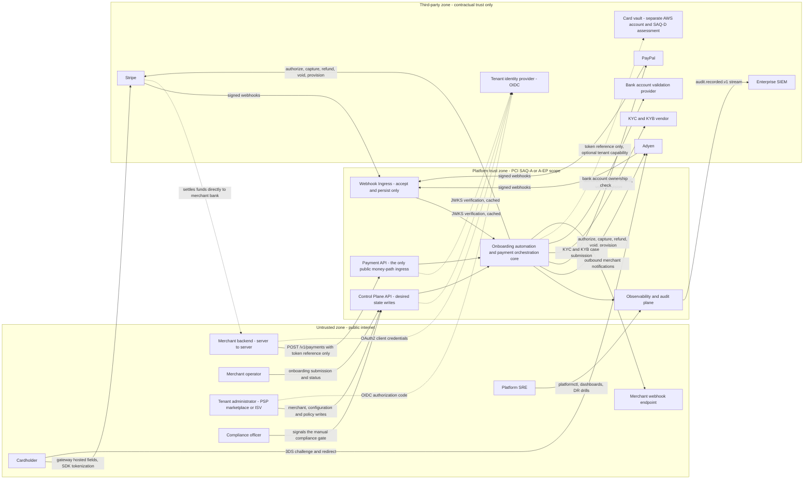

# 01 — System Context (C4 Level 1)

## What this shows and why it matters

This is the outermost boundary of the platform: who talks to it, what it talks to, and where
trust changes hands. It matters because almost every hard constraint in the design is a
consequence of a boundary crossing drawn here — PAN never crosses into the platform trust zone
(§17.1), tenant identity is only ever derived from the tenant identity provider's token and
never from a request body (§16.2), gateway payloads are untrusted until signature-verified
(§19.2), and funds never enter the platform at all because settlement moves gateway → merchant
(A1). Everything in diagrams 02–20 lives inside the single "Platform trust zone" box below.

## Diagram

## Legend and notes

- **Solid arrows** are business or money-path traffic. **Dotted arrows** are identity, trust or
  out-of-band flows that do not carry payment instructions.
- **The cardholder never touches the platform.** Card data goes from the browser or app straight
  to the gateway's hosted fields or SDK. The platform only ever receives a gateway token, a
  network token, or a payment-method reference (A2, §17.1). This one edge is what keeps eight of
  the nine deployables out of the cardholder data environment.
- **`Stripe → merchant backend` (dotted, bottom).** Funds settle gateway to merchant. The
  platform is a technical orchestrator and system of record for instructions and outcomes, not a
  payment institution taking custody (A1). Our ledger is a shadow ledger for reconciliation.
- **Three separate ingresses, not one.** `payment-api`, `control-plane-api` and `webhook-ingress`
  are distinct deployables with distinct availability targets (99.99 / 99.9 / 99.99 %) precisely
  so that admin traffic and spiky webhook traffic cannot consume the money path's connection
  pool (§5).
- **Webhook edges point inbound from the gateways** and are authenticated by signature, not by
  bearer token — the gateway is the authenticating party (§19.2). Until L6 signature verification
  passes, a webhook body is untrusted input from the public internet.
- **The card vault is dotted and outside the platform trust zone deliberately.** If a tenant
  requires vaulting, that capability lives in a physically and administratively separate system
  with its own SAQ-D assessment, reached through a port. It is not part of this repository
  (§17.1).
- **SIEM is a one-way export.** The audit plane pushes `audit.recorded.v1`; the SIEM has no
  inbound path into the platform.

## Related

- [Design baseline §1 scope, §17 PCI scope boundary, §19 API surface](../spec/00-design-baseline.md)
- [02 — High-level design](02-high-level-design.md)
- [17 — Security architecture](17-security-architecture.md)
- [docs/architecture.md](../architecture.md)
- [docs/security.md](../security.md)
