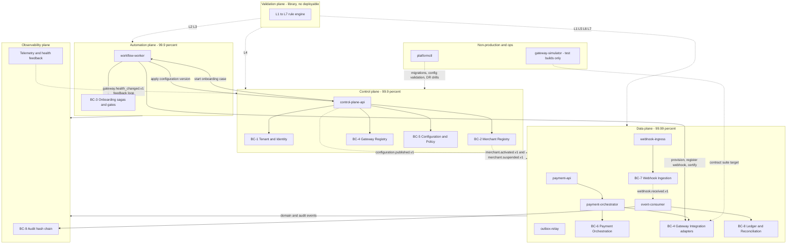
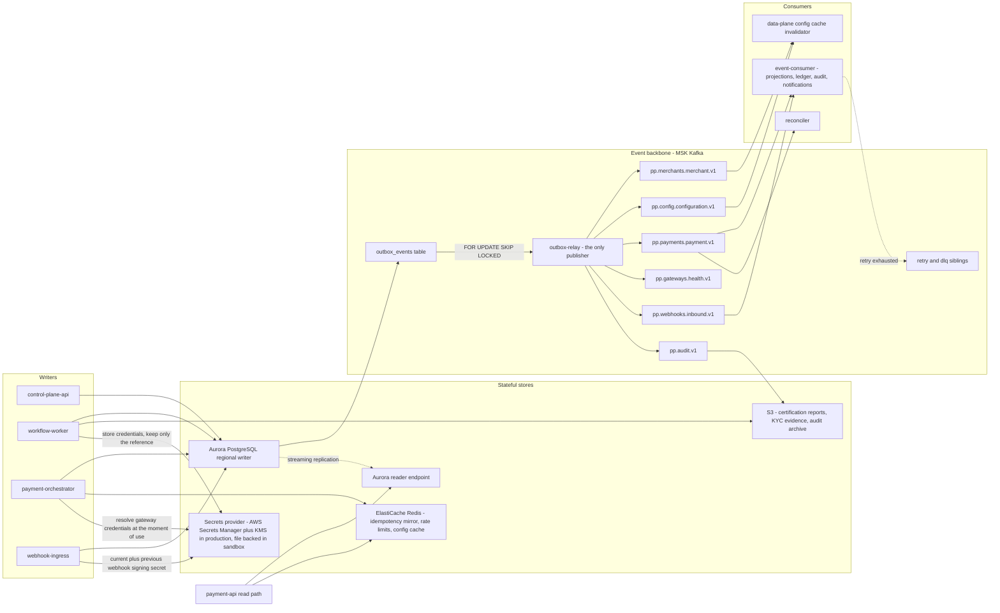

# 02 — High-Level Design / Container View (C4 Level 2)

## What this shows and why it matters

The five planes (Control, Automation, Validation, Data, Observability) and the nine deployables
that realize them, plus every datastore and the event backbone that connects them. This is the
diagram to reach for when asking "which binary owns this?" or "what happens to the money path if
X is down?". The split into nine binaries is deliberately along blast-radius and scaling-behaviour
lines rather than one-service-per-table (§5): `payment-api` scales on connection count while
`payment-orchestrator` scales on in-flight gateway calls, so a slow gateway cannot starve
ingress. Two diagrams are used because a single one exceeds the readability budget.

## Diagram A — Planes and deployables

## Diagram B — Datastores and the event backbone

## Legend and notes

- **Dotted edges are asynchronous** (events, cache invalidation, feedback). Solid edges are
  synchronous calls or direct writes. The data plane has **no synchronous dependency on the
  control plane** — configuration reaches it only over `pp.config.configuration.v1` with bounded
  staleness ≤ 30 s (A5, §15).
- **The validation plane is a library, not a deployable.** It has no box in the deployables row
  because L1–L7 rules are linked into whichever binary runs them; the dotted edges show where
  each level executes (§21, and diagram 05).
- **`outbox-relay` is the only Kafka publisher.** Every state change writes its state row and its
  `outbox_events` row in one transaction; the relay polls with `FOR UPDATE SKIP LOCKED` and
  publishes. This is what eliminates the dual-write failure mode of "state committed, event lost"
  (§13.4). No service produces to Kafka directly.
- **`payment-api` reads from the reader endpoint, writes go through `payment-orchestrator` to the
  regional writer.** Payment writes are CP: if the regional primary is unreachable the write
  fails closed with `503` rather than degrading (A4, §15).
- **Redis is never authoritative.** It mirrors completed idempotency records as a latency
  accelerator and holds token buckets; a full Redis outage degrades latency and coarsens rate
  limits but cannot affect correctness, because Postgres holds the unique index (§14.3).
- **`gateway-simulator` is `//go:build` guarded out of production images** and exists only as the
  target of the adapter contract suite (§5). It is also a registered adapter — `registry.BuiltIn`
  returns `stripe`, `adyen`, `paypal` and `simulator`, and the simulator's factory is the one
  handed a nil engine in a binary that has no use for it.
- **All three secret-consuming binaries go through one `ports.SecretsProvider`.**
  `payment-orchestrator` resolves gateway credentials at the moment of use, `workflow-worker`
  writes them during onboarding and keeps only the reference, and `webhook-ingress` reads the
  current *and* previous signing secret so a gateway's own rotation window does not become an
  endpoint outage. `secrets.New` picks the backend once, by environment, for all nine binaries.
- **The `TEL → control plane` feedback edge in Diagram A** is `gateway.health_changed.v1`: the
  observability plane's health windows drive routing and are recorded by the control plane. This
  is the only edge that runs "upstream" against the plane ordering, and it is intentional (§10).

## Related

- [Design baseline §3 bounded contexts, §5 deployables, §13 events, §15 consistency](../spec/00-design-baseline.md)
- [03 — Control plane](03-control-plane.md), [04 — Automation plane](04-automation-plane.md), [05 — Validation plane](05-validation-plane.md), [06 — Data plane](06-data-plane.md)
- [12 — Event architecture](12-event-architecture.md)
- [docs/architecture.md](../architecture.md), [docs/lld.md](../lld.md)
