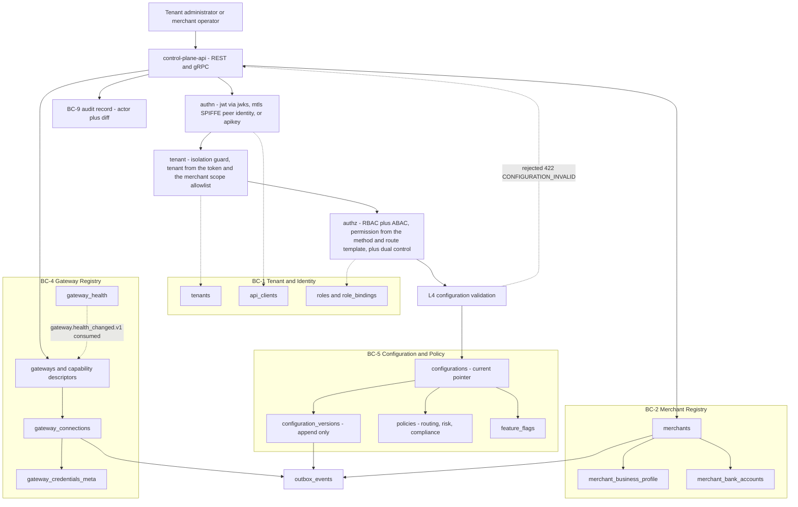

# 03 — Control Plane

## What this shows and why it matters

The control plane is where **desired state** is declared, validated, versioned and published; it
is deliberately never on the payment hot path. This diagram shows its components (BC-1 Tenant &
Identity, BC-2 Merchant Registry, BC-4 Gateway Registry, BC-5 Configuration & Policy) and the
desired-state flow that carries a configuration from an authenticated write, through L4
validation and versioning, to a data plane that consumes it asynchronously. The critical property
to read off this diagram is the **absence** of a synchronous edge from the data plane back into
the control plane: if the control plane is entirely down, the data plane keeps processing against
its last-known-good snapshot (fail-static, §15).

## Diagram A — Control plane components

## Diagram B — Desired-state flow to actual state

```mermaid
flowchart LR
  W["PUT /v1/merchants/id/configuration with If-Match"]
  V["L4 validation - schema, policy, referential, checksum"]
  N["Assign next version n plus 1"]
  P["Persist new version, retain full prior document"]
  A["Audit with actor and structured diff"]
  T["Write outbox row in the same transaction"]
  R["outbox-relay publishes configuration.published.v1"]
  K["pp.config.configuration.v1 - compacted, keyed by merchant_id"]
  C["Data plane config cache - bounded staleness 30 s"]
  E["Effective on the payment path"]
  RB["POST configuration/rollback publishes prior document as a NEW version"]
  D["Desired state"]
  ACT["Actual state - gateway accounts, webhooks, credentials"]
  REC["Reconciliation loop closes the gap"]

  W --> V
  V -->|"reject"| X["422 CONFIGURATION_INVALID, nothing persisted"]
  V -->|"accept"| N --> P --> A --> T --> R --> K --> C --> E
  RB --> V
  P --> D
  D --> REC
  ACT --> REC
  REC -->|"drift detected"| T
  REC -->|"provisioning gap"| ACT
```

## Legend and notes

- **`If-Match` is required on configuration and merchant writes** (§19.1). A mismatch is `412`,
  not a last-writer-wins overwrite. Combined with append-only versions this makes concurrent
  admin edits detectable rather than silently lossy.
- **Rollback is a forward operation.** `POST /configuration/rollback` republishes the previous
  document *as a new version* and emits `configuration.rolled_back.v1`; it never deletes or
  rewinds a row. History is strictly append-only, which is what makes the audit trail defensible
  (§23).
- **The audit write and the outbox write are in the same transaction as the version row.** There
  is no path where a configuration change is visible but unaudited, or published but uncommitted
  (§13.4).
- **`pp.config.configuration.v1` is log-compacted and keyed by `merchant_id`.** A cold-starting
  data-plane pod can rebuild its full configuration cache by replaying the compacted topic, which
  is why the data plane never needs to call the control plane synchronously (§13.3).
- **`gateway_health` flows into the gateway registry, not out of it.** Health is computed in the
  data and observability planes and consumed here for recording and operator visibility; the
  control plane is not the source of truth for health (§10).
- **`config.Service` is the whole of the desired-state surface**, and it is deliberately small:
  `GetActive`, `GetVersion`, `ListVersions`, `Publish` and `Rollback`. There is no update-in-place
  method, because there is no update-in-place operation — `Rollback` republishes a prior document
  through the same `Publish` path, so it is validated, versioned, audited and announced exactly
  like any other change.
- **Merchant lifecycle commands are `Suspend`, `Reinstate` and `Terminate`**, each routed through
  one `transition` helper that takes the L7 guard, writes the audit record and the outbox row in
  the same transaction. There is no code path that moves a merchant's state without all three.
- **Desired vs actual.** The control plane owns desired state only. Actual state — the gateway
  sub-account that really exists, the webhook that is really registered — is owned by the gateway
  integration side of BC-4, and the reconciliation loop is what closes the gap. Provisioning
  drift shows up here, not as a silent config lie.

## Related

- [Design baseline §3 BC-1/2/4/5, §15 consistency, §19.1 control plane API, §23 configuration document](../spec/00-design-baseline.md)
- [05 — Validation plane](05-validation-plane.md) for L4
- [12 — Event architecture](12-event-architecture.md)
- [docs/control-plane.md](../control-plane.md), [docs/multi-tenancy.md](../multi-tenancy.md)
