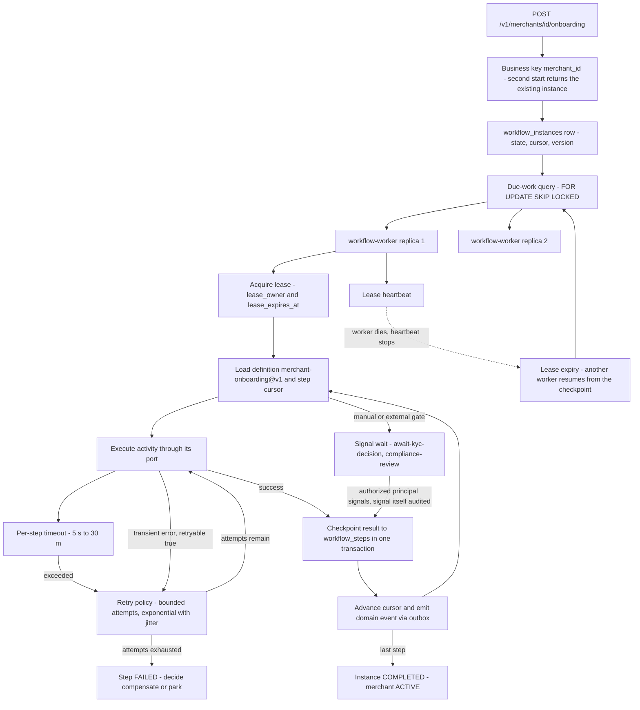

# 04 — Automation Plane

## What this shows and why it matters

The automation plane is one deployable, `workflow-worker`, running a purpose-built durable saga
engine behind a port (with a Temporal adapter available). This diagram shows how a workflow
instance is leased, how a step is executed and checkpointed, how compensation unwinds a partially
completed saga in strict reverse order, and where a permanently failing step lands. It matters
because onboarding is a long-running, resumable, auditable process that spans days (step 3 waits
up to 7 days for a KYC decision, step 11 up to 5 days for a human) — a process that must survive
pod crashes, deploys and node loss without replaying a completed side effect.

## Diagram A — Engine, leasing and step execution

## Diagram B — Compensation and dead-letter topology

```mermaid
flowchart LR
  FAILP["Step n fails terminally or the case is aborted"]
  DEC["retryable flag on the error - see baseline section 20.1"]
  ABORT["Mark instance COMPENSATING"]
  RC["Replay completed steps in strict reverse order"]

  subgraph COMPS["Compensations - only for steps that completed"]
    C12["12 activate - suspend merchant"]
    C08["8 apply-configuration - roll back to previous version"]
    C07["7 register-webhooks - delete webhook registration"]
    C06["6 store-credentials - delete secret version"]
    C05["5 provision-gateways - de-provision sub-account"]
    C03["3 await-kyc-decision - cancel KYC case"]
    C02["2 submit-kyc - cancel KYC case"]
  end

  CFAIL["A compensation itself fails"]
  DLQ["workflow_dlq - step payload plus full error chain"]
  ALERT["Alert - pp_dlq_depth gauge"]
  OPS["Operator triage via platformctl"]
  RESUME["Repair and resume from checkpoint"]
  TERM["Merchant to TERMINATED or back to a fixable state"]

  FAILP --> DEC
  DEC -->|"retryable, budget left"| RESUME
  DEC -->|"non-retryable"| ABORT --> RC
  RC --> C12 --> C08 --> C07 --> C06 --> C05 --> C03 --> C02
  C02 --> TERM
  RC -.-> CFAIL --> DLQ
  FAILP -->|"retries exhausted"| DLQ
  DLQ --> ALERT --> OPS
  OPS --> RESUME
  OPS --> TERM
```

## Legend and notes

- **The business key is `merchant_id`.** Starting `merchant-onboarding@v1` twice for the same
  merchant is a no-op that returns the existing instance, so a client retry of
  `POST /onboarding` cannot fork a second saga (§11).
- **Leasing, not locking.** Workers claim due instances with `FOR UPDATE SKIP LOCKED` and hold a
  time-bounded lease refreshed by heartbeat. A crashed worker's lease simply expires and another
  replica resumes **from the last checkpoint** — no completed step is re-executed (§11 engine
  semantics, §24 "pod crash mid-workflow").
- **Checkpoint before advance.** Every step's result is committed to `workflow_steps` before the
  next step begins, in the same transaction as the cursor advance and the outbox row. This is why
  replay is safe: the engine's durability boundary is a database transaction, not memory.
- **Idempotency is a per-step property, not an engine guarantee.** Every activity in §11 is
  idempotent by a natural key — the vendor case reference for KYC, the external account reference
  for provisioning, the configuration version number, the certification run id. At-least-once
  execution is therefore safe even in the window between "side effect done" and "checkpoint
  committed".
- **Compensations run in strict reverse order and only for steps that actually completed.**
  Steps 1, 4, 9, 10 and 11 have no compensation because they have no external side effect to undo
  — a validation, a lookup, a sandbox run and a human decision leave nothing to roll back.
- **A failed compensation is the one genuinely dangerous state**, because the saga is now
  half-unwound. It goes to `workflow_dlq` with the full error chain and pages an operator; it is
  never retried blindly, because a de-provision that half-succeeded can leave a live gateway
  sub-account behind.
- **Manual gates block, they do not poll.** `await-kyc-decision` and `compliance-review` are
  signal waits with 7-day and 5-day timeouts; the signal must come from an authorized principal
  and the signal itself is audited (§11).

## Related

- [Design baseline §11 workflow definition, §20.1 retryable flag, §24 failure catalog](../spec/00-design-baseline.md)
- [07 — Merchant onboarding saga](07-merchant-onboarding.md)
- [13 — State machines](13-state-machines.md)
- [docs/automation-plane.md](../automation-plane.md), [docs/failure-handling.md](../failure-handling.md)
