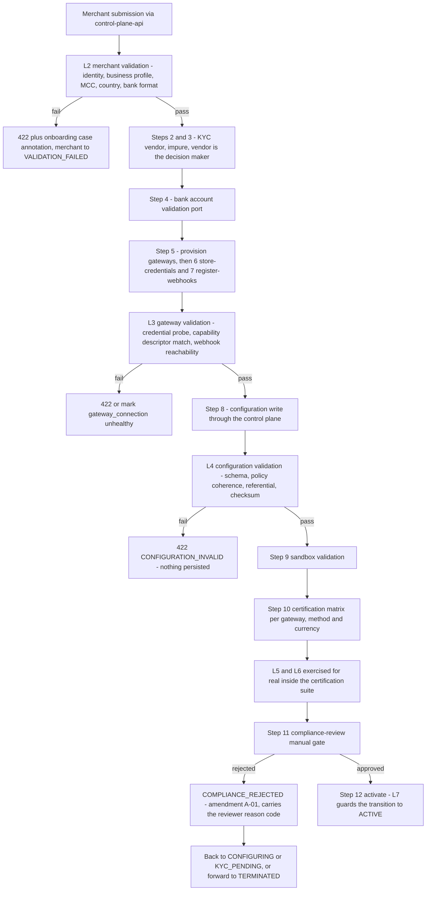

# 05 — Validation Plane

## What this shows and why it matters

Seven validation levels, each with a stable rule identifier so a failure is traceable to a
documented rule and a remediation. The plane is a library, not a service: L1–L7 are linked into
whichever binary runs them. This diagram positions each level on the two lifecycles that matter —
the synchronous payment request path and the long-running onboarding path — because *where* a
level runs determines whether it may touch the network. L1, L4, L5, L6 and L7 are pure and total
(same input, same outcome, no panics, no I/O); L3 is explicitly impure and is therefore **never**
invoked on the payment hot path.

## Diagram A — Validation levels across the payment request lifecycle

```mermaid
flowchart LR
  REQ["Inbound POST /v1/payments"]
  PAN["L1 PAN detector - runs inside bodylimit, over the raw octets, above authentication"]
  AUTH["authn, tenant, authz, ratelimit, concurrency"]
  IDEM["Idempotency claim - stage 8, innermost middleware"]
  L1["L1 API and schema - in the handler, pure"]
  CTX["Merchant context load from cached config"]
  L5["L5 payment validation - limits, currency, method, risk policy"]
  RISK["Risk engine"]
  ROUTE["Routing engine"]
  DISP["Dispatch to gateway adapter"]
  L6["L6 response validation - signature, schema, amount and currency echo"]
  L7["L7 domain and state transition"]
  OK["Commit state plus outbox, respond"]

  E1["400 VALIDATION_FAILED"]
  E2["400 SENSITIVE_DATA_IN_REQUEST plus security event, value never logged"]
  E5["422 - AMOUNT_EXCEEDS_LIMIT, CURRENCY_NOT_SUPPORTED, PAYMENT_METHOD_NOT_SUPPORTED"]
  E6["502 GATEWAY_CONTRACT_VIOLATION"]
  E7["409 INVALID_STATE_TRANSITION"]

  REQ --> PAN
  PAN -->|"hit"| E2
  PAN -->|"clean"| AUTH --> IDEM --> L1
  L1 -->|"schema violation"| E1
  L1 --> CTX --> L5
  L5 -->|"violation"| E5
  L5 --> RISK --> ROUTE --> DISP --> L6
  L6 -->|"violation"| E6
  L6 --> L7
  L7 -->|"illegal transition"| E7
  L7 --> OK
```

## Diagram B — Validation levels across the onboarding lifecycle

## Legend and notes

- **Level identifiers are stable and documented.** A rule is named like
  `L5.AMOUNT_WITHIN_MERCHANT_LIMIT`; `TestEveryRuleIsDocumented` fails the build if a rule ID has
  no entry in `docs/validation-plane.md` (§21). That is what makes an error response actionable
  rather than merely accurate.
- **L1 carries the PAN detector, and its placement is load-bearing — and stronger than §12 asks
  for.** `ScanForPAN` runs inside `httpapi.ReadBody`, which the `bodylimit` middleware calls: the
  sixth of fifteen chain stages, *above* authentication, authorization, rate limiting and the
  idempotency claim. A request containing PAN-like data is therefore rejected
  `400 SENSITIVE_DATA_IN_REQUEST` before any of them, with the offending value never written to a
  log and never reaching the idempotency fingerprint. This is one of the enforcement controls that
  keeps the platform at SAQ-A/A-EP rather than SAQ-D (§17.2).
- **The *schema* half of L1 runs in the handler, below the idempotency claim.** §12 puts the whole
  of L1 at stage 7 and idempotency at stage 8; the implementation splits them, so a syntactically
  invalid body does consume its key (settled as `FailTerminal`, so the 400 is what a duplicate
  replays). The diagram shows the implemented order, not the specified one.
- **L3 is the only impure level.** It makes network calls (credential probes, webhook
  reachability, capability checks), so it runs in onboarding, during credential rotation, and on
  a scheduled probe — never inside a payment request. A failing L3 marks the
  `gateway_connection` unhealthy rather than failing an unrelated payment.
- **L5 takes configuration as an input, which is what keeps it pure.** The cached configuration
  snapshot is passed in; the rule does not fetch it. Same snapshot plus same payment gives the
  same outcome, which makes L5 fully unit-testable and replayable against historical config
  versions.
- **L6 is the gateway contract check, and it is not optional.** It verifies the response
  signature, the response schema, and that the amount and currency the gateway echoed match what
  we sent. A mismatch is `502 GATEWAY_CONTRACT_VIOLATION` — we refuse to record a state change
  from a response we cannot trust.
- **L7 is enforced inside aggregate methods**, not in a service layer, and is mirrored by
  database constraints (I1–I3). A transition the FSM rejects returns
  `409 INVALID_STATE_TRANSITION`; the partial unique index on successful attempts is the
  last-resort backstop that makes double-charging structurally impossible (§9).
- **Certification exercises L5 and L6 for real.** The §11.4 matrix asserts that a declined test
  card yields a mapped `DECLINED` with a normalized reason code and that amount and currency
  echo — i.e. it proves the anti-corruption layer and L6 work against the live sandbox before
  real money is at risk.

## Related

- [Design baseline §21 validation plane contract, §12 pipeline, §17.2 PCI enforcement, §11.4 certification](../spec/00-design-baseline.md)
- [06 — Data plane and the 17-stage pipeline](06-data-plane.md)
- [07 — Merchant onboarding saga](07-merchant-onboarding.md)
- [docs/validation-plane.md](../validation-plane.md)
