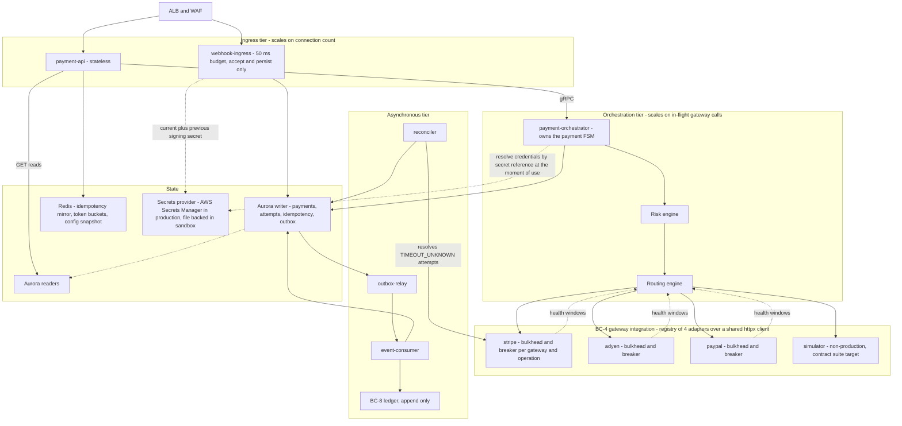
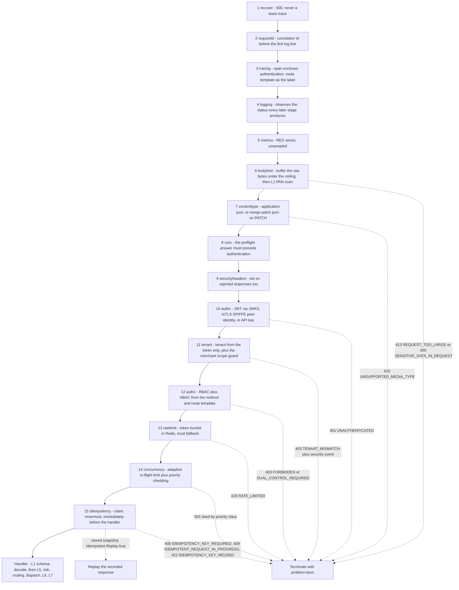
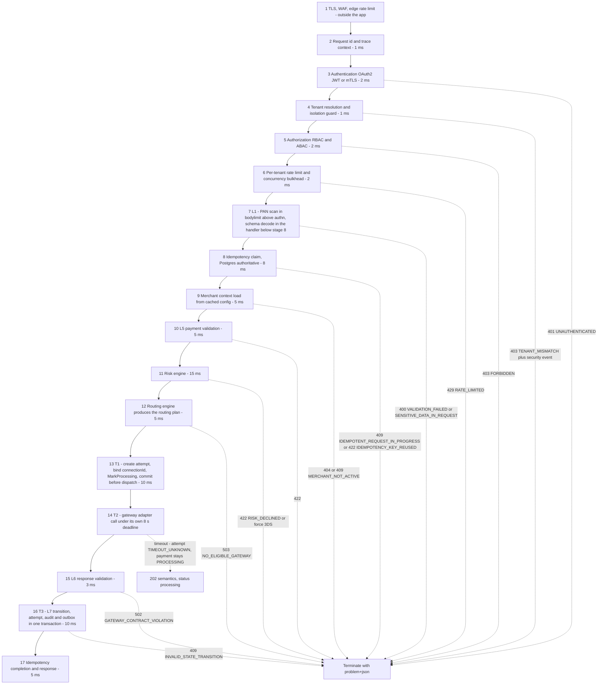

# 06 — Data Plane

## What this shows and why it matters

The data plane is the money path: `payment-api`, `payment-orchestrator`, `webhook-ingress`,
`outbox-relay` and `event-consumer`, carrying BC-6 Payment Orchestration, the integration half of
BC-4, BC-7 Webhook Ingestion and BC-8 Ledger & Reconciliation at a 99.99 % availability target.
Diagram A shows the components and the bulkheads that stop one slow dependency from taking the
plane down. Diagram B is the **HTTP middleware chain exactly as `internal/transport/httpapi/middleware.New`
builds it** — fifteen stages, outermost first, pinned by `TestChainOrderMatchesBaselineSection12`.
Diagram C is the 17-stage §12 pipeline, which spans the whole payment operation and continues
past the chain into the handler and the orchestrator. Both orders are load-bearing —
authentication before tenant resolution, tenant resolution before rate limiting, the PAN scan
before authentication, the idempotency claim after every rejection stage, and the attempt row
written before the gateway call.

## Diagram A — Components and bulkheads

## Diagram B — The HTTP middleware chain as built

Fifteen stages, outermost first. This is `middleware.Names()` verbatim; the test that pins it
fails the build on a reordering.

## Diagram C — The 17-stage §12 pipeline

Stages 1–8 are the chain above; stages 9–17 run in the handler and the orchestrator. Numbers are
§12's, so the two diagrams can be read against each other.

## Legend and notes

- **Bulkheads exist at three levels.** Deployment level (`payment-api` and `payment-orchestrator`
  are separate binaries so a slow gateway cannot consume the ingress connection pool, §5), tenant
  level (per-tenant concurrency limit at stage 6), and gateway level (a separate connection pool,
  semaphore and circuit breaker per gateway in the ACL). One unhealthy gateway degrades only its
  own share of traffic.
- **Stage 4 before stage 6 is deliberate.** Rate limits are per tenant and per merchant, so the
  tenant must be resolved from the *token* first. A `tenant_id` in the body is ignored, or, if it
  disagrees with the token, treated as a security event (§16.2).
- **L1 is split across two places in the implementation, and only half of it is above stage 8.**
  The PAN scan runs inside `bodylimit` (chain stage 6, above authentication), so a PAN-bearing
  request is rejected `400 SENSITIVE_DATA_IN_REQUEST` before it can reach a log, an authenticator
  or the idempotency fingerprint — stronger than §12's placement. The *schema decode*, however,
  runs in the handler, below the idempotency claim, so a syntactically invalid body does consume
  its key (the claim is settled with `FailTerminal`, and the 400 replays). §12 states the reverse;
  the divergence is recorded in this diagram rather than papered over.
- **Stage 13 before stage 14 is the single most important ordering in the platform.** `Orchestrator.attemptOnce`
  creates the attempt, binds `connectionId` to the merchant-to-gateway connection it is about to
  dispatch over, marks the payment `PROCESSING` and commits (**T1**) — all before `client.Authorize`
  (**T2**) is called. The attempt carries the deterministic
  `gateway_idempotency_key = base32(HMAC-SHA256(attempt_id ‖ operation, salt))[:32]`, so if the
  process dies mid-call the reconciler can find the attempt and look the transaction up at the
  gateway with the same key (§14.4).
- **`connectionId` is bound before the commit, not after.** Binding it afterwards would leave the
  exact crash window T1 exists to close: a charge at the gateway whose credential the record
  cannot name. The bind is best-effort and never fails a payment — a missing connection entry
  leaves the field blank rather than declining (migration `0016`,
  `payment_attempts.gateway_connection_id`).
- **Stage 16 is T3.** The attempt row, the payment's new state, the audit record and every outbox
  event the aggregate raised commit in one `UoW.Within`. There is no path in `orchestrator.go`
  that writes one without the others.
- **Stage 14 timeout does not fail the payment.** The attempt becomes `TIMEOUT_UNKNOWN`, the
  payment stays `PROCESSING`, and the client gets `202`-style semantics. Only a webhook, a
  reconciler lookup, or a settlement report may move it out. **No timer may fail a payment**
  (A7, §12.3) — auto-failing a timed-out authorization and retrying elsewhere is the most common
  cause of double charges in real platforms.
- **The dotted edges are exits, not the happy path.** Each is annotated with the exact error code
  from §20.2 so the diagram doubles as a reference for which stage produces which code.
- **`webhook-ingress` runs the chain in Diagram B but not the pipeline in Diagram C.** Its route
  is on the anonymous allowlist — the caller is a gateway holding a signature and no platform
  credential — so `authn`, `tenant` and `authz` pass it through and the handler verifies the
  gateway's own signature over the raw bytes `bodylimit` buffered. Its budget is ≤ 50 ms and all
  interpretation is asynchronous. See diagram 11.
- **The adapter set is four, not three.** `stripe`, `adyen`, `paypal` and `simulator` are the
  factories `registry.BuiltIn` returns; they share one `httpx` client with per-gateway pools and
  caps, speak the `spi` port, and are held to it by the `contract` suite. `simulator` is compiled
  in but only ever configured outside production.

## Related

- [Design baseline §12 pipeline, §12.3 timeout rule, §14.4 gateway idempotency, §5 deployables](../spec/00-design-baseline.md)
- [05 — Validation plane](05-validation-plane.md), [08 — Payment flow](08-payment-flow.md), [11 — Webhook flow](11-webhook-flow.md)
- [docs/data-plane.md](../data-plane.md), [docs/payment-flow.md](../payment-flow.md)
