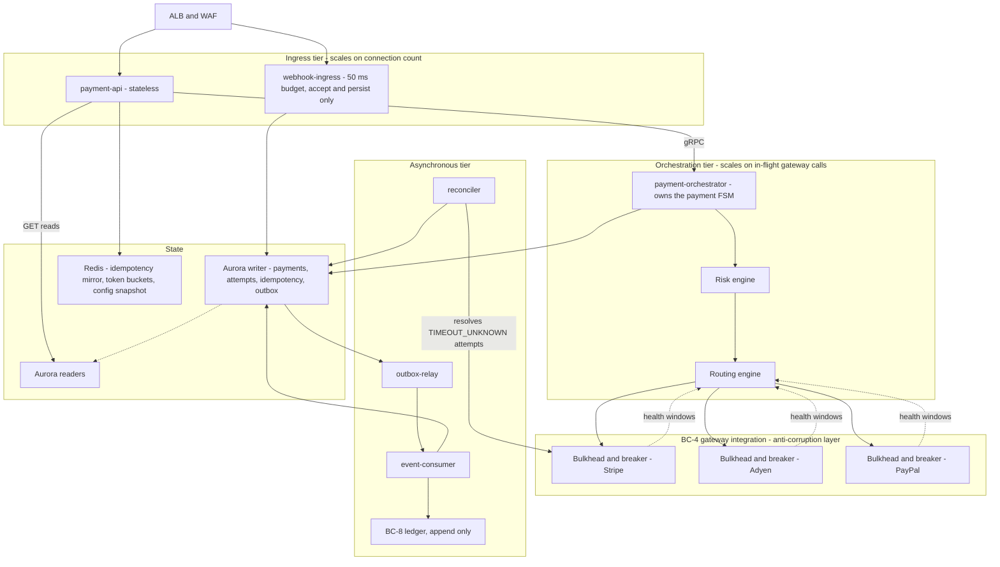
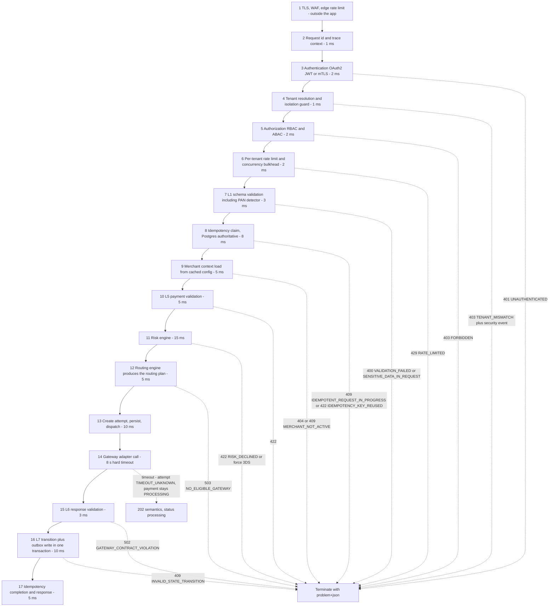

# 06 — Data Plane

## What this shows and why it matters

The data plane is the money path: `payment-api`, `payment-orchestrator`, `webhook-ingress`,
`outbox-relay` and `event-consumer`, carrying BC-6 Payment Orchestration, the integration half of
BC-4, BC-7 Webhook Ingestion and BC-8 Ledger & Reconciliation at a 99.99 % availability target.
Diagram A shows the components and the bulkheads that stop one slow dependency from taking the
plane down. Diagram B shows the 17-stage request pipeline, whose **order is load-bearing** —
authentication before tenant resolution, tenant resolution before rate limiting, schema
validation before idempotency, idempotency before any side effect, and the attempt row written
before the gateway call.

## Diagram A — Components and bulkheads

## Diagram B — The 17-stage request pipeline

## Legend and notes

- **Bulkheads exist at three levels.** Deployment level (`payment-api` and `payment-orchestrator`
  are separate binaries so a slow gateway cannot consume the ingress connection pool, §5), tenant
  level (per-tenant concurrency limit at stage 6), and gateway level (a separate connection pool,
  semaphore and circuit breaker per gateway in the ACL). One unhealthy gateway degrades only its
  own share of traffic.
- **Stage 4 before stage 6 is deliberate.** Rate limits are per tenant and per merchant, so the
  tenant must be resolved from the *token* first. A `tenant_id` in the body is ignored, or, if it
  disagrees with the token, treated as a security event (§16.2).
- **Stage 7 before stage 8 is deliberate.** A malformed or PAN-bearing request must be rejected
  before it consumes an idempotency key, otherwise a client burns keys on requests that never had
  a chance of succeeding — and, worse, a PAN would reach the idempotency fingerprint.
- **Stage 13 before stage 14 is the single most important ordering in the platform.** The attempt
  row, with its deterministic `gateway_idempotency_key = base32(HMAC-SHA256(attempt_id, salt))`,
  is committed *before* the gateway is called. If the process dies mid-call, the reconciler can
  still find the attempt and look the transaction up at the gateway using that same key (§14.4).
- **Stage 14 timeout does not fail the payment.** The attempt becomes `TIMEOUT_UNKNOWN`, the
  payment stays `PROCESSING`, and the client gets `202`-style semantics. Only a webhook, a
  reconciler lookup, or a settlement report may move it out. **No timer may fail a payment**
  (A7, §12.3) — auto-failing a timed-out authorization and retrying elsewhere is the most common
  cause of double charges in real platforms.
- **Stage 16 is one transaction.** State change, event log append and outbox row commit together
  or not at all (§13.4).
- **The dotted edges are exits, not the happy path.** Each is annotated with the exact error code
  from §20.2 so the diagram doubles as a reference for which stage produces which code.
- **`webhook-ingress` does not appear in Diagram B** because it does not run this pipeline: it has
  a ≤ 50 ms accept-and-persist budget and all processing is asynchronous. See diagram 11.

## Related

- [Design baseline §12 pipeline, §12.3 timeout rule, §14.4 gateway idempotency, §5 deployables](../spec/00-design-baseline.md)
- [05 — Validation plane](05-validation-plane.md), [08 — Payment flow](08-payment-flow.md), [11 — Webhook flow](11-webhook-flow.md)
- [docs/data-plane.md](../data-plane.md), [docs/payment-flow.md](../payment-flow.md)
