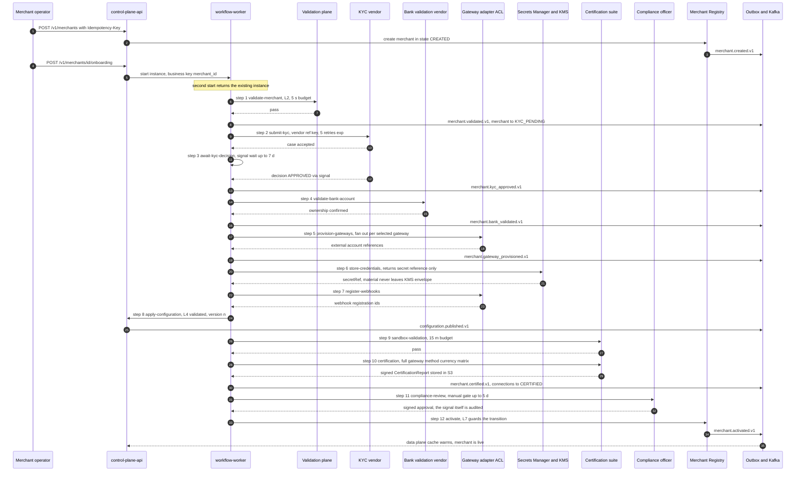
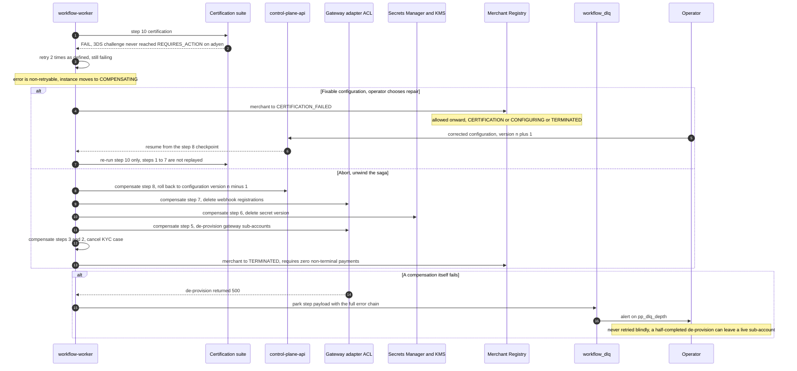

# 07 — Merchant Onboarding Saga

## What this shows and why it matters

`merchant-onboarding@v1` as it actually executes: twelve steps, each checkpointed, two of them
blocking on an external signal, and every step with an external side effect paired with a
compensation. This is the diagram that answers "what happens if provisioning succeeds but
certification fails on the third gateway three days later?" — the answer is the compensation
branch in Diagram B, which unwinds completed steps in strict reverse order so no orphaned gateway
sub-account, secret version or webhook registration is left behind. The p95 target for the
automated portion is ≤ 30 min excluding external KYC SLA (§18).

## Diagram A — Happy path

## Diagram B — Failure and compensation branch

## Legend and notes

- **Steps 1, 4, 9, 10 and 11 have no compensation** and so do not appear in the unwind sequence.
  A validation, a lookup, a sandbox run and a human decision leave no external side effect to
  undo (§11).
- **Compensation order is strictly reverse and only covers completed steps.** Step 8 rolls back
  before step 7 deletes webhooks, because a configuration that still points at a webhook we are
  about to delete is a worse intermediate state than the reverse.
- **`store-credentials` returns a reference, never material.** The credential is written into
  Secrets Manager under `/{env}/{tenant}/{merchant}/{gateway}` and only the `secretRef` travels
  through the workflow payload — the payload is persisted in `workflow_steps` and must never
  contain a secret (§16.1, §17.2).
- **Resume is from the checkpoint, not from the beginning.** In the "fixable" branch, correcting
  the configuration re-runs step 10 only. Steps 1–7 are not replayed, which is why a KYC case is
  never resubmitted and a gateway sub-account is never provisioned twice.
- **The compliance gate can reject, and that is a first-class state.** `COMPLIANCE_REJECTED`
  (Amendment A-01) carries the reviewer's reason code and routes back to `CONFIGURING` (fixable
  configuration such as a prohibited MCC/country combination), back to `KYC_PENDING` (fixable
  evidence), or forward to `TERMINATED`. Without it a rejection would have to lie by recording
  `CERTIFICATION_FAILED`, blaming the integration for a policy decision.
- **Certification produces an artifact, not an opinion.** The signed, immutable
  `CertificationReport` in object storage is referenced from the merchant record, and
  `PRODUCTION_READY` is unreachable without a passing report (A11, §11.4).
- **`→ TERMINATED` requires zero payments in a non-terminal state** (§8). The unwind branch
  therefore cannot complete for a merchant with an in-flight payment; it parks instead.

## Related

- [Design baseline §8 merchant lifecycle, §11 workflow definition, §11.4 certification suite](../spec/00-design-baseline.md)
- [04 — Automation plane](04-automation-plane.md), [13 — State machines](13-state-machines.md)
- [docs/onboarding.md](../onboarding.md), [docs/automation-plane.md](../automation-plane.md)
