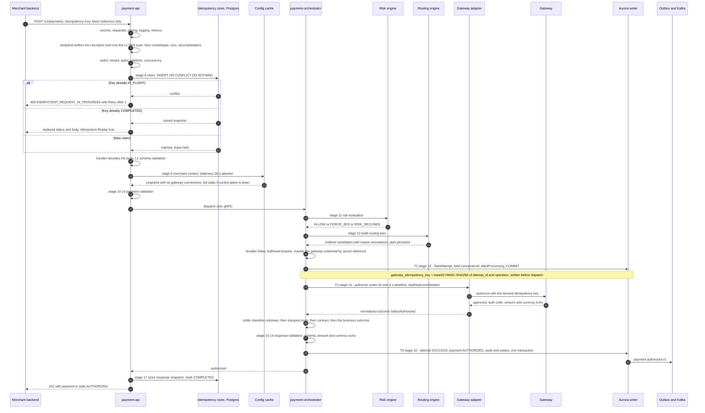
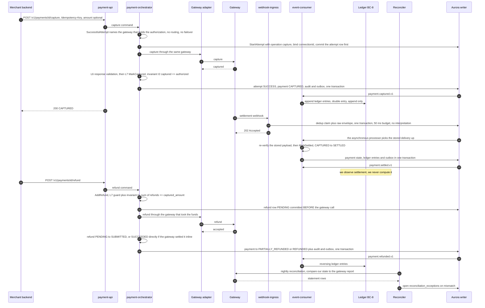

# 08 — Payment Flow: Authorization, Capture, Settlement

## What this shows and why it matters

The full money path for a two-step card payment: authorize now, capture later, settle when the
gateway says so. Two diagrams because authorization and capture/settlement have different actors
and different timescales — authorization is a sub-second synchronous request, capture may be days
later, and settlement is observed asynchronously from a gateway report, never computed by us
(A12). Read this alongside diagram 06: every stage number referenced here maps to the 17-stage
pipeline.

## Diagram A — Authorization

## Diagram B — Capture, settlement and refund

## Legend and notes

- **The three-way `alt` at stage 8 is the whole idempotency contract in one place.** A concurrent
  duplicate gets `409` with `Retry-After` rather than blocking a request thread on someone else's
  lease — blocking is how thread pools die under retry storms (A6, §14.3). A completed duplicate
  replays the stored snapshot with `Idempotent-Replay: true`. A same-key-different-fingerprint
  request gets `422 IDEMPOTENCY_KEY_REUSED` (§14.2), which is the check that catches the client
  bug of reusing one key for two different payments.
- **The attempt row and its derived gateway idempotency key are written before the gateway call.**
  `gateway_idempotency_key = base32(HMAC-SHA256(attempt_id ‖ 0x00 ‖ operation, salt))[:32]` is
  reproducible after a crash, so a transport retry to the same gateway dedupes at the gateway and
  the reconciler can look the transaction up later (A10, §14.4). The attempt also carries
  `connectionId`, stamped in the same pre-dispatch window, so "which credential signed this
  request" is answerable from the attempt row rather than by re-deriving it from the merchant's
  connections as they stand today (migration `0016`).
- **Capture and void go to the *same gateway* but a *new attempt row*.** `CaptureExisting` and
  `VoidExisting` both call `followUp`, which finds the successful authorization's gateway, opens a
  fresh attempt with operation `capture` or `void`, binds its `connectionId` and commits it before
  the call — the same T1-before-T2 ordering as authorization, for the same reason. There is no
  routing and no failover on either: routing happens once, at authorization.
- **The refund row is committed before the gateway is called, for the same reason the attempt is.**
  A crash mid-refund must leave a record, or a merchant has told a customer their money is coming
  back and nothing in the system knows. A refund whose outcome is *unknown* stays `PENDING` and
  enters reconciliation; it is emphatically not retried, because a duplicate refund is a duplicate
  payout.
- **The refund's own FSM is `PENDING → SUBMITTED → SUCCEEDED | FAILED`, with `PENDING → CANCELED`.**
  `SUBMITTED` is "the gateway accepted it"; `SUCCEEDED` is "the gateway confirmed it moved", which
  usually arrives later as a webhook and calls `ConfirmRefund`. Only the payment reaches
  `PARTIALLY_REFUNDED` / `REFUNDED`; the refund entity has its own states (diagram 13, Diagram D).
- **Settlement is observed, not computed.** It arrives as a gateway settlement report or webhook
  and is reconciled. We take no custody of funds; the ledger is a shadow ledger for reconciliation
  (A1, A12).
- **`CAPTURED → SETTLED → REFUNDED` is the normal refund path**, not an exception. §9 explicitly
  allows `SETTLED → PARTIALLY_REFUNDED` and `SETTLED → REFUNDED` because refunding after
  settlement is what actually happens in production.
- **Invariants I1 and I2 are enforced twice** — in the aggregate method (L7) and by database
  `CHECK` constraints with serialized updates — because a bug in the application layer must still
  not be able to refund more than was captured (§9).
- **`webhook-ingress` persists and returns `202 Accepted`** (`200 OK` for a delivery it already
  holds). It never processes inline; its budget is 50 ms and every interpretation step runs in the
  separate asynchronous processor. See diagram 11.

## Related

- [Design baseline §9 payment state machine, §12 pipeline, §14 idempotency contract](../spec/00-design-baseline.md)
- [06 — Data plane](06-data-plane.md), [09 — Gateway routing](09-gateway-routing.md), [11 — Webhook flow](11-webhook-flow.md)
- [docs/payment-flow.md](../payment-flow.md)
