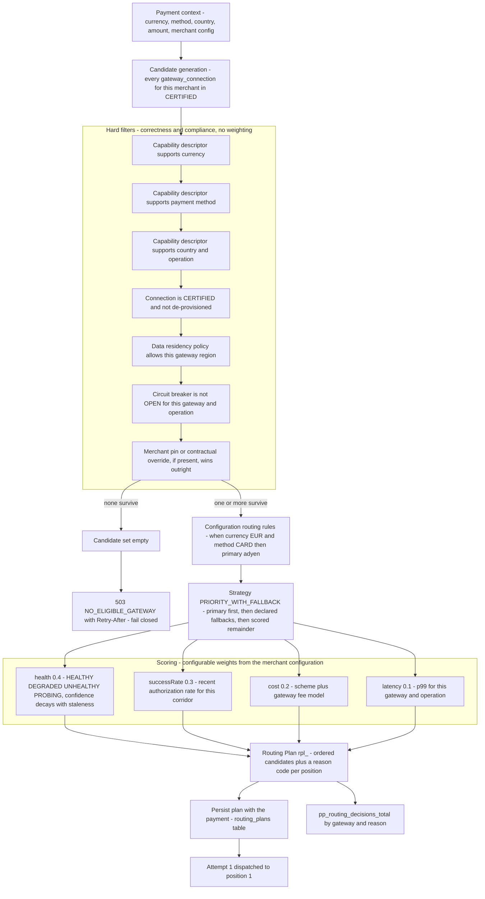
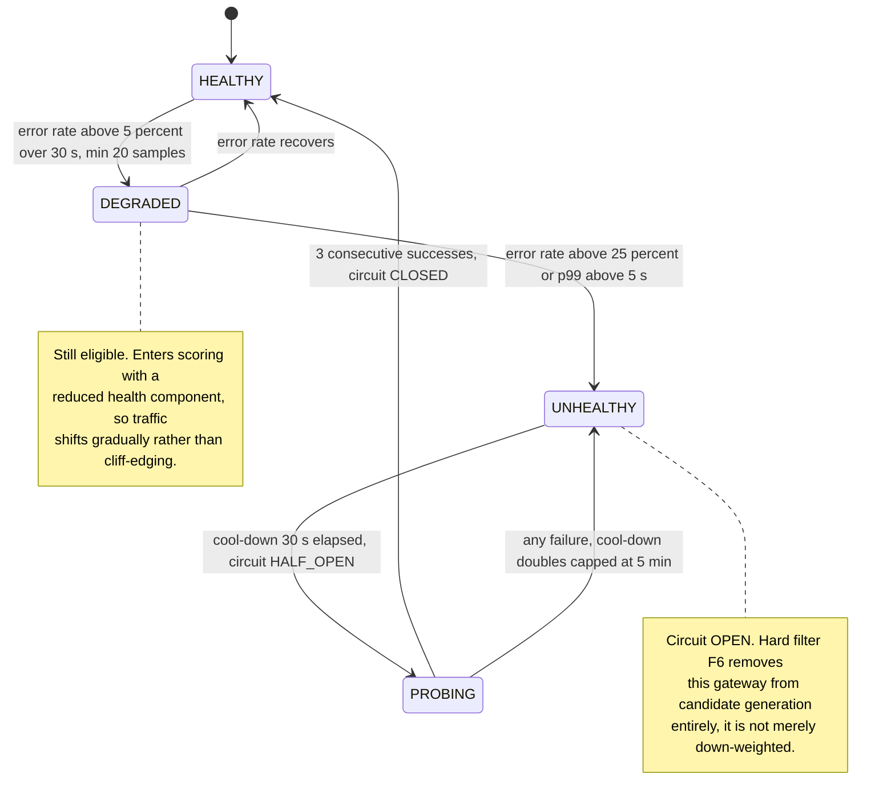

# 09 — Gateway Routing Decision

## What this shows and why it matters

Routing runs at stage 12 with a 5 ms budget and produces a **Routing Plan**: an ordered,
reason-annotated list of candidate gateways for one payment at one instant, persisted with the
payment for auditability. The structure is deliberately two-phase — **hard filters** that express
correctness and compliance (a gateway that cannot do EUR simply cannot be chosen), then **scoring**
that expresses preference (health, success rate, cost, latency). Mixing the two is the classic
routing bug: a cost weight must never be able to outvote a data-residency constraint.

## Diagram A — Candidate generation, filtering, scoring, plan

## Diagram B — Health input to the routing decision

## Legend and notes

- **Health is per `(gateway_id, operation)`, never per merchant.** Per-merchant samples are too
  sparse to be statistically meaningful — a merchant doing 20 payments a day cannot produce a
  reliable error rate over a 30-second window. Per-merchant behaviour is expressed as a
  contractual *pin* (filter F7), not as a health signal (§10).
- **`DEGRADED` down-weights, `UNHEALTHY` excludes.** This is the difference between the scoring
  phase and the filter phase. Degradation shifts traffic smoothly; an open circuit removes the
  gateway from the candidate set so no attempt is even created against it (`GATEWAY_CIRCUIT_OPEN`).
- **Filter F5 is a compliance filter, not a preference.** The routing engine will not select a
  gateway whose region violates the tenant's declared data-residency policy, and no combination of
  cost or latency weights can override it (§17.3).
- **Empty candidate set fails closed.** `503 NO_ELIGIBLE_GATEWAY` with `Retry-After`. Rejecting a
  payment costs one lost sale; routing to an ineligible gateway costs a compliance breach or a
  guaranteed decline (§24).
- **The plan is persisted, and that is the audit story.** `routing_plans` records the ordered
  candidates *and the reason code for each position* at the instant of decision. Six months later
  the question "why did this payment go to Adyen?" has a recorded answer, including what the
  health state was at the time.
- **Health confidence decays with staleness.** Gateway health is an AP read served from local
  windows plus Kafka gossip; under partition we serve stale health with decayed confidence rather
  than assuming healthy (§15).
- **The plan is built once per payment, not per attempt.** Failover walks down the existing plan;
  it does not re-run routing. See diagram 10.

## Related

- [Design baseline §10 gateway health, §12 stage 12, §23 routing configuration, §17.3 residency](../spec/00-design-baseline.md)
- [10 — Gateway failover](10-gateway-failover.md), [08 — Payment flow](08-payment-flow.md)
- [docs/data-plane.md](../data-plane.md), [docs/failure-handling.md](../failure-handling.md)
