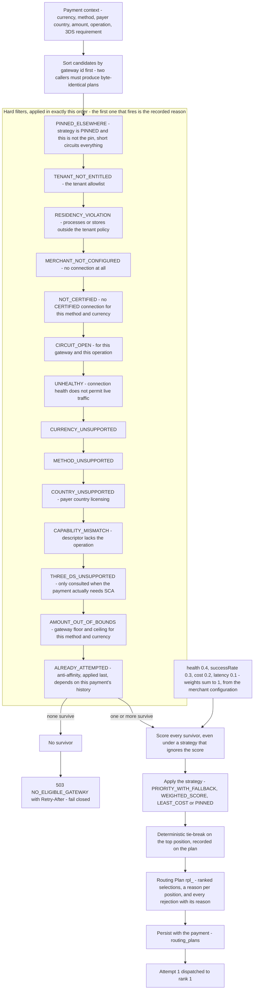
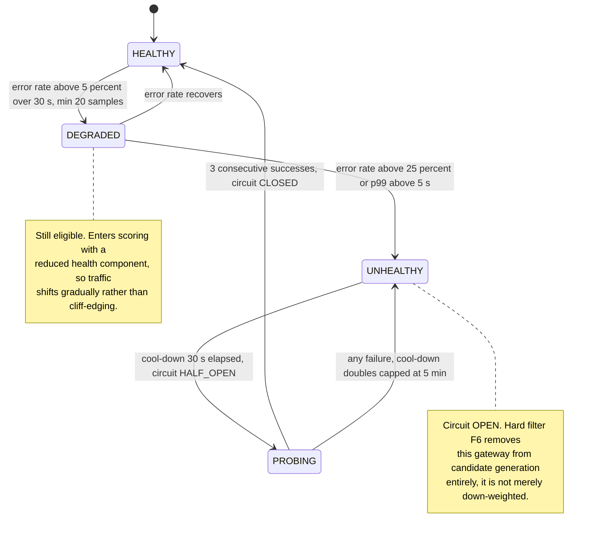

# 09 — Gateway Routing Decision

## What this shows and why it matters

Routing runs at stage 12 with a 5 ms budget and produces a **Routing Plan**: an ordered,
reason-annotated list of candidate gateways for one payment at one instant — *plus every rejected
candidate and why* — persisted with the payment for auditability. The structure is deliberately
two-phase: **fourteen hard filters** that express correctness and compliance (a gateway that
cannot do EUR simply cannot be chosen), then **scoring** and one of four strategies that express
preference. Mixing the two is the classic routing bug: a cost weight must never be able to outvote
a data-residency constraint.

## Diagram A — Candidate generation, filtering, scoring, plan

The filter order determines *which* reason is recorded when a candidate fails several, and that
choice is deliberate: the most fundamental reason wins. "This gateway is not certified for you" is
more useful than "its circuit is open", because the first is actionable and permanent and the
second is noise about a gateway that was never eligible.

## Diagram B — Health input to the routing decision

## Legend and notes

- **Health is per `(gateway_id, operation)`, never per merchant.** Per-merchant samples are too
  sparse to be statistically meaningful — a merchant doing 20 payments a day cannot produce a
  reliable error rate over a 30-second window. Per-merchant behaviour is expressed as a
  contractual *pin* (filter F7), not as a health signal (§10).
- **`DEGRADED` down-weights, `UNHEALTHY` excludes.** This is the difference between the scoring
  phase and the filter phase. Degradation shifts traffic smoothly; an open circuit removes the
  gateway from the candidate set so no attempt is even created against it (`GATEWAY_CIRCUIT_OPEN`).
- **Residency, tenant entitlement and certification are filters, not penalties.** They are legal
  and contractual constraints, and a constraint you can outbid is not a constraint. No combination
  of cost or latency weights can reach the eligibility question, because the filters run first and
  a rejected candidate is never scored (§17.3).
- **Every survivor is scored even when the strategy ignores the score.** Recording what the score
  *would* have said under `PINNED` or `LEAST_COST` is what makes "your pinned gateway has been the
  worst of your three all quarter" a provable statement, and it costs four multiplications.
- **`ALREADY_ATTEMPTED` is the anti-affinity filter and it runs last**, because it is the only one
  that depends on this payment's history rather than on the gateway. It is what makes
  `Plan.Next(tried)` correct: failover never re-offers a gateway this payment has already touched.
- **Candidates are sorted by gateway id before anything else.** Two callers assembling the same
  candidate set from different map-iteration orders must produce byte-identical plans, rejection
  list included, or the checksum over a persisted plan is unstable and the replay check fails for
  a reason that has nothing to do with routing.
- **Empty candidate set fails closed.** `503 NO_ELIGIBLE_GATEWAY` with `Retry-After`. Rejecting a
  payment costs one lost sale; routing to an ineligible gateway costs a compliance breach or a
  guaranteed decline (§24).
- **The plan is *meant* to be persisted, and today only its identifier is.** `routing_plans` exists
  in migration `0007` with the full shape — ordered candidates, the reason code for each position,
  the weights and the factor inputs — and `payments.routing_plan_id` is written on every payment.
  But no repository writes a `routing_plans` row: `routing.Decide` builds the plan in memory,
  hands it to `Dispatch`, and only the ID survives. So "why did this payment go to Adyen?" is
  currently answerable to the level of "under plan `rpl_…`", not to the level of what that plan
  contained. The `PERSIST` node above is drawn because the sequence is incomplete without it, and
  this note is here because the reviewer would otherwise assume it works.
- **Health confidence decays with staleness.** Gateway health is an AP read served from local
  windows plus Kafka gossip; under partition we serve stale health with decayed confidence rather
  than assuming healthy (§15).
- **The plan is built once per payment, not per attempt.** Failover walks down the existing plan;
  it does not re-run routing. See diagram 10.

## Related

- [Design baseline §10 gateway health, §12 stage 12, §23 routing configuration, §17.3 residency](../spec/00-design-baseline.md)
- [10 — Gateway failover](10-gateway-failover.md), [08 — Payment flow](08-payment-flow.md)
- [docs/data-plane.md](../data-plane.md), [docs/failure-handling.md](../failure-handling.md)
