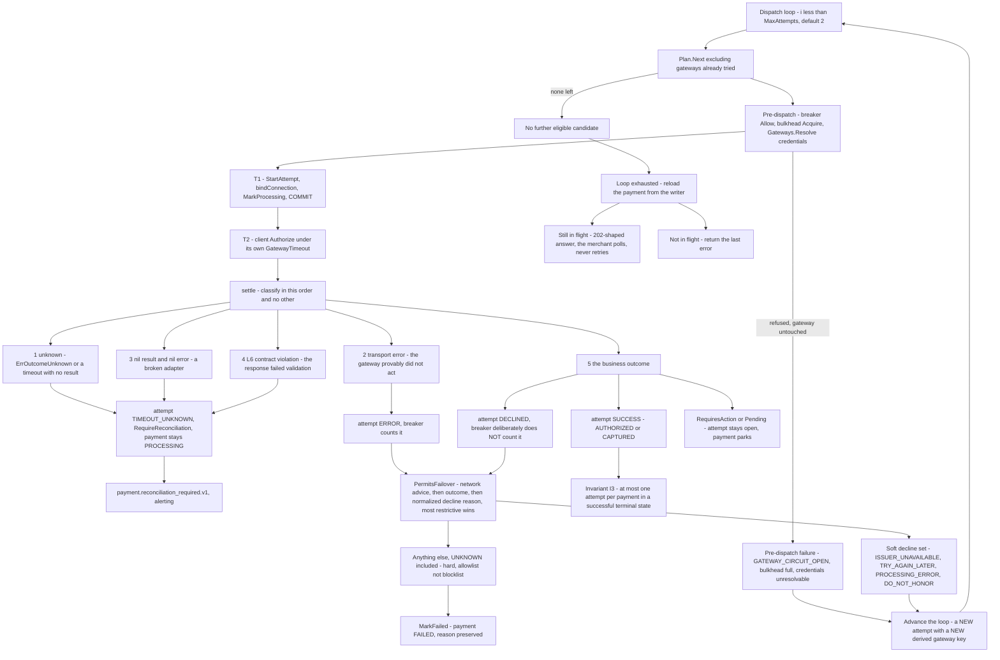
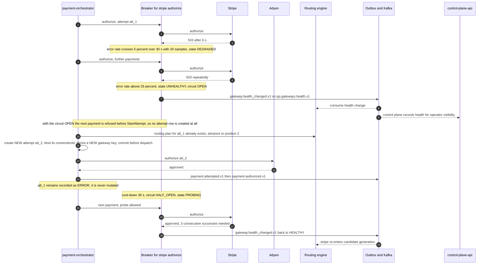

# 10 — Gateway Failover

## What this shows and why it matters

Failover is the most dangerous mechanism in a payment orchestrator, because a careless
implementation turns a transient error into a double charge or turns the platform into a card
testing service. This diagram shows the branches that matter and, critically, the ones where
failover **must not** happen: a hard decline (retrying a stolen card on another gateway is card
testing behaviour and gets the platform de-registered from the schemes), a `TIMEOUT_UNKNOWN`
(we do not know whether money moved, so retrying anywhere is a coin flip on a double charge), and
an L6 contract violation (a response we cannot trust leaves the outcome *unknown*, not failed).
Diagram A is `Orchestrator.Dispatch` and `Orchestrator.settle` as written, in their real order.

## Diagram A — The dispatch loop

`Orchestrator.Dispatch` walks the persisted routing plan at most `MaxAttempts` times (default 2).
Each pass either returns a terminal result or advances; `Plan.Next(tried)` never returns a
gateway this payment has already touched.

Terminal branches — `TIMEOUT_UNKNOWN`, `RequiresAction`, `Pending`, success and a non-failoverable
decline — leave the loop immediately. Only a pre-dispatch refusal, an `ERROR`, or a soft decline
re-enter it.

## Diagram B — Circuit opens and traffic shifts

## Legend and notes

- **Failover consults the *attempt*, not the loop counter.** `att.PermitsFailover()` folds three
  rules together and takes the most restrictive answer: a scheme-level "do not retry" advice
  vetoes everything; `ERROR` permits failover; `DECLINED` defers to the normalized decline reason;
  `SUCCESS`, `PENDING`, `DISPATCHED` and `TIMEOUT_UNKNOWN` all forbid it.
- **The soft-decline set is an allowlist of four.** `ISSUER_UNAVAILABLE`, `TRY_AGAIN_LATER`,
  `PROCESSING_ERROR`, `DO_NOT_HONOR`. Everything else is hard — including `UNKNOWN`, which is
  what an adapter maps a reason code it has not been taught about to. Defaulting an unknown reason
  to "retry" is how a platform ends up card testing on an attacker's behalf.
- **A decline does not count against the circuit breaker.** `record(false, false)` on the decline
  branch is deliberate: a merchant with a high-decline customer cohort would otherwise open the
  breaker on a perfectly healthy gateway and take that gateway out for every other merchant
  sharing it. An `ERROR`, a timeout and an L6 violation all *do* count.
- **A pre-dispatch refusal never creates an attempt row.** A circuit that is open, a full bulkhead
  or an unresolvable credential all fail before `StartAttempt`, so the gateway was provably not
  touched and moving to the next candidate is free of double-charge risk.
- **A new attempt means a new key means a genuinely new authorization.** That is the whole point
  of deriving the gateway key from `attempt_id` and the operation rather than from the client's
  key: a transport-level retry to the same gateway would reuse the key and dedupe there, and a
  cross-gateway failover is correctly treated as a distinct authorization, with the previous one
  separately voided or reconciled (A10).
- **An exhausted loop is not automatically an error.** `Dispatch` reloads the payment from the
  writer — the in-memory aggregate can be behind after a conflict retry inside a transaction —
  and if the reloaded state is still in flight it returns a 202-shaped result rather than a
  failure. The merchant must poll or wait for the webhook, and must not retry.
- **Hard decline is terminal and never failed over.** This is a business rule with regulatory
  teeth, not a performance tuning choice. The ACL maps each gateway's proprietary reason codes to
  a normalized set and the retryable-decline membership is a property of that normalized code —
  which is exactly what the §11.4 certification assertion "a declined test card yields a mapped
  `DECLINED` with a normalized reason code" proves before go-live.
- **`TIMEOUT_UNKNOWN` never fails over and never auto-fails.** The payment stays `PROCESSING` and
  `payment.reconciliation_required.v1` is emitted with alerting. Resolution, fastest first: the
  gateway webhook arrives; the reconciler polls the gateway's lookup API using our deterministic
  key; the settlement report lands (A7, §12.3).
- **Old attempts are immutable.** Failover creates a row; it never mutates the previous one. The
  attempt history is the forensic record of what was tried where.
- **Invariant I3 is the structural backstop.** A partial unique index on
  `(payment_id) WHERE outcome='SUCCESS'`, partition-aligned per Amendment A-02, makes it
  impossible for two attempts of one payment to both be successful — even if every layer of
  application logic above it is wrong.
- **The circuit is per `(gateway, operation)`.** Stripe's `authorize` opening does not remove
  Stripe's `refund` from the candidate set — you must always be able to give money back.

## Related

- [Design baseline §9.1 attempt outcomes, §10 gateway health, §14.4 gateway idempotency, §24 failure catalog](../spec/00-design-baseline.md)
- [09 — Gateway routing](09-gateway-routing.md), [13 — State machines](13-state-machines.md)
- [docs/failure-handling.md](../failure-handling.md), [docs/payment-flow.md](../payment-flow.md)
