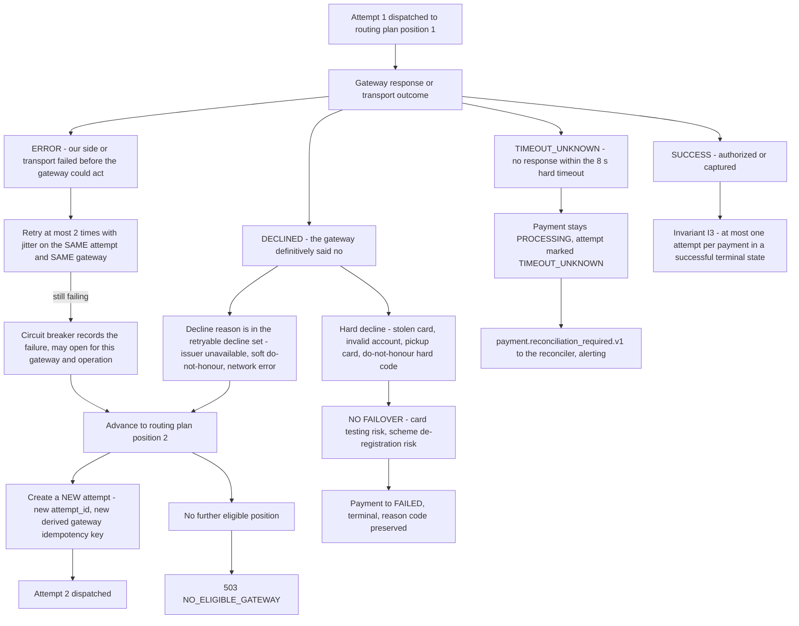
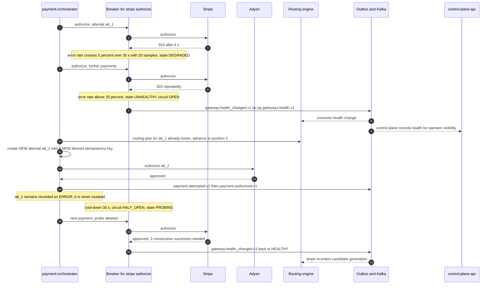

# 10 — Gateway Failover

## What this shows and why it matters

Failover is the most dangerous mechanism in a payment orchestrator, because a careless
implementation turns a transient error into a double charge or turns the platform into a card
testing service. This diagram shows the three branches that matter and, critically, the two where
failover **must not** happen: a hard decline (retrying a stolen card on another gateway is card
testing behaviour and gets the platform de-registered from the schemes) and a `TIMEOUT_UNKNOWN`
(we do not know whether money moved, so retrying anywhere is a coin flip on a double charge).

## Diagram A — Failover decision

## Diagram B — Circuit opens and traffic shifts

## Legend and notes

- **A retry is not a failover.** A transport `ERROR` is retried at most twice with jitter on the
  *same* attempt against the *same* gateway, reusing the same derived idempotency key so the
  gateway dedupes. Only when that budget is exhausted does the orchestrator advance the routing
  plan and create a **new attempt** (§24, §14.4).
- **A new attempt means a new key means a genuinely new authorization.** That is the whole point
  of deriving the gateway key from `attempt_id` rather than from the client's key: a same-gateway
  retry is safe, and a cross-gateway failover is correctly treated as a distinct authorization,
  with the previous one separately voided or reconciled (A10).
- **Hard decline is terminal and never failed over.** This is a business rule with regulatory
  teeth, not a performance tuning choice. The ACL maps each gateway's proprietary reason codes to
  a normalized set and the retryable-decline membership is a property of that normalized code —
  which is exactly what the §11.4 certification assertion "a declined test card yields a mapped
  `DECLINED` with a normalized reason code" proves before go-live.
- **`TIMEOUT_UNKNOWN` never fails over and never auto-fails.** The payment stays `PROCESSING` and
  `payment.reconciliation_required.v1` is emitted with alerting. Resolution, fastest first: the
  gateway webhook arrives; the reconciler polls the gateway's lookup API using our deterministic
  key; the settlement report lands (A7, §12.3).
- **Old attempts are immutable.** Failover creates a row; it never mutates the previous one. The
  attempt history is the forensic record of what was tried where.
- **Invariant I3 is the structural backstop.** A partial unique index on
  `(payment_id) WHERE outcome='SUCCESS'`, partition-aligned per Amendment A-02, makes it
  impossible for two attempts of one payment to both be successful — even if every layer of
  application logic above it is wrong.
- **The circuit is per `(gateway, operation)`.** Stripe's `authorize` opening does not remove
  Stripe's `refund` from the candidate set — you must always be able to give money back.

## Related

- [Design baseline §9.1 attempt outcomes, §10 gateway health, §14.4 gateway idempotency, §24 failure catalog](../spec/00-design-baseline.md)
- [09 — Gateway routing](09-gateway-routing.md), [13 — State machines](13-state-machines.md)
- [docs/failure-handling.md](../failure-handling.md), [docs/payment-flow.md](../payment-flow.md)
