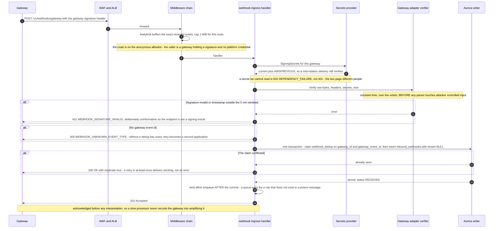
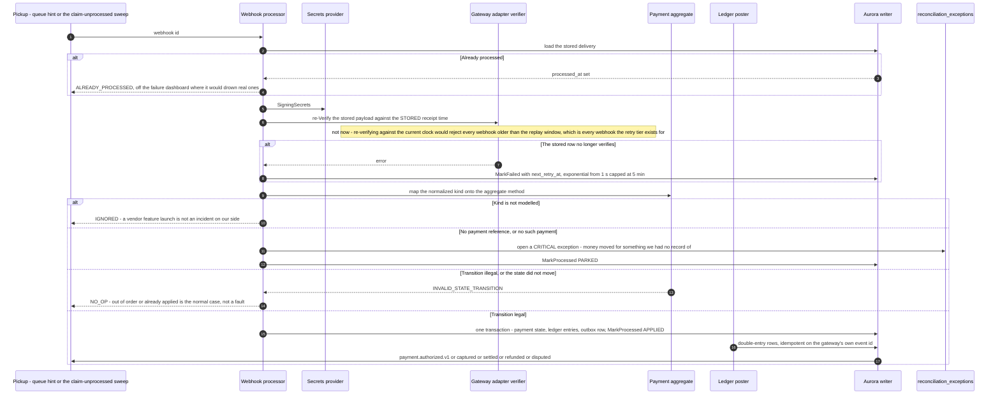
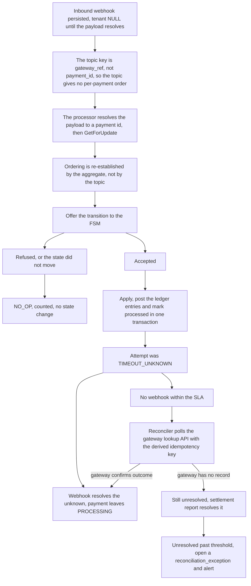

# 11 — Webhook Ingestion Flow

## What this shows and why it matters

Gateway webhooks are the platform's asynchronous truth channel: they close the loop on 3DS
completions, asynchronous payment methods, settlements, disputes and — most importantly —
`TIMEOUT_UNKNOWN` attempts that nothing else can resolve. They are also public-internet traffic
from an unauthenticated-until-verified source, arriving in unpredictable spikes and with
duplicates guaranteed by every gateway's at-least-once delivery. The design answer is a strict
split, and it is a split in the code as well as in the prose: `internal/application/webhook`
holds an `Ingester` with a ≤ 50 ms budget that does **verify, deduplicate, persist, respond** and
nothing else, and a separate `Processor` that re-verifies and applies. Diagram A is the first;
Diagram B is the second. No path in either runs the other's work inline.

## Diagram A — The accept path, `webhook.Ingester.Ingest`

Everything below runs inside the ≤ 50 ms budget, and nothing else does.

## Diagram B — The process path, `webhook.Processor.Process`

Asynchronous, allowed to be slow, and never allowed to guess.

## Diagram C — Ordering, lateness and the reconciliation tie-in

## Legend and notes

- **The order of the accept path is the security property.** Verify *before* parsing — the HMAC is
  checked over the raw octets by the adapter, in constant time, before a decoder touches
  attacker-controlled input. Deduplicate *at the storage layer* — the unique index on
  `(gateway_id, gateway_event_id)` **is** the check, because an in-memory one would not survive a
  pod restart and would not work across replicas. Enqueue *after* the commit.
- **The dedup claim and the body write are one transaction, claim first.** The order makes a
  gateway's retry cheap (one small insert rather than a megabyte of body rewritten); the
  transaction is what stops a crash between them from leaving a claim with no delivery — which
  would make the platform answer 200 forever to an event it never actually stored.
- **The row is written with a NULL tenant, through a store that refuses a tenanted one.** Every
  other write in the persistence layer refuses to run without a tenant in context, and that
  refusal is the isolation guarantee. A delivery's tenant is genuinely unknown at accept time, so
  `WebhookIngestStore` writes under the one RLS policy that admits NULL, and refuses any record
  that *does* name a tenant — that write belongs to the tenanted repository, where RLS's
  `WITH CHECK` can prove it.
- **`202` for a new delivery, `200` for one we already hold.** A gateway that receives an error
  retries; a duplicate is not an error, it is at-least-once delivery working, and answering it
  with 4xx makes the gateway retry a message we have already stored, forever. Adyen additionally
  requires the literal body `[accepted]`, which the ack writer supplies.
- **Enqueueing is best-effort and the queue is not the guarantee.** The durable record is the
  database row; the queue is a latency optimisation over the `ClaimUnprocessed` sweep. A queue
  failure must not fail the accept, because the gateway would then retry a webhook we already have
  and the retry would deduplicate against it — wasted work at both ends.
- **The processor re-verifies rather than trusting the row.** The accept path checked the
  signature but did not carry that forward as a fact anything else can rely on; the row is read
  minutes or hours later, possibly by a different process. Re-verification costs one HMAC and is
  done against the **stored receipt time**, because verifying against the current clock would
  reject every delivery older than the replay window.
- **A late or duplicate webhook is a `NO_OP`, not an error.** `SETTLED → PROCESSING` is explicitly
  invalid (§9), so a webhook that arrives after a later signal already advanced the payment is
  refused by the aggregate and recorded as a no-op. Treating it as a failure would put a healthy
  platform's most common event on the failure dashboard.
- **A webhook for a payment we have no record of opens a `CRITICAL` reconciliation exception.**
  It is the most alarming thing the processor can see — money moved for something the platform did
  not think existed — and it is deliberately recorded as `PARKED`-and-processed rather than
  retried forever, so the exception survives its own transaction and the sweep does not re-park it
  on every pass.
- **This is resolution path (a) for `TIMEOUT_UNKNOWN`.** Diagram C shows the full ladder — webhook,
  then reconciler polling with the deterministic gateway idempotency key, then settlement report,
  then a human-visible reconciliation exception (§12.3).
- **Effectively-once, not exactly-once.** The consumer inserts `(consumer_group, event_id)` into
  the dedup table inside the same transaction as its handler; a conflict means "already processed,
  ack and drop". Database invariants I1–I3 remain the last line of defence in case the dedup path
  itself has a bug (A8, §13.5).

## Related

- [Design baseline §13.5 effectively-once, §12.3 timeout rule, §19.2 webhook endpoint, §24 failure catalog](../spec/00-design-baseline.md)
- [08 — Payment flow](08-payment-flow.md), [12 — Event architecture](12-event-architecture.md)
- [docs/events.md](../events.md), [docs/failure-handling.md](../failure-handling.md)
