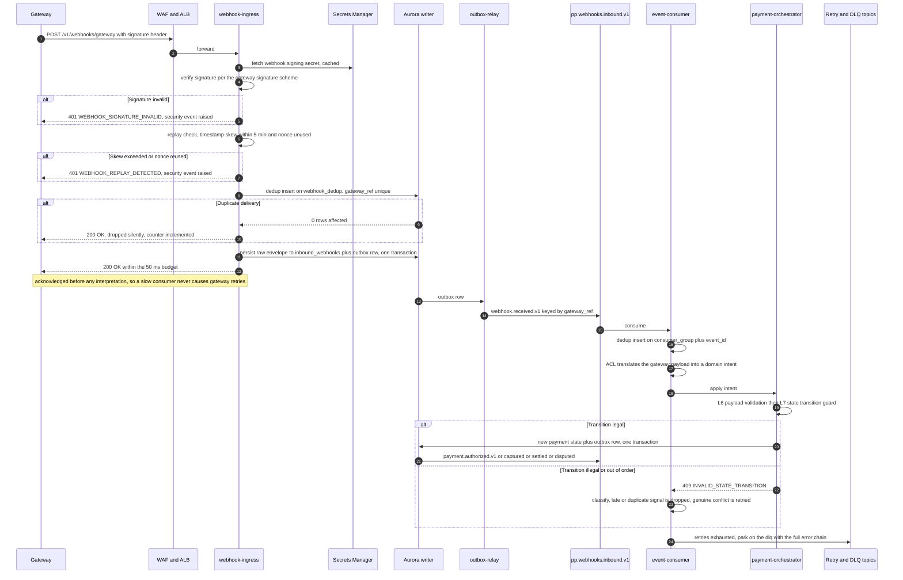
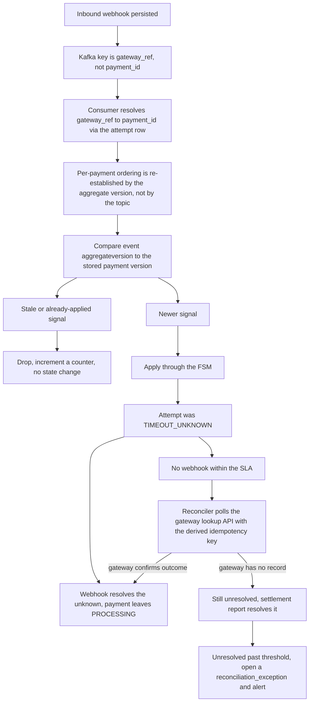

# 11 — Webhook Ingestion Flow

## What this shows and why it matters

Gateway webhooks are the platform's asynchronous truth channel: they close the loop on 3DS
completions, asynchronous payment methods, settlements, disputes and — most importantly —
`TIMEOUT_UNKNOWN` attempts that nothing else can resolve. They are also public-internet traffic
from an unauthenticated-until-verified source, arriving in unpredictable spikes and with
duplicates guaranteed by every gateway's at-least-once delivery. The design answer is a strict
split: `webhook-ingress` has a ≤ 50 ms budget and does **accept-and-persist only**; all
interpretation is asynchronous.

## Diagram A — Ingestion sequence

## Diagram B — Ordering, lateness and the reconciliation tie-in

## Legend and notes

- **Four independent defences run before persistence**, in this order and for this reason:
  signature (is this really the gateway?), replay window (is this a captured-and-replayed
  request?), dedup (have we already seen this exact delivery?), then persist. Reordering them
  would let an attacker's replayed body consume a dedup slot or reach storage.
- **The 200 is returned before interpretation.** Gateways retry aggressively on non-2xx; a
  webhook endpoint that does work inline turns a slow database into an exponentially growing
  redelivery storm. Accept-and-persist keeps the p99 inside 50 ms regardless of downstream health
  (§5).
- **Duplicates are dropped silently and counted, not errored.** Every gateway delivers
  at-least-once. A duplicate is normal operation, not an incident (§24).
- **The topic key is `gateway_ref`, so the topic does not give per-payment ordering.** Ordering is
  re-established at apply time by comparing the event's `aggregateversion` against the stored
  payment version, and by the FSM itself refusing illegal transitions. No consumer may assume a
  global order (§13.3).
- **A late webhook is not an error.** `SETTLED → PROCESSING` is explicitly invalid (§9), so a
  webhook that arrives after a later signal already advanced the payment is dropped by L7 rather
  than corrupting state. The classification step in the `else` branch distinguishes "harmlessly
  late" from "genuine conflict worth retrying".
- **This is resolution path (a) for `TIMEOUT_UNKNOWN`.** Diagram B shows the full ladder — webhook,
  then reconciler polling with the deterministic gateway idempotency key, then settlement report,
  then a human-visible reconciliation exception (§12.3).
- **Effectively-once, not exactly-once.** The consumer inserts `(consumer_group, event_id)` into
  the dedup table inside the same transaction as its handler; a conflict means "already processed,
  ack and drop". Database invariants I1–I3 remain the last line of defence in case the dedup path
  itself has a bug (A8, §13.5).

## Related

- [Design baseline §13.5 effectively-once, §12.3 timeout rule, §19.2 webhook endpoint, §24 failure catalog](../spec/00-design-baseline.md)
- [08 — Payment flow](08-payment-flow.md), [12 — Event architecture](12-event-architecture.md)
- [docs/events.md](../events.md), [docs/failure-handling.md](../failure-handling.md)
