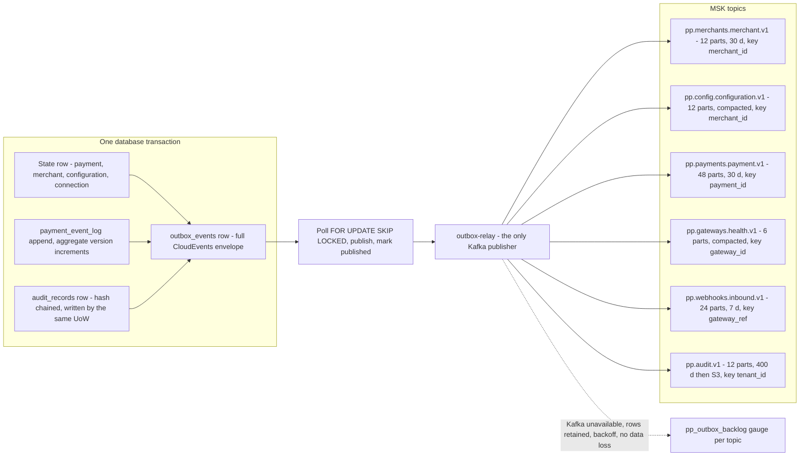
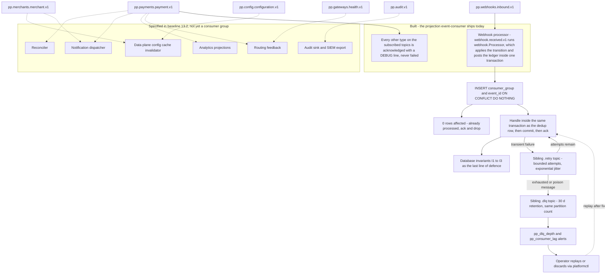

# 12 — Event Architecture

## What this shows and why it matters

Every asynchronous edge in the platform runs through one mechanism: a transactional outbox drained
by a single relay into Kafka topics named `pp.<context>.<aggregate>.v1`. Diagram A shows that
publish path and the topic set; Diagram B shows the consumption path with its retry and DLQ
topology, and distinguishes the one consumer group `event-consumer` ships today from the ones
baseline §13.2 lists as consumers. The reason this is a single, boring, uniform mechanism is that the alternative — services
publishing to Kafka directly alongside their database writes — is the dual-write failure mode, and
in a payment system a lost `payment.captured.v1` means a payment that is captured at the gateway
and invisible in the ledger.

## Diagram A — Outbox, relay and topics

## Diagram B — Consumers, retry and DLQ topology

## Legend and notes

- **The envelope is CloudEvents 1.0 plus required platform extensions**: `tenantid`,
  `merchantid`, `correlationid`, `causationid`, `traceparent`, `aggregateid`, `aggregateversion`,
  `partitionkey`. `causationid` and `correlationid` together make the full causal chain of a
  payment reconstructible from the event log alone (§13.1).
- **Versioning is in the type name and changes are additive-only within a major.** A breaking
  change is a new `.v2` type published *alongside* `.v1` until every consumer has migrated. There
  is no in-place edit of an event schema, ever (§13.1).
- **Ordering is guaranteed per partition key only, and the key is the aggregate ID.** All events
  for one payment are ordered; there is no global order and no consumer may assume one. This is
  why `pp.payments.payment.v1` has 48 partitions — throughput scales with partitions, and
  correctness does not depend on cross-partition order (§13.3).
- **`pp.config.configuration.v1` and `pp.gateways.health.v1` are compacted.** A cold-starting
  data-plane pod rebuilds its full configuration and health picture by replaying the compacted
  log, which is exactly why the data plane needs no synchronous control-plane call (§15).
- **Kafka being down is not data loss.** The relay simply stops marking rows published; the outbox
  retains them and backs off. `pp_outbox_backlog` is the alert. The eventual-consistency window
  widens; nothing is lost (§24).
- **At-least-once delivery, effectively-once business effect.** Exactly-once delivery is not
  achievable across process and broker boundaries; exactly-once *effect* is, via the dedup table
  inside the handler's transaction plus database invariants underneath (A8, §13.5).
- **`.retry` and `.dlq` are siblings with the same partition count and key**, so a parked message
  replays into the same partition and preserves its ordering relationship with its aggregate's
  other events.
- **`pp.audit.v1` has 400-day retention and then flows to S3** with Object Lock for the 7-year
  WORM requirement (§17.3).
- **An event type a group does not project is acknowledged, not failed.** Returning an error for
  an unhandled type blocks the partition for every *other* type on it, turning "somebody published
  a new event" into an outage of an unrelated projection. `event-consumer` logs it at DEBUG and
  moves on, which makes the unhandled traffic visible instead of fatal.
- **The event catalogue is registered in code, and the registry is the contract.**
  `internal/events/registry.go` binds each of the 25 types to its topic and partition-key field —
  `merchant_id`, `payment_id`, `gateway_id`, `gateway_ref`, `tenant_id` — so a type published
  without a registry entry fails at the publisher rather than landing on the wrong partition.
- **The dotted consumer edges are specified, not built.** `event-consumer` currently registers one
  handler. The ledger is posted by the webhook `Processor` inside the transaction that applies the
  webhook, not by a separate projector; the reconciler is a library type in
  `internal/application/payment` rather than a running consumer group. The dotted edges are drawn
  because §13.2 names those consumers and the topics are keyed for them, and they are dotted
  because nothing subscribes yet.

## Related

- [Design baseline §13 event catalog, envelope, topics, outbox, effectively-once](../spec/00-design-baseline.md)
- [11 — Webhook flow](11-webhook-flow.md), [18 — Observability architecture](18-observability-architecture.md)
- [docs/events.md](../events.md)
