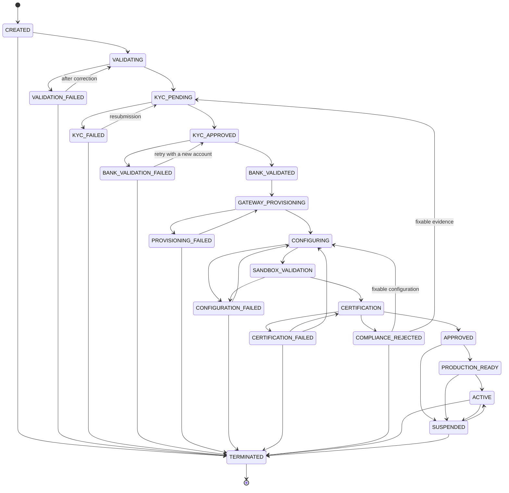
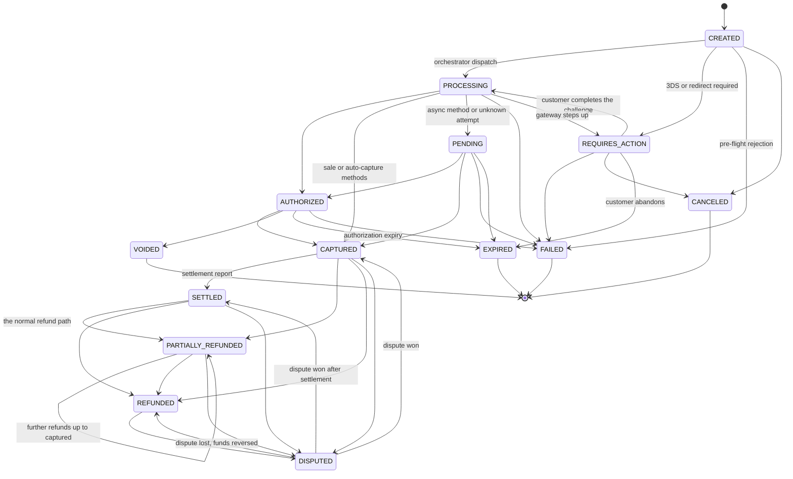
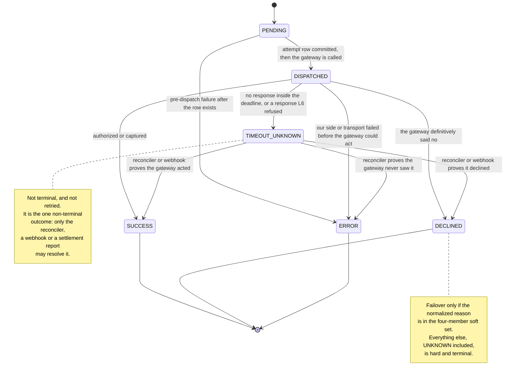
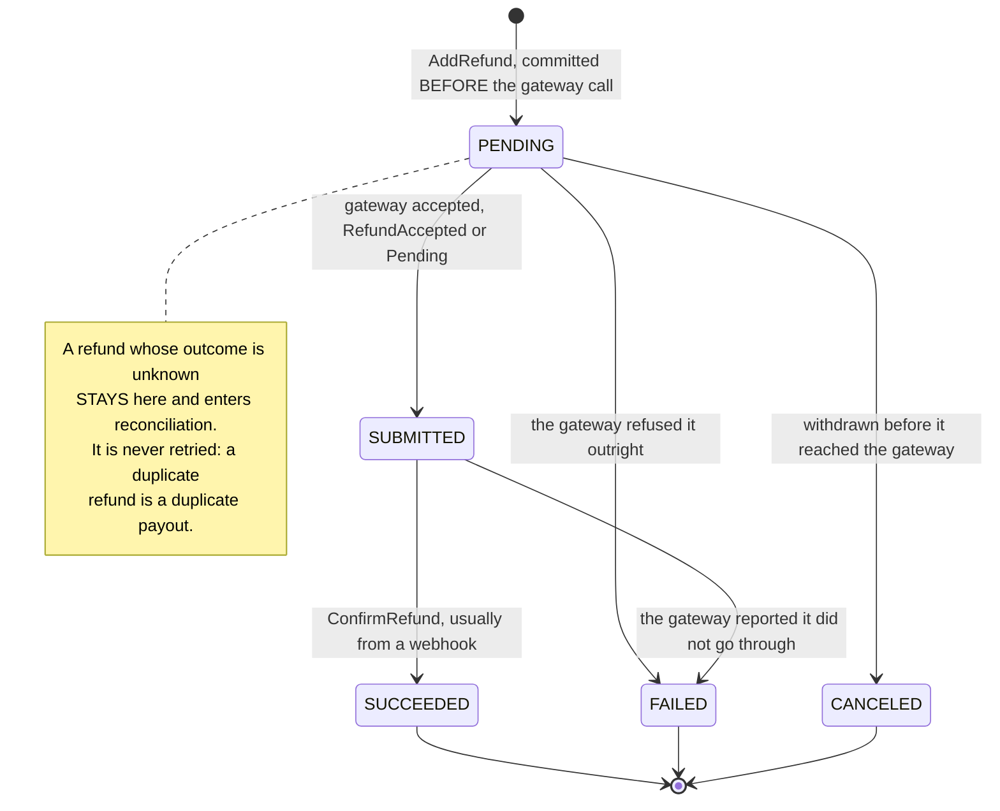

# 13 — State Machines

## What this shows and why it matters

Four of the platform's fourteen finite state machines: the two that govern everything it does with
a merchant and with money, and the two smaller ones for the unit of gateway interaction and for a
refund. They are drawn here exactly as [`docs/state-machines.md`](../state-machines.md) — which is
generated from `internal/domain` and is authoritative — defines them; anything not drawn is
rejected with `409 INVALID_STATE_TRANSITION`. These diagrams are normative, not illustrative: the
FSMs live in `internal/domain` (stdlib only, no I/O), are enforced inside aggregate methods at L7,
and the merchant and payment machines are mirrored by database `CHECK` constraints so that a bug
above the domain layer still cannot move money twice. The remaining ten are indexed at the foot of
this page.

## Diagram A — Merchant lifecycle

## Diagram B — Payment lifecycle

## Diagram C — Payment attempt outcome

## Diagram D — Refund

The refund is its own entity with its own lifecycle, distinct from the payment states it drives.
`SUBMITTED` means the gateway accepted the instruction; `SUCCEEDED` means it confirmed the money
moved, which normally arrives later as a webhook.

## The other machines

Eleven further machines are specified with full transition tables in
[`docs/state-machines.md`](../state-machines.md), which is generated from `internal/domain` and
`internal/workflows/engine` and is authoritative for all fourteen:

| Machine | States | Drawn in |
|---|---|---|
| Merchant lifecycle | 21 | Diagram A above |
| Payment | 14 | Diagram B above |
| Payment attempt | 6 | Diagram C above |
| Refund | 5 | Diagram D above |
| Gateway health | 4 | [09 — Gateway routing](09-gateway-routing.md), Diagram B |
| Gateway connection | 9 | `docs/state-machines.md` §7 |
| Workflow instance | 11 | [04 — Automation plane](04-automation-plane.md), Diagram C |
| Workflow step | 13 | [04 — Automation plane](04-automation-plane.md), Diagram D |
| Tenant | 3 | `docs/state-machines.md` §10 |
| API client | 3 | `docs/state-machines.md` §11 |
| Onboarding case | 4 | `docs/state-machines.md` §12 |
| Idempotency record | 3 | [08 — Payment flow](08-payment-flow.md), the stage 8 `alt` |
| Inbound webhook | 7 | [11 — Webhook flow](11-webhook-flow.md), Diagrams A and B |
| Reconciliation exception | 4 | `docs/state-machines.md` §15 |

## Legend and notes

- **Everything absent is forbidden.** The explicitly invalid transitions worth naming are
  `SETTLED → PROCESSING`, `REFUNDED → CAPTURED`, `CAPTURED → AUTHORIZED`, `FAILED → anything`,
  `CREATED → CAPTURED` (it must pass through `PROCESSING`), and any transition that would make
  `refunded_total > captured_total` (§9).
- **`COMPLIANCE_REJECTED` and `APPROVED → SUSPENDED` are Amendment A-01.** The original lifecycle
  had no exit from the manual compliance gate other than approval, so a compliance officer's
  rejection was unrepresentable — the workflow would have had to lie by recording
  `CERTIFICATION_FAILED` (blaming the integration for a policy decision) or hang. Likewise an
  adverse finding between approval and activation must be expressible without terminating the
  merchant (§8).
- **`PENDING` and `TIMEOUT_UNKNOWN` exist so that a timeout does not force a lie.** Without them,
  an ambiguous gateway outcome would have to be recorded as either success or failure, and both
  are potentially false. `PENDING` also carries genuinely asynchronous methods such as bank debits
  and vouchers (§9, §9.1).
- **`TIMEOUT_UNKNOWN` is not a terminal outcome.** It is the one attempt state with outgoing edges
  after the gateway call has finished, and they are only ever traversed by evidence: a webhook, a
  reconciler lookup against the gateway using the deterministic key, or a settlement report. No
  timer traverses them. An L6 contract violation also lands here rather than in `ERROR` — a
  response we cannot trust leaves the outcome unknown, not failed.
- **The refund's states are not the payment's.** `PENDING/SUBMITTED/SUCCEEDED/FAILED/CANCELED`
  belongs to the `Refund` entity; `PARTIALLY_REFUNDED` and `REFUNDED` are payment states driven by
  it. Conflating them is why the refund row must be committed before the gateway call: a refund
  that is `SUBMITTED` on a payment still showing `CAPTURED` is the correct intermediate state, and
  it has to be representable.
- **Guards on `→ ACTIVE`**: at least one `GatewayConnection` in `CERTIFIED`, a non-empty validated
  `MerchantConfiguration`, a completed compliance attestation, and no open critical reconciliation
  exception. `→ TERMINATED` requires zero payments in a non-terminal state (§8).
- **`SUSPENDED` rejects new payments but permits refunds, voids and webhook processing.** You must
  always be able to give money back, and suspension is available to an operator *and* to the
  automation plane on a risk breach, compliance expiry or gateway de-provisioning (§8).
- **`DISPUTED` is not terminal in either direction.** A dispute lost reverses funds
  (`→ REFUNDED`); a dispute won restores them (`→ CAPTURED` or `→ SETTLED`, depending on where the
  payment was when the dispute landed).
- **Invariants enforced alongside the FSM**: I1 `sum(refunds) ≤ captured_amount`, I2
  `captured ≤ authorized`, I3 at most one attempt per payment in a successful terminal state
  (partition-aligned partial unique index, Amendment A-02), I4 amount/currency/merchant/tenant
  immutable after creation, I5 one event-log row per state change with a monotonic aggregate
  version.

## Related

- [Design baseline §8 merchant lifecycle, §9 payment state machine, §9.1 attempt outcomes](../spec/00-design-baseline.md)
- [07 — Merchant onboarding](07-merchant-onboarding.md), [08 — Payment flow](08-payment-flow.md), [10 — Gateway failover](10-gateway-failover.md)
- [docs/state-machines.md](../state-machines.md)
