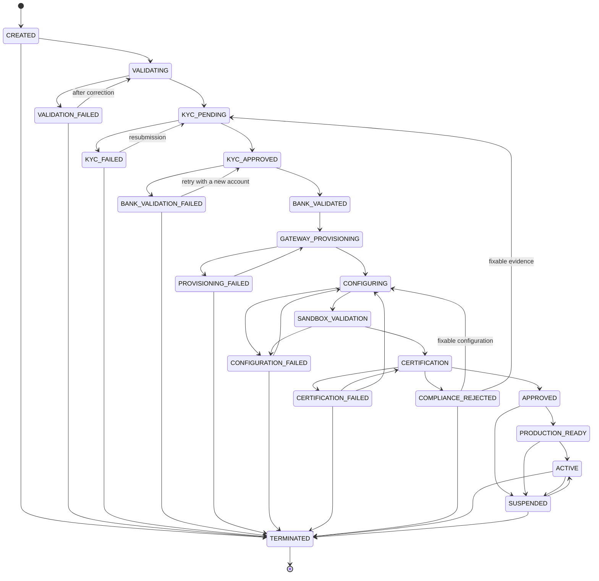
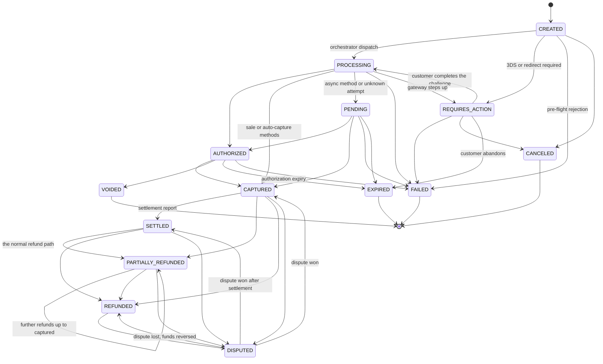
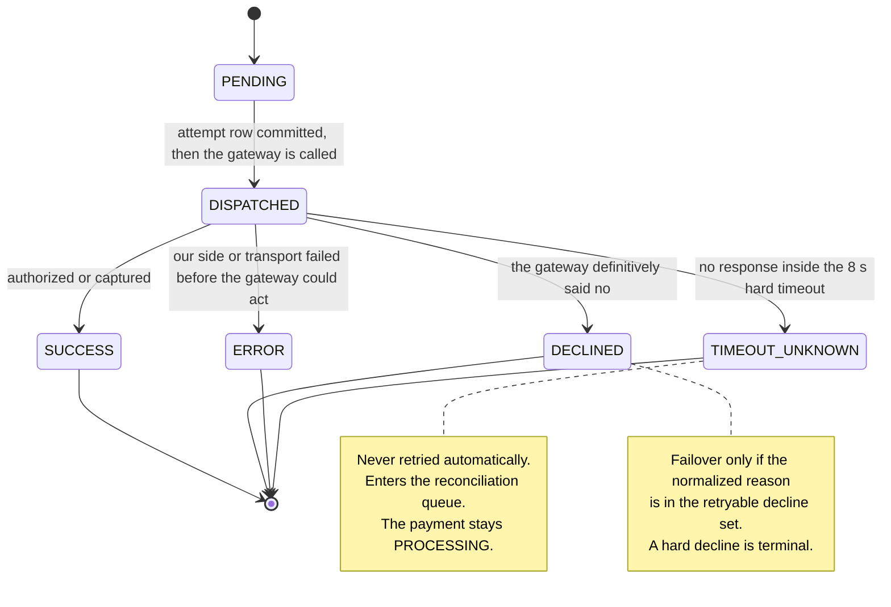

# 13 — State Machines

## What this shows and why it matters

Two finite state machines govern everything the platform does with a merchant and with money, plus
a third small one for the unit of gateway interaction. They are drawn here exactly as the
transition tables in §8, §9 and §9.1 define them: anything not drawn is rejected with
`409 INVALID_STATE_TRANSITION`. These diagrams are normative, not illustrative — the FSMs live in
`internal/domain` (stdlib only, no I/O), are enforced inside aggregate methods at L7, and are
mirrored by database constraints so that a bug above the domain layer still cannot move money
twice.

## Diagram A — Merchant lifecycle

## Diagram B — Payment lifecycle

## Diagram C — Payment attempt outcome

## Legend and notes

- **Everything absent is forbidden.** The explicitly invalid transitions worth naming are
  `SETTLED → PROCESSING`, `REFUNDED → CAPTURED`, `CAPTURED → AUTHORIZED`, `FAILED → anything`,
  `CREATED → CAPTURED` (it must pass through `PROCESSING`), and any transition that would make
  `refunded_total > captured_total` (§9).
- **`COMPLIANCE_REJECTED` and `APPROVED → SUSPENDED` are Amendment A-01.** The original lifecycle
  had no exit from the manual compliance gate other than approval, so a compliance officer's
  rejection was unrepresentable — the workflow would have had to lie by recording
  `CERTIFICATION_FAILED` (blaming the integration for a policy decision) or hang. Likewise an
  adverse finding between approval and activation must be expressible without terminating the
  merchant (§8).
- **`PENDING` and `TIMEOUT_UNKNOWN` exist so that a timeout does not force a lie.** Without them,
  an ambiguous gateway outcome would have to be recorded as either success or failure, and both
  are potentially false. `PENDING` also carries genuinely asynchronous methods such as bank debits
  and vouchers (§9, §9.1).
- **Guards on `→ ACTIVE`**: at least one `GatewayConnection` in `CERTIFIED`, a non-empty validated
  `MerchantConfiguration`, a completed compliance attestation, and no open critical reconciliation
  exception. `→ TERMINATED` requires zero payments in a non-terminal state (§8).
- **`SUSPENDED` rejects new payments but permits refunds, voids and webhook processing.** You must
  always be able to give money back, and suspension is available to an operator *and* to the
  automation plane on a risk breach, compliance expiry or gateway de-provisioning (§8).
- **`DISPUTED` is not terminal in either direction.** A dispute lost reverses funds
  (`→ REFUNDED`); a dispute won restores them (`→ CAPTURED` or `→ SETTLED`, depending on where the
  payment was when the dispute landed).
- **Invariants enforced alongside the FSM**: I1 `sum(refunds) ≤ captured_amount`, I2
  `captured ≤ authorized`, I3 at most one attempt per payment in a successful terminal state
  (partition-aligned partial unique index, Amendment A-02), I4 amount/currency/merchant/tenant
  immutable after creation, I5 one event-log row per state change with a monotonic aggregate
  version.

## Related

- [Design baseline §8 merchant lifecycle, §9 payment state machine, §9.1 attempt outcomes](../spec/00-design-baseline.md)
- [07 — Merchant onboarding](07-merchant-onboarding.md), [08 — Payment flow](08-payment-flow.md), [10 — Gateway failover](10-gateway-failover.md)
- [docs/state-machines.md](../state-machines.md)
