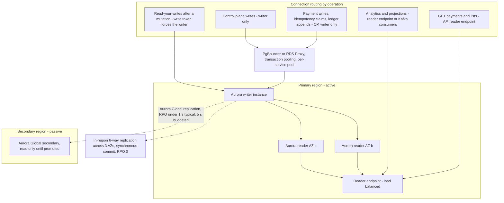
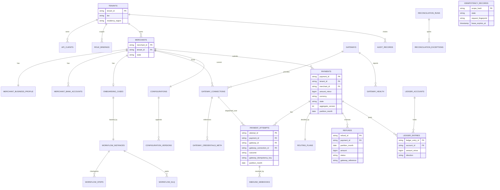
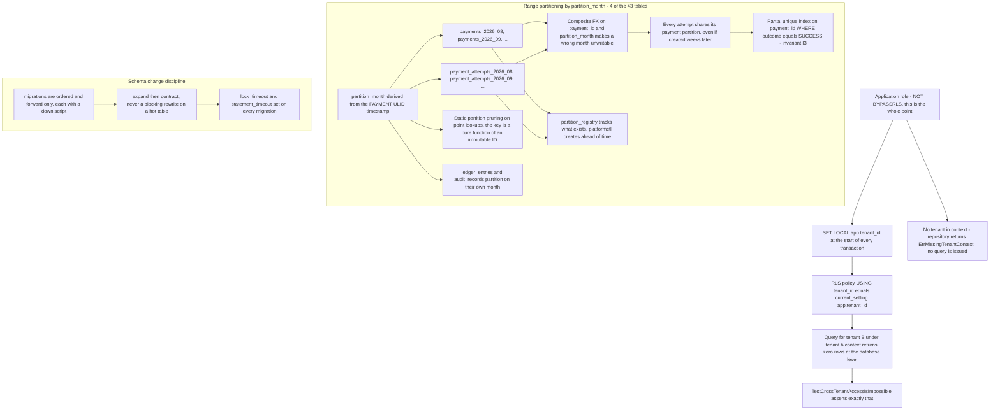

# 14 — Database Architecture

## What this shows and why it matters

One Aurora PostgreSQL cluster per payment-processing region plus an Aurora Global secondary,
carrying **43 tables** across every bounded context under row-level security, created by sixteen
ordered migrations. Diagram A is the topology and the routing rules for which connection serves
which operation; Diagram B is the per-context table grouping and the key relationships; Diagram C
is the partitioning and RLS boundary. The details that carry the most weight are the **partition
alignment of `payments` and `payment_attempts`** (Amendment A-02) and the fact that the
application connects as a **non-`BYPASSRLS` role**, which is what turns tenant isolation from a
code convention into a database guarantee.

## Diagram A — Cluster topology and connection routing

## Diagram B — Per-context table groups

## Diagram C — Partitioning and the RLS boundary

## Legend and notes

- **Payment writes never leave the regional writer.** They are CP: under partition the write is
  rejected with `503` rather than degraded. There are no cross-region writes, which is what makes
  active/passive the right posture for money movement (A4, A9, §15).
- **Reads are AP with read-your-writes for the caller.** `GET` is served from the reader endpoint
  and may be ≤ 1 s stale; a caller that just wrote carries a write token that forces its next read
  to the writer. Stale reads are acceptable; a caller not seeing its own write is not.
- **Amendment A-02 is the subtle one.** A partial unique index on a partitioned table is enforced
  only *within* a partition. If a payment's attempts could land in different monthly partitions —
  and they can, since an attempt may be created days later by delayed capture or reconciliation —
  invariant I3 would silently weaken to "at most one success per payment per month". Both tables
  are therefore partitioned on `partition_month := date_trunc('month', ids.TimeOf(payment_id))`,
  derived from the **payment's** ULID, so every attempt shares its payment's partition and the
  index constrains the full set.
- **ULIDs, not UUIDv4.** A 48-bit millisecond timestamp prefix gives time-ordered index locality
  in Postgres B-trees; UUIDv4 fragments them. The partition key being a pure function of an
  immutable ID also gives the planner static pruning on point lookups (§6).
- **RLS is defence in depth, not the only defence.** The order is: application guard (tenant from
  the token only, §16.2) → repository refusing to query without tenant context → RLS policy →
  an integration test that asserts cross-tenant reads return zero rows at the database level. The
  application role is deliberately not `BYPASSRLS`; a migration or admin role that is,
  is used only by `platformctl`.
- **`payment_attempts.gateway_connection_id` is what makes "which credential signed this request"
  answerable.** The gateway alone is not enough: one merchant can hold several connections to the
  same gateway — a live one and one being re-provisioned, or two sub-accounts in different
  corridors — and the credential, the external account reference and the certification state all
  belong to the *connection*. Migration `0016` adds the column, its `gwc_`-shaped `CHECK`
  (`NOT VALID`, so it does not take `ACCESS EXCLUSIVE` across every partition) and its
  documentation; `0007` had declared the column and nothing ever wrote to it. It stays nullable on
  purpose — an attempt written before the change legitimately has no connection to name, and
  `NOT NULL` would make those rows a lie.
- **Only four of the 43 tables are partitioned**: `payments`, `payment_attempts`, `ledger_entries`
  and `audit_records`. `refunds` carries `partition_month` without being partitioned itself —
  it needs the column to participate in the composite foreign key back to `payments`, which is
  what makes an attempt or refund in the wrong month physically unwritable rather than merely
  discouraged.
- **`idempotency_records` is drawn without a relationship** because it is keyed by the scope tuple
  `(tenant_id, merchant_id, method, path_template, idempotency_key)` hash, not by a foreign key.
  Postgres is authoritative for it; Redis mirrors completed records purely for latency (§14.3).
- **Ledger tables are append-only.** There is no `UPDATE` path; a correction is a compensating
  entry. Retention is 7 years for payments and ledger, 7 years WORM for audit, 7 days for
  idempotency (§17.3).

## Related

- [Design baseline §6 identifiers, §9 invariants, §15 consistency, §16 multi-tenancy](../spec/00-design-baseline.md)
- [16 — AWS architecture](16-aws-architecture.md), [19 — Disaster recovery](19-disaster-recovery.md)
- [docs/multi-tenancy.md](../multi-tenancy.md), [docs/lld.md](../lld.md)
