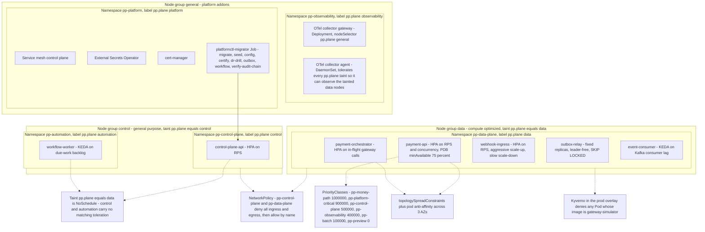

# 15 — Kubernetes Architecture

## What this shows and why it matters

How the deployables land on EKS: five namespaces, one per plane — `pp-control-plane`,
`pp-data-plane`, `pp-automation`, `pp-platform`, `pp-observability`, each carrying a `pp.plane`
label — dedicated node groups so control-plane and data-plane workloads cannot contend for the
same CPU, separate ingress paths for the money path and the admin path, a service mesh providing
mTLS and per-gateway outlier detection, and autoscaling driven by the signal that actually
predicts each workload's load. Seven of the nine binaries are long-running workloads;
`platformctl` runs as a Job with its own service account, and `gateway-simulator` is denied
admission in production by policy. The organising
principle is the same one that produced nine binaries rather than one: **blast radius**. A
`workflow-worker` retry storm during a KYC vendor outage must not be able to evict a
`payment-orchestrator` pod.

## Diagram A — Namespaces, node groups and workload placement

## Diagram B — Ingress, mesh and autoscaling signals

## Legend and notes

- **Taints and tolerations, not just node selectors.** Data-plane nodes carry
  `pp.plane=data:NoSchedule` so nothing without an explicit toleration can land there — including
  a mis-labelled batch job. Control-plane and automation workloads have no matching toleration and
  therefore *cannot* contend with the money path (§5). The one deliberate exception is the OTel
  agent DaemonSet, which tolerates `pp.plane` with `operator: Exists` because a node it cannot
  land on is a node whose every pod is unobserved.
- **`gateway-simulator` never reaches production, and it is not one control that says so.** The
  root `Dockerfile` refuses to build the image without an explicit `ALLOW_TEST_SERVICE=1` build
  arg, the prod overlay carries a Kyverno policy denying any Pod whose image matches it, and the
  binary is `//go:build`-guarded out of production images (§5).
- **Every namespace denies all traffic before allowing any.** `pp-control-plane` and
  `pp-data-plane` each start from a deny-all `NetworkPolicy` in both directions and then name what
  may talk to what, so a new workload is unreachable until somebody writes down who may reach it.
- **`payment-orchestrator` scales on in-flight gateway calls, not CPU.** It spends most of its time
  waiting on a network call, so CPU is a lagging and misleading signal; a gateway slowing from
  200 ms to 3 s multiplies concurrency without moving CPU at all.
- **`outbox-relay` needs no leader election.** Multiple replicas poll with
  `FOR UPDATE SKIP LOCKED`, so they partition the work naturally. Fixed replicas rather than an
  HPA, because throughput is bounded by Postgres and Kafka, not by pod count (§13.4).
- **Mesh-level retries are disabled on non-idempotent money routes.** A mesh that transparently
  retries `POST /v1/payments` because it saw a 5xx would defeat the entire idempotency design —
  retries belong to the orchestrator, which owns the attempt model and the derived gateway key
  (§14.4).
- **A single egress gateway with static IPs.** Gateways and KYC vendors allowlist source IPs;
  routing all third-party egress through one mesh egress gateway makes that allowlist stable
  across pod churn and gives one place to enforce and observe outbound TLS.
- **Outlier detection in the mesh complements, it does not replace, the application circuit
  breaker.** The mesh ejects a bad endpoint; the application breaker owns the
  `(gateway, operation)` health FSM that routing consumes and that publishes
  `gateway.health_changed.v1` (§10).
- **PodDisruptionBudgets plus multi-AZ topology spread plus 3× capacity headroom** is what makes
  the §18 targets survivable: node loss is a brief latency blip, AZ loss is invisible if headroom
  holds (§24).
- **The silo tier is a contractual posture, not a manifest that exists today.** Baseline §16.1
  provides for a dedicated namespace and node group per siloed tenant; `deployments/k8s` ships the
  five pooled namespaces only, and the pooled tier is what the per-tenant concurrency bulkheads and
  rate limits exist to isolate.

## Related

- [Design baseline §5 deployables, §16 multi-tenancy, §18 non-functional targets, §24 failure catalog](../spec/00-design-baseline.md)
- [16 — AWS architecture](16-aws-architecture.md), [17 — Security architecture](17-security-architecture.md)
- [deployments/k8s](../../deployments/k8s), [helm](../../helm)
