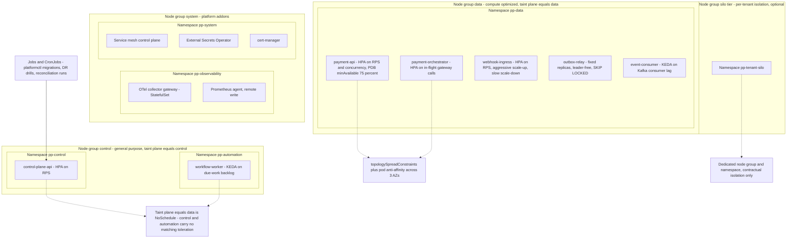

# 15 — Kubernetes Architecture

## What this shows and why it matters

How the nine deployables land on EKS: namespaces per plane, dedicated node groups so control-plane
and data-plane workloads cannot contend for the same CPU, separate ingress paths for the money
path and the admin path, a service mesh providing mTLS and per-gateway outlier detection, and
autoscaling driven by the signal that actually predicts each workload's load. The organising
principle is the same one that produced nine binaries rather than one: **blast radius**. A
`workflow-worker` retry storm during a KYC vendor outage must not be able to evict a
`payment-orchestrator` pod.

## Diagram A — Namespaces, node groups and workload placement

## Diagram B — Ingress, mesh and autoscaling signals

```mermaid
flowchart LR
  R53["Route 53 latency and health based"]
  WAF["AWS WAF - managed rules, per-IP rate limit, bot control"]
  ALBP["ALB - money path host, payments and webhooks"]
  ALBC["ALB - admin host, control plane"]
  IGWP["Ingress pp-data"]
  IGWC["Ingress pp-control"]

  subgraph MESHZ["Service mesh - mTLS everywhere, SPIFFE identity per workload"]
    SPAPI["payment-api sidecar"]
    SPORC["payment-orchestrator sidecar"]
    SEGRESS["Egress gateway - the only route to third-party gateways"]
    OD["Outlier detection and per-destination connection pools"]
    RETRY["Mesh retries disabled on non-idempotent money routes"]
  end

  subgraph SCALE["Autoscaling signals"]
    H1["payment-api - requests per second and active connections"]
    H2["payment-orchestrator - in-flight gateway calls, not CPU"]
    H3["webhook-ingress - requests per second, spiky, 3x headroom"]
    H4["event-consumer - Kafka consumer lag via KEDA"]
    H5["workflow-worker - due-work backlog via KEDA"]
    CA["Cluster Autoscaler or Karpenter with 3x capacity headroom"]
  end

  R53 --> WAF
  WAF --> ALBP --> IGWP --> SPAPI
  WAF --> ALBC --> IGWC
  SPAPI --> SPORC --> OD --> SEGRESS
  SEGRESS -->|"static egress IPs for gateway allowlisting"| EXT["Stripe, Adyen, PayPal, KYC vendor"]
  SPORC -.-> RETRY
  H1 --> CA
  H2 --> CA
  H3 --> CA
  H4 --> CA
  H5 --> CA
```

## Legend and notes

- **Taints and tolerations, not just node selectors.** Data-plane nodes carry `plane=data:NoSchedule`
  so nothing without an explicit toleration can land there — including a mis-labelled batch job.
  Control-plane and automation workloads have no matching toleration and therefore *cannot*
  contend with the money path (§5).
- **`payment-orchestrator` scales on in-flight gateway calls, not CPU.** It spends most of its time
  waiting on a network call, so CPU is a lagging and misleading signal; a gateway slowing from
  200 ms to 3 s multiplies concurrency without moving CPU at all.
- **`outbox-relay` needs no leader election.** Multiple replicas poll with
  `FOR UPDATE SKIP LOCKED`, so they partition the work naturally. Fixed replicas rather than an
  HPA, because throughput is bounded by Postgres and Kafka, not by pod count (§13.4).
- **Mesh-level retries are disabled on non-idempotent money routes.** A mesh that transparently
  retries `POST /v1/payments` because it saw a 5xx would defeat the entire idempotency design —
  retries belong to the orchestrator, which owns the attempt model and the derived gateway key
  (§14.4).
- **A single egress gateway with static IPs.** Gateways and KYC vendors allowlist source IPs;
  routing all third-party egress through one mesh egress gateway makes that allowlist stable
  across pod churn and gives one place to enforce and observe outbound TLS.
- **Outlier detection in the mesh complements, it does not replace, the application circuit
  breaker.** The mesh ejects a bad endpoint; the application breaker owns the
  `(gateway, operation)` health FSM that routing consumes and that publishes
  `gateway.health_changed.v1` (§10).
- **PodDisruptionBudgets plus multi-AZ topology spread plus 3× capacity headroom** is what makes
  the §18 targets survivable: node loss is a brief latency blip, AZ loss is invisible if headroom
  holds (§24).
- **The silo node group is optional and contractual.** Tenants on the siloed tier get a dedicated
  namespace and node group; the pooled tier shares pods with per-tenant concurrency bulkheads and
  rate limits (§16.1).

## Related

- [Design baseline §5 deployables, §16 multi-tenancy, §18 non-functional targets, §24 failure catalog](../spec/00-design-baseline.md)
- [16 — AWS architecture](16-aws-architecture.md), [17 — Security architecture](17-security-architecture.md)
- [deployments/k8s](../../deployments/k8s), [helm](../../helm)
