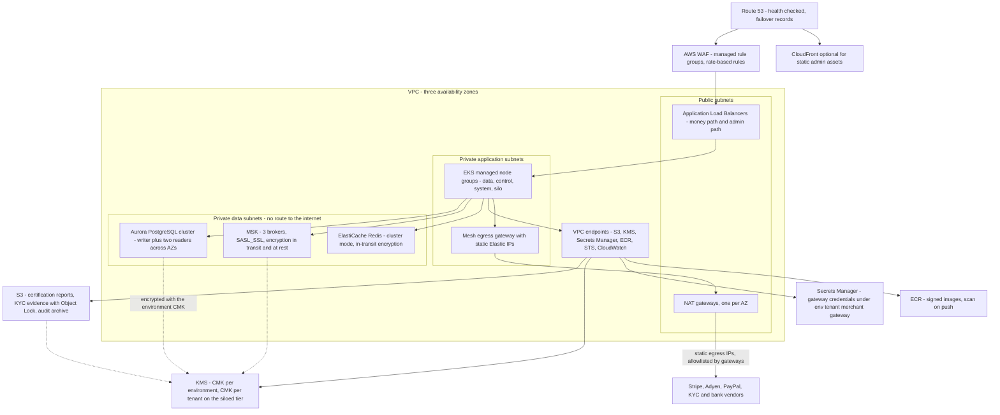
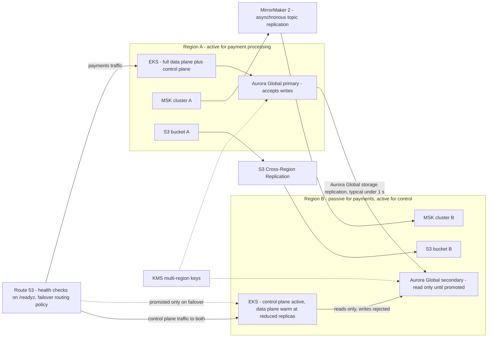

# 16 — AWS Architecture

## What this shows and why it matters

The concrete cloud substrate: VPC and subnet layout, EKS, Aurora Global, MSK, ElastiCache, S3,
KMS, Secrets Manager, WAF and Route 53, and the multi-region posture that realizes A9 —
**active/passive per payment-processing region with an active/active control plane**. Active/active
money movement would require a global consensus store or conflict resolution on financial state,
and that risk is not justified at 5 000 TPS sustained per region. The control plane, by contrast,
writes rarely and reads from a compacted log, so it can be active in both regions.

## Diagram A — In-region VPC and services

## Diagram B — Multi-region posture

## Legend and notes

- **Data subnets have no route to the internet.** Aurora, MSK and ElastiCache sit in subnets with
  no NAT route; everything AWS-facing goes over VPC endpoints. This removes an entire class of
  exfiltration path and keeps AWS API traffic off the public internet (§17.2).
- **All third-party egress leaves through the mesh egress gateway and per-AZ NAT with static
  Elastic IPs**, because gateways and KYC vendors allowlist source IPs. Pod churn must not change
  the platform's outbound identity.
- **Aurora Global replication is storage-level and asynchronous**, giving RPO ≤ 1 s typical and
  5 s budgeted; in-region commits are synchronous across three AZs, so in-region RPO is 0. RTO for
  a region failover is ≤ 15 min, for an AZ failover ≤ 60 s (§18).
- **The secondary region's data plane is warm, not cold.** Pods run at reduced replica counts so
  images are pulled, JIT is warm, connection pools exist and configuration caches are populated
  from the compacted `pp.config.configuration.v1` topic. A cold start would not meet a 15-minute
  RTO.
- **The control plane is active in both regions; the payment path is not.** Control-plane writes
  are low-rate and go to the current Aurora primary; control-plane *reads* are served locally.
  Payment writes are pinned to the region owning the Aurora writer, because cross-region writes on
  financial state are exactly what A9 refuses.
- **MirrorMaker 2 replicates topics asynchronously**, so the secondary's consumer offsets and
  event history are available after promotion. It is a recovery aid, not a correctness mechanism —
  the outbox in Aurora is the source of truth and replicates with the database.
- **KMS multi-region keys** let ciphertext written in region A be decrypted in region B without
  re-encrypting the data, which is a prerequisite for the secondary being usable at all.
- **S3 carries Object Lock for KYC evidence and audit archive** (5-year AML retention, 7-year WORM
  audit), and every bucket is prefixed by `tenant_id` with IAM conditions on the prefix (§16.1,
  §17.3).

## Related

- [Design baseline §15 consistency, §16 multi-tenancy, §17 security, §18 RPO and RTO targets](../spec/00-design-baseline.md)
- [15 — Kubernetes architecture](15-kubernetes-architecture.md), [19 — Disaster recovery](19-disaster-recovery.md)
- [terraform](../../terraform)
