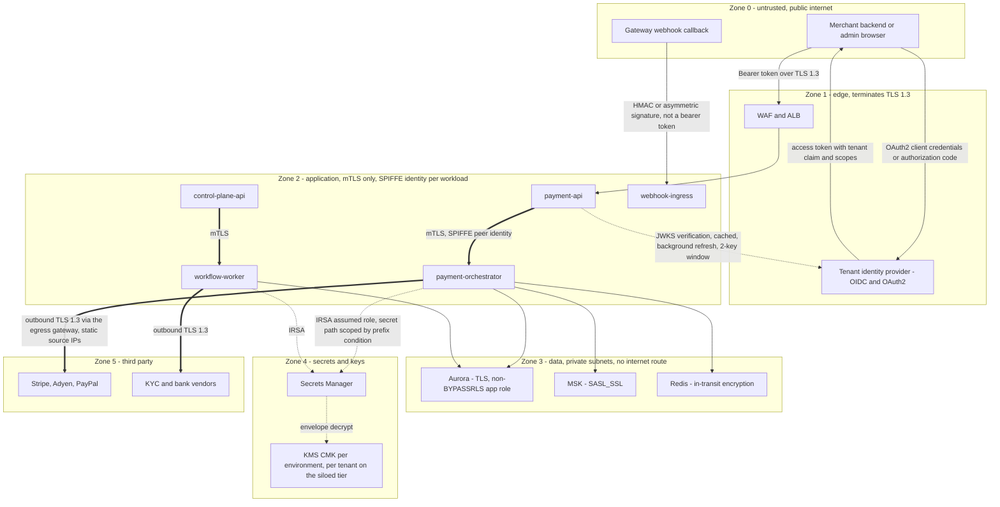
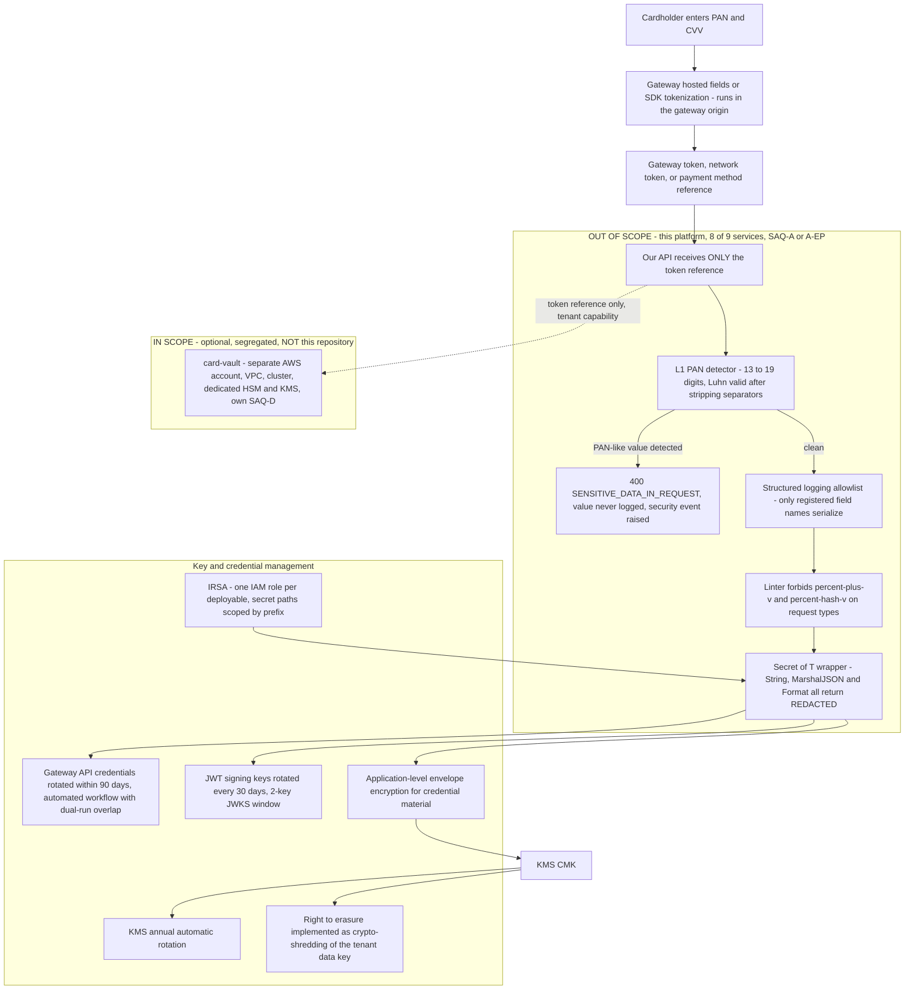

# 17 — Security Architecture

## What this shows and why it matters

Trust zones, the identity flows that cross them (OIDC, OAuth2, mTLS, IRSA), the PCI DSS scope
boundary, and secret and key management. The single most consequential design decision on this
page is the one drawn as a hard line in Diagram B: **PAN never enters the platform**, which is what
keeps eight of the nine deployables out of the cardholder data environment and the assessment at
SAQ-A/A-EP rather than SAQ-D. Everything else here is defence in depth around identity — tenant
identity comes only from the token, workload identity comes only from SPIFFE and IRSA, and no
credential material is ever held in application memory longer than a call.

## Diagram A — Trust zones and identity flows

## Diagram B — PCI scope boundary, secrets and key management

## Legend and notes

- **Tenant identity is derived exclusively from the authenticated principal.** A `tenant_id` in a
  request body or query string is ignored or, if it disagrees with the token, treated as a
  security event: `403 TENANT_MISMATCH` plus an audit record plus an alert. Every repository method
  extracts tenant from `context.Context` and returns `ErrMissingTenantContext` rather than
  querying if it is absent (§16.2).
- **The webhook edge authenticates in the opposite direction.** Gateways do not present bearer
  tokens; they sign payloads. Verification uses the per-connection signing secret from Secrets
  Manager, with a ±5 min timestamp window and nonce reuse detection to defeat replay (§24, and
  diagram 11).
- **Service-to-service is mTLS with SPIFFE workload identity, terminated by the mesh.** There is no
  in-cluster plaintext hop, and a compromised pod cannot impersonate another workload by presenting
  a stolen bearer token, because the peer identity is a certificate bound to the service account.
- **IRSA gives one IAM role per deployable, with secret paths scoped by a prefix condition**
  (`/{env}/{tenant}/{merchant}/{gateway}`). `payment-orchestrator` cannot read
  `workflow-worker`'s KYC vendor credentials even though both run in the same cluster (§17.2).
- **Three independent controls stop credential and PAN leakage into logs**, and they are
  structural rather than procedural: an allowlist-based structured logger (unregistered fields are
  simply not serialized), a linter ban on `%+v` / `%#v` over request types, and a `Secret[T]`
  wrapper whose `String()`, `MarshalJSON()` and `Format()` all return `[REDACTED]`. There is no
  code path that can print a secret by accident.
- **Crypto-shredding satisfies right-to-erasure without breaking financial retention.** Destroying
  the tenant's data key renders personal data unrecoverable while financial records remain
  retained under the legal-obligation basis (§17.3).
- **3DS is a policy outcome of the risk engine, not a flag.** PSD2/SCA exemptions (TRA, low value,
  MIT) are modelled explicitly per merchant and per corridor, and every exemption decision is
  audited (§17.3).
- **Audit records are hash-chained and CP.** Under partition the audit writer buffers to a local
  WAL and replays rather than breaking the chain (§15).

## Related

- [Design baseline §16.2 isolation guard, §17 PCI scope and enforcement, §17.3 regulatory boundaries](../spec/00-design-baseline.md)
- [01 — System context](01-system-context.md), [16 — AWS architecture](16-aws-architecture.md), [18 — Observability architecture](18-observability-architecture.md)
- [docs/security.md](../security.md), [docs/compliance.md](../compliance.md)
