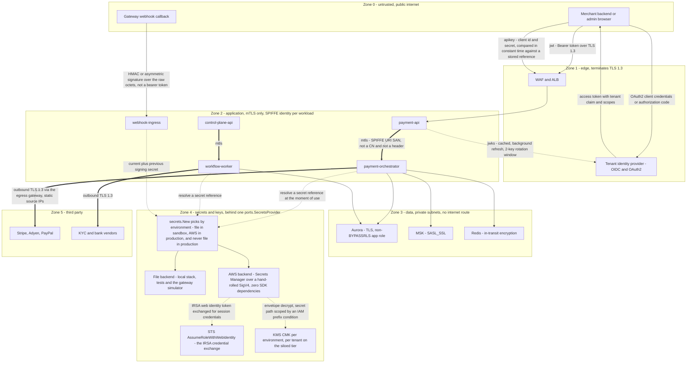
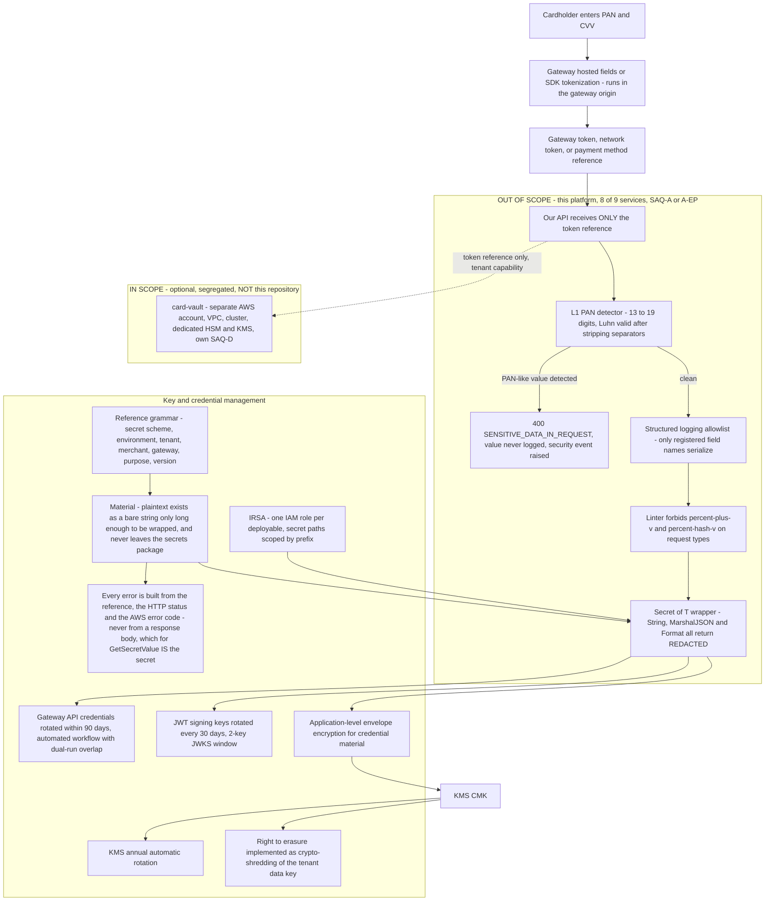

# 17 — Security Architecture

## What this shows and why it matters

Trust zones, the four authentication mechanisms that cross them (`jwt`/`jwks`, `mtls`, `apikey`,
plus gateway signatures inbound), the PCI DSS scope boundary, the secrets provider, and key
management. The single most consequential design decision on this page is the one drawn as a hard
line in Diagram B: **PAN never enters the platform**, which is what keeps eight of the nine
deployables out of the cardholder data environment and the assessment at SAQ-A/A-EP rather than
SAQ-D. Everything else here is defence in depth around identity — tenant identity comes only from
the token, workload identity comes only from SPIFFE and IRSA, and no credential material is ever
held in application memory longer than a call. Diagram C is where each control actually sits in
the request chain.

## Diagram A — Trust zones and identity flows

## Diagram B — PCI scope boundary, secrets and key management

## Diagram C — Where each control sits in the request chain

The security stages of `middleware.New`, in the order they actually run. Their placement relative
to one another is the design; see [06 — Data plane](06-data-plane.md) for the full fifteen.

```mermaid
flowchart LR
  BL["bodylimit - buffer the raw octets under the ceiling, then the L1 PAN scan"]
  CT["contenttype"]
  CO["cors - the preflight answer must precede authentication, a browser preflight carries no credentials by design"]
  SH["securityheaders - set on rejected responses too, which is why it is above authentication and not in the handler"]
  AN["authn - jwt via jwks, mtls SPIFFE peer identity, or apikey; a nil authenticator rejects everything"]
  TN["tenant - from the verified principal only, plus the merchant scope guard on any route with a merchantId"]
  AZ["authz - permission derived from the method and route template, so a route with no table entry is DENIED"]
  RL["ratelimit - per tenant and per merchant, which is why it is below tenant resolution"]
  CC["concurrency - adaptive limit plus shedding by priority class"]
  ID["idempotency - innermost, so a request any earlier stage rejected never consumes a key"]

  BL --> CT --> CO --> SH --> AN --> TN --> AZ --> RL --> CC --> ID
```

## Legend and notes

- **Tenant identity is derived exclusively from the authenticated principal.** A `tenant_id` in a
  request body or query string is ignored or, if it disagrees with the token, treated as a
  security event: `403 TENANT_MISMATCH` plus an audit record plus an alert. Every repository method
  extracts tenant from `context.Context` and returns `ErrMissingTenantContext` rather than
  querying if it is absent (§16.2).
- **The webhook edge authenticates in the opposite direction.** Gateways do not present bearer
  tokens; they sign payloads. Verification uses the per-connection signing secret from Secrets
  Manager, with a ±5 min timestamp window and nonce reuse detection to defeat replay (§24, and
  diagram 11).
- **Service-to-service is mTLS with SPIFFE workload identity, terminated by the mesh.** There is no
  in-cluster plaintext hop, and a compromised pod cannot impersonate another workload by presenting
  a stolen bearer token, because the peer identity is a certificate bound to the service account.
- **IRSA gives one IAM role per deployable, with secret paths scoped by a prefix condition**
  (`/{env}/{tenant}/{merchant}/{gateway}`). `payment-orchestrator` cannot read
  `workflow-worker`'s KYC vendor credentials even though both run in the same cluster (§17.2).
- **Four authentication mechanisms, not one.** `jwt` (bearer, OAuth2/OIDC) and `jwks` (cached key
  resolution with a background refresh and a two-key rotation window) at the public edge; `mtls`
  for service-to-service, keyed on the certificate's SPIFFE **URI SAN** rather than its CN,
  because a CN is a string an operator typed while a URI SAN is a statement the cluster CA stands
  behind and is bound to the private key that just completed the handshake; and `apikey` for
  machine clients, whose secret is compared in constant time against material resolved from the
  secrets provider by reference. The composition root picks which a binary uses; the middleware
  takes an `Authenticator` interface and knows about none of them.
- **The secrets provider is one port with two implementations, and the choice is made in one
  place.** `secrets.New` resolves `auto` to `file` in sandbox and `aws` in production; it will
  never resolve `auto` to the file backend in production, and an explicit `file` still has to get
  past `NewFileProvider`'s own refusal. Nine binaries need a provider, and a backend selected
  correctly in eight composition roots and wrongly in the ninth is a credential outage in the
  deployable nobody exercises locally.
- **The AWS backend is written directly against `net/http`, with SigV4 implemented in-package.**
  Four Secrets Manager calls and one STS call do not justify the official SDK's transitive module
  set running inside the process that holds gateway credentials; SigV4 is a two-hundred-line HMAC
  construction with published test vectors, and asserting against those buys the same assurance
  at a dependency count of zero. The trade is stated plainly: retry classification, endpoint
  resolution and the credential chain are now ours to own.
- **Plaintext credential material never leaves the secrets package.** It exists as a bare string
  only long enough to be moved into a `Material`, and every error returned from that package is
  built from the reference, the HTTP status and the AWS error code — never from a response body,
  which for `GetSecretValue` *is* the secret.
- **A secret the ingress cannot read is `502 DEPENDENCY_FAILURE`, not `401`.** Refusing the
  webhook is correct either way, but the two page different people, and conflating an
  infrastructure failure with an authentication failure sends the wrong team to the wrong
  dashboard during an outage.
- **Three independent controls stop credential and PAN leakage into logs**, and they are
  structural rather than procedural: an allowlist-based structured logger (unregistered fields are
  simply not serialized), a linter ban on `%+v` / `%#v` over request types, and a `Secret[T]`
  wrapper whose `String()`, `MarshalJSON()` and `Format()` all return `[REDACTED]`. There is no
  code path that can print a secret by accident.
- **Crypto-shredding satisfies right-to-erasure without breaking financial retention.** Destroying
  the tenant's data key renders personal data unrecoverable while financial records remain
  retained under the legal-obligation basis (§17.3).
- **3DS is a policy outcome of the risk engine, not a flag.** PSD2/SCA exemptions (TRA, low value,
  MIT) are modelled explicitly per merchant and per corridor, and every exemption decision is
  audited (§17.3).
- **Audit records are hash-chained and CP.** Under partition the audit writer buffers to a local
  WAL and replays rather than breaking the chain (§15).

## Related

- [Design baseline §16.2 isolation guard, §17 PCI scope and enforcement, §17.3 regulatory boundaries](../spec/00-design-baseline.md)
- [01 — System context](01-system-context.md), [16 — AWS architecture](16-aws-architecture.md), [18 — Observability architecture](18-observability-architecture.md)
- [docs/security.md](../security.md), [docs/compliance.md](../compliance.md)
