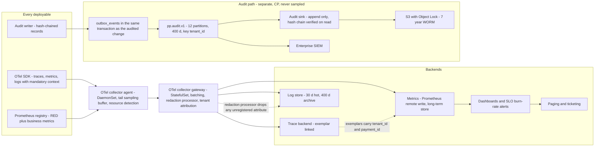
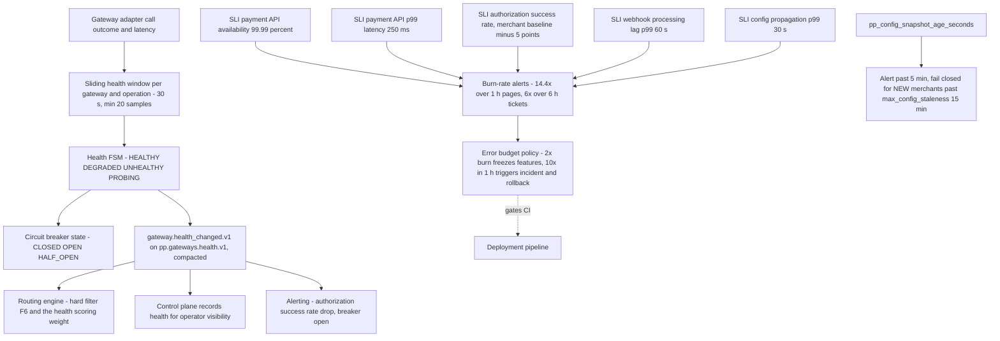

# 18 — Observability Architecture

## What this shows and why it matters

Telemetry from OTel SDK to collector agent to collector gateway to backends, the separate and
non-negotiable audit path, and the feedback loop that turns observed gateway behaviour back into
routing and control decisions. Observability is a plane in this platform, not a bolt-on, for two
reasons: the §22.1 mandatory context (`trace_id`, `tenant_id`, `merchant_id`, `payment_id`,
`gateway_id`, …) is what makes a single payment forensically reconstructible across nine binaries;
and `gateway.health_changed.v1` is a *control* signal, so the health pipeline has correctness
consequences, not just diagnostic ones.

## Diagram A — Telemetry pipeline and the audit path

## Diagram B — The feedback loop into control

## Legend and notes

- **Cardinality is a design constraint, not a tuning detail.** `merchant_id` and `payment_id` are
  **never** metric labels — with 50 000 merchants they would produce unqueryable series counts.
  They live in logs, traces and metric *exemplars*, so a spike on a low-cardinality series links
  straight to a representative trace carrying the high-cardinality identity. CI runs a cardinality
  lint over the metric registry and a label set may not exceed 10⁴ series per metric per service
  (§22.3).
- **The audit path is deliberately not the telemetry path.** Audit records go through the same
  transactional outbox as domain events, are hash-chained, are never sampled, and land in S3 with
  Object Lock for 7-year WORM. Telemetry may be sampled and dropped under load; audit may not
  (§15, §17.3).
- **Redaction happens at the collector gateway as well as in the application.** The application's
  allowlist logger is the primary control; the gateway's redaction processor is the backstop that
  catches an attribute added by a library rather than by our code.
- **Tail sampling is buffered at the agent, and errors are always kept.** A 100 % sample of failed
  and slow payment traces plus a low base rate of successful ones gives the forensic coverage that
  matters at a cost that scales.
- **Diagram B is the only loop that runs upstream against the plane ordering, and it is
  intentional.** Health is observed in the data plane, published as a domain event, and consumed
  by routing (a correctness-affecting consumer) and by the control plane (a recording consumer).
  This is the platform's single closed control loop (§10).
- **`pp_config_snapshot_age_seconds` implements graceful degradation with a defined cliff.** Under
  5 minutes: normal. Past 5 minutes: alert. Past `max_config_staleness` (default 15 minutes): the
  data plane fails closed for **new** merchants while continuing to serve existing ones. Neither
  fail-open (kills compliance) nor fail-closed-immediately (kills revenue) — fail-static with a
  bound (§15).
- **The error budget policy is automated in CI**, not a wiki page: burn above 2× freezes features,
  above 10× in one hour triggers an incident and a rollback (§18).

## Related

- [Design baseline §10 gateway health, §15 fail-static, §22 observability contract, §18 SLOs](../spec/00-design-baseline.md)
- [09 — Gateway routing](09-gateway-routing.md), [12 — Event architecture](12-event-architecture.md), [17 — Security architecture](17-security-architecture.md)
- [docs/architecture.md](../architecture.md), [docs/runbooks](../runbooks)
