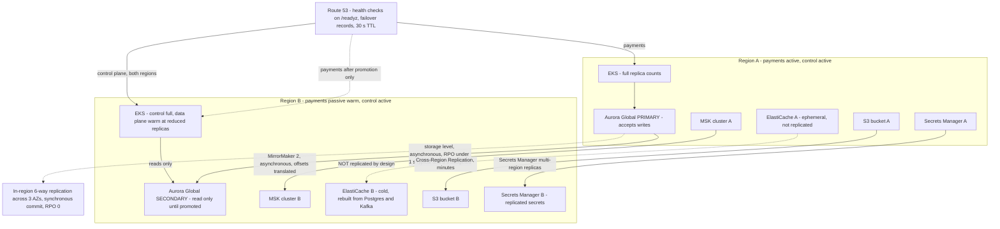
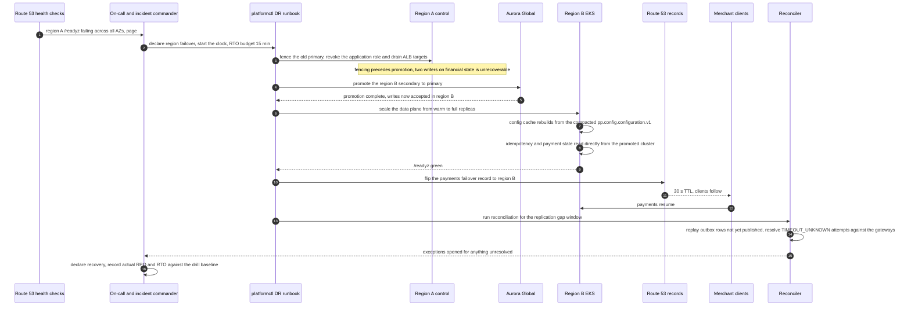
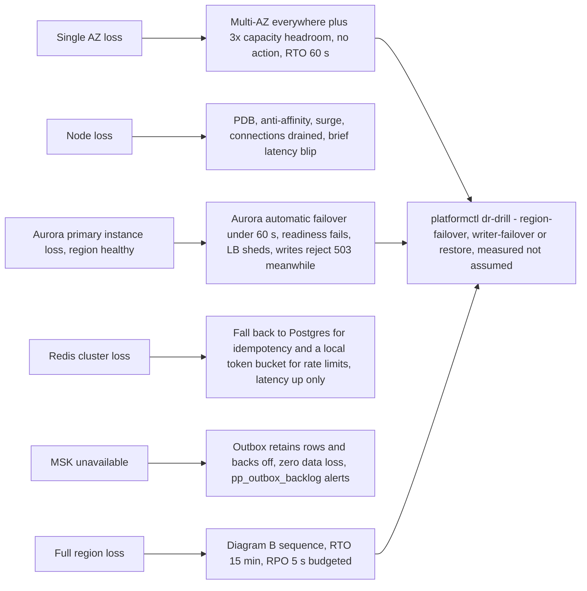

# 19 — Disaster Recovery

## What this shows and why it matters

The multi-region topology, every replication path with its own RPO characteristic, and the ordered
failover sequence that meets RTO ≤ 15 min for a region loss and ≤ 60 s for an AZ loss. The posture
is active/passive for payment processing and active/active for the control plane (A9). The single
most important property in the failover sequence is that **payment writes stop before they can
split-brain**: the old primary is fenced before the secondary is promoted, because two Aurora
writers accepting payment writes for the same merchant is a class of damage that no amount of
subsequent reconciliation can fully repair.

## Diagram A — Topology and replication paths

## Diagram B — Region failover sequence

## Diagram C — Failure scope and response

## Legend and notes

- **Fencing before promotion is the whole sequence in one step.** Steps 3 and 4 are ordered that
  way deliberately: revoke the application role and drain the load balancer in region A *first*, so
  that a partially-reachable region A cannot keep accepting payment writes after region B is
  promoted. This is the operational expression of A4 — under partition, refuse the write.
- **Redis is deliberately not replicated.** It holds only a mirror of completed idempotency
  records, token buckets and a configuration snapshot, all of which are rebuildable from Postgres
  and from the compacted Kafka topic. Replicating it would add a failure mode and a cost for no
  correctness gain (§14.3).
- **The warm secondary exists because a cold start cannot make 15 minutes.** Reduced-replica pods
  keep images pulled, connection pools alive and the configuration cache populated from the
  compacted topic. Scaling warm to full is a minutes operation; scaling from zero is not.
- **The replication gap is real and is reconciled, not ignored.** Aurora Global replication is
  asynchronous, so up to the RPO budget of transactions may exist in the failed region's storage
  and not the promoted one. Step 13 replays unpublished outbox rows and resolves ambiguous
  attempts against the gateways using the deterministic gateway idempotency key derived from
  `attempt_id` — which is precisely why that key is derived rather than random (§14.4).
- **Payments that were `PROCESSING` at the moment of failure stay `PROCESSING`.** No failover step
  may fail a payment; the reconciler resolves them from the gateway's own record (§12.3).
- **The control plane needs no failover**, because it is already active in both regions and its
  reads are served locally from the compacted configuration topic. Only its *writes* follow the
  Aurora primary.
- **RPO and RTO are drill-measured numbers, not aspirations.** `platformctl dr-drill` takes one of
  three scenarios — `region-failover`, `writer-failover`, `restore` — and records actual figures
  against the §18 targets; a drill that misses the target is a defect with an owner, not a note
  (§18, §27).
- **Step 13's two halves have different maturity.** Replaying unpublished outbox rows is
  `outbox-relay` doing its ordinary job against the promoted writer, and needs no new machinery.
  Resolving ambiguous attempts against the gateways is `internal/application/payment.Reconciler`,
  which is implemented and tested but is not yet constructed by any binary — so today that half of
  the gap-closing is an operator following the runbook rather than a process doing it. The step is
  drawn because the sequence is not correct without it.

## Related

- [Design baseline §15 consistency, §18 RPO and RTO, §24 failure mode catalog](../spec/00-design-baseline.md)
- [14 — Database architecture](14-database-architecture.md), [16 — AWS architecture](16-aws-architecture.md)
- [docs/failure-handling.md](../failure-handling.md), [docs/runbooks](../runbooks)
