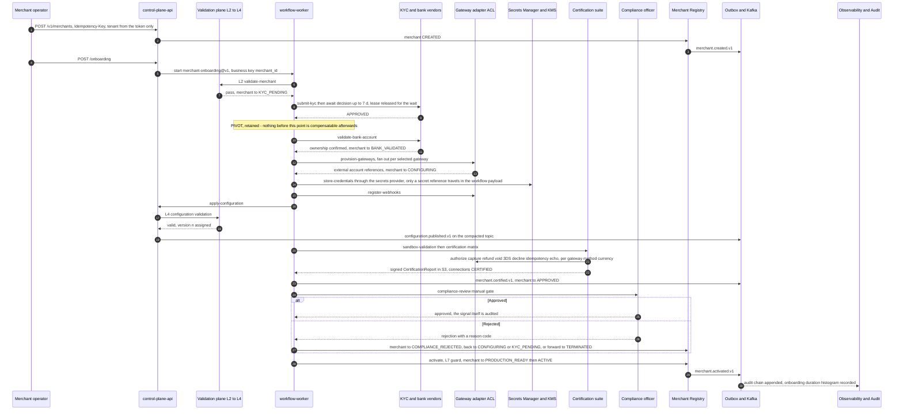
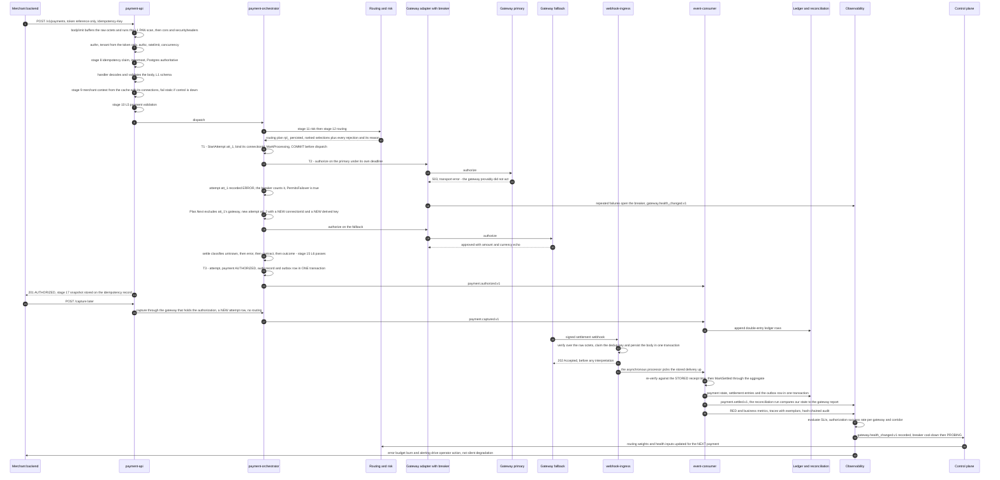

# 20 — End-to-End Sequence

## What this shows and why it matters

One continuous narrative from a merchant signing up to that merchant's payments being routed,
executed, reconciled, ledgered, observed, and fed back into routing and control — the full brief's
final goal in a single trace. Every other diagram in this set is a zoom into one band of this
sequence. It is split into two diagrams only because the timescales are different by four orders
of magnitude: Diagram A spans minutes to days (onboarding through activation), Diagram B spans
milliseconds to hours (a payment, its webhook, its ledger entries, and the closed control loop
that changes how the *next* payment is routed).

## Diagram A — Merchant to activation

## Diagram B — Payment to feedback loop

## Legend and notes

- **The two diagrams share one causal chain.** `correlationid` and `causationid` on the event
  envelope make the full chain — from `merchant.created.v1` through `payment.settled.v1` —
  reconstructible from the event log alone, and `traceparent` links it to the distributed trace
  (§13.1, §22.1).
- **Diagram A step 20 is the certification matrix doing real work.** It exercises authorize,
  capture, refund, void, a mapped decline, a signature-verified webhook, a 3DS challenge, an
  idempotency replay and an amount/currency echo — per `(gateway, payment_method, currency)`. That
  is why the failover in Diagram B is safe: the ACL's decline mapping and L6 echo checking were
  proven against the sandbox before real money was at risk (§11.4).
- **Diagram B deliberately shows the failover path, not the happy path**, because the happy path is
  the failover path minus three messages. The critical detail is that the fallback attempt is a
  **new attempt with a new derived key and its own `connectionId`**, so it is a genuinely new
  authorization rather than a retry that might double-charge (A10, §14.4).
- **The branch taken is `ERROR`, and that is why failover is permitted.** A 503 from the primary is
  a transport failure — the gateway provably did not act — so `att.PermitsFailover()` is true.
  Had the primary *declined*, failover would have depended on the normalized reason being one of
  the four soft ones; had it timed out, the attempt would be `TIMEOUT_UNKNOWN` and the loop would
  have stopped there with the payment still `PROCESSING`.
- **The 201 goes out before settlement exists.** Authorization, capture and settlement are three
  separate events at three separate timescales; the merchant is told about each as it happens
  rather than being blocked on the slowest.
- **`webhook-ingress` returns `202` before interpretation.** Everything downstream is asynchronous
  and runs in a separate `Processor` that re-verifies the stored payload against its stored receipt
  time — which is what keeps a slow ledger from turning into a gateway redelivery storm.
- **The last four steps are the closed loop and the reason "Observability" is a plane.** Observed
  gateway behaviour becomes `gateway.health_changed.v1`, which changes the candidate set and the
  scoring weights for the *next* payment, and is recorded by the control plane for operator
  visibility. Nothing here is a dashboard-only signal (§10, §22).
- **Where this sequence can stop, it stops loudly.** `503 NO_ELIGIBLE_GATEWAY` when the candidate
  set empties, `422 RISK_DECLINED` at step 7, `502 GATEWAY_CONTRACT_VIOLATION` at step 19, and a
  payment left in `PROCESSING` with `payment.reconciliation_required.v1` if the gateway call times
  out. There is no branch in which the platform guesses.

## Related

- [Design baseline — the whole document, in order](../spec/00-design-baseline.md)
- [07 — Merchant onboarding](07-merchant-onboarding.md), [08 — Payment flow](08-payment-flow.md), [10 — Gateway failover](10-gateway-failover.md), [11 — Webhook flow](11-webhook-flow.md), [18 — Observability architecture](18-observability-architecture.md)
- [docs/architecture.md](../architecture.md)
