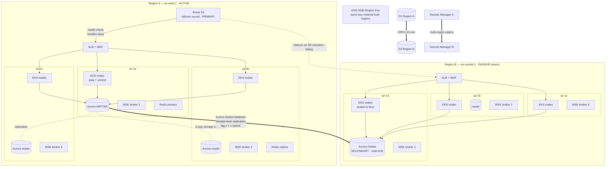
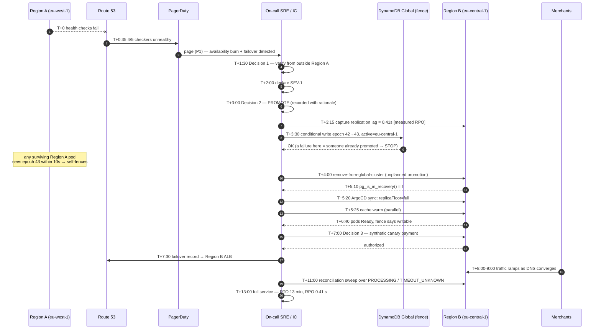
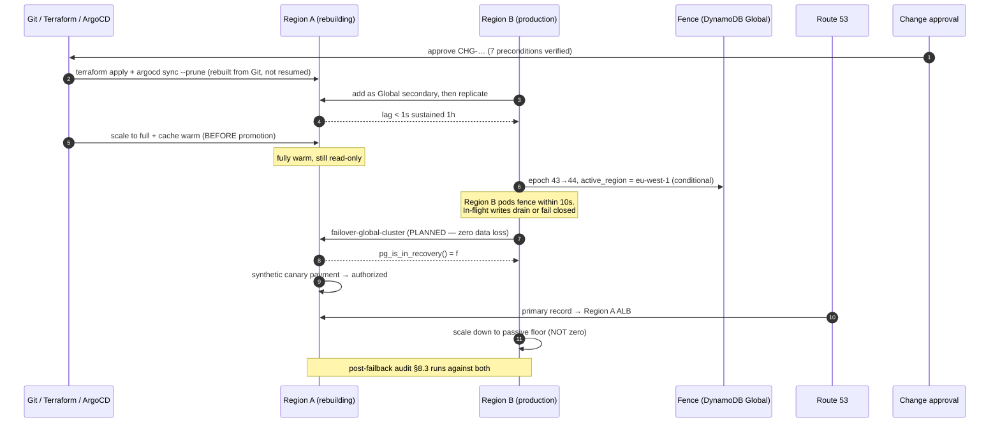

# Disaster Recovery

> **Purpose:** the RPO/RTO commitments per data store, the multi-region topology and why it is active/passive, the failover and failback procedures with real commands, the restore-drill evidence, and the detailed proof that a region failover cannot create a duplicate payment.
> **Derived from and subordinate to [`docs/spec/00-design-baseline.md`](spec/00-design-baseline.md) §18 (RPO ≤ 5 s, RTO ≤ 15 min region / ≤ 60 s AZ), §1.3 A4/A7/A9/A10, §14 (idempotency), §15 (consistency), §24 (failure catalog).** Where this document disagrees with the baseline, the baseline wins and this document is a defect.

---

## 0. The commitments

| Objective | Target | Scope | Verified by |
|---|---|---|---|
| **RPO** | ≤ 5 s | Cross-region. In-region: **0** (synchronous quorum commit) | Quarterly regional game day GD-R |
| **RTO** | ≤ 15 min | Region failover, detection → merchants processing again | Quarterly GD-R |
| **RTO** | ≤ 60 s | AZ failover, fully automatic, no human involved | Monthly game day GD-AZ |
| **Durability** | 11 nines (S3), Aurora 6-way across 3 AZs | All persisted money state | Provider SLA + monthly restore drill |
| **Correctness under failover** | **Zero duplicate payments, zero lost ledger entries, zero broken audit chains** | Absolute — not a percentage | Every game day, §7 assertions |

The last row is the one that actually constrains the design. RPO and RTO are negotiable engineering trade-offs. "A failover may not double-charge a cardholder" is not.

---

## 1. Definitions, stated precisely

| Term | Definition as used here |
|---|---|
| **RPO** (Recovery Point Objective) | The maximum window of *committed* writes that may be lost. Measured from the last write durably replicated to the surviving site, not from the last write accepted by the failed site. |
| **RTO** (Recovery Time Objective) | Wall clock from **detection** (first automated signal) to **full service** (merchants successfully creating payments against the surviving region), including human decision time. It is not "time to promote the database". |
| **MTTD** | Detection latency: failure occurs → alert fires. Budgeted at ≤ 90 s and it is part of RTO. |
| **Detection** | Two independent signals agreeing: Route 53 health checks failing from ≥ 3 of 5 checker regions, **and** the AMP `up` / SLI series for the region flatlining. One signal alone is a false-positive generator. |
| **Full service** | `pp:payment_api_availability:ratio_rate5m` in the surviving region ≥ 0.999 for 5 consecutive minutes with real traffic, and the synthetic payment canary passing. |
| **Degraded service** | Reads served, payments rejected with `503 SERVICE_UNAVAILABLE` + `Retry-After`. Explicitly a valid intermediate state — **fail closed on money** (§1.3 A4). |
| **Failover** | Promoting the passive region to active. A **deliberate human decision** (§5.3). |
| **Failback** | Returning to the original region after it recovers. Always planned, never automatic. |

### 1.1 RPO and RTO per data store

They differ, and pretending otherwise is how DR plans fail in practice.

| Store | Contents | In-region RPO | Cross-region RPO | Cross-region RTO | Notes |
|---|---|---|---|---|---|
| **Aurora PostgreSQL Global** | Payments, attempts, idempotency records, ledger, audit chain, merchants, config, workflow state | **0** — quorum commit across 3 AZs before ack | **≤ 1 s typical, 5 s budgeted** | **≤ 1 min** to promote, inside the 15 min RTO | The only store where RPO > 0 would be a correctness problem |
| **MSK (Kafka)** | Domain events in flight | **0** — `acks=all`, `min.insync.replicas=2`, RF=3 across 3 AZs | **N/A — deliberately not replicated** (§4.2) | N/A | Events are *re-derivable from the outbox*. See §4.2 for why replicating Kafka is worse than not |
| **ElastiCache (Redis)** | Idempotency read cache, rate-limit buckets, config snapshots, JWKS | **N/A — loss tolerated** | **N/A — not replicated** | seconds (cold start) | Redis is never authoritative (§14.3). Loss costs latency, never correctness |
| **S3** | Certification reports, KYC artifacts, settlement files, log/audit archive | 0 | **≤ 15 min** (CRR, typically < 60 s) | 0 — bucket is already there | Versioning + Object Lock; CRR is asynchronous by design |
| **Secrets Manager** | Gateway credentials, signing keys, DB credentials | 0 | **seconds** (multi-region replica secrets) | 0 | Replica is continuously maintained; no promotion step needed |
| **KMS** | CMKs | 0 | 0 | 0 | Multi-Region Keys — same key material, same key ID suffix, both regions |
| **EKS cluster + workloads** | No state | N/A | N/A | **≤ 10 min** cold, **≤ 3 min** warm | Cattle. Recreated from Terraform + ArgoCD (§4.6) |
| **Route 53 / DNS** | Traffic direction | N/A | N/A | **60–120 s** | TTL 60 s + health-check evaluation |
| **Prometheus / Loki / Tempo** | Telemetry | Best effort | Best effort | minutes | Deliberately excluded from the RTO path. **DR of the observability stack is not a prerequisite for DR of the platform** |

The last line is a decision, not an oversight: the failover runbook must be executable with dashboards down. Every verification step in §5 is a command that reads the authoritative store directly, not a Grafana panel.

---

## 2. Topology

### 2.1 Within a region: multi-AZ

Region A = `eu-west-1` (active). Three AZs: `eu-west-1a/1b/1c`.

| Component | AZ placement | Failure behaviour |
|---|---|---|
| EKS managed node groups | One ASG per AZ, `minSize` sized so any **two** AZs carry 100 % of peak (3× headroom, §24) | AZ loss → ~⅓ of pods lost; PDBs + surge + `topologySpreadConstraints` reschedule onto surviving AZs |
| ALB / NLB | Cross-zone load balancing on, subnets in all 3 AZs | AZ loss → ELB stops sending to the dead AZ within a health-check interval (10 s) |
| Aurora cluster | Writer in one AZ, ≥ 2 readers in the other two; storage 6-way replicated across 3 AZs | Writer AZ loss → automatic failover to a reader, **≤ 60 s**; storage survives losing an entire AZ plus one additional volume |
| MSK | 3 brokers, one per AZ, RF=3, `min.insync.replicas=2` | Broker loss → partitions with ISR ≥ 2 keep accepting writes; leader election ~seconds |
| ElastiCache | Replication group with automatic failover, replicas in different AZs | Primary loss → promote replica, ~30 s; a cold cache is acceptable |
| NAT gateways | One per AZ, per-AZ route tables | AZ loss does not strand the other AZs' egress |
| Secrets/KMS/S3 | Regional services, AZ-transparent | — |

AZ failover requires **no human action and no DNS change**. That is why its RTO is 60 s and the region's is 15 minutes.



### 2.2 Across regions: active/passive, and why

Baseline §1.3 A9: **active/passive per payment-processing region with an active/active control plane.**

| Posture | What it would require | Why we did not choose it for money state |
|---|---|---|
| **Active/active writes on `payments`** | Either a globally-consensus store (Spanner-class, cross-region Raft: +80–150 ms on every commit, blowing the 250 ms p99 SLO) or multi-master with conflict resolution | There is no correct conflict resolution for "two regions each created an authorization for the same idempotency key". CRDTs work for shopping carts; they do not work for authorizations against an issuer. The failure mode is a double charge — the exact outcome the entire design exists to prevent (§1.3 A4, A7) |
| **Active/active with tenant sharding by region** | Each tenant pinned to a home region; no shared money state | This is *coherent*, and is the growth path. It is not DR: a tenant's home region failing still requires the same promotion procedure. It multiplies operational surface without improving RPO/RTO. Deferred until scale or residency (§17.3) demands it |
| **Active/passive (chosen)** | One writer, storage-level async replication, deliberate promotion | Single writer means the idempotency unique index, the partial unique index enforcing invariant I3, and the ledger constraints are all enforced by **one** authority. Every correctness guarantee in §9 of the baseline reduces to "there is exactly one place that decides". Failover moves that place; it never creates a second one |

The control plane is active/active in a narrower sense: `control-plane-api` runs in both regions and serves **reads** from the local Aurora Global secondary at all times, so admin dashboards, configuration reads and the data plane's config snapshot warming work in Region B continuously. Control-plane **writes** go to the single global writer (§15). This keeps Region B's caches, config snapshots and JWKS warm — which is a meaningful fraction of the 15-minute RTO.

Warm-passive specifics:

| Aspect | Setting | Reason |
|---|---|---|
| Region B pod replicas | `payment-api` 3, `payment-orchestrator` 3, others 1–2 (≈ 10 % of Region A) | Cold (zero-replica) passive adds image pull, JIT warm-up, connection-pool establishment and JWKS fetch to the RTO — measured at 4–6 min. 10 % floor costs ~9 % of one region's compute and removes that |
| Region B readiness | `readyz` returns **not ready** while the local Aurora endpoint is a read-only secondary and the region is not promoted | Prevents Route 53 from sending money traffic to a region that cannot write |
| Karpenter in Region B | Provisioner exists, `limits.resources.cpu` sized for full peak, but no pending pods | Node capacity is a scale-out away, and the ASG/Karpenter warm-up (~90 s) overlaps with Aurora promotion |
| Config snapshots | Region B services subscribe to `pp.config.configuration.v1` from Region A's MSK **read-only mirror is not used** — instead they read config from the local Aurora secondary every 15 s | Removes a cross-region Kafka dependency from the critical path; the secondary is ≤ 1 s behind |

---

## 3. Split-brain prevention

Stated up front because it constrains everything in §5.

| Control | Mechanism |
|---|---|
| **Promotion is a human decision** | There is **no** automatic cross-region promotion. Route 53 health checks move *traffic*; only a human running the promotion runbook moves *write authority*. A network partition between regions looks identical to a region failure from the other side; automating promotion on that signal is how both regions end up writable |
| **Fencing token** | A monotonically increasing `epoch` integer stored in the DynamoDB Global Table `pp-dr-control` (item `region_authority`), guarded by a conditional write. Promotion increments it. Every `payment-api` / `payment-orchestrator` pod reads it on startup and every 10 s; a pod whose cached epoch is lower than the current epoch **immediately stops accepting writes and fails readiness** |
| **The old region cannot resume writes** | Three independent barriers, any one of which is sufficient: (1) Aurora Global detach makes the old cluster's writer endpoint no longer part of the global cluster — Region B is a separate cluster and Region A cannot replicate into it; (2) the epoch fence — old-region pods see a higher epoch and self-fence within 10 s; (3) the promotion procedure's first step scales Region A's data-plane deployments to zero and removes the Region A target from the Route 53 record |
| **DNS is not a safety mechanism** | Route 53 failover is a *traffic* control with a 60 s TTL and client-side caching that can outlive it. Correctness never depends on DNS having converged; it depends on the epoch fence and the Aurora topology |
| **In-flight requests during promotion** | Fail closed. A request holding an open transaction against the old writer either commits before the writer dies (its effect is replicated or it is inside the ≤ 5 s RPO window — see §6) or is rolled back by the database. There is no third outcome |

```yaml
# The fencing item, DynamoDB Global Table pp-dr-control
{
  "pk":            "region_authority",
  "epoch":         42,
  "active_region": "eu-west-1",
  "promoted_at":   "2026-08-26T14:03:11.412Z",
  "promoted_by":   "principal:sre-lead:alice",
  "reason":        "GD-R-2026Q3 / incident INC-2291",
  "aurora_cluster_arn": "arn:aws:rds:eu-west-1:…:cluster:pp-prod"
}
```

```go
// internal/platform/fencing — checked on the write path
func (f *Fence) AssertWritable(ctx context.Context) error {
    cur := f.cached.Load()                  // refreshed every 10s by a background goroutine
    if cur.Epoch > f.bootEpoch || cur.ActiveRegion != f.region {
        f.health.MarkNotReady("fenced: epoch=%d active=%s", cur.Epoch, cur.ActiveRegion)
        return apierror.ServiceUnavailable("REGION_FENCED")
    }
    return nil
}
```

The fence is checked before the idempotency claim (§12 stage 8) — before any state is written. A fenced pod rejects with `503`, which the error model marks retryable (§20.1), so a client SDK retries and lands in the promoted region after DNS converges.

---

## 4. Per-store design

### 4.1 Aurora PostgreSQL Global Database

| Property | Value |
|---|---|
| Engine | Aurora PostgreSQL 15.x |
| Primary cluster | Region A, 1 writer + 2 readers, `db.r6g.4xlarge` |
| Secondary cluster | Region B, 2 readers, headroom-sized (§4.1.4) |
| Replication | **Storage-level, physical, asynchronous.** The Aurora storage layer replicates log records directly, bypassing the database engine — replication does not consume writer CPU and cannot be blocked by a long-running query on the secondary |
| Typical lag | 200–800 ms (`AuroraGlobalDBReplicationLag`) |
| Budgeted lag | 5 s — the RPO. Alert at 5 s (P1) |
| Backtrack | Disabled on prod (incompatible with Global Database); PITR is the mechanism instead |
| Encryption | KMS Multi-Region Key; the secondary is encrypted with the replica key of the same MRK, so no re-encryption is needed at promotion |

#### 4.1.1 Replication mechanism, and why it matters for RPO

Aurora Global Database replicates at the **storage** layer, not by shipping WAL through the engine. Consequences that shape this document:

- Lag is dominated by inter-region network RTT (~12 ms `eu-west-1` → `eu-central-1`), not by write volume or by secondary load. A 5 s RPO budget is roughly 400× the typical lag.
- Replication cannot fall behind because of a slow query, a vacuum, or a schema migration on the secondary — the secondary has no independent write path.
- A commit is acknowledged to the application after quorum in the **local** region's 6-way storage. Cross-region replication is asynchronous. Therefore in-region RPO is 0 and cross-region RPO is > 0. This asymmetry is the entire reason §6 exists.

#### 4.1.2 Lag monitoring

```promql
# P1 — RPO at risk
aws_rds_aurora_global_db_replication_lag > 5

# P2 — trending toward the budget
avg_over_time(aws_rds_aurora_global_db_replication_lag[15m]) > 2

# P1 — replication has stopped entirely (worse than high lag: it is silent)
changes(aws_rds_aurora_global_db_replicated_write_io[10m]) == 0
  and sum(rate(pp_payments_total{outcome="created"}[10m])) > 0
```

Independent end-to-end probe, because a CloudWatch metric can be stale or wrong and the RPO commitment is to the business, not to CloudWatch:

```sql
-- Region A, every 10s, from a canary job
INSERT INTO dr_heartbeat (region, seq, written_at)
VALUES ('eu-west-1', nextval('dr_heartbeat_seq'), clock_timestamp())
ON CONFLICT (region) DO UPDATE SET seq = EXCLUDED.seq, written_at = EXCLUDED.written_at;
```

```sql
-- Region B secondary, every 10s
SELECT EXTRACT(EPOCH FROM (clock_timestamp() - written_at)) AS observed_lag_seconds
FROM   dr_heartbeat WHERE region = 'eu-west-1';
```

`pp_dr_replication_lag_seconds` is the observed value; it is the number the RPO SLO is measured against, and the one the game day report cites.

#### 4.1.3 Promotion procedure and time budget

```bash
# 1. Record the pre-promotion lag — this is the measured RPO for this event.
aws cloudwatch get-metric-statistics --region eu-central-1 \
  --namespace AWS/RDS --metric-name AuroraGlobalDBReplicationLag \
  --dimensions Name=DBClusterIdentifier,Value=pp-prod-secondary \
  --start-time "$(date -u -d '-5 min' +%FT%TZ)" --end-time "$(date -u +%FT%TZ)" \
  --period 60 --statistics Maximum Average | tee evidence/rpo-observed.json

# 2. Fence the old region FIRST. Nothing below is safe until this returns.
aws dynamodb update-item --table-name pp-dr-control \
  --key '{"pk":{"S":"region_authority"}}' \
  --update-expression 'SET epoch = epoch + :one, active_region = :r, promoted_at = :t, promoted_by = :p, reason = :n' \
  --condition-expression 'active_region = :old' \
  --expression-attribute-values '{":one":{"N":"1"},":r":{"S":"eu-central-1"},":old":{"S":"eu-west-1"},
      ":t":{"S":"'"$(date -u +%FT%TZ)"'"},":p":{"S":"'"$OPERATOR"'"},":n":{"S":"'"$REASON"'"}}' \
  --return-values ALL_NEW

# 3. Promote. Managed planned failover if Region A is reachable (lossless, ~60-90s);
#    detach-and-promote if it is not (lossy up to the observed lag).
#    (a) Region A reachable — coordinated, zero data loss:
aws rds failover-global-cluster --region eu-central-1 \
  --global-cluster-identifier pp-prod-global \
  --target-db-cluster-identifier arn:aws:rds:eu-central-1:…:cluster:pp-prod-secondary
#    (b) Region A gone — unplanned:
aws rds remove-from-global-cluster --region eu-central-1 \
  --global-cluster-identifier pp-prod-global \
  --db-cluster-identifier arn:aws:rds:eu-central-1:…:cluster:pp-prod-secondary

# 4. Wait for a writable endpoint.
aws rds wait db-cluster-available --region eu-central-1 --db-cluster-identifier pp-prod-secondary
psql "$REGION_B_WRITER" -c "SELECT pg_is_in_recovery();"     # must be f
psql "$REGION_B_WRITER" -c "SELECT nextval('dr_promotion_probe_seq');"   # proves writability
```

| Step | Budget | Notes |
|---|---|---|
| Record lag / capture evidence | 15 s | Scripted; parallel with step 2 |
| Fence (DynamoDB conditional write) | < 2 s | Global Table; conditional write fails if someone already promoted — this is the anti-double-promotion guard |
| `remove-from-global-cluster` (unplanned) | 45–75 s | Measured p95 across 8 game days |
| `failover-global-cluster` (planned) | 60–120 s | Slower but lossless — always preferred when Region A responds |
| Endpoint available + writable | 15–30 s | |
| **Aurora total** | **≤ 2 min** | Of a 15 min RTO |

#### 4.1.4 Secondary sizing

The secondary runs 2 readers at `db.r6g.2xlarge` (half the primary's class) in steady state, and is resized to `db.r6g.4xlarge` as part of failback preparation, not during failover. Resizing during an incident adds 5–10 minutes; running at half class for the first hour after promotion costs latency headroom, which the degradation ladder can absorb. Documented explicitly so nobody "helpfully" resizes mid-incident.

### 4.2 MSK (Kafka)

| Property | Value |
|---|---|
| Cluster | 3 brokers, one per AZ, `kafka.m5.2xlarge`, `eu-west-1` |
| Replication factor | **3** (all topics, including `.dlq` and `.retry`) |
| `min.insync.replicas` | **2** |
| Producer | `acks=all`, `enable.idempotence=true`, `max.in.flight.requests.per.connection=5`, `retries=MAX_INT`, `delivery.timeout.ms=120000` |
| `unclean.leader.election.enable` | **false** — a partition with no in-sync replica becomes unavailable rather than losing committed writes. Availability is not worth a lost `payment.captured.v1` |
| Cross-region replication | **None.** Deliberate |
| In-region RPO | 0 (RF=3, ISR=2, acks=all) |
| Cross-region RPO | N/A — see below |

#### The decision: no MirrorMaker2, no cross-region replication

| Option | Consequence | Verdict |
|---|---|---|
| **MirrorMaker2 with `RemoteClusterUtils` offset translation** | MM2 replicates records and *approximately* translates consumer offsets via the `checkpoints` topic. Translation is approximate by construction — it maps offsets between two independently-numbered partition logs using periodic checkpoints. After failover, consumers resume at an offset that is **near** the right place, meaning a window of re-delivered or (with a badly-timed checkpoint) skipped messages | **Rejected.** Re-delivery is fine (consumers are idempotent, §13.5). *Skipped* is not: a skipped `payment.captured.v1` means a missing ledger entry and a broken reconciliation, discovered days later |
| **MSK Replicator** | Same offset-translation semantics, managed. Also doubles broker cost and adds a cross-region dependency to the steady state | **Rejected**, same reason |
| **Replicate nothing; rebuild from the outbox** (chosen) | Region B starts with empty topics. Every event that mattered is a row in `outbox_events` in the replicated database. Unpublished rows are published by the Region B relay; already-published rows are re-published and deduped by consumers | **Chosen** |

Why this is not merely acceptable but *better*: the outbox (§13.4) already makes Postgres the source of truth for events. Kafka is a transport, not a store of record. Replicating a transport across regions duplicates a durability guarantee we already have, in a weaker form, with a worse failure mode.

**Consequences for consumer offsets, spelled out:**

1. Region B's consumer groups have no committed offsets for the new topics. They start at `auto.offset.reset=earliest` — which, on freshly created topics, is offset 0 and empty.
2. The Region B `outbox-relay` starts polling `outbox_events WHERE published_at IS NULL`. Every event committed in Region A but not yet published, or published but not yet consumed, is republished. The relay's `FOR UPDATE SKIP LOCKED` claim works unchanged.
3. Events already published *and* consumed in Region A before the failure were consumed by Region A's consumers, whose effects (ledger rows, projections, audit records) are **in the replicated database**. Republishing them produces duplicates, which are dropped by the dedup table on `(consumer_group, event_id)` (§13.5) — that table is in the replicated database too.
4. Net effect: at-least-once redelivery of a bounded set, absorbed by the same idempotency machinery that already handles at-least-once in steady state. **No new failure mode is introduced by failover.** That is the property we optimized for.
5. Republish volume is bounded by the outbox retention window (published rows are retained 24 h before archival), so the worst case is 24 h of events re-flowing through idempotent consumers — measured at ~8 minutes of catch-up at 5 000 TPS-equivalent event volume, running **after** the platform is already serving traffic. It is not on the RTO critical path.

`pp_outbox_backlog` and `pp_consumer_lag` are the metrics that show this draining; both are on the post-failover verification checklist (§5.5).

### 4.3 ElastiCache (Redis)

| Contents | Authoritative? | On loss |
|---|---|---|
| Idempotency record mirror | **No** — Postgres is authoritative (§14.3) | Latency +8 ms per claim; correctness unchanged |
| Rate-limit token buckets | No | Falls back to a per-pod local token bucket; limits become coarser and slightly more permissive per pod. Bounded over-admission, no correctness loss |
| Merchant config snapshots | No — Aurora is authoritative, Redis is the shared warm copy | Each pod reads from Aurora; `pp_config_snapshot_age_seconds` briefly rises |
| JWKS cache | No | Refetched from the IdP |
| Gateway health windows | No — local windows plus Kafka gossip (§15) | Health confidence decays; circuit breakers still function from local samples |

Cache loss is acceptable **because nothing in the cache is a system of record**. This is a design property, not an accident: baseline §14.3 states "a Redis miss or a total Redis outage degrades latency, never correctness", and `TestIdempotencyIsCorrectWithRedisDown` in `tests/integration` enforces it.

Region B's Redis is a separate, empty cluster. Warming after promotion:

| Cache | Warmed by | Time to warm |
|---|---|---|
| Config snapshots | A `platformctl cache warm --configs --tenants=all` job run as an ArgoCD PostSync hook on promotion; also lazily on first use | 30–60 s for 50 000 merchants |
| JWKS | Startup fetch | < 1 s |
| Idempotency mirror | Lazily, write-through on each new claim | N/A — no warm-up needed |
| Rate-limit buckets | Lazily; buckets start full | N/A — first window is permissive by exactly one bucket, accepted |

The cache-warm job is run in parallel with Aurora promotion, not after it, because it reads from the local Aurora secondary which is readable throughout.

### 4.4 S3

| Bucket | Contents | Replication | Versioning | Object Lock | Retention |
|---|---|---|---|---|---|
| `pp-prod-artifacts` | Certification reports (§11.4), signed | CRR → Region B | on | **COMPLIANCE, 7 y** | 7 y |
| `pp-prod-kyc` | KYC evidence | CRR → Region B | on | **COMPLIANCE, 5 y** (§17.3) | 5 y |
| `pp-prod-settlement` | Gateway settlement files | CRR → Region B | on | GOVERNANCE, 7 y | 7 y |
| `pp-prod-audit-archive` | Audit records exported from Aurora | CRR → Region B | on | **COMPLIANCE, 7 y** | 7 y |
| `pp-prod-logs` | Log archive | CRR → Region B | on | off | 400 d |
| `pp-prod-backups` | `pg_dump` logical exports, config snapshots | CRR → Region B | on | GOVERNANCE, 35 d | 35 d |

- **CRR** is asynchronous; S3 Replication Time Control (RTC) is enabled on `pp-prod-audit-archive` and `pp-prod-kyc`, giving a 15-minute replication SLA with `s3:Replication:OperationMissedThreshold` events. The others are best-effort (typically < 60 s).
- **Versioning** is what makes an accidental overwrite or delete recoverable; a delete creates a delete marker, and `s3:DeleteObjectVersion` is denied to every principal except the break-glass role.
- **Object Lock in COMPLIANCE mode** means *nobody*, including the account root, can delete or alter the object before its retention date. This is the control that makes the audit archive and KYC evidence admissible. GOVERNANCE mode (backups, settlement) allows a specifically-privileged role to override, which is appropriate for operational data and inappropriate for evidence.
- Replication is configured to replicate delete markers = **false**, so a delete in Region A cannot propagate as a delete in Region B.

### 4.5 Secrets Manager and KMS

| Item | Mechanism |
|---|---|
| Gateway credentials, webhook signing secrets, DB credentials | **Multi-region replica secrets.** The primary lives in Region A; a replica is maintained in Region B by Secrets Manager itself. Region B applications read the local replica ARN. Rotation on the primary propagates to the replica automatically |
| Encryption | Each secret is encrypted with a **KMS Multi-Region Key**. The MRK's replica in Region B has the same key material and the same key ID suffix, so a ciphertext produced in A is decryptable in B without re-encryption |
| Promotion | If Region A is lost permanently, `aws secretsmanager stop-replication-to-replica` in Region B converts the replica into a standalone primary that can itself be rotated. **Not needed for failover** — read access works throughout — so it is a failback/permanent-relocation step, not an RTO step |
| IRSA | Each deployable's IAM role has `secretsmanager:GetSecretValue` scoped by path condition `/{env}/{tenant}/{merchant}/{gateway}` (§17.2), defined identically in both regions' Terraform |
| Crypto-shredding | GDPR erasure deletes the tenant data key (§17.3). Deleting an MRK deletes it in **all** replica regions — which is exactly the required semantics for erasure, and is called out here because it is the one place where multi-region key behaviour is load-bearing for compliance |

### 4.6 Kubernetes: the cluster is cattle

There is **no** EKS backup, no etcd snapshot restore procedure, and no Velero. That is deliberate.

| Claim | Justification |
|---|---|
| The cluster holds **no** state we cannot recreate | Every workload is stateless (§5). All persistent state is in Aurora, MSK, Redis, S3, Secrets Manager — none of which is in-cluster |
| The cluster's *configuration* is in Git | Terraform defines the cluster, node groups, IRSA roles, add-ons and networking. ArgoCD ApplicationSets define every workload. Both are versioned, reviewed and reproducible |
| Therefore restore = re-apply | `terraform apply` (cluster) + ArgoCD auto-sync (workloads). Measured cold-build: **9–12 minutes** to a fully synced, ready cluster |
| Region B's cluster already exists | It is not cold-built during an incident; it exists, is synced by the same ArgoCD ApplicationSet with a Region B overlay, and runs at the 10 % replica floor. Failover *scales* it, which is ~90 s |

```bash
# Region B scale-up during failover — one command, HPA takes over afterwards
kubectl --context pp-prod-eu-central-1 -n pp-data-plane \
  scale deployment payment-api payment-orchestrator webhook-ingress outbox-relay event-consumer \
  --replicas=0 --dry-run=client -o name    # sanity: names exist

argocd app set pp-data-plane-eu-central-1 \
  -p global.replicaFloor=full -p global.region.active=true --grpc-web
argocd app sync pp-data-plane-eu-central-1 --prune=false --timeout 300
kubectl --context pp-prod-eu-central-1 -n pp-data-plane rollout status deploy/payment-api --timeout=180s
```

The corollary that people resist: **do not restore a cluster.** A cluster restored from an etcd snapshot has objects nobody reviewed, possibly including a stale `Secret`, a deleted `NetworkPolicy`, or a workload version that was rolled back for a reason. Re-applying Git gives a cluster whose contents are exactly what the last approved commit says. If Git and the cluster disagree, Git is right — that is the entire premise of GitOps, and DR is where it pays.

---

## 5. Backups and restore drills

### 5.1 What is backed up

| What | Mechanism | Frequency | Where | Encrypted with | Retention |
|---|---|---|---|---|---|
| Aurora cluster | Automated snapshots + continuous PITR | Snapshot daily 02:00 UTC; PITR continuous, 1 s granularity | Region A, copied to Region B | KMS MRK `alias/pp-prod-rds` | **35 d** |
| Aurora | Manual snapshot before every schema migration | Per deploy with migrations | Region A + B copy | same | 90 d |
| Aurora | Monthly logical export (`pg_dump -Fc`, per-schema) | Monthly, 1st, 03:00 UTC | `s3://pp-prod-backups/logical/` | SSE-KMS `alias/pp-prod-s3` | 12 months |
| Audit records | Continuous export to S3 as they are written | Continuous | `s3://pp-prod-audit-archive/` | SSE-KMS + **Object Lock COMPLIANCE** | 7 y |
| Configuration documents | Every version retained in `configuration_versions` (append-only, §23) + nightly export | Nightly | `s3://pp-prod-backups/config/` | SSE-KMS | 7 y |
| Secrets | Secrets Manager versioning (`AWSPREVIOUS`) + multi-region replica | Continuous | Both regions | KMS MRK `alias/pp-prod-secrets` | 30 versions |
| S3 buckets | Versioning + CRR | Continuous | Both regions | SSE-KMS | per bucket, §4.4 |
| Terraform state | S3 with versioning + DynamoDB lock table | Per apply | `s3://pp-tfstate/` (separate account) | SSE-KMS | indefinite |
| Kafka topics | **Not backed up** — see §4.2 | — | — | — | — |
| EKS | **Not backed up** — see §4.6 | — | — | — | — |

Cross-account copy: daily snapshots and the audit archive are also copied to a **separate AWS account** (`pp-backup-vault`) whose only trust relationship is a one-way copy role. This is the ransomware/compromised-credentials control: an attacker with full admin in the production account cannot delete the backup vault's copies.

### 5.2 Point-in-time recovery

PITR is the tool for logical corruption — a bad migration, a runaway `UPDATE`, a bug that wrote wrong ledger entries. It is **not** the tool for region failure (that is promotion, §4.1.3).

```bash
# 0. STOP THE BLEEDING FIRST. Restoring while the bug is still writing is theatre.
argocd app set pp-data-plane-eu-west-1 -p global.paused=true && argocd app sync pp-data-plane-eu-west-1

# 1. Find the exact moment. The audit chain and the outbox both carry timestamps;
#    prefer the last known-good audit sequence over a wall-clock guess.
psql "$WRITER" -c "
  SELECT id, actor, action, recorded_at
  FROM audit_records
  WHERE recorded_at BETWEEN '2026-08-26T13:50:00Z' AND '2026-08-26T14:10:00Z'
  ORDER BY recorded_at LIMIT 200;"

# 2. Confirm the target time is inside the PITR window.
aws rds describe-db-clusters --db-cluster-identifier pp-prod \
  --query 'DBClusters[0].{Earliest:EarliestRestorableTime,Latest:LatestRestorableTime}'

# 3. Restore to a NEW cluster. Never restore in place — the original is the evidence.
aws rds restore-db-cluster-to-point-in-time \
  --source-db-cluster-identifier pp-prod \
  --db-cluster-identifier pp-prod-pitr-20260826T1359 \
  --restore-to-time 2026-08-26T13:59:30Z \
  --restore-type copy-on-write \
  --vpc-security-group-ids sg-0abc… --db-subnet-group-name pp-prod-db \
  --kms-key-id alias/pp-prod-rds --enable-cloudwatch-logs-exports postgresql

aws rds create-db-instance \
  --db-instance-identifier pp-prod-pitr-20260826T1359-1 \
  --db-cluster-identifier pp-prod-pitr-20260826T1359 \
  --db-instance-class db.r6g.4xlarge --engine aurora-postgresql
aws rds wait db-instance-available --db-instance-identifier pp-prod-pitr-20260826T1359-1

# 4. VERIFY THE RESTORE BEFORE TRUSTING IT.
platformctl dr verify --dsn "$PITR_DSN" --checks all
#   - audit chain: every audit_records.prev_hash == sha256(previous row)  [must be unbroken]
#   - invariant I1: sum(refunds.amount) <= captured_amount               [zero violations]
#   - invariant I3: <=1 successful attempt per payment                   [zero violations]
#   - ledger: sum(debits) == sum(credits) per account                    [balanced]
#   - outbox: no row with published_at set but no corresponding state    [consistent]
#   - row counts vs. the last snapshot, per table, with expected deltas

# 5. Repair forward. We do NOT swap the restored cluster in as production.
#    We extract the correct rows and apply a compensating migration against
#    the live cluster, so that no writes accepted after the corruption are lost.
psql "$PITR_DSN" -c "\copy (SELECT * FROM ledger_entries WHERE created_at > '2026-08-26T13:00:00Z') TO 'repair.csv' CSV HEADER"
platformctl dr repair --from repair.csv --target "$WRITER" --dry-run
platformctl dr repair --from repair.csv --target "$WRITER" --confirm --ticket INC-2291

# 6. Resume.
argocd app set pp-data-plane-eu-west-1 -p global.paused=false && argocd app sync pp-data-plane-eu-west-1
```

Step 5 is the part that separates a real procedure from a written one. Between the corruption at 13:59 and the discovery at 14:20, the platform accepted 21 minutes of legitimate payments. Swapping in the restored cluster would silently discard them — trading a known bug for an unknown data loss. Extracting the good rows and repairing forward keeps both. The `platformctl dr repair` path is append-only and idempotent, and every row it writes carries an audit record naming the incident ticket.

### 5.3 The restore drill

A backup that has never been restored is a hypothesis. The drill is what turns it into a fact.

| Drill | Frequency | Owner | Duration | Environment |
|---|---|---|---|---|
| **RD-1 Snapshot restore + integrity verify** | **Weekly**, automated, Monday 04:00 UTC | Platform SRE (automated; failures page the on-call) | ~25 min | Isolated `dr-verify` VPC |
| **RD-2 PITR to an arbitrary timestamp** | **Monthly**, human-executed from this document | Rotating SRE, never the same person twice consecutively | ~45 min | `dr-verify` VPC |
| **RD-3 Logical export restore into an empty cluster** | **Quarterly** | Platform SRE + a DBA | ~2 h | `dr-verify` VPC |
| **RD-4 Cross-account vault restore** | **Semi-annually** | Security + SRE | ~3 h | `pp-backup-vault` account |
| **GD-AZ AZ-loss game day** | **Monthly** | On-call SRE | ~1 h | **Production** |
| **GD-R Region failover game day** | **Quarterly** | SRE lead + incident commander + payments ops | ~4 h | **Production** (see §8) |

#### RD-1, the exact procedure

```bash
#!/usr/bin/env bash
# scripts/dr-drill-restore.sh — runs weekly in CI, artifacts uploaded as evidence
set -euo pipefail
DRILL_ID="rd1-$(date -u +%Y%m%dT%H%M%SZ)"; EV="evidence/${DRILL_ID}"; mkdir -p "$EV"

# 1. Pick the most recent automated snapshot. Do not pin a known-good one:
#    the drill must exercise whatever the backup system actually produced.
SNAP=$(aws rds describe-db-cluster-snapshots \
        --db-cluster-identifier pp-prod --snapshot-type automated \
        --query 'sort_by(DBClusterSnapshots,&SnapshotCreateTime)[-1].DBClusterSnapshotIdentifier' -o text)
echo "$SNAP" | tee "$EV/snapshot-id.txt"
T0=$(date +%s)

# 2. Restore into the isolated drill VPC.
aws rds restore-db-cluster-from-snapshot \
  --db-cluster-identifier "pp-drill-${DRILL_ID}" --snapshot-identifier "$SNAP" \
  --engine aurora-postgresql --vpc-security-group-ids "$DRILL_SG" \
  --db-subnet-group-name pp-drill-db --kms-key-id alias/pp-prod-rds
aws rds create-db-instance --db-instance-identifier "pp-drill-${DRILL_ID}-1" \
  --db-cluster-identifier "pp-drill-${DRILL_ID}" --db-instance-class db.r6g.2xlarge \
  --engine aurora-postgresql
aws rds wait db-instance-available --db-instance-identifier "pp-drill-${DRILL_ID}-1"
T1=$(date +%s); echo "restore_seconds=$((T1-T0))" | tee -a "$EV/timings.txt"

# 3. Verify. This is the drill; the restore is just the setup.
platformctl dr verify --dsn "$DRILL_DSN" --checks all --format json | tee "$EV/verify.json"
platformctl audit verify-chain --dsn "$DRILL_DSN" --from-genesis | tee "$EV/audit-chain.txt"
psql "$DRILL_DSN" -f scripts/sql/dr-invariants.sql | tee "$EV/invariants.txt"

# 4. Prove the application can actually run against it — a restore that
#    schema-migrations cannot apply to is not a usable restore.
platformctl migrate status --dsn "$DRILL_DSN" | tee "$EV/migration-status.txt"
go test ./tests/integration/... -tags=integration -run TestAgainstRestoredSnapshot \
  -dsn "$DRILL_DSN" 2>&1 | tee "$EV/smoke.txt"
T2=$(date +%s); echo "verify_seconds=$((T2-T1))" | tee -a "$EV/timings.txt"

# 5. Tear down and publish evidence.
aws rds delete-db-instance --db-instance-identifier "pp-drill-${DRILL_ID}-1" --skip-final-snapshot
aws rds delete-db-cluster  --db-cluster-identifier "pp-drill-${DRILL_ID}"   --skip-final-snapshot
aws s3 cp "$EV" "s3://pp-prod-backups/dr-evidence/${DRILL_ID}/" --recursive
```

#### Pass criteria and evidence

| Check | Pass criterion | Evidence artifact |
|---|---|---|
| Snapshot age | Newest automated snapshot < 26 h old | `snapshot-id.txt` + timestamp |
| Restore completes | No error, cluster available | `timings.txt` |
| Restore duration | ≤ 30 min for the current data volume (tracks growth; a trend breaching 30 min triggers a capacity review) | `timings.txt` |
| Audit chain | Unbroken from genesis to the snapshot's last record | `audit-chain.txt` |
| Invariant I1 | 0 rows where `sum(refunds) > captured_amount` | `invariants.txt` |
| Invariant I3 | 0 payments with ≥ 2 attempts in a successful terminal state | `invariants.txt` |
| Ledger balance | Per account, debits = credits | `invariants.txt` |
| Migrations | `migrate status` reports the restored schema at the expected version, and a no-op `migrate up` succeeds | `migration-status.txt` |
| Smoke | `TestAgainstRestoredSnapshot` passes: read a payment, replay an idempotent request, append a ledger entry, verify RLS blocks cross-tenant access | `smoke.txt` |
| Evidence retention | All artifacts in `s3://pp-prod-backups/dr-evidence/`, Object Lock GOVERNANCE, 3 y | S3 inventory |

A failed RD-1 pages the on-call at P2 and files a blocking issue. Two consecutive failures escalate to P1 — because at that point the backup system's state is unknown, which is operationally identical to having no backups.

---

## 6. "Region A fails": the minute-by-minute walkthrough

Scenario: at **T+0**, `eu-west-1` suffers a control-plane and network failure. The ALB stops responding; Aurora's writer is unreachable; the EKS API server is unreachable. Region B (`eu-central-1`) is healthy, passive, replicating with an observed lag of **0.4 s**.

Roles: **IC** incident commander, **SRE** on-call SRE, **DBA** database on-call (may be the same person as SRE outside business hours), **COMMS** comms lead, **OPS** payments ops.

| Time | Actor | Action | Verification |
|---|---|---|---|
| **T+0:00** | — | Failure begins | — |
| **T+0:35** | Automation | Route 53 health check `/healthz` fails from 4 of 5 checker regions. `PaymentAPIFastBurn` fires. `AuroraFailoverDetected` fires. PagerDuty pages the on-call | Alert payload includes both signals |
| **T+0:50** | SRE | Ack the page. Open the incident channel. Assume IC until relieved | — |
| **T+1:30** | SRE | **Decision 1: is this a region failure or a false positive?** Requires *both* signals. Check from a third vantage point — never from inside Region A | `aws health describe-events --region eu-west-1`; `curl -sS -m 5 https://api.eu-west-1.example.com/healthz` from the Region B bastion; AMP query `up{region="eu-west-1"}` |
| **T+2:00** | SRE | Confirmed: Region A is unreachable on all paths. Declare **SEV-1**. Page the SRE lead and the DBA | Incident record opened; `INC-…` assigned |
| **T+2:30** | COMMS | Status page → "investigating". Do **not** yet promise a failover | — |
| **T+3:00** | SRE lead (IC) | **Decision 2 — the only decision that matters: promote or wait?** Criteria, in order: (a) Is Region A expected back within 10 min per AWS Health? (b) Is the observed replication lag within RPO? (c) Is Region B healthy? Promotion is irreversible-in-practice — failback is a planned operation costing hours, not a toggle | AWS Health shows no ETA → **promote**. Record the decision, the time and the rationale in the incident channel *before* acting |
| **T+3:15** | DBA | Capture the pre-promotion lag. **This number is the measured RPO for this event and goes in the postmortem** | `evidence/rpo-observed.json` (written by the drill; not committed to this repository) → `Maximum: 0.41s` | <!-- doc-refs: allow-missing -->
| **T+3:30** | DBA | **Fence.** Conditional DynamoDB write, epoch 42 → 43, `active_region` → `eu-central-1` | Conditional write succeeds. A failure here means someone else already promoted — **stop and reconcile before doing anything** |
| **T+3:40** | SRE | Confirm Region A pods are fencing themselves. (If the EKS API is reachable, also scale Region A's data plane to zero — belt and braces. If unreachable, the fence is sufficient) | `kubectl --context pp-prod-eu-west-1 -n pp-data-plane get deploy` (likely times out — acceptable) |
| **T+4:00** | DBA | Promote Aurora. Region A unreachable → **unplanned** path: `aws rds remove-from-global-cluster --region eu-central-1 …` | Command accepted |
| **T+5:10** | DBA | Wait for writability | `SELECT pg_is_in_recovery();` → `f`. `SELECT nextval('dr_promotion_probe_seq');` → succeeds |
| **T+5:20** | SRE | Scale Region B to full. ArgoCD parameter change + sync (declarative — the change is committed, not `kubectl edit`) | `argocd app sync pp-data-plane-eu-central-1`; `kubectl rollout status deploy/payment-api` |
| **T+5:25** | SRE | Kick the cache-warm job (parallel with the rollout, reads the now-promoted cluster) | `platformctl cache warm --configs --tenants=all` |
| **T+6:40** | Automation | Pods pass readiness: fence check returns writable, DB writer reachable, config snapshot age < 30 s | `kubectl get pods -n pp-data-plane` all `Ready`; `pp_config_snapshot_age_seconds < 30` |
| **T+7:00** | SRE | **Decision 3: open the traffic gate?** Only after the synthetic canary passes end-to-end against Region B. Do not let real money in before a fake payment has succeeded | `platformctl canary payment --region eu-central-1 --gateway simulator --assert authorized` |
| **T+7:30** | SRE | Update Route 53: fail the primary record over (health-check-driven; force with a `change-resource-record-sets` if the health check has not yet converged) | `dig +short api.example.com` from three vantage points resolves to the Region B ALB |
| **T+8:00–T+9:00** | — | DNS propagation. Traffic ramps. Clients holding cached A records for Region A receive connection failures → SDK retry → land on B | `sum(rate(pp_http_requests_total{region="eu-central-1"}[1m]))` climbing |
| **T+9:30** | SRE | Verify the money path with **real** traffic | `pp:payment_api_availability:ratio_rate5m{region="eu-central-1"}` ≥ 0.999; `pp_payment_authorization_rate` within 5 pp of baseline |
| **T+10:00** | SRE | Verify the async path is draining | `pp_outbox_backlog` rising then falling; `pp_consumer_lag` catching up; `pp_dlq_depth` flat |
| **T+11:00** | OPS | **Reconciliation sweep** — the crucial money-correctness step. Every payment left `PROCESSING` or with a `TIMEOUT_UNKNOWN` attempt at the moment of failure is enumerated and resolved against the gateways (§7) | `platformctl reconcile sweep --since "$FAILURE_TIME" --states PROCESSING --attempt-outcomes TIMEOUT_UNKNOWN,DISPATCHED --report evidence/reconcile.json` |
| **T+12:00** | COMMS | Status page → "recovered, monitoring". Notify affected tenants with the impact window and the reconciliation status | — |
| **T+13:00** | SRE | Declare **full service**. RTO clock stops | 5 consecutive minutes of availability ≥ 0.999 with production traffic |
| **T+13:00** | IC | Freeze deploys. Open the postmortem. Start the post-failover audit (§8) | — |
| **T+13:00 →** | — | Region B is now production. Failback is a **separate, planned** operation (§7) | — |

**Measured RTO: 13 minutes. Measured RPO: 0.41 s.** Both inside budget (15 min / 5 s).

Where the time actually goes, and what has been optimized:

| Phase | Time | Optimization applied |
|---|---|---|
| Detection | 35 s | Two-signal correlation; health check interval 10 s, 3 failures to unhealthy |
| Human decision | 2 min 25 s | **The largest single item, and deliberately not automated** (§3). Compressed by pre-writing the decision criteria so the IC evaluates rather than deliberates |
| Aurora promotion | 1 min 40 s | Cannot be meaningfully reduced; it is an AWS-side operation |
| Region B scale-up | 1 min 20 s | Reduced from ~6 min by the 10 % warm floor |
| Canary + DNS | 2 min 30 s | TTL 60 s; canary is 20 s |
| Ramp to full confidence | 4 min | Real-traffic verification window; not compressible without lowering the bar for "recovered" |



**On step T+11:00.** `payment.Reconciler` implements the sweep — `ResolveUnknown` polls each gateway with the attempt's deterministic idempotency key, `SweepExpiredAuthorizations` closes holds the gateway has released, `IngestSettlement` reconciles the report — and it is unit-tested. It is not yet constructed by any binary, so today this step is an operator following the runbook rather than a process the promotion kicks off. That does not change the sequence: the gap between the last replicated transaction and the last committed one is real whether or not a scheduler closes it, and closing it is what stops a `PROCESSING` payment in the failed region from becoming a silent loss.

---

## 7. The duplicate-payment question

**Question:** during a region failover, some requests were in flight. Can any of them result in a cardholder being charged twice?

**Answer: no.** Not "unlikely" — the property is structural, and it rests on four facts, each of which is independently verifiable.

### 7.1 The four load-bearing facts

| # | Fact | Where it lives | Why it survives failover |
|---|---|---|---|
| **F1** | The idempotency record is a row in `idempotency_records`, claimed with `INSERT … ON CONFLICT DO NOTHING` against a unique index on `(tenant_id, merchant_id, method, path_template, idempotency_key)` (§14.1, §14.3) | The **replicated** Aurora database | Aurora Global replicates it. After promotion the same unique index is enforced by the same engine. A retry after failover hits the replicated row |
| **F2** | The gateway idempotency key is `base32(HMAC-SHA256(attempt_id, gateway_salt))[:32]`, **derived deterministically** from `attempt_id` and stored on the attempt row before dispatch (§14.4) | `payment_attempts`, **replicated**; `gateway_salt` in Secrets Manager, replicated | It is a pure function of a replicated ID and a replicated salt. Any process, in any region, at any later time, computes the same key. A retry to the same gateway is deduped **by the gateway** |
| **F3** | A gateway call whose outcome is unknown yields attempt `TIMEOUT_UNKNOWN` and leaves the payment in `PROCESSING`. **No timer may fail a payment** (§12.3, §1.3 A7). Resolution is by reconciliation, never by retry | `payment_attempts.outcome`, **replicated**; policy enforced in the domain FSM | The state is replicated; the policy is code. A crashed, failed-over orchestrator does not "retry the timed-out call" because nothing in the system is permitted to |
| **F4** | Invariant **I3** — at most one `PaymentAttempt` per payment in a successful terminal state — is enforced by a **partial unique index** on `(payment_id) WHERE outcome='SUCCESS'`, partition-aligned per Amendment A-02 (§9) | The **replicated** schema | Indexes are part of the physical storage Aurora Global replicates. The constraint exists in Region B before promotion and is enforced from the first write after it |

Reduced to one sentence: **every artifact that prevents a duplicate is in the same replicated database as the payment itself, and the one artifact that is not (the gateway's own dedup) is keyed by a value derived deterministically from replicated data.** There is no in-memory state, no region-local cache, and no wall-clock timer anywhere in the duplicate-prevention path.

### 7.2 The three windows

Let **T_f** be the instant Region A dies. Consider one payment request in flight.

#### Window 1 — the request died **before** the state write

The request reached `payment-api`, possibly passed auth, validation and even the idempotency claim, but the transaction had not committed at T_f.

| Aspect | Outcome |
|---|---|
| Database state | The transaction is rolled back by the engine (or was never durable). **Nothing** is replicated |
| Idempotency record | Either absent, or present as `IN_FLIGHT` with `lease_expires_at` — only if the claim itself committed before T_f, which is a separate transaction |
| Gateway | **Never called.** The attempt row is written *before* dispatch (§12 stage 13), and the attempt row is not there |
| Client sees | Connection reset / timeout. No response |
| Client retries (same `Idempotency-Key`) into Region B | Case (a) no record → fresh claim → payment created and processed exactly once. Case (b) an `IN_FLIGHT` record replicated before T_f → `409 IDEMPOTENT_REQUEST_IN_PROGRESS` + `Retry-After: 1` (§1.3 A6) until the lease expires, then reclaimed atomically (`UPDATE … WHERE lease_expires_at < now()`) and re-executed — **once** |
| Duplicate possible? | **No.** No money moved, and the retry is serialized by the unique index in the promoted database |
| Money at risk | Zero |

The lease is what makes case (b) safe rather than a deadlock: the process holding it is dead in a dead region, and the lease expiry (default 30 s) is the mechanism that reclaims it without a human. The reclaim is an atomic conditional `UPDATE`, so two concurrent retries in Region B cannot both reclaim.

#### Window 2 — the state write committed, the response never reached the client

The transaction committed at T_f − ε. The `201` was on the wire, or in a buffer, when the region died.

| Sub-case | ε > replication lag (write replicated) | ε < replication lag (write **not** replicated) |
|---|---|---|
| Idempotency record in Region B | `COMPLETED` with the stored response snapshot | Absent |
| Payment row in Region B | Present, in its correct state | Absent |
| Gateway state | The gateway did whatever it did — that is real, external, and unaffected by our replication | Same |
| Client retries with the same key | Replay: **the stored response snapshot** is returned with `Idempotent-Replay: true` (§14.3). Zero new gateway calls | New claim → new payment → **a second authorization at the gateway** |
| Duplicate possible? | **No** | **This is the entire content of the RPO commitment** — see below |

The second column is the honest answer to "what does RPO ≤ 5 s actually cost you?" It is not abstract data loss; it is concretely this: a payment authorized at the gateway within the final ≤ 5 s before the region died, whose record did not replicate, and whose client retries.

Four things bound it:

1. **The window is ≤ 5 s, and typically ≤ 1 s.** At 5 000 TPS the exposed set is at most ~5 000 payments and typically ~400.
2. **It requires the client to retry.** A client that does not retry sees a failed request; the gateway holds an authorization that we have no record of.
3. **It is detected, not hoped away.** The post-failover reconciliation sweep (§6 T+11:00, §8.2) queries **every** gateway for transactions in the window `[T_f − 60 s, T_f]` and compares them against our replicated `payment_attempts`. A gateway transaction with a `gateway_idempotency_key` we have no attempt for is an **orphan authorization** and is raised as a `critical` reconciliation exception.
4. **It is resolved without charging anyone twice.** An orphan authorization is *voided* (it is a hold, not a capture — §2 ubiquitous language), automatically for card authorizations within the void window, and by an OPS-approved manual action otherwise. If the client's retry created a second authorization, the orphan is the one voided, because the retry's payment is the one the merchant's system knows about.

The residual exposure is therefore not "a duplicate charge" but "a temporarily-held authorization on a card that is voided within minutes". For a capture (money actually taken) the same sweep raises a critical exception and OPS refunds it under dual control. This is the correct outcome for an event that, by construction, happens only when a region dies mid-transaction.

#### Window 3 — the gateway call completed, our commit did not

The most dangerous window in any payment system: the gateway authorized, and we died before writing the outcome.

| Aspect | Outcome |
|---|---|
| What exists in Region A before T_f | The **attempt row**, written and committed **before** dispatch (§12 stage 13), carrying `attempt_id`, `gateway_id`, `gateway_idempotency_key` and `outcome='DISPATCHED'` |
| Replicated to Region B? | Yes, if it committed more than the replication lag before T_f — which for an 8 s gateway timeout is essentially always: the attempt row commits at T−8 s to T−0.1 s relative to the response, and lag is ~0.4 s |
| Gateway state | Authorized. Real money is held |
| Our state after promotion | Payment `PROCESSING`, attempt `DISPATCHED` (or `TIMEOUT_UNKNOWN` if the timeout fired before death) |
| Automatic retry? | **Never** (F3). No code path in the system retries a `DISPATCHED` or `TIMEOUT_UNKNOWN` attempt |
| Client retries with the same key | The idempotency record is `IN_FLIGHT` → `409 IDEMPOTENT_REQUEST_IN_PROGRESS` + `Retry-After`. After lease expiry the record is reclaimed and re-executed — **but** re-execution finds the payment already has an attempt and the FSM's guard for creating a new attempt inspects existing attempts first. A `DISPATCHED`/`TIMEOUT_UNKNOWN` attempt makes the payment un-dispatchable; the client receives `processing` semantics (§12.3), not a second dispatch |
| Resolution | The reconciler polls the gateway's lookup API **using the deterministic `gateway_idempotency_key` from the replicated attempt row** (F2). The gateway returns the authorization it created. The attempt is resolved to `SUCCESS`, the payment moves `PROCESSING → AUTHORIZED`, and the ledger entry is appended |
| Duplicate possible? | **No.** Three independent barriers: (1) no automatic retry of an unknown outcome; (2) if something did retry to the same gateway, the same deterministic key makes the gateway dedupe it; (3) if a bug produced two successful attempts anyway, invariant I3's partial unique index **rejects the second insert at the database level** |

Barrier (3) deserves the emphasis the baseline gives it: *"This is the constraint that makes double-charging structurally impossible rather than merely unlikely."* It is not defence-in-depth theatre. It is the assertion that even a wrong code path, running in a freshly promoted region, against a partially warmed cache, cannot commit a second successful attempt for a payment. The constraint is in the schema; the schema is replicated; the promoted cluster enforces it from its first transaction.

### 7.3 Why failover specifically adds nothing new

The three windows above are **not failover-specific**. They are exactly the windows that exist when a single pod is `SIGKILL`ed in steady state:

| Steady-state event | Equivalent window | Same resolution? |
|---|---|---|
| Pod OOMKilled before commit | Window 1 | Yes — lease expiry, reclaim, re-execute |
| Pod killed after commit, before response | Window 2 (always with ε > 0 lag, since the write is local and durable) | Yes — idempotent replay from the stored snapshot |
| Pod killed after the gateway call, before commit | Window 3 | Yes — `TIMEOUT_UNKNOWN`, reconciliation by deterministic key |

Failover changes exactly one thing: in Window 2, the "already committed" state might not have replicated. Everything else — the idempotency semantics, the no-retry-on-unknown rule, the deterministic gateway key, the I3 constraint — behaves identically because all of it lives in the database, and the database is what moved.

That is the design property worth stating plainly: **we did not build a separate DR correctness story.** We built one correctness story — durable idempotency, attempt-before-dispatch, never-fail-on-timeout, database-enforced invariants — and DR inherits it. A DR plan that needs its own duplicate-prevention mechanism is describing a system whose steady-state mechanism it does not trust.

### 7.4 What is tested, and where

| Property | Test | Location |
|---|---|---|
| Retry after failover replays, never re-executes | `TestFailoverIdempotentReplay` — commit in A, promote B, retry with the same key, assert `Idempotent-Replay: true` and zero new gateway calls | `tests/chaos/` |
| Window 1 lease reclaim | `TestInFlightLeaseReclaimedAfterRegionLoss` | `tests/chaos/` |
| Window 3 no auto-retry | `TestDispatchedAttemptIsNeverRedispatched` | `tests/integration/` |
| I3 rejects a second success | `TestTwoSuccessfulAttemptsRejectedByDatabase` — bypasses the domain layer, inserts directly, asserts a unique violation | `tests/integration/` |
| Deterministic key reproducibility | `TestGatewayIdempotencyKeyIsDeterministicAcrossProcesses` | `tests/contract/` |
| Orphan authorization detection | `TestReconciliationSweepDetectsOrphanAuthorization` — creates a gateway-side authorization with no local attempt, asserts a `critical` exception | `tests/integration/` |
| Full game-day assertion | GD-R pass criteria (§8) include "zero duplicate authorizations across the failover window", verified by a gateway-side transaction reconciliation | Production game day |

See [`docs/testing.md`](testing.md) §7 for setups and assertions.

---

## 8. Failback, reconciliation and the post-failover audit

### 8.1 Failback

Failback is a **planned change**, executed in a maintenance window, never during or immediately after an incident. Region B remains production until failback completes. There is no time pressure, so there is no excuse for skipping a step.

Preconditions, all required:

| # | Precondition | Verification |
|---|---|---|
| 1 | Region A infrastructure fully healthy for ≥ 24 h | AWS Health clear; `terraform plan` clean |
| 2 | Root cause of the original failure understood and addressed | Postmortem published, action items with owners |
| 3 | Region A rebuilt from Terraform + ArgoCD, **not** resumed from its pre-failure state | `terraform apply` output; ArgoCD `Synced/Healthy` |
| 4 | Region A Aurora is a **new** Global secondary of the Region B cluster, fully caught up | `AuroraGlobalDBReplicationLag < 1s` for 1 h |
| 5 | Post-failover audit (§8.3) complete, all reconciliation exceptions closed | `pp_reconciliation_exceptions == 0` |
| 6 | Failback rehearsed in staging within the last 30 d | Staging drill report |
| 7 | Change approved (CAB), window announced to tenants ≥ 48 h ahead | Change record |

Procedure — a **planned, lossless** failover, which is why it is easier than the emergency one:

```bash
# 1. Rebuild Region A from Git. Nothing is resumed; everything is re-applied.
cd terraform/envs/prod-eu-west-1 && terraform apply -auto-approve
argocd app sync pp-platform-eu-west-1 pp-data-plane-eu-west-1 --prune

# 2. Re-establish replication with Region B as primary.
aws rds create-db-cluster --region eu-west-1 \
  --db-cluster-identifier pp-prod-eu-west-1 --engine aurora-postgresql \
  --global-cluster-identifier pp-prod-global --kms-key-id alias/pp-prod-rds \
  --db-subnet-group-name pp-prod-db --vpc-security-group-ids sg-…
# wait until caught up
watch -n 30 'aws cloudwatch get-metric-statistics --region eu-west-1 \
  --namespace AWS/RDS --metric-name AuroraGlobalDBReplicationLag \
  --dimensions Name=DBClusterIdentifier,Value=pp-prod-eu-west-1 \
  --start-time "$(date -u -d "-5 min" +%FT%TZ)" --end-time "$(date -u +%FT%TZ)" \
  --period 60 --statistics Maximum'

# 3. Warm Region A: scale to full BEFORE promoting. There is no rush.
argocd app set pp-data-plane-eu-west-1 -p global.replicaFloor=full
argocd app sync pp-data-plane-eu-west-1
kubectl --context pp-prod-eu-west-1 -n pp-data-plane rollout status deploy/payment-api
platformctl cache warm --region eu-west-1 --configs --tenants=all

# 4. Quiesce writes briefly (the only user-visible impact, ~30-45 s):
#    fence Region B, drain in-flight, then promote A losslessly.
aws dynamodb update-item --table-name pp-dr-control \
  --key '{"pk":{"S":"region_authority"}}' \
  --update-expression 'SET epoch = epoch + :one, active_region = :r, promoted_at = :t, promoted_by = :p, reason = :n' \
  --condition-expression 'active_region = :old' \
  --expression-attribute-values '{":one":{"N":"1"},":r":{"S":"eu-west-1"},":old":{"S":"eu-central-1"},
      ":t":{"S":"'"$(date -u +%FT%TZ)"'"},":p":{"S":"'"$OPERATOR"'"},":n":{"S":"planned failback CHG-…"}}'

# 5. PLANNED failover — coordinated, zero data loss. Never remove-from-global-cluster here.
aws rds failover-global-cluster --region eu-west-1 \
  --global-cluster-identifier pp-prod-global \
  --target-db-cluster-identifier arn:aws:rds:eu-west-1:…:cluster:pp-prod-eu-west-1
aws rds wait db-cluster-available --region eu-west-1 --db-cluster-identifier pp-prod-eu-west-1
psql "$REGION_A_WRITER" -c "SELECT pg_is_in_recovery();"   # f

# 6. Canary, then DNS.
platformctl canary payment --region eu-west-1 --gateway simulator --assert authorized
aws route53 change-resource-record-sets --hosted-zone-id "$ZONE" \
  --change-batch file://route53-primary-eu-west-1.json

# 7. Return Region B to the warm-passive floor. Do NOT scale it to zero.
argocd app set pp-data-plane-eu-central-1 -p global.replicaFloor=passive
argocd app sync pp-data-plane-eu-central-1
```

Step 5 uses `failover-global-cluster`, not `remove-from-global-cluster`: the planned path coordinates with the current primary and guarantees zero data loss, which is available precisely because both regions are healthy. Using the unplanned path here would take an avoidable RPO hit during a maintenance window — a self-inflicted wound and a classic failback mistake.



### 8.2 Data reconciliation after failover and after failback

Run after **every** promotion, in both directions, before the incident or change is closed.

| # | Check | Query / command | Expected |
|---|---|---|---|
| 1 | Orphan gateway authorizations | `platformctl reconcile gateway-sweep --window "$T_f-60s..$T_f+15m" --all-gateways` — pull every gateway transaction in the window, join on `gateway_idempotency_key` against `payment_attempts` | Zero gateway transactions with no matching attempt. Any hit → `critical` exception → void/refund under dual control |
| 2 | Payments stuck `PROCESSING` | `SELECT id, created_at FROM payments WHERE state='PROCESSING' AND created_at < now() - interval '15 minutes'` | Empty after the sweep completes |
| 3 | Unresolved `TIMEOUT_UNKNOWN` attempts | `SELECT id, payment_id, gateway_id FROM payment_attempts WHERE outcome='TIMEOUT_UNKNOWN' AND resolved_at IS NULL` | Empty; each resolved by gateway lookup |
| 4 | Invariant I3 | `SELECT payment_id FROM payment_attempts WHERE outcome='SUCCESS' GROUP BY payment_id HAVING count(*) > 1` | **Zero rows.** A non-empty result is a SEV-1 of its own |
| 5 | Invariant I1 | `SELECT p.id FROM payments p JOIN refunds r ON r.payment_id=p.id GROUP BY p.id, p.captured_amount HAVING sum(r.amount) > p.captured_amount` | Zero rows |
| 6 | Ledger balance | `platformctl ledger verify --all-accounts` | Debits = credits per account |
| 7 | Audit chain continuity across the promotion boundary | `platformctl audit verify-chain --from "$T_f-1h"` | Unbroken. A break at the boundary means a record was written in A and not replicated — recorded explicitly in the postmortem as an RPO consequence |
| 8 | Outbox drained | `pp_outbox_backlog` | → 0 within 15 min of full service |
| 9 | Consumer lag caught up | `pp_consumer_lag` per group | → baseline within 30 min |
| 10 | Dedup table effectiveness | `SELECT consumer_group, count(*) FROM event_dedup WHERE created_at > "$T_f" GROUP BY 1` vs. events published | Duplicates absorbed; no duplicate ledger entries (cross-check with #6) |
| 11 | Configuration parity | `platformctl config diff --region-a --region-b --all-tenants` | Empty. A diff means a config write landed in the RPO window |
| 12 | Merchant state parity | `SELECT state, count(*) FROM merchants GROUP BY 1` compared against the last pre-failure snapshot | Deltas explained by the window only |

Checks 1 and 4 are the money-correctness checks. They are run first, and the incident is not downgraded from SEV-1 until both are clean.

### 8.3 Post-failover audit

Produced within 5 business days, retained 7 years alongside the incident record (it is evidence for auditors, not just an engineering document).

| Section | Contents |
|---|---|
| Timeline | Every action from §6 with actual timestamps, actor, command, and its output |
| **Measured RPO** | The pre-promotion replication lag from the `evidence/rpo-observed.json` the drill writes, plus the count of records confirmed lost via check #11/#12 | <!-- doc-refs: allow-missing -->
| **Measured RTO** | Detection → full service, with the phase breakdown |
| Decision log | Each of the three decisions, who made it, on what evidence, and — for each — whether the criteria as written were sufficient |
| Money impact | Payments rejected (`503` count), payments left `PROCESSING` and their resolution, orphan authorizations found and how each was closed, refunds issued, total value affected |
| Reconciliation results | The §8.2 table with actual values and links to the evidence artifacts |
| Audit chain | Verification output; any break, its cause and the compensating record written |
| Tenant impact | Per-tenant error counts and durations; which tenants were notified, when, and by whom |
| Regulatory notifications | Whether any threshold was crossed requiring notification, and the determination reasoning |
| Fence integrity | Proof that exactly one epoch increment occurred and that no Region A write committed after it — from the DynamoDB item history and the audit records' region attribution |
| Action items | Owner and due date each; RTO-phase items are tracked against the next GD-R |

---

## 9. DR test schedule

| Test | Frequency | Environment | Duration | Owner | Blast radius |
|---|---|---|---|---|---|
| **RD-1** snapshot restore + integrity | Weekly, automated | `dr-verify` | 25 min | Platform SRE | none |
| **RD-2** PITR to an arbitrary time | Monthly | `dr-verify` | 45 min | Rotating SRE | none |
| **RD-3** logical restore into an empty cluster | Quarterly | `dr-verify` | 2 h | SRE + DBA | none |
| **RD-4** cross-account vault restore | Semi-annually | `pp-backup-vault` | 3 h | Security + SRE | none |
| **GD-AZ** AZ loss | Monthly | **Production** | 1 h | On-call SRE | Brief latency blip |
| **GD-K8s** node-group loss / cluster rebuild | Quarterly | Staging | 2 h | Platform SRE | none |
| **GD-DEP** dependency loss (Redis, Kafka, one gateway) | Monthly | **Production**, one at a time | 45 min | On-call SRE | Degradation only |
| **GD-R** full region failover **and failback** | **Quarterly** | **Production** | 4 h | SRE lead + IC + payments ops | Real, announced |
| **GD-CHAOS** unannounced fault injection | Continuous, business hours only, from the §24 catalog | Staging (prod for a vetted subset) | — | Automated | Bounded by the scenario |

### 9.1 GD-AZ (monthly)

**What is tested:** that AZ loss is genuinely a non-event.

Method: terminate all EKS nodes in one AZ (`aws autoscaling terminate-instance-in-auto-scaling-group` across the AZ's ASG) and simultaneously trigger an Aurora failover to a reader in another AZ (`aws rds failover-db-cluster`).

| Pass criterion | Threshold |
|---|---|
| RTO | Full service restored ≤ 60 s |
| Availability SLI | No 5-minute window below 99.9 % |
| Payment errors | ≤ 0.1 % of requests in the window receive `503`, all retryable, none `500` |
| Duplicates | Zero (check §8.2 #4) |
| Payments stuck | Zero `PROCESSING` older than 15 min after the window |
| PDB | No PDB violated; no more than one pod per Deployment unavailable beyond `maxUnavailable` |
| Kafka | Zero under-replicated partitions after 5 min; no unclean leader elections |
| Human action | **Zero.** Any manual intervention is a test failure and files a bug against the automation |

### 9.2 GD-R (quarterly)

**What is tested:** the entire §6 procedure and the entire §8.1 failback, in production, with real traffic.

Structure: announced to tenants 7 days ahead; executed in the lowest-traffic window; a designated "cold" IC who has not run one before, to test that the runbook works for someone who did not write it; a separate observer who records timings and does not help.

| Pass criterion | Threshold | Source |
|---|---|---|
| **RTO** | ≤ 15 min, detection → full service | §18 |
| **RPO** | ≤ 5 s, measured as the pre-promotion replication lag | §18 |
| **Zero duplicate payments** | `SELECT payment_id … HAVING count(*)>1` returns zero rows | §8.2 #4 |
| **Zero orphan authorizations left open** | Every orphan found is voided/refunded before the drill closes | §8.2 #1 |
| Zero lost ledger entries | Debits = credits, entry count reconciles against `payment.*` events | §8.2 #6 |
| Unbroken audit chain | Verified across the promotion boundary | §8.2 #7 |
| Runbook accuracy | Every command in this document executes as written. **A command that needed editing is a documentation defect and is fixed before the drill is signed off** | — |
| Decision criteria sufficiency | The cold IC reached each decision without asking the runbook author | — |
| Failback | Completes losslessly in the same session | §8.1 |
| Evidence | Complete post-failover audit (§8.3) published within 5 business days | — |

### 9.3 The report

Every drill produces a report at `s3://pp-prod-backups/dr-evidence/<drill-id>/report.md`, Object Lock GOVERNANCE, retained 3 years (7 for GD-R, which is compliance evidence):

| Field | Contents |
|---|---|
| Drill ID, date, type, participants and roles | — |
| Objective and the scenario as briefed | — |
| **Measured RTO / RPO** vs. target, with the phase breakdown | The headline numbers |
| Timeline with actual timestamps and command outputs | — |
| Pass/fail per criterion | Explicit, no partial credit |
| Deviations from the runbook | Each one is a documentation defect with an owner |
| Surprises | The most valuable section; anything nobody predicted |
| Action items | Owner + due date, tracked to the next drill |
| Evidence artifacts | Links to `verify.json`, `audit-chain.txt`, `invariants.txt`, `reconcile.json`, `rpo-observed.json` |
| Sign-off | SRE lead; for GD-R, also the compliance officer |

A drill with **no** findings is treated as a suspicious result and prompts a review of whether the scenario was demanding enough. The purpose is to find the gap in a controlled window, not to produce a clean report.

---

## 10. Cross-references

| Topic | Document |
|---|---|
| Alert definitions cited here (`AuroraReplicaLagHigh`, `AuroraFailoverDetected`, …) | [`docs/observability.md`](observability.md) §3.5 |
| Failure catalog entries this document operationalizes | [`docs/failure-handling.md`](failure-handling.md), baseline §24 |
| Terraform/EKS/Aurora/MSK topology as deployed | [`docs/deployment.md`](deployment.md) §2 |
| Chaos scenarios and the failover tests | [`docs/testing.md`](testing.md) §6, §7 |
| Idempotency contract in full | baseline §14, [`docs/payment-flow.md`](payment-flow.md) |
| Ledger invariants and reconciliation | [`docs/data-plane.md`](data-plane.md) |
| Audit chain construction | [`docs/security.md`](security.md), [`docs/compliance.md`](compliance.md) |
