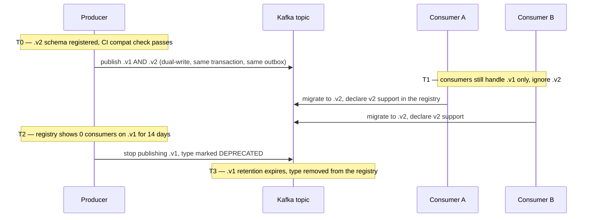
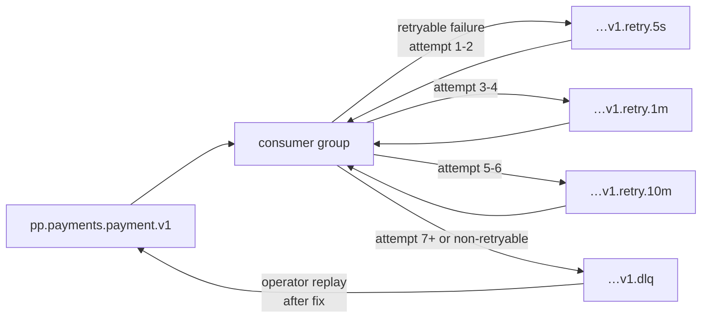

# Events

> Purpose: the binding contract for every event the platform publishes — envelope, versioning
> policy, payload schemas, topic configuration, ordering guarantees, the outbox, idempotent
> consumption, retry/DLQ topology and consumer operations. Derived from and subordinate to
> [`docs/spec/00-design-baseline.md`](./spec/00-design-baseline.md) §13; the event catalog, topic
> table, envelope fields and delivery semantics (A8) are the baseline's and are reproduced exactly.

---

## 1. Envelope

CloudEvents 1.0 structural compatibility plus required platform extensions (baseline §13.1). The
envelope is the **published language** across every bounded context; it is the one shape that must
never break.

### 1.1 Field specification

| Field | Type | Req. | Semantics |
|---|---|:---:|---|
| `specversion` | `string` | ✔ | Always `"1.0"`. Identifies the CloudEvents structural version, not our event version. |
| `id` | `string` | ✔ | `evt_` + ULID. Globally unique, time-ordered. **This is the deduplication key** for consumers (§7). Regenerated never — a redelivery carries the same `id`. |
| `type` | `string` | ✔ | `<aggregate>.<past-tense-verb>.v<major>`, e.g. `payment.authorized.v1`. The major version is **in the type name**, not a header, so a consumer subscribing to `.v1` can never be handed a `.v2` payload. |
| `source` | `string` (URI-ref) | ✔ | `/payments-platform/<deployable>` — the producing binary from baseline §5. Used for provenance in incidents, never for routing. |
| `subject` | `string` | ✔ | The business subject: the aggregate ID the event is *about*. Usually equals `aggregateid`; differs when an event about a child is published under its root (e.g. an attempt event carries `subject = att_…`, `aggregateid = pay_…`). |
| `time` | `string` (RFC 3339, ms, UTC, `Z`) | ✔ | When the fact **occurred** in the producer's transaction — not when it was published, and not when it was consumed. Derived from the domain, so a replayed event carries its original time. |
| `datacontenttype` | `string` | ✔ | Always `"application/json"`. |
| `dataschema` | `string` (URI) | ✔ | `https://schemas.example.com/events/<type>.json`. Resolvable, immutable per version, and the artifact the CI compatibility check runs against (§3.4). |
| `tenantid` | `string` | ✔ | `ten_` + ULID. Present on **every** event without exception (baseline §16.1). Consumers filter on it; Kafka ACLs and log views key off it. |
| `merchantid` | `string` | ○ | `mrc_` + ULID. Required for every merchant-scoped event; absent only on `gateway.health_changed.v1` (platform-scoped) and tenant-level audit records. |
| `correlationid` | `string` | ✔ | `req_` + ULID — the originating request. Constant across the entire causal fan-out, so one API call's full consequences are one query. |
| `causationid` | `string` | ○ | The `id` of the event or command that directly caused this one. Absent on events caused by an external API call (the `correlationid` covers that). Together the two form the causation graph. |
| `traceparent` | `string` | ✔ | W3C trace context, propagated from the producing request. Links the event to the trace that produced it. |
| `aggregateid` | `string` | ✔ | The aggregate **root** ID. |
| `aggregateversion` | `integer` | ✔ | The root's version *after* this change (I5). Monotonic per aggregate. Consumers use it to discard out-of-order and stale redeliveries (§5.3). |
| `partitionkey` | `string` | ✔ | The Kafka message key. Fixed per topic by the baseline §13.2 catalog. Duplicated into the envelope so a consumer reading from an archive (where the Kafka key is gone) retains the ordering domain. |
| `data` | `object` | ✔ | The type-specific payload (§4). Never `null`; an event with no payload carries `{}`. |

### 1.2 Envelope rules

| Rule | Statement |
|---|---|
| E1 | Events are **immutable**. There is no update, no correction and no delete. A wrong event is followed by a compensating event, never amended. |
| E2 | Events carry **facts, not commands**. `payment.captured.v1` says what happened; it does not tell anyone to do anything. A consumer that needs an instruction is missing an interface, not an event field. |
| E3 | No PAN, no CVV, no track data, no secrets, no bank account numbers, no principal PII in any payload. The `Secret[T]` wrapper serializes to `[REDACTED]` and the structured-logging allowlist (baseline §17.2) applies identically to event payloads. CI runs the PAN detector over every fixture in `api/events/`. |
| E4 | Payloads carry **IDs and enums, not embedded aggregates**. `payment.captured.v1` carries `merchantId`, not a merchant object — an embedded copy is stale the moment it is written and creates a second, unversioned schema for someone else's aggregate. |
| E5 | Money is always `{ "amount": <int64 minor units>, "currency": "<ISO 4217>" }` (baseline §7 rule 5). Never a decimal string, never a float, never a bare integer without its currency. |
| E6 | Timestamps are RFC 3339 with millisecond precision in UTC with a `Z` suffix. No local offsets, no epoch integers. |
| E7 | Enum values in payloads are drawn from the domain's own vocabulary (`docs/state-machines.md`), never from a gateway's. A gateway status string reaching an event payload is an ACL failure. |
| E8 | Envelope size ≤ 256 KiB. Larger payloads carry a `payloadRef` object-storage URI. In practice only `webhook.received.v1` approaches this. |

---

## 2. Example envelope

```json
{
  "specversion": "1.0",
  "id": "evt_01JB8Z9K2QW3E4R5T6Y7U8I9O0",
  "type": "payment.authorized.v1",
  "source": "/payments-platform/payment-orchestrator",
  "subject": "pay_01JB8Z9K2QW3E4R5T6Y7U8I9O0",
  "time": "2026-08-26T14:03:11.412Z",
  "datacontenttype": "application/json",
  "dataschema": "https://schemas.example.com/events/payment.authorized.v1.json",
  "tenantid": "ten_01JB8Z0000000000000000000",
  "merchantid": "mrc_01JB8Z1111111111111111111",
  "correlationid": "req_01JB8Z2222222222222222222",
  "causationid": "evt_01JB8Z3333333333333333333",
  "traceparent": "00-4bf92f3577b34da6a3ce929d0e0e4736-00f067aa0ba902b7-01",
  "aggregateid": "pay_01JB8Z9K2QW3E4R5T6Y7U8I9O0",
  "aggregateversion": 4,
  "partitionkey": "pay_01JB8Z9K2QW3E4R5T6Y7U8I9O0",
  "data": {
    "attemptId": "att_01JB8Z4444444444444444444",
    "gatewayCode": "stripe",
    "authorizedAmount": { "amount": 1050, "currency": "USD" },
    "gatewayReference": "pi_3Oq...",
    "authorizationExpiresAt": "2026-09-02T14:03:11.000Z",
    "threeDsStatus": "AUTHENTICATED",
    "captureMode": "MANUAL"
  }
}
```

---

## 3. Versioning and compatibility

### 3.1 The policy

| Rule | Statement |
|---|---|
| V1 | The major version lives **in the type name** (`.v1`). There is no minor version; there is no version header. |
| V2 | Within a major version, changes are **additive only**: new **optional** fields with a safe absent-semantics. Nothing else. |
| V3 | A breaking change is a **new type** (`.v2`) published **alongside** `.v1` on the same topic, until every consumer has migrated. The `.v1` producer is not removed on the day `.v2` ships. |
| V4 | Never removed within a major: a field, an enum value's meaning, a field's type, a field's optionality (optional→required is breaking), the partition key, or the semantics of an existing value. |
| V5 | Adding an **enum value** is breaking unless every consumer's handling of unknown values is specified. Our schemas therefore declare `"x-unknown-behaviour": "ignore" | "reject" | "route-to-dlq"` per enum, and consumers must implement the declared behaviour. Most are `route-to-dlq`: silently ignoring an unrecognised payment state is how money gets lost. |
| V6 | Consumers **must ignore unknown fields**. A strict-decode consumer turns V2 (which is safe by construction) into an outage. Enforced by contract tests that feed each consumer a payload with an injected unknown field. |

### 3.2 What counts as which

| Change | Classification | Action |
|---|---|---|
| Add optional `data.settlementCurrency` | Additive | Ship in `.v1`, bump the schema's `x-revision` |
| Add required `data.settlementCurrency` | **Breaking** | New `.v2` |
| Rename `data.gatewayRef` → `data.gatewayReference` | **Breaking** | New `.v2` (a rename is a delete plus an add) |
| Widen `data.amount` int32 → int64 | Additive for JSON, **breaking** for typed consumers | Treat as breaking; new `.v2` |
| Add `DISPUTE_REVERSED` to `data.reason` | **Breaking** unless `x-unknown-behaviour` is `ignore` | Usually new `.v2` |
| Tighten a field's validation (e.g. max length) | **Breaking** for producers of the old shape | New `.v2` |
| Change the partition key | **Breaking**, and worse than most — it silently destroys ordering | New topic, not just a new type |
| Add a new event **type** | Additive | New schema, registered, no consumer impact |

### 3.3 Consumer migration protocol



| Phase | Gate to leave it |
|---|---|
| **T0 — register** | `.v2` JSON Schema merged; CI compatibility check green; `.v2` documented in §4 of this file. |
| **T1 — dual publish** | Producer emits both from the **same transaction and the same outbox batch**, so a consumer can never see one without the other. Both carry the same `correlationid`; the `.v2` carries the `.v1`'s `id` as `causationid`. |
| **T2 — consumer migration** | Each consumer declares its supported versions in the schema registry on startup. The producer may not proceed until the registry reports **zero** consumer groups on `.v1` for **14 consecutive days** (longer than any consumer's maximum outage plus its replay window). |
| **T3 — retire** | `.v1` production stops; the type is marked `DEPRECATED` in the Go event registry (`internal/events/registry.go`) with a `sunset` date. There is no `api/events/catalog.yaml`; the registry and the JSON Schemas in `api/events/` are the two artifacts, reconciled by `scripts/check-events.sh`. <!-- doc-refs: allow-missing --> Retention expiry removes the last `.v1` records from the topic. |

Dual-publishing costs storage and doubles the outbox row count for the affected type. That is the
price of never coordinating a lockstep deploy across nine deployables owned by five teams.

### 3.4 Schema registry and the CI compatibility check

| Aspect | Decision |
|---|---|
| **Format** | JSON Schema 2020-12, one file per event type, in `api/events/<type>.json`. Not Avro: our payloads are read by humans in incidents, our topics are also archived to S3 as JSON, and the schema-evolution rules we need (§3.1) are policy rules that a registry's `BACKWARD` mode does not express (it would happily allow a semantic change). |
| **Registry** | The git repository is the source of truth; a Confluent-compatible registry is populated from it by CI, so the registry can never disagree with the code. Runtime lookups are by `dataschema` URI, cached. |
| **Producer check** | `TestEveryPublishedEventValidatesAgainstItsSchema` — every event a producer can emit is generated in a table test and validated. A producer that can emit an invalid event fails the build. |
| **Compatibility check** | `tests/contract/compat_test.go::TestPublishedSchemasAreBackwardCompatible` diffs each schema against the version on `main`, and `::TestCompatibilityCheckerDetectsEachBreakingChange` tests the checker itself against a corpus of deliberate breaks. There is no `scripts/check-event-compat.sh`. <!-- doc-refs: allow-missing --> Fails on: removed field, optional→required, type change, enum removal, enum addition where `x-unknown-behaviour` ≠ `ignore`, `partitionkey` change, `dataschema` URI reuse with different content. Passing requires either a purely additive diff or a new `.v<n+1>` file. |
| **Consumer check** | Every consumer ships a golden-fixture contract test per type it consumes, plus the unknown-field-injection test from V6. |
| **Catalog check** | `TestCatalogMatchesSchemas` — the baseline §13.2 catalog, the schema directory and §4 of this document must list exactly the same types. An event that exists in code but not in the catalog fails the build. |

---

## 4. Event catalog

Twenty-five types, exactly as baseline §13.2. Every payload table below specifies the `data`
object; the envelope (§1) is identical for all of them and is not repeated.

### 4.1 Merchant lifecycle — topic `pp.merchants.merchant.v1`, key `merchant_id`

#### `merchant.created.v1` — BC-2 · consumers: Onboarding, Audit, Analytics

| Field | Type | Req. | Description |
|---|---|:---:|---|
| `merchantId` | string(`mrc_`) | ✔ | The new merchant |
| `externalReference` | string | ○ | The tenant's own identifier, if supplied |
| `displayName` | string | ✔ | |
| `legalName` | string | ✔ | From the business profile |
| `incorporationCountry` | string(ISO-3166-1 α2) | ✔ | |
| `mcc` | string(4) | ✔ | Merchant category code |
| `residencyRegion` | string | ✔ | Determines where personal data may live (baseline §17.3) |
| `declaredMonthlyVolume` | Money | ✔ | Risk and gateway-selection input |
| `selectedGateways` | string[] | ○ | Gateway codes requested at signup |
| `createdBy` | string | ✔ | Actor ID |

```json
{ "merchantId": "mrc_01JB8Z1111111111111111111", "externalReference": "acme-eu-01",
  "displayName": "Acme GmbH", "legalName": "Acme Handels GmbH", "incorporationCountry": "DE",
  "mcc": "5812", "residencyRegion": "eu-central-1",
  "declaredMonthlyVolume": { "amount": 25000000, "currency": "EUR" },
  "selectedGateways": ["adyen", "stripe"], "createdBy": "cli_01JB8Z5555555555555555555" }
```

#### `merchant.validated.v1` — BC-3 · consumers: Onboarding, Audit

| Field | Type | Req. | Description |
|---|---|:---:|---|
| `merchantId` | string | ✔ | |
| `caseId` | string(`onb_`) | ✔ | The onboarding case |
| `rulesEvaluated` | integer | ✔ | Count of L2 rules run |
| `warnings` | Annotation[] | ○ | `{ruleId, severity, message}` for `WARNING`-severity outcomes |
| `validatedAt` | timestamp | ✔ | |

```json
{ "merchantId": "mrc_01JB8Z1111111111111111111", "caseId": "onb_01JB8Z6666666666666666666",
  "rulesEvaluated": 34,
  "warnings": [{ "ruleId": "L2.WEBSITE_NOT_REACHABLE", "severity": "WARNING",
                 "message": "https://acme.example returned 503" }],
  "validatedAt": "2026-08-26T09:12:04.221Z" }
```

#### `merchant.kyc_approved.v1` — BC-3 · consumers: Onboarding, Audit, Compliance

| Field | Type | Req. | Description |
|---|---|:---:|---|
| `merchantId` | string | ✔ | |
| `caseId` | string | ✔ | |
| `kycReference` | string | ✔ | **Vendor case reference only** — never the decision evidence, never PII |
| `provider` | string | ✔ | Vendor code |
| `decidedAt` | timestamp | ✔ | Vendor's decision time |
| `principalsVerified` | integer | ✔ | How many `MerchantPrincipal`s were verified |
| `ubosVerified` | integer | ✔ | Of those, how many were UBOs |
| `evidenceRef` | string(URI) | ✔ | Object-storage URI under Object Lock; **not** the evidence itself |
| `refreshDueAt` | timestamp | ○ | Per `CompliancePolicy.kycRefreshIntervalDays` |

```json
{ "merchantId": "mrc_01JB8Z1111111111111111111", "caseId": "onb_01JB8Z6666666666666666666",
  "kycReference": "kyc-8f21ba", "provider": "vendor-a", "decidedAt": "2026-08-27T11:40:02.000Z",
  "principalsVerified": 3, "ubosVerified": 2,
  "evidenceRef": "s3://pp-kyc-eu/ten_01JB8Z0.../mrc_01JB8Z1.../kyc-8f21ba.json",
  "refreshDueAt": "2027-08-27T00:00:00.000Z" }
```

#### `merchant.kyc_failed.v1` — BC-3 · consumers: Onboarding, Audit, Notification

| Field | Type | Req. | Description |
|---|---|:---:|---|
| `merchantId`, `caseId`, `kycReference`, `provider`, `decidedAt` | as above | ✔ | |
| `reasonCode` | enum | ✔ | `IDENTITY_UNVERIFIED`, `DOCUMENT_INVALID`, `SANCTIONS_HIT`, `PEP_REVIEW_REQUIRED`, `ADVERSE_MEDIA`, `INCOMPLETE` |
| `resubmissionAllowed` | boolean | ✔ | `false` for `SANCTIONS_HIT` — a sanctions hit is never resubmittable |
| `resubmissionCount` | integer | ✔ | |

```json
{ "merchantId": "mrc_01JB8Z1111111111111111111", "caseId": "onb_01JB8Z6666666666666666666",
  "kycReference": "kyc-8f21ba", "provider": "vendor-a", "decidedAt": "2026-08-27T11:40:02.000Z",
  "reasonCode": "DOCUMENT_INVALID", "resubmissionAllowed": true, "resubmissionCount": 1 }
```

#### `merchant.bank_validated.v1` — BC-3 · consumers: Onboarding, Audit

| Field | Type | Req. | Description |
|---|---|:---:|---|
| `merchantId`, `caseId` | string | ✔ | |
| `bankAccountId` | string | ✔ | |
| `maskedAccount` | string | ✔ | **Last 4 only.** Never the full account number (E3) |
| `country` | string(α2) | ✔ | |
| `currency` | string(ISO 4217) | ✔ | |
| `scheme` | enum | ✔ | `SEPA`, `ACH`, `FPS`, `SWIFT` |
| `nameMatch` | enum | ✔ | `EXACT`, `CLOSE`, `NONE` |
| `validatedAt` | timestamp | ✔ | |

```json
{ "merchantId": "mrc_01JB8Z1111111111111111111", "caseId": "onb_01JB8Z6666666666666666666",
  "bankAccountId": "ba_01JB8Z7777777777777777777", "maskedAccount": "****4471",
  "country": "DE", "currency": "EUR", "scheme": "SEPA", "nameMatch": "EXACT",
  "validatedAt": "2026-08-27T13:02:55.117Z" }
```

#### `merchant.gateway_provisioned.v1` — BC-4 · consumers: Onboarding, Config, Audit

| Field | Type | Req. | Description |
|---|---|:---:|---|
| `merchantId` | string | ✔ | |
| `connectionId` | string(`gwc_`) | ✔ | |
| `gatewayId` | string(`gw_`) | ✔ | |
| `gatewayCode` | string | ✔ | `stripe` \| `adyen` \| `paypal` |
| `environment` | enum | ✔ | `SANDBOX` \| `PRODUCTION` |
| `externalAccountRef` | string | ✔ | The gateway's sub-account identifier |
| `webhookRegistered` | boolean | ✔ | |
| `credentialsStored` | boolean | ✔ | **Never the credentials** — only that a reference exists (E3) |
| `capabilities` | object | ✔ | `{currencies[], paymentMethods[], countries[], supports3DS, supportsPartialCapture}` — the resolved intersection of gateway and merchant |
| `provisionedAt` | timestamp | ✔ | |

```json
{ "merchantId": "mrc_01JB8Z1111111111111111111", "connectionId": "gwc_01JB8Z8888888888888888888",
  "gatewayId": "gw_01JB8Z9999999999999999999", "gatewayCode": "adyen", "environment": "PRODUCTION",
  "externalAccountRef": "AcmeGmbH_ECOM", "webhookRegistered": true, "credentialsStored": true,
  "capabilities": { "currencies": ["EUR","USD"], "paymentMethods": ["CARD","IDEAL"],
                    "countries": ["DE","NL"], "supports3DS": true, "supportsPartialCapture": true },
  "provisionedAt": "2026-08-27T14:21:09.882Z" }
```

#### `merchant.certified.v1` — BC-3 · consumers: Onboarding, Audit

| Field | Type | Req. | Description |
|---|---|:---:|---|
| `merchantId` | string | ✔ | |
| `reportId` | string | ✔ | |
| `environment` | enum | ✔ | |
| `suiteVersion` | string | ✔ | |
| `matrix` | object[] | ✔ | `{gatewayCode, paymentMethod, currency, passed}` per cell |
| `assertionsPassed` / `assertionsTotal` | integer | ✔ | `passed = total` is required for `PASSED` (A11) |
| `artifactUri` | string(URI) | ✔ | Signed, immutable report in object storage |
| `artifactSha256` | string(64 hex) | ✔ | |
| `certifiedAt` | timestamp | ✔ | |

```json
{ "merchantId": "mrc_01JB8Z1111111111111111111", "reportId": "rpt_01JB8ZAAAAAAAAAAAAAAAAAAA",
  "environment": "PRODUCTION", "suiteVersion": "cert-suite@2.4.0",
  "matrix": [{ "gatewayCode": "adyen", "paymentMethod": "CARD", "currency": "EUR", "passed": true },
             { "gatewayCode": "adyen", "paymentMethod": "IDEAL", "currency": "EUR", "passed": true }],
  "assertionsPassed": 14, "assertionsTotal": 14,
  "artifactUri": "s3://pp-cert-eu/ten_01JB8Z0.../rpt_01JB8ZA....json",
  "artifactSha256": "9f2c…e41b", "certifiedAt": "2026-08-27T18:44:31.004Z" }
```

#### `merchant.activated.v1` — BC-2 · consumers: Data plane cache, Audit, Notification

| Field | Type | Req. | Description |
|---|---|:---:|---|
| `merchantId` | string | ✔ | |
| `previousState` | enum | ✔ | `PRODUCTION_READY` or `SUSPENDED` (resume) |
| `certifiedConnections` | object[] | ✔ | `{connectionId, gatewayCode, environment}` — what the data plane may route to |
| `configurationVersion` | integer | ✔ | The active config version at activation |
| `supportedCurrencies` | string[] | ✔ | Warm-cache payload so the data plane can serve immediately |
| `supportedPaymentMethods` | string[] | ✔ | |
| `activatedAt` | timestamp | ✔ | |
| `activatedBy` | string | ✔ | |

```json
{ "merchantId": "mrc_01JB8Z1111111111111111111", "previousState": "PRODUCTION_READY",
  "certifiedConnections": [{ "connectionId": "gwc_01JB8Z8888888888888888888",
                             "gatewayCode": "adyen", "environment": "PRODUCTION" }],
  "configurationVersion": 7, "supportedCurrencies": ["EUR","USD"],
  "supportedPaymentMethods": ["CARD","IDEAL"], "activatedAt": "2026-08-27T19:00:00.512Z",
  "activatedBy": "usr_ops_2291" }
```

#### `merchant.suspended.v1` — BC-2 · consumers: Data plane cache (**priority invalidation**), Audit

| Field | Type | Req. | Description |
|---|---|:---:|---|
| `merchantId` | string | ✔ | |
| `reasonCode` | enum | ✔ | `RISK_BREACH`, `COMPLIANCE_EXPIRY`, `GATEWAY_DEPROVISIONED`, `OPERATOR_ACTION`, `TENANT_SUSPENDED` |
| `reasonDetail` | string | ○ | |
| `suspendedBy` | string | ✔ | Actor — a human ID or `system:<component>` |
| `effectiveAt` | timestamp | ✔ | |
| `permitsRefunds` | boolean | ✔ | Always `true` — suspension rejects **new payments** but permits refunds, voids and webhook processing (baseline §8). Explicit in the payload so no consumer has to remember it. |

```json
{ "merchantId": "mrc_01JB8Z1111111111111111111", "reasonCode": "COMPLIANCE_EXPIRY",
  "reasonDetail": "Attestation expired 2026-08-26", "suspendedBy": "system:compliance-sweeper",
  "effectiveAt": "2026-08-27T00:00:00.000Z", "permitsRefunds": true }
```

#### `merchant.terminated.v1` — BC-2 · consumers: All

| Field | Type | Req. | Description |
|---|---|:---:|---|
| `merchantId` | string | ✔ | |
| `previousState` | enum | ✔ | |
| `reasonCode` | enum | ✔ | `MERCHANT_REQUEST`, `TENANT_REQUEST`, `COMPLIANCE`, `FRAUD`, `ONBOARDING_ABANDONED` |
| `openPaymentCount` | integer | ✔ | **Always 0** — the guard requires it; carried so consumers can assert it |
| `connectionsRevoked` | integer | ✔ | |
| `dataRetentionUntil` | timestamp | ✔ | Financial records retained under the legal-obligation basis (baseline §17.3) |
| `terminatedAt` | timestamp | ✔ | |

```json
{ "merchantId": "mrc_01JB8Z1111111111111111111", "previousState": "SUSPENDED",
  "reasonCode": "MERCHANT_REQUEST", "openPaymentCount": 0, "connectionsRevoked": 2,
  "dataRetentionUntil": "2033-08-27T00:00:00.000Z", "terminatedAt": "2026-08-28T10:15:00.000Z" }
```

### 4.2 Configuration — topic `pp.config.configuration.v1`, key `merchant_id`, **compacted**

#### `configuration.published.v1` — BC-5 · consumers: Data plane cache, Audit

| Field | Type | Req. | Description |
|---|---|:---:|---|
| `merchantId` | string | ✔ | |
| `configurationId` | string | ✔ | |
| `configurationVersionId` | string(`cfv_`) | ✔ | |
| `version` | integer | ✔ | Dense, monotonic per merchant |
| `previousVersion` | integer | ○ | Absent on version 1 |
| `environment` | enum | ✔ | |
| `document` | object | ✔ | The **complete** baseline §23 configuration document — not a diff. Compaction requires a full snapshot per key, and a consumer restoring from a compacted topic must get a usable state from one record. |
| `documentChecksum` | string(64 hex) | ✔ | `sha256(jcs(document))`; a mismatch is config corruption and the consumer must reject, not apply |
| `publishedBy` | string | ✔ | |
| `publishedAt` | timestamp | ✔ | |

```json
{ "merchantId": "mrc_01JB8Z1111111111111111111", "configurationId": "cfg_01JB8ZBBBBBBBBBBBBBBBBBBB",
  "configurationVersionId": "cfv_01JB8ZCCCCCCCCCCCCCCCCCCC", "version": 7, "previousVersion": 6,
  "environment": "production",
  "document": { "merchantId": "mrc_01JB8Z1111111111111111111", "version": 7, "status": "ACTIVE",
    "environment": "production", "supportedCurrencies": ["EUR","USD"],
    "paymentMethods": ["CARD","IDEAL"], "countries": ["DE","NL"],
    "routing": { "strategy": "PRIORITY_WITH_FALLBACK", "primary": "adyen", "fallback": ["stripe"],
      "rules": [], "weights": { "health": 0.4, "successRate": 0.3, "cost": 0.2, "latency": 0.1 } },
    "risk": { "maxTransactionAmount": { "amount": 1000000, "currency": "EUR" },
      "require3DSAbove": { "amount": 50000, "currency": "EUR" },
      "dailyVolumeLimit": { "amount": 50000000, "currency": "EUR" },
      "velocity": { "maxPaymentsPerMinute": 300, "maxPerCardPerHour": 5 },
      "blockedCountries": ["KP","IR"] },
    "limits": { "maxRefundWindowDays": 180, "maxPartialCaptures": 5 },
    "settlement": { "schedule": "DAILY", "currency": "EUR", "holdDays": 2 },
    "featureFlags": { "networkTokens": true, "partialCapture": true } },
  "documentChecksum": "7c1a…9de0", "publishedBy": "cli_01JB8Z5555555555555555555",
  "publishedAt": "2026-08-27T18:59:12.006Z" }
```

#### `configuration.rolled_back.v1` — BC-5 · consumers: Data plane cache, Audit

| Field | Type | Req. | Description |
|---|---|:---:|---|
| `merchantId`, `configurationId`, `configurationVersionId` | string | ✔ | |
| `version` | integer | ✔ | The **new** version number — a rollback is an append (baseline §23) |
| `rolledBackFrom` | integer | ✔ | The version being abandoned |
| `restoredFrom` | integer | ✔ | The version whose document was re-published |
| `document` | object | ✔ | Full document, as above |
| `documentChecksum` | string | ✔ | |
| `reason` | string | ✔ | |
| `rolledBackBy`, `rolledBackAt` | string, timestamp | ✔ | |

```json
{ "merchantId": "mrc_01JB8Z1111111111111111111", "configurationId": "cfg_01JB8ZBBBBBBBBBBBBBBBBBBB",
  "configurationVersionId": "cfv_01JB8ZDDDDDDDDDDDDDDDDDDD", "version": 8, "rolledBackFrom": 7,
  "restoredFrom": 6, "document": { "…": "full v6 document republished as v8" },
  "documentChecksum": "b4e0…1122", "reason": "Routing weights caused authorization-rate regression",
  "rolledBackBy": "usr_ops_2291", "rolledBackAt": "2026-08-27T21:04:00.190Z" }
```

### 4.3 Payments — topic `pp.payments.payment.v1`, key `payment_id`

#### `payment.created.v1` — BC-6 · consumers: Ledger, Analytics, Audit

| Field | Type | Req. | Description |
|---|---|:---:|---|
| `paymentId` | string(`pay_`) | ✔ | |
| `amount` | Money | ✔ | Immutable (I4) |
| `paymentMethod` | enum | ✔ | Domain vocabulary, not a gateway's |
| `captureMode` | enum | ✔ | `AUTOMATIC` \| `MANUAL` |
| `riskDecision` | enum | ✔ | `ALLOW` \| `REQUIRE_3DS` \| `DECLINE` |
| `riskScore` | integer | ○ | 0–100; absent when the external scorer was unavailable and the policy default applied |
| `routingPlanId` | string(`rpl_`) | ○ | Absent when routing produced no candidates |
| `candidateGateways` | string[] | ○ | Ordered gateway codes |
| `idempotencyKeyHash` | string(64 hex) | ✔ | **Hash, never the key** — the key is client-opaque and may embed their identifiers |
| `metadataKeys` | string[] | ○ | Key names only; merchant metadata values are not republished |
| `createdAt` | timestamp | ✔ | |

```json
{ "paymentId": "pay_01JB8Z9K2QW3E4R5T6Y7U8I9O0", "amount": { "amount": 1050, "currency": "USD" },
  "paymentMethod": "CARD", "captureMode": "MANUAL", "riskDecision": "ALLOW", "riskScore": 12,
  "routingPlanId": "rpl_01JB8ZEEEEEEEEEEEEEEEEEEE", "candidateGateways": ["stripe","adyen"],
  "idempotencyKeyHash": "3a7f…c001", "metadataKeys": ["orderId"],
  "createdAt": "2026-08-26T14:03:10.980Z" }
```

#### `payment.attempted.v1` — BC-6 · consumers: Analytics, Routing feedback

| Field | Type | Req. | Description |
|---|---|:---:|---|
| `paymentId`, `attemptId` | string | ✔ | `subject` is the `attemptId`; `aggregateid` the `paymentId` |
| `attemptNumber` | integer | ✔ | Dense from 1 |
| `gatewayId`, `gatewayCode`, `connectionId` | string | ✔ | |
| `operation` | enum | ✔ | `AUTHORIZE`, `CAPTURE`, `REFUND`, `VOID` |
| `state` | enum | ✔ | `DISPATCHED` \| `COMPLETED` |
| `outcome` | enum | ○ | `SUCCESS`, `DECLINED`, `ERROR`, `TIMEOUT_UNKNOWN`; absent while `DISPATCHED` |
| `declineReasonCode` | string | ○ | Normalized, never the gateway's raw string |
| `declineIsRetryable` | boolean | ○ | Required when `outcome = DECLINED`. **The routing feedback loop keys on this** |
| `normalizedErrorCode` | string | ○ | From the baseline §20.2 catalog |
| `latencyMs` | integer | ○ | |
| `routingReasons` | string[] | ○ | Why this gateway was chosen (`PRIMARY_BY_POLICY`, `COST_PREFERRED`, …) |
| `configSnapshotAgeMs` | integer | ✔ | How stale the config was when the decision was made — the field that makes a staleness incident diagnosable |
| `attemptedAt` | timestamp | ✔ | |

```json
{ "paymentId": "pay_01JB8Z9K2QW3E4R5T6Y7U8I9O0", "attemptId": "att_01JB8Z4444444444444444444",
  "attemptNumber": 1, "gatewayId": "gw_01JB8Z9999999999999999999", "gatewayCode": "stripe",
  "connectionId": "gwc_01JB8Z8888888888888888888", "operation": "AUTHORIZE", "state": "COMPLETED",
  "outcome": "SUCCESS", "latencyMs": 412, "routingReasons": ["PRIMARY_BY_POLICY"],
  "configSnapshotAgeMs": 4180, "attemptedAt": "2026-08-26T14:03:11.001Z" }
```

#### `payment.authorized.v1` — BC-6 · consumers: Ledger, Notification, Analytics

| Field | Type | Req. | Description |
|---|---|:---:|---|
| `attemptId` | string | ✔ | The attempt that holds the I3 success slot |
| `gatewayCode` | string | ✔ | |
| `authorizedAmount` | Money | ✔ | May be less than `amount` for partial authorization |
| `gatewayReference` | string | ✔ | The gateway's transaction ID — needed for capture, void and reconciliation |
| `authorizationExpiresAt` | timestamp | ✔ | Drives the auth-expiry sweeper |
| `threeDsStatus` | enum | ○ | `AUTHENTICATED`, `ATTEMPTED`, `EXEMPT_TRA`, `EXEMPT_LOW_VALUE`, `EXEMPT_MIT`, `NOT_APPLICABLE` |
| `captureMode` | enum | ✔ | |
| `networkTransactionId` | string | ○ | Scheme reference, for MIT chains |

```json
{ "attemptId": "att_01JB8Z4444444444444444444", "gatewayCode": "stripe",
  "authorizedAmount": { "amount": 1050, "currency": "USD" }, "gatewayReference": "pi_3Oq…",
  "authorizationExpiresAt": "2026-09-02T14:03:11.000Z", "threeDsStatus": "EXEMPT_LOW_VALUE",
  "captureMode": "MANUAL", "networkTransactionId": "MCC0826114031" }
```

#### `payment.captured.v1` — BC-6 · consumers: Ledger, Notification, Analytics

| Field | Type | Req. | Description |
|---|---|:---:|---|
| `attemptId`, `gatewayCode`, `gatewayReference` | string | ✔ | |
| `capturedAmount` | Money | ✔ | This capture |
| `capturedTotal` | Money | ✔ | Cumulative — the ledger posts on the delta but reconciles on the total |
| `authorizedAmount` | Money | ✔ | I2 evidence: `capturedTotal ≤ authorizedAmount` |
| `captureNumber` | integer | ✔ | ≤ `limits.maxPartialCaptures` |
| `isFinalCapture` | boolean | ✔ | |
| `capturedAt` | timestamp | ✔ | |

```json
{ "attemptId": "att_01JB8Z4444444444444444444", "gatewayCode": "stripe",
  "gatewayReference": "pi_3Oq…", "capturedAmount": { "amount": 600, "currency": "USD" },
  "capturedTotal": { "amount": 600, "currency": "USD" },
  "authorizedAmount": { "amount": 1050, "currency": "USD" }, "captureNumber": 1,
  "isFinalCapture": false, "capturedAt": "2026-08-26T15:20:44.771Z" }
```

#### `payment.failed.v1` — BC-6 · consumers: Ledger, Notification, Routing feedback

| Field | Type | Req. | Description |
|---|---|:---:|---|
| `attemptId` | string | ○ | Absent for pre-flight rejections (no attempt was created) |
| `gatewayCode` | string | ○ | Same |
| `failureStage` | enum | ✔ | `VALIDATION`, `RISK`, `ROUTING`, `GATEWAY`, `RESPONSE_VALIDATION`, `STATE`, `EXPIRY`, `CANCELED` |
| `errorCode` | string | ✔ | From the baseline §20.2 catalog |
| `declineReasonCode` | string | ○ | Normalized |
| `declineIsRetryable` | boolean | ○ | |
| `attemptsMade` | integer | ✔ | How many gateways were tried before giving up |
| `gatewaysTried` | string[] | ○ | |
| `terminal` | boolean | ✔ | Always `true` — `FAILED` is terminal (§3.2 of `state-machines.md`). Present so a consumer never has to infer it |
| `failedAt` | timestamp | ✔ | |

```json
{ "attemptId": "att_01JB8ZFFFFFFFFFFFFFFFFFFF", "gatewayCode": "adyen", "failureStage": "GATEWAY",
  "errorCode": "GATEWAY_DECLINED", "declineReasonCode": "INSUFFICIENT_FUNDS",
  "declineIsRetryable": false, "attemptsMade": 2, "gatewaysTried": ["stripe","adyen"],
  "terminal": true, "failedAt": "2026-08-26T14:03:19.334Z" }
```

#### `payment.voided.v1` — BC-6 · consumers: Ledger, Notification

| Field | Type | Req. | Description |
|---|---|:---:|---|
| `attemptId`, `gatewayCode`, `gatewayReference` | string | ✔ | |
| `voidedAmount` | Money | ✔ | Equals `authorizedAmount`; a partial void is not an operation we offer |
| `reason` | enum | ✔ | `MERCHANT_REQUEST`, `AUTH_EXPIRY_PREVENTION`, `RISK_REVERSAL`, `ONBOARDING_TEST` |
| `voidedAt` | timestamp | ✔ | |

```json
{ "attemptId": "att_01JB8Z4444444444444444444", "gatewayCode": "stripe",
  "gatewayReference": "pi_3Oq…", "voidedAmount": { "amount": 1050, "currency": "USD" },
  "reason": "MERCHANT_REQUEST", "voidedAt": "2026-08-26T16:02:00.412Z" }
```

#### `payment.refunded.v1` — BC-6 · consumers: Ledger, Notification

| Field | Type | Req. | Description |
|---|---|:---:|---|
| `refundId` | string(`ref_`) | ✔ | |
| `attemptId`, `gatewayCode`, `gatewayReference` | string | ✔ | |
| `refundedAmount` | Money | ✔ | This refund |
| `refundedTotal` | Money | ✔ | Cumulative — **I1** evidence |
| `capturedTotal` | Money | ✔ | I1 evidence: `refundedTotal ≤ capturedTotal` |
| `isFullRefund` | boolean | ✔ | Distinguishes `PARTIALLY_REFUNDED` from `REFUNDED` without the consumer recomputing |
| `reason` | enum | ✔ | `DUPLICATE`, `FRAUDULENT`, `REQUESTED_BY_CUSTOMER`, `OTHER` |
| `requestedBy` | string | ✔ | |
| `refundedAt` | timestamp | ✔ | |

```json
{ "refundId": "ref_01JB8ZGGGGGGGGGGGGGGGGGGG", "attemptId": "att_01JB8Z4444444444444444444",
  "gatewayCode": "stripe", "gatewayReference": "re_3Oq…",
  "refundedAmount": { "amount": 300, "currency": "USD" },
  "refundedTotal": { "amount": 300, "currency": "USD" },
  "capturedTotal": { "amount": 600, "currency": "USD" }, "isFullRefund": false,
  "reason": "REQUESTED_BY_CUSTOMER", "requestedBy": "cli_01JB8Z5555555555555555555",
  "refundedAt": "2026-08-28T09:31:02.884Z" }
```

#### `payment.settled.v1` — **BC-8** · consumers: Ledger, Reconciliation

| Field | Type | Req. | Description |
|---|---|:---:|---|
| `settlementId` | string | ✔ | The gateway's settlement batch reference |
| `gatewayCode` | string | ✔ | |
| `grossAmount` | Money | ✔ | |
| `feeAmount` | Money | ✔ | Gateway fee as **reported** — we do not compute settlement (A12) |
| `netAmount` | Money | ✔ | `gross − fee`, as reported; a mismatch opens a reconciliation exception rather than being silently corrected |
| `settlementCurrency` | string | ✔ | May differ from the payment currency |
| `fxRate` | string(decimal) | ○ | Present only on cross-currency settlement. A **decimal string**, not a float — it is a rate, not money, and precision matters |
| `settlementDate` | date | ✔ | |
| `reportUri` | string(URI) | ✔ | The ingested gateway report |
| `observedAt` | timestamp | ✔ | When *we* observed it, distinct from `settlementDate` |

```json
{ "settlementId": "po_1Oq7xL2eZvKY", "gatewayCode": "stripe",
  "grossAmount": { "amount": 600, "currency": "USD" },
  "feeAmount": { "amount": 27, "currency": "USD" },
  "netAmount": { "amount": 573, "currency": "USD" }, "settlementCurrency": "USD",
  "settlementDate": "2026-08-29", "reportUri": "s3://pp-settlement/stripe/2026-08-29/po_1Oq7xL.csv",
  "observedAt": "2026-08-29T06:12:44.000Z" }
```

#### `payment.disputed.v1` — **BC-8** · consumers: Ledger, Risk, Notification

| Field | Type | Req. | Description |
|---|---|:---:|---|
| `disputeId` | string | ✔ | Gateway's dispute reference |
| `gatewayCode` | string | ✔ | |
| `disputedAmount` | Money | ✔ | |
| `reasonCode` | string | ✔ | Normalized: `FRAUDULENT`, `PRODUCT_NOT_RECEIVED`, `DUPLICATE_PROCESSING`, `CREDIT_NOT_PROCESSED`, `SUBSCRIPTION_CANCELED`, `OTHER` |
| `stage` | enum | ✔ | `INQUIRY`, `CHARGEBACK`, `PRE_ARBITRATION`, `ARBITRATION` |
| `outcome` | enum | ○ | `WON`, `LOST`, `ACCEPTED`; absent while open |
| `evidenceDueBy` | timestamp | ○ | |
| `openedAt` | timestamp | ✔ | |

```json
{ "disputeId": "dp_1Oq8yM3fAwLZ", "gatewayCode": "stripe",
  "disputedAmount": { "amount": 600, "currency": "USD" }, "reasonCode": "FRAUDULENT",
  "stage": "CHARGEBACK", "evidenceDueBy": "2026-09-12T23:59:59.000Z",
  "openedAt": "2026-08-30T08:00:00.000Z" }
```

#### `payment.reconciliation_required.v1` — BC-6 · consumers: Reconciler (**alerting**)

| Field | Type | Req. | Description |
|---|---|:---:|---|
| `attemptId` | string | ✔ | The `TIMEOUT_UNKNOWN` attempt |
| `gatewayCode` | string | ✔ | |
| `gatewayIdempotencyKey` | string | ✔ | **The key the reconciler looks the transaction up by** — deterministic in `attemptId` (baseline §14.4), which is why it survives a crash |
| `reason` | enum | ✔ | `TIMEOUT_UNKNOWN`, `AMBIGUOUS_TRANSPORT_ERROR`, `RESPONSE_VALIDATION_FAILED`, `WEBHOOK_STATE_CONFLICT`, `SETTLEMENT_MISMATCH` |
| `paymentState` | enum | ✔ | The state the payment is parked in (`PROCESSING` or `PENDING`) |
| `amountAtRisk` | Money | ✔ | Drives alert severity |
| `requestSentAt` | timestamp | ✔ | |
| `resolveBy` | timestamp | ✔ | SLO deadline; breaching it opens a `CRITICAL` reconciliation exception |

```json
{ "attemptId": "att_01JB8ZHHHHHHHHHHHHHHHHHHH", "gatewayCode": "adyen",
  "gatewayIdempotencyKey": "K7QF2R9X4M1CDVB8YTNA3EWJ5HZP6LSU",
  "reason": "TIMEOUT_UNKNOWN", "paymentState": "PROCESSING",
  "amountAtRisk": { "amount": 1050, "currency": "USD" },
  "requestSentAt": "2026-08-26T14:03:11.001Z", "resolveBy": "2026-08-27T14:03:11.001Z" }
```

### 4.4 Webhooks — topic `pp.webhooks.inbound.v1`, key `gateway_ref`

#### `webhook.received.v1` — BC-7 · consumers: Webhook processor

| Field | Type | Req. | Description |
|---|---|:---:|---|
| `webhookId` | string(`whk_`) | ✔ | |
| `gatewayCode` | string | ✔ | |
| `gatewayRef` | string | ✔ | The gateway's event ID — the dedup key **and** the partition key |
| `gatewayEventType` | string | ✔ | The gateway's own type string. **This is the one place a foreign vocabulary is legal**, because the ACL has not run yet |
| `signatureValid` | boolean | ✔ | Always `true` — invalid signatures are rejected at ingress and never published |
| `signatureScheme` | enum | ✔ | `HMAC_SHA256`, `ED25519`, `JWS` |
| `bodySha256` | string(64 hex) | ✔ | Lets the processor re-verify against the stored body |
| `bodySize` | integer | ✔ | |
| `payloadRef` | string(URI) | ○ | Present when the body exceeds the 256 KiB envelope cap (E8) |
| `body` | object | ○ | The parsed body, when under the cap. **Redacted** through the same allowlist as logs |
| `receivedAt` | timestamp | ✔ | |

```json
{ "webhookId": "whk_01JB8ZJJJJJJJJJJJJJJJJJJJ", "gatewayCode": "stripe",
  "gatewayRef": "evt_1Oq9zN4gBxMa", "gatewayEventType": "payment_intent.succeeded",
  "signatureValid": true, "signatureScheme": "HMAC_SHA256", "bodySha256": "e10a…77cd",
  "bodySize": 2841,
  "body": { "id": "evt_1Oq9zN4gBxMa", "type": "payment_intent.succeeded",
            "data": { "object": { "id": "pi_3Oq…", "amount": 1050, "currency": "usd",
                                  "status": "succeeded" } } },
  "receivedAt": "2026-08-26T14:03:12.880Z" }
```

### 4.5 Gateway health — topic `pp.gateways.health.v1`, key `gateway_id`, **compacted**

#### `gateway.health_changed.v1` — BC-4 · consumers: Routing, Control plane, Alerting

| Field | Type | Req. | Description |
|---|---|:---:|---|
| `gatewayId`, `gatewayCode` | string | ✔ | |
| `operation` | enum | ✔ | `AUTHORIZE`, `CAPTURE`, `REFUND`, `VOID`, `LOOKUP`, `PROVISION` — health is per `(gateway, operation)` (baseline §10) |
| `previousState`, `state` | enum | ✔ | `HEALTHY`, `DEGRADED`, `UNHEALTHY`, `PROBING` |
| `circuitState` | enum | ✔ | `CLOSED`, `OPEN`, `HALF_OPEN` |
| `errorRate` | number (0–1) | ✔ | Over the evaluation window |
| `p99LatencyMs` | integer | ✔ | |
| `sampleCount` | integer | ✔ | Below 20 the transition to `DEGRADED` is not taken; carried so consumers can judge confidence |
| `windowSeconds` | integer | ✔ | 30 |
| `cooldownSeconds` | integer | ○ | Present in `UNHEALTHY`; doubles per failed probe, capped at 300 |
| `region` | string | ✔ | Health is measured per region; a consumer in another region must not act on it |
| `changedAt` | timestamp | ✔ | |

**No `merchantid`** — this event is platform-scoped. `tenantid` is set to the platform tenant.

```json
{ "gatewayId": "gw_01JB8Z9999999999999999999", "gatewayCode": "stripe", "operation": "AUTHORIZE",
  "previousState": "HEALTHY", "state": "DEGRADED", "circuitState": "CLOSED", "errorRate": 0.071,
  "p99LatencyMs": 1840, "sampleCount": 412, "windowSeconds": 30, "region": "eu-central-1",
  "changedAt": "2026-08-26T14:05:00.000Z" }
```

### 4.6 Audit — topic `pp.audit.v1`, key `tenant_id`

#### `audit.recorded.v1` — BC-9 · consumers: Audit sink, SIEM

| Field | Type | Req. | Description |
|---|---|:---:|---|
| `auditId` | string(`aud_`) | ✔ | |
| `actorType` | enum | ✔ | `USER`, `API_CLIENT`, `SYSTEM`, `WORKFLOW` |
| `actorId` | string | ✔ | |
| `action` | string | ✔ | `<resource>.<verb>`, e.g. `merchant.transition_status` |
| `resourceType`, `resourceId` | string | ✔ | |
| `outcome` | enum | ✔ | `SUCCESS`, `FAILURE` |
| `diff` | object | ○ | `{field: {before, after}}`, secrets `[REDACTED]`, PII omitted (E3) |
| `sourceIp` | string | ○ | Omitted for `SYSTEM`/`WORKFLOW` actors |
| `userAgent` | string | ○ | |
| `prevHash`, `entryHash` | string(64 hex) | ✔ | The tamper-evidence chain link; a SIEM can verify the chain without database access |
| `recordedAt` | timestamp | ✔ | |

```json
{ "auditId": "aud_01JB8ZKKKKKKKKKKKKKKKKKKK", "actorType": "USER", "actorId": "usr_ops_2291",
  "action": "merchant.transition_status", "resourceType": "merchant",
  "resourceId": "mrc_01JB8Z1111111111111111111", "outcome": "SUCCESS",
  "diff": { "status": { "before": "PRODUCTION_READY", "after": "ACTIVE" } },
  "sourceIp": "203.0.113.24", "userAgent": "pp-console/4.2.1",
  "prevHash": "a1b2…ff00", "entryHash": "c3d4…1199", "recordedAt": "2026-08-27T19:00:00.512Z" }
```

---

## 5. Topics

### 5.1 Naming

`pp.<context>.<aggregate>.v<major>`, with `.retry.<tier>` and `.dlq` siblings (baseline §13.3).
The major version in the topic name is the **envelope**'s major, not the event type's — event types
version independently within a topic (§3), which is what makes dual-publishing possible without a
new topic.

### 5.2 Configuration

| Topic | Partitions | Retention | Cleanup | Key | RF | `min.insync.replicas` | `acks` |
|---|---:|---|---|---|---:|---:|---|
| `pp.merchants.merchant.v1` | 12 | 30 d | delete | `merchant_id` | 3 | 2 | `all` |
| `pp.config.configuration.v1` | 12 | 7 d + compact | compact | `merchant_id` | 3 | 2 | `all` |
| `pp.payments.payment.v1` | 48 | 30 d | delete | `payment_id` | 3 | 2 | `all` |
| `pp.gateways.health.v1` | 6 | 1 d + compact | compact | `gateway_id` | 3 | 2 | `all` |
| `pp.webhooks.inbound.v1` | 24 | 7 d | delete | `gateway_ref` | 3 | 2 | `all` |
| `pp.audit.v1` | 12 | 400 d → S3 | delete | `tenant_id` | 3 | 3 | `all` |
| `*.retry.<tier>` | same as parent | 7 d | delete | same as parent | 3 | 2 | `all` |
| `*.dlq` | same as parent | 30 d | delete | same as parent | 3 | 2 | `all` |

### 5.3 The reasoning behind each number

| Setting | Value | Reasoning |
|---|---|---|
| **`pp.payments` partitions** | 48 | Sized from throughput, not from broker count. 5 000 TPS sustained / 15 000 peak (baseline §18), ~4 events per payment ⇒ ~60 000 events/s peak. A consumer instance comfortably handles ~2 000 events/s with a database write per event, so ~30 instances are needed at peak; 48 gives headroom to 48 instances and divides evenly by 2, 3, 4, 6, 8, 12, 16 and 24 for clean consumer-group sizing. **Partitions can be increased but never decreased, and increasing them re-hashes keys and breaks per-key ordering across the change** — so this number is chosen for the 3-year horizon, not for today. |
| **`pp.merchants` / `pp.config` partitions** | 12 | 50 000 merchants across 500 tenants, changing rarely. Twelve is about ordering domains and consumer parallelism, not volume. |
| **`pp.webhooks` partitions** | 24 | Volume is spiky and roughly tracks payments, but each record is larger and processing is heavier per record. Half of payments' partition count with the same headroom logic. |
| **`pp.gateways.health` partitions** | 6 | A handful of gateways × six operations. More partitions would spread a tiny keyspace thinly and slow compaction for no benefit. |
| **`pp.audit` partitions** | 12 | Keyed by `tenant_id`, so 500 tenants map onto 12 partitions. Skew from a large tenant is acceptable because audit is not latency-critical. |
| **`pp.payments` retention** | 30 d | Long enough for the longest realistic consumer outage plus a full replay window; short enough that the topic is not a system of record. **Postgres is the system of record** — the topic is a transport. 7-year retention lives in Postgres and S3 (`04-domain-model.md` §8.4), not in Kafka. |
| **`pp.config` cleanup** | compact | A consumer that has lost its cache must be able to rebuild the *current* configuration for every merchant by reading the topic from the beginning. Compaction guarantees the last record per `merchant_id` survives forever, which is exactly the fail-static requirement (baseline §15). The 7-day delete retention on top bounds how much *history* is kept while compaction preserves the head. This is why `configuration.published.v1` carries the **full document**, not a diff (§4.2). |
| **`pp.gateways.health` cleanup** | compact, 1 d | Only the current state matters; a health event from yesterday is noise. Compaction gives a restarting router the current state of every gateway in one read. |
| **`pp.audit` retention** | 400 d → S3 | The 7-year WORM requirement (baseline §17.3) is met by S3 Object Lock; Kafka holds 400 days so a SIEM outage of up to a year is survivable without an S3 restore. |
| **`.dlq` retention** | 30 d | A poison message must survive long enough to be triaged during a holiday period, and DLQ contents are also archived. |
| **Replication factor** | 3 | Across 3 AZs. Survives one broker loss with no availability impact and two with read availability. RF 2 cannot tolerate a broker loss during a rolling restart, which is a routine operation. |
| **`min.insync.replicas`** | 2 (3 for audit) | With RF 3 and `acks=all`, `min.insync=2` means a write is durable on two AZs before it is acknowledged, and the cluster still accepts writes with one broker down. `min.insync=3` would halt production on any single broker loss — unacceptable on the payment path. **Audit uses 3** because an audit gap is a compliance finding and stalling is the correct failure mode there; the audit write path is asynchronous and buffered to a local WAL (baseline §15), so a stall degrades nothing user-facing. |
| **`acks`** | `all` | The producer waits for `min.insync.replicas` acknowledgements. `acks=1` would lose events on a leader failover, which for `payment.captured.v1` means a ledger that permanently disagrees with the payments table. The latency cost (~2–5 ms) is inside the outbox relay, not inside the request path, so it costs the API nothing. |
| **`enable.idempotence`** | `true` | Prevents producer-side duplicates from internal retries and, critically, **preserves ordering across retries** with up to 5 in-flight requests. Without it, `max.in.flight=1` would be required for ordering and relay throughput would collapse. |
| **`max.in.flight.requests.per.connection`** | 5 | The maximum that the idempotent producer guarantees ordering for. |
| **`compression.type`** | `zstd` | Payment envelopes are repetitive JSON; zstd gives ~4× on our fixtures at a lower CPU cost than gzip at equivalent ratio. |
| **`max.message.bytes`** | 1 MiB | Above the 256 KiB envelope cap (E8) with margin for compression metadata; below it, an oversized webhook would wedge the relay. |
| **`unclean.leader.election.enable`** | `false` | Everywhere, without exception. Unclean election trades data loss for availability; on a topic carrying `payment.captured.v1` that trade is never acceptable. |
| **Rack awareness** | `broker.rack` = AZ | Guarantees the 3 replicas land in 3 AZs, which is what makes RF 3 an AZ-loss control rather than a broker-loss control. |

---

## 6. Ordering guarantees

### 6.1 What is guaranteed

| Guarantee | Scope |
|---|---|
| **Per-partition-key ordering** | All events with the same `partitionkey` are delivered to a consumer in the order they were produced. Because the key is the aggregate ID (baseline §13.3), **all events for one payment are ordered**, all events for one merchant are ordered, all events for one gateway's health are ordered. |
| **Producer ordering across retries** | Guaranteed by `enable.idempotence=true`. |
| **Relay ordering** | Guaranteed by relay sharding on the partition key (§7.2) — one relay instance owns all rows for a given key at a time. |
| **Version monotonicity** | `aggregateversion` is monotonic per aggregate (I5), so a consumer can detect and discard a stale redelivery even if ordering were somehow violated. |

### 6.2 What consumers may **not** assume

| Assumption | Why it is false | What to do instead |
|---|---|---|
| A global order across topics | There is none. `payment.captured.v1` and `configuration.published.v1` have no defined relative order. | Use `time` and `causationid` for causality, never arrival order. |
| A global order within a topic | Ordering is per partition only; a 48-partition topic has 48 independent orders. | Key on the aggregate and reason per key. |
| Order across two different aggregates | Two payments of one merchant land on different partitions of `pp.payments` and have no relative order. | If you need merchant-level ordering, consume `pp.merchants` (keyed by merchant) or aggregate in the database. |
| Exactly-once delivery | A8 is explicit: **at-least-once delivery, effectively-once business effect**. Duplicates are normal, not exceptional. | The dedup protocol (§8) plus the database invariants (I1–I3). |
| Contiguous `aggregateversion` values | A consumer may legitimately not be a consumer of every event type of an aggregate, so it will see gaps. | Treat `aggregateversion` as monotonic-increasing, never as dense. |
| That a redelivery is byte-identical | It is: events are immutable (E1) and the relay republishes the stored envelope verbatim. **This one is safe to assume.** | — |
| That the first delivery arrives before the retry of an earlier event | The `.retry` topics break ordering by construction (§9.3). | A consumer that needs strict ordering must not use retry topics — it must block the partition instead. See §9.4. |

### 6.3 The ordering hazard that actually bites

A payment producing `payment.authorized.v1` (v3) and `payment.captured.v1` (v4) in quick
succession is safe by ordering. But a consumer that fails on v3, sends it to `.retry.1m`, and then
successfully processes v4 from the main topic will apply capture before authorization. Three
defences, in order:

1. **Version check.** Every projection stores `last_applied_version` per aggregate and rejects an
   event whose `aggregateversion` is `≤` it. The out-of-order v3 is discarded on arrival from the
   retry topic.
2. **Idempotent, commutative projections.** Ledger postings are keyed on `source_event_id` and are
   independently balanced sets, so applying capture before authorization produces the same final
   balances.
3. **Ordering-sensitive consumers do not use retry topics.** They halt the partition (§9.4).

---

## 7. The outbox

### 7.1 Why

Every state change and its event are written in **one** database transaction — the state row and
an `outbox_events` row (baseline §13.4). This eliminates both halves of the dual-write failure:
state committed but event lost, and event published but state rolled back. The relay is
at-least-once by construction; duplicates are handled by §8.

### 7.2 Schema

```sql
CREATE TABLE outbox_events (
    outbox_id         BIGSERIAL   PRIMARY KEY,
    event_id          TEXT        NOT NULL UNIQUE,           -- evt_<ULID>
    tenant_id         TEXT        NOT NULL,
    aggregate_type    TEXT        NOT NULL,
    aggregate_id      TEXT        NOT NULL,
    aggregate_version BIGINT      NOT NULL,
    event_type        TEXT        NOT NULL,
    topic             TEXT        NOT NULL,
    partition_key     TEXT        NOT NULL,
    envelope          JSONB       NOT NULL,                  -- the complete §1 envelope
    created_at        TIMESTAMPTZ NOT NULL DEFAULT now(),
    claimed_at        TIMESTAMPTZ,
    claimed_by        TEXT,
    published_at      TIMESTAMPTZ,
    publish_attempts  SMALLINT    NOT NULL DEFAULT 0,
    last_error        TEXT,
    shard             SMALLINT    GENERATED ALWAYS AS (abs(hashtext(partition_key)) % 16) STORED
);

CREATE INDEX idx_outbox_unpublished
    ON outbox_events (shard, created_at, outbox_id)
    WHERE published_at IS NULL;
```

The index is **partial**. A non-partial index would retain every published row's entry forever and
stay bloated after a backlog drains; the partial index shrinks back to near-zero rows, which is
what keeps the claim query at sub-millisecond after an incident.

`shard` is a generated column. Each relay instance owns a fixed subset of the 16 shards, assigned
by a lease in `relay_shard_leases`. This is what preserves per-key ordering: all rows for one
`partition_key` have one `shard`, so exactly one relay instance ever publishes them, in
`created_at, outbox_id` order. Without sharding, two relay instances using `SKIP LOCKED` could
claim versions 3 and 4 of one aggregate concurrently and publish them out of order — a bug that is
invisible in testing and corrupts projections in production.

### 7.3 The claim loop

```sql
-- One iteration. Runs inside a transaction, per owned shard, at 20 ms intervals
-- (or immediately again if the previous batch was full).
WITH claimed AS (
    SELECT outbox_id
      FROM outbox_events
     WHERE published_at IS NULL
       AND shard = ANY($1::smallint[])                      -- this instance's leased shards
       AND (claimed_at IS NULL OR claimed_at < now() - INTERVAL '30 seconds')
     ORDER BY created_at, outbox_id                          -- per-key order within the shard
     LIMIT 500
       FOR UPDATE SKIP LOCKED
)
UPDATE outbox_events o
   SET claimed_at       = now(),
       claimed_by       = $2,
       publish_attempts = o.publish_attempts + 1
  FROM claimed c
 WHERE o.outbox_id = c.outbox_id
RETURNING o.outbox_id, o.event_id, o.topic, o.partition_key, o.envelope, o.publish_attempts;
```

Then, after the producer's `all`-acks callbacks return for the whole batch:

```sql
UPDATE outbox_events
   SET published_at = now(),
       last_error   = NULL
 WHERE outbox_id = ANY($1::bigint[]);
```

And on a partial failure, only the successful subset is marked; the rest keep `claimed_at` and are
re-claimable after the 30-second stale-claim window:

```sql
UPDATE outbox_events
   SET last_error = $2,
       claimed_at = NULL                                     -- release immediately for retry
 WHERE outbox_id = ANY($1::bigint[]);
```

**Why each clause is there**

| Clause | Reason |
|---|---|
| `FOR UPDATE SKIP LOCKED` | Multiple workers within one relay instance can claim disjoint batches without blocking each other. Without `SKIP LOCKED`, worker 2 would block on worker 1's rows and throughput would be serial. |
| `published_at IS NULL` | The only definition of "unpublished". Matches the partial index exactly, so the planner uses an index-only scan. |
| `shard = ANY(...)` | Ordering (§7.2). |
| `claimed_at < now() - 30s` | Crash recovery. A relay that dies after claiming but before publishing leaves rows claimed forever otherwise. 30 s is comfortably longer than the produce timeout (10 s) plus a GC pause. |
| `ORDER BY created_at, outbox_id` | `created_at` alone is not unique at millisecond resolution under load; `outbox_id` breaks ties deterministically in insertion order. |
| `LIMIT 500` | See §7.4. |
| `RETURNING` | Claim and read in one round trip — the relay never issues a separate `SELECT`. |
| Separate mark-published `UPDATE` | Publishing must happen **between** claim and mark. Marking inside the claim transaction would lose events if the produce failed after commit. |

### 7.4 Batching

| Parameter | Value | Reasoning |
|---|---|---|
| Claim batch size | 500 | At ~2 KiB per envelope this is ~1 MiB per claim — one comfortable Kafka producer batch. Larger batches lengthen the window in which a relay crash re-delivers duplicates; smaller ones increase claim-query overhead per event. |
| Poll interval | 20 ms when idle, 0 when the previous batch was full | Bounds added latency at 20 ms p99 (0.008 % of the end-to-end payment budget) while draining a backlog at full speed. |
| Producer `linger.ms` | 5 | Lets the producer coalesce a claim batch into few requests. |
| Producer `batch.size` | 256 KiB | |
| Concurrency | 4 workers per relay instance, disjoint shard sets | Keeps a single slow topic from starving the others. |
| Backpressure | If `pp_outbox_backlog` exceeds 50 000 rows for 60 s, the relay scales out (HPA on the metric) and alerts | Baseline §24: "outbox backlog → scale relay, alert". |

### 7.5 Failure modes

| Failure | Detection | Behaviour | Consequence |
|---|---|---|---|
| Kafka unavailable | producer errors | Rows stay unpublished; the relay backs off exponentially (100 ms → 30 s); **no data loss** because the rows are committed in Postgres | Events lag; `pp_outbox_backlog` grows and alerts (baseline §24) |
| Relay crashes after publish, before mark | `claimed_at` goes stale | Another worker re-claims and **re-publishes** after 30 s | Duplicate delivery — handled by §8. This is the normal, expected duplicate source |
| Relay crashes after claim, before publish | as above | Re-claimed and published | No loss |
| Produce succeeds for 300 of 500 | per-record callbacks | The 300 are marked, the 200 are released with `last_error` | Partial batch; ordering preserved because the 200 are re-published in the same `created_at` order within their shard |
| Poison envelope (schema-invalid, > `max.message.bytes`) | producer rejects at `publish_attempts ≥ 5` | Row moved to `outbox_events_parked` ⊕ with the error; alert; **relay continues** | One event parked. Never blocks the shard — a head-of-line block on the outbox halts every event for that shard |
| Postgres primary failover | driver error | Relay retries; the claim transaction was atomic so no partial state | Brief lag, ≤ 60 s (baseline §24) |
| Shard lease lost (network partition of a relay instance) | lease TTL 15 s, renewed every 5 s | Another instance takes the shard; the partitioned instance **stops publishing** on lease expiry before the new owner claims | Worst case, both publish one batch → duplicates, never reordering, because the old owner's claims are already committed in order |
| Clock skew between relay instances | NTP monitoring | `created_at` is set by the **database** (`DEFAULT now()`), not by the application, so relay clocks cannot affect ordering | None |
| Retention sweep races the relay | — | The sweep only deletes rows with `published_at < now() - 24h`; unpublished rows are never deleted regardless of age | None |
| Outbox table bloat | table size metric | Published rows swept hourly in 10 000-row batches; autovacuum tuned aggressively on this table (`autovacuum_vacuum_scale_factor = 0.01`) | None |

---

## 8. Idempotent consumption

### 8.1 The protocol

Baseline §13.5, verbatim, with the transaction boundaries made explicit:

```
receive
  → BEGIN
  → INSERT INTO event_dedup (consumer_group, event_id, expires_at)
    VALUES ($group, $eventID, now() + interval '30 days')
    ON CONFLICT DO NOTHING
  → if 0 rows affected:  ROLLBACK; ACK; drop        -- already processed
  → else:                handle the event IN THE SAME TRANSACTION
  → COMMIT
  → ACK
```

Three properties make this work:

| Property | Why it matters |
|---|---|
| The dedup insert and the business effect are in **one** transaction | If they were separate, a crash between them would either mark an unprocessed event as processed (event lost) or process without marking (duplicate applied). One transaction makes both impossible. |
| The ACK happens **after** the commit | An ACK before commit converts a crash into a lost event. |
| The database invariants are the **last** line of defence | A bug in the dedup path must still not be able to move money twice. I1 (`refunded ≤ captured`), I2 and I3 (the partial unique index) hold regardless of how many times an event is delivered. This is the difference between "we believe we dedupe" and "double-charging is structurally impossible". |

### 8.2 Dedup table

```sql
CREATE TABLE event_dedup (
    consumer_group TEXT        NOT NULL,
    event_id       TEXT        NOT NULL,
    processed_at   TIMESTAMPTZ NOT NULL DEFAULT now(),
    expires_at     TIMESTAMPTZ NOT NULL,
    PRIMARY KEY (consumer_group, event_id)
);
CREATE INDEX idx_event_dedup_expiry ON event_dedup (expires_at);
```

| Aspect | Decision | Reasoning |
|---|---|---|
| Key | `(consumer_group, event_id)` | Two consumer groups must both process the same event. Keying on `event_id` alone would let the first group's processing suppress the second's. |
| Owner | One table **per consumer deployable**, in that service's own schema | A shared dedup table is a cross-context shared table (B1 in `05-bounded-contexts.md`) and a contention hotspot. |
| Retention | 30 days | Must be **strictly greater** than the topic's retention (30 d for payments) plus the maximum replay window. If dedup expired before the topic did, a replay would re-apply everything. Swept hourly in 10 000-row batches. |
| Size | ~60 000 events/s × 30 d ≈ 1.5 × 10¹¹ rows at peak for the payments consumer — **too large** | Mitigation: the ledger consumer does not rely on the dedup table alone. Its real idempotency is `UNIQUE (source_event_id, account_id, direction)` on `ledger_entries`, which it already needs. Dedup retention for high-volume consumers is therefore **7 days** (≥ the practical replay window) and the business unique constraint carries the rest. Low-volume consumers keep 30 days. |
| Growth control | Monthly range partitions on `processed_at` for consumers above 10⁶ rows/day, dropped rather than deleted | Same mechanism as `04-domain-model.md` §8.4. |

### 8.3 When dedup and a business invariant disagree

This is the case that separates a design from a hope. Four scenarios:

| Scenario | What it means | Response |
|---|---|---|
| **Dedup says new, invariant rejects** (e.g. `payment.captured.v1` for a payment already `CAPTURED` at that version, or an I3 unique violation) | Either a genuine duplicate the dedup table lost (expiry, restore, group rename) or a real inconsistency. | The transaction rolls back — **the dedup row rolls back with it**, so the event is not marked processed. The consumer then checks whether the *desired end state already holds*. If yes: the effect is already applied; log at `WARN`, increment `pp_consumer_invariant_conflicts_total{resolution="already_applied"}`, insert the dedup row alone, ACK. If no: this is a genuine contradiction — route to `.dlq`, open a `CRITICAL` reconciliation exception, page. **Never force the write.** |
| **Dedup says duplicate, invariant would have accepted** | The event was processed before, possibly by a previous version of the handler with a bug. | Drop, as the protocol says. Do **not** re-apply "just in case" — that is exactly how a duplicate posting is created. If a handler bug requires re-application, that is a deliberate replay with a new consumer group (§9.5), not an ad-hoc override. |
| **Dedup row exists but the business effect is missing** | Only reachable by a bug that committed the dedup row outside the effect's transaction, or by a restore of one table and not the other. | Detected by the nightly reconciliation (`LEDGER_BALANCE` run type), which compares the ledger against the payments table independently of the dedup state. Opens a `CRITICAL` exception. Resolution is a targeted replay with a fresh consumer group, never a manual `INSERT`. |
| **Two consumers in the same group process the same event** | Impossible under normal rebalancing (one partition, one consumer), but reachable during a rebalance if a consumer's ACK is delayed past the session timeout. | The dedup `PRIMARY KEY` serializes them: one inserts, the other conflicts and drops. This is the case the dedup table exists for on the *happy* path. |

The rule underneath all four: **the invariant always wins.** Dedup is an optimization that prevents
wasted work and non-idempotent side effects; the invariant is the correctness guarantee. A conflict
between them is resolved by refusing the write and escalating, never by relaxing the invariant.

### 8.4 Non-idempotent side effects

Some handlers have effects the database cannot make idempotent — sending a merchant notification,
calling a gateway. These are handled by the **outbox pattern again, one level down**: the handler
writes an intent row in its own transaction, and a separate dispatcher with its own dedup performs
the effect. A handler must never perform an external side effect inline, because a retry after a
crash would repeat it with no record.

---

## 9. Retry, DLQ, and replay

### 9.1 Topology



| Tier | Topic suffix | Delay | Attempts | Total elapsed |
|---|---|---|---|---|
| 1 | `.retry.5s` | 5 s ± 20 % jitter | 1–2 | ≤ 10 s |
| 2 | `.retry.1m` | 60 s ± 20 % | 3–4 | ≤ 2 min |
| 3 | `.retry.10m` | 600 s ± 20 % | 5–6 | ≤ 22 min |
| — | `.dlq` | — | 7+ | parked |

Delay is implemented by the retry consumer **sleeping until `envelope.time + tier delay`** before
processing, not by a broker feature. A retry consumer that finds the delay not yet elapsed pauses
its partition rather than seeking — this keeps a delay tier from spinning.

Jitter is mandatory. Without it, a gateway outage produces a synchronized retry wave that arrives
exactly when the gateway is recovering — the retry-storm failure mode in baseline §24.

### 9.2 Which failures go where

| Failure | Route | Reason |
|---|---|---|
| `INFRASTRUCTURE`, `TIMEOUT`, `GATEWAY`, `RATE_LIMIT` (baseline §20.1 `retryable = yes`) | `.retry` | Transient by definition |
| `VALIDATION`, `BUSINESS_RULE`, `NOT_FOUND` | `.dlq` immediately | Retrying a schema-invalid payload 6 times just wastes 22 minutes and delays the alert |
| Unknown enum value with `x-unknown-behaviour: route-to-dlq` | `.dlq` immediately | A consumer that does not understand a payment state must not guess |
| Invariant contradiction (§8.3, case 1, "no") | `.dlq` + `CRITICAL` exception + page | Correctness issue, not a transient one |
| `CONFLICT` (optimistic concurrency) | `.retry.5s` | Genuinely transient; a competing writer won |
| Handler panic | `.retry.5s` first, `.dlq` on repeat | A panic on one payload but not others is a poison message; a panic on all payloads is an outage the retry cannot fix |

### 9.3 The ordering cost of retry topics

Retry topics break per-key ordering by construction: a retried v3 can arrive after a
straight-through v4. This is accepted, with the three defences in §6.3. The trade is deliberate —
the alternative (blocking the partition until the failed event succeeds) converts one poison
message into a total stall for every key on that partition, which for a 48-partition payments topic
means 1/48 of all merchants stop being processed.

### 9.4 Consumers that opt out

A consumer whose correctness depends on strict ordering declares
`ordering: strict` in its configuration and uses **partition blocking** instead of retry topics: on
failure it pauses the partition, retries in place with backoff, and alerts after 60 s. Currently
one consumer does this: the **ledger projection** in ordering-sensitive mode during a backfill. In
steady state the ledger is order-insensitive (§6.3 defence 2) and uses the retry topics like
everything else.

### 9.5 Replay procedure

| Step | Action | Guard |
|---|---|---|
| 1 | Diagnose from `.dlq`: `platformctl events dlq inspect --topic … --limit 50` shows envelopes, error chains and attempt counts | Read-only |
| 2 | Fix the consumer and deploy it | The fixed version must pass the golden-fixture contract test with the failing payload added as a fixture — a DLQ message becomes a permanent regression test |
| 3 | Decide the dedup posture: **same group** (dedup suppresses already-applied events; correct when the failure was mid-batch) or **new group** (`…​.v2` suffix, full re-application; correct when the previous processing was wrong) | Choosing "new group" for an already-applied event set re-applies everything — safe only for idempotent projections with business unique constraints, e.g. the ledger |
| 4 | `platformctl events dlq replay --topic … --since … --until … --to-group …` republishes to the **source** topic with the original envelope byte-identical, preserving `id` (so dedup works) and adding a `replayedat` header for observability | Rate-limited to 1 000 events/s so a replay cannot starve live traffic |
| 5 | Watch `pp_consumer_lag{group}` and `pp_dlq_depth{queue}` | Abort if lag on the live group exceeds its SLO |
| 6 | Confirm zero remaining DLQ entries for the window; close the incident | A DLQ that is not empty at close is an open incident |

Replay never re-generates events. The envelope in the DLQ is the one the producer committed; it is
republished verbatim (E1).

### 9.6 Poison-message handling

| Aspect | Rule |
|---|---|
| Definition | An envelope that will fail for every consumer, forever — malformed JSON, a schema violation that predates the current schema, an unknown enum with `route-to-dlq`. |
| Detection | Same `event_id` reaching `.dlq` from more than one consumer group, or `publish_attempts` exhausted with an identical error class. |
| Handling | Parked in `.dlq`. **Never dropped silently.** `pp_dlq_depth` alerts at any non-zero value sustained for 15 minutes. |
| Root cause | A poison message means a producer emitted something its schema forbids, which means the producer-side validation test (§3.4) has a gap. Every poison message closes with a new test case on the **producer**, not just a consumer fix. |
| Blast-radius control | Because retry is topic-based, not partition-blocking (§9.3), a poison message costs exactly one message's worth of processing, not one partition's. |

---

## 10. Consumer operations

### 10.1 Consumer group naming

`pp.<service>.<purpose>.v<n>`

| Component | Rule |
|---|---|
| `<service>` | The consuming deployable or logical component: `ledger`, `audit`, `config-cache`, `webhook-processor`, `routing-feedback`, `notification`, `analytics` |
| `<purpose>` | What it maintains, when a service has several: `projection`, `sink`, `invalidation` |
| `v<n>` | Incremented **only** to force a full re-read from the beginning. It is the replay lever, not the code version — bumping it on every deploy would reprocess the entire topic on every deploy. |

Examples: `pp.ledger.projection.v1`, `pp.audit.sink.v1`, `pp.config-cache.invalidation.v1`,
`pp.webhook-processor.v1`, `pp.routing-feedback.v1`.

### 10.2 Rebalancing

| Setting | Value | Reasoning |
|---|---|---|
| `partition.assignment.strategy` | `CooperativeStickyAssignor` | Incremental cooperative rebalancing. An eager assignor revokes **every** partition from **every** consumer on any membership change — a rolling deploy of a 30-instance consumer group would produce 30 full stop-the-world rebalances. Cooperative moves only the partitions that must move. |
| `session.timeout.ms` | 45 000 | Long enough to survive a GC pause or a brief database stall without triggering a rebalance; short enough that a genuinely dead consumer's partitions are reassigned inside a minute. |
| `heartbeat.interval.ms` | 3 000 | ⅓ of `session.timeout` / 5, the standard ratio. |
| `max.poll.interval.ms` | 300 000 | The real liveness bound: a consumer that takes longer than 5 minutes to process a batch is stuck, and its partitions should move. Heartbeats are on a background thread, so this is the setting that actually detects a wedged handler. |
| `max.poll.records` | 100 | With a database write per record, 100 records must complete well inside `max.poll.interval.ms`. 500 would risk a rebalance loop during a database slowdown — the classic "consumer group rebalances forever under load" failure. |
| `enable.auto.commit` | `false` | Offsets are committed **after** the transaction commits (§8.1). Auto-commit would acknowledge events whose effects had not been persisted. |
| `auto.offset.reset` | `earliest` | A new consumer group must see history; `latest` silently skips whatever arrived before it started, which is invisible data loss. |
| `isolation.level` | `read_committed` | Consistent with `acks=all` producers; irrelevant today (we do not use Kafka transactions, the outbox does that job) but correct if we ever do. |
| Static membership (`group.instance.id`) | Set, from the StatefulSet ordinal | Suppresses a rebalance on a rolling restart when the consumer returns within `session.timeout`. Turns a deploy from N rebalances into zero. |
| Rebalance behaviour on shutdown | In-flight transaction commits, offset commits, then leave the group explicitly | A `SIGTERM` handler with a 30 s grace period. Leaving explicitly triggers reassignment immediately instead of waiting for `session.timeout`. |

### 10.3 Lag SLOs

Measured as `pp_consumer_lag{topic, group}` (records) and a derived time-lag from record
timestamps, because 10 000 records of lag means something different on a 6-partition topic than on
a 48-partition one.

| Consumer group | Time-lag SLO (p99) | Fast-burn alert | Slow-burn alert | Why this number |
|---|---|---|---|---|
| `pp.config-cache.invalidation.v1` | **≤ 30 s** | > 5 min for 5 min → **page** | > 1 min for 30 min → ticket | Baseline §18: config propagation p99 ≤ 30 s. Past `max_config_staleness` (15 min) the data plane fails closed for new merchants — this alert must fire long before that. |
| `pp.webhook-processor.v1` | **≤ 60 s** | > 5 min for 5 min → **page** | > 2 min for 30 min → ticket | Baseline §22.4 webhook-processing-lag SLI. Beyond a few minutes, gateways begin re-sending and payments sit in `PROCESSING` longer than merchants tolerate. |
| `pp.ledger.projection.v1` | ≤ 60 s | > 15 min for 10 min → page | > 5 min for 1 h → ticket | The ledger is not on any user-facing path, but reconciliation windows are sized against it and a lagging ledger produces false reconciliation exceptions. |
| `pp.audit.sink.v1` | ≤ 120 s | > 30 min → page | > 10 min for 1 h → ticket | Compliance requirement is completeness, not latency. Paging on a 2-minute audit lag would be alert fatigue; a 30-minute lag suggests the sink is broken. |
| `pp.routing-feedback.v1` | ≤ 30 s | > 5 min → ticket | — | Stale routing feedback degrades gateway selection quality; the circuit breaker is the real protection, so this never pages. |
| `pp.notification.v1` | ≤ 120 s | > 15 min → ticket | — | Merchant-visible but not money-critical. |
| `pp.analytics.v1` | ≤ 15 min | > 2 h → ticket | — | Batch-adjacent; paging on analytics lag is how on-call gets ignored. |

Supporting signals, all from baseline §22.2:

| Metric | Alert |
|---|---|
| `pp_outbox_backlog{topic}` | > 50 000 for 60 s → scale out; > 200 000 for 5 min → page |
| `pp_dlq_depth{queue}` | > 0 sustained 15 min → ticket; > 100 → page |
| `pp_consumer_lag{topic,group}` | Per the table above |
| Consumer group rebalance rate | > 3 per 10 min for one group → ticket (indicates a `max.poll.interval.ms` or batch-size problem, §10.2) |
| `pp_config_snapshot_age_seconds{service}` | > 300 → page (baseline §15) |
| Dedup insert conflict rate | > 5 % of processed events → ticket (a healthy duplicate rate is well under 1 %; a spike means the relay is re-publishing, i.e. a mark-published failure) |
