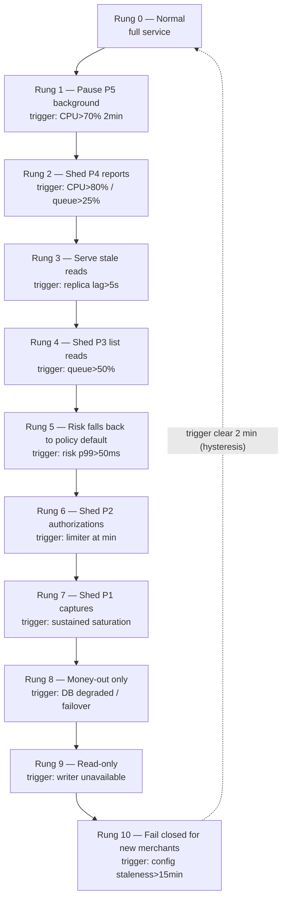
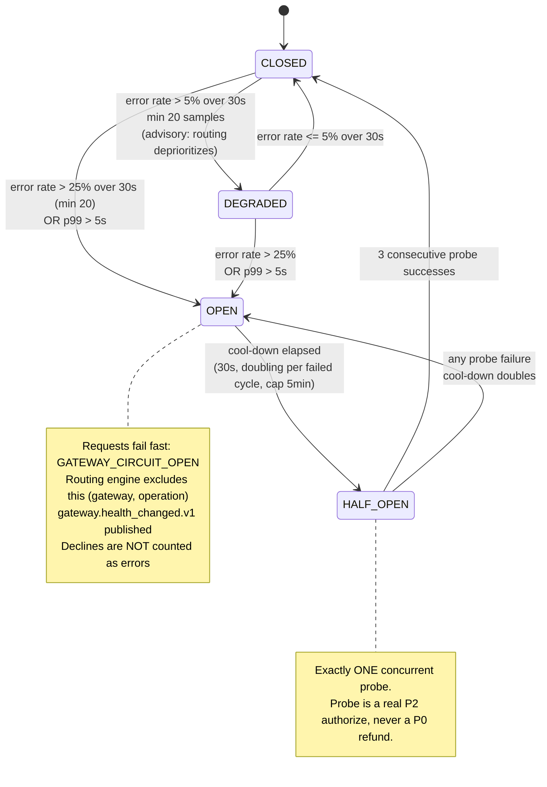
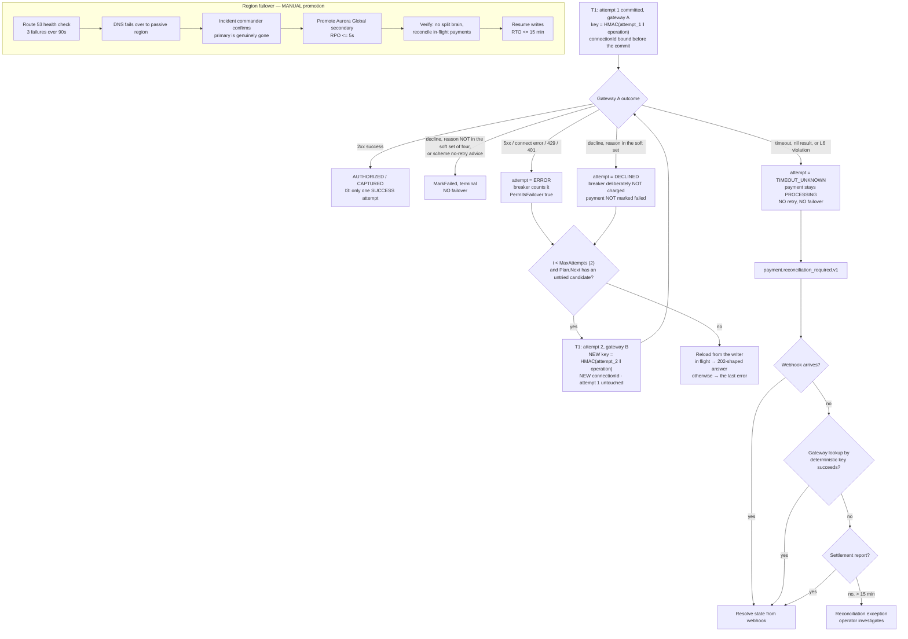

# Failure Handling and Resilience

> **Purpose:** the complete failure catalog with detection, response and recovery for each mode, plus the resilience toolkit with concrete parameters, the retry-safety table, the degradation ladder, backpressure design and dead-letter handling.
> **Derived from:** `docs/spec/00-design-baseline.md` §24 (failure mode catalog), with §12 (request pipeline and the timeout rule), §14 (idempotency), §15 (consistency), §18 (NFR targets), §20 (error model). Where this document and the baseline disagree, the baseline wins and this document is a defect.

Two rules govern everything below, both from the baseline and both non-negotiable:

1. **No timer may fail a payment** (§12.3). A timeout produces `TIMEOUT_UNKNOWN` and reconciliation, never `FAILED`.
2. **Fail static, not fail open** (§15). When a dependency is gone, serve the last known good answer — never the permissive one — and fail closed at a defined cliff.

---

## 1. Failure catalog

Each entry: blast radius, detection signal and threshold, automatic response, manual response, merchant-visible degradation, recovery, and the chaos test.

### F-1 Gateway timeout

| | |
|---|---|
| **Blast radius** | One payment attempt. Contained by the per-gateway bulkhead: at most 200 in-flight attempts to that gateway platform-wide, 32 per tenant |
| **Detection** | Client-side hard timeout at **8 s** (baseline §12, stage 14). `pp_gateway_request_duration_seconds` p99 and `pp_gateway_errors_total{class="timeout"}` |
| **Threshold** | Any single occurrence records the attempt; a rate > 5 % over 30 s with ≥ 20 samples moves gateway health to `DEGRADED` (baseline §10) |
| **Automatic** | Attempt → `TIMEOUT_UNKNOWN`. Payment stays `PROCESSING`. `payment.reconciliation_required.v1` emitted. Reconciler polls the gateway's lookup API using the deterministic gateway idempotency key (§14.4). **No retry, no failover** |
| **Manual** | None initially. If the reconciler cannot resolve within 15 minutes, a reconciliation exception opens and an operator checks the gateway's dashboard |
| **Merchant sees** | `202`-semantics: `status: "processing"`. Higher latency. **No correctness loss** — this is the entire point of not auto-failing |
| **Recovery** | Resolution in order of speed: webhook arrives → status lookup succeeds → settlement report. Each moves the payment out of `PROCESSING` |
| **Test** | `tests/chaos/gateway_test.go::TestGatewayTimeoutLeavesPaymentProcessingAndNeverRetries` — holds the connection past the hard timeout, asserts the payment is `PROCESSING`, the attempt is `TIMEOUT_UNKNOWN`, and that the gateway was called exactly once. `tests/chaos/crash_test.go::TestAnUnknownOutcomeIsResolvedByLookupNotByGuessing` covers the resolution half |

### F-2 Gateway 5xx / transport error

| | |
|---|---|
| **Blast radius** | One attempt, escalating to all traffic for that gateway if sustained |
| **Detection** | HTTP status ≥ 500, or a connection error **before** the request was written (distinguished: a failure before the first byte is provably safe to retry; a failure after is not) |
| **Threshold** | Per-attempt immediate; health transition per baseline §10 |
| **Automatic** | Classify: `ERROR` (our side or transport failed before the gateway could act) → retry ≤ 2 on the **same attempt** with full jitter, reusing the same gateway idempotency key. Exhausted → **failover as a new attempt** to the next gateway in the routing plan, with a new key (§14.4) |
| **Manual** | None |
| **Merchant sees** | Latency up by the retry budget (≤ ~1.3 s); success rate dips briefly |
| **Recovery** | Automatic. Circuit breaker takes over if sustained (F-4) |
| **Test** | `tests/chaos/gateway_test.go::TestSoftDeclineFailsOverAndProducesExactlyOneSuccess` and `internal/application/payment/orchestrator_test.go::TestFailoverNeverProducesTwoSuccessfulAttempts` — assert a *different* gateway key on attempt 2 and that I3 (one successful attempt per payment) holds. `tests/chaos/gateway_test.go::TestGatewayFiveHundredStormDoesNotFailOverOnAnUnknownOutcome` asserts the negative case |

### F-3 Gateway hard decline

| | |
|---|---|
| **Blast radius** | One payment |
| **Detection** | Mapped, normalized decline reason in the hard-decline set (stolen card, invalid account, pickup, restricted) |
| **Threshold** | Immediate |
| **Automatic** | Payment → `FAILED`, terminal. **No failover, no retry.** Reason returned to the merchant as a normalized code |
| **Manual** | None. If hard-decline *rate* spikes for a merchant, the card-testing playbook opens (`security.md` §9.1, T-1) |
| **Merchant sees** | A clean decline with a reason code |
| **Recovery** | n/a — this is a correct outcome |
| **Test** | `internal/application/payment/orchestrator_test.go::TestHardDeclineDoesNotFailOver` — asserts exactly one attempt exists and no second gateway was contacted. `internal/domain/gateway/health_test.go::TestHardDeclinesDoNotOpenTheCircuit` asserts the complement: a declining gateway is working, not broken. Retrying a hard decline on another gateway is card-testing behaviour and gets the platform de-registered (baseline §9.1) |

### F-4 Gateway sustained errors → circuit open

| | |
|---|---|
| **Blast radius** | All traffic routed to that `(gateway, operation)` |
| **Detection** | Error rate > 5 % over 30 s (min 20 samples) → `DEGRADED`; > 25 % or p99 > 5 s → `UNHEALTHY`, circuit `OPEN` (baseline §10) |
| **Threshold** | As above; per `(gateway_id, operation)`, not per merchant — per-merchant samples are too sparse to be statistically meaningful |
| **Automatic** | Circuit opens; routing engine excludes the gateway; traffic shifts to fallback; `gateway.health_changed.v1` published; after a 30 s cool-down the circuit half-opens and probes (3 consecutive successes → `HEALTHY`; any failure → `UNHEALTHY` with the cool-down doubling, capped at 5 min) |
| **Manual** | Check the gateway's status page; open a vendor ticket; consider a manual routing pin if the fallback is materially worse |
| **Merchant sees** | Traffic shifts gateway. Possibly a different authorization rate; possibly different 3DS behaviour |
| **Recovery** | Automatic via the probe policy |
| **Test** | `internal/domain/gateway/health_test.go::TestErrorRateThresholds`, `::TestCooldownProbeAndClose` and `::TestCooldownDoublesAndIsCapped` — drive the error rate, assert the state sequence, and assert the cool-down doubles and is capped at 5 minutes |

### F-5 All gateways unhealthy

| | |
|---|---|
| **Blast radius** | All payments for the affected `(currency, method, corridor)` |
| **Detection** | Routing engine returns an empty plan |
| **Threshold** | Immediate |
| **Automatic** | `503 NO_ELIGIBLE_GATEWAY` with `Retry-After`. **Fail closed** — no attempt to route outside the merchant's configured or residency-permitted set |
| **Manual** | Page. Verify it is not our egress path (F-13) before blaming the gateways — two gateways failing simultaneously is far more often our network than theirs |
| **Merchant sees** | Payments rejected with a retryable `503` |
| **Recovery** | Follows gateway recovery; probes restore health automatically |
| **Test** | `internal/application/payment/service_test.go::TestNoEligibleGatewayIsAnAnswerNotJustARefusal` and `internal/domain/routing/engine_test.go::TestNoEligibleGatewayCarriesEveryRejectionReason` — assert the refusal happens **before** any attempt is dispatched and that it carries the per-candidate rejection reason, so an operator can tell an outage from a corridor nobody supports |

### F-6 Postgres primary loss

| | |
|---|---|
| **Blast radius** | All writes in the region. This is the most severe non-regional failure |
| **Detection** | Driver connection errors; Aurora failover event; readiness probe fails within 5 s |
| **Threshold** | 3 consecutive readiness failures (15 s) removes the pod from the load balancer |
| **Automatic** | Aurora auto-failover ≤ 60 s (baseline §18 RTO). Readiness fails → LB sheds → `503`. Reads shift to the replica. Writes reject `503 SERVICE_UNAVAILABLE` (CP choice, baseline A4/§15 — a payment that cannot reach the primary **fails closed** rather than being processed twice). Connection pools drain and re-establish with exponential backoff and jitter to avoid a thundering herd against the new primary |
| **Manual** | Confirm failover completed; check replica lag; verify no in-flight payment is stuck (the reconciler handles those) |
| **Merchant sees** | Up to ~60 s of write rejections with retryable `503`; reads continue with ≤ 1 s staleness |
| **Recovery** | Automatic. Post-failover, verify the idempotency table and the outbox for records written but uncommitted — there are none by construction, since both share the state transaction |
| **Test** | `tests/chaos/infra_test.go::TestDatabaseUnavailableMidTransactionFailsClosed` — takes the database away mid-transaction and asserts the write fails closed with no partial write. `::TestConnectionPoolExhaustionRejectsRatherThanQueues` covers the saturation case. A real Aurora failover has never been run |

### F-7 Redis loss

| | |
|---|---|
| **Blast radius** | Latency and rate-limit precision platform-wide. **Not** correctness |
| **Detection** | Connection errors; `pp_redis_errors_total`; the client's own circuit breaker opens after 10 failures in 5 s |
| **Threshold** | Breaker opens at 10 failures / 5 s; probes every 5 s |
| **Automatic** | Idempotency falls back to Postgres, which is authoritative anyway (baseline §14.3 — Redis is purely a latency accelerator). Rate limiting falls back to a local per-pod token bucket sized `global_limit / replicas × 1.2`. Cache reads fall back to the local in-process snapshot, then to Postgres |
| **Manual** | Restore Redis; verify the fallback is off before declaring recovery |
| **Merchant sees** | p99 latency up ~15–30 ms; rate limits slightly coarser (the ×1.2 over-admits to account for uneven load balancing) |
| **Recovery** | Automatic on breaker close. The cache warms lazily; no stampede because the loader is single-flighted per key |
| **Test** | `tests/chaos/infra_test.go::TestRedisLossDegradesLatencyNotCorrectness` — removes Redis mid-burst with duplicate idempotency keys and asserts correctness is unchanged and no operation executes twice |

### F-8 Kafka loss

| | |
|---|---|
| **Blast radius** | Event propagation: projections, ledger, notifications, config invalidation. **No data loss** — the outbox retains everything (baseline §13.4) |
| **Detection** | Producer errors in `outbox-relay`; `pp_outbox_backlog` rising; `pp_consumer_lag` rising |
| **Threshold** | Backlog > 10 000 rows or age > 60 s → alert; > 100 000 or > 15 min → page |
| **Automatic** | The relay backs off exponentially and keeps rows; nothing is dropped. Config invalidation degrades to TTL-based expiry (≤ 30 s bounded staleness, baseline §15), so the data plane keeps working |
| **Manual** | Restore MSK; scale the relay when it returns; watch for a publish storm and confirm consumers keep up |
| **Merchant sees** | Nothing on the payment path. Webhooks to merchants and status projections lag |
| **Recovery** | Automatic drain. Consumers are effectively-once (§13.5), so the drain's duplicates are harmless |
| **Test** | `tests/chaos/infra_test.go::TestKafkaUnavailableLosesNoEvents` — asserts zero event loss while the broker is away. `tests/integration/outbox_test.go::TestTwoRelayShardsPreservePerAggregateOrder` asserts ordering per partition key after the drain |

### F-9 Outbox backlog

| | |
|---|---|
| **Blast radius** | Eventual-consistency window widens |
| **Detection** | `pp_outbox_backlog{topic}` gauge and the oldest-unpublished-row age |
| **Threshold** | Age > 30 s warn, > 60 s alert, > 15 min page |
| **Automatic** | HPA scales `outbox-relay` on the backlog gauge (a custom metric, not CPU — CPU is not the constraint). `FOR UPDATE SKIP LOCKED` means added replicas parallelize cleanly with no coordination |
| **Manual** | If scaling does not clear it, the cause is almost always downstream: broker throttling, a partition leader election, or an ISR shrink. Check MSK before adding relay replicas |
| **Merchant sees** | Webhook and status-projection lag |
| **Recovery** | Drain |
| **Test** | `tests/integration/outbox_test.go::TestBacklogMetricReflectsReality` and `::TestAPublishFailureLeavesTheRowClaimable` — assert the backlog metric is truthful and that a failed publish leaves the row claimable rather than lost. KEDA scaling on the backlog is untested |

### F-10 Consumer poison message

| | |
|---|---|
| **Blast radius** | One partition of one consumer group — until it is parked. A poison message that blocks a partition stalls every key hashed to it, so parking must be fast |
| **Detection** | Handler error repeated for the same `event_id`; `pp_dlq_depth` |
| **Threshold** | 3 in-process attempts (100 ms, 400 ms, 1.6 s full jitter) → `.retry` topic; 5 retry-topic cycles with escalating delay (5 s, 30 s, 2 m, 10 m, 30 m) → `.dlq` |
| **Automatic** | Message parked to `.dlq` with the full error chain, the envelope, the consumer group, the attempt history and the code version. **The consumer commits the offset and continues** — a poison message must never block the partition |
| **Manual** | DLQ triage (§8.2) |
| **Merchant sees** | One entity's projection is stale until replay |
| **Recovery** | Fix, then replay (§8.3) |
| **Test** | `internal/events/consumer_test.go::TestPoisonEnvelopeIsNonRetryable` — asserts an undeserializable envelope is classified non-retryable rather than retried forever, so it reaches the DLQ and the partition keeps moving. `::TestRetryableAndNonRetryableErrorsArePropagated` pins the classification |

### F-11 Duplicate webhook

| | |
|---|---|
| **Blast radius** | None |
| **Detection** | `webhook_dedup` unique constraint on `(gateway, gateway_ref)` |
| **Threshold** | Immediate |
| **Automatic** | Drop silently, return `200` (a gateway that receives a non-2xx retries harder, making things worse), increment `pp_webhook_duplicates_total` |
| **Manual** | None. A sustained high duplicate rate means our acknowledgement is too slow — check the ≤ 50 ms ingest budget |
| **Merchant sees** | Nothing |
| **Recovery** | n/a |
| **Test** | `tests/integration/webhook_test.go::TestDuplicateWebhookIsDroppedByTheUniqueIndex` — asserts exactly one state transition, with the dedup enforced by the unique index rather than by a read-then-write |

### F-12 Webhook replay attack

| | |
|---|---|
| **Blast radius** | None (blocked) |
| **Detection** | Signed timestamp skew > 5 min, or nonce/`gateway_ref` reuse |
| **Threshold** | Immediate |
| **Automatic** | Reject `401 WEBHOOK_REPLAY_DETECTED`; security event; source throttled at the WAF after 10/min |
| **Manual** | Investigate per `security.md` §9.1 (T-4) |
| **Merchant sees** | Nothing |
| **Recovery** | n/a |
| **Test** | `tests/chaos/clock_skew_test.go::TestClockSkewBeyondTheWebhookToleranceFailsClosed` — asserts a signature outside the tolerance is refused, and `::TestATamperedBodyIsRejectedRegardlessOfTheClock` asserts the clock is not the only thing standing between us and a forged body |

### F-13 Config corruption / control-plane loss

| | |
|---|---|
| **Blast radius** | Configuration freshness platform-wide. **Not** the payment path, by design (baseline §15) |
| **Detection** | L4 validation failure on publish; checksum mismatch on snapshot load; `pp_config_snapshot_age_seconds` |
| **Threshold** | Snapshot age > 5 min → alert; > `max_config_staleness` (default 15 min) → the defined cliff |
| **Automatic** | A corrupt publish is rejected at L4 and never reaches the data plane. If the control plane is entirely down, the data plane **fails static**: it keeps processing on the last-known-good snapshot. Past 15 minutes it fails closed **for new merchants only** while continuing to serve existing ones |
| **Manual** | Restore the control plane; if a bad config did reach production, `POST …/configuration/rollback`, which publishes the previous document as a *new* version (never deletes, baseline §23) |
| **Merchant sees** | Nothing for up to 15 minutes. Then newly-onboarded merchants cannot transact |
| **Recovery** | Control-plane restoration; snapshot refresh within 30 s |
| **Test** | `internal/platform/config/provider_test.go::TestStalenessLadder` — asserts each rung of the ladder, and `::TestFailedRefreshIsFailStatic` and `::TestColdProviderRefusesRatherThanLying` assert the two ends: a stale snapshot keeps serving, an empty one refuses |

### F-14 Pod crash mid-workflow

| | |
|---|---|
| **Blast radius** | The workflow instances that pod held leases on |
| **Detection** | Lease expiry (lease 60 s, heartbeat 20 s) |
| **Threshold** | 60 s |
| **Automatic** | Another worker acquires the expired lease and resumes from the last checkpoint. Completed steps are not replayed (baseline §11) |
| **Manual** | None |
| **Merchant sees** | Onboarding delayed by up to ~60 s |
| **Recovery** | Automatic |
| **Test** | `tests/chaos/crash_test.go::TestWorkerCrashMidWorkflowResumesWithoutRepeatingASideEffect` and `tests/integration/workflow_resume_test.go::TestWorkerCrashAtEveryOnboardingStepResumesWithoutRepeatingWork` — assert the step's side effect occurred exactly once. `internal/workflows/engine/postgres/compensate_test.go::TestCompensationsRunInStrictReverseOrder` covers the compensation half |

### F-15 Node loss

| | |
|---|---|
| **Blast radius** | The pods on that node |
| **Detection** | Kubelet heartbeat loss (40 s) |
| **Threshold** | Node marked `NotReady` at 40 s; pods evicted at 5 min (`tolerationSeconds` reduced to 30 s for stateless data-plane pods so recovery is fast) |
| **Automatic** | PDB + anti-affinity + topology spread keep the remaining replicas serving; the surge replaces capacity; connections drain via `preStop` (15 s sleep, then graceful shutdown with a 30 s deadline) |
| **Manual** | None |
| **Merchant sees** | A brief latency blip; no errors, because draining precedes termination |
| **Recovery** | Automatic |
| **Test** | **none.** Killing a node needs a cluster, and no cluster has ever run this. The behaviour is a design claim resting on the PDBs and the `preStop` drain in `deployment.md` §1.7 <!-- doc-refs: allow-missing --> |

### F-16 AZ loss

| | |
|---|---|
| **Blast radius** | One third of capacity |
| **Detection** | AWS AZ health; a correlated spike in errors from one zone |
| **Threshold** | — |
| **Automatic** | Multi-AZ everywhere; 3× headroom (baseline §18). Aurora fails over if the writer was in the lost AZ (F-6). MSK and ElastiCache are multi-AZ. Cluster autoscaler adds capacity in the surviving AZs |
| **Manual** | Confirm headroom holds; consider shedding P4 traffic (§5) if it does not |
| **Merchant sees** | Nothing, if headroom holds; otherwise `429` for low-priority operations first |
| **Recovery** | Automatic when the AZ returns |
| **Test** | **none.** See F-15: this needs a cluster and an AZ to lose <!-- doc-refs: allow-missing --> |

### F-17 Region loss

| | |
|---|---|
| **Blast radius** | All traffic in that region |
| **Detection** | Route 53 health checks; synthetic probes from three external regions |
| **Threshold** | 3 consecutive failures over 90 s |
| **Automatic** | Route 53 failover to the passive region (active/passive per baseline A9). **Aurora Global secondary promotion is deliberately NOT automatic** — see the flow in §9.2 |
| **Manual** | Incident commander authorizes promotion after confirming the primary is genuinely gone. This is the one place we accept a human in the loop |
| **Merchant sees** | Up to 15 minutes of unavailability (RTO), RPO ≤ 5 s |
| **Recovery** | Promote, repoint, verify, resume. Failback is a planned operation, never automatic |
| **Test** | **none.** `scripts/dr-drill.sh` exists and has never been executed — it needs credentials for a `dr-verify` account that does not exist. RTO ≤ 15 min and RPO ≤ 5 s are design targets, not measured results <!-- doc-refs: allow-missing --> |

**Why promotion is manual.** Automatic cross-region promotion of a financial primary risks split-brain: if the "lost" region is actually partitioned from the health checkers but still serving, two writers exist and the CP guarantee (baseline A4) is broken. Double-charging costs a chargeback, a fine and trust; fifteen minutes of downtime costs fifteen minutes. The trade is deliberate and is stated in A9.

### F-18 Retry storm

| | |
|---|---|
| **Blast radius** | Potentially platform-wide — this is the failure mode that converts a small incident into an outage |
| **Detection** | Retry-budget consumption ratio; `pp_http_requests_total{status="429"}` rate; concurrency-limiter queue depth; a rise in request rate with no rise in *unique* idempotency keys (the definitive signature: retries, not new work) |
| **Threshold** | Retry budget > 10 % of the base request rate; adaptive limiter reducing concurrency for > 30 s |
| **Automatic** | The global retry budget clamps to zero further retries (§3); the adaptive concurrency limiter reduces the in-flight ceiling; load shedding drops by priority class (§5); `429` with `Retry-After` and full jitter guidance |
| **Manual** | Identify the client; contact them; temporarily reduce their quota if their SDK is misbehaving |
| **Merchant sees** | `429` on low-priority operations first; refunds and voids continue (reserved capacity, §5) |
| **Recovery** | Automatic as the budget refills |
| **Test** | `tests/chaos/retry_storm_test.go::TestRetryBudgetBoundsARetryStorm`, `::TestAdaptiveLimiterShedsRatherThanQueues` and `::TestARetryStormAgainstTheOrchestratorProducesNoDuplicatePayment` — assert the budget bounds the storm, the limiter sheds rather than queues, and that surviving the storm does not cost a duplicate payment |

### F-19 Clock skew

| | |
|---|---|
| **Blast radius** | Signature windows, token validation, ULID monotonicity, lease expiry |
| **Detection** | `chrony` offset metric per node |
| **Threshold** | Offset > 500 ms warn, > 2 s alert, > 5 s cordon the node |
| **Automatic** | Signature and token windows tolerate ±5 min (webhooks) and ±60 s (JWT). ULID generation guards against timestamp regression by monotonically incrementing the random component within a millisecond. Lease expiry uses the **database's** clock (`now()`), not the pod's, so lease correctness is immune to node skew |
| **Manual** | Fix NTP; cordon and replace the node |
| **Merchant sees** | Nothing |
| **Recovery** | NTP resync |
| **Test** | `tests/chaos/clock_skew_test.go::TestClockSkewBeyondTheWebhookToleranceFailsClosed` and `::TestASecretRotationDoesNotDropWebhooks` — assert the skew tolerance fails closed and that a rotation during skew does not drop a delivery |

### F-20 Cache stampede

*Not in baseline §24 but a direct consequence of the §15 cache design; included because it is a real failure mode of that design.*

| | |
|---|---|
| **Blast radius** | Postgres load spike when a hot configuration key expires under load |
| **Detection** | A spike in `pp_config_loads_total` with flat request volume |
| **Threshold** | Loads > 10× the baseline for one key |
| **Automatic** | Single-flight per key (concurrent loaders wait for one in-flight load); TTL jitter of ±10 % so keys do not expire in lockstep; serve-stale-while-revalidate up to the staleness budget |
| **Manual** | None |
| **Merchant sees** | Nothing |
| **Recovery** | Automatic |
| **Test** | `internal/infrastructure/redis/cache_test.go::TestGetOrLoadSingleFlights` — concurrent requests at the instant of expiry, asserting exactly one load; `internal/infrastructure/redis/redis_integration_test.go::TestIntegrationGetOrLoadCollapsesAStampede` repeats it against real Redis |

---

## 2. Resilience toolkit

### 2.1 Timeouts

**The rule: a caller's timeout must exceed the sum of its callee's timeout plus its retries plus overhead — and the *total* must be less than the caller's own caller's budget.** Violate this and the outer caller gives up while the inner work continues, producing orphaned work, wasted capacity and — on a payment path — genuine ambiguity about whether money moved.

| Layer | Timeout | Derivation |
|---|---|---|
| Client → ALB (idle) | 65 s | Above the ALB's own 60 s so the ALB, not the client, closes first |
| ALB → `payment-api` | 30 s | Generous ceiling; nothing should approach it |
| `payment-api` request deadline | **25 s** | The budget everything inside must fit within |
| `payment-api` → `payment-orchestrator` (gRPC) | **20 s** | 25 s minus 5 s of ingress-side headroom |
| Orchestrator internal deadline | **18 s** | 20 s minus 2 s for response serialization and the outbox write |
| Orchestrator → gateway (per attempt) | **8 s hard** (baseline §12 stage 14) | Empirically covers the p99.9 of every gateway's authorization latency. Beyond 8 s, the marginal success probability is below the cost of holding a bulkhead slot |
| Gateway attempt with retries | 8 + 0.4 + 8 + 1.6 + 8 ≈ **26 s** worst case → capped by the 18 s orchestrator deadline, which permits **at most 2 attempts** | This is why the retry count is 2 and not 3: the arithmetic, not a preference |
| Gateway connect timeout | 2 s | Separate from the overall timeout; a slow TCP connect is a dead host, not a slow gateway |
| Gateway TLS handshake | 3 s | |
| Postgres — data-plane read | 250 ms (`statement_timeout`) | Stage budgets in baseline §12 total ~60 ms; 250 ms is 4× headroom |
| Postgres — data-plane write | 2 s | Covers a checkpoint or a brief lock wait without holding a connection indefinitely |
| Postgres — control-plane report | 30 s | Interactive reporting, off the hot path |
| Postgres connect | 5 s, with a 3-attempt backoff on pool establishment | |
| Redis | 50 ms per operation, 100 ms connect | Redis is a latency accelerator; if it is slower than the Postgres fallback it is worse than useless |
| Kafka produce | 10 s with `acks=all` | Durability over latency: the relay is asynchronous, so latency there costs nothing |
| KYC vendor | 30 s (baseline §11 step 2) | Vendor SLA |
| Merchant webhook delivery | 5 s connect+read | A merchant's slow endpoint must not consume our delivery pool |
| Secrets Manager | 2 s, cached 5 min | |
| JWKS fetch | 2 s, background only | Never on the request path (`security.md` §3.3) |
| Graceful shutdown | 30 s drain + 15 s `preStop` | Longer than the longest in-flight request that is *not* a gateway call; gateway calls in flight at shutdown complete or become `TIMEOUT_UNKNOWN`, which is safe by construction |

**Deadline propagation.** The remaining budget travels as a gRPC deadline and as an HTTP `X-Deadline-Ms` header. Every layer computes `remaining = deadline - now - safety_margin` and refuses to start work it cannot finish: `if remaining < min_useful_time { return DEADLINE_EXCEEDED }`. Starting a gateway call with 300 ms of budget left burns a bulkhead slot and produces a `TIMEOUT_UNKNOWN` that costs a reconciliation cycle — refusing early is strictly better.

### 2.2 Retry budgets

Retry *counts* bound one call. They do not bound the system: at 3 retries, a partial failure triples aggregate load exactly when the system is least able to absorb it. A **retry budget** bounds retries as a fraction of total traffic.

```go
// internal/infrastructure/resilience/budget.go
type RetryBudget struct {
    ratio     float64       // max retries as a fraction of base requests: 0.10
    minPerSec float64       // floor so low-traffic paths can still retry: 3/s
    ttl       time.Duration // sliding window: 10s
}

// Token accounting: every ORIGINAL request deposits `ratio` tokens; every RETRY
// withdraws 1. When the balance is empty, retries are refused and the underlying
// error surfaces immediately.
func (b *RetryBudget) TryWithdraw() bool { /* … */ }
```

| Parameter | Value | Reasoning |
|---|---|---|
| `ratio` | **0.10** | At most 10 % additional load from retries. A healthy system retries far below this; a system at the cap is already degraded and more retries would deepen the hole. 10 % is enough headroom to absorb ordinary transient errors without being enough to double the load |
| `minPerSec` | **3/s** | Without a floor, a route serving 2 rps could never retry (0.2 tokens/s). Low-traffic paths get an absolute allowance |
| Window | **10 s** sliding | Long enough to smooth bursts, short enough to react before a storm compounds |
| Scope | Per `(client, route_class)` at ingress; per `(gateway, operation)` at egress | One misbehaving client must not consume the whole platform's retry allowance |
| On exhaustion | Return the underlying error immediately, increment `pp_retry_budget_exhausted_total`, and mark the response `retryable: true` so the *client* may retry after backoff — we simply do not retry on their behalf | Honest: we stop amplifying, but we do not lie about retryability |

Budgets compose with counts: a call may retry at most twice **and** only while the budget allows. Both must permit it.

### 2.3 Exponential backoff with full jitter

**Full jitter**, not equal jitter and not decorrelated jitter:

```
delay(n) = random_uniform(0, min(cap, base × 2^n))

base = 100 ms
cap  = 2 s   (in-request retries; the 18 s orchestrator budget constrains it)
cap  = 60 s  (workflow activity retries, baseline §11)
cap  = 30 m  (DLQ retry cycles)
```

```go
func FullJitter(attempt int, base, cap time.Duration, rnd *rand.Rand) time.Duration {
    exp := base << attempt          // base * 2^attempt
    if exp > cap || exp <= 0 {      // <=0 catches overflow at high attempt counts
        exp = cap
    }
    return time.Duration(rnd.Int63n(int64(exp) + 1))
}
```

| Choice | Reasoning |
|---|---|
| **Full** jitter over equal jitter | Equal jitter (`d/2 + rand(0, d/2)`) keeps a deterministic floor, so clients that failed together still retry in overlapping bands. Full jitter spreads uniformly across the whole interval and, per AWS's published analysis, minimizes both client-observed completion time and server-observed contention. The cost is higher variance on a single retry — irrelevant when the alternative is a synchronized stampede |
| `base = 100 ms` | Below typical gateway recovery times, so the first retry is cheap and often succeeds |
| `cap = 2 s` in-request | Derived from the 18 s orchestrator budget minus 2 × 8 s of gateway timeout: ~2 s is what remains for waiting |
| Per-attempt RNG | Seeded per goroutine; never a shared, locked global source — the mutex on a global RNG becomes a contention point precisely during a retry storm |
| Retry-After | On `429`/`503` we send `Retry-After` and clients are documented to apply full jitter to it. A `Retry-After` all clients honour exactly produces a perfectly synchronized second stampede |

### 2.4 Circuit breakers

Per `(gateway_id, operation)` — the granularity from baseline §10, chosen because per-merchant samples are too sparse to be statistically meaningful and a global breaker would let one bad operation take down a healthy gateway's other operations.

```
CLOSED    → OPEN        error rate > 25% over a 30s rolling window, min 20 samples
                        OR p99 latency > 5s over the same window
CLOSED    → (DEGRADED)  error rate > 5%: advisory; routing deprioritizes but does not exclude
OPEN      → HALF_OPEN   after cool-down (30s, doubling per failed probe cycle, cap 5 min)
HALF_OPEN → CLOSED      3 consecutive successful probes
HALF_OPEN → OPEN        any probe failure
```

| Parameter | Value | Reasoning |
|---|---|---|
| Error threshold | **25 %** to open | Gateways normally decline 5–15 % of authorizations for business reasons; *declines are not errors* and are excluded from the numerator. Only transport failures, 5xx and timeouts count. 25 % of those is unambiguously broken |
| Degraded threshold | 5 % | Advisory; feeds routing scores rather than excluding the gateway |
| Window | **30 s** rolling, 10 × 3 s buckets | Long enough for 20 samples at low volume, short enough to react before the SLO burns |
| **Minimum sample size** | **20** | The single most important parameter. Without it, 1 failure out of 2 requests is a 50 % error rate and opens the circuit on a gateway that is fine. At 20 samples the binomial confidence interval around 25 % is narrow enough to act on |
| Latency threshold | p99 > 5 s | A gateway at 5 s p99 will exhaust the 8 s timeout for a meaningful share of traffic; excluding it early is better than timing out |
| Cool-down | 30 s, doubling to 5 min | 30 s covers a transient blip; doubling avoids hammering a genuinely-down provider; the 5 min cap bounds recovery time |
| Half-open probes | **1 concurrent** probe, 3 consecutive successes to close | One at a time: a half-open state that admits full traffic re-breaks a recovering gateway. Three successes because one could be luck |
| Probe selection | A real payment from the front of the queue, not a synthetic — but only a P2 (authorize), never a P0 (refund) | Synthetics do not exercise the real path. Risking a low-priority operation on a probe is acceptable; risking a refund is not |
| Failure counting | Timeouts and 5xx count; **hard declines do not** | Conflating business declines with availability failures opens circuits on healthy gateways every time a merchant's traffic mix shifts |
| State export | `pp_circuit_breaker_state{gateway,operation}` gauge 0/1/2, plus `gateway.health_changed.v1` (baseline §10) | The routing engine consumes the event; the control plane records it |

Separate breakers, with their own parameters, wrap Redis (10 failures / 5 s, 5 s cool-down — aggressive, because the fallback is good) and each external vendor (KYC, bank validation: 50 % over 60 s, min 10 samples — patient, because these are low-volume and there is no fallback).

### 2.5 Bulkheads

Semaphores that bound concurrency, not rate. Rate limits do not protect a resource pool: 500 rps of 10-second requests is 5 000 concurrent.

**Sizing math.** Little's Law: `L = λ × W`. Provision for the *target* arrival rate at the *p99* service time, plus headroom.

| Bulkhead | Sizing | Value |
|---|---|---|
| Per-gateway global | λ = 5 000 TPS ÷ 3 gateways ≈ 1 667 rps; W(p99) = 1.5 s → L = 2 500 in-flight across the fleet. With 12 orchestrator pods: **200 per pod** | 200 |
| Per `(gateway, tenant)` | 200 ÷ ~6 concurrently-active large tenants, rounded down for safety | 32 |
| Per-tenant at ingress | λ = 500 rps (the tenant's quota); W(p99) = 0.25 s excluding gateway → L = 125 across 8 API pods ≈ 16; ×4 headroom for gateway-inclusive requests | 64 per pod |
| Postgres writer pool | Aurora `max_connections` 5 000; reserve 20 % for maintenance; ÷ services by weight → orchestrator 200, control-plane 50, workers 100, relay 20, consumers 100 | 200 (orchestrator) |
| Postgres reader pool | 2× writer, since reads are shorter | 400 |
| Redis pool | 50 per pod (50 ms operations, so 50 concurrent = 1 000 ops/s per pod) | 50 |
| Workflow activity | 16 per tenant per worker | 16 |
| Webhook delivery | 4 per merchant, 64 per tenant | 4 / 64 |
| Goroutine ceiling | Bounded worker pools everywhere; no unbounded `go func()` on a request path | — |

`TryAcquire` with a short timeout, never a blocking `Acquire`: baseline A6 states the principle for idempotency leases and it generalizes — *blocking a request thread on a resource held by another process is how thread pools die under retry storms*. A full bulkhead sheds immediately with `503`/`429` and a `Retry-After`.

### 2.6 Rate limiting

| Aspect | Design |
|---|---|
| Algorithm | **Token bucket**, not a fixed window. A fixed window permits 2× the limit across a boundary (full burst at the end of one window, full burst at the start of the next) |
| Parameters | `rate` = the tenant's contracted rps; `burst` = 2 × rate. Burst 2× absorbs a normal client's natural clumping without permitting sustained overrun |
| Granularity | `(tenant, merchant, route_class)`. Route classes: `payment_write`, `payment_read`, `control_write`, `control_read`, `webhook` |
| Distributed | Redis with an atomic Lua script (read, refill, decrement, write in one round trip). ~1 ms added latency |
| Local fallback | On Redis failure, each pod uses a local bucket sized `global_limit / replica_count × 1.2`. The 1.2 over-admits because load balancing is not perfectly even; over-admitting by 20 % is better than rejecting valid traffic |
| Fallback exit | Redis breaker closes → the local bucket is discarded and Redis becomes authoritative again immediately. There is no gradual handover, because a split-brain between local and distributed accounting is worse than a discontinuity |
| Headers | `RateLimit-Limit`, `RateLimit-Remaining`, `RateLimit-Reset`, `Retry-After` on `429` (baseline §19.3) |
| Edge limits | WAF W6/W7 (`security.md` §2.1) as a coarse pre-auth backstop only — IP-based limits are near-useless behind NAT |

### 2.7 Load shedding with priority classes

| Class | Operations | Reserved capacity | Shed order |
|---|---|---|---|
| **P0** | Refund, void, dispute handling, webhook ingest | 10 % reserved, never shed | Baseline §8: you must always be able to give money back. Webhook ingest is P0 because dropping a webhook creates reconciliation work that costs far more than serving it |
| **P1** | Capture | — | Shed 5th |
| **P2** | Authorize / create payment | — | Shed 4th |
| **P3** | Reads (`GET /v1/payments`, status) | — | Shed 3rd |
| **P4** | Reports, list endpoints, analytics, exports | — | Shed 1st |
| **P5** | Non-essential background: projection rebuilds, cache warming, optional reconciliation sweeps | — | Shed 0th (paused, not shed) |

Shedding triggers on the adaptive concurrency limiter's queue depth and on CPU saturation, in that order. Shed responses are `503` with `Retry-After` and a `retryable: true` flag (baseline §20) — clients are told the truth so their own backoff behaves.

### 2.8 Adaptive concurrency limits

A static concurrency limit is wrong at least half the time: too low wastes capacity, too high queues. The limiter measures and adapts.

**Gradient2 algorithm**, per service, per route class:

```
limit(t+1) = limit(t) × (1 - α) + α × limit(t) × gradient      where
gradient   = clamp( rtt_noload / rtt_current , 0.5 , 1.0 )
rtt_noload = a long-window minimum RTT (the best observed, ~5 min window)
rtt_current= a short-window sample (p50 over the last 1s)
α          = 0.2 smoothing
```

| Parameter | Value | Reasoning |
|---|---|---|
| Initial limit | 100 | A sane cold start; converges within seconds |
| Min limit | 20 | Below this the service is useless; better to shed and stay responsive |
| Max limit | 2 000 | Bounds memory and goroutine growth regardless of what the algorithm believes |
| Gradient floor | 0.5 | Caps the reduction at 50 % per adjustment; a sharper cut oscillates |
| Smoothing α | 0.2 | Five adjustment periods to converge — fast enough to react, slow enough not to chase noise |
| Queue | `limit × 0.5`, then shed | A queue longer than half the concurrency adds more latency than throughput |
| Probing | The limit grows by 1 while success rate is high and latency is flat, so it discovers new capacity after a scale-up | Otherwise a scaled-up service stays pinned at its old limit |

Latency, not error rate, is the signal: rising latency precedes errors, so the limiter reduces load *before* timeouts start — which is the only point at which reducing load still helps.

---

## 3. Retry-safety decision table

The `retryable` flag in the error model (baseline §20) is machine-readable and is what SDKs, the workflow engine and the relay branch on. This table is its specification.

| Operation | Safe to retry? | Conditions | Key | Reasoning |
|---|---|---|---|---|
| `POST /v1/payments` | **Yes** | Client must send the same `Idempotency-Key` and an identical body | Client `Idempotency-Key`, scoped `(tenant, merchant, method, path_template, key)` | Idempotency record replays the stored response (§14.3). A different body with the same key → `422 IDEMPOTENCY_KEY_REUSED` |
| `POST …/capture`, `/refund`, `/void` | **Yes** | Same key, same body | Same | Same mechanism |
| `GET` anything | **Yes** | Unconditional | — | Safe by HTTP semantics |
| `PATCH`/`PUT` control-plane | **Yes** | Same key **and** the same `If-Match` ETag | Idempotency key + ETag | A stale ETag returns `412`, which correctly reports that the world moved |
| Orchestrator → gateway, **connect failed** | **Yes** | No bytes were written | Same `gateway_idempotency_key` | Provably no side effect |
| Orchestrator → gateway, **5xx after request sent** | **Yes** | ≤ 2 attempts, within budget, same attempt | Same `gateway_idempotency_key` (§14.4) | The gateway dedupes on the key, so a duplicate is impossible even if it did act |
| Orchestrator → gateway, **timeout / no response** | **NO** | Never automatically | — | Baseline A7/§12.3. We do not know whether money moved. Attempt → `TIMEOUT_UNKNOWN`, payment stays `PROCESSING`, reconciler resolves. **The single most important row in this table** |
| Orchestrator → gateway, **hard decline** | **NO** | Never, on any gateway | — | Baseline §9.1: retrying a hard decline elsewhere is card-testing behaviour |
| Orchestrator → gateway, **soft decline** | **Yes**, as a **new attempt** | Only if the reason is in the retryable-decline set (issuer unavailable, soft do-not-honour, network) and the routing plan has a candidate left | **New** `gateway_idempotency_key` (new attempt) | A different gateway is genuinely a new authorization; a new key is required or the second gateway would see a foreign key |
| Postgres write, **connection error before commit** | **Yes** | Whole transaction replayed | Transaction is atomic | Nothing committed |
| Postgres write, **error after commit sent, no ack** | **Yes** | Only via the idempotency record | Idempotency key | The classic ambiguity; the unique index makes the replay safe |
| Idempotency claim | **Yes** | `INSERT … ON CONFLICT DO NOTHING` | Unique index | Idempotent by construction |
| Outbox publish to Kafka | **Yes** | Unconditional | Event `id` | At-least-once by design; consumers dedupe (§13.5) |
| Consumer handler | **Yes** | Within the dedup transaction | `(consumer_group, event_id)` | Effectively-once by §13.5 |
| Merchant webhook delivery | **Yes** | ≤ 8 attempts, exponential + full jitter (baseline §23) | Event `id` in the payload; merchants dedupe on it | Merchant endpoints are required to be idempotent; documented in the integration guide |
| KYC submit | **Yes** | ≤ 5, exponential (baseline §11) | Vendor reference key | Vendor dedupes |
| Gateway provisioning | **Yes** | ≤ 5, exponential | External reference | Vendor dedupes; compensation de-provisions on abort |
| Credential rotation | **Yes**, with care | Only in the `AWSPENDING` phase; never during promotion | Rotation run ID | Retrying a promotion could revoke a credential still in use |
| Ledger append | **NO** as a blind retry | Only via the event dedup path | `(consumer_group, event_id)` | A double-appended ledger entry corrupts the balance; the dedup row is the only safe route |
| Workflow step | **Yes** | Per the step's policy (baseline §11); only steps declared idempotent | Step's own idempotency key | Non-idempotent steps are not retried; they fail the instance to the DLQ |
| Compensation | **Yes** | Must be idempotent by contract | Step ID | A compensation that cannot be retried is not a compensation |
| DLQ replay | **Yes** | With the safety checks in §8.3 | Original event `id` | Dedup makes a re-replay harmless |

**Rule of thumb encoded above:** retry when a side effect is either impossible (nothing was sent) or provably deduplicated (a key the callee honours). Never retry when the outcome is unknown and no key protects you — reconcile instead.

---

## 4. Graceful degradation ladder

Ordered by increasing pressure. Each rung names the trigger, what is shed and what is preserved. Rungs are cumulative and are climbed down automatically when the trigger clears for 2 minutes (hysteresis, so the system does not oscillate).

| Rung | Trigger | Shed / changed | Preserved |
|---|---|---|---|
| **0 — Normal** | — | — | Everything |
| **1 — Trim background** | CPU > 70 % for 2 min, or limiter reducing for 30 s | Pause P5: projection rebuilds, cache warming, optional reconciliation sweeps, analytics exports | All merchant-facing behaviour |
| **2 — Shed reports** | CPU > 80 %, or limiter queue > 25 % | P4 rejected: reports, list endpoints, exports → `503` + `Retry-After` | All single-resource reads and all writes |
| **3 — Serve stale** | Config store slow, or read-replica lag > 5 s | Reads served from cache beyond the normal freshness window, up to the staleness budget; `Warning: 110` header set | Writes, and read-your-writes for the caller who wrote |
| **4 — Shed reads** | Limiter queue > 50 % | P3 (list/status reads) rejected; single-payment reads still served | All writes |
| **5 — Drop enrichment** | Risk engine p99 > 50 ms, or the external scorer is down | Risk engine falls back to the **policy default** — not to "allow" (baseline §12 stage 11). 3DS forced where the policy says so. Optional enrichment (device fingerprint, BIN lookup) skipped | Payment processing with policy-defined risk posture |
| **6 — Shed authorizations** | Limiter at min, or gateway bulkheads saturated | P2 (new payments) rejected with `503` + `Retry-After` | P1 captures, P0 refunds/voids/webhooks |
| **7 — Shed captures** | Sustained saturation | P1 captures rejected | P0 only |
| **8 — Money-out only** | Severe: primary DB degraded, or a region in failover | Only refunds, voids, dispute handling and webhook ingest served. Everything else `503` | The ability to give money back — always, per baseline §8 |
| **9 — Read-only** | Writer unavailable and failover in progress | All writes `503`; reads from the replica with a staleness header | Status visibility, so merchants can see what happened |
| **10 — Fail closed** | Config staleness > `max_config_staleness` (15 min) for new merchants; or complete loss of the regional primary | New-merchant payments rejected; existing merchants continue on the last-known-good snapshot until the cliff | Correctness. **Never** process without valid configuration and limits |



The ladder's shape encodes one judgement: **money-out survives longer than money-in.** A merchant who cannot take a payment loses a sale. A merchant who cannot issue a refund creates a regulatory and reputational problem that outlives the incident.

---

## 5. Backpressure

### 5.1 Where it originates

| Origin | Signal | Propagates as |
|---|---|---|
| Gateway slowing | Rising `pp_gateway_request_duration_seconds` | Bulkhead slots held longer → `TryAcquire` fails → orchestrator returns `503 GATEWAY_CIRCUIT_OPEN`/`RESOURCE_EXHAUSTED` → API returns `503` with `Retry-After` |
| Postgres slowing | Rising query duration, pool wait time | Pool acquisition times out → handler returns `503` → shed at rung 2+ |
| Kafka slowing | Producer latency, ISR shrink | Outbox backlog grows → relay backs off → **no** propagation to the request path, by design (the outbox decouples them) |
| Consumer slowing | Rising `pp_consumer_lag` | Pause partition fetch → broker-side backpressure → lag alarm → scale consumers |
| CPU saturation | Runqueue depth, throttling | Adaptive limiter reduces the ceiling → queue → shed |
| Memory pressure | Heap growth, GC pause time | Limiter reduces; if the heap exceeds 85 % of the limit, the pod fails readiness and drains rather than OOM-killing mid-request |
| Downstream client retrying | Request rate up, unique idempotency keys flat | Retry budget exhausts → `429` |

### 5.2 How it propagates

**The principle: backpressure must reach the client as a fast, explicit rejection — never as an unbounded queue.** A queue converts a throughput problem into a latency problem and then into a timeout problem, which produces retries, which makes the throughput problem worse. Every queue in the system is bounded, and every bound has a defined shed behaviour.

```
Client
  ▲  429/503 + Retry-After + RateLimit-* headers    ← explicit, fast, honest
  │
payment-api ── token bucket ──► per-tenant queue (bounded 128) ──► semaphore (64)
  │                                    │ full → 429 immediately
  ▼
payment-orchestrator ── adaptive limiter ──► per-gateway bulkhead (200 / 32)
  │                                              │ full → 503 immediately
  ▼
Gateway (8s hard timeout)
```

Asynchronous paths absorb rather than propagate, which is why they exist: the outbox holds rows when Kafka is slow, and consumers lag when handlers are slow, and neither condition reaches the payment path. That decoupling is the reason the outbox pattern is worth its complexity.

### 5.3 Queue-depth signals

| Queue | Bound | Warn | Alert | Page | Action at the page threshold |
|---|---|---|---|---|---|
| Per-tenant admission queue | 128 | 32 | 64 | 100 | Shed rung 4+ |
| Adaptive limiter queue | `limit × 0.5` | 25 % | 50 % | 75 % | Shed rung 6 |
| Gateway bulkhead waiters | 0 (`TryAcquire` only) | — | any waiting | — | Investigate: a waiter means a code path is blocking, which is a bug |
| Postgres pool wait | — | 10 ms | 50 ms | 200 ms | Scale readers or shed |
| Outbox backlog | — | 1 000 rows / 30 s age | 10 000 / 60 s | 100 000 / 15 min | Scale relay; check MSK |
| Consumer lag | — | 1 000 | 10 000 / 60 s | 100 000 / 5 min | Scale consumers; check for a poison partition |
| DLQ depth | — | 1 | 10 | 100 | Triage (§8.2) |
| Webhook delivery queue | 10 000/tenant | 1 000 | 5 000 | 9 000 | Check merchant endpoint health |
| Workflow ready-queue | — | 100 | 1 000 | 10 000 | Scale workers |
| Reconciliation queue | — | 10 | 100 | 500 | Investigate gateway lookup availability |

---

## 6. Dead-letter handling

### 6.1 Topology

```
pp.<context>.<aggregate>.v1  ──handler error──►  in-process retry ×3
                                                  (100ms, 400ms, 1.6s full jitter)
                                        │ exhausted
                                        ▼
                          pp.<context>.<aggregate>.v1.retry
                          (5s, 30s, 2m, 10m, 30m — delay via a header-driven
                           scheduled consumer, not by blocking the partition)
                                        │ 5 cycles exhausted
                                        ▼
                          pp.<context>.<aggregate>.v1.dlq
                          (30d retention, alerting on depth,
                           NOT auto-consumed by anything)
```

Delay is implemented by a scheduled consumer that reads the retry topic, checks a `pp-not-before` header, and either processes or re-produces with an updated delay. Blocking a partition for 30 minutes to implement a delay would stall every other key on that partition — the reason the retry topic exists at all.

The DLQ record carries: the original envelope verbatim, the raw bytes, the consumer group, the full attempt history with timestamps and error chains, the code version and image digest, the trace ID, and the tenant. Everything a triager needs without going back to the logs.

### 6.2 Triage runbook

`docs/runbooks/dlq-triage.md`. Every DLQ message is classified within one business day; the `pp_dlq_depth` gauge alerting at 10 exists to make that enforceable.

| # | Step | Detail |
|---|---|---|
| 1 | Classify | **Poison** (malformed, unparseable, schema violation) · **Transient-that-outlived-retries** (a dependency was down longer than 45 min) · **Bug** (handler defect) · **Data** (references an entity that does not exist or is in an unexpected state) |
| 2 | Assess blast radius | How many messages share the cause? Group by `type` + error signature. One message is a curiosity; a thousand is an incident |
| 3 | Check business impact | Is a payment stuck? Is the ledger out of balance? Is a merchant's projection wrong? A stuck payment escalates to Sev-2 immediately |
| 4 | Decide | **Replay** (transient, now resolved) · **Fix then replay** (bug — deploy the fix first) · **Discard** (a duplicate, or an event superseded by later state) · **Manual repair** (data) |
| 5 | Discard requires approval | `payments:replay_dlq` is dual-controlled for `operator`. A discarded event is a permanently lost state transition; the discard itself is audited with the reason |
| 6 | Record | Every disposition writes an audit record. DLQ dispositions are reviewed weekly for patterns — a recurring cause is a missing test |

### 6.3 Replay procedure and safety checks

`platformctl dlq replay --topic … --since … --until … --filter … --dry-run`

| # | Safety check | Reasoning |
|---|---|---|
| 1 | **Dry run mandatory first.** Prints the count, the type histogram, the affected tenants and merchants, and a sample of 10 envelopes | Replaying the wrong selection is the most likely way to make things worse |
| 2 | **The fix is deployed and verified.** The tool refuses to replay if the current running image digest equals the digest recorded on the DLQ records, unless `--force-same-version` is passed with a reason | Replaying into the same bug produces the same DLQ entries plus wasted capacity |
| 3 | **Dedup is intact.** The tool verifies the `(consumer_group, event_id)` dedup table has not been truncated for the affected range | Replay relies entirely on §13.5 for safety. Without dedup, replay is a double-execution machine |
| 4 | **Tenant scoping.** Replay is scoped to a tenant unless `platform-admin` explicitly passes `--all-tenants` | Blast-radius control |
| 5 | **Rate-limited.** Replay produces at ≤ 100 msg/s by default, adjustable, with the consumer's lag monitored; the replay pauses if lag exceeds 10 000 | A bulk replay that outruns the consumers is a self-inflicted incident |
| 6 | **Ordering.** Replayed in original `(partition_key, sequence)` order. If a later event for the same aggregate already applied, the dedup and the FSM (L7) reject the stale one — the state machine is the final arbiter, not the replay tool | Baseline §9: invalid transitions are rejected, which makes out-of-order replay safe rather than merely unlikely |
| 7 | **Money-affecting events go one at a time.** Ledger and payment-state events replay serially with verification between each | The ledger is append-only; a mistake is not editable, only compensable |
| 8 | **Post-replay verification.** Ledger balances recomputed; payment state distribution compared against the pre-replay snapshot; reconciliation run triggered for the affected merchants | Replay without verification is hope |
| 9 | **Audited.** The replay writes an audit record with the operator, the approver, the selection criteria, the counts and the outcome | |
| 10 | **Reversible?** No. Replay cannot be undone. This is why steps 1–3 are mandatory rather than advisory | Stated plainly so nobody discovers it during an incident |

### 6.4 Poison-message policy

| Rule | Detail |
|---|---|
| A poison message **never** blocks a partition | Offset commits after parking. This is the property that keeps one bad message from becoming an outage |
| A message that cannot be deserialized is parked immediately | Zero retries. Retrying a parse failure is pure waste |
| A message whose envelope lacks a valid `tenantid` is parked **and** raises a security event | It is either a producer bug or a forged message (`multi-tenancy.md` §3.3) |
| A message referencing a non-existent aggregate is parked, not dropped | It may be an ordering artifact whose predecessor is still in flight; the retry topic's escalating delays usually resolve it |
| A handler that panics is treated as a poison message for that message only | The consumer recovers, parks, and continues; the panic is a Sev-3 bug ticket automatically |
| Repeated poisoning of the same aggregate ID (> 5 messages) | Quarantines that aggregate: subsequent events for it are parked directly, and an incident opens. This prevents one broken entity from consuming the entire retry budget |
| DLQ retention | 30 days (baseline §13.3). Anything not triaged in 30 days is a process failure, and the weekly review exists to prevent it |
| DLQ is never auto-consumed | Every replay is a deliberate, approved human action |

---

## 7. Diagrams

### 7.1 Circuit breaker state machine



### 7.2 Failover flow (gateway and region)



**What this diagram no longer shows, and why.** An earlier version drew a same-gateway retry rung — `backoff = uniform(0, min(2s, 100ms·2ⁿ))`, same attempt, same key — between the transport error and the failover. That rung is not implemented. `payment.Config.SameGatewayRetries` declares a budget of 2 for it and **no code reads the field**: neither `Orchestrator.Dispatch` nor the `httpx` client retries a transport failure. Today the first `ERROR` advances straight to the next candidate. The key derivation still makes such a retry *safe* whenever it is added — it is derived from `attempt_id ‖ operation`, so the gateway would dedupe — but the safety is currently a property of the design rather than of an exercised path.

### 7.3 Degradation ladder

See §4 — the ladder diagram is rendered there alongside the rung table so the trigger and the shed behaviour stay adjacent.

---

## 8. Chaos test index

Most failure modes above have a test, and three do not. The tests are not all in `tests/chaos/`:
the majority of these properties are asserted where the behaviour lives — in the domain, the
application layer or the integration suite — and the chaos suite covers the ones that only appear
when a fault is injected mid-flight. The `chaos`-tagged suite runs nightly and on demand before
any release touching the resilience layer; everything else in this table runs on every push.

| Test file | Modes covered |
|---|---|
| `tests/chaos/gateway_test.go` | F-1, F-2 |
| `internal/application/payment/orchestrator_test.go` | F-2, F-3 |
| `internal/domain/gateway/health_test.go` | F-3, F-4 |
| `internal/application/payment/service_test.go`, `internal/domain/routing/engine_test.go` | F-5 |
| `tests/chaos/infra_test.go` | F-6, F-7, F-8 |
| `tests/integration/outbox_test.go` | F-8, F-9 |
| `internal/events/consumer_test.go` | F-10 |
| `tests/integration/webhook_test.go` | F-11 |
| `tests/chaos/clock_skew_test.go` | F-12, F-19 |
| `internal/platform/config/provider_test.go` | F-13 |
| `tests/chaos/crash_test.go`, `tests/integration/workflow_resume_test.go` | F-14 |
| *(none — all three need a cluster)* | F-15, F-16, F-17 |
| `tests/chaos/retry_storm_test.go` | F-18 |
| `internal/infrastructure/redis/cache_test.go` | F-20 |
| `tests/chaos/partition_test.go` | §4 — partition behaviour, and its distinction from an unknown outcome |
| *(none)* | §4 degradation ladder — every rung is implemented, none is asserted end to end |
| *(none)* | §6.3 DLQ replay — the safety checks exist; nothing asserts they block an unsafe replay |

The invariant asserted by **every** chaos test, regardless of what it is injecting: **no payment is ever double-charged, and no payment ends in a terminal state that contradicts the gateway's record.** I1–I3 (baseline §9) are checked at the end of each run. Correctness under failure is the only property that matters here; everything else is latency.
