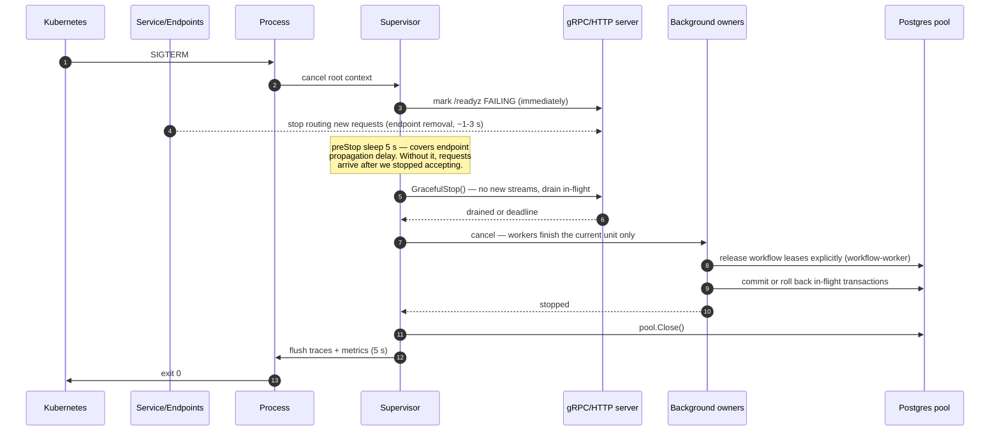

# Low Level Design

> Purpose: package-by-package design of `internal/`, the composition-root and wiring pattern, the concurrency model, resource-pool sizing arithmetic, and the sequence-level behaviour of the money path.
> **Derived from and subordinate to [`docs/spec/00-design-baseline.md`](spec/00-design-baseline.md); the system-level view is [`docs/architecture.md`](architecture.md).** Where this document disagrees with the baseline, the baseline wins.

---

## 1. Package design

Layout is binding (§25). Every package below states: responsibility, key types, key interfaces, collaborators, threading model, error strategy, test strategy.

### 1.0 Conventions applied to every package

| Concern | Rule |
|---|---|
| Package naming | Singular, lowercase, no underscores, no `util`/`common`/`helpers`. A package that cannot be named for what it *is* does not have a responsibility. |
| Constructors | `New*` returning `(T, error)` when construction can fail (config parsing, pool creation), `New*` returning `T` when it cannot. Constructors validate their arguments and return `ErrInvalidDependency` rather than accepting a nil collaborator. |
| Context | Every method that performs I/O or that may be cancelled takes `ctx context.Context` as its **first** parameter. Domain methods do **not** take a context — they are pure. |
| Errors | Wrap with `%w` and a package-scoped verb: `fmt.Errorf("postgres: claim idempotency: %w", err)`. Sentinel errors are exported from the package that defines the condition. Never `errors.New` inside a loop. |
| Mutability | Value objects are immutable; methods return new values. Entities mutate only through methods that enforce the FSM. |
| Logging | Only the application and adapter layers log. `internal/domain` never logs — it returns errors. |
| Panics | Reserved for programmer error detected at construction time (a nil dependency wired in the composition root). Never on a request path. Every goroutine entry point has a `recover` that converts a panic into a logged `INTERNAL_ERROR` and increments `pp_panics_total`. |

---

### 1.1 `internal/domain/**` — the centre

**Dependency rule:** stdlib and `internal/domain/**` only. No `database/sql`, no `net/http`, no OTel, no AWS SDK, no third-party UUID library. Enforced by `scripts/check-architecture.sh` (see architecture.md §5.5), including a symbol-level check that no exported domain method takes `context.Context` and no domain struct carries a `db:` or `json:` tag.

#### `internal/domain/shared` — the shared kernel

**Responsibility.** The deliberately tiny set of concepts every context needs. Changes require review from every context owner; that friction is the point.

**Key types.** `TenantID`, `MerchantID`, `PaymentID`, `AttemptID`, `Money`, `Currency`, `Country`, `DomainError`, `Version`.

```go
package shared

// Money is a value object. Immutable. Minor units only. No float, ever.
type Money struct {
    amount   int64
    currency Currency
}

func NewMoney(amount int64, c Currency) (Money, error)
func (m Money) Amount() int64
func (m Money) Currency() Currency
func (m Money) Add(o Money) (Money, error)       // ErrCurrencyMismatch on mismatch
func (m Money) Sub(o Money) (Money, error)
func (m Money) IsZero() bool
func (m Money) LessThan(o Money) (bool, error)
// Allocate splits m into len(ratios) parts using largest-remainder allocation.
// The parts always sum exactly to m. This is the only sanctioned way to split money.
func (m Money) Allocate(ratios []int64) ([]Money, error)

type Currency struct{ code string } // ISO 4217; exponent from an embedded table

func ParseCurrency(code string) (Currency, error)
func (c Currency) Code() string
func (c Currency) Exponent() int  // USD=2, JPY=0, BHD=3, CLF=4

// Clock and IDGenerator are the two ports that live in the domain, because
// domain objects legitimately need "now" and "a new id" and threading them
// through every application call produces worse code. Both are stdlib-only.
type Clock interface {
    Now() time.Time
}

type IDGenerator interface {
    New(prefix string) string // prefix_<26-char Crockford Base32 ULID>
}

// DomainError carries a stable code from the §20.2 catalog.
type DomainError struct {
    Code    string
    Message string
    Details []FieldError
}

func (e *DomainError) Error() string
func (e *DomainError) Is(target error) bool
```

**Collaborators.** None. Everything depends on it; it depends on nothing.
**Threading.** All types are immutable and safe for concurrent use. `Clock` and `IDGenerator` implementations must be goroutine-safe (the ULID generator uses a mutex-guarded monotonic entropy source to guarantee intra-millisecond ordering and to guard against clock regression).
**Errors.** `ErrCurrencyMismatch`, `ErrInvalidCurrency`, `ErrNegativeAmount`, `ErrMissingTenantContext`.
**Tests.** Pure table tests, plus **property-based tests** (`testing/quick` or `gopter`) for the money laws that a table test cannot cover: `Allocate` parts always sum to the whole for any ratio vector and any amount including negatives; `Add`/`Sub` are inverse; no operation ever produces a value that round-trips differently through serialization. Fuzz test on `ParseCurrency`. A CI lint asserts `float64` does not appear anywhere in `internal/domain` or `pkg/money`.

#### `internal/domain/payment` — the money aggregate

**Responsibility.** The `Payment` aggregate root: FSM (§9), attempts (§9.1), refunds, invariants I1–I5.

**Key types.** `Payment`, `Attempt`, `Refund`, `State`, `AttemptOutcome`, `DeclineReason`.

```go
package payment

type State string

const (
    StateCreated           State = "CREATED"
    StateRequiresAction    State = "REQUIRES_ACTION"
    StateProcessing        State = "PROCESSING"
    StatePending           State = "PENDING"
    StateAuthorized        State = "AUTHORIZED"
    StateCaptured          State = "CAPTURED"
    StateSettled           State = "SETTLED"
    StatePartiallyRefunded State = "PARTIALLY_REFUNDED"
    StateRefunded          State = "REFUNDED"
    StateDisputed          State = "DISPUTED"
    StateVoided            State = "VOIDED"
    StateFailed            State = "FAILED"
    StateCanceled          State = "CANCELED"
    StateExpired           State = "EXPIRED"
)

// Payment is the aggregate root. Attempt and Refund live inside its
// consistency boundary because invariants I1 and I3 span them.
type Payment struct { /* unexported fields only */ }

func Reconstitute(s Snapshot) (*Payment, error) // from persistence
func Create(cmd CreateCommand, clock shared.Clock, ids shared.IDGenerator) (*Payment, []Event, error)

func (p *Payment) ID() shared.PaymentID
func (p *Payment) State() State
func (p *Payment) Version() shared.Version
func (p *Payment) Amount() shared.Money
func (p *Payment) CapturedTotal() shared.Money
func (p *Payment) RefundedTotal() shared.Money

// Every mutator returns the events it produced. The caller writes state and
// events in ONE transaction (I5). A mutator that returns an error has made
// no change to the receiver — mutators are atomic with respect to the aggregate.
func (p *Payment) StartAttempt(gw shared.GatewayID, plan routing.PlanEntry, at time.Time) (*Attempt, []Event, error)
func (p *Payment) RecordAuthorized(attemptID shared.AttemptID, amt shared.Money, ref GatewayRef, at time.Time) ([]Event, error)
func (p *Payment) RecordCaptured(attemptID shared.AttemptID, amt shared.Money, ref GatewayRef, at time.Time) ([]Event, error)
func (p *Payment) RecordDeclined(attemptID shared.AttemptID, r DeclineReason, at time.Time) ([]Event, error)
func (p *Payment) RecordTimeoutUnknown(attemptID shared.AttemptID, at time.Time) ([]Event, error)
func (p *Payment) Capture(amt shared.Money, at time.Time) ([]Event, error)   // enforces I2
func (p *Payment) Refund(amt shared.Money, reason string, at time.Time) (*Refund, []Event, error) // enforces I1
func (p *Payment) Void(at time.Time) ([]Event, error)
func (p *Payment) Cancel(at time.Time) ([]Event, error)

// CanTransitionTo is the single source of truth for §9's transition table.
func CanTransitionTo(from, to State) bool
```

**Design notes that matter.**
- **`Attempt` is not an aggregate root.** It has its own FSM but is never loaded or modified independently. The reason is I3 — *at most one attempt per payment in a successful terminal state* — an invariant spanning payment and attempts. Enforcing it across aggregate boundaries would require a saga, and a saga cannot make double-charging structurally impossible. Inside one boundary it is a partial unique index: `CREATE UNIQUE INDEX ON payment_attempts (payment_id) WHERE outcome = 'SUCCESS'`.
- **Mutators return events, they do not publish them.** Publishing is the application layer's job, through `OutboxWriter`, in the same transaction as the state write.
- **`RecordTimeoutUnknown` does not fail the payment.** It marks the attempt and leaves the payment in `PROCESSING` (A7/§12.3). There is no method on `Payment` that can fail a payment because of elapsed time. That absence is the enforcement.

**Collaborators.** `shared`, `routing` (for `PlanEntry` only, a value type).
**Threading.** An aggregate instance is confined to one goroutine for its lifetime — loaded, mutated and saved within a single request. It is **not** goroutine-safe and does not pretend to be (no mutexes, which would hide a design error). Concurrency is arbitrated by optimistic locking on `version`.
**Errors.** `*shared.DomainError` with codes `INVALID_STATE_TRANSITION`, `REFUND_EXCEEDS_CAPTURED`, `AMOUNT_EXCEEDS_LIMIT`, `PAYMENT_ALREADY_PROCESSED`.
**Tests.**
- Exhaustive FSM table test: for **every** ordered pair of the 14 states, assert `CanTransitionTo` matches §9's table. The table in the test is transcribed independently from the baseline, not imported from the implementation — otherwise the test asserts that the code equals itself.
- Explicit negative tests for the named-invalid transitions: `SETTLED→PROCESSING`, `REFUNDED→CAPTURED`, `CAPTURED→AUTHORIZED`, `FAILED→*`, `CREATED→CAPTURED`.
- Property test: no sequence of legal operations can make `RefundedTotal > CapturedTotal` (I1) or `CapturedTotal > AuthorizedTotal` (I2).
- Golden test: every mutator's event output is compared against a checked-in JSON fixture, so an accidental envelope change is a failing diff.

#### `internal/domain/merchant`, `tenant`, `gateway`, `routing`, `risk`, `ledger`, `audit`, `compliance`

| Package | Responsibility | Key types | Key interface / function | Notes |
|---|---|---|---|---|
| `merchant` | Merchant lifecycle FSM (§8) and its guards | `Merchant`, `State`, `BusinessProfile`, `BankAccount` | `func CanTransitionTo(from, to State) bool`; `func (m *Merchant) TransitionTo(to State, guards GuardSet, at time.Time) ([]Event, error)` | The `→ ACTIVE` guard requires ≥1 `CERTIFIED` connection, a validated configuration, a compliance attestation, and no open critical reconciliation exception. `GuardSet` is a value passed in by the application — the domain does not query. |
| `tenant` | Tenant, ApiClient, Principal, scopes | `Tenant`, `Principal`, `Scope` | `func (p Principal) HasScope(s Scope) bool` | Tier (`pooled`/`siloed`) lives here and drives isolation decisions in infrastructure. |
| `gateway` | `Gateway` entity, `CapabilityDescriptor`, health FSM (§10) | `Gateway`, `CapabilityDescriptor`, `HealthState`, `HealthWindow` | `func (w *HealthWindow) Observe(o Outcome, d time.Duration, now time.Time) (HealthState, bool)` — returns the new state and whether it changed | The health FSM is **pure**: the sliding window is passed in, thresholds are values. That is what makes 5 % over 30 s with a 20-sample floor testable without sleeping. |
| `routing` | Pure routing decision | `Plan`, `PlanEntry`, `Candidate`, `Reason` | `func BuildPlan(in Input) (Plan, error)` where `Input` carries eligible gateways, health, weights, residency policy and token pinning | Completely pure: same input, same plan. `Reason` values (`PRIMARY`, `FALLBACK`, `HEALTH_EXCLUDED`, `CAPABILITY_EXCLUDED`, `RESIDENCY_EXCLUDED`, `TOKEN_PINNED_TO_GATEWAY`) are persisted with the plan so a routing decision is explicable months later. |
| `risk` | Policy evaluation, not scoring | `Policy`, `Decision`, `Velocity` | `func (p Policy) Evaluate(in Input) Decision` — `Decision` is `ALLOW`, `REQUIRE_3DS` or `DECLINE` with a reason | Pure. The external `RiskScorer` is an *input* to `Input`, supplied by the application, so a scorer timeout degrades to the policy default rather than to "allow". |
| `ledger` | Double-entry shadow ledger | `Entry`, `Account`, `Posting` | `func NewPosting(debits, credits []Entry) (Posting, error)` — rejects unbalanced postings | Append-only. Balance is a fold, never an update. Rejecting an unbalanced posting in the constructor makes an unbalanced ledger unrepresentable. |
| `audit` | Hash-chained audit record | `Record`, `Chain` | `func (c *Chain) Append(r Record) (Record, error)` — sets `prev_digest` and computes `digest` | `digest = SHA-256(prev_digest ‖ canonical_json(record))`. Verification is a fold over the chain; `platformctl audit verify` runs it. |
| `compliance` | Attestations, retention, residency rules | `Attestation`, `ResidencyPolicy` | `func (r ResidencyPolicy) Permits(g gateway.CapabilityDescriptor) bool` | Consumed by `routing.BuildPlan` as an exclusion, which is why a residency violation is a `RESIDENCY_EXCLUDED` plan reason rather than a late error. |

---

### 1.2 `internal/application/**` — use cases and the ports they own

**Dependency rule:** stdlib, `internal/domain/**`, `internal/application/ports`. Never infrastructure, never adapters, never a driver.

#### `internal/application/ports` — the ports

This package is the **structural expression of the Dependency Inversion Principle**: the consumer declares the interface and the provider conforms. Every interface here is owned by the application layer and implemented in `internal/infrastructure` or `internal/adapters`.

```go
package ports

// ---------- Persistence ----------

// UnitOfWork is the transaction boundary. A use case that must write state
// and an outbox row atomically does both inside one Do.
type UnitOfWork interface {
    // Do runs fn inside a single database transaction with the tenant set via
    // SET LOCAL app.tenant_id (§16). It retries exactly once on a serialization
    // failure (40001) and never more, because a money operation that cannot
    // serialize twice is a contention signal, not a transient error.
    Do(ctx context.Context, fn func(ctx context.Context, tx Tx) error) error
}

type Tx interface {
    Payments() PaymentRepository
    Attempts() AttemptRepository
    Refunds() RefundRepository
    Idempotency() IdempotencyStore
    Outbox() OutboxWriter
    RoutingPlans() RoutingPlanRepository
    Ledger() LedgerRepository
}

// Reader and Writer are segregated (ISP): the reconciler and the projection
// builder depend only on the reader.
type PaymentReader interface {
    Get(ctx context.Context, id shared.PaymentID) (*payment.Payment, error)
    GetByIdempotency(ctx context.Context, scope IdempotencyScope) (*payment.Payment, error)
    List(ctx context.Context, q PaymentQuery) (PaymentPage, error)
}

type PaymentWriter interface {
    // Insert fails with ErrConflict if the id exists.
    Insert(ctx context.Context, p *payment.Payment) error
    // Update applies optimistic concurrency on version; a mismatch returns
    // ErrVersionConflict, which the use case maps to 409.
    Update(ctx context.Context, p *payment.Payment, expected shared.Version) error
    AppendEvents(ctx context.Context, id shared.PaymentID, evs []payment.Event) error
}

type PaymentRepository interface {
    PaymentReader
    PaymentWriter
}

// ---------- Idempotency (§14) ----------

type IdempotencyScope struct {
    TenantID     shared.TenantID
    MerchantID   shared.MerchantID
    Method       string
    PathTemplate string
    Key          string
}

type IdempotencyRecord struct {
    Scope        IdempotencyScope
    Fingerprint  [32]byte // SHA-256 over JCS-canonical body + scope
    State        IdempotencyState // IN_FLIGHT | COMPLETED | FAILED_TERMINAL
    LeaseExpires time.Time
    Response     *ResponseSnapshot
}

type IdempotencyStore interface {
    // Claim performs INSERT ... ON CONFLICT DO NOTHING against the unique index,
    // and additionally reclaims a record whose lease has expired
    // (UPDATE ... WHERE lease_expires_at < now()). Postgres is authoritative;
    // Redis is a latency mirror only (§14.3).
    //
    // Returns:
    //   (ClaimAcquired, nil)                  -> caller proceeds
    //   (ClaimInProgress, nil)                -> 409 IDEMPOTENT_REQUEST_IN_PROGRESS
    //   (ClaimReplay, record, nil)            -> replay stored snapshot
    //   (_, ErrFingerprintMismatch)           -> 422 IDEMPOTENCY_KEY_REUSED
    Claim(ctx context.Context, scope IdempotencyScope, fp [32]byte, lease time.Duration) (ClaimResult, *IdempotencyRecord, error)
    Complete(ctx context.Context, scope IdempotencyScope, snap ResponseSnapshot) error
    FailTerminal(ctx context.Context, scope IdempotencyScope, snap ResponseSnapshot) error
}

// ---------- Outbox (§13.4) ----------

type OutboxWriter interface {
    // Append writes envelope rows in the SAME transaction as the state change.
    // This is the only sanctioned path to Kafka; no service produces directly.
    Append(ctx context.Context, envs []events.Envelope) error
}

// ---------- Configuration (§15: fail-static, bounded staleness) ----------

type ConfigSnapshotProvider interface {
    // Get never performs a network call. It returns the in-memory snapshot.
    // If the snapshot is older than maxStaleness it returns ErrConfigTooStale,
    // which the caller maps per the cliff rule: new merchants fail closed,
    // known merchants continue.
    Get(ctx context.Context, m shared.MerchantID) (config.Snapshot, error)
    // Age is exported as pp_config_snapshot_age_seconds.
    Age() time.Duration
}

// ---------- Secrets (§17.2) ----------

type Secrets interface {
    // Resolve turns a secret reference into material. The return type is
    // Secret[T], whose String/MarshalJSON/Format all render [REDACTED],
    // so credential material cannot reach a log by accident.
    Resolve(ctx context.Context, ref SecretRef) (crypto.Secret[GatewayCredential], error)
}

// ---------- Risk scoring (optional, advisory, hot path) ----------

type RiskScorer interface {
    // Score has a hard 15 ms budget. Any error, including deadline exceeded,
    // is reported to the caller, which then evaluates the policy WITHOUT a
    // score. It never degrades to "allow".
    Score(ctx context.Context, in RiskInput) (RiskScore, error)
}

// ---------- Clock / IDs re-exported for the application layer ----------

type Clock = shared.Clock
type IDGenerator = shared.IDGenerator
```

**Note on `Tx`.** Repositories are reached *through* the transaction, not injected independently. This makes "I forgot to use the transaction" unrepresentable: there is no way to obtain a `PaymentRepository` outside a `UnitOfWork.Do`, other than the read-only variants used by query use cases.

#### `internal/application/payment` — the money use cases

**Responsibility.** Orchestrate the domain, the ports and the validation plane for create/capture/refund/void/resolve. Contains no persistence detail and no HTTP.

```go
package payment

type CreatePaymentUseCase struct {
    uow      ports.UnitOfWork
    reader   ports.PaymentReader
    config   ports.ConfigSnapshotProvider
    gateways gwports.Registry     // capability descriptors + adapters
    risk     ports.RiskScorer
    validate validation.Engine
    clock    shared.Clock
    ids      shared.IDGenerator
    metrics  Metrics
}

func NewCreatePaymentUseCase(...) *CreatePaymentUseCase // explicit args, all required, nil-checked

func (uc *CreatePaymentUseCase) Execute(ctx context.Context, cmd CreatePaymentCommand) (CreatePaymentResult, error)
```

`Execute` is the implementation of §12 stages 8–17 and its structure mirrors that table exactly, in that order, because the order is load-bearing:

1. `Claim` idempotency (T1) — `ClaimReplay` returns the stored snapshot immediately.
2. Load the merchant snapshot from `ConfigSnapshotProvider` (never a network call).
3. **L5** payment validation against the snapshot.
4. Risk policy evaluation, with the optional scorer under a 15 ms sub-context.
5. `routing.BuildPlan` — pure.
6. `uow.Do` (T2): create the payment, persist the plan, start the attempt, append `payment.created.v1` and `payment.attempted.v1` to the outbox. **Transaction closes here.**
7. Dispatch to the gateway adapter — **no transaction is open**.
8. **L6** response validation.
9. `uow.Do` (T3): record the outcome (**L7** transition), append the terminal event, complete idempotency.

**The rule that step 6's transaction closes before step 7** is the single most important structural decision in this package. Holding a transaction across an 8-second gateway call would pin a connection, hold an MVCC snapshot open, block vacuum on the hottest tables, and turn one slow gateway into database-wide bloat.

**Threading.** One goroutine per request. The only child goroutine is the risk scorer's, bounded by a sub-context and joined before step 5 — see §3.2.
**Errors.** Domain errors pass through; port errors are wrapped and classified into `pkg/apierror` categories (§20.1). The classification table lives here, not in the transport layer, because "is this retryable" is a business decision.
**Tests.** Use-case tests with in-memory fakes for every port and a `gateway-simulator` adapter; the FSM and money laws are covered in the domain. Integration tests (`tests/integration`) use real Postgres via testcontainers because RLS, partial unique indexes and `ON CONFLICT` semantics are exactly what a fake does not reproduce. A dedicated test asserts **no database transaction is open during the gateway call**, by instrumenting the pool and failing if `tx.Conn()` is held while the adapter is invoked.

#### The rest of `internal/application`

| Package | Responsibility | Key use cases | Notes |
|---|---|---|---|
| `application/merchant` | Merchant CRUD, FSM transitions, guard assembly | `CreateMerchant`, `UpdateMerchant`, `TransitionMerchant`, `SuspendMerchant` | Assembles `GuardSet` by querying readers, then hands values to the domain. |
| `application/onboarding` | Start/inspect/signal onboarding cases | `StartOnboarding` (idempotent on `merchant_id` business key), `SignalGate`, `GetCase` | Delegates durability entirely to `ports.WorkflowEngine`. |
| `application/config` | Desired-state authoring | `PublishConfiguration`, `RollbackConfiguration`, `GetConfiguration`, `ListVersions` | Owns the ETag/If-Match protocol and the diff record. See `control-plane.md`. |
| `application/gateway` | Registry queries, health projection, credential rotation orchestration | `ListGateways`, `GetHealth`, `RotateCredentials` | Rotation is a workflow start, not an inline mutation. |
| `application/webhook` | Inbound webhook accept + process | `AcceptWebhook` (≤ 50 ms: verify signature, dedup, insert, outbox), `ProcessWebhook` (consumer-side) | Two use cases because they run in two different binaries with two different budgets. |
| `application/ledger` | Ledger projection and reconciliation runs | `PostPayment`, `RunReconciliation`, `ResolveException` | Consumes events; never called synchronously from the money path. |

---

### 1.3 `internal/validation` — the Validation plane

**Responsibility.** Seven levels (§21), stable rule IDs, pure and total wherever possible.

```go
package validation

type RuleID string  // "L5.AMOUNT_WITHIN_MERCHANT_LIMIT" — stable, documented, never reused

type Severity int
const (SeverityWarning Severity = iota; SeverityError)

type Outcome struct {
    RuleID   RuleID
    Passed   bool
    Severity Severity
    Code     string        // §20.2 catalog code
    Field    string        // JSON pointer where applicable
    Message  string
}

type Rule[T any] interface {
    ID() RuleID
    Severity() Severity
    Evaluate(ctx context.Context, subject T) Outcome
}

// Engine runs a rule set and aggregates outcomes. It never short-circuits on
// the first failure: clients get every violation in one response, which halves
// integration iterations.
type Engine[T any] interface {
    Level() Level
    Run(ctx context.Context, subject T) Report
}

type Report struct {
    Level    Level
    Outcomes []Outcome
}

func (r Report) OK() bool                 // no ERROR-severity outcomes
func (r Report) AsError() *shared.DomainError // maps to §20 problem+json details[]
```

| Level | Package | Runs in | Purity | Notes |
|---|---|---|---|---|
| L1 API/schema | `rules/l1api` | `payment-api`, `control-plane-api`, `webhook-ingress` edge middleware | pure | **Includes the PAN detector**: 13–19 digits, Luhn-valid, after stripping separators, over every string field. A hit → `400 SENSITIVE_DATA_IN_REQUEST`; the value is **not** logged; a security event is raised. |
| L2 Merchant | `rules/l2merchant` | `workflow-worker`, merchant writes | mostly pure | Vendor-calling rules are marked impure and isolated. |
| L3 Gateway | `rules/l3gateway` | `workflow-worker`, scheduled probes | **impure (network)** | **Barred from the hot path.** The bar is structural: the L3 engine is not constructed in `payment-api`/`payment-orchestrator` composition roots, and a test asserts that. |
| L4 Configuration | `rules/l4config` | `control-plane-api` write path | pure | See `control-plane.md` §3. |
| L5 Payment | `rules/l5payment` | `payment-orchestrator` pre-dispatch | pure (config is an input) | Limits, currency, method, risk policy. |
| L6 Response | `rules/l6response` | `payment-orchestrator` post-gateway | pure | Signature, schema, **amount/currency echo**. Failure → `502 GATEWAY_CONTRACT_VIOLATION`. |
| L7 Domain/state | `rules/l7domain` | aggregate methods | pure | Thin wrapper over `CanTransitionTo`; exists so a transition rejection carries a rule ID like every other failure. |

**Threading.** Rules are stateless values; an `Engine` is safe for concurrent use and is constructed once at startup.
**Errors.** Rules never return errors and never panic — they return an `Outcome`. A rule that needs to signal "I could not evaluate" returns `Passed: false` with a distinct code. Totality is what lets us run rules concurrently without error plumbing.
**Tests.** Every rule has a table test with at least one pass and one fail case. `TestEveryRuleIsDocumented` walks the registry and fails the build if a rule ID is missing from `docs/validation-plane.md`. `TestRuleIDsAreStable` compares against a checked-in golden list so renaming a rule ID is a deliberate, reviewed act.

---

### 1.4 `internal/workflows` — the Automation plane

Detailed in [`docs/automation-plane.md`](automation-plane.md). Summary here for completeness.

| Package | Responsibility | Key types |
|---|---|---|
| `workflows/engine` | The `WorkflowEngine` port, `Definition`, `Step`, `Activity`, retry policy types. **Depends on `domain` and `application/ports` only** — no infrastructure. | `Engine`, `Definition`, `StepDef`, `Activity`, `RetryPolicy`, `Instance`, `StepRecord` |
| `workflows/engine/postgres` | The default durable implementation: lease acquisition with `FOR UPDATE SKIP LOCKED`, heartbeating, checkpointing, replay-free resume, DLQ | `Engine`, `leaseManager`, `dispatcher` |
| `workflows/engine/temporal` | The Temporal adapter behind the same port | `Engine`, mapping helpers |
| `workflows/onboarding` | The `merchant-onboarding@v1` definition and its activities | `Definition()`, one `Activity` per §11 step |

---

### 1.5 `internal/policies` — RBAC/ABAC, risk and compliance policy evaluation

**Responsibility.** Turn a `Principal` + a resource + an action into a decision; evaluate risk and compliance policy documents.

```go
package policies

type Decision struct {
    Allowed bool
    Reason  string
    Policy  string // policy id, for the audit record
}

type Authorizer interface {
    // Authorize evaluates RBAC (scope on the token) then ABAC (attributes:
    // tenant match, merchant ownership, environment, residency). Both must pass.
    Authorize(ctx context.Context, p tenant.Principal, act Action, res Resource) Decision
}
```
**Threading.** Policy sets are immutable snapshots swapped atomically via `atomic.Pointer[PolicySet]` on a configuration event. Evaluation is lock-free.
**Errors.** Never returns an error — a policy that cannot be evaluated returns `Allowed: false` with a reason. Fail-closed on authorization is the only defensible default.
**Tests.** Table tests per policy, plus `TestCrossTenantAccessIsDenied` at this layer to complement the database-level test in `tests/integration`.

---

### 1.6 `internal/events` — envelope, registry, codec, idempotent consumer

**Responsibility.** The published language (§13.1) and the consumption contract (§13.5).

```go
package events

type Envelope struct {
    SpecVersion      string          `json:"specversion"`
    ID               string          `json:"id"`               // evt_<ULID>
    Type             string          `json:"type"`             // payment.authorized.v1
    Source           string          `json:"source"`
    Subject          string          `json:"subject"`
    Time             time.Time       `json:"time"`
    DataContentType  string          `json:"datacontenttype"`
    DataSchema       string          `json:"dataschema"`
    TenantID         string          `json:"tenantid"`
    MerchantID       string          `json:"merchantid,omitempty"`
    CorrelationID    string          `json:"correlationid"`
    CausationID      string          `json:"causationid,omitempty"`
    TraceParent      string          `json:"traceparent"`
    AggregateID      string          `json:"aggregateid"`
    AggregateVersion int64           `json:"aggregateversion"`
    PartitionKey     string          `json:"partitionkey"`
    Data             json.RawMessage `json:"data"`
}

// Registry maps a type string to its JSON Schema and Go payload type.
// Publishing an unregistered type is a startup-time failure, not a runtime one:
// the registry is validated against api/events/*.json at construction.
type Registry interface {
    Register(typ string, schema []byte, proto any) error
    Validate(e Envelope) error
    Decode(e Envelope, into any) error
}

// IdempotentConsumer implements §13.5 exactly.
type IdempotentConsumer interface {
    // Consume runs handle inside a transaction that also inserts
    // (consumer_group, event_id) into the dedup table. If the insert affects
    // zero rows the event was already processed: ACK and drop without calling
    // handle. Commit, then ACK. Never ACK before commit.
    Consume(ctx context.Context, group string, e Envelope,
        handle func(ctx context.Context, tx ports.Tx, e Envelope) error) error
}
```
**Threading.** `Registry` is read-only after construction and safe for concurrent use. `IdempotentConsumer` is used from one goroutine per partition.
**Errors.** A schema-validation failure on publish is a programmer error and fails at startup. On consume, a schema failure routes to `.dlq` immediately (no retry — it will never succeed).
**Tests.** Round-trip tests for every catalogued type against `api/events/*.json`; a **compatibility test** that asserts every `.v1` schema change is additive-only against the previous release's checked-in schema. That test is what makes "additive-only within a major version" a rule rather than a hope.

---

### 1.7 `internal/platform` — cross-cutting mechanism

| Package | Responsibility | Key interface | Threading | Notes |
|---|---|---|---|---|
| `platform/tenantctx` | Carry `TenantID` in `context.Context` | `func With(ctx, shared.TenantID) context.Context`; `func From(ctx) (shared.TenantID, error)` | — | `From` returns `ErrMissingTenantContext`. Every repository calls it first and **returns an error rather than querying** if absent (§16.2). |
| `platform/authn` | JWT/JWKS verification, mTLS identity | `Authenticator.Authenticate(ctx, *http.Request) (tenant.Principal, error)` | JWKS cache refreshed by one owned background goroutine; readers use `atomic.Pointer` | Background refresh, never lazy-on-miss — a lazy refresh under a key-rotation event is a thundering herd against the IdP. |
| `platform/authz` | Scope + ABAC enforcement middleware | wraps `policies.Authorizer` | lock-free | |
| `platform/idempotency` | The §14 protocol: JCS canonicalization, fingerprinting, lease lifecycle, replay | `Manager.Begin/Complete/Fail` | per-request | JCS (RFC 8785) canonicalization is here, and it is exhaustively fuzz-tested — a canonicalization difference between client and server would produce spurious `IDEMPOTENCY_KEY_REUSED`. |
| `platform/config` | Process configuration (env) **and** the merchant config snapshot store | `SnapshotStore.Apply(ev)`, `Get`, `Age` | `atomic.Pointer[snapshotSet]` swap; readers never lock | Rebuilt at startup from the compacted `pp.config.configuration.v1` topic — this is what makes fail-static possible without a control-plane call. |
| `platform/health` | `/healthz` `/livez` `/readyz` | `Registry.Register(name string, c Check)`; `Check func(ctx) error` | one goroutine per check, results cached with a TTL | Liveness never checks a dependency (a Postgres blip must not restart every pod); readiness does. See §2.4. |
| `platform/errors` | Map domain/port errors to `pkg/apierror` categories and HTTP/gRPC codes | `func Classify(err error) apierror.Problem` | pure | One table, one place. The `retryable` flag is set here and is machine-readable (§20.1). |

---

### 1.8 `internal/adapters/gateway/**` — the anti-corruption layer

**Responsibility.** Translate between our domain and each gateway's API. **No gateway type ever crosses into `internal/domain` or `internal/application`.**

#### The SPI

```go
package spi

// Adapter is the required core. Every gateway implements all of it.
type Adapter interface {
    ID() shared.GatewayID
    Capabilities() gateway.CapabilityDescriptor

    Authorize(ctx context.Context, req AuthorizeRequest) (Response, error)
    Capture(ctx context.Context, req CaptureRequest) (Response, error)
    Refund(ctx context.Context, req RefundRequest) (Response, error)
    Void(ctx context.Context, req VoidRequest) (Response, error)

    // Lookup resolves an ambiguous attempt using the deterministic
    // gateway idempotency key. This is what closes the TIMEOUT_UNKNOWN loop
    // (§12.3) and is therefore mandatory, not optional.
    Lookup(ctx context.Context, key GatewayIdempotencyKey) (Response, error)

    // VerifyWebhook is pure: it does not call the network.
    VerifyWebhook(payload []byte, headers http.Header, secret crypto.Secret[[]byte]) (WebhookEvent, error)
}

// Optional capability interfaces (ISP). Discovered by type assertion and
// cross-checked against Capabilities(): an adapter that asserts a capability
// in its descriptor but does not implement the interface fails a startup check.
type Provisioner interface {
    Provision(ctx context.Context, req ProvisionRequest) (ProvisionResult, error)
    Deprovision(ctx context.Context, ref ExternalRef) error
}

type WebhookRegistrar interface {
    RegisterWebhook(ctx context.Context, req RegisterWebhookRequest) (WebhookRegistration, error)
    DeleteWebhook(ctx context.Context, ref ExternalRef) error
}

type PartialCapturer interface {
    CapturePartial(ctx context.Context, req CaptureRequest) (Response, error)
}

type ThreeDSInitiator interface {
    InitiateChallenge(ctx context.Context, req ThreeDSRequest) (ChallengeResult, error)
}

// Response is the normalized outcome. The mapping into it is the entire
// value of the ACL.
type Response struct {
    Outcome       payment.AttemptOutcome // SUCCESS | DECLINED | ERROR | TIMEOUT_UNKNOWN
    DeclineReason payment.DeclineReason  // normalized; carries Hard/Soft classification
    GatewayRef    string
    Amount        shared.Money           // echoed, for L6 verification
    Raw           map[string]string      // allowlisted fields only; never the raw body
}
```

**The substitutability contract** (LSP, machine-checked by `adapters/gateway/contract`):

| Clause | Rationale |
|---|---|
| A transport failure maps to `ERROR` or `TIMEOUT_UNKNOWN`, **never** `DECLINED` | A network error reported as a decline turns a retryable condition into a terminal one and corrupts the failover decision |
| A response received but not understood maps to `ERROR`, never `SUCCESS` | Silence is not consent |
| `SUCCESS` always carries a `GatewayRef` usable by `Lookup` | Otherwise the reconciliation loop cannot close |
| `Amount` and currency are always echoed | L6 verifies them; a gateway that captured a different amount must be detectable |
| A hard decline is classified `Hard` and is **never** retried on another gateway | Retrying a stolen-card decline elsewhere is card-testing behaviour and gets the platform de-registered |
| Capability differences appear in `Capabilities()`, never as a runtime `ErrNotSupported` | The routing engine must be able to exclude a gateway *before* dispatch |

**`adapters/gateway/contract`** is a table-driven suite parameterized over an `Adapter`. It runs against `gateway-simulator` in CI on every commit, and against real gateway sandboxes nightly. It is the mechanical proof of the Open/Closed claim: adding a gateway requires passing this suite and changes nothing upstream.

**`adapters/gateway/registry`** holds capability descriptors and resolves `(gateway_id) → Adapter`, with per-gateway resilience decoration applied at construction (breaker, bulkhead, timeout, metrics) — the adapter itself contains **no** resilience logic, only translation. Separating mechanism (resilience) from translation (adapter) is what lets us test the mapping tables without a network and test the breaker without a gateway.

**Threading.** Adapters are stateless and safe for concurrent use; each owns a dedicated `*http.Client` (see §5).
**Errors.** Adapter errors are `spi.Error` values carrying a class (`Transport`, `Protocol`, `Auth`, `RateLimit`, `Business`) so the caller does not string-match.
**Tests.** Per-adapter mapping tables tested exhaustively against recorded real responses in `testdata/`; the shared contract suite; a fuzz test on `VerifyWebhook` (it processes untrusted bytes from the internet and must never panic).

---

### 1.9 `internal/infrastructure/**`

| Package | Responsibility | Key detail |
|---|---|---|
| `infrastructure/postgres` | `pgxpool` setup, `UnitOfWork`, all repositories, `SET LOCAL app.tenant_id` on every transaction, listen/notify for local invalidation | Pool sizing in §4.1. RLS is applied by connecting as a **non-`BYPASSRLS`** role; a startup assertion verifies the role lacks `BYPASSRLS` and fails the process if it does not. |
| `infrastructure/redis` | Cache, token buckets, idempotency mirror | Never authoritative for money (TR-7). Every call has a 50 ms deadline and a local fallback; a Redis outage degrades latency and limit granularity, never correctness. |
| `infrastructure/kafka` | Producer (used **only** by `outbox-relay`) and consumer-group runner | Manual offset commit **after** the transaction commits. Cooperative-sticky rebalancing to avoid stop-the-world on scale events. |
| `infrastructure/secrets` | Secrets Manager / KMS adapter, envelope encryption, `Secret[T]` construction | Returns `crypto.Secret[T]` only. There is no API that returns a bare credential string. |
| `infrastructure/telemetry` | OTel tracing, metrics registry with the cardinality guard, allowlist structured logger | The logger serializes **only registered field names** — there is no `%+v` path, and a linter forbids `%+v`/`%#v` on request types (§17.2). The metrics registry rejects a label named `merchant_id` or `payment_id` at registration time (§22.3). |
| `infrastructure/httpx` | Server (timeouts, graceful shutdown, middleware chain) and the per-gateway client factory | §5. |
| `infrastructure/grpcx` | Server/client with deadline propagation, mesh mTLS, interceptors mirroring the HTTP middleware chain | Deadline propagation on B2 is what keeps the §12 budget enforceable end-to-end. |
| `infrastructure/resilience` | Circuit breaker, bulkhead (weighted semaphore), retry with exponential backoff + **full jitter**, adaptive concurrency limiter | In-process and **in-memory by design** — deliberately not shared with the durable workflow retry (architecture.md §6.2, DRY violations). |
| `infrastructure/crypto` | `Secret[T]`, HMAC helpers, JCS canonicalization, hash chaining, constant-time comparison | `Secret[T].String()`, `.MarshalJSON()` and `.Format()` all return `[REDACTED]`. A test asserts this for `%v`, `%s`, `%+v`, `%#v` and `json.Marshal`. |
| `infrastructure/clock` | Real clock, plus the test clock used everywhere else | Nothing outside this package calls `time.Now()`. A linter enforces it. This is what makes lease-expiry and backoff logic testable without sleeping. |

---

## 2. The composition root

### 2.1 Pattern

`cmd/<binary>/main.go` is the **only** place in the repository where a concrete type is assigned to an interface variable. It contains no business logic; the architecture check enforces that `cmd/**` imports business packages but defines no exported behaviour beyond wiring.

```go
// cmd/payment-orchestrator/main.go  (abridged; structure is exact)

func main() {
    os.Exit(run())
}

func run() int {
    // 1. Configuration — env only (12-factor III). Fails fast and loudly.
    cfg, err := config.Load()              // no defaults for anything security-relevant
    if err != nil { fmt.Fprintln(os.Stderr, err); return 2 }

    // 2. Root context, cancelled on SIGTERM/SIGINT.
    ctx, stop := signal.NotifyContext(context.Background(), syscall.SIGTERM, syscall.SIGINT)
    defer stop()

    // 3. Observability first, so every later failure is visible.
    logger := telemetry.NewLogger(cfg.Log)             // allowlist serializer
    shutdownTracing, err := telemetry.SetupTracing(ctx, cfg.OTel)
    if err != nil { logger.Error("tracing", "err", err); return 2 }
    metrics := telemetry.NewRegistry(cfg.Service)      // cardinality-guarded

    // 4. Infrastructure, in dependency order. Each is nil-checked by its consumer.
    clk  := clock.System{}
    ids  := idgen.NewULID(clk)
    pool, err := postgres.NewPool(ctx, cfg.Postgres, metrics)   // §4.1
    if err != nil { logger.Error("postgres", "err", err); return 2 }
    defer pool.Close()
    rdb, err := redisx.NewClient(ctx, cfg.Redis, metrics)       // §4.2
    if err != nil { logger.Error("redis", "err", err); return 2 }
    defer rdb.Close()
    secrets := secretsx.New(cfg.Secrets, metrics)

    // 5. Ports -> concrete implementations.
    uow      := postgres.NewUnitOfWork(pool, metrics)
    payments := postgres.NewPaymentRepository(pool)
    snapshots:= platformconfig.NewSnapshotStore(cfg.MaxConfigStaleness, metrics)

    // 6. Gateway adapters: one HTTP client, one breaker, one bulkhead EACH (§5).
    gwRegistry := gwregistry.New(metrics)
    for _, g := range cfg.Gateways {
        httpc := httpx.NewGatewayClient(g.HTTP)                 // §5.2 tuning
        raw   := buildAdapter(g.Kind, httpc, secrets, clk)      // stripe|adyen|paypal
        gwRegistry.MustRegister(resilience.Decorate(raw, resilience.Options{
            Breaker:  resilience.BreakerConfig{ /* §10 thresholds */ },
            Bulkhead: g.Bulkhead,
            Timeout:  g.TotalTimeout,
            Metrics:  metrics,
        }))
    }
    // Fails fast if a descriptor claims a capability the adapter does not implement.
    if err := gwRegistry.VerifyCapabilities(); err != nil {
        logger.Error("gateway capability mismatch", "err", err); return 2
    }

    // 7. Validation engines. NOTE: no L3 engine here — L3 is impure and is
    //    barred from the hot path. TestHotPathHasNoL3 asserts this.
    l5 := l5payment.NewEngine()
    l6 := l6response.NewEngine()

    // 8. Use cases — explicit constructor injection, all dependencies named.
    createPayment := apppayment.NewCreatePaymentUseCase(
        uow, payments, snapshots, gwRegistry, riskScorer, l5, l6, clk, ids, metrics)
    // ... capture, refund, void, resolveAttempt

    // 9. Servers and background owners. Each returns a Runner with Start/Stop.
    health  := healthpkg.NewRegistry()
    grpcSrv := grpcx.NewServer(cfg.GRPC, createPayment, capture, refund, void, health, metrics)
    adminSrv:= httpx.NewAdminServer(cfg.Admin, health, metrics) // /healthz /readyz /metrics
    invalidator := platformconfig.NewInvalidator(cfg.Kafka, snapshots, metrics)
    healthGossip:= gwregistry.NewHealthGossip(cfg.Kafka, gwRegistry, metrics)

    // 10. Readiness gating and supervised startup (§2.4, §2.5).
    sup := supervisor.New(logger, metrics)
    sup.Add("config-invalidator", invalidator)   // must be ready before serving
    sup.Add("gateway-health-gossip", healthGossip)
    sup.Add("grpc", grpcSrv)
    sup.Add("admin", adminSrv)

    health.Register("postgres",   postgres.ReadinessCheck(pool))
    health.Register("config-age", snapshots.ReadinessCheck())   // the §15 cliff
    health.Register("gateways",   gwRegistry.ReadinessCheck())

    return sup.Run(ctx, cfg.ShutdownGrace)   // blocks until shutdown completes
}
```

### 2.2 Dependency injection: explicit constructor wiring, no framework

**Decision:** manual constructor injection. No `wire`, no `fx`, no `dig`, no reflection-based container.

| Option | For | Against |
|---|---|---|
| `google/wire` (compile-time codegen) | Compile-time safety; no runtime cost | Generated code is opaque in reviews; a wiring change means regenerating and re-reviewing a large file; the failure mode is a confusing codegen error rather than a compile error at the call site |
| `uber-go/fx` / `dig` (runtime container) | Convenient; lifecycle hooks | **Wiring errors become runtime panics at startup instead of compile errors.** Reflection makes "who provides this interface?" unanswerable by reading code or by `go to definition`. Startup ordering becomes implicit and emergent. |
| **Manual constructor injection (chosen)** | Wiring errors are **compile errors**. Startup order is the literal order of statements. `main.go` reads as an executable architecture diagram. Zero reflection, zero runtime cost, trivially greppable. | `main.go` is long (200–350 lines per binary) and there is some repetition across the nine roots |

**Why the cost is acceptable, and why it is actually a benefit:** a payment platform's most dangerous class of bug is a mis-wired dependency — the wrong repository, a missing tenant guard, an adapter without its breaker, an L3 engine on the hot path. Every one of those is a compile error or an explicit startup assertion in this scheme, and a runtime surprise in a reflective container. The length of `main.go` is proportional to the real complexity of the system; hiding it in a container does not reduce the complexity, it only moves it out of review.

Shared wiring that genuinely repeats (pools, telemetry, health, the middleware chain) lives in small `New*` helpers in `internal/infrastructure` and `internal/platform`, called explicitly. There is deliberately **no** `NewEverything()`.

### 2.3 Startup ordering

Ordering is the statement order in `run()`, and it is chosen so that each stage can report failures using facilities established by the previous one.

| # | Stage | Failure behaviour | Why here |
|---|---|---|---|
| 1 | Load and validate configuration | `exit 2`, message to stderr | Nothing else can be built without it. No defaults for anything security-relevant — a missing JWKS URL must be a startup failure, not a silent insecure default. |
| 2 | Root context + signal handling | — | Must exist before anything spawns a goroutine, so cancellation is universal from the first instant. |
| 3 | Logger → tracing → metrics | `exit 2` | Everything after this can be observed. Setting up telemetry after the database means a database failure is invisible. |
| 4 | Data-store clients (Postgres, Redis, Secrets) | `exit 2` | `pgxpool` performs an eager connectivity check with a 10 s timeout. Fail fast at startup beats failing on the first request. |
| 5 | Repositories, unit of work, snapshot store | compile-time | Pure construction. |
| 6 | Gateway adapters + resilience decoration + `VerifyCapabilities()` | `exit 2` | A descriptor/implementation mismatch is a deploy-blocking defect and must never reach traffic. |
| 7 | Validation engines | compile-time | Constructed once; stateless. |
| 8 | Use cases | compile-time | Pure construction. |
| 9 | Servers and background owners registered with the supervisor | — | Nothing has started yet. Registration ≠ start. |
| 10 | `sup.Run` — start in registration order, then open readiness | see §2.4 | |

**The important property:** the process binds its listener and serves `/livez` early (so Kubernetes does not kill it during a slow start) but **does not report ready** until §2.4's gates pass.

### 2.4 Readiness gating

Three distinct probes with three distinct meanings. Conflating them is the most common cause of a self-inflicted outage.

| Probe | Question | Checks | On failure |
|---|---|---|---|
| `/livez` | Is this process wedged? | Only in-process liveness: the supervisor loop is scheduling, no deadlock detected, the panic counter has not tripped a threshold. **Never touches a dependency.** | Kubernetes restarts the pod |
| `/readyz` | Should this pod receive traffic? | Postgres reachable (`SELECT 1`, 2 s budget, cached 5 s); config snapshot age < `max_config_staleness`; ≥ 1 gateway not `UNHEALTHY`; Kafka consumer group joined (for consumers); migration version matches the binary's expectation | Removed from endpoints; **not** restarted |
| `/healthz` | Human/dashboard view | Aggregate of all checks with per-check detail | — |

**Why liveness must not check dependencies.** If `/livez` checked Postgres, an Aurora failover would restart every pod in the fleet simultaneously — turning a 60-second, load-balancer-absorbed blip into a full cold start with an empty config snapshot and a thundering herd against the database that just came back. Liveness answers "is this process broken?"; readiness answers "can this process do useful work right now?".

**Readiness gates for `payment-orchestrator`, specifically:**

1. **Config snapshot bootstrapped.** The process consumes the compacted `pp.config.configuration.v1` topic to its high-water mark before reporting ready. Serving payments with an empty snapshot would mean every merchant looks unknown, which under the §15 cliff means every payment fails closed. Bootstrap has a 60 s budget; on timeout the process reports not-ready and keeps trying rather than exiting, because exiting turns a Kafka slowdown into a crash loop.
2. **Gateway health gossip joined**, so routing does not start from a blank health picture and immediately send traffic to a gateway the fleet already knows is down.
3. **Migration version matches.** The binary declares the schema version it requires; if the database is behind, the pod refuses readiness. This is what makes rolling deploys safe against expand/contract migrations.
4. **At least one gateway usable.** Zero usable gateways means every payment returns `503 NO_ELIGIBLE_GATEWAY`; better to not take traffic.

### 2.5 Graceful shutdown

Sequence on SIGTERM, per binary. The ordering rule is: **stop accepting new work → drain in-flight work → release leases → close resources in reverse dependency order.**



| Binary | `terminationGracePeriodSeconds` | Drain order and budget | Why this number |
|---|---|---|---|
| `payment-api` | 30 | preStop 5 s → gRPC/HTTP drain 15 s → pools 2 s → telemetry flush 5 s | Longest in-flight request is one orchestrator call (≤ 10 s incl. gateway budget overhead) |
| `payment-orchestrator` | 60 | preStop 5 s → drain 45 s → pools 2 s → flush 5 s | A gateway call can run the full 8 s and a request may include one retry; 45 s covers the p99.9 in-flight request comfortably. **Never abort a gateway call at shutdown** — an aborted call is a `TIMEOUT_UNKNOWN` we then have to reconcile, so we pay 45 s of grace to avoid manufacturing ambiguity. |
| `webhook-ingress` | 30 | preStop 5 s → drain 10 s → flush 5 s | Requests are ≤ 50 ms; the grace is almost entirely endpoint propagation |
| `workflow-worker` | 120 | preStop 0 → stop leasing new instances → let the current **activity** finish (≤ 60 s) → **explicitly release leases** → flush | Releasing leases explicitly means another worker picks the instance up in milliseconds instead of waiting out the lease TTL. This is the difference between a rolling deploy costing seconds and costing `lease_duration × pods`. |
| `outbox-relay` | 30 | stop claiming → finish the current batch → mark published → close | An unfinished batch is safe: rows stay unmarked and another relay reclaims them after the lock is released by the connection closing |
| `event-consumer` | 60 | stop fetching → finish in-flight handlers → **commit offsets** → leave the group cleanly | Committing before leaving prevents reprocessing a batch; leaving cleanly triggers cooperative rebalance instead of a session-timeout stall |
| `control-plane-api` | 30 | preStop 5 s → drain 15 s → close | |

**The preStop hook is not optional.** Kubernetes removes a pod from Service endpoints and sends SIGTERM concurrently, not in order. Without a preStop sleep that outlasts endpoint propagation, a pod stops accepting connections while the load balancer is still sending them, producing a burst of connection-refused errors on every deploy — a self-inflicted availability hit that shows up directly in the 99.99 % SLO.

---

## 3. Concurrency design

### 3.1 Goroutine ownership — the rule

> **Every goroutine has exactly one named owner that is responsible for its entire lifetime: starting it, cancelling it, and waiting for it to finish.**

Concretely, this means:

| Rule | Enforcement |
|---|---|
| `go f()` never appears outside a type whose name ends in `Runner`, `Worker`, `Pool`, `Supervisor`, `Server`, or `Manager`, or inside a function that returns a `func() error` join handle in the same lexical scope | Custom `go vet`-style analyzer in `scripts/`; reviewed as a blocking finding |
| Every owner exposes `Start(ctx) error` and `Stop(ctx) error`, or is used through `errgroup.Group` with an explicit `Wait()` | Compile-time via the `Runner` interface |
| No goroutine outlives its owner's `Stop` | The supervisor's `Stop` returns only after `sync.WaitGroup.Wait()` for its children; a leak is caught by `goleak.VerifyTestMain` in **every** package's `TestMain` |
| A goroutine started per request must be joined before the request handler returns | `errgroup` with the request context; no detached goroutines on a request path, ever — a detached goroutine outlives the request context and will operate on a cancelled transaction |
| Every goroutine entry point begins with a `defer recover()` that logs, increments `pp_panics_total`, and does not re-panic | A panic in a worker goroutine crashes the whole process by default; that turns one poisoned message into a fleet-wide crash loop |

```go
// The Runner contract. Everything that owns goroutines implements it.
type Runner interface {
    Name() string
    // Start returns when the runner is ready to do work, or with an error.
    // It must not block for the runner's lifetime.
    Start(ctx context.Context) error
    // Stop blocks until every goroutine this runner owns has exited,
    // or until ctx is done.
    Stop(ctx context.Context) error
}
```

The supervisor starts runners in registration order and stops them in **reverse** registration order, so a runner never outlives something it depends on.

### 3.2 Context propagation and cancellation

| Rule | Detail |
|---|---|
| One root context per process, cancelled by SIGTERM | `signal.NotifyContext` in `run()` |
| Every inbound request derives from the server context and carries a deadline | HTTP: `http.Server.ReadHeaderTimeout` + a per-route deadline middleware. gRPC: the client's deadline propagates automatically, and a **missing** deadline on an internal call is rejected by an interceptor — an internal call without a deadline is a resource leak waiting for a slow dependency |
| Deadlines shrink, never grow | Each layer subtracts its own budget: `payment-api` receives 30 s from the client, allots 10 s to the orchestrator call, which allots 8 s to the gateway. A child context can never extend a parent's deadline, so §12's budget table is enforced structurally |
| Values in context are limited to a closed set | `trace/span`, `tenant_id`, `principal`, `request_id`, `correlation_id`. Nothing else. A context is not a dependency-injection mechanism; passing a repository through a context is a review-blocking finding |
| Cancellation must be honoured at every blocking point | Every `select` includes `<-ctx.Done()`. Every database call uses the `ctx` variant. Every channel send/receive in a worker is in a `select` with `ctx.Done()` |
| **Detached work uses `context.WithoutCancel` explicitly, never a bare `context.Background()`** | There is exactly one sanctioned use: writing a `TIMEOUT_UNKNOWN` attempt record after the request context has been cancelled. If the client disconnects mid-gateway-call, we still **must** record that an ambiguous attempt exists, or the reconciliation loop can never close. This is written with `context.WithoutCancel(ctx)` (preserving trace and tenant values) plus a fresh 5 s deadline, and it is the only such site in the codebase — a grep for `WithoutCancel` is expected to return exactly one hit per relevant package, and a test asserts the count |

### 3.3 Worker pools, bounded queues and backpressure

**The universal rule: every queue is bounded.** An unbounded channel or slice is a memory leak with a delayed fuse — the process runs fine until the day a dependency slows down, and then it OOMs and takes its in-flight work with it. Every buffered channel in this codebase has a capacity derived from an arithmetic argument, and every full-queue path has a defined shedding behaviour.

| Pool | Where | Size | Queue | On full |
|---|---|---|---|---|
| Gateway call bulkhead | `payment-orchestrator`, **per gateway** | Weighted semaphore: Stripe 160, Adyen 128, PayPal 64; global backstop 256 per pod | **No queue.** `TryAcquire` only. | Immediate `GATEWAY_CIRCUIT_OPEN` → `503` with `Retry-After`. **Deliberately no queueing:** a queue in front of a saturated gateway converts a fast, honest rejection into a slow one, and every queued request is holding an upstream request open. Fail fast, shed, let the client retry. |
| Outbox relay batch workers | `outbox-relay` | 4 goroutines per pod | Claimed batches of 500 rows | Backlog stays in Postgres — the natural bound. `pp_outbox_backlog` drives the HPA. |
| Event consumer handlers | `event-consumer` | 1 goroutine **per assigned partition** | Fetch buffer of 1 batch | Stop fetching (Kafka's own backpressure). **One goroutine per partition, never a shared pool**, because per-partition ordering is a guarantee we publish (§13.3) and a shared pool would silently break it. |
| Workflow activity executors | `workflow-worker` | 32 per pod (`errgroup.SetLimit`) | Leased instances only | Stop leasing. The lease model **is** the backpressure: an unleased instance simply waits in the table. |
| Webhook accept | `webhook-ingress` | Bounded by `http.Server` `MaxConcurrentStreams` + a 512-permit admission semaphore | — | `503` with `Retry-After`, which is exactly what a gateway's retry logic expects. |
| Health-window aggregation | `payment-orchestrator` | 1 owned goroutine | Ring buffer, fixed capacity | Overwrite oldest — a sliding window is supposed to forget. |

**Backpressure signalling, end to end.** Backpressure that stops at a component boundary is not backpressure; it is a queue somewhere else.

```
gateway saturated
  → per-gateway bulkhead TryAcquire fails
  → adapter returns GATEWAY_CIRCUIT_OPEN (no queue, no wait)
  → orchestrator returns 503 + Retry-After
  → payment-api propagates 503 + Retry-After + RateLimit-* headers
  → merchant SDK backs off (the `retryable` flag in the problem+json is machine-readable)
  → adaptive concurrency limiter at the edge lowers the admission limit
  → 429 RATE_LIMITED shed at stage 6, before any expensive work
```

Two properties make this work: (a) rejection happens at the **cheapest** possible stage — stage 6 of §12, before validation, idempotency or any database write; and (b) the signal is machine-readable, so well-behaved clients reduce load rather than retrying immediately and amplifying it. §24's "retry storm" row is handled here.

### 3.4 Optimistic concurrency and lock ordering

| Resource | Mechanism | Conflict behaviour |
|---|---|---|
| `Payment` aggregate | `version` column; `UPDATE … WHERE id = $1 AND version = $2` | 0 rows → `ErrVersionConflict` → `409`. The use case does **not** retry automatically for money operations: a concurrent modification of a payment is a client-behaviour signal, and silently retrying could apply an operation the client has already been told failed. |
| Configuration document | ETag/`If-Match` (§19.3) | `412 PRECONDITION_FAILED` |
| Idempotency record | Unique index + `ON CONFLICT DO NOTHING` | Deterministic; see §14.3 |
| Workflow instance | `FOR UPDATE SKIP LOCKED` lease + `lease_epoch` fencing token | Non-blocking by construction |
| Outbox rows | `FOR UPDATE SKIP LOCKED` | Non-blocking by construction |

**Lock ordering rule.** When a transaction must touch more than one row, it acquires them in a fixed global order: `merchants` → `payments` → `payment_attempts` → `refunds` → `ledger_entries` → `outbox_events`. Deadlocks are prevented by ordering, not by retrying. A `40P01` deadlock in the logs is treated as a **defect**, investigated, and traced to the code path that violated the order — not absorbed by a retry loop.

---

## 4. Connection pool sizing

Pool sizing follows Little's law, not folklore. **A pool larger than the concurrency the workload actually needs does not increase throughput; it increases queueing inside the database and makes p99 worse** — the classic result that a small pool outperforms a large one under load.

```
required_concurrency = throughput_per_pod × mean_hold_time
pool_size            = required_concurrency × burst_factor
```

### 4.1 PostgreSQL

**Per-request database hold time** (`payment-orchestrator`, measured):

| Transaction | Statements | Hold time (p50) |
|---|---|---|
| T1 idempotency claim | 1 | 1.2 ms |
| T2 create + route + attempt + outbox | 4 | 2.5 ms |
| T3 settle | 5 | 2.8 ms |
| **Total per payment** | **10 / 3 txn** | **6.5 ms** |

**Client-side pool, per orchestrator pod:**

```
Pods at 5 000 TPS (architecture.md §7.2)  = 9
Throughput per pod                         = 5000 / 9 = 556 TPS
Required concurrency = 556 × 0.0065 s      = 3.6 connections (mean)
Burst factor (p99 arrival + p99 hold)      = 4×
MaxConns                                   = 16
MinConns (kept warm)                       = 4
```

At the 48-pod HPA ceiling this would be 768 client connections, far beyond what an Aurora writer should serve directly. Two mechanisms keep it bounded:

1. **RDS Proxy / PgBouncer in transaction pooling mode** sits between the pods and the writer. Client-side connections are cheap; server-side backends are multiplexed. Transaction pooling is safe for us because we never use session-scoped state across transactions — with **one exception**: `SET LOCAL app.tenant_id` is issued **inside** every transaction (that is what `LOCAL` means), so RLS works correctly under transaction pooling. A plain `SET` would be a catastrophic bug here: it would leak a tenant identity to the next borrower of the connection. `postgres.NewUnitOfWork` issues `SET LOCAL` as the first statement of every transaction, and an integration test verifies that a connection returned to the pool has no residual `app.tenant_id`.
2. **A server-side backend budget** allocated explicitly across deployables, so no component can starve another.

| Component | Pods (steady / max) | MaxConns/pod | Steady client conns | Server backend budget |
|---|---|---|---|---|
| `payment-orchestrator` | 9 / 48 | 16 | 144 | 200 |
| `payment-api` | 9 / 40 | 8 | 72 | 60 |
| `webhook-ingress` | 6 / 40 | 8 | 48 | 40 |
| `workflow-worker` | 2 / 8 | 12 | 24 | 30 |
| `outbox-relay` | 3 / 12 | 6 | 18 | 30 |
| `event-consumer` | 6 / 24 | 8 | 48 | 20 (writer) + readers |
| `control-plane-api` | 3 / 8 | 8 | 24 | 20 |
| **Writer total** | | | **378** | **400** |

Writer instance `db.r7g.16xlarge` (64 vCPU): 400 active backends ≈ 6.25 per vCPU. This sits in the useful band — enough to keep every core busy through I/O waits, few enough that the internal lock manager and the process scheduler are not the bottleneck. `max_connections` is set to 2000 to leave room for `platformctl`, maintenance and emergency sessions, but the *working set* is the 400 above and is enforced by proxy configuration, not by hope.

**Other pool parameters:**

| Parameter | Value | Rationale |
|---|---|---|
| `MaxConnLifetime` | 30 min | Forces periodic rebalancing across Aurora endpoints after a failover; without it, connections stay pinned to the old writer's IP |
| `MaxConnLifetimeJitter` | 5 min | Prevents a synchronized reconnect storm across the fleet |
| `MaxConnIdleTime` | 5 min | Reclaims capacity after a traffic trough |
| `HealthCheckPeriod` | 30 s | Detects a silently dead connection before a request does |
| `ConnectTimeout` | 3 s | A slow connect must fail fast so the retry can hit a healthy endpoint |
| `statement_timeout` (session default) | 3 s on the money path, 30 s for `workflow-worker`, 120 s for `platformctl` | A runaway query must not hold a connection from the 400-connection budget |
| `idle_in_transaction_session_timeout` | 5 s | Kills the "forgot to commit" bug class before it blocks vacuum |
| `lock_timeout` | 1 s | A migration taking an `ACCESS EXCLUSIVE` lock must fail rather than queue behind traffic and block everything |

**Read replicas.** `GET /v1/payments/*` and all projection reads use the reader endpoint with a separate pool (MaxConns 12/pod). Read-your-writes is preserved by the write-token mechanism: a successful write returns an opaque token carrying the commit LSN; a subsequent read presenting a token newer than the replica's `pg_last_wal_replay_lsn` transparently falls back to the primary. This is §15's *"AP, read-your-writes for the caller"* made concrete.

### 4.2 Redis

```
Redis ops per payment  = 4
   1 × token bucket (rate limit, stage 6)
   1 × config snapshot lookup (local cache miss path only, ~5% hit rate on Redis)
   1 × idempotency mirror GET
   1 × idempotency mirror SET on completion

Ops/s total            = 5000 × 4 = 20 000 ops/s
Per orchestrator pod   = 20 000 / 9 = 2 222 ops/s
Mean RTT (same-AZ)     = 0.35 ms
Required concurrency   = 2 222 × 0.00035 = 0.78
Burst factor           = 10×  (Redis calls are cheap; the cost of a pool miss —
                               blocking a request — far exceeds an idle connection)
PoolSize               = 8
MinIdleConns           = 4
MaxActive              = 32
```

Cluster: 3 shards × (1 primary + 1 replica). 20 000 ops/s against a cluster comfortably capable of 300 000+ is ~7 % utilization — deliberately generous, because Redis is on the hot path and we never want it to be the thing that is at 80 %.

| Parameter | Value | Rationale |
|---|---|---|
| `DialTimeout` | 500 ms | |
| `ReadTimeout` / `WriteTimeout` | 50 ms | **Redis must never be the reason a payment is slow.** A 50 ms timeout with a local fallback is strictly better than a correct-but-slow answer. |
| `MaxRetries` | 1 | A second retry costs more than the fallback |
| `PoolTimeout` | 100 ms | Waiting for a pool slot longer than this means falling back is faster |
| Circuit breaker | 20 % errors over 10 s | Opens → all traffic goes to the local fallback path (in-process token bucket, Postgres for idempotency) until it closes |

**Every Redis call site has a fallback path, and the fallback is tested.** `tests/chaos` includes a scenario that kills Redis entirely under load and asserts: payments continue, correctness holds (Postgres is authoritative for idempotency), and only latency and rate-limit granularity degrade — exactly the §24 row.

### 4.3 Kafka

| Setting | Producer (`outbox-relay`) | Consumer (`event-consumer`) |
|---|---|---|
| `acks` | `all` (ISR) | — |
| `enable.idempotence` | `true` | — |
| `max.in.flight.requests.per.connection` | 5 (safe with idempotence) | — |
| `linger.ms` | 10 | — |
| `batch.size` | 256 KB | — |
| `compression.type` | `zstd` | — |
| `max.poll.records` | — | 500 |
| `max.poll.interval.ms` | — | 300 000 |
| `session.timeout.ms` | — | 45 000 |
| `heartbeat.interval.ms` | — | 3 000 |
| `partition.assignment.strategy` | — | `cooperative-sticky` |
| Offset commit | — | **Manual, after the transaction commits.** Auto-commit would acknowledge an event whose handler transaction later rolled back. |

---

## 5. HTTP client tuning per gateway

### 5.1 Why per-gateway clients are isolated

One `http.Client` per gateway, each with its own `Transport`, its own connection pool, its own breaker, and its own bulkhead (TR-12).

| Shared client | Isolated clients (chosen) |
|---|---|
| One slow gateway's connections occupy the shared idle pool; healthy gateways start paying connection-establishment cost (TCP + TLS ≈ 80–150 ms) on every call | Each gateway's warm pool is unaffected by another's behaviour |
| One timeout profile for all — but Adyen's provisioning API and Stripe's authorize endpoint have nothing in common | Timeouts tuned per gateway *and* per operation |
| A per-host connection limit is a shared resource; saturating it for one host degrades all | Limits are per gateway by construction |
| Metrics and breaker state must be keyed by host after the fact | The client **is** the boundary; `pp_gateway_*` labels fall out naturally |

The decisive scenario: Adyen degrades to 6 s p99 while carrying 30 % of traffic. With a shared client, Adyen's in-flight calls consume shared pool slots and Stripe requests begin queueing behind connection acquisition — a gateway we do not even use for that payment now adds latency to it. That is a correlated failure created purely by resource sharing, and it is exactly what the bulkhead pattern exists to prevent.

### 5.2 Timeout layering

Timeouts are **nested**, each layer strictly inside the one above. A flat `Client.Timeout` cannot distinguish "could not connect" (definitively not processed — safe to retry) from "no response after sending" (**ambiguous** — must not be blindly retried), and that distinction is the difference between a correct system and double charges.

```
┌─ context deadline (total budget, per operation) ──────────── 8 s (authorize) ┐
│  ┌─ per-try budget ──────────────────────────────────────── 4.5 s ────────┐ │
│  │  DialTimeout            1.0 s   TCP connect                            │ │
│  │  TLSHandshakeTimeout    2.0 s   TLS 1.3                                │ │
│  │  ResponseHeaderTimeout  4.5 s   request sent → first response byte     │ │
│  │  body read              1.0 s   enforced by a deadline-bounded reader  │ │
│  └────────────────────────────────────────────────────────────────────────┘ │
│  retry only while (elapsed + estimated_next_try) < total budget              │
└──────────────────────────────────────────────────────────────────────────────┘
```

**Retry eligibility inside one attempt** (§24: "retry ≤ 2 with jitter on the *same* attempt"):

| Condition | Retry? | Why |
|---|---|---|
| Dial failure (connection refused, no route, DNS) | **Yes** | The request was provably never delivered |
| TLS handshake failure | **Yes** | Same |
| `ResponseHeaderTimeout` exceeded | **Yes, but only because we send the deterministic gateway idempotency key** — the gateway dedupes, so a retry cannot double-charge. Without that key this would be an unconditional no. | §14.4 is what makes this safe |
| HTTP 429 with `Retry-After` | Yes, if the budget allows | |
| HTTP 5xx | Yes, ≤ 2, full jitter | |
| HTTP 4xx (other) | No | Deterministic |
| Total context deadline exceeded | **No** → attempt becomes `TIMEOUT_UNKNOWN`, payment stays `PROCESSING`, reconciler resolves (§12.3) | **No timer may fail a payment** |

Backoff is **exponential with full jitter**: `sleep = rand(0, min(cap, base × 2^n))`. Full jitter, not "equal jitter" or a fixed multiplier, because correlated retries across a fleet of 9–48 pods after a gateway blip are a self-inflicted DDoS on a partner. Full jitter is the variant that minimizes contention.

### 5.3 Transport tuning per gateway

Connection-pool sizing mirrors the bulkhead, so a permitted call always finds a warm connection:

```
MaxIdleConnsPerHost = bulkhead permits for that gateway
MaxConnsPerHost     = bulkhead permits + 25 % burst
```

Derivation for Stripe at 5 000 TPS with 60 % share, 9 orchestrator pods:

```
Stripe in-flight (fleet) = 0.60 × 5000 × 0.350 s = 1 050 concurrent
Per pod                  = 1 050 / 9             = 117
Bulkhead (rounded up, degradation headroom)      = 160
MaxIdleConnsPerHost                              = 160
MaxConnsPerHost                                  = 200
```

| Setting | Stripe | Adyen | PayPal | Notes |
|---|---|---|---|---|
| Traffic share (design) | 60 % | 30 % | 10 % | From routing defaults in `config/` |
| Bulkhead permits / pod | 160 | 128 | 64 | Sum 352 > global 256 backstop: deliberate over-subscription, since all three saturating simultaneously means a systemic event where shedding is correct |
| `MaxIdleConnsPerHost` | 160 | 128 | 64 | = permits |
| `MaxConnsPerHost` | 200 | 160 | 80 | permits + 25 % |
| `MaxIdleConns` (client total) | 200 | 160 | 80 | Single-host clients |
| `IdleConnTimeout` | 90 s | 90 s | 90 s | Longer than the trough between requests at our rates; shorter than typical LB idle reaping (usually 350 s) |
| `DialTimeout` | 1 s | 1 s | 1.5 s | PayPal's endpoints have historically shown higher connect variance |
| `TLSHandshakeTimeout` | 2 s | 2 s | 2 s | |
| `ResponseHeaderTimeout` | 4.5 s | 5 s | 6 s | Per observed p99.9 + margin |
| Total deadline: authorize / capture | 8 s | 8 s | 8 s | §12 stage 14 hard cap, uniform across gateways |
| Total deadline: refund / void | 8 s / 5 s | 8 s / 5 s | 8 s / 5 s | |
| Total deadline: lookup | 5 s | 5 s | 5 s | Reconciler path, off the hot path |
| Total deadline: provision | 60 s | 60 s | 60 s | §11 step 5 |
| Total deadline: register webhook | 30 s | 30 s | 30 s | §11 step 7 |
| `ForceAttemptHTTP2` | true | true | true | Multiplexing reduces connection count; `ReadIdleTimeout` 30 s + `PingTimeout` 10 s so a black-holed HTTP/2 connection is detected rather than hanging until the request deadline |
| `DisableCompression` | false | false | false | |
| Breaker thresholds | §10: > 5 % / 30 s → DEGRADED; > 25 % or p99 > 5 s → OPEN; 30 s cool-down → HALF_OPEN; 3 successes → closed; failure doubles cool-down, cap 5 min | | | Identical across gateways — the thresholds are a platform policy, not a per-gateway tuning knob |

**Idle connection cost per pod:** 160 + 128 + 64 = 352 idle sockets, ≈ 352 file descriptors and ~14 MB of kernel buffers. Against a pod `ulimit -n` of 65 536, negligible. This is the concrete cost of TR-12, and it is cheap.

**One further isolation property:** each gateway client has its own DNS resolution cache and its own `net.Dialer`. A DNS outage for one gateway's domain cannot stall connection establishment for another — a failure mode that a shared `Transport` with a shared resolver does exhibit.

---

## 6. Sequence diagrams

### 6.1 Create payment — happy path

```mermaid
sequenceDiagram
    autonumber
    participant M as Merchant
    participant API as payment-api
    participant PG as Postgres
    participant ORC as payment-orchestrator
    participant CFG as ConfigSnapshot<br/>(in-memory)
    participant RT as routing.BuildPlan<br/>(pure)
    participant GW as Gateway adapter<br/>(bulkhead + breaker)
    participant OB as outbox_events

    M->>API: POST /v1/payments<br/>Idempotency-Key: k1
    API->>API: recover · requestid · tracing · logging · metrics<br/>bodylimit buffers the raw octets and runs the L1 PAN scan<br/>contenttype · cors · securityheaders
    API->>API: authn · tenant · authz · ratelimit · concurrency
    API->>PG: stage 8 INSERT idempotency_records<br/>ON CONFLICT DO NOTHING
    PG-->>API: ClaimAcquired
    API->>API: handler decodes the body — L1 schema, below the claim
    API->>ORC: gRPC CreatePayment (deadline 10 s)

    ORC->>CFG: Get(merchantId) — no network
    CFG-->>ORC: snapshot (age 4 s, < 30 s)
    ORC->>ORC: L5 payment validation
    ORC->>ORC: risk.Policy.Evaluate → ALLOW
    ORC->>RT: BuildPlan(eligible, health, weights, residency)
    RT-->>ORC: [stripe(PRIMARY), adyen(FALLBACK)]

    ORC->>ORC: breaker.Allow · bulkhead.Acquire · Gateways.Resolve<br/>a refusal here means the gateway was never touched

    rect rgb(40,60,40)
    Note over ORC,OB: T1 — the attempt exists before the gateway is called
    ORC->>PG: INSERT payments (CREATED, v1)
    ORC->>PG: INSERT routing_plans
    ORC->>PG: INSERT payment_attempts (PENDING)<br/>gateway_idempotency_key = HMAC(attempt_id ‖ operation)<br/>gateway_connection_id bound BEFORE the commit
    ORC->>PG: UPDATE payments → PROCESSING
    ORC->>OB: INSERT payment.created.v1 + payment.attempted.v1
    ORC->>PG: COMMIT
    end

    Note over ORC,GW: T2 — NO transaction open across the gateway call
    ORC->>GW: Authorize (ctx 8 s, Idempotency-Key = gateway key)
    GW-->>ORC: 200 · authorized · ref=ch_123 · amount echo
    ORC->>ORC: settle classifies: unknown, then transport error,<br/>then contract, then the business outcome
    ORC->>ORC: L6 — schema, amount/currency echo

    rect rgb(40,60,40)
    Note over ORC,OB: T3 — one transaction, and nothing writes one part without the others
    ORC->>PG: UPDATE payment_attempts → SUCCESS<br/>(partial unique index enforces I3)
    ORC->>PG: UPDATE payments → AUTHORIZED, v2<br/>WHERE version = 1  (L7 + optimistic lock)
    ORC->>PG: INSERT payment_event_log
    ORC->>PG: INSERT audit_records (hash-chained)
    ORC->>OB: INSERT payment.authorized.v1
    ORC->>PG: COMMIT
    end

    ORC-->>API: PaymentResult(AUTHORIZED)
    API->>PG: UPDATE idempotency_records → COMPLETED + snapshot
    API-->>M: 201 Created · status AUTHORIZED
```



Budget check against §12: stages 2–13 sum to 59 ms, gateway ≤ 8 s, stages 15–17 sum to 18 ms. p99 target 250 ms **excluding** gateway time — met with 173 ms of slack.

The three transaction boundaries are named after `Orchestrator.attemptOnce` and `settle`: **T1** commits the attempt (with its bound `connectionId`) before the gateway is called, **T2** is the call itself under its own deadline so a hung gateway cannot consume the caller's whole budget, and **T3** commits the answer, the state transition, the audit record and the outbox event together. Reversing T1 and T2 would mean a crash between them leaves a charge at the gateway that no record in the system refers to — and no reconciliation process can find what it does not know exists.

### 6.2 Capture

```mermaid
sequenceDiagram
    autonumber
    participant M as Merchant
    participant API as payment-api
    participant ORC as payment-orchestrator
    participant PG as Postgres
    participant GW as Gateway adapter

    M->>API: POST /v1/payments/{id}/capture<br/>Idempotency-Key: k2 · {amount}
    API->>PG: T1 idempotency claim
    PG-->>API: ClaimAcquired
    API->>ORC: gRPC CapturePayment

    ORC->>PG: SELECT payment + attempts (primary, FOR UPDATE)
    PG-->>ORC: Payment(AUTHORIZED, v2, authorized=10000 USD)
    ORC->>ORC: L7 CanTransitionTo(AUTHORIZED, CAPTURED) = true
    ORC->>ORC: I2 — captured + amount ≤ authorized
    ORC->>ORC: capability check: partial capture?<br/>PartialCapturer asserted from descriptor

    alt amount < authorized AND gateway lacks PartialCapturer
        ORC-->>API: 422 PAYMENT_METHOD_NOT_SUPPORTED<br/>(capability, not a runtime surprise)
        API-->>M: 422
    else
        ORC->>PG: T1 INSERT payment_attempts(CAPTURE, PENDING)<br/>connectionId bound · COMMIT before the call
        ORC->>GW: Capture(ref=ch_123, amount, gateway key)
        alt success
            GW-->>ORC: 200 captured · amount echo
            ORC->>ORC: L6 amount/currency echo verified
            rect rgb(40,60,40)
            ORC->>PG: T3 UPDATE attempt SUCCESS
            ORC->>PG: UPDATE payments → CAPTURED (or stays AUTHORIZED<br/>if partial and captures remain), v3 WHERE version = 2
            ORC->>PG: INSERT outbox payment.captured.v1
            ORC->>PG: COMMIT
            end
            ORC-->>API: CAPTURED
            API-->>M: 200 · status CAPTURED
        else timeout
            GW--xORC: deadline exceeded (8 s)
            ORC->>PG: T3' attempt → TIMEOUT_UNKNOWN<br/>payment stays AUTHORIZED<br/>outbox payment.reconciliation_required.v1
            Note right of ORC: written with context.WithoutCancel —<br/>the ONLY sanctioned detached write
            ORC-->>API: PROCESSING
            API-->>M: 200 · status processing
        end
    end
```



Note that a capture timeout leaves the payment `AUTHORIZED`, not `CAPTURED` and not `FAILED`. The attempt is what carries the ambiguity; the payment's state stays truthful.

### 6.3 Refund

```mermaid
sequenceDiagram
    autonumber
    participant M as Merchant
    participant API as payment-api
    participant ORC as payment-orchestrator
    participant PG as Postgres
    participant GW as Gateway adapter
    participant EC as event-consumer (ledger)

    M->>API: POST /v1/payments/{id}/refund<br/>Idempotency-Key: k3 · {amount, reason}
    API->>PG: T1 idempotency claim
    API->>ORC: gRPC RefundPayment

    ORC->>PG: SELECT payment FOR UPDATE (serializes concurrent refunds)
    PG-->>ORC: Payment(CAPTURED, captured=10000, refunded=2000, v5)

    ORC->>ORC: I1 — refunded_total + amount ≤ captured_total<br/>2000 + 3000 ≤ 10000 ✓
    ORC->>ORC: L5 — within maxRefundWindowDays (180)
    ORC->>ORC: merchant may be SUSPENDED — refunds are<br/>still permitted (§8): you must always be able<br/>to give money back

    ORC->>PG: AddRefund → refunds(PENDING) + COMMIT<br/>BEFORE the gateway call, same reason as the attempt
    ORC->>GW: Refund(ref=ch_123, 3000 USD, gateway key)
    GW-->>ORC: 200 · RefundAccepted · re_456
    ORC->>ORC: refund PENDING → SUBMITTED<br/>SUCCEEDED only once the gateway confirms, usually by webhook

    rect rgb(40,60,40)
    ORC->>PG: UPDATE refunds → SUBMITTED
    ORC->>PG: UPDATE payments → PARTIALLY_REFUNDED, v6<br/>WHERE version = 5<br/>DB CHECK also enforces I1
    ORC->>PG: INSERT audit_records + outbox payment.refunded.v1
    ORC->>PG: COMMIT
    end

    ORC-->>API: PARTIALLY_REFUNDED (refunded_total 5000)
    API-->>M: 200

    Note over EC: asynchronous, downstream
    EC->>EC: dedup (group, event_id) ON CONFLICT DO NOTHING
    EC->>PG: append balanced ledger posting<br/>(unbalanced postings are unconstructible)
```



Two invariants are enforced twice on purpose: I1 in the domain (`Payment.AddRefund`) and again as a database `CHECK` plus the `FOR UPDATE` serialization. Defence in depth, because a bug in the domain must still not be able to over-refund (§13.5's closing argument).

The refund entity has its own five-state machine — `PENDING → SUBMITTED → SUCCEEDED | FAILED`, plus `PENDING → CANCELED` — which is *not* the payment's. `SUBMITTED` means the gateway accepted the instruction; `SUCCEEDED` means it confirmed the money moved, which is normally a later webhook calling `ConfirmRefund`. A refund whose outcome is unknown stays `PENDING` and opens a reconciliation exception; it is never retried, because a duplicate refund is a duplicate payout.

### 6.4 Gateway failover

```mermaid
sequenceDiagram
    autonumber
    participant ORC as payment-orchestrator
    participant PG as Postgres
    participant S as Stripe adapter
    participant HW as HealthWindow (pure FSM)
    participant A as Adyen adapter
    participant K as Kafka pp.gateways.health.v1

    Note over ORC: plan = [stripe(PRIMARY), adyen(FALLBACK)]

    ORC->>PG: T1 attempt#1 (stripe, key=HMAC(att_1 ‖ authorize), connectionId bound)
    ORC->>S: Authorize
    S-->>ORC: 503 · transport class = Transport
    ORC->>HW: Observe(ERROR, 210 ms)
    HW-->>ORC: DEGRADED → UNHEALTHY (>25% over 30 s, ≥20 samples)
    ORC->>ORC: circuit OPEN for (stripe, authorize)
    ORC->>PG: outbox gateway.health_changed.v1
    PG->>K: (via outbox-relay)
    K-->>ORC: fleet-wide: every pod drops stripe from candidates

    rect rgb(60,40,40)
    Note over ORC,PG: attempt#1 is CLOSED as ERROR.<br/>It is never mutated again (§2: failover<br/>creates a NEW attempt, never mutates the old).
    ORC->>PG: T3a UPDATE attempt#1 → ERROR
    end

    ORC->>ORC: att.PermitsFailover() — OutcomeError permits<br/>(a HARD DECLINE or a TIMEOUT_UNKNOWN would stop here)

    rect rgb(40,60,40)
    Note over ORC,PG: NEW attempt, NEW gateway idempotency key, NEW connectionId
    ORC->>PG: T1b INSERT attempt#2 (adyen, key=HMAC(att_2 ‖ authorize))
    end
    ORC->>A: Authorize
    A-->>ORC: 200 authorized · ref=ps_789
    ORC->>ORC: L6
    ORC->>PG: T3b attempt#2 SUCCESS (I3: only ONE SUCCESS<br/>per payment — partial unique index)<br/>payments → AUTHORIZED · outbox payment.authorized.v1

    Note over ORC,K: PROBING after 30 s cool-down.<br/>3 consecutive successes → HEALTHY.<br/>Any failure doubles cool-down, cap 5 min.
```



**The rules this diagram encodes:**
1. A failover to a *different* gateway is a *new attempt* with a *new* key — correctly a genuinely new authorization. The old attempt is closed and never mutated again.
2. A **hard decline never fails over.** Retrying a stolen-card decline on another gateway is card-testing behaviour and gets the platform de-registered by the schemes. The soft set is an allowlist of exactly four reasons, so an unmapped reason is hard.
3. The gateway key is derived from `attempt_id ‖ operation`, which makes any transport-level retry to the *same* gateway safe by construction — the gateway dedupes on the key it already saw.
4. `TIMEOUT_UNKNOWN` produces **no failover at all**: it goes to reconciliation, because we do not know whether Stripe authorized (A7). An L6 contract violation lands in the same place, for the same reason.

**One thing the diagram used to show and no longer does:** a same-gateway retry loop. `Config.SameGatewayRetries` declares a budget of 2 for it, but nothing reads that field — neither `Orchestrator.Dispatch` nor the `httpx` client retries a transport failure. Today the first `ERROR` advances straight to the next candidate, so rule 3 is a property of the key derivation rather than of an exercised code path.

### 6.5 Webhook processing

```mermaid
sequenceDiagram
    autonumber
    participant GW as Gateway
    participant WI as webhook-ingress
    participant PG as Postgres
    participant REL as outbox-relay
    participant K as Kafka pp.webhooks.inbound.v1
    participant EC as event-consumer
    participant ORC as (payment state update)

    GW->>WI: POST /v1/webhooks/stripe<br/>Stripe-Signature: t=…,v1=…
    rect rgb(40,60,40)
    Note over WI,PG: ≤ 50 ms budget. Accept and persist ONLY.
    WI->>WI: resolve the signing secrets — current AND AWSPREVIOUS,<br/>so a delivery mid-rotation still verifies
    WI->>WI: Verify over the RAW octets — HMAC, constant-time,<br/>timestamp skew ≤ 5 min, before any parser sees the body
    alt signature invalid or skew exceeded
        WI-->>GW: 401 WEBHOOK_SIGNATURE_INVALID<br/>deliberately uninformative — no signing oracle
    else no gateway event id
        WI-->>GW: 400 WEBHOOK_UNKNOWN_EVENT_TYPE<br/>without a dedup key every retry re-applies
    else
        Note over WI,PG: ONE transaction: claim first, body second
        WI->>PG: INSERT webhook_dedup(gateway, gateway_event_id)<br/>ON CONFLICT DO NOTHING
        alt 0 rows — duplicate
            WI-->>GW: 200 · duplicate true
        else
            WI->>PG: INSERT inbound_webhooks (raw body, tenant NULL,<br/>allowlisted headers) · COMMIT
            WI->>WI: best-effort enqueue AFTER the commit
            WI-->>GW: 202 Accepted (≤ 50 ms)
        end
    end
    end

    REL->>PG: claim FOR UPDATE SKIP LOCKED (batch 500)
    REL->>K: produce (key = gateway_ref)
    REL->>PG: mark published

    EC->>K: consume
    rect rgb(40,60,40)
    Note over EC,PG: §13.5 effectively-once
    EC->>PG: INSERT event_dedup(group, event_id) ON CONFLICT DO NOTHING
    alt 0 rows
        EC->>K: ACK, drop
    else
        EC->>PG: load the stored delivery — already processed means ALREADY_PROCESSED
        EC->>EC: RE-VERIFY the stored payload against its STORED<br/>receipt time — not now, or the replay window<br/>would reject every retried delivery
        EC->>EC: adapter translates gateway payload → normalized kind (ACL)
        alt kind not modelled
            EC->>K: ACK · IGNORED — a vendor feature launch is not our incident
        else no payment reference, or no such payment
            EC->>PG: OpenException(CRITICAL) + MarkProcessed PARKED + COMMIT
            EC->>K: ACK
            Note right of EC: money moved for something we<br/>had no record of — the most alarming<br/>thing this processor can see
        else transition legal
            EC->>PG: UPDATE payments (state, version) + ledger entries<br/>+ MarkProcessed APPLIED + outbox terminal event<br/>· SAME TX as the dedup row
            EC->>PG: COMMIT
            EC->>K: ACK
            Note right of EC: This is how a TIMEOUT_UNKNOWN<br/>attempt gets resolved — resolution<br/>path (a) of §12.3
        else illegal, or the state did not move
            EC->>K: ACK · NO_OP
            Note right of EC: Out-of-order and duplicate arrivals are<br/>the normal case, not a fault. Treating them<br/>as errors would put a healthy platform's<br/>commonest event on the failure dashboard.
        end
    end
    end
```



Three properties worth stating. The ACK to the gateway happens in ≤ 50 ms and is completely decoupled from processing, so our processing latency never causes gateway-side retries or endpoint disablement. Processing failure never returns a non-2xx to the gateway, because the event is already durably ours — retrying delivery would only produce duplicates our dedup table drops anyway. And the processor **re-verifies** rather than trusting the stored row: the accept path checked the signature but did not carry that forward as a fact anything else can rely on, and the row is read minutes or hours later, possibly by a different process. One HMAC is cheap next to a processor that trusts a database row an operator could have edited.

**Where the wiring stops today.** `webhook-ingress` does not write a `webhook.received.v1` outbox row (`WebhookIngestStore.Record` commits the dedup claim and the body and nothing else), and no binary calls `Ingester.ClaimUnprocessed`. The `event-consumer` side of this diagram — `webhookProjection` driving `webhook.Processor` — is built and wired, but nothing currently publishes the event that would trigger it, and the `Processor`'s `Ledger` field is left nil in that composition root. The steps above the relay are what the platform does; the steps below it are what it is built to do.

---

## 7. Test strategy summary

| Layer | Kind | Doubles | Gate |
|---|---|---|---|
| `internal/domain/**` | Unit + property + fuzz | None (pure) | 95 % line coverage; FSM tables exhaustive; money laws property-tested |
| `internal/application/**` | Use-case tests | In-memory fakes for every port | Every error branch covered; a test asserts no transaction is open across a gateway call |
| `internal/validation/**` | Table tests | None | `TestEveryRuleIsDocumented`, `TestRuleIDsAreStable` |
| `internal/adapters/gateway/**` | Mapping tables + shared contract suite + fuzz on `VerifyWebhook` | Recorded responses in `testdata/`; `gateway-simulator` | Contract suite must pass for every adapter; nightly run against real sandboxes |
| `internal/infrastructure/**` | Integration | **Real** Postgres/Redis/Kafka via testcontainers | RLS, `SKIP LOCKED`, partial unique indexes and rebalancing are the behaviours being tested — a fake reproduces none of them |
| `tests/integration` | Cross-package | Real infra | `TestCrossTenantAccessIsImpossible` asserts isolation **at the database level** |
| `tests/contract` | OpenAPI + proto + event schema | — | Additive-only compatibility against the previous release's checked-in schemas |
| `tests/e2e` | Full stack | `gateway-simulator` | Onboarding end-to-end; payment lifecycle; failover; webhook resolution |
| `tests/chaos` | Fault injection | Real infra | Redis kill, Kafka partition, Aurora failover, gateway latency injection, pod kill mid-workflow |
| `tests/load` | Throughput | `gateway-simulator` calibrated to real p50/p99 | Validates the architecture.md §7 arithmetic; re-run quarterly against the production instance class |

Every package's `TestMain` calls `goleak.VerifyTestMain` — a leaked goroutine fails the test that leaked it, which is the only reliable way to keep §3.1's ownership rule true over time. Race detector (`-race`) runs on the full suite in CI.
