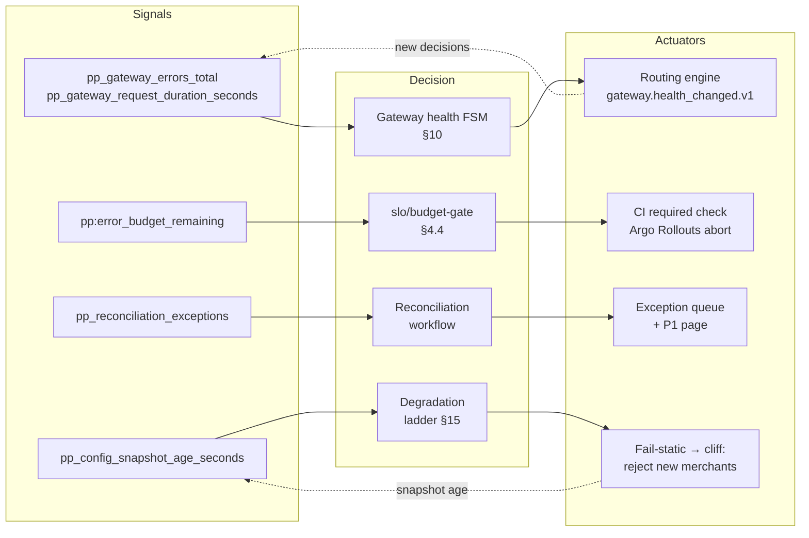
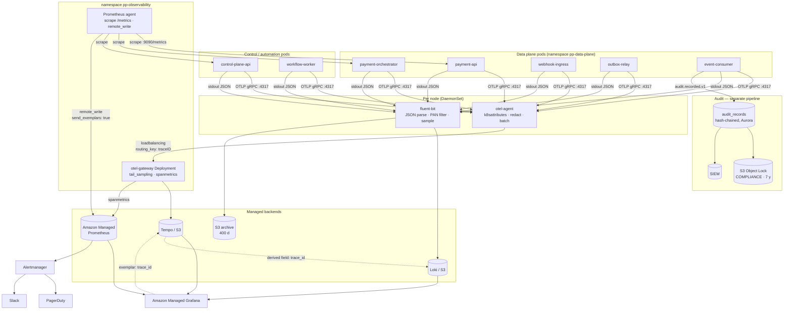
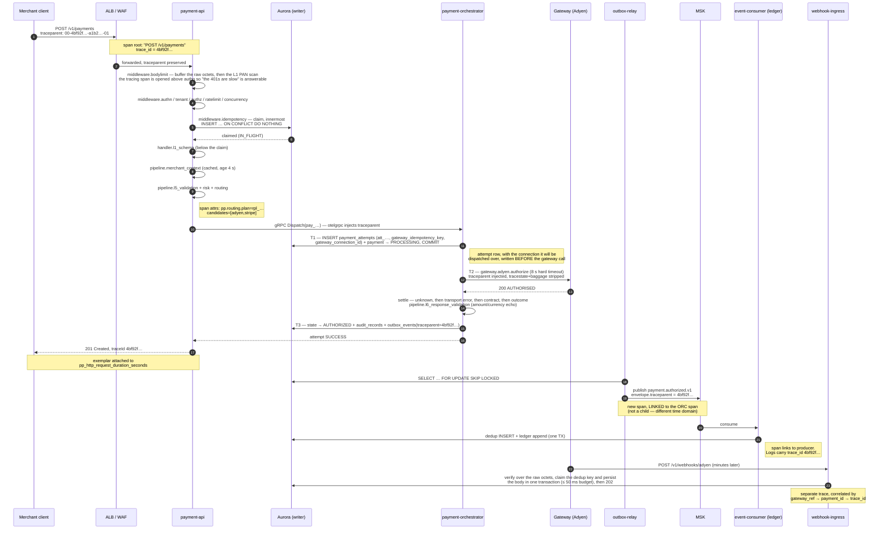

# Observability

> **Purpose:** the complete observability contract — metrics, traces, logs and audit, how they correlate, the alert and SLO burn-rate rules, the dashboards, and the automation those signals drive.
> **Derived from and subordinate to [`docs/spec/00-design-baseline.md`](spec/00-design-baseline.md) §22 (observability contract), §18 (NFR targets), §5 (deployables), §24 (failure catalog), §16.1 (per-tenant metric isolation), §17.2 (redaction).** Where this document disagrees with the baseline, the baseline wins and this document is a defect.

---

## 0. The contract in one page

| Property | Value | Source |
|---|---|---|
| Pillars | Metrics (Prometheus/AMP), Traces (OTLP → Tempo), Logs (structured JSON → Loki), Audit (hash-chained, BC-9, **not** a log) | §22, §3 |
| Mandatory context on every signal | `trace_id`, `span_id`, `correlation_id`, `tenant_id`, `merchant_id`, `payment_id`, `gateway_id`, `service`, `version`, `environment`, `region` | §22.1 |
| Metric prefix | `pp_` — nothing else is scraped from application ports | §22.2 |
| Forbidden metric labels | `merchant_id`, `payment_id`, `attempt_id`, `idempotency_key`, `url`, `user_agent`, raw `error_message` | §22.3 |
| Cardinality ceiling | 10⁴ active series per metric per service; CI lint | §22.3 |
| Data-plane SLO | 99.99 % monthly, p99 ≤ 250 ms excluding gateway time | §18 |
| Control-plane SLO | 99.9 % monthly | §18 |
| Burn-rate policy | 14.4× / 1 h → page; 6× / 6 h → ticket; > 2× → feature freeze; > 10× / 1 h → incident + rollback | §18, §22.4 |
| PII in logs | **None.** Allowlist serialization only | §17.2, §17.3 |
| Retention | Logs 30 d hot / 400 d archive; metrics 15 d raw + 400 d downsampled; traces 7 d (errors 30 d); audit 7 y WORM | §17.3 |

Three rules that are load-bearing and are tested, not merely stated:

1. **Every metric has a question.** A metric that no dashboard panel, alert or runbook query reads is deleted. The registry lint — `scripts/check-metrics-cardinality.sh`, which §3.3 and older drafts also call `scripts/metrics-lint.sh` — fails the build on a forbidden label. Orphan-metric detection is **not** implemented. <!-- doc-refs: allow-missing -->
2. **Cardinality is a budget, not a preference.** `merchant_id` and `payment_id` reach Prometheus only as *exemplar* attachments — never as labels (§22.3). The path from a metric to one merchant is the exemplar, not a label filter.
3. **Audit is not logging.** Audit records are a domain aggregate (BC-9) written in the same transaction as the state change, hash-chained, and retained 7 years. Losing a log line is an inconvenience; losing an audit record is a compliance incident. They never share a pipeline.

---

## 1. The four pillars and how they correlate

### 1.1 What each pillar is for

| Pillar | Answers | Cardinality | Retention | Store | Cost per unit |
|---|---|---|---|---|---|
| **Metrics** | "Is it broken, how broken, since when, for whom (by tier)?" | Low (≤ 10⁴/metric/service) | 15 d raw, 400 d 5-min rollup | Amazon Managed Prometheus | cheapest |
| **Traces** | "Where did *this one* request spend its time, and which call failed?" | Unbounded per-trace, sampled | 7 d (30 d for kept errors) | Tempo (S3-backed) | medium |
| **Logs** | "What exactly happened inside that span, with which rule IDs and error chain?" | Unbounded, sampled at high volume | 30 d hot, 400 d S3 archive | Loki (S3-backed) | expensive at volume |
| **Audit** | "Who did what to which tenant's money or configuration, and can we prove nobody altered the record?" | One record per privileged/state-changing action | 7 y, Object Lock WORM | `audit_records` → S3 | mandatory cost |

### 1.2 The correlation spine

Everything hangs off `trace_id`. The chain is:

```
alert (metric)  ──exemplar──►  trace_id
trace_id        ──log field──►  every log line of every service that touched the request
trace_id        ──event envelope `traceparent`──►  every downstream async consumer
trace_id        ──audit_records.trace_id──►  the audit record for the state change
span attribute  ──payment_id──►  the row in `payments`
```

| Field | Origin | Propagated by | Present in |
|---|---|---|---|
| `trace_id` | W3C `traceparent` from the client, or generated at stage 2 of §12 | HTTP header, gRPC metadata, Kafka header + envelope `traceparent` | span, log, exemplar, audit record, error response `traceId` (§20) |
| `span_id` | OTel SDK | — | span, log |
| `correlation_id` | `X-Correlation-Id` header or generated | header, envelope `correlationid` | log, span attr, event envelope, audit record |
| `request_id` | `X-Request-Id` echoed or generated (§19.3) | header | log, error response `requestId` |
| `causation_id` | the event that caused this one | envelope `causationid` | event, log |
| `tenant_id` | authenticated principal **only** (§16.2) | context.Context | log, span attr, exemplar, audit; metric label only as `tenant_tier` |
| `merchant_id`, `payment_id`, `attempt_id`, `gateway_id` | domain | context.Context | log, span attr, exemplar. **Never a metric label** |

### 1.3 How `trace_id` gets into logs

There is exactly one logger constructor and it takes a `context.Context`. It is impossible to get a logger without one.

```go
// pkg/otelx (stdlib + otel only) and internal/infrastructure/telemetry
func LoggerFrom(ctx context.Context) *slog.Logger {
    l := base // pre-bound with service, version, environment, region
    if sc := trace.SpanContextFromContext(ctx); sc.IsValid() {
        l = l.With(slog.String("trace_id", sc.TraceID().String()),
                   slog.String("span_id", sc.SpanID().String()),
                   slog.Bool("sampled", sc.IsSampled()))
    }
    if t, ok := tenantctx.From(ctx); ok {
        l = l.With(slog.String("tenant_id", t.ID), slog.String("tenant_tier", t.Tier))
    }
    if c, ok := corrctx.From(ctx); ok {
        l = l.With(slog.String("correlation_id", c.CorrelationID),
                   slog.String("request_id", c.RequestID))
    }
    return l
}
```

Enforcement, so this is not a convention that decays:

| Control | Mechanism |
|---|---|
| No package-level logger | `slog.Default()` and `log.*` are banned by `depguard` in `.golangci.yml`; the only exported entry point is `LoggerFrom(ctx)` |
| No log without a span on the request path | Middleware starts the server span at pipeline stage 2 (§12) *before* any handler code runs; a handler cannot observe a context without one |
| No `%+v` on request types | The `forbidigo` rules in `.golangci.yml`, per §17.2. There is no separate `scripts/check-logging.sh` | <!-- doc-refs: allow-missing -->
| Domain layer cannot log | `internal/domain/**` may import stdlib only (§4). Domain code returns errors; the application layer logs them once, at the boundary |

Log-once discipline: an error is logged exactly once, at the outermost boundary that handles it, with the full wrapped chain (`errors.Join` / `%w`). Intermediate layers wrap and return. This is what keeps a single failed payment from producing forty log lines.

### 1.4 How exemplars link metrics to traces

Histogram observations and counter increments carry an exemplar when the span is sampled:

```go
// internal/infrastructure/telemetry/metrics.go
paymentDuration.(prometheus.ExemplarObserver).ObserveWithExemplar(
    elapsed.Seconds(),
    prometheus.Labels{
        "trace_id":    sc.TraceID().String(),
        "payment_id":  paymentID,   // high cardinality — legal here, illegal as a label
        "merchant_id": merchantID,
        "gateway_id":  gatewayID,
    },
)
```

Rules:

- Exemplars are attached to `pp_http_request_duration_seconds`, `pp_gateway_request_duration_seconds`, `pp_workflow_step_duration_seconds`, `pp_payments_total{outcome!="success"}`, and `pp_gateway_errors_total`. Nowhere else — exemplars on every series is a storage problem with no reader.
- OpenMetrics exposition is required (`Accept: application/openmetrics-text`); the AMP remote-write path has `send_exemplars: true`.
- An exemplar's label set is capped at 128 UTF-8 bytes by the OpenMetrics spec. We attach four fields; `trace_id` is the only one an alert query needs, the rest save a hop.
- Errors are **always** sampled (§2.4 tail rule), so an error exemplar always points to a trace that still exists in Tempo. This is not luck; it is the reason the tail sampler keeps all errors.

### 1.5 Alert → the exact failing payment, in under two minutes

The scenario: `PaymentAuthorizationRateDrop` fires for `gateway="adyen"`. What the on-call actually does. Timings are from the last three game days.

**Step 1 (0:00–0:10) — read the alert.** The alert annotation already carries the query, the runbook and the dashboard deep link:

```yaml
annotations:
  summary: "Authorization rate for {{ $labels.gateway }} dropped to {{ printf \"%.1f\" (mul $value 100) }}%"
  runbook: "https://docs.example.com/runbooks/gateway-degradation"
  dashboard: "https://grafana.example.com/d/pp-gateway/gateway-health?var-gateway={{ $labels.gateway }}&from=now-6h"
  query: 'pp:payment_authorization_rate:ratio_rate30m{gateway="adyen"}'
```

**Step 2 (0:10–0:30) — confirm scope and blast radius.** Is it one gateway, one currency, one tier, or everything?

```promql
# Which gateways are affected?
sum by (gateway) (rate(pp_payments_total{outcome="authorized"}[5m]))
  /
sum by (gateway) (rate(pp_payments_total{outcome=~"authorized|declined|failed"}[5m]))

# Is it a specific currency / method?
sum by (currency, payment_method) (rate(pp_payments_total{gateway="adyen",outcome="declined"}[5m]))

# Is the gateway itself slow or erroring, or is it declining cleanly?
sum by (class) (rate(pp_gateway_errors_total{gateway="adyen"}[5m]))
histogram_quantile(0.99, sum by (le, operation)
  (rate(pp_gateway_request_duration_seconds_bucket{gateway="adyen"}[5m])))
pp_circuit_breaker_state{gateway="adyen"}
```

A clean decline spike with flat latency and zero transport errors means the gateway is saying *no*, not failing — a very different runbook branch (issuer/BIN problem, or a merchant configuration change) than a 5xx storm.

**Step 3 (0:30–0:50) — jump from the metric to a trace via an exemplar.** In Grafana, the panel `Gateway error rate by class` has `Exemplars: on`. Click any exemplar dot in the affected window → "Query with Tempo" → the trace opens. No copy-paste, no ID hunting. If working from the CLI instead:

```bash
# Pull an exemplar directly from AMP
curl -s --aws-sigv4 "aws:amp:${AWS_REGION}:aps" \
  "${AMP_URL}/api/v1/query_exemplars" \
  --data-urlencode 'query=pp_gateway_request_duration_seconds_bucket{gateway="adyen"}' \
  --data-urlencode "start=$(date -u -d '-10 min' +%s)" \
  --data-urlencode "end=$(date -u +%s)" \
| jq -r '.data[0].exemplars[-1].labels | "\(.trace_id) \(.payment_id) \(.merchant_id)"'
# 4bf92f3577b34da6a3ce929d0e0e4736 pay_01JB8Z9K2QW3E4R5T6Y7U8I9O0 mrc_01JB8...
```

**Step 4 (0:50–1:10) — read the trace.** The trace shows the full pipeline of §12: which stage burned the budget, the routing plan chosen, the attempt ID, the gateway span with `gateway.status_code`, `gateway.reason_code`, `pp.attempt.outcome`. Span events record the retry decisions and the circuit-breaker state at dispatch time.

**Step 5 (1:10–1:40) — pivot to logs on `trace_id`.** Tempo's "Logs for this span" is pre-wired to Loki via the derived field; or directly:

```logql
{namespace="pp-data-plane"} | json | trace_id="4bf92f3577b34da6a3ce929d0e0e4736"
  | line_format "{{.ts}} {{.level}} {{.service}} {{.msg}} code={{.error_code}} rule={{.rule_id}}"
```

This yields the normalized decline reason, the L6 response-validation outcome, and the exact error chain — with no PAN, no token, no secret, because of the allowlist serializer (§17.2).

**Step 6 (1:40–2:00) — confirm against the system of record.** The payment is now identified; check its authoritative state and every attempt:

```bash
platformctl payment inspect pay_01JB8Z9K2QW3E4R5T6Y7U8I9O0 --show-attempts --show-routing-plan
```

```sql
-- read replica, tenant context set, RLS applies
SET LOCAL app.tenant_id = 'ten_01J...';
SELECT p.id, p.state, p.amount_minor, p.currency, p.version,
       a.id AS attempt_id, a.gateway_id, a.outcome, a.gateway_reason_code,
       a.gateway_idempotency_key, a.created_at, a.completed_at
FROM   payments p
JOIN   payment_attempts a ON a.payment_id = p.id
WHERE  p.id = 'pay_01JB8Z9K2QW3E4R5T6Y7U8I9O0'
ORDER  BY a.created_at;
```

Elapsed: under two minutes, and every hop was a click or a single command. The property that makes this work is not tooling — it is that `trace_id` is on the metric exemplar, on the log line, on the span, on the event envelope and on the audit record, without exception.

**The anti-pattern this replaces:** searching logs by merchant ID and timestamp. That requires knowing the merchant first, which is exactly what the alert does not tell you (because `merchant_id` is not a metric label, by design).

---

## 2. OpenTelemetry architecture

### 2.1 SDK configuration

One initialization function, `telemetry.Init(ctx, cfg)`, called from every `cmd/*` composition root and nowhere else.

```go
res, _ := resource.New(ctx,
    resource.WithFromEnv(),          // OTEL_RESOURCE_ATTRIBUTES
    resource.WithProcess(),
    resource.WithContainer(),
    resource.WithHost(),
    resource.WithAttributes(
        semconv.ServiceName(cfg.Service),           // e.g. "payment-orchestrator"
        semconv.ServiceVersion(cfg.Version),        // git SHA, injected at build
        semconv.ServiceNamespace("payments-platform"),
        semconv.DeploymentEnvironment(cfg.Env),     // dev | staging | prod
        semconv.CloudRegion(cfg.Region),
        semconv.K8SNamespaceName(cfg.K8sNamespace),
        semconv.K8SPodName(cfg.PodName),
        attribute.String("pp.plane", cfg.Plane),    // control | data | automation | observability
    ),
)

tp := sdktrace.NewTracerProvider(
    sdktrace.WithResource(res),
    sdktrace.WithSampler(sdktrace.ParentBased(
        sdktrace.TraceIDRatioBased(cfg.HeadSampleRatio), // 0.10 prod data plane
    )),
    sdktrace.WithBatcher(otlpExporter,
        sdktrace.WithMaxQueueSize(8192),
        sdktrace.WithMaxExportBatchSize(1024),
        sdktrace.WithBatchTimeout(2*time.Second),
        sdktrace.WithExportTimeout(10*time.Second),
    ),
    sdktrace.WithSpanLimits(sdktrace.SpanLimits{
        AttributeCountLimit: 64, EventCountLimit: 32, LinkCountLimit: 8,
        AttributeValueLengthLimit: 1024,
    }),
)
otel.SetTracerProvider(tp)
otel.SetTextMapPropagator(propagation.NewCompositeTextMapPropagator(
    propagation.TraceContext{},   // W3C traceparent / tracestate — canonical
    propagation.Baggage{},        // tenant_tier, tenant_id only; never PII
))
```

| Setting | Value | Reason |
|---|---|---|
| Exporter | OTLP/gRPC to `$(NODE_IP):4317` (agent DaemonSet) | Node-local hop; no cross-AZ traffic charge, survives gateway restarts |
| `WithBatcher` queue | 8192 spans | ~2 s of buffer at peak per pod; drops rather than blocking the request path |
| Export failure | **Never blocks or fails a request.** Dropped spans increment `otelcol_exporter_send_failed_spans` | Telemetry must not be able to take down the money path |
| Span limits | 64 attrs, 1024-byte values | Bounds worst-case memory from a pathological adapter |
| Baggage | `tenant_tier`, `tenant_id` only, with an outbound sanitizer | Baggage crosses the process boundary and is easy to leak; a PII item in baggage would be exported |
| Metrics SDK | **Not used for `pp_*`.** Prometheus client_golang + `/metrics` scrape | Native exemplar support, no push pipeline to keep alive, and a scrape target that works when the collector is down |

Resource attributes are the join keys for every dashboard variable: `service`, `service.version`, `deployment.environment`, `cloud.region`, `pp.plane`, `k8s.namespace.name`, `k8s.pod.name`.

### 2.2 Collector topology

```
pod (SDK, OTLP/gRPC)
   └──► otel-agent  (DaemonSet, hostPort 4317/4318, one per node)
            resource detection · k8sattributes · redaction · batch · probabilistic head-sample confirm
        └──► otel-gateway (Deployment, 3–12 replicas, HPA on CPU + queue size)
                 tail_sampling · routing · span metrics · attribute limits
             ├──► Tempo  (traces, S3 backend)
             ├──► AMP    (span-derived RED metrics via spanmetrics connector)
             └──► S3     (raw span archive for kept errors, 30 d)
```

| Tier | Deployment | Job | Why it exists |
|---|---|---|---|
| **Agent** | DaemonSet, `hostNetwork: false`, hostPort 4317, requests `100m/128Mi`, limits `—/512Mi` | Enrich with k8s metadata, redact, batch, buffer | Node-local means a pod never blocks on a network hop to a remote collector; a gateway rollout does not drop spans |
| **Gateway** | Deployment, 3 min replicas, PDB `minAvailable: 2`, `topologySpreadConstraints` across AZs | Tail sampling (needs the whole trace in one place), span metrics, fan-out to backends | Tail sampling requires trace-complete buffering, which is stateful and must not run per-node |

The agent routes by **trace ID hash** to the gateway (`loadbalancing` exporter with `routing_key: traceID`), so all spans of one trace land on the same gateway replica. Without that, tail sampling sees partial traces and its decisions are wrong.

```yaml
# otel-agent (DaemonSet) — condensed
processors:
  k8sattributes:
    passthrough: false
    extract:
      metadata: [k8s.namespace.name, k8s.pod.name, k8s.node.name, k8s.deployment.name]
  attributes/redact:
    actions:
      - key: http.request.header.authorization   ; action: delete
      - key: http.request.header.idempotency-key ; action: hash
      - key: db.statement                        ; action: delete   # we emit db.operation + db.sql.table instead
      - key: pp.gateway.credential_ref           ; action: delete
  memory_limiter: { check_interval: 1s, limit_percentage: 75, spike_limit_percentage: 20 }
  batch: { timeout: 2s, send_batch_size: 1024, send_batch_max_size: 2048 }
exporters:
  loadbalancing:
    routing_key: traceID
    resolver: { k8s: { service: otel-gateway.observability.svc.cluster.local } }
```

```yaml
# otel-gateway (Deployment) — the tail sampler
processors:
  tail_sampling:
    decision_wait: 12s          # > p99.9 end-to-end (1.5 s SLO) + gateway 8 s timeout + margin
    num_traces: 200000
    expected_new_traces_per_sec: 4000
    policies:
      - name: errors-always
        type: status_code
        status_code: { status_codes: [ERROR] }
      - name: http-5xx-always
        type: numeric_attribute
        numeric_attribute: { key: http.response.status_code, min_value: 500, max_value: 599 }
      - name: slow-always
        type: latency
        latency: { threshold_ms: 1500 }                # the e2e p99 SLO (§18)
      - name: high-value-payments
        type: numeric_attribute
        numeric_attribute: { key: pp.payment.amount_minor, min_value: 50000 }   # ≥ 500.00 major units
      - name: unknown-outcome-always
        type: string_attribute
        string_attribute: { key: pp.attempt.outcome, values: [TIMEOUT_UNKNOWN, ERROR] }
      - name: reconciliation-required
        type: string_attribute
        string_attribute: { key: pp.event.type, values: ["payment.reconciliation_required.v1"] }
      - name: onboarding-always
        type: string_attribute
        string_attribute: { key: pp.workflow.name, values: ["merchant-onboarding@v1"] }
      - name: circuit-open
        type: string_attribute
        string_attribute: { key: pp.circuit.state, values: [OPEN, HALF_OPEN] }
      - name: baseline
        type: probabilistic
        probabilistic: { sampling_percentage: 10 }
```

### 2.3 Sampling strategy and its reasoning

| Layer | Rule | Value |
|---|---|---|
| Head (SDK) | `ParentBased(TraceIDRatioBased(r))` | prod data plane `r = 0.10`; prod control plane `r = 0.25`; automation plane `r = 1.0`; staging `1.0`; dev `1.0` |
| Head override | Force-sample when the request carries `X-Debug-Trace: true` **and** the principal holds `support:debug` | ratio → 1.0 for that trace |
| Tail (gateway) | Keep-all policies above, plus 10 % of everything else | see YAML |
| Effective retained | ~11–13 % of data-plane traces, ~100 % of errors, slow requests and money-relevant edge cases | measured |

Why head sampling at all, if there is a tail sampler? Because head sampling at 10 % cuts the volume the agents ship and the gateways buffer by 10×, and the money-path decisions we care about are recoverable *without* the discarded traces — a discarded trace was, by definition, a fast successful request. Head sampling is `ParentBased`, so a sampled decision made at the edge is honoured by every downstream service and Kafka consumer: **we never keep half a trace.**

Why tail sampling on top? Because the interesting traces are exactly the ones a 10 % random head sample would usually miss: errors, `TIMEOUT_UNKNOWN` attempts, high-value payments, onboarding runs, and anything slower than the 1.5 s e2e SLO. A 10 % chance of having the trace for the payment your merchant is escalating about is not an observability strategy.

Why `decision_wait: 12s`? The longest legitimate trace is a payment whose gateway call runs to the 8 s hard timeout (§12 stage 14), plus retries and the rest of the pipeline. 12 s covers p99.9 with margin. Setting it lower silently truncates exactly the traces the keep-all policies exist to preserve.

The one deliberate asymmetry: **the automation plane traces at 100 %.** Onboarding volume is low (§5), a workflow instance can run for days, and a failed onboarding is a customer-visible, revenue-blocking event that someone will ask about a week later. The cost is negligible; the value is high.

### 2.4 Context propagation

| Transport | Mechanism | Notes |
|---|---|---|
| **HTTP (ingress)** | `otelhttp` handler reads `traceparent`/`tracestate` at pipeline stage 2 (§12). If absent, a root span is created. Always echoed on the response | The client's trace ID is honoured — merchants can correlate with their own systems |
| **HTTP (egress to gateways)** | `otelhttp.NewTransport` injects `traceparent`. **`tracestate` and `baggage` are stripped** on external egress | We do not leak tenant context to Stripe/Adyen/PayPal |
| **gRPC (internal)** | `otelgrpc` stats handler, both directions; mTLS peer identity added as `pp.peer.service` | |
| **Kafka (produce)** | `traceparent` written **both** as a Kafka header and into the event envelope field `traceparent` (§13.1) | The header serves infrastructure tooling; the envelope field survives replay from the outbox, DLQ redrive, and archive-to-S3-and-back, where headers do not |
| **Kafka (consume)** | Consumer extracts from the envelope first, header second; starts a span with a **link** to the producer span rather than a child relationship | A consumer processing a message hours later is causally related but not a child of a finished request. Links express that honestly; parenting it would produce a trace with a 4-hour root span |
| **Outbox relay** | Reads `traceparent` from `outbox_events.traceparent` — written in the same transaction as the state change | The producing request's trace ID reaches Kafka even though the publish happens in a different process, minutes later |
| **Workflow engine** | The workflow instance stores the originating `trace_id` and `correlation_id`; every step span links to it and carries `pp.workflow.id`, `pp.workflow.step` | A 7-day onboarding is not one trace; it is a correlated set of traces plus one `correlation_id` |

The envelope field is not redundant with the Kafka header. Enumerated: outbox → Kafka (header set from envelope), Kafka → DLQ (header preserved), DLQ → S3 archive (headers lost), S3 → redrive (envelope is the only surviving source). Anything that survives serialization into JSON survives the whole pipeline.

### 2.5 Span naming and required attributes

| Span | Name | Required attributes |
|---|---|---|
| HTTP server | `{method} {route_template}` e.g. `POST /v1/payments` | `http.request.method`, `http.route`, `http.response.status_code`, `pp.tenant_id`, `pp.tenant_tier` |
| Pipeline stage | `pipeline.{stage}` e.g. `pipeline.idempotency_claim` | `pp.stage.budget_ms`, `pp.stage.outcome` |
| Gateway call | `gateway.{gateway}.{operation}` e.g. `gateway.adyen.authorize` | `pp.gateway_id`, `pp.operation`, `pp.attempt_id`, `pp.attempt.outcome`, `pp.gateway.idempotency_key_hash`, `pp.circuit.state`, `http.response.status_code` |
| DB | `postgres.{operation} {table}` | `db.system`, `db.operation`, `db.sql.table`. **`db.statement` is dropped by the agent** — parameterized SQL still risks leaking values through some drivers |
| Kafka produce/consume | `{topic} publish` / `{topic} process` | `messaging.system`, `messaging.destination.name`, `messaging.kafka.message.key` (aggregate ID — safe), `pp.event.type` |
| Workflow step | `workflow.{workflow}.{step}` | `pp.workflow.id`, `pp.workflow.step`, `pp.step.attempt`, `pp.step.outcome` |

Span status is `ERROR` **only** when the platform failed. A `422 RISK_DECLINED` or a gateway hard decline is a correct outcome, recorded as `pp.outcome="declined"` with span status `OK`. Marking business declines as span errors would make the "keep all errors" tail policy retain every decline and make error-rate panels meaningless — the single most common way trace-based alerting is destroyed.

### 2.6 Cost control

| Lever | Setting | Effect |
|---|---|---|
| Head sampling | 10 % data plane | 10× reduction at source |
| Tail sampling | 10 % baseline + keep-all rules | ~1.1–1.3× of head-sampled volume retained |
| Span limits | 64 attrs / 1024 B | Bounds pathological traces |
| `db.statement` dropped | agent processor | Largest single attribute removed |
| Trace retention | 7 d default, 30 d for traces kept by an error/unknown policy (routed to a separate Tempo tenant) | Storage weighted to what gets read |
| Log sampling | §5.3 | The dominant cost line |
| Metric cardinality | §3.3 lint | Prevents the classic 100× AMP bill |
| Budget alert | `pp_observability_cost_usd_estimate` recording rule vs. a monthly budget; alerts at 80 % | Cost is a monitored SLI, not a quarterly surprise |

Measured steady-state at 5 000 TPS: ~55 GB/day logs after sampling, ~40 GB/day traces after tail sampling, ~1.4 M active series.

---

## 3. Metrics

### 3.1 The registry (§22.2, expanded)

Every metric below is declared once in `internal/infrastructure/telemetry/metrics.go`, which is the single place a `pp_*` metric may be declared. `scripts/check-metrics-cardinality.sh` enforces the label rules of §22.3 across the tree.

| Metric | Type | Unit | Labels | Question it answers | Exemplars |
|---|---|---|---|---|---|
| `pp_http_requests_total` | counter | requests | `service,route,method,status,tenant_tier` | Rate and error ratio per endpoint — the R and E of RED, and the numerator/denominator of the availability SLI | no |
| `pp_http_request_duration_seconds` | histogram | seconds | `service,route,method` | The D of RED. Is p99 ≤ 250 ms excluding gateway time (§18)? Buckets: `.005 .01 .025 .05 .06 .1 .25 .5 1 2.5 5 10` — `.06` and `.25` are the p50/p99 SLO thresholds, placed so the quantile estimate is exact at the number we are judged on | **yes** |
| `pp_payments_total` | counter | payments | `outcome,currency,payment_method,gateway,tenant_tier` | Business volume and mix. `outcome ∈ {created,authorized,captured,declined,failed,voided,refunded,timeout_unknown}` | yes on non-success |
| `pp_payment_authorization_rate` | gauge (recording rule) | ratio 0–1 | `gateway,currency` | Is the auth rate within 5 pp of the merchant baseline (§22.4)? Derived, never instrumented directly | n/a |
| `pp_gateway_request_duration_seconds` | histogram | seconds | `gateway,operation` | How slow is each gateway, per operation? Feeds the health FSM p99 > 5 s threshold (§10). Buckets: `.05 .1 .25 .5 1 2 3 5 8` — `5` is the UNHEALTHY threshold, `8` the hard timeout | **yes** |
| `pp_gateway_errors_total` | counter | errors | `gateway,operation,class` | Why is a gateway failing? `class ∈ {timeout,transport,http_5xx,http_4xx,contract_violation,auth,rate_limited}`. Drives the health FSM error-rate thresholds | **yes** |
| `pp_circuit_breaker_state` | gauge | enum 0/1/2 | `gateway,operation` | Is traffic being shed from a gateway right now? `0=CLOSED(HEALTHY) 1=HALF_OPEN(PROBING) 2=OPEN(UNHEALTHY)` per §10 | no |
| `pp_idempotency_outcomes_total` | counter | claims | `outcome` (`new,replay,in_progress,conflict`) | Are clients retrying correctly? A `conflict` spike means `IDEMPOTENCY_KEY_REUSED` — a client bug (§14.2). An `in_progress` spike means a retry storm | no |
| `pp_routing_decisions_total` | counter | decisions | `gateway,reason` | Why did traffic move? `reason ∈ {primary,fallback_health,fallback_error,pinned,capability,cost,residency,no_eligible}` | no |
| `pp_workflow_step_duration_seconds` | histogram | seconds | `workflow,step,outcome` | Which onboarding step is the bottleneck or the failure? Buckets tuned to the §11 step timeouts: `.1 .5 1 5 30 60 300 900 1800` | **yes** |
| `pp_workflow_instances` | gauge | instances | `workflow,state` | How many onboardings are in flight, blocked on a manual gate, or `FAILED`? | no |
| `pp_onboarding_duration_seconds` | histogram | seconds | `outcome` | Is the automated portion ≤ 30 min p95 (§18)? Excludes time parked in external-KYC and manual-gate waits — those are separate series so the SLO measures what we control | no |
| `pp_outbox_backlog` | gauge | rows | `topic` | Is the outbox draining? Non-zero and rising means Kafka trouble or a stalled relay (§24) | no |
| `pp_consumer_lag` | gauge | messages | `topic,group` | Are projections, ledger and audit keeping up? | no |
| `pp_config_snapshot_age_seconds` | gauge | seconds | `service` | How stale is the data plane's config? Alert at 300 s; hard cliff at `max_config_staleness` = 900 s (§15) | no |
| `pp_reconciliation_exceptions` | gauge | exceptions | `severity` | How much unresolved money ambiguity exists? A critical exception blocks `→ ACTIVE` (§8) | no |
| `pp_dlq_depth` | gauge | messages | `queue` | What is parked and needs a human? Includes `workflow_dlq` and every `*.dlq` topic | no |

Supporting infrastructure metrics (not `pp_*`, scraped from exporters, referenced by alerts): `kube_*`, `container_*`, `pg_*` (Aurora via CloudWatch exporter), `kafka_*` (MSK), `redis_*`, `otelcol_*`, `argocd_*`, `aws_rds_aurora_global_db_replication_lag` (DR — see `disaster-recovery.md`).

### 3.2 Label value discipline

| Label | Allowed values | Bounded by |
|---|---|---|
| `service` | the 7 deployable names of §5 that run in prod | fixed set |
| `route` | OpenAPI **route template** (`/v1/payments/{paymentId}/capture`), never the concrete path | router-provided; a raw path is a lint failure |
| `status` | `2xx,4xx,5xx` **class** on `pp_http_requests_total`; the exact code is a span attribute and a log field | 3 values |
| `tenant_tier` | `pooled,siloed,enterprise` | 3 values (§16.1) |
| `gateway` | registered gateway IDs | ≤ 10 |
| `currency` | ISO 4217 of enabled currencies | ≤ 40 |
| `payment_method` | `CARD,APPLE_PAY,GOOGLE_PAY,SEPA_DEBIT,IDEAL,…` | ≤ 20 |
| `class`, `reason`, `outcome` | closed enums, declared as Go constants | ≤ 12 each |

`status` being a class rather than an exact code is deliberate: 3 values instead of ~40, and no alert has ever needed to distinguish `502` from `504` at the metric layer — the error model (§20.1) already tells the client what to do, and the exact code is one exemplar hop away.

### 3.3 The cardinality rule and its CI lint

The rule (§22.3): `merchant_id` and `payment_id` are never metric labels; ≤ 10⁴ active series per metric per service.

```bash
# scripts/metrics-lint.sh — runs in CI, fails the build
set -euo pipefail

# 1. Static: forbidden label names anywhere in the registry
if grep -REn '"(merchant_id|payment_id|attempt_id|idempotency_key|user_agent|url|path|error_message|email|ip)"' \
     internal/infrastructure/telemetry/registry.go; then
  echo "FAIL: forbidden high-cardinality metric label"; exit 1
fi

# 2. Static: every pp_ metric is declared exactly once, in the registry
go run ./internal/tools/metricsdoc -check-single-declaration ./...

# 3. Dynamic: boot each binary against testcontainers, drive the smoke suite,
#    scrape /metrics, compute the cartesian product of observed label values
go test ./internal/infrastructure/telemetry -run TestCardinalityBudget -tags=integration

# 4. Orphan check: every pp_ metric is referenced by a dashboard, an alert or a runbook
go run ./internal/tools/metricsdoc -check-referenced \
   -metrics internal/infrastructure/telemetry/registry.go \
   -dashboards deployments/observability/dashboards \
   -rules deployments/observability/rules \
   -runbooks docs/runbooks
```

`TestCardinalityBudget` asserts, per metric, that `product(len(distinct(label_values)))` for the declared label set stays under 10⁴ given the declared enums, and that no label is typed `string` without a corresponding closed enum in the registry. It fails on the *declaration*, before a single series exists in production — the only place where cardinality is cheap to fix.

Runtime backstop, because a lint cannot see a value the code invents at runtime:

```promql
# Alert: a metric is escaping its budget in production
topk(10, count by (__name__, service) ({__name__=~"pp_.+"})) > 10000
```

### 3.4 Recording rules

```yaml
groups:
- name: pp.sli.availability
  interval: 30s
  rules:
  # Payment API availability SLI — denominator excludes 4xx client errors:
  # a client sending a malformed body is not us being unavailable.
  - record: pp:payment_api_requests:rate5m
    expr: sum(rate(pp_http_requests_total{service="payment-api",route=~"/v1/payments.*"}[5m]))
  - record: pp:payment_api_errors:rate5m
    expr: sum(rate(pp_http_requests_total{service="payment-api",route=~"/v1/payments.*",status="5xx"}[5m]))
  - record: pp:payment_api_availability:ratio_rate5m
    expr: 1 - (pp:payment_api_errors:rate5m / clamp_min(pp:payment_api_requests:rate5m, 1e-9))
  # The same at every burn-rate window. Recorded, not computed at alert time,
  # because a 6h rate() over 48 payment-api pods is not something to evaluate every 15s.
  - record: pp:payment_api_error:ratio_rate5m
    expr: sum(rate(pp_http_requests_total{service="payment-api",status="5xx"}[5m]))
          / clamp_min(sum(rate(pp_http_requests_total{service="payment-api"}[5m])), 1e-9)
  - record: pp:payment_api_error:ratio_rate30m
    expr: sum(rate(pp_http_requests_total{service="payment-api",status="5xx"}[30m]))
          / clamp_min(sum(rate(pp_http_requests_total{service="payment-api"}[30m])), 1e-9)
  - record: pp:payment_api_error:ratio_rate1h
    expr: sum(rate(pp_http_requests_total{service="payment-api",status="5xx"}[1h]))
          / clamp_min(sum(rate(pp_http_requests_total{service="payment-api"}[1h])), 1e-9)
  - record: pp:payment_api_error:ratio_rate6h
    expr: sum(rate(pp_http_requests_total{service="payment-api",status="5xx"}[6h]))
          / clamp_min(sum(rate(pp_http_requests_total{service="payment-api"}[6h])), 1e-9)
  - record: pp:payment_api_error:ratio_rate3d
    expr: sum(rate(pp_http_requests_total{service="payment-api",status="5xx"}[3d]))
          / clamp_min(sum(rate(pp_http_requests_total{service="payment-api"}[3d])), 1e-9)

- name: pp.sli.latency
  interval: 30s
  rules:
  # Latency SLI as a "good events" ratio, not a quantile. Quantiles cannot be
  # aggregated or burned down; ratios can.
  - record: pp:payment_api_latency_good:ratio_rate5m
    expr: sum(rate(pp_http_request_duration_seconds_bucket{service="payment-api",le="0.25"}[5m]))
          / clamp_min(sum(rate(pp_http_request_duration_seconds_count{service="payment-api"}[5m])), 1e-9)
  - record: pp:payment_api_latency_bad:ratio_rate5m
    expr: 1 - pp:payment_api_latency_good:ratio_rate5m
  - record: pp:payment_api_latency_bad:ratio_rate30m
    expr: 1 - (sum(rate(pp_http_request_duration_seconds_bucket{service="payment-api",le="0.25"}[30m]))
               / clamp_min(sum(rate(pp_http_request_duration_seconds_count{service="payment-api"}[30m])), 1e-9))
  - record: pp:payment_api_latency_bad:ratio_rate1h
    expr: 1 - (sum(rate(pp_http_request_duration_seconds_bucket{service="payment-api",le="0.25"}[1h]))
               / clamp_min(sum(rate(pp_http_request_duration_seconds_count{service="payment-api"}[1h])), 1e-9))
  - record: pp:payment_api_latency_bad:ratio_rate6h
    expr: 1 - (sum(rate(pp_http_request_duration_seconds_bucket{service="payment-api",le="0.25"}[6h]))
               / clamp_min(sum(rate(pp_http_request_duration_seconds_count{service="payment-api"}[6h])), 1e-9))
  - record: pp:payment_api_latency:p50_5m
    expr: histogram_quantile(0.50, sum by (le) (rate(pp_http_request_duration_seconds_bucket{service="payment-api"}[5m])))
  - record: pp:payment_api_latency:p99_5m
    expr: histogram_quantile(0.99, sum by (le) (rate(pp_http_request_duration_seconds_bucket{service="payment-api"}[5m])))

- name: pp.sli.business
  interval: 30s
  rules:
  # §22.2 defines pp_payment_authorization_rate as a recorded gauge. This is it.
  - record: pp_payment_authorization_rate
    expr: sum by (gateway, currency) (rate(pp_payments_total{outcome="authorized"}[5m]))
          / clamp_min(sum by (gateway, currency)
              (rate(pp_payments_total{outcome=~"authorized|declined|failed"}[5m])), 1e-9)
  - record: pp:payment_authorization_rate:ratio_rate30m
    expr: sum by (gateway) (rate(pp_payments_total{outcome="authorized"}[30m]))
          / clamp_min(sum by (gateway)
              (rate(pp_payments_total{outcome=~"authorized|declined|failed"}[30m])), 1e-9)
  # 7-day trailing baseline, offset one hour so an in-progress incident
  # cannot drag its own baseline down and silence the alert.
  - record: pp:payment_authorization_rate:baseline7d
    expr: avg_over_time(pp:payment_authorization_rate:ratio_rate30m[7d] offset 1h)
  - record: pp:gateway_error:ratio_rate5m
    expr: sum by (gateway, operation) (rate(pp_gateway_errors_total[5m]))
          / clamp_min(sum by (gateway, operation)
              (rate(pp_gateway_request_duration_seconds_count[5m])), 1e-9)
  - record: pp:gateway_latency:p99_5m
    expr: histogram_quantile(0.99, sum by (le, gateway, operation)
            (rate(pp_gateway_request_duration_seconds_bucket[5m])))
  - record: pp:payments:tps5m
    expr: sum(rate(pp_payments_total{outcome="created"}[5m]))

- name: pp.sli.async
  interval: 30s
  rules:
  - record: pp:webhook_processing_lag:p99_5m
    expr: histogram_quantile(0.99, sum by (le)
            (rate(pp_webhook_processing_lag_seconds_bucket[5m])))
  - record: pp:config_propagation:p99_5m
    expr: max(pp_config_snapshot_age_seconds)
  - record: pp:onboarding_duration:p95_1h
    expr: histogram_quantile(0.95, sum by (le)
            (rate(pp_onboarding_duration_seconds_bucket{outcome="completed"}[1h])))
  - record: pp:error_budget_remaining:payment_api
    expr: 1 - (pp:payment_api_error:ratio_rate3d / 0.0001)
```

Two conventions worth stating: `clamp_min(x, 1e-9)` everywhere a rate is a denominator (a zero-traffic window must yield `0`, not `NaN`, or every burn-rate alert flaps at 03:00 on a Sunday), and the `offset 1h` on the authorization baseline (an alert whose threshold is computed from data that includes the incident silences itself precisely when it matters).

### 3.5 Alert catalog

Severity: **P1** pages 24×7; **P2** pages during business hours, ticket otherwise; **P3** ticket only.

| Alert | Expression | For | Sev | Pages | Runbook |
|---|---|---|---|---|---|
| `PaymentAPIFastBurn` | see §4.1 | 2m | P1 | yes | `runbooks/payment-api-availability.md` |
| `PaymentAPISlowBurn` | see §4.1 | 15m | P2 | no | `runbooks/payment-api-availability.md` |
| `PaymentAPILatencyFastBurn` | see §4.2 | 2m | P1 | yes | `runbooks/payment-api-latency.md` |
| `PaymentAPILatencySlowBurn` | see §4.2 | 15m | P2 | no | `runbooks/payment-api-latency.md` |
| `ControlPlaneAvailabilityBurn` | `pp:control_plane_error:ratio_rate1h > 14.4*0.001 and pp:control_plane_error:ratio_rate5m > 14.4*0.001` | 5m | P2 | no | `runbooks/control-plane.md` |
| `PaymentAuthorizationRateDrop` | `(pp:payment_authorization_rate:baseline7d - pp:payment_authorization_rate:ratio_rate30m) > 0.05 and sum by (gateway) (rate(pp_payments_total[30m])) > 0.5` | 10m | P1 | yes | `runbooks/gateway-degradation.md` |
| `AllGatewaysUnhealthy` | `count(pp_circuit_breaker_state{operation="authorize"} == 2) == count(pp_circuit_breaker_state{operation="authorize"})` | 1m | P1 | yes | `runbooks/no-eligible-gateway.md` |
| `GatewayCircuitOpen` | `pp_circuit_breaker_state == 2` | 2m | P2 | no | `runbooks/gateway-degradation.md` |
| `GatewayErrorRateHigh` | `pp:gateway_error:ratio_rate5m > 0.25` | 3m | P2 | no | `runbooks/gateway-degradation.md` |
| `GatewayLatencyHigh` | `pp:gateway_latency:p99_5m > 5` | 5m | P2 | no | `runbooks/gateway-degradation.md` |
| `NoEligibleGatewayErrors` | `sum(rate(pp_http_requests_total{status="5xx",route="/v1/payments"}[5m])) > 0 and on() count(pp_circuit_breaker_state{operation="authorize"} == 2) > 0` | 2m | P1 | yes | `runbooks/no-eligible-gateway.md` |
| `ReconciliationExceptionsCritical` | `pp_reconciliation_exceptions{severity="critical"} > 0` | 5m | P1 | yes | `runbooks/reconciliation.md` |
| `ReconciliationExceptionsRising` | `pp_reconciliation_exceptions{severity=~"high\|medium"} > 25` | 30m | P2 | no | `runbooks/reconciliation.md` |
| `TimeoutUnknownSpike` | `sum(rate(pp_payments_total{outcome="timeout_unknown"}[10m])) / clamp_min(sum(rate(pp_payments_total{outcome="created"}[10m])),1e-9) > 0.01` | 5m | P1 | yes | `runbooks/timeout-unknown.md` |
| `OutboxBacklogGrowing` | `pp_outbox_backlog > 10000 and deriv(pp_outbox_backlog[10m]) > 0` | 10m | P2 | no | `runbooks/outbox.md` |
| `OutboxStalled` | `pp_outbox_backlog > 0 and rate(pp_outbox_published_total[5m]) == 0` | 5m | P1 | yes | `runbooks/outbox.md` |
| `ConsumerLagHigh` | `pp_consumer_lag > 50000` | 10m | P2 | no | `runbooks/consumer-lag.md` |
| `LedgerConsumerLagCritical` | `pp_consumer_lag{group="ledger"} > 10000` | 5m | P1 | yes | `runbooks/consumer-lag.md` |
| `DLQNotEmpty` | `pp_dlq_depth > 0` | 15m | P2 | no | `runbooks/dlq.md` |
| `DLQGrowingFast` | `deriv(pp_dlq_depth[10m]) > 1` | 5m | P1 | yes | `runbooks/dlq.md` |
| `ConfigSnapshotStale` | `pp_config_snapshot_age_seconds > 300` | 2m | P2 | no | `runbooks/config-staleness.md` |
| `ConfigSnapshotCliff` | `pp_config_snapshot_age_seconds > 840` | 1m | P1 | yes | `runbooks/config-staleness.md` |
| `WebhookProcessingLagHigh` | `pp:webhook_processing_lag:p99_5m > 300` | 5m | P1 | yes | `runbooks/webhook-lag.md` |
| `WebhookIngressSlow` | `histogram_quantile(0.99, sum by (le) (rate(pp_http_request_duration_seconds_bucket{service="webhook-ingress"}[5m]))) > 0.05` | 5m | P2 | no | `runbooks/webhook-lag.md` |
| `IdempotencyConflictSpike` | `sum(rate(pp_idempotency_outcomes_total{outcome="conflict"}[10m])) > 1` | 10m | P3 | no | `runbooks/idempotency.md` |
| `IdempotencyInProgressStorm` | `sum(rate(pp_idempotency_outcomes_total{outcome="in_progress"}[5m])) / clamp_min(sum(rate(pp_idempotency_outcomes_total[5m])),1e-9) > 0.2` | 5m | P2 | no | `runbooks/idempotency.md` |
| `WorkflowInstancesFailed` | `pp_workflow_instances{state="FAILED"} > 0` | 15m | P2 | no | `runbooks/onboarding-stuck.md` |
| `WorkflowManualGateAging` | `pp_workflow_instances{state="AWAITING_SIGNAL"} > 20` | 6h | P3 | no | `runbooks/onboarding-stuck.md` |
| `OnboardingSLOBreach` | `pp:onboarding_duration:p95_1h > 1800` | 30m | P3 | no | `runbooks/onboarding-stuck.md` |
| `AuroraReplicaLagHigh` | `aws_rds_aurora_global_db_replication_lag > 5` | 5m | P1 | yes | `runbooks/dr-replication-lag.md` |
| `AuroraFailoverDetected` | `changes(pg_writer_instance_changed_total[10m]) > 0` | 0m | P1 | yes | `runbooks/aurora-failover.md` |
| `RedisUnavailable` | `redis_up == 0` | 1m | P2 | no | `runbooks/redis-loss.md` |
| `KafkaUnderReplicated` | `kafka_cluster_partition_underreplicated > 0` | 5m | P1 | yes | `runbooks/kafka.md` |
| `MetricCardinalityBudgetExceeded` | `count by (__name__, service) ({__name__=~"pp_.+"}) > 10000` | 30m | P3 | no | `runbooks/cardinality.md` |
| `TraceExportFailing` | `rate(otelcol_exporter_send_failed_spans[5m]) > 100` | 10m | P3 | no | `runbooks/otel.md` |
| `AuditChainBroken` | `increase(pp_audit_chain_verification_failures_total[1h]) > 0` | 0m | P1 | yes | `runbooks/audit-integrity.md` |
| `TenantMismatchSpike` | `sum(rate(pp_http_requests_total{status="4xx",route!=""}[5m] offset 0)) and on() sum(rate(pp_security_events_total{type="TENANT_MISMATCH"}[5m])) > 0.1` | 5m | P1 | yes | `runbooks/security-events.md` |
| `PANDetectorHits` | `increase(pp_security_events_total{type="SENSITIVE_DATA_IN_REQUEST"}[15m]) > 0` | 0m | P2 | no | `runbooks/pan-detector.md` |

Every alert carries `runbook`, `dashboard` and `query` annotations, and `severity`, `plane`, `service`, `slo` labels. Alertmanager routes on `severity` and `plane`; it inhibits everything with `plane=data` when `AllGatewaysUnhealthy` or a region-failover alert is active, so a single root cause produces one page, not thirty.

Notably absent, on purpose: CPU, memory and pod-restart alerts. Those are symptoms with no reliable relationship to user pain — they appear on dashboards and in postmortems, and they page only when they cause an SLI to burn. The exceptions are the ones that predict imminent, unrecoverable failure: disk fill on stateful nodes and `OOMKilled` on `payment-orchestrator`.

---

## 4. SLO burn-rate alerting

Error budget for 99.99 % over 30 days = 0.01 % of requests = **4 m 23 s** of full outage equivalent.

Burn rate = (observed error ratio) ÷ (error budget ratio). Burning at 1× exhausts the budget in exactly 30 days.

| Window pair | Burn rate | Budget consumed before firing | Time to exhaustion at that rate | Action |
|---|---|---|---|---|
| 1 h / 5 m | 14.4× | 2 % | ~2 d 1 h | **Page (P1)** |
| 6 h / 30 m | 6× | 5 % | ~5 d | **Ticket (P2)** |
| 3 d (budget remaining) | — | — | — | Freeze policy (§4.4) |

The long window states "this is a real, sustained problem"; the short window states "it is still happening right now". Requiring both is what stops a 5-minute blip from paging and stops a recovered incident from paging for another hour.

### 4.1 Availability burn (payment-api, 99.99 %)

```yaml
- alert: PaymentAPIFastBurn
  expr: |
    (
      pp:payment_api_error:ratio_rate1h > (14.4 * 0.0001)
      and
      pp:payment_api_error:ratio_rate5m > (14.4 * 0.0001)
    )
  for: 2m
  labels: { severity: P1, slo: payment_api_availability, plane: data, page: "true" }
  annotations:
    summary: "payment-api burning error budget at {{ printf \"%.1f\" (div $value 0.0001) }}x — 2% of the 30d budget already gone"
    runbook: "https://docs.example.com/runbooks/payment-api-availability"

- alert: PaymentAPISlowBurn
  expr: |
    (
      pp:payment_api_error:ratio_rate6h > (6 * 0.0001)
      and
      pp:payment_api_error:ratio_rate30m > (6 * 0.0001)
    )
  for: 15m
  labels: { severity: P2, slo: payment_api_availability, plane: data, page: "false" }
```

### 4.2 Latency burn (p99 ≤ 250 ms, 99 % of requests good)

The SLO is expressed as a good-events ratio against the 0.25 s histogram bucket, so budget arithmetic works. Budget = 1 %.

```yaml
- alert: PaymentAPILatencyFastBurn
  expr: |
    (
      pp:payment_api_latency_bad:ratio_rate1h > (14.4 * 0.01)
      and
      pp:payment_api_latency_bad:ratio_rate5m > (14.4 * 0.01)
    )
  for: 2m
  labels: { severity: P1, slo: payment_api_latency, plane: data, page: "true" }

- alert: PaymentAPILatencySlowBurn
  expr: |
    (
      pp:payment_api_latency_bad:ratio_rate6h > (6 * 0.01)
      and
      pp:payment_api_latency_bad:ratio_rate30m > (6 * 0.01)
    )
  for: 15m
  labels: { severity: P2, slo: payment_api_latency, plane: data, page: "false" }
```

The `le="0.25"` bucket boundary exists in the histogram precisely so this ratio is exact rather than interpolated. Changing the SLO number requires adding a bucket first — that is the intended friction.

### 4.3 The other three SLIs (§22.4)

| SLI | SLO | Alert expression |
|---|---|---|
| Authorization success rate | ≥ baseline − 5 pp | `(pp:payment_authorization_rate:baseline7d - pp:payment_authorization_rate:ratio_rate30m) > 0.05`, `for: 10m`, with a `> 0.5 payments/s` volume guard so a low-volume gateway cannot page on three declines |
| Webhook processing lag | p99 ≤ 60 s | `pp:webhook_processing_lag:p99_5m > 300`, `for: 5m` — the SLO is 60 s, the page threshold is 5× that, because between them lies "busy", not "broken" |
| Config propagation | p99 ≤ 30 s | `pp_config_snapshot_age_seconds > 300` (P2) and `> 840` (P1). 840 s is 60 s before the 900 s `max_config_staleness` cliff (§15), giving one minute to react before the data plane starts failing closed for new merchants |

### 4.4 Error-budget policy

Automated in CI and in the deploy pipeline (§18: "Burn > 2× → feature freeze; > 10× in 1 h → incident + rollback").

| Budget remaining (30 d) | State | Enforcement |
|---|---|---|
| > 50 % | **Normal** | Deploys proceed. Canary analysis as usual |
| 25–50 % | **Caution** | Deploys proceed; the release note must state the risk; no schema migrations bundled with feature work |
| 10–25 % | **Freeze (soft)** | Only bug fixes, reliability work and security patches merge. Feature PRs get a failing required check `slo/budget-gate` |
| < 10 %, or sustained burn > 2× | **Freeze (hard)** | `slo/budget-gate` fails on every non-exempt PR; the reliability backlog becomes the sprint |
| Burn > 10× over 1 h | **Incident** | P1 page, automatic Argo Rollouts abort of any in-flight canary, automatic rollback to the last known-good revision |

```promql
# The gate query, run by scripts/slo-gate.sh in the PR pipeline
pp:error_budget_remaining:payment_api          # 1.0 = untouched, 0.0 = exhausted
```

```yaml
- alert: ErrorBudgetPolicyFreeze
  expr: pp:error_budget_remaining:payment_api < 0.25
  for: 30m
  labels: { severity: P3, policy: freeze }
  annotations:
    summary: "Payment API error budget at {{ printf \"%.0f\" (mul $value 100) }}% — deploy freeze tier {{ if lt $value 0.10 }}HARD{{ else }}SOFT{{ end }}"
```

Exemptions require an SRE-lead approval recorded on the PR; the exemption itself is audited. The budget resets on a rolling 30-day window, not on the first of the month — a calendar reset invites shipping risk on the 1st.

---

## 5. Logging

### 5.1 Structured JSON schema

One line, one event, `application/json`, newline-delimited, UTC RFC 3339 with milliseconds. No multi-line output anywhere, including panics (the recovery handler serializes the stack into a single `stack` field).

| Field | Type | Required | Meaning |
|---|---|---|---|
| `ts` | string RFC3339 ms | always | Event time, UTC |
| `level` | enum | always | `DEBUG,INFO,WARN,ERROR` |
| `msg` | string | always | Short, **static** message. Variables go in fields, never interpolated into `msg` — this is what makes the message groupable |
| `service` | string | always | §5 deployable name |
| `version` | string | always | Git SHA |
| `environment` | string | always | `dev,staging,prod` |
| `region` | string | always | `eu-west-1`, … |
| `pod` | string | always | `k8s.pod.name` |
| `trace_id` | hex32 | when in a span | §22.1 |
| `span_id` | hex16 | when in a span | §22.1 |
| `sampled` | bool | when in a span | Lets a query find only lines whose trace is retrievable |
| `correlation_id` | string | request/event scope | §19.3 |
| `request_id` | string | HTTP scope | §19.3 |
| `causation_id` | string | event scope | Envelope `causationid` |
| `tenant_id` | string | tenant scope | §22.1. Present on every request-scoped line |
| `tenant_tier` | enum | tenant scope | `pooled,siloed,enterprise` |
| `merchant_id` | string | merchant scope | §22.1 |
| `payment_id` | string | payment scope | §22.1 |
| `attempt_id` | string | attempt scope | |
| `gateway_id` | string | gateway scope | §22.1 |
| `workflow_id`, `workflow_step` | string | workflow scope | |
| `event_id`, `event_type` | string | event scope | Envelope `id`, `type` |
| `route`, `method`, `status`, `duration_ms` | string/int | HTTP access lines | `route` is the template |
| `outcome` | enum | operation lines | `success,declined,failed,timeout_unknown,replay,…` |
| `amount_minor`, `currency` | int/string | money lines | Minor units, per §7. **Never a float, never a formatted string** |
| `error.code` | string | ERROR/WARN | §20.2 catalog code |
| `error.category` | string | ERROR/WARN | §20.1 category |
| `error.retryable` | bool | ERROR/WARN | §20.1 |
| `error.message` | string | ERROR/WARN | Operator-facing; never contains request data |
| `error.chain` | []string | ERROR | Unwrapped `%w` chain, outermost first |
| `rule_id` | string | validation lines | e.g. `L5.AMOUNT_WITHIN_MERCHANT_LIMIT` (§21) |
| `idempotency_key_hash` | hex | idempotency lines | SHA-256 prefix. **The raw key is never logged** |
| `audit_id` | string | when an audit record was written | Join key into BC-9 |
| `stack` | string | panic recovery only | Single-line-escaped |

Serialization is **allowlist-based** (§17.2): a struct is logged only through a `LogValue()` method that names its permitted fields. There is no reflective fallback. A new field is invisible to logs until someone deliberately adds it — the correct default for a payments platform.

### 5.2 Levels

| Level | When | Volume at 5 000 TPS | Examples |
|---|---|---|---|
| `DEBUG` | Off in prod. Enabled per-service for ≤ 60 min by a `platformctl log-level` command that is audited and auto-reverts | 0 | Routing weight computation, cache hit/miss detail |
| `INFO` | A business-significant event that a human might need to reconstruct later, at most a few per request | ~2 500/s | Payment created, attempt dispatched, state transition, config published, workflow step completed, HTTP access line |
| `WARN` | A degradation the system handled itself. Somebody should know; nobody must act tonight | ~5/s | Retry taken, circuit opened, cache fallback to Postgres, config snapshot stale, idempotency lease reclaimed |
| `ERROR` | The platform failed to do its job for this request, or a state is unrecoverable without intervention | ~0.5/s | 5xx, contract violation, DLQ write, outbox publish failure, audit chain anomaly |

Explicitly **not** `ERROR`: a `422 RISK_DECLINED`, a gateway hard decline, a `409 IDEMPOTENT_REQUEST_IN_PROGRESS`, a `400 VALIDATION_FAILED`. Those are the system working correctly, logged at `INFO` with an `outcome` field. Logging correct business rejections at `ERROR` is how error-rate panels and log-based alerts get abandoned within a quarter.

### 5.3 Sampling of high-volume lines

| Class | Policy | Rationale |
|---|---|---|
| `ERROR`, `WARN` | **Never sampled** | The cheap ones are the ones you need |
| Business-state transitions (`payment.*`, `merchant.*`, config publishes) | **Never sampled** | These reconstruct money history; the audit trail is the legal record but logs are the debugging one |
| HTTP access lines, 2xx | Sampled at 10 %, **plus always kept when `sampled=true`** (the trace exists) or `duration_ms > 250` (SLO breach) | The 2xx access line is the highest-volume, lowest-information line in the system |
| `GET /healthz`, `/readyz`, `/livez`, `/metrics` | **Dropped entirely** at the middleware | Kubelet probes every 5 s × 200 pods = 40 lines/s of nothing |
| Repeated identical `WARN` from one pod | Token bucket: 10 immediately, then 1 per 10 s per `(service, msg, error.code)`, with a `suppressed_count` field on the next emitted line | Prevents a flapping gateway from writing 50 GB in an hour |
| `DEBUG` | Off; when enabled, hard-capped at 500 lines/s/pod with a drop counter | Bounds the blast radius of leaving it on |

Sampling is **consistent by `trace_id`**, not random per line: if a trace is kept, every service's lines for it are kept. A 10 % sample that keeps a random 10 % of the lines of every request produces traces with holes and is worse than useless.

### 5.4 Redaction guarantees

| Guarantee | Mechanism | Test |
|---|---|---|
| No PAN, CVV or track data can be logged | It never enters the process — the L1 PAN detector rejects the request at the edge (§17.2), and the offending value is not included in the rejection log line | `TestPANDetectorNeverLogsTheValue` |
| No secret can be logged | `Secret[T]`'s `String()`, `MarshalJSON()`, `Format()` all return `[REDACTED]`; credentials are only ever this type (§17.2) | `TestSecretNeverSerializes` — fuzzes every formatting verb |
| No struct dumps | `%+v`/`%#v` on request types forbidden by lint; the allowlist serializer has no reflective path | `.golangci.yml` (`forbidigo`); `internal/platform/secret/secret_test.go` |
| No auth material | The HTTP middleware log record has a fixed header allowlist (`content-type`, `user-agent` truncated to 64 B, `idempotency-key` **hashed**); `Authorization`, `Cookie`, `X-Api-Key` are not in it | `TestAccessLogHeaderAllowlist` |
| No bank account numbers | Domain type `BankAccountNumber` logs as `****1234` (last 4 only) | `TestBankAccountRedaction` |
| No PII of merchant principals | Names, emails, addresses, DOBs and KYC document contents are `Secret[T]` or referenced by ID; a KYC artifact is logged as its S3 key and SHA-256, never its content | `TestKYCArtifactLoggingIsReferenceOnly` |
| Defence in depth at the collector | A Fluent Bit Lua filter runs a Luhn-valid 13–19 digit detector over every emitted line; a hit drops the line, increments `pp_log_redaction_drops_total`, and raises a P2 security event | `TestCollectorRedactionCatchesInjectedPAN` — a synthetic canary line containing a test PAN is emitted hourly and must never appear in Loki |

The collector filter is not the primary control; it is the smoke detector that tells us the primary control failed. Its firing is itself an incident.

### 5.5 Retention tiers

| Tier | Contents | Where | Retention | Query latency |
|---|---|---|---|---|
| Hot | All levels, last 30 d | Loki (S3-backed index + chunks) | 30 d | seconds |
| Archive | Same, compressed | S3 Glacier Instant Retrieval, partitioned `env/service/date/` | 400 d | minutes |
| Audit (**separate pipeline**) | `audit_records`, hash-chained | Aurora → S3 with **Object Lock, COMPLIANCE mode** | 7 y | minutes |
| Security events | `pp_security_events_total` detail lines | SIEM (cross-account), immutable | 400 d | seconds |

Deletion: Loki's per-tenant retention plus S3 lifecycle rules. GDPR erasure does **not** delete log objects — logs contain no PII by construction (§17.3), so there is nothing to erase; erasure is crypto-shredding of the tenant data key, and financial records are retained under the legal-obligation basis.

---

## 6. Dashboards

Four dashboards. Anything not on one of them is a query in a runbook, not a panel — dashboards that nobody reads are indistinguishable from dashboards that lie.

Template variables on all four: `$env`, `$region`, `$service`, `$gateway`, `$tenant_tier`, `$interval`.

### 6.1 Executive / business KPIs

Audience: leadership, product, on-call during a customer-visible incident. Refresh 1 m, default range 24 h.

| # | Panel | Type | PromQL |
|---|---|---|---|
| 1 | Payment volume (TPS) | stat + sparkline | `sum(rate(pp_payments_total{outcome="created"}[5m]))` |
| 2 | Authorized value per minute | stat | `sum(rate(pp_payment_authorized_amount_minor_total[5m])) * 60 / 100` (major units; per-currency breakdown in panel 3) |
| 3 | Value by currency | bar gauge | `sum by (currency) (rate(pp_payment_authorized_amount_minor_total[1h])) * 3600 / 100` |
| 4 | Authorization rate | gauge, thresholds 0.90/0.95 | `sum(rate(pp_payments_total{outcome="authorized"}[30m])) / clamp_min(sum(rate(pp_payments_total{outcome=~"authorized\|declined\|failed"}[30m])),1e-9)` |
| 5 | Auth rate vs 7 d baseline | time series, 2 lines | `pp:payment_authorization_rate:ratio_rate30m` and `pp:payment_authorization_rate:baseline7d` |
| 6 | Decline reasons | pie | `topk(8, sum by (reason) (increase(pp_payment_declines_total[24h])))` |
| 7 | Payment mix | stacked area | `sum by (payment_method) (rate(pp_payments_total{outcome="created"}[5m]))` |
| 8 | Gateway share of traffic | stacked area | `sum by (gateway) (rate(pp_routing_decisions_total[5m]))` |
| 9 | Availability SLO, 30 d | stat, 4 decimals | `avg_over_time(pp:payment_api_availability:ratio_rate5m[30d])` |
| 10 | Error budget remaining | bar gauge, thresholds 0.25/0.50 | `pp:error_budget_remaining:payment_api` |
| 11 | Error budget burn-down | time series | `1 - (pp:payment_api_error:ratio_rate3d / 0.0001)` over 30 d |
| 12 | Active merchants | stat | `count(count by (merchant_id) (pp_merchant_state))` — sourced from a low-frequency control-plane exporter, not the hot path |
| 13 | Merchants onboarded (7 d) | stat | `sum(increase(pp_onboarding_duration_seconds_count{outcome="completed"}[7d]))` |
| 14 | Onboarding p95 vs 30 min SLO | stat with threshold at 1800 | `pp:onboarding_duration:p95_1h` |
| 15 | Money at risk: unresolved `TIMEOUT_UNKNOWN` | stat, red if > 0 | `sum(pp_attempts_unresolved{outcome="TIMEOUT_UNKNOWN"})` |
| 16 | Reconciliation exceptions by severity | table | `sum by (severity) (pp_reconciliation_exceptions)` |

Panel 15 is the one an executive should learn to read: it is the count of payments where we do not currently know whether money moved. Its correct value is a small number trending to zero within minutes, and it is the honest headline number for this platform.

### 6.2 Service health (RED), per deployable

Audience: on-call. Repeats one row per `$service`. Refresh 30 s, default range 6 h.

| # | Panel | Type | PromQL |
|---|---|---|---|
| 1 | Request rate by route | time series | `sum by (route) (rate(pp_http_requests_total{service="$service"}[$interval]))` |
| 2 | Error ratio by route | time series, threshold 0.001 | `sum by (route) (rate(pp_http_requests_total{service="$service",status="5xx"}[$interval])) / clamp_min(sum by (route) (rate(pp_http_requests_total{service="$service"}[$interval])),1e-9)` |
| 3 | Latency p50/p90/p99 | time series, 3 series, **exemplars on** | `histogram_quantile(0.99, sum by (le,route) (rate(pp_http_request_duration_seconds_bucket{service="$service"}[$interval])))` (and 0.90, 0.50) |
| 4 | Latency heatmap | heatmap | `sum by (le) (rate(pp_http_request_duration_seconds_bucket{service="$service"}[$interval]))` |
| 5 | Saturation: in-flight requests | time series | `sum by (pod) (pp_http_inflight_requests{service="$service"})` |
| 6 | Saturation: CPU vs request | time series | `sum by (pod) (rate(container_cpu_usage_seconds_total{container="$service"}[5m]))` and `kube_pod_container_resource_requests{container="$service",resource="cpu"}` |
| 7 | CPU throttling | time series, should be flat 0 for latency-sensitive services | `rate(container_cpu_cfs_throttled_seconds_total{container="$service"}[5m])` |
| 8 | Memory vs limit | time series | `container_memory_working_set_bytes{container="$service"}` / `kube_pod_container_resource_limits{container="$service",resource="memory"}` |
| 9 | Replica count vs HPA target | time series, 3 series | `kube_deployment_status_replicas{deployment="$service"}`, `kube_horizontalpodautoscaler_spec_min_replicas`, `_max_replicas` |
| 10 | Restarts / OOMKills | stat | `sum(increase(kube_pod_container_status_restarts_total{container="$service"}[1h]))` |
| 11 | Go runtime: goroutines, heap, GC pause | time series | `go_goroutines{service="$service"}`, `go_memstats_heap_inuse_bytes`, `rate(go_gc_duration_seconds_sum[5m])` |
| 12 | DB pool utilization | time series, threshold 0.8 | `pp_db_pool_in_use{service="$service"} / clamp_min(pp_db_pool_max{service="$service"},1)` |
| 13 | Deploy markers | annotation | ArgoCD sync events overlaid on every panel |
| 14 | Version distribution during rollout | stacked area | `count by (version) (up{service="$service"})` |

### 6.3 Gateway health

Audience: on-call, payments ops. Repeats per `$gateway`. Refresh 30 s.

| # | Panel | Type | PromQL |
|---|---|---|---|
| 1 | Circuit state timeline | state timeline, 0=green 1=amber 2=red | `pp_circuit_breaker_state{gateway="$gateway"}` |
| 2 | Request rate by operation | time series | `sum by (operation) (rate(pp_gateway_request_duration_seconds_count{gateway="$gateway"}[$interval]))` |
| 3 | Error rate by class | stacked time series, **exemplars on** | `sum by (class) (rate(pp_gateway_errors_total{gateway="$gateway"}[$interval]))` |
| 4 | Error ratio vs health thresholds | time series with 0.05 and 0.25 threshold lines (§10) | `pp:gateway_error:ratio_rate5m{gateway="$gateway"}` |
| 5 | Latency p50/p99 vs 5 s threshold | time series, **exemplars on** | `pp:gateway_latency:p99_5m{gateway="$gateway"}` |
| 6 | Authorization rate by gateway | time series | `pp_payment_authorization_rate{gateway="$gateway"}` |
| 7 | Timeout / UNKNOWN rate | time series, red zone > 1 % | `sum(rate(pp_gateway_errors_total{gateway="$gateway",class="timeout"}[$interval])) / clamp_min(sum(rate(pp_gateway_request_duration_seconds_count{gateway="$gateway"}[$interval])),1e-9)` |
| 8 | Routing decisions: why traffic came here | stacked area | `sum by (reason) (rate(pp_routing_decisions_total{gateway="$gateway"}[$interval]))` |
| 9 | Failover events | time series | `sum(rate(pp_routing_decisions_total{reason=~"fallback_.*"}[$interval]))` |
| 10 | Health state changes | table from `gateway.health_changed.v1` | `changes(pp_circuit_breaker_state{gateway="$gateway"}[1h])` |
| 11 | Bulkhead saturation | time series, threshold 0.9 | `pp_gateway_bulkhead_in_use{gateway="$gateway"} / clamp_min(pp_gateway_bulkhead_capacity{gateway="$gateway"},1)` |
| 12 | Contract violations (L6) | time series, should be 0 | `sum(rate(pp_gateway_errors_total{gateway="$gateway",class="contract_violation"}[$interval]))` |
| 13 | Webhook receipt rate & signature failures | time series, 2 series | `sum(rate(pp_webhooks_received_total{gateway="$gateway"}[$interval]))`, `sum(rate(pp_webhooks_rejected_total{gateway="$gateway",reason="signature"}[$interval]))` |
| 14 | Webhook processing lag p99 | time series, threshold 60 | `histogram_quantile(0.99, sum by (le) (rate(pp_webhook_processing_lag_seconds_bucket{gateway="$gateway"}[$interval])))` |
| 15 | Credential age vs 90 d rotation | bar gauge | `(time() - pp_gateway_credential_created_timestamp_seconds{gateway="$gateway"}) / 86400` |

### 6.4 Onboarding funnel

Audience: onboarding ops, customer success, product. Refresh 5 m, default range 30 d.

| # | Panel | Type | PromQL |
|---|---|---|---|
| 1 | Instances by state | bar gauge, ordered by the §8 lifecycle | `sum by (state) (pp_workflow_instances{workflow="merchant-onboarding@v1"})` |
| 2 | Funnel conversion | bar chart, stage-to-stage | `sum(increase(pp_merchant_state_entered_total{state="$stage"}[30d]))` per state, ratio to the previous stage |
| 3 | Step duration p50/p95 | heatmap by step | `histogram_quantile(0.95, sum by (le,step) (rate(pp_workflow_step_duration_seconds_bucket{workflow="merchant-onboarding@v1"}[1h])))` |
| 4 | Slowest steps, ranked | table | `topk(5, histogram_quantile(0.95, sum by (le,step) (rate(pp_workflow_step_duration_seconds_bucket[6h]))))` |
| 5 | Step failure rate | time series by step | `sum by (step) (rate(pp_workflow_step_duration_seconds_count{outcome="failed"}[1h]))` |
| 6 | End-to-end p50/p95 vs 30 min SLO | time series with a 1800 threshold line | `pp:onboarding_duration:p95_1h` |
| 7 | Blocked on manual compliance gate | stat + table with ages | `pp_workflow_instances{state="AWAITING_SIGNAL",step="compliance-review"}` |
| 8 | Manual gate wait time p95 | stat | `histogram_quantile(0.95, sum by (le) (rate(pp_workflow_step_duration_seconds_bucket{step="compliance-review"}[7d])))` |
| 9 | KYC outcomes | pie | `sum by (outcome) (increase(pp_kyc_decisions_total[30d]))` |
| 10 | Certification pass rate by gateway | bar gauge | `sum by (gateway) (increase(pp_certification_runs_total{outcome="passed"}[30d])) / clamp_min(sum by (gateway) (increase(pp_certification_runs_total[30d])),1e-9)` |
| 11 | Certification failures by assertion | table | `topk(10, sum by (assertion) (increase(pp_certification_assertion_failures_total[30d])))` |
| 12 | Compensations executed | time series | `sum by (step) (rate(pp_workflow_compensations_total[1h]))` |
| 13 | Workflow DLQ depth | stat, red if > 0 | `pp_dlq_depth{queue="workflow_dlq"}` |
| 14 | Time-to-first-payment | histogram | `histogram_quantile(0.5, sum by (le) (rate(pp_merchant_time_to_first_payment_seconds_bucket[30d])))` |

Panel 7 is the funnel's real bottleneck in practice: the automated portion has a 30-minute SLO, and the manual compliance gate has a 5-day timeout (§11 step 11). Showing them on one dashboard prevents the recurring "onboarding is slow" conversation from being about engineering when it is about staffing.

---

## 7. The feedback loop: observability drives automation

Observability here is not a read-only dashboard layer. Four closed loops turn signals into automatic action; each is listed with its signal, actuator, latency and manual override.



| Loop | Signal | Threshold | Actuator | Latency | Override |
|---|---|---|---|---|---|
| **Gateway health → routing** | `pp_gateway_errors_total`, `pp_gateway_request_duration_seconds` | error rate > 5 % / 30 s with ≥ 20 samples → `DEGRADED`; > 25 % or p99 > 5 s → `UNHEALTHY`, circuit OPEN (§10) | Health FSM publishes `gateway.health_changed.v1`; routing engine drops the gateway from candidate plans; circuit breaker sheds calls locally | Local circuit: immediate. Cross-pod via Kafka: < 2 s | Operator can force a gateway `UNHEALTHY` or pin a merchant to a gateway via control plane; both audited |
| **Error budget → deploy freeze** | `pp:error_budget_remaining:payment_api` | < 50 % caution, < 25 % soft freeze, < 10 % hard freeze, burn > 10×/1 h → incident | `slo/budget-gate` required GitHub check fails; Argo Rollouts `AnalysisTemplate` aborts an in-flight canary and rolls back | Gate: at PR time. Rollout abort: within one analysis interval (60 s) | SRE-lead exemption on the PR, audited |
| **Reconciliation exceptions → workflow** | `pp_reconciliation_exceptions`, `payment.reconciliation_required.v1` | any `critical`; `high` > 25 for 30 m | Opens a reconciliation case, drives the gateway lookup by deterministic idempotency key (§14.4), escalates to an ops queue if unresolved in 15 m. A critical open exception **blocks** merchant `→ ACTIVE` (§8) | Automatic resolution attempt: seconds. Escalation: 15 m | Ops can resolve an exception manually with a reason code; the resolution is audited and ledger-affecting resolutions are dual-controlled |
| **Config staleness → degradation** | `pp_config_snapshot_age_seconds` | > 30 s SLO breach; > 300 s alert; > 900 s (`max_config_staleness`) cliff | Data plane keeps serving from the last-known-good snapshot (**fail static**); at the cliff it fails closed for *new* merchants while continuing to serve existing ones (§15) | Continuous | Operator may extend `max_config_staleness` for a defined window; audited, and the extension itself alerts |

Two properties make these loops safe rather than dangerous:

- **Every automatic actuator is subtractive.** Health degradation removes a gateway from routing; the budget gate blocks a deploy; the staleness cliff rejects new merchants. None of them adds capability or moves money. An automation bug therefore fails toward *doing less*, which for a payments platform is the survivable direction.
- **Every loop has a metric on the loop itself**: `pp_routing_decisions_total{reason="fallback_health"}` shows the routing loop acting, `pp_workflow_compensations_total` shows the reconciliation loop acting. An automation with no observability of its own is how a flapping circuit breaker goes unnoticed for a week.

---

## 8. Diagrams

### 8.1 Observability architecture



### 8.2 Trace of a payment across services



The second diagram shows the two places where trace structure is a deliberate choice rather than a default: the outbox relay's publish span **links** to the originating span instead of parenting from it (they are in different time domains — parenting would produce a root span whose duration is "however long the outbox took to drain"), and the inbound webhook is a **separate trace** correlated through the payment, because it originates from the gateway, not from us, and forcing it into the original trace would misrepresent causality.

---

## 9. Cross-references

| Topic | Document |
|---|---|
| Failure modes each alert corresponds to | [`docs/failure-handling.md`](failure-handling.md) |
| DR-specific signals (replication lag, failover detection) | [`docs/disaster-recovery.md`](disaster-recovery.md) |
| How the collector, Prometheus and Grafana are deployed | [`docs/deployment.md`](deployment.md) §1, §2 |
| Tests asserting the redaction guarantees | [`docs/testing.md`](testing.md) §6 (security) |
| Audit record structure and hash chaining | [`docs/compliance.md`](compliance.md), [`docs/security.md`](security.md) |
| Gateway health FSM | [`docs/state-machines.md`](state-machines.md), baseline §10 |
