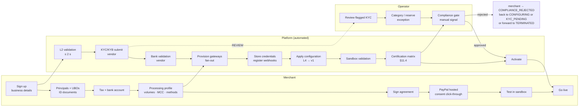
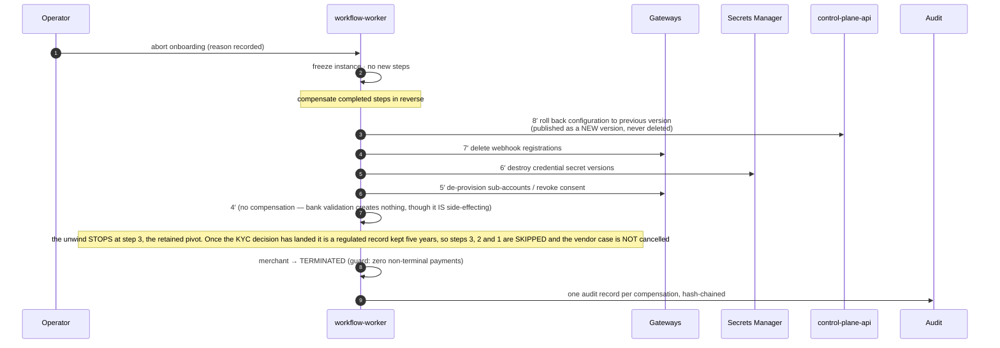
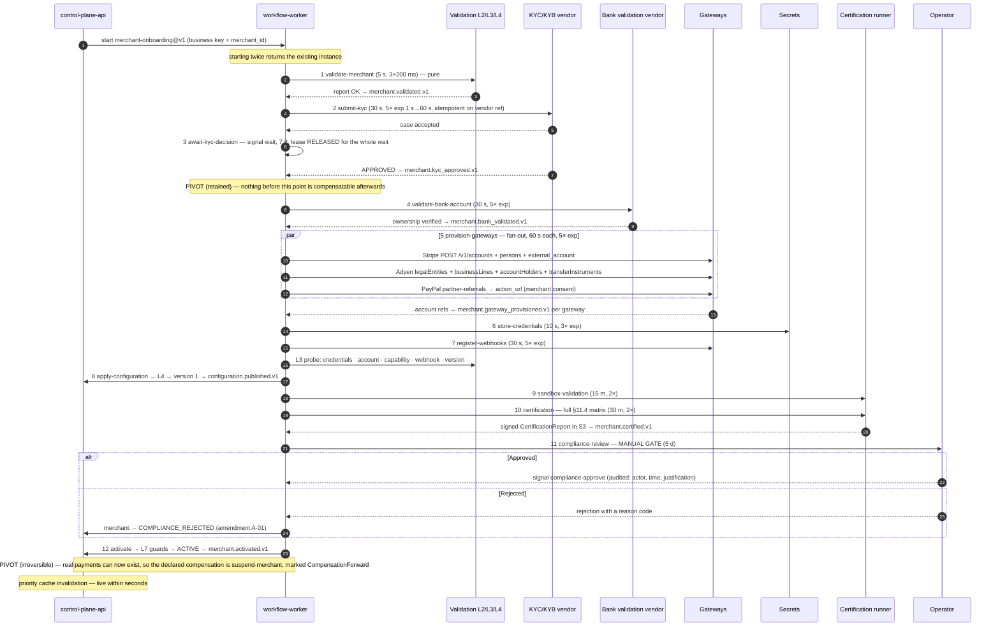
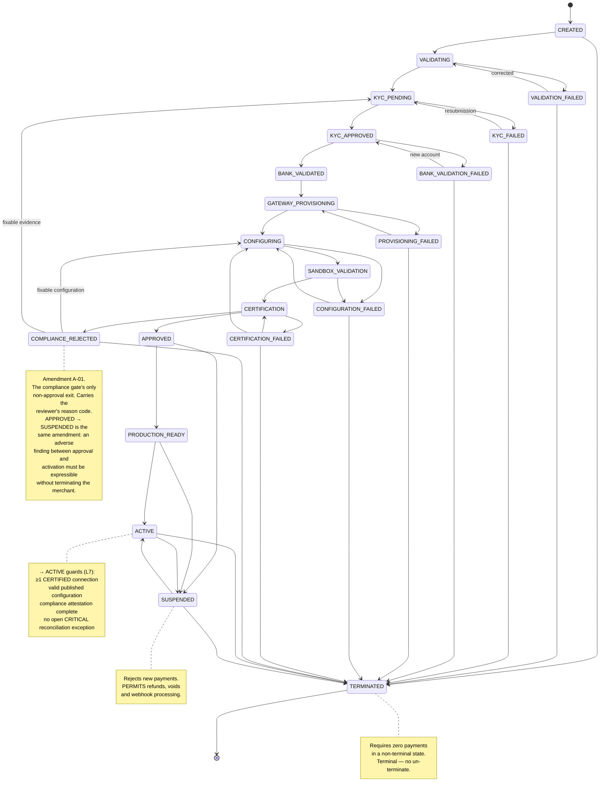

# Merchant Onboarding

> Runtime behaviour of the automation plane: what a merchant submits, what the platform does with it, what a human decides, how gateway accounts are actually provisioned, and how a broken onboarding is unwound.
> Derived from and subordinate to [`docs/spec/00-design-baseline.md`](spec/00-design-baseline.md) — primarily §8 (merchant FSM), §11 (workflow definition), §11.4 (certification), §13 (events), §17 (PCI and regulatory boundaries), §23 (configuration document). Validation rule IDs are defined in [`validation-plane.md`](validation-plane.md). If this file disagrees with the baseline, the baseline wins and this file is a defect.

---

## 1. The journey at a glance



Nine of the twelve workflow steps require no human at all. The three that can involve one are: a KYC/KYB decision that comes back `REVIEW`, a category or reserve exception, and the compliance gate at step 11 — which is a *gate*, not a review: it exists so that a named principal signs off that a merchant may take live money, and the signal itself is audited (§11).

---

## 2. Stage-by-stage: submission, platform action, operator action, merchant view

Stage names map to the merchant FSM (§8). "Merchant sees" is the portal/API state the merchant can observe.

| # | Merchant state | Merchant submits | Platform does | Operator does | Merchant sees |
|---|---|---|---|---|---|
| 1 | `CREATED` | Account signup: legal name, country, contact email, tenant invite code | Creates `Merchant` (`mrc_…`), emits `merchant.created.v1`, starts workflow `merchant-onboarding@v1` keyed on `merchant_id` (starting twice is a no-op returning the existing instance) | — | "Application started" · checklist with 6 sections, 0 complete |
| 2 | `VALIDATING` | Business profile, principals/UBOs, tax IDs, bank account, processing profile (§3) | Step 1 `validate-merchant`: L2 rule set, CollectAll, ≤ 5 s. On failure the case is annotated with every failing rule ID | — | Inline field errors, each mapped from an `L2.*` rule to a remediation string. Merchant edits and resubmits — `VALIDATION_FAILED → VALIDATING` is a legal transition (§8) |
| 3 | `KYC_PENDING` | ID documents, proof of address, incorporation certificate (uploaded to a per-tenant S3 prefix, Object Lock, ≥ 5 y, §17.3) | Steps 2–3: `submit-kyc` (vendor port, 30 s timeout, 5× exp backoff), then `await-kyc-decision` (signal wait, 7 d). Emits `merchant.kyc_approved.v1` / `merchant.kyc_failed.v1` | Reviews vendor `REVIEW` outcomes and PEP/adverse-media hits; records an EDD decision that satisfies `L2.PEP_HIT_IS_MITIGATED` | "Verifying your business — usually under 10 minutes, occasionally up to 2 business days". Live status per principal, never the vendor's raw reason codes |
| 4 | `KYC_APPROVED` → `BANK_VALIDATED` | (nothing new; possibly micro-deposit confirmation) | Step 4 `validate-bank-account`: format checks are L2-local (IBAN mod-97, ABA checksum); ownership verification is vendor (open banking, or 2 micro-deposits). Emits `merchant.bank_validated.v1` | Handles name-mismatch cases where a trading name is legitimate | "Bank account verified" or "Confirm the two deposits in your account" |
| 5 | `GATEWAY_PROVISIONING` | Gateway selection (or accepts the tenant default); PayPal requires a **hosted consent click-through** | Step 5 `provision-gateways`, fan-out per selected gateway, 60 s timeout each, 5× exp. Creates the connected account / sub-merchant (§5). Emits `merchant.gateway_provisioned.v1` per gateway | Resolves gateway-side `currently_due` requirements the merchant cannot satisfy alone | Per-gateway progress: `PENDING → PROVISIONING → PROVISIONED → CERTIFIED`, with any outstanding gateway requirements surfaced verbatim |
| 6 | `CONFIGURING` | Configuration choices: currencies, methods, routing preference, limits, webhook endpoint | Step 6 `store-credentials` (secrets port, envelope-encrypted, IAM path `/{env}/{tenant}/{merchant}/{gateway}`), step 7 `register-webhooks`, step 8 `apply-configuration` (L4 validation → version 1 → `configuration.published.v1`) | Applies reserve terms or limit ceilings agreed commercially | "Configuration applied — version 1". L4 failures render as per-field errors with rule IDs |
| 7 | `SANDBOX_VALIDATION` | Optional: runs their own integration against sandbox | Step 9 `sandbox-validation`, 15 m timeout, 2 retries. A smoke subset of the certification matrix per enabled combination | — | Live test results table; sandbox API keys available |
| 8 | `CERTIFICATION` | — | Step 10 `certification`: the full §11.4 matrix over every `(gateway, method, currency)`. Produces a signed `CertificationReport` in S3. Emits `merchant.certified.v1` | Investigates individual assertion failures with the gateway | Certification matrix with a pass/fail cell per assertion and a downloadable report |
| 9 | `APPROVED` | — | Step 11 `compliance-review`: **manual gate**, blocks until an authorized principal signals `POST /v1/merchants/{id}/onboarding/signals/compliance-approve`. 5 d timeout | **Signs the gate.** Reviews the risk profile, the certification report, reserve terms and any EDD record | "Final review" — no action required from the merchant |
| 10 | `PRODUCTION_READY` | Accepts production terms | Guards evaluated (`L7.ACTIVATION_REQUIRES_*`): ≥ 1 `CERTIFIED` connection, valid published configuration, attestation complete, no open `CRITICAL` reconciliation exception | — | Production credentials issued; go-live button enabled |
| 11 | `ACTIVE` | First live payment | Step 12 `activate`: merchant FSM `→ ACTIVE`, emits `merchant.activated.v1`, which **priority-invalidates** the data-plane cache so the merchant can transact within seconds | — | "Live". Dashboard switches to production |

Suspension and termination are lifecycle events, not onboarding stages: `ACTIVE ⇄ SUSPENDED` is available to an operator *and* to the automation plane (risk breach, compliance expiry, gateway de-provisioning), and suspension rejects new payments while permitting refunds, voids and webhook processing (§8).

---

## 3. Data collected per stage, and the validation applied

Every field below maps to at least one L2 rule. The mapping is exhaustive by CI check (`TestEveryOnboardingFieldHasAValidation`).

### 3.1 Business information

| Field | Type / format | Required | Validation |
|---|---|---|---|
| `legalName` | string 2–200, NFKC-normalized | always | `L2.LEGAL_NAME_PRESENT`, `L2.REGISTRY_RECORD_MATCHES` (vendor) |
| `tradingName` | string 2–200 | optional | length only; used for statement descriptor derivation |
| `businessType` | enum: `SOLE_TRADER \| PARTNERSHIP \| LLC \| CORPORATION \| NON_PROFIT \| PUBLIC_BODY` | always | `L2.BUSINESS_TYPE_IS_KNOWN` |
| `registrationNumber` | country-specific (UK CRN 8, DE HRB, US EIN 9) | unless sole trader | `L2.REGISTRATION_NUMBER_FORMAT_VALID`, `L2.REGISTRY_STATUS_IS_ACTIVE` |
| `incorporationCountry` | ISO 3166-1 alpha-2 | always | `L2.INCORPORATION_COUNTRY_SUPPORTED`, `L2.COUNTRY_NOT_SANCTIONED` |
| `operatingCountries[]` | ISO 3166-1 alpha-2 | always | `L2.OPERATING_COUNTRIES_SUBSET_OF_TENANT`, `L2.COUNTRY_NOT_SANCTIONED` |
| `registeredAddress` | line1, line2, city, region, postalCode, country | always | postal format per country; `L2.PRINCIPAL_ADDRESS_COMPLETE` analogue |
| `websiteUrl` | HTTPS URL, public host | always for e-commerce | `L2.WEBSITE_IS_HTTPS`, `L2.WEBSITE_REACHABLE` (W), `L2.WEBSITE_HAS_POLICY_PAGES` (W) |
| `businessDescription` | string 20–2 000 | always | feeds `L2.MCC_CONSISTENT_WITH_DESCRIPTION` (W) |
| `supportEmail`, `supportPhone` | RFC 5322 / E.164 | always | format |
| `dataResidencyRegion` | enum of tenant-permitted regions | always | `L2.DATA_RESIDENCY_DECLARED` |

### 3.2 KYB and principals / UBOs

| Field | Required | Validation |
|---|---|---|
| `principals[].role` | ≥ 1 with a control role | `L2.AT_LEAST_ONE_PRINCIPAL` |
| `principals[].firstName/lastName` | always | presence |
| `principals[].dateOfBirth` | always | `L2.PRINCIPAL_IS_ADULT` |
| `principals[].residentialAddress` | always | `L2.PRINCIPAL_ADDRESS_COMPLETE` |
| `principals[].nationalIdLast4` or full ID per jurisdiction | vendor-dependent | passed straight to the KYC vendor; **never persisted in our stores in plaintext** — a vendor reference is stored instead |
| `principals[].ownershipPercent` | for UBOs | `L2.UBO_COVERAGE_COMPLETE` (≥ 25 % rule), `L2.UBO_OWNERSHIP_SUMS_PLAUSIBLE` |
| `principals[].isPEP` | declared + screened | `L2.PEP_HIT_IS_MITIGATED` |
| `documents[]` | ID front/back, proof of address, incorporation certificate | `L2.PRINCIPAL_ID_DOCUMENT_PRESENT`; stored in S3 under `s3://{bucket}/{tenant_id}/kyc/{merchant_id}/…` with Object Lock, KMS CMK per tenant |
| Screening outcomes | vendor | `L2.NO_SANCTIONS_HIT`, `L2.ADVERSE_MEDIA_WITHIN_TOLERANCE` (W) |

Sanctions detail is deliberately **not** shown to the merchant (`L2.NO_SANCTIONS_HIT`'s remediation is "contact compliance") — tipping-off is a regulatory offence in most jurisdictions.

### 3.3 Tax

| Field | Required | Validation |
|---|---|---|
| `taxIdentifiers[].type` | enum: `EIN`, `VAT`, `UTR`, `ABN`, `GST`, `TIN` | `L2.TAX_ID_PRESENT_FOR_COUNTRY` |
| `taxIdentifiers[].value` | country format | `L2.TAX_ID_CHECKSUM_VALID`, `L2.VAT_NUMBER_VERIFIED` (W, VIES) |
| `taxIdentifiers[].country` | ISO 3166-1 | consistency with `incorporationCountry` |

### 3.4 Bank account

| Field | Required | Validation |
|---|---|---|
| `bankAccounts[].country` | ISO 3166-1 | `L2.BANK_ACCOUNT_COUNTRY_SUPPORTS_CURRENCY` |
| `bankAccounts[].currency` | ISO 4217 | same |
| `bankAccounts[].scheme` | `IBAN \| ACH \| BACS \| SEPA \| BECS` | drives which identifier fields are required |
| `bankAccounts[].iban` / `routingNumber` + `accountNumber` / `sortCode` + `accountNumber` | per scheme | `L2.BANK_ACCOUNT_FORMAT_VALID` (mod-97, ABA checksum, sort-code format) |
| `bankAccounts[].holderName` | always | `L2.BANK_ACCOUNT_OWNERSHIP_VERIFIED` (vendor) |
| derived `fingerprint` | SHA-256 of normalized identifiers | `L2.BANK_ACCOUNT_NOT_SHARED` |

Account numbers are stored envelope-encrypted with a per-tenant CMK and are surfaced masked (`••••4321`) everywhere including logs and the audit trail.

### 3.5 Processing profile

| Field | Required | Validation |
|---|---|---|
| `mcc` | ISO 18245, 4 digits | `L2.MCC_IS_VALID`, `L2.MCC_NOT_PROHIBITED`, `L2.MCC_CONSISTENT_WITH_DESCRIPTION` (W) |
| `expectedMonthlyVolume` | Money | `L2.EXPECTED_VOLUME_WITHIN_TIER` |
| `averageTicket` | Money | `L2.AVERAGE_TICKET_CONSISTENT` (W) |
| `expectedCurrencies[]`, `expectedMethods[]`, `expectedCountries[]` | always | feed L4's `L4.EVERY_CURRENCY_METHOD_PAIR_ROUTABLE` at configuration time |
| `businessModel` | enum: `ONE_OFF \| SUBSCRIPTION \| MARKETPLACE \| PLATFORM` | drives whether mandate and MIT capability are required of the gateways |
| `fulfilmentDelayDays` | integer 0–365 | high delay + high volume is a reserve trigger (`L2.HIGH_RISK_PROFILE_HAS_RESERVE`) |
| `chargebackHistory` | optional prior-processor statement | feeds the onboarding risk score |

### 3.6 Compliance

| Field | Required | Validation |
|---|---|---|
| `attestation.signedBy`, `signedAt`, `ip`, `documentVersion` | always | `L2.COMPLIANCE_ATTESTATION_SIGNED` |
| `pciSaq.type`, `validUntil`, `documentRef` | only if the merchant touches card data | `L2.PCI_SAQ_ON_FILE` — merchants using our hosted fields stay on SAQ-A (§17.1) |
| `riskProfile.score` | computed | `L2.RISK_SCORE_BELOW_AUTO_DECLINE`, `L2.RISK_SCORE_BELOW_REVIEW` (W) |

---

## 4. Automation: what runs itself, what waits on a vendor, what waits on a human

Target durations are p95 for the automated portion; §18 targets ≤ 30 min automated (p95) excluding external KYC SLA.

| Step | Class | Target duration | Blocking dependency | Notes |
|---|---|---|---|---|
| 1 `validate-merchant` | **Fully automated** | 400 ms | none — pure L2 rules | 5 s timeout, 3 × 200 ms retry |
| 2 `submit-kyc` | **Vendor-dependent** | 2 s to submit | KYC provider API | Idempotent on the vendor reference key |
| 3 `await-kyc-decision` | **Vendor-dependent**, occasionally human | 4 min p50, 6 h p95, 7 d timeout | vendor decision; `REVIEW` → operator | The dominant variance in the whole journey, and explicitly excluded from the §18 target |
| 4 `validate-bank-account` | **Vendor-dependent** | 3 s (open banking) or 2 business days (micro-deposits) | bank validation provider | Open banking is used where available precisely to avoid the 2-day path |
| 5 `provision-gateways` | **Fully automated** for Stripe and Adyen; **merchant-dependent** for PayPal | 8 s per gateway (parallel fan-out); PayPal adds a merchant click-through of unbounded duration | gateway APIs | See §5 |
| 6 `store-credentials` | **Fully automated** | 600 ms | Secrets Manager | |
| 7 `register-webhooks` | **Fully automated** | 1.5 s per gateway | gateway APIs | |
| 8 `apply-configuration` | **Fully automated** | 300 ms | L4 + control plane | Publishes version 1 |
| 9 `sandbox-validation` | **Fully automated** | 90 s | gateway sandboxes | 15 m timeout |
| 10 `certification` | **Fully automated** | 6 min for a 3 × 2 × 2 matrix | gateway sandboxes | 30 m timeout; the long pole is webhook round-trips |
| 11 `compliance-review` | **Human gate** | 4 h p50, 5 d timeout | authorized principal | The signal is audited with actor, time and justification |
| 12 `activate` | **Fully automated** | 200 ms | FSM guards | Priority cache invalidation |

**Aggregate.** Automated wall-clock from a complete, clean submission to `PRODUCTION_READY`: **≈ 8–10 minutes**, dominated by certification. Realistic end-to-end including a fast KYC decision and the compliance gate: **4–6 hours**. Including a micro-deposit bank validation or a `REVIEW` KYC outcome: **2–3 business days**. The platform reports all three separately — `pp_onboarding_duration_seconds` is labelled by outcome, and the automated-portion histogram excludes signal-wait steps, because mixing them makes the metric meaningless.

---

## 5. Gateway provisioning

Every gateway is reached through an adapter behind the same SPI; no gateway type appears in `internal/domain` (§3, ACL). What differs is entirely inside the adapter, and it differs a great deal.

```go
type Provisioner interface {
    Provision(ctx, ProvisionRequest) (ProvisionResult, error)   // idempotent on external ref
    RegisterWebhook(ctx, WebhookRequest) (WebhookResult, error) // idempotent on URL
    Status(ctx, AccountRef) (AccountStatus, error)              // charges/payouts/requirements
    Deprovision(ctx, AccountRef) error                          // compensation
}
```

Idempotency: each adapter passes a deterministic external reference derived from `merchant_id` (Stripe `metadata[platform_merchant_id]` + an `Idempotency-Key` header, Adyen `reference`, PayPal `tracking_id`). Re-running step 5 after a crash finds the existing account rather than creating a second one — which matters because a duplicate connected account is not something the gateway will let you delete.

### 5.1 Stripe — Connect connected account

| Phase | Call | Key fields |
|---|---|---|
| Create account | `POST /v1/accounts` (`Idempotency-Key: prov-{merchant_id}-stripe`) | `type=custom` (or `controller[*]` under the newer model), `country`, `email`, `business_type`, `business_profile[mcc]`, `business_profile[url]`, `business_profile[product_description]`, `company[name]`, `company[tax_id]`, `company[registration_number]`, `company[address][*]`, `company[phone]`, `capabilities[card_payments][requested]=true`, `capabilities[transfers][requested]=true`, `tos_acceptance[date]`, `tos_acceptance[ip]`, `metadata[platform_merchant_id]` |
| Upload documents | `POST /v1/files` (multipart) | `purpose=identity_document` → returns `file_…` |
| Add persons | `POST /v1/accounts/{acct}/persons` per principal | `first_name`, `last_name`, `dob[day\|month\|year]`, `address[*]`, `relationship[representative]`, `relationship[owner]`, `relationship[director]`, `relationship[percent_ownership]`, `relationship[title]`, `id_number` or `ssn_last_4`, `verification[document][front\|back]` |
| Attach payout account | `POST /v1/accounts/{acct}/external_accounts` | `external_account[object]=bank_account`, `country`, `currency`, `routing_number`, `account_number`, `account_holder_name`, `account_holder_type` |
| Poll readiness | `GET /v1/accounts/{acct}` | asserts `charges_enabled`, `payouts_enabled`, `requirements.currently_due == []`, `requirements.disabled_reason == null` — these back `L3.ACCOUNT_CHARGES_ENABLED`, `L3.ACCOUNT_PAYOUTS_ENABLED`, `L3.ACCOUNT_HAS_NO_OPEN_REQUIREMENTS` |
| Webhook | `POST /v1/webhook_endpoints` | `url`, `enabled_events[]` = `payment_intent.*`, `charge.*`, `charge.dispute.*`, `payout.*`, `account.updated`; `connect=true` for platform-level Connect events. Response `secret` = `whsec_…` |
| Per-request account scoping | header `Stripe-Account: acct_…` on every payment call | the connection stores `acct_…`, never a separate API key |
| API version | header `Stripe-Version: 2026-06-30.acacia` | pinned per connection (`L3.API_VERSION_PINNED`) |

Stripe's model gives us no per-merchant secret to store — the platform key plus `Stripe-Account` is the credential. That simplifies rotation (one key) and concentrates blast radius (one key), which is why the platform key lives in its own secret path with a 30-day rotation and dual-run overlap.

### 5.2 Adyen — balance platform account holder

| Phase | Call | Key fields |
|---|---|---|
| Legal entity (organization) | `POST /lem/v3/legalEntities` | `type=organization`, `organization.legalName`, `organization.registrationNumber`, `organization.registeredAddress`, `organization.type`, `organization.taxInformation[]`, `reference={merchant_id}` |
| Legal entities (individuals) | `POST /lem/v3/legalEntities` per principal/UBO | `type=individual`, `individual.name`, `individual.birthData.dateOfBirth`, `individual.residentialAddress`, `individual.identificationData` |
| Link ownership | `POST /lem/v3/legalEntities/{orgId}` (update) | `entityAssociations[]` with `type=uboThroughOwnership \| signatory \| director`, `legalEntityId`, `jobTitle` |
| Business line | `POST /lem/v3/businessLines` | `legalEntityId`, `service=paymentProcessing`, `industryCode` (MCC), `webData[].webAddress`, `salesChannels[]` |
| Documents | `POST /lem/v3/documents` | `owner{type,id}`, `type=identityCard \| bankStatement \| registrationDocument`, `attachments[].content` (base64) |
| Account holder | `POST /bcl/v2/accountHolders` | `legalEntityId`, `balancePlatform`, `description`, `reference={merchant_id}` |
| Balance account | `POST /bcl/v2/balanceAccounts` | `accountHolderId`, `defaultCurrencyCode` |
| Payout instrument | `POST /lem/v3/transferInstruments` | `legalEntityId`, `type=bankAccount`, `bankAccount.accountIdentification` (IBAN or local), `bankAccount.countryCode`, `bankAccount.trustedSource=false` |
| Poll readiness | `GET /lem/v3/legalEntities/{id}` and `GET /bcl/v2/accountHolders/{id}` | asserts `capabilities.receivePayments.allowed`, `capabilities.sendToTransferInstrument.allowed`, `verificationStatus=valid`, `problems[]` empty |
| Webhook | `POST /v3/merchants/{merchantId}/webhooks` (Management API), then `POST .../webhooks/{id}/generateHmac` | `type=standard`, `url`, `communicationFormat=json`, `active=true`, basic-auth credentials; HMAC key returned once and stored |
| Credential | API key created via `POST /v3/companies/{companyId}/apiCredentials` with role allowlist | per-connection API key, envelope-encrypted |
| API version | path-embedded (`/v71`, `/lem/v3`) | pinned per connection |

Adyen's model is the most granular — the legal-entity graph mirrors the UBO structure we already collected, which is why §3.2's ownership fields are modelled as a graph rather than a flat list.

### 5.3 PayPal — partner-referral sub-merchant

| Phase | Call | Key fields |
|---|---|---|
| Partner referral | `POST /v2/customer/partner-referrals` | `tracking_id={merchant_id}`, `partner_config_override{return_url, ...}`, `operations[].operation=API_INTEGRATION` with `rest_api_integration{integration_method: PAYPAL, integration_type: THIRD_PARTY, third_party_details.features: [PAYMENT, REFUND, PARTNER_FEE, DELAY_FUNDS_DISBURSEMENT, ACCESS_MERCHANT_INFORMATION]}`, `products: ["PPCP"]`, `legal_consents[{type: SHARE_DATA_CONSENT, granted: true}]`, `business_entity{business_type, business_industry{mcc}, names, addresses, phones, emails}` |
| Merchant action | response `links[rel="action_url"]` | **The merchant must open this URL and consent in PayPal's hosted flow.** This is the one provisioning step the platform cannot complete alone, and it is why the workflow models step 5 as fan-out with a per-gateway signal wait for PayPal |
| Poll readiness | `GET /v1/customer/partners/{partner_id}/merchant-integrations/{merchant_id}` | asserts `payments_receivable == true`, `primary_email_confirmed == true`, `oauth_integrations[]` non-empty, `products[].vetting_status == SUBSCRIBED`, `capabilities[]` includes the requested features |
| Webhook | `POST /v1/notifications/webhooks` | `url`, `event_types[]` = `PAYMENT.CAPTURE.*`, `CUSTOMER.DISPUTE.*`, `MERCHANT.ONBOARDING.COMPLETED`, `MERCHANT.PARTNER-CONSENT.REVOKED` |
| Signature verification | `POST /v1/notifications/verify-webhook-signature` | certificate-based, not HMAC — the adapter caches the cert by `PAYPAL-CERT-URL` with pinning to `*.paypal.com` |
| Credential | platform OAuth client credentials + `PayPal-Auth-Assertion` header carrying the merchant ID | no per-merchant secret; token cached with a 9-hour TTL and refreshed at 80 % |

`MERCHANT.PARTNER-CONSENT.REVOKED` is subscribed deliberately: a merchant can revoke our access from inside PayPal at any time, and the platform must react by marking the connection `UNHEALTHY` and, if it was the only connection, moving the merchant toward `SUSPENDED` rather than discovering it on the next payment.

### 5.4 Credential storage

| Property | Implementation |
|---|---|
| Location | AWS Secrets Manager, path `/{env}/{tenant_id}/{merchant_id}/{gateway}` (§16.1) |
| Encryption | KMS CMK per environment; per-tenant CMK for the siloed tier; application-level envelope encryption on top, so a Secrets Manager compromise alone is insufficient |
| Type discipline | credentials only ever exist as `Secret[T]`, whose `String()`, `MarshalJSON()` and `Format()` return `[REDACTED]` (§17.2) |
| What we store | Stripe: the platform key (shared) + `acct_…` per connection. Adyen: per-connection API key + webhook HMAC key. PayPal: platform OAuth client + merchant ID for the auth assertion |
| Metadata | `gateway_credentials_meta` holds the reference, fingerprint, `created_at`, `expires_at`, `rotated_at` — **never the material** |
| Rotation | ≤ 90 days, automated workflow with dual-run overlap: create new → verify with an L3 probe → switch the reference → keep the old version live for 24 h → destroy. `L3.CREDENTIAL_ROTATION_NOT_OVERDUE` warns at 90 days |
| Access | IRSA per deployable; the orchestrator's role can read `/{env}/*/*/*` under a prefix condition; the control plane can write. `workflow-worker` can write during provisioning only |
| Audit | every read and write emits an audit record with actor, purpose and connection ID |

### 5.5 Webhook registration

| Concern | Contract |
|---|---|
| URL | `https://webhooks.{env}.example.com/v1/webhooks/{gateway}` — one endpoint per gateway per environment, not per merchant. Merchant attribution comes from the payload's account reference. |
| Idempotence | registration is keyed on `(gateway, url)`; re-running step 7 finds the existing registration and reconciles the event subscription rather than creating a duplicate |
| Secret handling | returned once, stored immediately, never logged. `L3.WEBHOOK_SECRET_STORED` verifies the stored fingerprint against what the gateway reports |
| Verification | `L3.WEBHOOK_ENDPOINT_REGISTERED`, `L3.WEBHOOK_SUBSCRIPTION_COMPLETE`, `L3.WEBHOOK_SIGNATURE_SCHEME_SUPPORTED` run at provisioning and on the 5-minute scheduled probe |
| Drift | a webhook registration deleted at the gateway is detected by the probe within 5 minutes and re-created by a repair workflow — this is the "desired vs actual state" reconciliation of §2 applied to provisioning |

---

## 6. Sandbox validation and certification

### 6.1 Sandbox validation (step 9)

A fast smoke pass: for each `(gateway, method, currency)` the merchant enabled, one authorize → capture → refund round-trip plus one webhook round-trip. Purpose is to fail fast on a misconfiguration before spending 30 minutes on the full matrix. 15 m timeout, 2 retries; failure → `CONFIGURATION_FAILED`, which is recoverable back to `CONFIGURING` (§8).

### 6.2 The certification matrix (§11.4, binding)

Certification is a machine-checked matrix, not a checkbox. For every `(gateway, payment_method, currency)` combination the merchant enabled, all seven assertions must pass:

| # | Assertion | What it proves | Typical mechanism |
|---|---|---|---|
| C1 | Authorize → Capture → Refund round-trip succeeds in sandbox | The happy path works end to end | approved test card, capture full, refund full |
| C2 | Authorize → Void succeeds | Reversal works before real money is at risk | approved test card, void without capture |
| C3 | A declined test card yields a mapped `DECLINED` outcome with a normalized reason code | The ACL maps errors correctly | gateway's decline test card; asserts `L6.DECLINE_REASON_IS_MAPPABLE` and `L6.DECLINE_CLASS_IS_KNOWN` |
| C4 | A webhook is received, signature-verified, and moves the payment state | The async loop is closed | waits ≤ 120 s for the gateway's own webhook, verifies signature, asserts the state transition |
| C5 | 3DS challenge flow reaches `REQUIRES_ACTION` and completes | SCA compliance | 3DS test card, automated challenge completion in the sandbox ACS |
| C6 | Duplicate submission with the same idempotency key returns the same result | Idempotency works in the real integration | replays the same request; asserts identical gateway transaction ID |
| C7 | Amount and currency echoed by the gateway match what we sent | L6 response validation is real | asserts `L6.AMOUNT_ECHO_MATCHES`, `L6.CURRENCY_ECHO_MATCHES` |

Matrix size for a typical merchant — 2 gateways × 2 methods × 2 currencies × 7 assertions = **56 assertions**, ≈ 6 minutes wall clock, parallelized per gateway with the per-gateway bulkhead respected so certification cannot starve production traffic.

Combinations are skipped, not failed, when the descriptor does not support them (e.g. C5 for a bank-debit method): the report records `SKIPPED` with a reason, and a skipped C5 on a card method is a **failure**, not a skip.

### 6.3 Report format

The run produces a signed, immutable `CertificationReport` in `s3://{bucket}/{tenant_id}/certification/{merchant_id}/{run_id}.json` with Object Lock, referenced from the merchant record. `PRODUCTION_READY` is unreachable without a passing report (§11.4), and `L3.CERTIFICATION_REPORT_PASSING` re-checks it on every scheduled probe with a 180-day freshness bound.

```json
{
  "reportId": "rcn_01JB8Z9K2QW3E4R5T6Y7U8I9O0",
  "schemaVersion": "1.0",
  "merchantId": "mrc_01JB…", "tenantId": "ten_01J…",
  "environment": "sandbox",
  "startedAt": "2026-08-26T09:14:02Z", "completedAt": "2026-08-26T09:20:11Z",
  "platformVersion": "2026.8.3", "adapterVersions": { "stripe": "1.14.2", "adyen": "1.9.0" },
  "apiVersions": { "stripe": "2026-06-30.acacia", "adyen": "v71" },
  "configurationVersion": 1,
  "overall": "PASS",
  "summary": { "total": 56, "passed": 54, "skipped": 2, "failed": 0 },
  "matrix": [
    {
      "gateway": "stripe", "paymentMethod": "CARD", "currency": "USD",
      "result": "PASS",
      "assertions": [
        { "id": "C1", "name": "authorize_capture_refund", "result": "PASS",
          "durationMs": 3120,
          "evidence": { "paymentId": "pay_01JB…", "gatewayTxnIds": ["pi_3Q…","re_8H…"],
                        "states": ["CREATED","PROCESSING","AUTHORIZED","CAPTURED","REFUNDED"] } },
        { "id": "C3", "name": "declined_card_maps_correctly", "result": "PASS",
          "evidence": { "gatewayCode": "card_declined/generic_decline",
                        "normalizedReason": "DO_NOT_HONOUR", "declineClass": "SOFT" } },
        { "id": "C4", "name": "webhook_round_trip", "result": "PASS",
          "evidence": { "eventId": "evt_1Q…", "signatureScheme": "HMAC_SHA256_T_V1",
                        "latencyMs": 2840, "stateAfter": "CAPTURED" } },
        { "id": "C6", "name": "idempotent_replay", "result": "PASS",
          "evidence": { "idempotencyKey": "cert-…", "firstTxnId": "pi_3Q…", "replayTxnId": "pi_3Q…" } },
        { "id": "C7", "name": "amount_currency_echo", "result": "PASS",
          "evidence": { "sent": {"amount": 8450, "currency": "USD"},
                        "echoed": {"amount": 8450, "currency": "USD"} } }
      ]
    },
    {
      "gateway": "adyen", "paymentMethod": "SEPA_DEBIT", "currency": "EUR",
      "result": "PASS",
      "assertions": [
        { "id": "C5", "name": "three_ds_challenge", "result": "SKIPPED",
          "reason": "descriptor: 3DS not applicable to SEPA_DEBIT" }
      ]
    }
  ],
  "failures": [],
  "signature": {
    "algorithm": "ECDSA_P256_SHA256",
    "keyId": "arn:aws:kms:eu-west-1:…:key/…",
    "value": "MEUCIQD…",
    "signedDigest": "sha256:7c1f…"
  }
}
```

A `FAIL` report is stored too — certification failures are evidence, and re-running certification never overwrites a prior run.

---

## 7. Failure and recovery

### 7.1 KYC failure

| Vendor outcome | Merchant state | What the merchant sees | Path forward |
|---|---|---|---|
| `REJECTED` — document quality, mismatch, unreadable | `KYC_FAILED` | Which principal, which document, what is wrong — the *category*, from a fixed enum, never the vendor's raw text | Re-upload → `KYC_FAILED → KYC_PENDING` (§8, resubmission is a legal transition). The workflow resumes at step 2 with a **new** vendor reference key; the prior case is cancelled by the step-2 compensation |
| `REJECTED` — identity could not be verified after 3 attempts | `KYC_FAILED` | "We could not verify identity for `<principal>`. You may submit a different principal or contact support." | Substitute a principal, or escalate to manual review with certified documents |
| `REVIEW` | stays `KYC_PENDING` | "Additional review in progress" | Operator decides; the decision arrives as a workflow signal and is audited |
| Sanctions hit | `KYC_FAILED` → typically `TERMINATED` | "We are unable to proceed. Please contact compliance." — deliberately uninformative | Compliance-owned, out of band. No self-service path exists and none should |
| Vendor unavailable / step retries exhausted | workflow `FAILED`, merchant stays `KYC_PENDING` | "Verification is temporarily delayed" | Step payload lands in the workflow DLQ with the full error chain; an operator replays it once the vendor recovers. **The merchant state does not move** — a vendor outage must not look like a rejection |
| 7-day signal timeout | `KYC_FAILED` | "Your application expired" | Re-onboarding (§7.4) |

### 7.2 Provisioning failure

Step 5 fans out per gateway; partial success is the normal case and is modelled explicitly.

| Failure | Detection | Response |
|---|---|---|
| One gateway of three fails, ≥ 1 succeeds | fan-out result | Onboarding **continues** with the successful connections. The failed one is recorded `PROVISIONING_FAILED` at the *connection* level; the merchant stays on the main path. A merchant with one certified gateway can go live. |
| All gateways fail | fan-out result | `GATEWAY_PROVISIONING → PROVISIONING_FAILED` (§8). Retryable back to `GATEWAY_PROVISIONING` |
| Gateway returns `currently_due` requirements | `L3.ACCOUNT_HAS_NO_OPEN_REQUIREMENTS` | Not a failure — a wait. The requirements are surfaced verbatim to the merchant, the connection sits in `PROVISIONED` but not `CERTIFIED`, and a poller re-checks every 15 min for 30 days |
| PayPal consent never completed | signal timeout, 14 d | The PayPal connection is abandoned; other gateways proceed. The merchant can start it again from the portal at any time |
| Provisioning succeeded at the gateway but our commit failed | reconciliation probe by external ref | The next run finds the account by `metadata[platform_merchant_id]` / `reference` / `tracking_id` and adopts it. **This is why the external reference is deterministic** — without it, a crash between "account created" and "row committed" leaks an orphan account at the gateway that we can never find again |
| Credential storage fails (step 6) | step error | Compensation deletes the secret version; step retries. If it exhausts retries, the connection is de-provisioned by the step-5 compensation so we do not hold an account we cannot authenticate to |
| Webhook registration fails (step 7) | step error | Retries 5× exp. Terminal failure de-registers what was registered and fails the step; the merchant cannot certify without C4, so proceeding would be dishonest |

### 7.3 Cleaning up a partially-onboarded merchant

Abort runs the compensations of completed steps in **strict reverse order** (§11), each idempotent, each audited. Compensation is triggered by an operator abort, by a terminal step failure that the policy marks non-resumable, or by the merchant withdrawing.

The unwind is bounded below by the **retained pivot** at step 3. `await-kyc-decision` declares `CompCancelKYCCase`, and that compensation is real *while the case is still pending* — aborting before the decision genuinely cancels it. Once the decision has landed, the record is retained by law, the engine skips step 3 and everything before it, and an abort therefore never reaches steps 2 or 1. Cancelling the vendor case after a decision would stop the process but could not un-submit the data, which is why the pivot is `PivotRetained` rather than simply "not compensatable".



| Artifact | Disposition on cleanup | Why |
|---|---|---|
| Gateway sub-account | De-provisioned where the gateway supports it; **marked abandoned** where it does not (PayPal consent can be revoked but the account persists) | Honest about what is actually reversible |
| Credentials | Secret versions destroyed with a 7-day recovery window | Recoverable in case the abort was a mistake |
| Webhook registrations | Deleted | An orphan registration delivers events for a merchant that no longer exists |
| Configuration | Rolled back by publishing the previous document **as a new version** | Configuration history is strictly append-only (§23) |
| KYC artifacts and decisions | **Retained ≥ 5 years**, immutable, Object Lock (§17.3) | AML obligation. This is not cleaned up and must not be |
| Merchant row, onboarding case, workflow history | Retained; merchant → `TERMINATED` | `→ TERMINATED` requires zero payments in a non-terminal state (§8) |
| Personal data on erasure request | Crypto-shredded (tenant data key destroyed); financial and AML records retained under the legal-obligation basis (§17.3) | GDPR and AML are both satisfied by making the data unreadable rather than absent |

`TERMINATED` is terminal (§8). There is no un-terminate.

### 7.4 Re-onboarding

| Situation | Path |
|---|---|
| Failed at validation, KYC, bank, provisioning, configuration or certification | **Resume in place.** Every one of these has a retry edge in the FSM (`VALIDATION_FAILED → VALIDATING`, `KYC_FAILED → KYC_PENDING`, `BANK_VALIDATION_FAILED → KYC_APPROVED`, `PROVISIONING_FAILED → GATEWAY_PROVISIONING`, `CONFIGURATION_FAILED → CONFIGURING`, `CERTIFICATION_FAILED → CERTIFICATION \| CONFIGURING`). The workflow instance is the same one, resumed from its last checkpoint; no completed step is replayed |
| `SUSPENDED` and remediated | `SUSPENDED → ACTIVE`, an operator action with the `ACTIVE` guards re-evaluated. No re-onboarding |
| `TERMINATED`, merchant returns | **A new merchant.** New `mrc_…`, new onboarding case, new workflow instance. The prior record is linked as `predecessorMerchantId` for audit and for risk scoring — a merchant who was terminated for cause and returns under a new legal entity is exactly what the link exists to surface |
| Same legal entity, different tenant | Genuinely a new merchant: `merchant_id` is unique within a tenant, and tenants are isolation boundaries (§16). KYC is re-run; vendor caching may make it fast, but the decision is per-tenant |
| Certification expired (> 180 days) | `L3.CERTIFICATION_REPORT_PASSING` fails on the scheduled probe → connection marked for re-certification. A re-certification workflow runs the matrix against production-safe sandbox credentials without touching the merchant's live state |

---

## 8. The saga



Engine guarantees that make the saga safe (§11): every step's result is checkpointed before the next begins; resuming replays no completed step; an aborted instance runs compensations in strict reverse order, stopping at the retained pivot; a step that exhausts its retries goes `FAILED → DLQ` with the full error chain, and the instance moves to `COMPENSATING` if the step was compensatable or `FAILED` if it was terminal-technical; a manual gate blocks until an authorized principal signals it, releasing its lease for the whole wait, and the signal is itself audited.

**A timeout is not a retry.** A step marked `SideEffecting` that times out goes to `AMBIGUOUS`, not `RETRY_SCHEDULED`, and its next attempt begins with a lookup before it acts. `validate-merchant` timing out is transient because nothing external could have happened; the identical timeout on `submit-kyc` is ambiguous because the vendor may have created the case. Note that `validate-bank-account` declares no compensation but *is* `SideEffecting`, because a penny-drop moves money and a duplicate submission would initiate a second micro-deposit.

---

## 9. Merchant lifecycle



**Amendment A-01** is what makes step 11 honest. Without `COMPLIANCE_REJECTED` the manual gate had no exit other than approval, so a compliance officer's rejection was unrepresentable — the workflow would have had to lie by recording `CERTIFICATION_FAILED`, blaming the integration for a policy decision, or hang until its five-day timeout. The state is non-terminal by design and routes back to `CONFIGURING` for a fixable configuration (a prohibited MCC/country combination, say), back to `KYC_PENDING` for fixable evidence, or forward to `TERMINATED`.

Every state above has a retry edge except the terminal ones, and that is the design intent: onboarding failures are overwhelmingly *correctable data*, not *rejected merchants*, and a workflow that forces a restart on a mistyped VAT number converts a two-minute fix into a lost customer.
