# Payment Flows

> End-to-end runtime narratives for every payment scenario the platform supports: actors, state transitions, events, ledger entries, idempotency behaviour, failure branches, and reconciliation.
> Derived from and subordinate to [`docs/spec/00-design-baseline.md`](spec/00-design-baseline.md) — primarily §9 (payment FSM and invariants), §12 (pipeline and the timeout rule), §13 (events), §14 (idempotency), §24 (failure modes). Mechanism detail lives in [`data-plane.md`](data-plane.md); rule IDs in [`validation-plane.md`](validation-plane.md). If this file disagrees with the baseline, the baseline wins and this file is a defect.

---

## 0. Conventions used throughout

**Actors.** `CUS` customer/browser · `MER` merchant server · `API` `payment-api` · `ORC` `payment-orchestrator` · `GW` gateway (Stripe/Adyen/PayPal) · `WHI` `webhook-ingress` · `REL` `outbox-relay` · `CON` `event-consumer` (ledger, notifications) · `REC` reconciler · `PG` Aurora.

**Ledger model.** A *shadow* ledger (§A1) — we never hold funds. Double-entry, minor units, balanced per entry group (`L7.LEDGER_ENTRY_BALANCED`), append-only (`L7.LEDGER_IS_APPEND_ONLY`); corrections are reversing entries, never edits.

| Account | Kind | Meaning |
|---|---|---|
| `gateway_receivable:{gw}:{mrc}` | asset | Money the gateway owes this merchant |
| `merchant_revenue:{mrc}` | income | Gross captured |
| `fee_expense:{mrc}` | expense | Processing and scheme fees |
| `refund_expense:{mrc}` | contra-income | Refunded gross |
| `dispute_holding:{mrc}` | asset (contra) | Funds withheld pending a dispute |
| `chargeback_expense:{mrc}` | expense | Disputes lost |
| `merchant_bank_clearing:{mrc}` | asset | Settled to the merchant's bank |

**Authorization writes no ledger entry.** A hold is not a movement of money. It is recorded as a memo on the payment and on the attempt. The first ledger entry in any card flow is at capture. This is the single most common modelling error in payment ledgers and it produces a balance sheet that overstates receivables by every uncaptured authorization.

**Running example.** Merchant `mrc_01JB…`, payment `pay_01JB…`, **USD 84.50** (`amount = 8450`), card, US. Gateway fee 275 minor (2.90 % + 30).

---

## 1. Card sale — auto-capture

The default: one API call, one gateway call, money captured.

| Aspect | Detail |
|---|---|
| Actors | MER → API → ORC → GW; then GW → WHI (confirmation), REL → CON (ledger) |
| Transitions | `CREATED → PROCESSING → CAPTURED` (§9: `PROCESSING → CAPTURED` directly for auto-capture methods) |
| Attempt | one attempt, `PENDING → DISPATCHED → SUCCESS` |
| Events | `payment.created.v1` (v1), `payment.attempted.v1` (v2), `payment.captured.v1` (v3) |
| Ledger | at capture: **DR** `gateway_receivable` 8450 / **CR** `merchant_revenue` 8450; **DR** `fee_expense` 275 / **CR** `gateway_receivable` 275 → net receivable 8175 |
| Idempotency | key claimed at stage 8, completed at stage 17 with the `201` snapshot; any retry replays it |
| Failure branches | soft decline → §10 failover · hard decline → §11 · timeout → §9 · L6 echo mismatch → no transition, reconciliation exception |

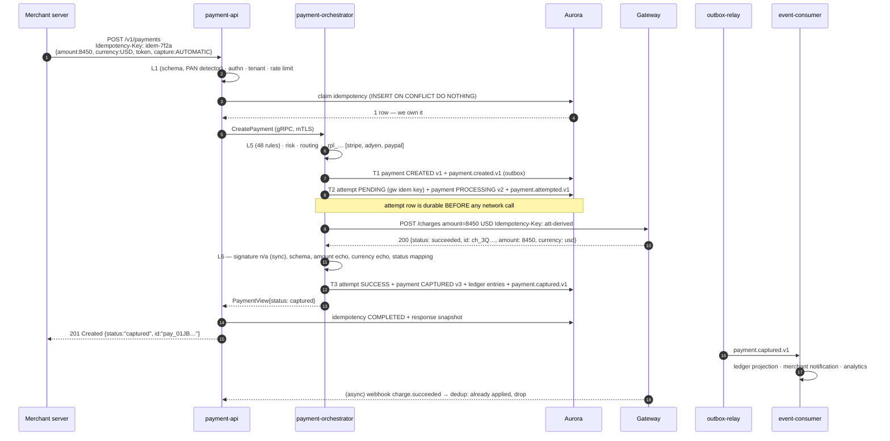

The webhook that arrives after a synchronous success is a duplicate by design. It is signature-verified, deduped on `(gateway, event_id)`, counted, and dropped (§24). The system must be correct whether the synchronous response or the webhook arrives first — that property is what makes §9's timeout branch survivable.

---

## 2. Authorization + later capture

| Aspect | Detail |
|---|---|
| Actors | MER → API → ORC → GW (twice, hours apart) |
| Transitions | `CREATED → PROCESSING → AUTHORIZED` … then `AUTHORIZED → CAPTURED` |
| Attempts | authorization attempt `SUCCESS`; the capture is **not** a new attempt — it is an operation against the same connection (sticky affinity is forced, data-plane §4.5) |
| Events | `payment.created.v1`, `payment.attempted.v1`, `payment.authorized.v1`; later `payment.captured.v1` |
| Ledger | **none at authorization** · at capture: DR `gateway_receivable` 8450 / CR `merchant_revenue` 8450; DR `fee_expense` 275 / CR `gateway_receivable` 275 |
| Idempotency | two independent scopes: `POST /v1/payments` with key `A`, `POST /v1/payments/{id}/capture` with key `B` (§14.1 scope includes `path_template`) |
| Guards on capture | `L5.PAYMENT_STATE_PERMITS_OPERATION`, `L5.CAPTURE_AMOUNT_WITHIN_AUTHORIZED` (I2), `L5.CAPTURE_WITHIN_AUTH_VALIDITY` |
| Failure branches | auth expires before capture → `AUTHORIZED → EXPIRED` by the auth-expiry sweeper (a legal transition; the sweeper acts on gateway-confirmed expiry or the descriptor's validity window, never on a guess) · capture declined → payment stays `AUTHORIZED`, capture returns `422`/`502`, merchant may retry or void |

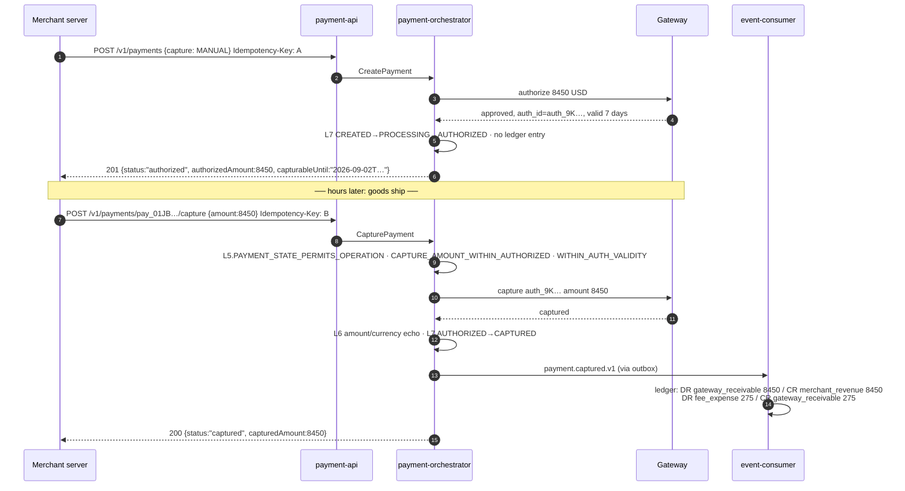

---

## 3. Partial capture

The merchant ships part of the order. Two captures of 5000 and 3450 against an 8450 authorization.

| Aspect | Detail |
|---|---|
| Transitions | `AUTHORIZED → CAPTURED` on the **first** capture. There is no `PARTIALLY_CAPTURED` state (§9) — the payment is `CAPTURED` with `capturedAmount < authorizedAmount`, which the client reads from the amounts, not the state. |
| Guards | each capture: `capturedTotal + amount ≤ authorizedAmount` (I2, `L7.CAPTURED_NOT_EXCEED_AUTHORIZED`); `captureCount < config.limits.maxPartialCaptures`; every candidate gateway must declare partial-capture support (`L4.MAX_PARTIAL_CAPTURES_SUPPORTED`) |
| Events | `payment.captured.v1` **per capture**, each carrying `capturedAmount` and `capturedTotal`; consumers are keyed by `payment_id` so ordering within the payment is guaranteed (§13.3) |
| Ledger | per capture, at its own amount and its own fee — fees are per-capture at most gateways, so 5000 → fee 175, 3450 → fee 130 |
| Idempotency | one key per capture. Reusing capture key `B` for the second capture returns the **first** capture's response (a replay), which is the correct and often surprising behaviour — the client must mint a new key per capture. |
| Residual | after the final capture, the uncaptured 0 remainder is released by the gateway; if the merchant captures less than the authorization and does not intend to capture more, an explicit void of the remainder is the clean action |
| Failure branches | third capture attempt when `maxPartialCaptures = 2` → `422 AMOUNT_EXCEEDS_LIMIT` from `L5.CAPTURE_COUNT_WITHIN_MAX_PARTIALS` · capture exceeding the residual → `422 AMOUNT_EXCEEDS_LIMIT` before any gateway call |

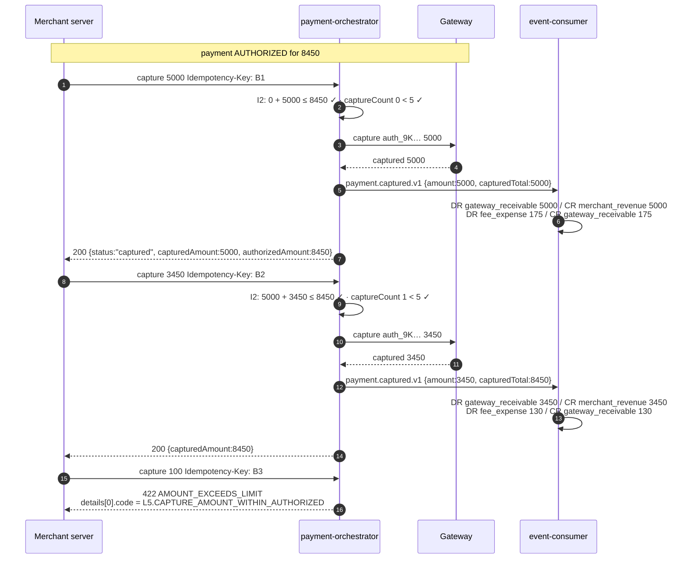

---

## 4. Full refund

| Aspect | Detail |
|---|---|
| Transitions | `CAPTURED → REFUNDED`, or `SETTLED → REFUNDED` (the normal case — most refunds happen after settlement, §9) |
| Refund aggregate | a `Refund` (`ref_…`) row, not a payment attempt |
| Guards | `L5.PAYMENT_STATE_PERMITS_OPERATION`, `L5.REFUND_AMOUNT_WITHIN_CAPTURED` (I1), `L5.REFUND_CURRENCY_MATCHES_PAYMENT`, `L5.REFUND_WITHIN_WINDOW`, `L5.NO_OPEN_DISPUTE_BLOCKS_REFUND` |
| Events | `payment.refunded.v1` with `refundId`, `amount`, `refundedTotal` |
| Ledger | DR `refund_expense` 8450 / CR `gateway_receivable` 8450. Fees are usually **not** returned — that is the gateway's policy, not ours, and the ledger reflects reality: the merchant is out 8450 plus the original 275. If the gateway does return the fee it arrives as a settlement adjustment (§16) and posts DR `gateway_receivable` / CR `fee_expense`. |
| Idempotency | key on `POST /{id}/refund`. A retry with the same key replays the same `ref_…`; a **new** key creates a **second refund**, which is why I1 exists |
| Availability | refunds are permitted while the merchant is `SUSPENDED` (§8) and are shed last under load (data-plane §5.4) |
| Failure branches | gateway rejects (funds already returned by dispute) → `422` · refund window closed → `422 REFUND_WINDOW_EXPIRED` before any gateway call · async refund (bank debit) → refund stays `PENDING` until the webhook confirms |

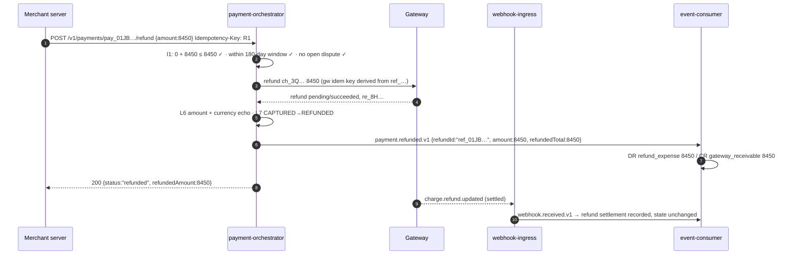

---

## 5. Partial refund

| Aspect | Detail |
|---|---|
| Transitions | `CAPTURED → PARTIALLY_REFUNDED`; further refunds `PARTIALLY_REFUNDED → PARTIALLY_REFUNDED`; the refund that exhausts the captured amount → `REFUNDED` (§9) |
| Guards | I1 on the running total. Two concurrent partial refunds of 5000 against 8450 captured: the payment row is locked `FOR UPDATE` in T3, so the second sees `refundedTotal = 5000` and is rejected by `L7.REFUNDS_NOT_EXCEED_CAPTURED` with `422 REFUND_EXCEEDS_CAPTURED`. The `CHECK` constraint is the backstop if the lock is ever bypassed. |
| Events | `payment.refunded.v1` per refund, each with its own `refundId` and the running `refundedTotal` |
| Ledger | per refund: DR `refund_expense` *n* / CR `gateway_receivable` *n* |
| Idempotency | one key per refund; the same-key-replays / new-key-creates asymmetry is the most common integration bug in this flow |
| Failure branches | over-refund → `422 REFUND_EXCEEDS_CAPTURED` with the refundable balance in `detail` · currency mismatch → `422 CURRENCY_NOT_SUPPORTED` |

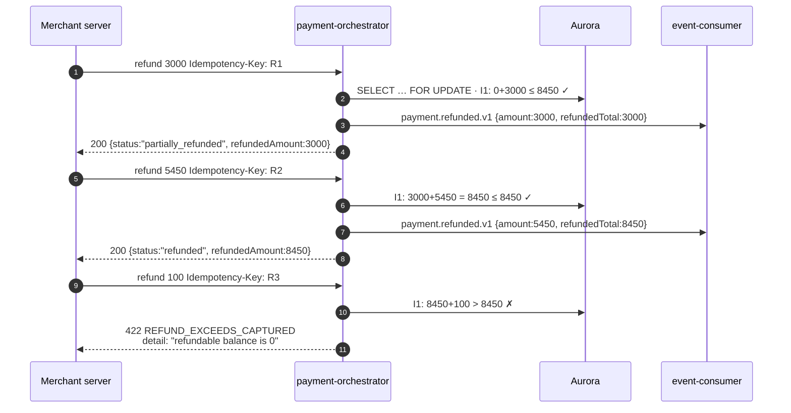

---

## 6. Void

| Aspect | Detail |
|---|---|
| Transitions | `AUTHORIZED → VOIDED` (terminal, §9) |
| Guards | `L5.VOID_ONLY_WHEN_UNCAPTURED` — `capturedTotal = 0`. If anything has been captured, the correct operation is a refund, and the error says so. |
| Events | `payment.voided.v1` |
| Ledger | **none.** Nothing was ever captured, so nothing was ever posted. Voiding an authorization with no ledger entry is the proof that §0's "authorization writes no ledger entry" rule was right. |
| Idempotency | key on `POST /{id}/void`; replay returns the same result |
| Failure branches | already captured → `422 PAYMENT_ALREADY_PROCESSED` ("issue a refund instead of a void") · authorization already expired at the gateway → treated as success, state → `VOIDED`, since the outcome the merchant asked for is the outcome that exists · gateway timeout on void → attempt `TIMEOUT_UNKNOWN`, payment stays `AUTHORIZED`, reconciler resolves; the authorization expires naturally if the void never landed |

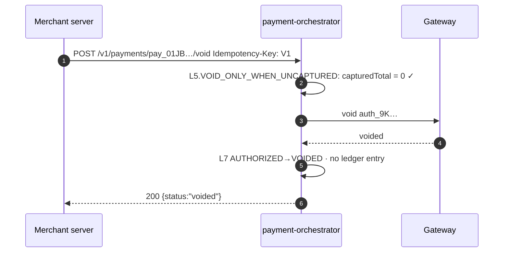

---

## 7. 3DS challenge flow

Triggered by `L5.THREE_DS_REQUIRED_ABOVE_THRESHOLD`, by a merchant policy, or by the risk engine (data-plane §6.3). In this example the amount is 25000 (USD 250.00) and this merchant's `require3DSAbove` is 20000, so the payment challenges.

| Aspect | Detail |
|---|---|
| Actors | CUS (browser) is a real actor here, not a bystander |
| Transitions | `CREATED → REQUIRES_ACTION` → (customer completes) → `PROCESSING → CAPTURED`; or `REQUIRES_ACTION → FAILED` (challenge failed) / `→ EXPIRED` (abandoned) / `→ CANCELED` (merchant cancels) |
| Attempt | the same attempt spans the challenge — the challenge session belongs to the gateway that issued it, so affinity is forced |
| Events | `payment.created.v1`, `payment.attempted.v1`, then `payment.captured.v1` or `payment.failed.v1`. `REQUIRES_ACTION` is carried on `payment.attempted.v1` rather than as its own event type. |
| Ledger | none until capture |
| Idempotency | the resume call carries the original payment ID and the gateway's challenge reference, not a new idempotency scope. A client that re-POSTs `/v1/payments` with the original key gets a replay of the `202`-shaped `requires_action` response including the same challenge URL. |
| Liability | on a successful challenge the attempt records `eci`, `threeDsVersion` and the authentication value reference — this determines who bears a later chargeback (§14 of the dispute flow) |
| Expiry | `REQUIRES_ACTION` expires after the gateway's challenge TTL (typically 15 min); a sweeper moves it to `EXPIRED` **only** on gateway-confirmed expiry or after 2× TTL with a confirming lookup — no timer may fail a payment (§12.3) |
| Failure branches | customer fails the challenge → `FAILED`, **no failover** (the customer is the failure, not the gateway) · issuer soft-declines with "SCA required" after an exemption claim → same-gateway retry with `CHALLENGE`, same attempt, same gateway idempotency key |

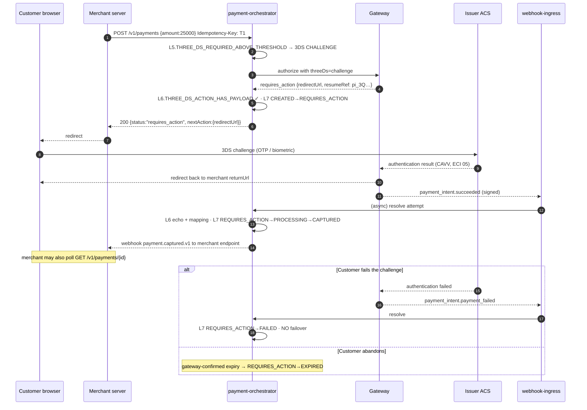

---

## 8. Asynchronous payment method — bank debit (SEPA / ACH)

The outcome is not known for hours or days. `PENDING` exists for exactly this (§9).

| Aspect | Detail |
|---|---|
| Transitions | `CREATED → PROCESSING → PENDING` … → `CAPTURED` (funds collected) or `→ FAILED` (returned/R-code) or `→ EXPIRED` (mandate lapsed) |
| Attempt | one attempt, `SUCCESS` at the *submission* level; the money outcome arrives later by webhook |
| Events | `payment.created.v1`, `payment.attempted.v1`, then (days later) `payment.captured.v1` or `payment.failed.v1` |
| Ledger | **nothing at `PENDING`.** Posting revenue on a submitted-but-uncollected debit is how a shadow ledger starts lying. Entries post on the `CAPTURED` transition, as in §1. |
| Idempotency | ordinary; the initial `201` carries `status: "pending"` and an `estimatedSettlement` |
| Late reversal | ACH returns can arrive up to 60 days later (R01 insufficient funds, R10 unauthorized). A return after `CAPTURED` is modelled as `CAPTURED → DISPUTED` when it is an unauthorized return, and as a settlement adjustment plus a reversing ledger entry when it is a mechanical return. The state machine never rewrites history. |
| Failure branches | mandate missing → `422` from `L5.RECURRING_HAS_MANDATE` before dispatch · gateway rejects the debit synchronously → `FAILED`, no failover (bank debit failures are account-definitive, i.e. hard) · no webhook within the method's SLA → reconciler polls (§15) |

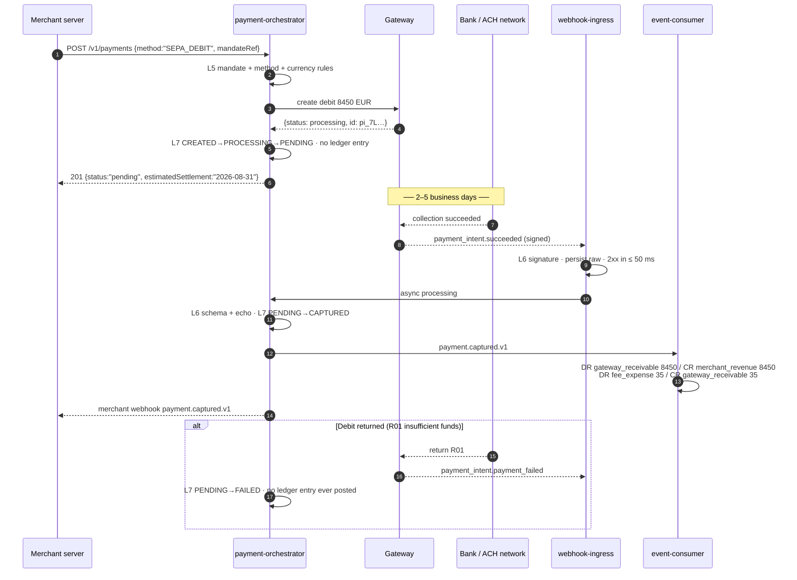

---

## 9. Gateway timeout with an unknown outcome, and its reconciliation

The most important flow in the document. §A7 and §12.3 are binding: **the payment stays `PROCESSING`, the attempt is `TIMEOUT_UNKNOWN`, no timer may fail it, and it is never automatically retried.**

| Aspect | Detail |
|---|---|
| Transitions | `CREATED → PROCESSING` and then **nothing** until evidence arrives |
| Attempt | `PENDING → DISPATCHED → TIMEOUT_UNKNOWN` |
| Events | `payment.created.v1`, `payment.attempted.v1`, and — after 15 min unresolved — `payment.reconciliation_required.v1` (alerting consumer, §13.2) |
| Ledger | none. We do not know whether money moved; posting either way would be a fabrication. |
| Idempotency | the record completes with a `200 {status:"processing"}` snapshot, so client retries replay "processing" rather than re-dispatching |
| Client contract | a synchronous endpoint returning `202`-semantics: `200` with `status: "processing"` and a `Retry-After`-style poll hint. Not an error, and explicitly not a failure. |
| Resolution order | (a) gateway webhook — seconds to minutes; (b) reconciler lookup by the deterministic `gateway_idempotency_key` (§14.4) — 60 s, then exponential to 15 min; (c) settlement report — T+1 |
| Failure branches | lookup says "not found" twice, 30 s apart → attempt `ERROR`, failover permitted · lookup says "authorized" → apply through L6/L7 as if the response had arrived · lookup unavailable for > 4 h → exception queue at `HIGH`, operator-driven |

```mermaid
sequenceDiagram
    autonumber
    participant MER as Merchant server
    participant ORC as payment-orchestrator
    participant GW as Gateway
    participant PG as Aurora
    participant REC as Reconciler
    participant WHI as webhook-ingress

    MER->>ORC: POST /v1/payments  Idempotency-Key: U1
    ORC->>PG: attempt att_5D… PENDING, gw_idem_key = base32(HMAC(att_5D…))
    ORC->>GW: authorize 8450 (8 s deadline)
    Note over ORC,GW: ✗ no response within 8 s — the gateway MAY have authorized
    ORC->>PG: attempt → TIMEOUT_UNKNOWN · payment stays PROCESSING
    ORC-->>MER: 200 {status:"processing"}<br/>NOT an error, NOT a failure

    par Path A — webhook wins (typical)
        GW-->>WHI: charge.succeeded {idempotency_key: att-derived}
        WHI->>ORC: async
        ORC->>ORC: L6.RESPONSE_CORRELATES_TO_ATTEMPT ✓ · amount/currency echo ✓
        ORC->>PG: attempt SUCCESS · L7 PROCESSING→CAPTURED · ledger posts
    and Path B — reconciler polls
        REC->>PG: SELECT attempts WHERE outcome='TIMEOUT_UNKNOWN' AND age > 60s
        REC->>GW: GET /charges?idempotency_key=att-derived
        alt found, succeeded
            GW-->>REC: {status: succeeded, amount: 8450}
            REC->>ORC: apply outcome (same L6 + L7 path)
        else not found (twice, 30 s apart)
            GW-->>REC: 404
            REC->>PG: attempt → ERROR · failover now permitted
        else lookup errors
            REC->>REC: backoff 60 s → 15 min; at 15 min emit payment.reconciliation_required.v1
        end
    end
```

**Why no automatic retry.** A timed-out authorization that actually succeeded, retried on another gateway, produces two holds on the customer's card, two authorizations to reconcile, a chargeback, a scheme fine and a support ticket. The cost of waiting 60 seconds is one delayed sale. The asymmetry is not close.

---

## 10. Failover after a retryable decline

| Aspect | Detail |
|---|---|
| Transitions | `CREATED → PROCESSING`, then either `→ CAPTURED` on the second attempt or `→ FAILED` if the budget is exhausted. The payment **never leaves `PROCESSING`** during failover — attempts change, the payment does not. |
| Attempts | attempt 1 `DECLINED` (soft, reason `91 issuer unavailable`); attempt 2 created with a **new** `gateway_idempotency_key` (§A10) → `SUCCESS` |
| Events | `payment.attempted.v1` per attempt (routing-feedback consumers use these), then `payment.captured.v1` |
| Ledger | posts once, on the successful attempt |
| Idempotency | one client key spanning both attempts. The client sees one payment and one response. |
| Budget | ≤ 2 failovers, ≤ 12 s wall clock (data-plane §4.6) |
| Invariant | I3 — the partial unique index permits at most one attempt per payment in a successful terminal state, so even a pathological double-failover cannot double-charge |
| Failure branches | all candidates exhausted → `FAILED` with `NO_ELIGIBLE_GATEWAY` · budget exhausted mid-failover → `FAILED` with `ROUTING_BUDGET_EXHAUSTED` · second attempt times out → `TIMEOUT_UNKNOWN`, payment stays `PROCESSING`, §9 applies and no third attempt is made |

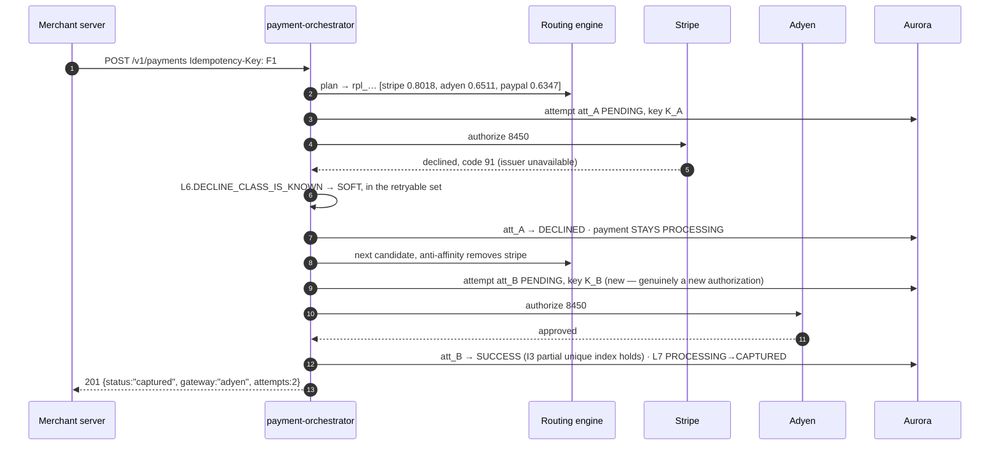

---

## 11. Hard decline, no failover

| Aspect | Detail |
|---|---|
| Transitions | `CREATED → PROCESSING → FAILED` (terminal) |
| Attempt | one attempt, `DECLINED`, mapped hard class (stolen card `43`, invalid account `14`, pickup `04`, restricted `62`, or **any unmapped reason** — `L6.DECLINE_REASON_IS_MAPPABLE` degrades unknown to hard) |
| Events | `payment.attempted.v1`, `payment.failed.v1` with the normalized decline reason |
| Ledger | none |
| Idempotency | the record completes as `FAILED_TERMINAL`; a retry with the same key replays the same `402` error rather than re-attempting (§14.3) |
| Client message | the normalized reason, never the gateway's raw string — raw issuer text leaks BIN and issuer detail and is not stable across gateways |
| Why no failover | §9.1: retrying a hard decline on a second gateway is card-testing behaviour and gets the platform de-registered by the schemes. This is a scheme-compliance boundary, not a tuning parameter, and it is not per-merchant configurable. |
| Failure branches | none — this is a terminal, correct outcome |

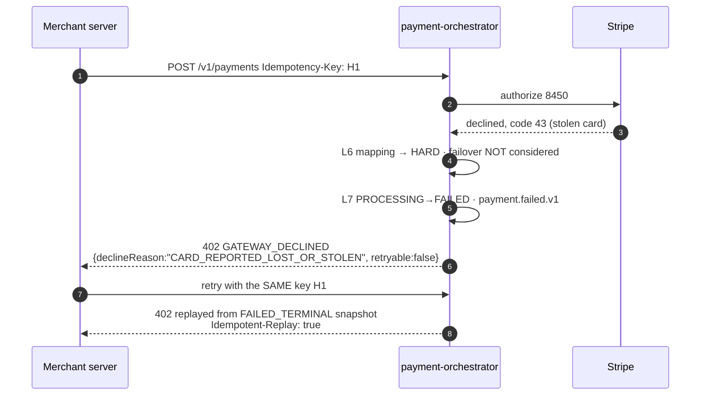

---

## 12. Duplicate client retry

Three distinct sub-cases, and integrators confuse them constantly.

| Sub-case | Trigger | Behaviour | Code |
|---|---|---|---|
| **Same key, same body, original completed** | Client timed out but we succeeded | Replay the stored snapshot verbatim, `Idempotent-Replay: true`, same `payment_id` | `200`/`201` |
| **Same key, same body, original in flight** | Client retried after 2 s; we are still calling the gateway | Do **not** block, do **not** process twice: `409` + `Retry-After: 1` (§A6). Blocking a request thread on another process's lease is how thread pools die under a retry storm. | `409 IDEMPOTENT_REQUEST_IN_PROGRESS` |
| **Same key, different body** | Client bug: one key reused for two payments | Reject. Silently returning the first payment would hide a bug that eventually charges the wrong customer. | `422 IDEMPOTENCY_KEY_REUSED` |
| **Different key, same body** | Client generated a new key per attempt | Two genuine payments are created. This is the client's error; idempotency cannot detect it. Defence is the merchant's own dedup window plus `L5.VELOCITY_*`. | `201` twice |

| Aspect | Detail |
|---|---|
| Transitions | unchanged by any retry — replays do not touch the FSM |
| Events | none emitted on a replay |
| Ledger | none on a replay |
| Failure branches | lease expired because the original process died → the retry reclaims and either reconstructs the response from `resource_id` or re-executes cleanly (data-plane §3.2, P4) |

```mermaid
sequenceDiagram
    autonumber
    participant MER as Merchant server
    participant API as payment-api
    participant PG as Aurora
    participant ORC as payment-orchestrator

    MER->>API: POST /v1/payments  Key: D1  {amount:8450}
    API->>PG: claim → 1 row, IN_FLIGHT lease 30 s
    API->>ORC: CreatePayment
    Note over MER,API: client's 2 s timeout fires

    MER->>API: POST /v1/payments  Key: D1  {amount:8450}   (retry #1)
    API->>PG: claim → 0 rows; state IN_FLIGHT, lease live
    API-->>MER: 409 IDEMPOTENT_REQUEST_IN_PROGRESS · Retry-After: 1

    ORC-->>API: captured
    API->>PG: idempotency COMPLETED + snapshot(201)

    MER->>API: POST /v1/payments  Key: D1  {amount:8450}   (retry #2)
    API->>PG: claim → 0 rows; state COMPLETED
    API-->>MER: 201 replayed · Idempotent-Replay: true · same pay_01JB…

    MER->>API: POST /v1/payments  Key: D1  {amount:9900}   (bug)
    API->>PG: fingerprint mismatch
    API-->>MER: 422 IDEMPOTENCY_KEY_REUSED
```

---

## 13. Duplicate webhook

Gateways deliver at-least-once and retry aggressively after their own incidents; duplicates are routine, not exceptional (§24).

| Aspect | Detail |
|---|---|
| Actors | GW → WHI → Kafka → processor |
| Two dedup layers | (1) ingress: `webhook_dedup` on `(gateway, event_id)` — a duplicate is dropped with a `2xx` so the gateway stops retrying; (2) consumer: `(consumer_group, event_id)` dedup insert in the same transaction as the handler (§13.5) |
| Third layer | state-machine idempotence: applying `charge.succeeded` to a payment already `CAPTURED` is rejected by `L6.STATE_IS_REACHABLE_FROM_CURRENT`/`L7.PAYMENT_TRANSITION_IS_ALLOWED` and recorded as a no-op, not an error |
| Transitions | none on the duplicate |
| Events | none re-emitted |
| Ledger | none — this is what I1/I2/I3 and the dedup table exist to guarantee |
| Response | always `2xx` to the gateway. A `4xx` on a duplicate teaches the gateway to disable the endpoint. |
| Out-of-order delivery | a `charge.succeeded` arriving **after** `charge.refunded` is not a duplicate — it is out of order. `L6.STATE_IS_REACHABLE_FROM_CURRENT` rejects the transition and parks it in the exception queue as `LATE_EVENT` (§17), where the triage rule is "compare gateway timestamps; if the parked event is older, discard". |
| Failure branches | signature invalid → `401` + security event, **never** deduped (an attacker must not be able to poison the dedup table with a chosen `event_id`) · replay outside the 5-minute timestamp window → `401 WEBHOOK_REPLAY_DETECTED` |

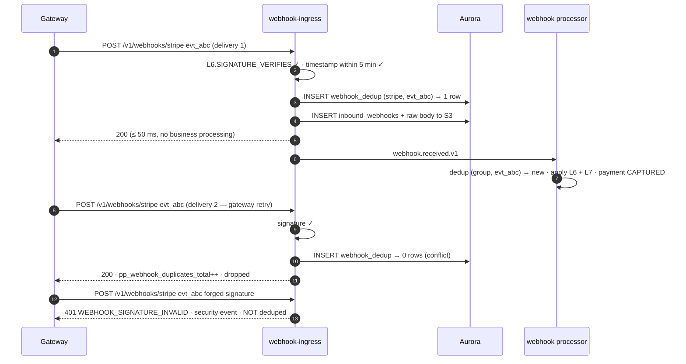

---

## 14. Dispute / chargeback

| Aspect | Detail |
|---|---|
| Actors | Cardholder → issuer → scheme → gateway → WHI; merchant supplies evidence; operator may assist |
| Transitions | `CAPTURED → DISPUTED` or `SETTLED → DISPUTED`; on resolution `DISPUTED → CAPTURED`/`SETTLED` (won) or `DISPUTED → REFUNDED` (lost) — §9 |
| Events | `payment.disputed.v1` (consumers: ledger, **risk**, notification), then `payment.refunded.v1` or a dispute-resolved event carrying the restored state |
| Ledger, opened | DR `dispute_holding` 8450 / CR `gateway_receivable` 8450; plus the dispute fee DR `fee_expense` 1500 / CR `gateway_receivable` 1500 |
| Ledger, won | DR `gateway_receivable` 8450 / CR `dispute_holding` 8450. **The fee is not reversed** at most gateways — the ledger reflects that, and the merchant's true cost of a won dispute is visible. |
| Ledger, lost | DR `chargeback_expense` 8450 / CR `dispute_holding` 8450 |
| Idempotency | disputes are gateway-initiated; the idempotency concern is webhook dedup (§13), not client keys |
| Refund interaction | `L5.NO_OPEN_DISPUTE_BLOCKS_REFUND` — refunding a disputed payment double-debits the merchant, because the dispute may also be lost. The API says so explicitly. |
| Risk feedback | `payment.disputed.v1` is consumed by the risk engine: the card fingerprint enters the platform blocklist, and the merchant's dispute ratio feeds the TRA exemption eligibility band (data-plane §6.4) |
| Deadlines | the evidence deadline arrives on the webhook (`L6.DISPUTE_FIELDS_PRESENT` requires it). A dispute within 72 h of its deadline with no evidence submitted raises an operator alert. |
| Failure branches | dispute arrives for a payment we have no record of → exception queue, `ORPHAN_DISPUTE`, `CRITICAL` · second dispute on the same payment (pre-arbitration) → new dispute record, state stays `DISPUTED` |

```mermaid
sequenceDiagram
    autonumber
    participant CH as Cardholder
    participant ISS as Issuer
    participant GW as Gateway
    participant WHI as webhook-ingress
    participant ORC as payment-orchestrator
    participant CON as event-consumer
    participant MER as Merchant

    CH->>ISS: "I don't recognize this charge"
    ISS->>GW: chargeback 8450 + fee 1500, reason 10.4
    GW-->>WHI: charge.dispute.created (signed)
    WHI->>ORC: async · L6.DISPUTE_FIELDS_PRESENT ✓
    ORC->>ORC: L7 CAPTURED→DISPUTED
    ORC->>CON: payment.disputed.v1 {reason:"FRAUDULENT", evidenceDueBy:"2026-09-05"}
    CON->>CON: DR dispute_holding 8450 / CR gateway_receivable 8450<br/>DR fee_expense 1500 / CR gateway_receivable 1500
    CON->>MER: notification + evidence deadline
    MER->>ORC: submit evidence (receipt, AVS, 3DS ECI 05, delivery proof)
    ORC->>GW: submit evidence

    alt Dispute won
        GW-->>WHI: charge.dispute.closed {status: won}
        ORC->>ORC: L7 DISPUTED→CAPTURED (state restored)
        CON->>CON: DR gateway_receivable 8450 / CR dispute_holding 8450<br/>(fee NOT reversed)
    else Dispute lost
        GW-->>WHI: charge.dispute.closed {status: lost}
        ORC->>ORC: L7 DISPUTED→REFUNDED
        CON->>CON: DR chargeback_expense 8450 / CR dispute_holding 8450
        CON->>CON: risk: fingerprint → platform blocklist; merchant dispute ratio updated
    end
```

---

## 15. What the client sees

`Idempotency-Key` is required on every `POST` below (§19.2). "Subsequent webhook" is what the platform delivers to the *merchant's* configured endpoint, not what the gateway sends us.

| # | Scenario | Request | Immediate response | Subsequent webhook to the merchant | Final payment state |
|---|---|---|---|---|---|
| 1 | Card sale, auto-capture | `POST /v1/payments` `{capture:AUTOMATIC}` | `201` `{status:"captured", capturedAmount:8450}` | `payment.captured.v1` (may arrive before the response is read) | `CAPTURED` → `SETTLED` at T+2 |
| 2 | Auth then capture | `POST /v1/payments` `{capture:MANUAL}` | `201` `{status:"authorized", capturableUntil}` | `payment.authorized.v1` | `AUTHORIZED` |
| 2b | …the capture | `POST /{id}/capture` | `200` `{status:"captured"}` | `payment.captured.v1` | `CAPTURED` |
| 3 | Partial capture (1 of 2) | `POST /{id}/capture` `{amount:5000}` | `200` `{capturedAmount:5000, authorizedAmount:8450}` | `payment.captured.v1` `{amount:5000}` | `CAPTURED` |
| 4 | Full refund | `POST /{id}/refund` `{amount:8450}` | `200` `{status:"refunded"}` | `payment.refunded.v1` | `REFUNDED` |
| 5 | Partial refund | `POST /{id}/refund` `{amount:3000}` | `200` `{status:"partially_refunded", refundedAmount:3000}` | `payment.refunded.v1` `{refundedTotal:3000}` | `PARTIALLY_REFUNDED` |
| 6 | Void | `POST /{id}/void` | `200` `{status:"voided"}` | `payment.voided.v1` | `VOIDED` |
| 7 | 3DS challenge | `POST /v1/payments` `{amount:25000}` | `200` `{status:"requires_action", nextAction:{redirectUrl}}` | `payment.captured.v1` after the challenge, or `payment.failed.v1` | `CAPTURED` / `FAILED` / `EXPIRED` |
| 8 | Bank debit | `POST /v1/payments` `{method:"SEPA_DEBIT"}` | `201` `{status:"pending", estimatedSettlement}` | `payment.captured.v1` in 2–5 days, or `payment.failed.v1` | `CAPTURED` / `FAILED` |
| 9 | Gateway timeout | `POST /v1/payments` | `200` `{status:"processing"}` — **not an error** | `payment.captured.v1` or `payment.failed.v1` when resolved; `payment.reconciliation_required.v1` internally at 15 min | `CAPTURED` / `FAILED`, never decided by a timer |
| 10 | Failover after soft decline | `POST /v1/payments` | `201` `{status:"captured", gateway:"adyen", attempts:2}` | `payment.captured.v1` | `CAPTURED` |
| 11 | Hard decline | `POST /v1/payments` | `402` `{code:"GATEWAY_DECLINED", declineReason:"CARD_REPORTED_LOST_OR_STOLEN", retryable:false}` | `payment.failed.v1` | `FAILED` |
| 12a | Duplicate retry, completed | same key, same body | `201` + `Idempotent-Replay: true`, same `payment_id` | none re-sent | unchanged |
| 12b | Duplicate retry, in flight | same key, same body | `409` `{code:"IDEMPOTENT_REQUEST_IN_PROGRESS"}` + `Retry-After: 1` | none | unchanged |
| 12c | Key reused, different body | same key, new body | `422` `{code:"IDEMPOTENCY_KEY_REUSED"}` | none | unchanged |
| 13 | Duplicate gateway webhook | n/a (gateway → us) | n/a | none — deduped silently | unchanged |
| 14 | Dispute opened | n/a | n/a | `payment.disputed.v1` `{reason, evidenceDueBy}` | `DISPUTED` |
| 14b | Dispute won / lost | n/a | n/a | dispute-resolved event | `CAPTURED`/`SETTLED` / `REFUNDED` |
| — | Merchant suspended | `POST /v1/payments` | `409` `{code:"MERCHANT_NOT_ACTIVE"}` | none | n/a — refunds and voids still succeed (§8) |
| — | All gateways unhealthy | `POST /v1/payments` | `503` `{code:"NO_ELIGIBLE_GATEWAY", retryable:true}` + `Retry-After` | none | n/a — fail closed (§24) |

---

## 16. Reconciliation flows

### 16.1 Unknown-attempt resolution

The reconciler is the only component permitted to move a payment out of `PROCESSING` after a `TIMEOUT_UNKNOWN` (§12.3).

| Property | Value |
|---|---|
| Trigger | `payment_attempts` where `outcome = 'TIMEOUT_UNKNOWN'` or `status = 'DISPATCHED'` and `age > 60 s` |
| Lookup key | the attempt's `gateway_idempotency_key` — reproducible after any crash (§14.4) |
| Schedule | 60 s, 2 min, 5 min, 15 min, then every 15 min for 24 h, then hourly for 7 days |
| Escalation | at 15 min unresolved → `payment.reconciliation_required.v1` (alerting consumer) and an exception at `HIGH` |
| Authority | webhook > lookup > settlement report. A settlement report never contradicts a webhook-confirmed state; it can only *add* fee and payout detail. |
| "Not found" handling | accepted only after **two** consecutive not-found responses ≥ 30 s apart, because several gateways index lookups asynchronously. Then: attempt → `ERROR`, failover permitted. |
| Concurrency | claims work with `SELECT … FOR UPDATE SKIP LOCKED`, so multiple reconciler pods never look up the same attempt |
| Idempotence | applying a resolved outcome goes through the same L6 + L7 path as a live response; a webhook that lands mid-lookup wins the race harmlessly because the transition guard rejects the second application |

### 16.2 Settlement report ingestion

Settlement is observed, not computed (§A12).

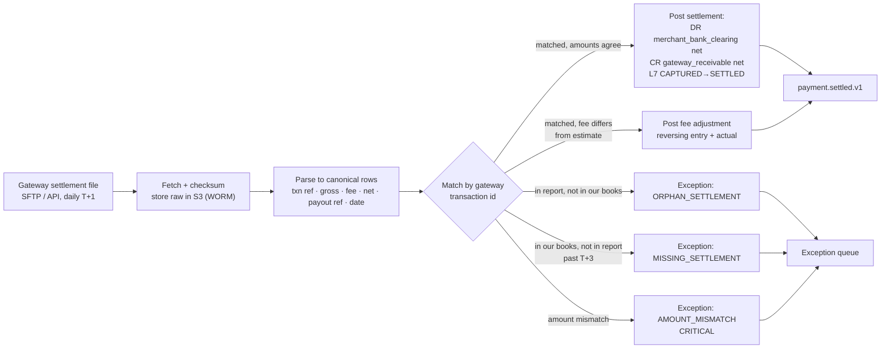

| Property | Value |
|---|---|
| Cadence | daily per gateway, T+1; a run is a `ReconciliationRun` (`rcn_…`) with a start/end watermark |
| Idempotence | each file has a content hash; re-ingesting a file is a no-op. Individual rows dedupe on `(gateway, settlement_id, txn_ref)`. |
| Fee truth | the estimated fee posted at capture is an estimate; the settlement row is truth. The difference posts as an explicit adjustment entry, never as an edit (`L7.LEDGER_IS_APPEND_ONLY`). |
| Three-way tie-out | our ledger ↔ the gateway settlement report ↔ the merchant's bank credit. The run reports the residual per account; a non-zero residual after adjustments is an exception. |
| Retention | raw files in S3 with Object Lock for 7 years (§17.3) |

### 16.3 The exception queue and its triage rules

Every unresolved discrepancy becomes a `reconciliation_exceptions` row. `pp_reconciliation_exceptions{severity}` is a gauge; an open `CRITICAL` blocks merchant activation (`L7.ACTIVATION_REQUIRES_CLEAN_RECONCILIATION`).

| Exception | Meaning | Severity | Auto-resolution attempted | Triage rule | SLA |
|---|---|---|---|---|---|
| `UNKNOWN_ATTEMPT` | `TIMEOUT_UNKNOWN` unresolved > 15 min | `HIGH` | lookup schedule §16.1 | If the gateway lookup API is down, wait for settlement; if the payment is > 24 h old and absent from settlement, close it as `FAILED` with an operator signature. | 4 h |
| `AMOUNT_MISMATCH` | Settled gross ≠ our captured amount | `CRITICAL` | none — never auto-resolved | Compare against the raw gateway response stored on the attempt. If our record matches the raw response, the gateway's report is wrong → gateway support. If not, we have an application defect → incident. | 1 h, page |
| `ORPHAN_SETTLEMENT` | Money settled for a transaction we have no record of | `CRITICAL` | search by `gateway_idempotency_key` across all attempts including failed ones | Almost always a `TIMEOUT_UNKNOWN` we closed too aggressively, or a payment created directly at the gateway outside the platform. Create a shadow payment record; never silently drop money. | 1 h, page |
| `MISSING_SETTLEMENT` | Captured, not settled by T+3 | `MEDIUM` | re-poll the gateway payout API | Check the merchant's payout schedule and hold days (§23 `settlement.holdDays`) before escalating; most are schedule, not loss. | 24 h |
| `DUPLICATE_AUTHORIZATION` | Two successful attempts detected for one payment | `CRITICAL` | none | I3 makes this structurally impossible in our data, so it can only originate at the gateway (an idempotency failure — see `L6.TRANSACTION_ID_STABLE_ACROSS_RETRIES`). Void the later authorization immediately, then incident. | immediate, page |
| `LATE_EVENT` | Webhook whose transition is not reachable from the current state | `LOW` | compare gateway timestamps | If the parked event predates the current state's source event, discard as out-of-order. If it postdates it, it is a real conflict → escalate to `HIGH`. | 24 h |
| `ORPHAN_DISPUTE` | Dispute for an unknown payment | `CRITICAL` | search by gateway transaction id | Same handling as `ORPHAN_SETTLEMENT`; a dispute always has a real underlying transaction somewhere. | 1 h, page |
| `FEE_VARIANCE` | Settled fee differs from estimate by > 20 % or > 500 minor units | `LOW` | post the adjustment automatically | Aggregate over a week; a systematic variance means the gateway's pricing changed and the routing cost model is stale — that is a routing-quality defect, not an accounting one. | weekly |
| `STALE_PROCESSING` | Payment in `PROCESSING` > 24 h with no unresolved attempt | `HIGH` | none | Indicates a lost transition, not a lost payment. Rebuild the state from the payment event log and the attempts. | 4 h |
| `LEDGER_IMBALANCE` | An entry group does not sum to zero | `CRITICAL` | none — `L7.LEDGER_ENTRY_BALANCED` should make it impossible | Halt the ledger consumer, page, and do not post further entries for that merchant until resolved. A ledger that is silently wrong is worse than a ledger that is stopped. | immediate, page |

Triage principles, in priority order:

1. **Never resolve an exception by editing history.** Corrections are new entries and new events. The audit chain (BC-9) must show what we believed and when we changed our mind.
2. **Money found is more urgent than money missing.** An `ORPHAN_SETTLEMENT` means a customer was charged for something the platform does not know about; that is a customer-facing correctness failure, whereas a `MISSING_SETTLEMENT` is usually a schedule.
3. **Auto-resolution only where the evidence is authoritative.** Lookups and settlement rows are authoritative; inference is not. Any exception whose resolution requires a judgement about what probably happened is a human decision with a recorded signature.
4. **A `CRITICAL` exception blocks activation, not processing.** Existing merchants keep processing while an exception is open; a merchant cannot go `→ ACTIVE` with one (§8). Stopping live payment processing to protect an accounting record is almost always the wrong trade.
