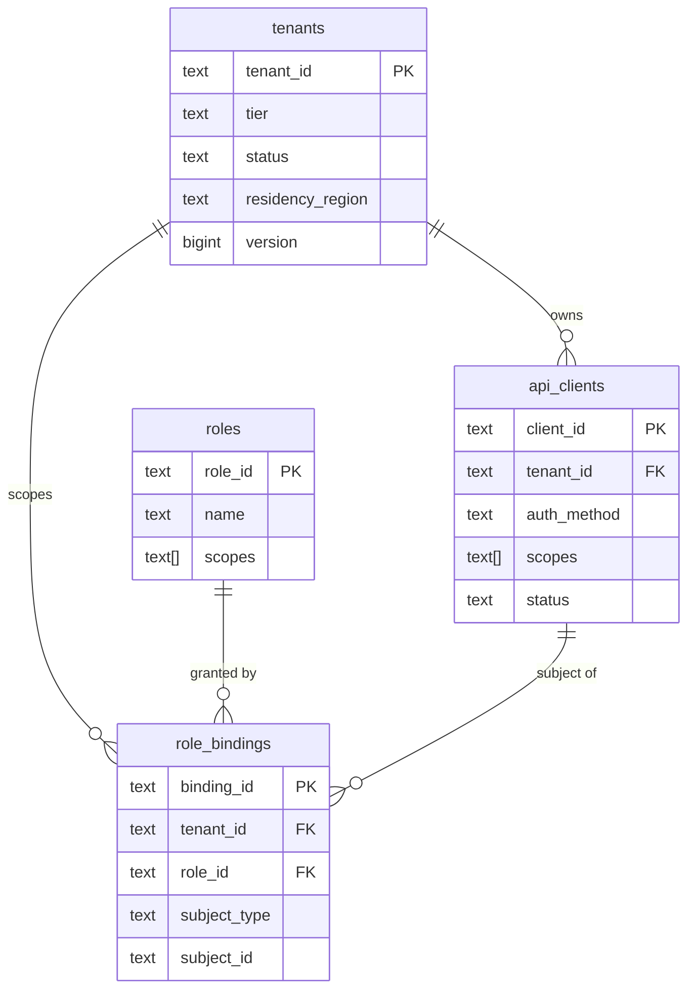
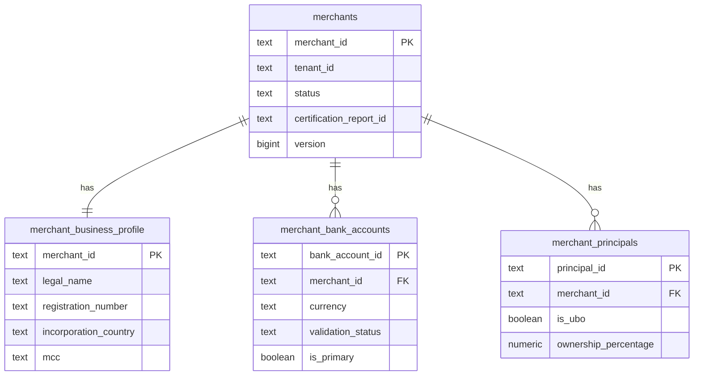
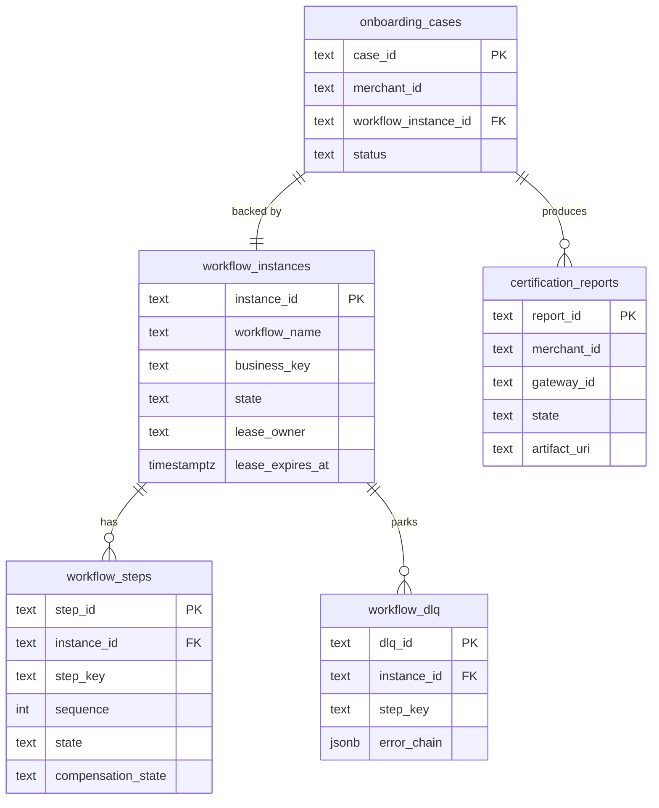
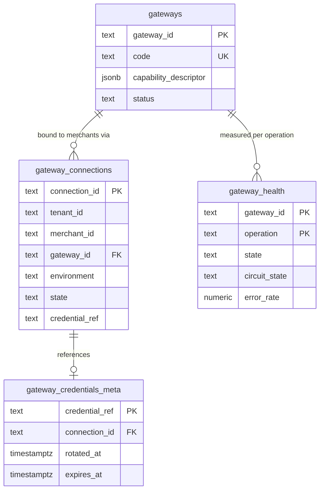
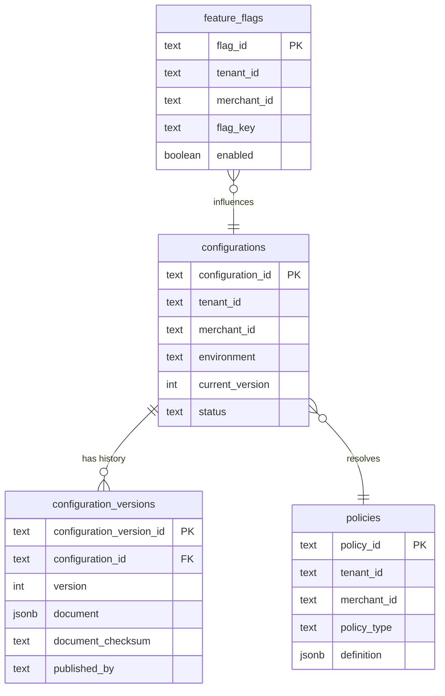
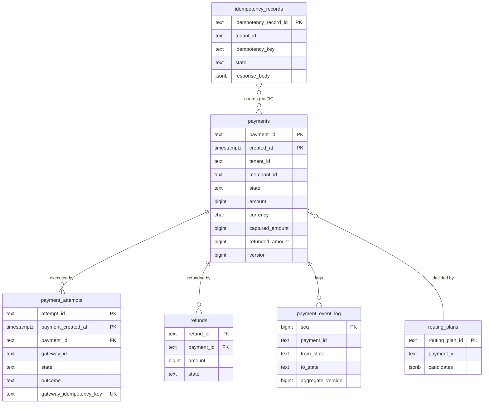
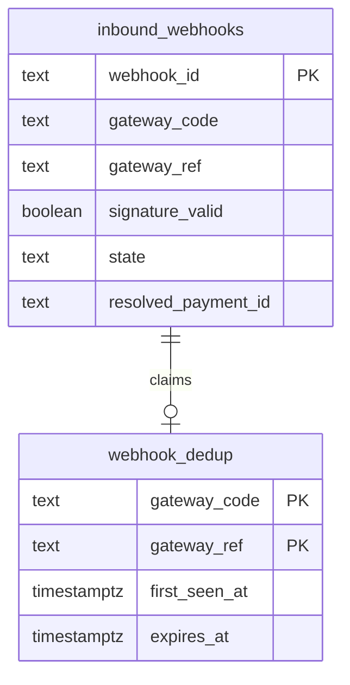
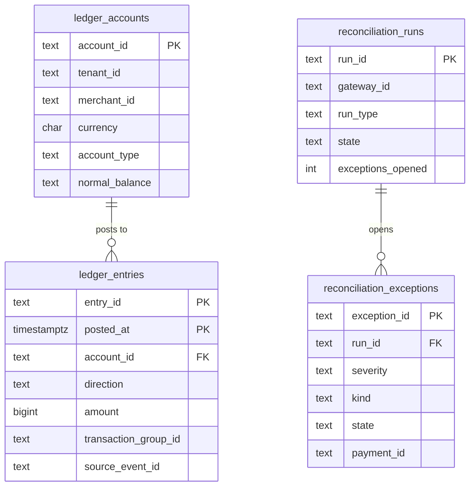

# 04 — Domain Model

> Purpose: the binding domain model — aggregates, value objects, invariants, and the complete
> relational schema — for the platform defined in [`00-design-baseline.md`](./00-design-baseline.md).
> The baseline wins on every conflict; this document only *expands* it. Aggregate names, ID
> prefixes, state names, event types and invariant IDs (I1–I5) are reproduced verbatim from it.

---

## 1. Reading this document

| Section | Contents |
|---|---|
| §2 | Ubiquitous language, expanded from baseline §2 |
| §3 | Aggregate design rules that apply to every aggregate (stated once, referenced everywhere) |
| §4 | Aggregate catalog — 23 aggregates, one subsection each |
| §5 | Domain services: what deliberately does **not** live on an aggregate |
| §6 | Relational data model, grouped by bounded context, with an ER diagram per context |
| §7 | Index strategy — every index and the query it serves |
| §8 | Partitioning, retention and archival |
| §9 | Invariant enforcement matrix (I1–I5): domain code ↔ database constraint |

**Notation.** `⊕` marks a table introduced by this document that is not named in baseline §3.
Baseline §3 names each context's *principal* tables; `⊕` tables are support tables that belong to
the same context and do not move ownership. Column types are PostgreSQL 15+.

---

## 2. Ubiquitous language

Baseline §2 is normative. The table below reproduces it and adds the terms this document
introduces. A name in the left column is the **only** name permitted in code, SQL, API contracts,
event payloads and documentation.

### 2.1 Baseline terms (normative, unchanged)

| Term | Definition |
|---|---|
| **Tenant** | Top-level isolation boundary. A platform customer (PSP, marketplace, ISV) that owns merchants. Every row, key, event and log line belongs to exactly one tenant. |
| **Merchant** | A business onboarded under a tenant that submits payment instructions. `merchant_id` unique within a tenant. |
| **Onboarding Case** | Stateful record of one merchant's journey `CREATED → ACTIVE`. Backed by exactly one workflow instance. |
| **Gateway** | Third-party payment processor. Described by a *capability descriptor*, reached through an *adapter*. |
| **Gateway Connection** | Binding of one merchant to one gateway: provisioned account reference, credential reference, webhook registration, certification status. |
| **Capability Descriptor** | Declarative statement of what a gateway supports: countries, currencies, payment methods, operations, 3DS, partial capture, refund window, webhook signature scheme. |
| **Payment** | The merchant's *intent* to move money. Immutable in amount/currency/merchant after creation. Exactly one lifecycle state. |
| **Payment Attempt** | One execution of that intent against one gateway. A payment has 1..N attempts. Failover creates a new attempt; it never mutates the old one. |
| **Authorization** | A hold on funds. Reversible by *void*. |
| **Capture** | Conversion of a hold into a debit. Reversible by *refund*. |
| **Settlement** | Gateway-reported movement of captured funds to the merchant. Observed, not performed, by us. |
| **Routing Plan** | Ordered, reason-annotated list of candidate gateways produced for one payment at one instant. Persisted with the payment for auditability. |
| **Idempotency Key** | Client-supplied opaque string scoping one *logical operation* to one *effect*, within `(tenant, merchant, endpoint)`. |
| **Desired State** | Configuration as declared through the control plane. Versioned, validated, auditable. |
| **Actual State** | Configuration and provisioning as it exists in the world. |
| **Reconciliation** | Detecting and closing the gap between desired and actual state, or between our payment state and the gateway's. |
| **Plane** | Horizontal slice with its own availability target, scaling behaviour and blast radius: Control, Automation, Validation, Data, Observability. |

### 2.2 Terms added by this document

| Term | Definition | Why it needs a name |
|---|---|---|
| **Business Profile** | The merchant's regulatory identity: legal name, trading name, entity type, registration number, incorporation country, MCC, declared monthly volume, website. Value object inside `Merchant`. | KYB evidence attaches to it; it versions independently of the merchant's lifecycle state. |
| **Bank Account** | A merchant settlement destination: masked account reference, holder name, country, currency, validation status. Entity inside `Merchant`. | Multiple accounts per merchant; one is `PRIMARY` per settlement currency. |
| **Merchant Principal** | A natural person controlling the merchant: director, officer, or **UBO** (ultimate beneficial owner ≥ 25 % ownership). Entity inside `Merchant`. | **Name collision, resolved:** baseline BC-1 also owns an aggregate called `Principal`, meaning an *authentication subject*. In code these are `tenant.Principal` and `merchant.MerchantPrincipal`; the bare word "Principal" unqualified always means the BC-1 auth subject. |
| **UBO** | A `MerchantPrincipal` with `is_ubo = true`. Not a separate type. | Regulators ask for UBOs specifically; the flag makes the query trivial and the audit obvious. |
| **Attempt Outcome** | The terminal classification of a `PaymentAttempt`: `SUCCESS`, `DECLINED`, `ERROR`, `TIMEOUT_UNKNOWN` (baseline §9.1). | It is the column the I3 partial unique index keys on; it is not the same thing as the attempt's *state*. |
| **Retryable Decline** | A decline reason code in the configured retryable set (issuer unavailable, soft do-not-honour, network error). Its complement is a **hard decline**, which must never be retried elsewhere (baseline §9.1). | The distinction is the difference between failover and card-testing behaviour. |
| **Gateway Idempotency Key** | `base32(HMAC-SHA256(attempt_id, gateway_salt))[:32]` (baseline §14.4). Owned by the orchestrator, never the client. | Distinct concern from the client `Idempotency Key`; conflating them causes double charges on failover. |
| **Request Fingerprint** | `SHA-256` over the JCS-canonicalized request body plus the idempotency scope tuple (baseline §14.2). | Same key + different fingerprint is a client bug, and we must name the thing we compare. |
| **Config Snapshot** | The data plane's last-known-good materialization of a `MerchantConfiguration` version, with an age metric. Fail-static input (baseline §15). | The data plane never reads the control plane synchronously; the snapshot is the thing it reads. |
| **Certification Report** | Signed, immutable artifact produced by a certification run over the `(gateway, payment_method, currency)` matrix (baseline §11.4, A11). | `PRODUCTION_READY` is unreachable without a passing one; it is an artifact, not an opinion. |
| **Ledger Account** | A named account in the shadow double-entry ledger, scoped to `(tenant, merchant, currency, account_type)`. | Entries must balance against *something*; the account is that something. |
| **Reconciliation Exception** | An unresolved discrepancy raised by a reconciliation run, with severity and an assignee. | Baseline §8 makes "no open critical reconciliation exception" a guard on `→ ACTIVE`; the guard needs a noun. |
| **Outbox Event** | A row written in the same transaction as a state change, later published by `outbox-relay` (baseline §13.4). | It is the only legal way an event leaves a service. |
| **Hash Chain Link** | `prev_hash`/`entry_hash` pair making `audit_records` tamper-evident. | "Append-only" is a claim; the chain is the evidence. |
| **Aggregate Version** | Monotonic `BIGINT` incremented on every state-changing command; the optimistic-concurrency token and the `aggregateversion` envelope field. | I5 depends on it; ETags are derived from it. |

---

## 3. Aggregate design rules

These hold for **every** aggregate. Per-aggregate sections state only the deviations.

### 3.1 Identity

| Rule | Statement |
|---|---|
| R-ID-1 | Every aggregate root has a single, prefixed ULID identity (baseline §6). Composite natural keys are never the identity. |
| R-ID-2 | `created_at` for any partitioned aggregate is **derived from the ULID's 48-bit timestamp**, not from `now()`. `created_at := ids.TimeOf(id)`. This makes the partition a pure function of the ID and is load-bearing — see §8.2. |
| R-ID-3 | IDs are opaque to clients. No client may parse them; no API accepts an unprefixed ID. A wrong-prefix ID is a `400 VALIDATION_FAILED`, not a `404`. |
| R-ID-4 | Every row carries `tenant_id`. There are no tenant-free tables outside `gateways` (platform-global catalog) — and even that one is read-only to tenants. |

### 3.2 Concurrency — optimistic version, universally

| Rule | Statement |
|---|---|
| R-CC-1 | Every aggregate root table has `version BIGINT NOT NULL DEFAULT 0`. Every state-changing write is `UPDATE … SET version = version + 1, … WHERE id = $1 AND tenant_id = $2 AND version = $3`. Zero rows affected → `ErrConcurrentModification` → `409 CONFLICT` (or `412` when the caller supplied `If-Match`). |
| R-CC-2 | HTTP `ETag` is `W/"<version>"`. `If-Match` is required on `PATCH`/`PUT` (baseline §19.3); mismatch is `412`. |
| R-CC-3 | Optimistic, never pessimistic, on the payment hot path. `SELECT … FOR UPDATE` appears in exactly three places: the outbox relay claim loop (`SKIP LOCKED`), the workflow lease loop (`SKIP LOCKED`), and the refund-total serialization for I1. Everywhere else a row lock on the money path is a latency bomb under retry storms. |
| R-CC-4 | The version increment and the outbox row are written in the **same transaction** as the state change (I5, baseline §13.4). A state change without an outbox row is a defect that CI catches (`TestEveryStateChangeWritesOutbox`). |
| R-CC-5 | Retry on `ErrConcurrentModification` is the **caller's** decision, never an automatic in-transaction loop, because a blind retry on a money command can re-apply an already-applied effect. Retries are gated by the idempotency record. |

### 3.3 Transactional boundary

| Rule | Statement |
|---|---|
| R-TX-1 | **One transaction touches exactly one aggregate instance**, plus its own outbox rows and its own idempotency record. Two aggregate roots are never updated in one transaction, even inside one bounded context. |
| R-TX-2 | Exception, explicitly enumerated: `Payment` + `PaymentAttempt` + `Refund` are **one** aggregate (root: `Payment`) precisely so that I1, I2 and I3 can be enforced transactionally. They are separate *tables*, not separate aggregates. |
| R-TX-3 | Exception, explicitly enumerated: `LedgerEntry` rows for one posting are written as one balanced set in one transaction (double-entry has no partial state). The set, not the row, is the consistency unit. |
| R-TX-4 | Cross-aggregate consistency is **eventual**, via the outbox and an idempotent consumer. There is no distributed transaction, no 2PC, and no cross-context foreign key (see `05-bounded-contexts.md` §5). |
| R-TX-5 | Every repository method takes `context.Context` and derives `tenant_id` from it. A call with no tenant in context returns `ErrMissingTenantContext` **without querying** (baseline §16.2). |

### 3.4 Command and event shape

| Rule | Statement |
|---|---|
| R-CE-1 | Commands are imperative and past-tense-free (`CapturePayment`), events are past tense and immutable (`payment.captured.v1`). |
| R-CE-2 | An aggregate method returns `(events []DomainEvent, err error)`. It never performs I/O. `internal/domain/**` imports stdlib only (baseline §4). |
| R-CE-3 | Only event types in baseline §13.2 may be published. An aggregate whose changes have no catalog event surfaces them through an existing event or through the audit trail — inventing a type is a review-blocking defect. |
| R-CE-4 | Every command is authorized before it reaches the aggregate. Aggregates do not know about RBAC/ABAC; that is `internal/policies`. |

---

## 4. Aggregate catalog

### 4.1 `Tenant` — BC-1

| Facet | Detail |
|---|---|
| **Identity** | `tenant_id` `ten_` + ULID |
| **Attributes** | `name TEXT`, `tier ENUM(POOLED, SILOED)`, `status ENUM(ACTIVE, SUSPENDED, TERMINATED)`, `residency_region TEXT` (ISO-3166 alpha-2 or AWS region), `kms_key_arn TEXT NULL` (siloed tier only), `default_currency Currency`, `max_merchants INT`, `version BIGINT`, `created_at`, `updated_at` |
| **Value objects** | `TenantID`, `Currency`, `ResidencyPolicy{region, allowedGatewayRegions[]}`, `TenantTier` |
| **Invariants** | Tier is immutable after creation (a pooled→siloed move is a migration project, not an `UPDATE`). `residency_region` is immutable while any merchant exists. `SILOED` requires a non-null `kms_key_arn`. `max_merchants` ≥ current merchant count. |
| **Commands** | `CreateTenant`, `RenameTenant`, `SuspendTenant`, `TerminateTenant`, `SetMerchantQuota` |
| **Events** | None in the §13.2 catalog. Changes are recorded as `audit.recorded.v1` only. Tenant lifecycle is a control-plane concern with no data-plane consumer. |
| **Lifecycle** | `ACTIVE ⇄ SUSPENDED → TERMINATED`. `SUSPENDED` cascades to a rejection of *new* payments for all the tenant's merchants; refunds and voids continue (same rule as merchant suspension, baseline §8). |
| **Concurrency** | R-CC-1. |
| **Boundary** | Tenant + its quota. Merchants are **not** inside it — 50 000 merchants across 500 tenants (baseline §18) makes a merchant collection on the tenant root unloadable. |
| **Not in the aggregate** | Merchants (separate aggregate, separate context, cardinality). Roles and role bindings (separate aggregate: they change on a different cadence, by different actors, under different authorization). Billing (not in scope). |

### 4.2 `ApiClient` — BC-1

| Facet | Detail |
|---|---|
| **Identity** | `client_id` `cli_` + ULID |
| **Attributes** | `tenant_id`, `name TEXT`, `auth_method ENUM(OAUTH2_CLIENT_CREDENTIALS, MTLS)`, `secret_hash TEXT NULL` (Argon2id; never the secret), `mtls_subject_dn TEXT NULL`, `scopes TEXT[]`, `allowed_cidrs CIDR[]`, `status ENUM(ACTIVE, DISABLED, REVOKED)`, `last_used_at TIMESTAMPTZ`, `expires_at TIMESTAMPTZ`, `version BIGINT` |
| **Value objects** | `Scope` (from the baseline §19 scope vocabulary: `merchants:write`, `payments:capture`, …), `Secret[T]` wrapper (baseline §17.2), `AuthMethod` |
| **Invariants** | Every scope must exist in the platform scope catalog. `OAUTH2_CLIENT_CREDENTIALS` requires `secret_hash`; `MTLS` requires `mtls_subject_dn`. A client may not hold a scope its tenant's tier does not license. Secrets are stored **only** as Argon2id hashes; the plaintext is returned once at creation and never retrievable. |
| **Commands** | `RegisterApiClient`, `RotateClientSecret`, `GrantScopes`, `RevokeScopes`, `DisableApiClient`, `RevokeApiClient` |
| **Events** | None in the catalog; `audit.recorded.v1` for every mutation (a scope grant is a security-relevant event and is alerted on). |
| **Lifecycle** | `ACTIVE ⇄ DISABLED → REVOKED` (terminal). Rotation creates a *second* live secret with an overlap window (baseline §17.2 dual-run), then retires the first. |
| **Concurrency** | R-CC-1. |
| **Boundary** | The client and its scopes. |
| **Not in the aggregate** | Issued tokens (stateless JWTs, not stored). Rate-limit counters (Redis, ephemeral, wrong durability class). The JWKS (infrastructure). |

### 4.3 `Merchant` — BC-2

The merchant is the platform's most-referenced aggregate and the one most tempting to over-fill.

| Facet | Detail |
|---|---|
| **Identity** | `merchant_id` `mrc_` + ULID; **unique within a tenant** (baseline §2) — the DB unique key is `(tenant_id, merchant_id)`. |
| **Attributes** | `tenant_id`, `external_reference TEXT NULL` (the tenant's own ID for this merchant), `display_name TEXT`, `status` (baseline §8 merchant FSM, 20 states), `status_reason TEXT NULL`, `residency_region TEXT`, `certification_report_id TEXT NULL`, `activated_at TIMESTAMPTZ NULL`, `suspended_at TIMESTAMPTZ NULL`, `terminated_at TIMESTAMPTZ NULL`, `version BIGINT` |
| **Child entities** | `BusinessProfile` (1:1, `merchant_business_profile`), `BankAccount` (1:N, `merchant_bank_accounts`), `MerchantPrincipal` (1:N, `merchant_principals` ⊕) |
| **Value objects** | `MerchantID`, `MerchantStatus`, `BusinessProfile{legalName, tradingName, entityType, registrationNumber, incorporationCountry, mcc, declaredMonthlyVolume Money, websiteURL}`, `BankAccountRef{maskedAccount, holderName, country, currency, scheme}`, `Country`, `MCC`, `OwnershipPercentage` |
| **Invariants** | Status transitions obey baseline §8 exactly; anything absent → `INVALID_STATE_TRANSITION`. `→ ACTIVE` requires ≥ 1 `GatewayConnection` in `CERTIFIED`, a non-empty validated `MerchantConfiguration`, a completed compliance attestation, and zero open critical reconciliation exceptions. `→ TERMINATED` requires zero payments in a non-terminal state. Exactly one `PRIMARY` bank account per settlement currency. Sum of UBO ownership percentages ≤ 100. At least one `MerchantPrincipal` with `is_ubo` before `KYC_PENDING` may be entered. `(tenant_id, external_reference)` unique when non-null. |
| **Commands** | `CreateMerchant`, `UpdateBusinessProfile`, `AddBankAccount`, `SetPrimaryBankAccount`, `AddPrincipal`, `RemovePrincipal`, `TransitionStatus(to, reason, actor)`, `AttachCertificationReport`, `SuspendMerchant`, `ResumeMerchant`, `TerminateMerchant` |
| **Events** | `merchant.created.v1`, `merchant.activated.v1`, `merchant.suspended.v1`, `merchant.terminated.v1` (BC-2 owns these). The mid-lifecycle events `merchant.validated.v1`, `merchant.kyc_approved.v1`, `merchant.kyc_failed.v1`, `merchant.bank_validated.v1`, `merchant.certified.v1` are published by **BC-3** as the workflow drives the transitions — the catalog assigns them that way and this document does not change it. |
| **Lifecycle** | Baseline §8. See `docs/state-machines.md` §2 for the full transition table with guards and side effects. |
| **Concurrency** | R-CC-1. The merchant row is the concurrency point for *all* child mutations: adding a bank account bumps `merchants.version`, so a concurrent status transition loses and retries. |
| **Boundary** | `merchants` + `merchant_business_profile` + `merchant_bank_accounts` + `merchant_principals`. All four are written in one transaction under one version check. Cardinality is bounded (≤ 20 accounts, ≤ 25 principals) so the whole aggregate loads in one round trip. |
| **Not in the aggregate** | **Payments** — unbounded cardinality, different context, different consistency class; a merchant that must load its payments to answer a question is a design error. **GatewayConnections** — owned by BC-4, referenced by ID; the merchant does not decide whether a connection is certified. **MerchantConfiguration** — owned by BC-5 and versioned on its own cadence; embedding it would make every config publish a merchant write. **KYC evidence documents** — object storage with Object Lock (baseline §17.3), referenced by URI; blobs never live in the aggregate. **OnboardingCase** — BC-3; the merchant is the subject of onboarding, not its owner. |

### 4.4 `OnboardingCase` — BC-3

| Facet | Detail |
|---|---|
| **Identity** | `case_id` `onb_` + ULID |
| **Attributes** | `tenant_id`, `merchant_id`, `workflow_instance_id` (`wfr_`), `status ENUM(OPEN, BLOCKED, COMPLETED, ABANDONED)`, `current_step_key TEXT`, `blocked_reason TEXT NULL`, `selected_gateways TEXT[]`, `sla_due_at TIMESTAMPTZ`, `opened_at`, `closed_at TIMESTAMPTZ NULL`, `version BIGINT` |
| **Value objects** | `CaseStatus`, `StepKey` (`validate-merchant`, `submit-kyc`, … baseline §11), `SlaWindow`, `Annotation{ruleID, severity, message}` (L2 validation failures attach here per baseline §21) |
| **Invariants** | Exactly one non-terminal case per merchant — enforced by a partial unique index on `(tenant_id, merchant_id) WHERE status IN ('OPEN','BLOCKED')`. `workflow_instance_id` is immutable. `COMPLETED` requires the merchant to be in `ACTIVE`. A case may not close while its workflow instance is running. |
| **Commands** | `OpenCase`, `BlockCase(reason)`, `UnblockCase`, `AnnotateCase(ruleID, message)`, `CompleteCase`, `AbandonCase` |
| **Events** | Publishes the BC-3 merchant lifecycle events: `merchant.validated.v1`, `merchant.kyc_approved.v1`, `merchant.kyc_failed.v1`, `merchant.bank_validated.v1`, `merchant.certified.v1`. |
| **Lifecycle** | `OPEN ⇄ BLOCKED → COMPLETED \| ABANDONED`. |
| **Concurrency** | R-CC-1. The case is updated by the workflow worker only; API reads are `GET`-only (baseline §19.1). |
| **Boundary** | The case and its annotations. |
| **Not in the aggregate** | The workflow *steps* — they belong to `WorkflowInstance`, whose durability requirements (leases, checkpoints, DLQ) are engine concerns, not business concerns. The merchant's status — the case *requests* transitions, the merchant aggregate *decides*. Conflating them would let the automation plane bypass the merchant FSM guards. |

### 4.5 `WorkflowInstance` — BC-3

| Facet | Detail |
|---|---|
| **Identity** | `instance_id` `wfr_` + ULID. Child steps: `wfs_` + ULID. |
| **Attributes** | `tenant_id`, `workflow_name TEXT` (`merchant-onboarding`), `workflow_version INT` (`1`), `business_key TEXT` (= `merchant_id`, baseline §11), `state ENUM(PENDING, RUNNING, WAITING_SIGNAL, COMPENSATING, COMPLETED, FAILED, ABORTED)`, `input JSONB`, `checkpoint JSONB`, `current_step_index INT`, `lease_owner TEXT NULL`, `lease_expires_at TIMESTAMPTZ NULL`, `attempt_epoch INT`, `last_error JSONB NULL`, `version BIGINT` |
| **Child entity** | `WorkflowStep{step_id, step_key, sequence, state, attempt_count, input, output, error, started_at, ended_at, compensation_state}` |
| **Value objects** | `BusinessKey`, `Lease{owner, expiresAt}`, `RetryPolicy{maxAttempts, backoff, initial, max}`, `StepResult`, `ErrorChain` |
| **Invariants** | One live instance per `(workflow_name, business_key)` — partial unique index on `WHERE state NOT IN ('COMPLETED','FAILED','ABORTED')`. Starting it twice is a no-op returning the existing instance (baseline §11). Every completed step's result is checkpointed **before** the next step begins. Compensations run in strict reverse order of completion. A step may not transition without holding a valid, unexpired lease. `current_step_index` is monotonically non-decreasing except during `COMPENSATING`. |
| **Commands** | `StartWorkflow`, `LeaseInstance`, `RenewLease`, `CompleteStep`, `FailStep`, `SignalWorkflow(signal, payload, actor)`, `AbortWorkflow`, `CompensateStep`, `ResumeWorkflow` |
| **Events** | None in the §13.2 catalog — workflow mechanics are internal. Business-meaningful step completions surface as the BC-3 merchant events; failures surface as `audit.recorded.v1` plus `pp_workflow_step_duration_seconds{outcome="failed"}`. |
| **Lifecycle** | `docs/state-machines.md` §8 (instance) and §9 (step). |
| **Concurrency** | **Lease-based, not purely optimistic.** `UPDATE workflow_instances SET lease_owner = $me, lease_expires_at = now() + interval '60 seconds', version = version + 1 WHERE instance_id = $1 AND (lease_expires_at IS NULL OR lease_expires_at < now())`. The optimistic version still guards step writes. A lease is required because activities have side effects that outlive a single transaction; an expired lease is how a crashed worker's instance gets picked up (baseline §24, "Pod crash mid-workflow"). |
| **Boundary** | Instance + steps + DLQ entries. Written together, one version check. |
| **Not in the aggregate** | The merchant. External vendor state (KYC case at the provider) — referenced by vendor ref, translated by an ACL. The activity *implementations* — they are ports; the engine only knows step keys, timeouts, retry policies and compensations. |

### 4.6 `Gateway` — BC-4

| Facet | Detail |
|---|---|
| **Identity** | `gateway_id` `gw_` + ULID. Also carries an immutable `code TEXT` (`stripe`, `adyen`, `paypal`) used in configuration documents and metric labels. |
| **Attributes** | `code`, `display_name`, `adapter_version TEXT`, `capability_descriptor JSONB`, `status ENUM(ACTIVE, DEPRECATED, DISABLED)`, `regions TEXT[]`, `version BIGINT` |
| **Value objects** | `CapabilityDescriptor{countries[], currencies[], paymentMethods[], operations[], supports3DS, supportsPartialCapture, refundWindowDays, webhookSignatureScheme, maxAmountByCurrency}`, `GatewayCode`, `AdapterVersion` |
| **Invariants** | `code` is globally unique and immutable. The capability descriptor is validated by the L3 gateway rules in `internal/validation/rules/l3gateway`; an invalid descriptor cannot be persisted. There is no separate JSON Schema for it in `api/events/` — those schemas cover published events only. <!-- doc-refs: allow-missing --> `DEPRECATED` gateways may not appear as a routing *primary* in any newly published configuration, but existing connections keep working. Platform-global: `gateways` is the **only** table without `tenant_id`, and it is read-only to tenants. |
| **Commands** | `RegisterGateway`, `PublishCapabilityDescriptor`, `DeprecateGateway`, `DisableGateway` |
| **Events** | None in the catalog. A capability change invalidates the data plane's gateway catalog snapshot via the same config-cache path. |
| **Lifecycle** | `ACTIVE → DEPRECATED → DISABLED`. `DISABLED` is terminal for routing but not for reconciliation — old payments still resolve. |
| **Concurrency** | R-CC-1. |
| **Boundary** | Gateway + its capability descriptor. |
| **Not in the aggregate** | Connections (per-merchant, unbounded). Health (per `(gateway, operation)`, high write rate, different durability class). Credentials (secrets manager; only metadata is ours). The adapter code itself — the ACL (baseline §3): no gateway type ever appears in `internal/domain`. |

### 4.7 `GatewayConnection` — BC-4

| Facet | Detail |
|---|---|
| **Identity** | `connection_id` `gwc_` + ULID |
| **Attributes** | `tenant_id`, `merchant_id`, `gateway_id`, `environment ENUM(SANDBOX, PRODUCTION)`, `state` (`UNPROVISIONED, PROVISIONING, PROVISIONED, CERTIFYING, CERTIFIED, DEGRADED, REVOKED`), `external_account_ref TEXT NULL`, `credential_ref TEXT NULL` (secrets path, never material), `webhook_registration_ref TEXT NULL`, `webhook_secret_ref TEXT NULL`, `certification_report_id TEXT NULL`, `certified_at`, `credential_rotated_at`, `credential_expires_at`, `last_error JSONB NULL`, `version BIGINT` |
| **Value objects** | `ConnectionState`, `ExternalAccountRef`, `CredentialRef` (a `Secret[string]` path, `MarshalJSON` → `[REDACTED]`), `WebhookRegistration{url, ref, signatureScheme}`, `Environment` |
| **Invariants** | One connection per `(tenant_id, merchant_id, gateway_id, environment)` — unique index. `CERTIFIED` requires a non-null `certification_report_id` pointing at a **passing** report and a non-null `credential_ref` and `webhook_registration_ref`. Credential material never touches this table; only the reference does. `credential_expires_at ≤ credential_rotated_at + 90 days` (baseline §17.2). A `PRODUCTION` connection may not be `CERTIFIED` on the strength of a `SANDBOX` report. |
| **Commands** | `Provision`, `MarkProvisioned(externalAccountRef)`, `StoreCredentialRef`, `RegisterWebhook`, `BeginCertification`, `MarkCertified(reportID)`, `MarkDegraded(reason)`, `RotateCredentials`, `Revoke(reason)` |
| **Events** | `merchant.gateway_provisioned.v1` |
| **Lifecycle** | `docs/state-machines.md` §7. |
| **Concurrency** | R-CC-1. Provisioning is driven by workflow step 5 and is idempotent on the external ref (baseline §11). |
| **Boundary** | The single connection. |
| **Not in the aggregate** | Credential *material* — a separate system (secrets manager, KMS-envelope-encrypted, IAM path `/{env}/{tenant}/{merchant}/{gateway}`). Health — statistical, per gateway not per merchant, because per-merchant samples are too sparse to be meaningful (baseline §10). The certification report body — object storage. |

### 4.8 `GatewayHealth` — BC-4

| Facet | Detail |
|---|---|
| **Identity** | Natural composite key `(gateway_id, operation)` — **the one aggregate without a prefixed ULID**, because it is a materialized statistical view, not a business record. Deliberate deviation from R-ID-1. |
| **Attributes** | `gateway_id`, `operation ENUM(AUTHORIZE, CAPTURE, REFUND, VOID, LOOKUP, PROVISION)`, `state ENUM(HEALTHY, DEGRADED, UNHEALTHY, PROBING)`, `error_rate NUMERIC(5,4)`, `p99_latency_ms INT`, `sample_count INT`, `window_started_at`, `circuit_state ENUM(CLOSED, OPEN, HALF_OPEN)`, `cooldown_seconds INT`, `consecutive_probe_successes INT`, `state_changed_at`, `version BIGINT` |
| **Value objects** | `HealthState`, `CircuitState`, `SlidingWindow{durationSeconds, minSamples}`, `Thresholds{degradedErrorRate: 0.05, unhealthyErrorRate: 0.25, unhealthyP99Ms: 5000}` |
| **Invariants** | Baseline §10 thresholds are the only ones: `> 5 %` over 30 s with `≥ 20` samples → `DEGRADED`; `> 25 %` or p99 `> 5 s` → `UNHEALTHY` (circuit `OPEN`); 30 s cool-down → `PROBING` (`HALF_OPEN`); 3 consecutive successes → `HEALTHY`; any probe failure → `UNHEALTHY` with cool-down doubled, capped at 5 min. `DEGRADED` never transitions straight to `PROBING`. Health is per `(gateway, operation)` and never per merchant. |
| **Commands** | `RecordSample(outcome, latency)`, `EvaluateWindow`, `Probe`, `ForceOpen(actor, reason)` (operator break-glass), `ForceClose(actor, reason)` |
| **Events** | `gateway.health_changed.v1` — consumed by routing, the control plane and alerting. This is the feedback loop from Observability back into Control (baseline §10). |
| **Lifecycle** | `docs/state-machines.md` §6. |
| **Concurrency** | R-CC-1 on the persisted row, but the **hot** path is an in-process sliding window per orchestrator pod; the DB row is the gossip/consensus point, refreshed on state change only, not per sample. Writing every sample would be a 5 000 TPS write amplifier for zero benefit. |
| **Boundary** | One `(gateway, operation)` pair. |
| **Not in the aggregate** | Per-merchant success rates (routing input, computed from `payment_attempts` projections, not health). The circuit breaker *implementation* (`internal/infrastructure/resilience`); the aggregate owns the *state*, the infra owns the *mechanism*. |

### 4.9 `MerchantConfiguration` — BC-5

| Facet | Detail |
|---|---|
| **Identity** | `configuration_id` (per merchant, stable) + `version INT`; each version has `configuration_version_id` `cfv_` + ULID |
| **Attributes** | `tenant_id`, `merchant_id`, `environment`, `current_version INT`, `status ENUM(DRAFT, ACTIVE, SUPERSEDED)`, `document JSONB` (baseline §23 schema), `document_checksum TEXT` (SHA-256), `published_at`, `published_by`, `version BIGINT` |
| **Value objects** | `ConfigurationDocument` (baseline §23), `SupportedCurrencies`, `PaymentMethodSet`, `Limits{maxRefundWindowDays, maxPartialCaptures}`, `WebhookEndpoints`, `SettlementSchedule`, `Checksum` |
| **Invariants** | Version numbers are dense, monotonic, per merchant, and never reused. History is **append-only**: rollback publishes the previous document *as a new version*, never a delete or an in-place edit (baseline §23). Every write passes L4 validation before a version is assigned. `document_checksum` must match `sha256(jcs(document))` — a mismatch is config corruption and blocks the publish (baseline §24). Currencies/methods/countries must be a subset of what the merchant's `CERTIFIED` connections support. |
| **Commands** | `DraftConfiguration`, `ValidateConfiguration`, `PublishConfiguration`, `RollbackConfiguration(toVersion)` |
| **Events** | `configuration.published.v1`, `configuration.rolled_back.v1` |
| **Lifecycle** | `DRAFT → ACTIVE → SUPERSEDED`. Exactly one `ACTIVE` version per `(merchant, environment)`. |
| **Concurrency** | R-CC-1 plus a mandatory `If-Match` on `PUT /v1/merchants/{id}/configuration` → `412` or `409 CONFIGURATION_VERSION_CONFLICT`. |
| **Boundary** | The configuration head row + the new version row, one transaction. |
| **Not in the aggregate** | The *policies* it references (`RoutingPolicy`, `RiskPolicy`, `CompliancePolicy`) when they are tenant-level reusable objects — the document embeds a resolved snapshot but the policy has its own lifecycle. The data plane's cached snapshot — a projection, not the aggregate (bounded staleness ≤ 30 s, baseline §15). |

### 4.10 `RoutingPolicy` — BC-5

| Facet | Detail |
|---|---|
| **Identity** | `policy_id` (ULID, `policy_type = 'ROUTING'` in the shared `policies` table) |
| **Attributes** | `tenant_id`, `merchant_id NULL` (null = tenant-wide default), `strategy ENUM(PRIORITY_WITH_FALLBACK, WEIGHTED, LEAST_COST, LOWEST_LATENCY)`, `primary_gateway_code`, `fallback_gateway_codes TEXT[]`, `rules JSONB`, `weights JSONB` (`health .4, successRate .3, cost .2, latency .1` — baseline §23 defaults), `max_failover_attempts INT` , `version BIGINT` |
| **Value objects** | `RoutingStrategy`, `RoutingRule{when: {currency, paymentMethod, country, amountRange}, then: {primary, fallback[]}}`, `ScoreWeights` (must sum to 1.0), `FailoverBudget` |
| **Invariants** | Weights sum to `1.0 ± 1e-9`. Every referenced gateway code exists and is not `DISABLED`. `primary ∉ fallback`. Rules are evaluated in declaration order; the first match wins and this is documented, not emergent. `max_failover_attempts ≤ 3` — an unbounded failover chain is a slow-motion outage. |
| **Commands** | `DefinePolicy`, `UpdatePolicy`, `DisablePolicy` |
| **Events** | Surfaces through `configuration.published.v1` (the resolved snapshot is embedded in the config document). |
| **Lifecycle** | `ACTIVE ⇄ DISABLED`. Versioned by the config version it is resolved into. |
| **Concurrency** | R-CC-1. |
| **Boundary** | One policy. |
| **Not in the aggregate** | **The routing decision.** Producing a `RoutingPlan` requires gateway health, capability descriptors, merchant config, residency policy and cost data — five sources across three contexts. That is a domain *service* (§5.1), not a policy method. |

### 4.11 `RiskPolicy` — BC-5

| Facet | Detail |
|---|---|
| **Identity** | `policy_id`, `policy_type = 'RISK'` |
| **Attributes** | `max_transaction_amount Money`, `require_3ds_above Money`, `daily_volume_limit Money`, `velocity JSONB {maxPaymentsPerMinute, maxPerCardPerHour}`, `blocked_countries TEXT[]`, `blocked_mccs TEXT[]`, `fail_mode ENUM(POLICY_DEFAULT_ALLOW, POLICY_DEFAULT_DECLINE, POLICY_DEFAULT_FORCE_3DS)`, `version BIGINT` |
| **Value objects** | `Money` (baseline §7), `VelocityLimits`, `RiskDecision{ALLOW, DECLINE, REQUIRE_3DS}`, `ExemptionKind{TRA, LOW_VALUE, MIT}` |
| **Invariants** | All `Money` fields share the merchant's settlement currency or are explicitly per-currency. `require_3ds_above ≤ max_transaction_amount`. `fail_mode` must be set — the risk engine **fails open to the policy default, not to "allow"** (baseline §12 stage 11); a null fail mode is a validation error. Blocked country lists are additive over the tenant default, never subtractive. |
| **Commands** | `DefinePolicy`, `UpdateLimits`, `SetFailMode`, `DisablePolicy` |
| **Events** | Via `configuration.published.v1`. |
| **Concurrency** | R-CC-1. |
| **Boundary** | One policy. |
| **Not in the aggregate** | Velocity *counters* (Redis sliding windows — ephemeral, high write rate). The external fraud scorer (a port; baseline §1.2 is explicit that we are not an ML fraud system). The decision itself — domain service (§5.2). |

### 4.12 `CompliancePolicy` — BC-5

| Facet | Detail |
|---|---|
| **Identity** | `policy_id`, `policy_type = 'COMPLIANCE'` |
| **Attributes** | `residency_region`, `allowed_gateway_regions TEXT[]`, `sca_regime ENUM(PSD2, NONE)`, `attestation_required BOOL`, `attestation_valid_until TIMESTAMPTZ NULL`, `kyc_refresh_interval_days INT`, `record_retention_years INT` (7, baseline §17.3), `version BIGINT` |
| **Value objects** | `ResidencyPolicy`, `ScaRegime`, `Attestation{actor, statement, signedAt, expiresAt}`, `RetentionSchedule` |
| **Invariants** | `record_retention_years ≥ 7` for payments/ledger/audit — a tenant may lengthen retention, never shorten it below the statutory floor. `attestation_valid_until` in the past ⇒ the merchant is a candidate for automatic `ACTIVE → SUSPENDED` (baseline §8: compliance expiry is an automation-plane suspension trigger). Routing must not select a gateway whose region violates `allowed_gateway_regions` (baseline §17.3). |
| **Commands** | `DefinePolicy`, `RecordAttestation`, `SetResidency`, `DisablePolicy` |
| **Events** | Via `configuration.published.v1`; attestation recording additionally emits `audit.recorded.v1`. |
| **Concurrency** | R-CC-1. |
| **Boundary** | One policy plus its current attestation. |
| **Not in the aggregate** | KYC evidence (object storage, Object Lock, ≥ 5 years). The right-to-erasure mechanism — crypto-shredding of the tenant data key, a key-management operation, not a domain operation. |

### 4.13 `FeatureFlag` — BC-5

| Facet | Detail |
|---|---|
| **Identity** | `(tenant_id, merchant_id NULL, flag_key)` natural key + surrogate ULID. Second deliberate deviation from R-ID-1 for a lookup-scoped object. |
| **Attributes** | `flag_key TEXT`, `enabled BOOL`, `rollout_percentage SMALLINT`, `variant JSONB NULL`, `expires_at TIMESTAMPTZ NULL`, `owner TEXT`, `version BIGINT` |
| **Value objects** | `FlagKey` (must exist in the compiled-in flag registry — no free-text flags), `RolloutPercentage (0..100)`, `FlagScope{PLATFORM, TENANT, MERCHANT}` |
| **Invariants** | Resolution precedence is `MERCHANT > TENANT > PLATFORM > compiled default`, and it is total — every key resolves. `rollout_percentage` is deterministic on `hash(flag_key || merchant_id)` so a merchant's bucket does not flicker between requests. Every flag has an `owner` and an `expires_at`; a flag past `expires_at` resolves to its compiled default and raises a stale-flag alert. No flag may gate a **safety** control (PAN detection, tenant isolation, invariants I1–I5) — CI asserts this against a deny-list. |
| **Commands** | `SetFlag`, `ClearFlag`, `SetRollout`, `ExtendExpiry` |
| **Events** | Via `configuration.published.v1` (the `featureFlags` block, baseline §23). |
| **Concurrency** | R-CC-1. |
| **Boundary** | One flag scope row. |
| **Not in the aggregate** | Evaluation caching (data plane snapshot). Experiment analytics. |

### 4.14 `Payment` — BC-6 (aggregate root)

The money aggregate. Its boundary is drawn to make I1–I3 enforceable in one transaction.

| Facet | Detail |
|---|---|
| **Identity** | `payment_id` `pay_` + ULID. `created_at := ids.TimeOf(payment_id)` (R-ID-2) — this makes the monthly partition a pure function of the ID. |
| **Attributes** | `tenant_id`, `merchant_id`, `state` (baseline §9, 14 states), `amount BIGINT` (minor units), `currency CHAR(3)`, `payment_method TEXT`, `payment_method_token TEXT` (gateway/network token **only** — never PAN, A2/§17), `capture_mode ENUM(AUTOMATIC, MANUAL)`, `authorized_amount BIGINT NULL`, `captured_amount BIGINT NOT NULL DEFAULT 0`, `refunded_amount BIGINT NOT NULL DEFAULT 0`, `routing_plan_id TEXT NULL`, `current_attempt_id TEXT NULL`, `risk_decision TEXT`, `three_ds_status TEXT NULL`, `statement_descriptor TEXT`, `metadata JSONB`, `reconciliation_required BOOL DEFAULT false`, `expires_at TIMESTAMPTZ NULL` (auth expiry), `version BIGINT`, `created_at`, `updated_at` |
| **Child entities** | `PaymentAttempt` (1:N), `Refund` (0:N) — same aggregate, separate tables (R-TX-2) |
| **Value objects** | `PaymentID`, `Money`, `PaymentState`, `PaymentMethod`, `CaptureMode`, `PaymentMethodToken` (a `Secret`-adjacent type: never logged, never echoed in errors), `RiskDecision`, `ThreeDsStatus`, `StatementDescriptor` |
| **Invariants** | **I1** `sum(refunds.amount) ≤ captured_amount` — DB `CHECK (refunded_amount <= captured_amount)` plus a serialized update of the parent row. **I2** `captured_amount ≤ authorized_amount` for two-step flows — `CHECK (authorized_amount IS NULL OR captured_amount <= authorized_amount)`. **I3** at most one attempt per payment in a successful terminal outcome — partial unique index, §8.3. **I4** `amount`, `currency`, `merchant_id`, `tenant_id` immutable after creation — enforced in the aggregate *and* by a `BEFORE UPDATE` trigger that raises on change. **I5** every state change appends one payment-event-log row and increments `version` monotonically. Plus: `amount > 0` (`CHECK`); state transitions exactly per baseline §9; no transition may make `refunded_amount > captured_amount`. |
| **Commands** | `CreatePayment`, `AttachRoutingPlan`, `BeginAttempt`, `RecordAttemptOutcome`, `RequireAction(redirectURL)`, `Authorize`, `Capture(amount)`, `Void`, `Refund(amount, reason)`, `MarkPending`, `MarkFailed(reason)`, `MarkSettled`, `MarkDisputed`, `MarkReconciliationRequired`, `Expire` |
| **Events** | `payment.created.v1`, `payment.attempted.v1`, `payment.authorized.v1`, `payment.captured.v1`, `payment.failed.v1`, `payment.voided.v1`, `payment.refunded.v1`, `payment.reconciliation_required.v1`. (`payment.settled.v1` and `payment.disputed.v1` are published by **BC-8**, per the catalog, because settlement and disputes are observed from gateway reports, not decided by the orchestrator.) |
| **Lifecycle** | Baseline §9; full table in `docs/state-machines.md` §3. |
| **Concurrency** | R-CC-1, strictly optimistic. The one exception is `Refund`, which takes `SELECT … FOR UPDATE` on the payment row to serialize the I1 check against concurrent partial refunds — the alternative (compare-and-swap on `refunded_amount` with a retry loop) is correct but produces unbounded retries under a refund storm. |
| **Boundary** | `payments` + `payment_attempts` + `refunds` + `payment_event_log` ⊕, all under one `payments.version` check, one transaction, plus the outbox row. |
| **Not in the aggregate** | **Ledger entries** — BC-8, append-only, consumed from events; putting them inside would couple money-movement latency to ledger write amplification. **RoutingPlan** — produced *before* the payment exists by a domain service, referenced by ID; it is an audit artifact of a decision, not payment state. **IdempotencyRecord** — API-scoped, spans a *request*, not a payment, and must exist even when the payment does not (a rejected request still consumed its key). **Gateway raw request/response** — stored in `payment_attempts.gateway_payload` as redacted JSONB; the *interpretation* is the domain's, the *bytes* are the ACL's. **The customer** — we do not model cardholders; that is the merchant's data and PII we do not want (§17). |

### 4.15 `PaymentAttempt` — BC-6 (inside the `Payment` aggregate)

| Facet | Detail |
|---|---|
| **Identity** | `attempt_id` `att_` + ULID |
| **Attributes** | `tenant_id`, `payment_id`, `payment_created_at` (partition key, copied from the parent — §8.2), `attempt_number SMALLINT`, `gateway_id`, `gateway_connection_id`, `state ENUM(PENDING, DISPATCHED, COMPLETED)`, `outcome ENUM(SUCCESS, DECLINED, ERROR, TIMEOUT_UNKNOWN) NULL`, `gateway_idempotency_key TEXT`, `gateway_reference TEXT NULL`, `decline_reason_code TEXT NULL`, `decline_is_retryable BOOL NULL`, `normalized_error_code TEXT NULL`, `request_sent_at`, `response_received_at`, `latency_ms INT`, `gateway_payload JSONB` (redacted), `version BIGINT` |
| **Value objects** | `AttemptOutcome`, `GatewayIdempotencyKey` (baseline §14.4), `DeclineReason{code, isRetryable, networkCode, issuerMessage}`, `NormalizedErrorCode` (maps to baseline §20.2 codes) |
| **Invariants** | **I3** (see §8.3) — at most one attempt per payment with `outcome = 'SUCCESS'`. `gateway_idempotency_key` is deterministic in `attempt_id` and is written **before** dispatch (baseline §12 stage 13: the attempt row exists before the gateway call). `attempt_number` is dense and unique per payment. `outcome` is null while `state <> 'COMPLETED'` and non-null once it is. `TIMEOUT_UNKNOWN` may never be set by a timer alone deciding failure — it sets `payments.reconciliation_required = true` and leaves the payment in `PROCESSING` (baseline §12.3, A7). A hard decline (`decline_is_retryable = false`) may not be followed by a new attempt on another gateway. |
| **Commands** | `Dispatch`, `RecordSuccess`, `RecordDecline`, `RecordError`, `RecordTimeoutUnknown`, `ResolveUnknown(outcome, source)` |
| **Events** | `payment.attempted.v1` |
| **Lifecycle** | `docs/state-machines.md` §4. |
| **Concurrency** | Inherits the parent's version (R-TX-2). |
| **Boundary** | Inside `Payment`. Never loaded or written independently of its parent, except by the reconciler, which loads the parent first. |
| **Not in the aggregate** | Retries *within* one attempt against the same gateway (≤ 2, jittered — baseline §24) are transport-level and do not create rows; they reuse the same `gateway_idempotency_key`. That is precisely why the key is per attempt and not per request. |

### 4.16 `Refund` — BC-6 (inside the `Payment` aggregate)

| Facet | Detail |
|---|---|
| **Identity** | `refund_id` `ref_` + ULID |
| **Attributes** | `tenant_id`, `payment_id`, `payment_created_at`, `amount BIGINT`, `currency CHAR(3)`, `reason TEXT`, `state ENUM(REQUESTED, PROCESSING, SUCCEEDED, FAILED)`, `gateway_id`, `gateway_reference NULL`, `gateway_idempotency_key`, `idempotency_key TEXT`, `requested_by TEXT`, `version BIGINT` |
| **Value objects** | `Money`, `RefundState`, `RefundReason{DUPLICATE, FRAUDULENT, REQUESTED_BY_CUSTOMER, OTHER}` |
| **Invariants** | I1 at the aggregate level. `currency = payments.currency` (`ErrCurrencyMismatch` otherwise, baseline §7). `amount > 0`. A refund is only accepted while the payment is in `CAPTURED`, `SETTLED` or `PARTIALLY_REFUNDED`. The refund window from `MerchantConfiguration.limits.maxRefundWindowDays` is checked at L5. A `FAILED` refund does **not** decrement `refunded_amount` — the amount is reserved on `REQUESTED` and released on `FAILED`, which is why `refunded_amount` and `sum(succeeded refunds)` are reconciled nightly rather than assumed equal. |
| **Commands** | `RequestRefund`, `MarkRefundProcessing`, `MarkRefundSucceeded`, `MarkRefundFailed` |
| **Events** | `payment.refunded.v1` (emitted on `SUCCEEDED`; carries whether the payment became `PARTIALLY_REFUNDED` or `REFUNDED`) |
| **Lifecycle** | `docs/state-machines.md` §5. |
| **Concurrency** | Parent's version + `FOR UPDATE` on the parent for the I1 check. |
| **Boundary** | Inside `Payment`. |
| **Not in the aggregate** | Chargebacks/disputes — externally initiated, arrive via webhook/settlement, and move the payment to `DISPUTED`; they are not refunds and must not share a table, because a dispute is not a merchant decision. |

### 4.17 `RoutingPlan` — BC-6

| Facet | Detail |
|---|---|
| **Identity** | `routing_plan_id` `rpl_` + ULID |
| **Attributes** | `tenant_id`, `merchant_id`, `payment_id NULL` (set once the payment exists), `candidates JSONB` (ordered array of `{gatewayId, gatewayCode, rank, score, reasons[]}`), `strategy`, `policy_version INT`, `config_version INT`, `config_snapshot_age_ms INT`, `health_snapshot JSONB`, `decided_at`, `decided_by TEXT` (`routing-engine@<version>`) |
| **Value objects** | `Candidate{gatewayCode, rank, score, reasons[]}`, `RoutingReason` (`HEALTH_DEGRADED`, `CURRENCY_UNSUPPORTED`, `RESIDENCY_VIOLATION`, `COST_PREFERRED`, `PRIMARY_BY_POLICY`, `CIRCUIT_OPEN`, `METHOD_UNSUPPORTED`, `CAPABILITY_MISSING`) |
| **Invariants** | **Immutable after creation.** A plan is the record of a decision at an instant; amending it destroys the audit trail. Candidate ranks are dense and start at 1. Every *excluded* gateway is recorded with its exclusion reason — the plan explains why a gateway was **not** chosen, which is the question asked in every routing incident. An empty candidate list is a legal plan and produces `503 NO_ELIGIBLE_GATEWAY`. |
| **Commands** | `RecordPlan` only. No mutation commands exist. |
| **Events** | None. Embedded in `payment.attempted.v1` (`routingReasons`) and readable via the payment. |
| **Lifecycle** | Created, never modified, retained with the payment (7 years). |
| **Concurrency** | Insert-only; no version column. |
| **Boundary** | One plan. |
| **Not in the aggregate** | The routing *algorithm* (§5.1). |

### 4.18 `IdempotencyRecord` — BC-6

| Facet | Detail |
|---|---|
| **Identity** | Natural key `(tenant_id, merchant_id, method, path_template, idempotency_key)` (baseline §14.1) + surrogate ULID. Third deliberate deviation from R-ID-1: the natural key **is** the unique index that makes the claim atomic. |
| **Attributes** | `request_fingerprint TEXT` (SHA-256, baseline §14.2), `state ENUM(IN_FLIGHT, COMPLETED, FAILED_TERMINAL)`, `lease_owner TEXT`, `lease_expires_at TIMESTAMPTZ`, `response_status SMALLINT NULL`, `response_headers JSONB NULL`, `response_body JSONB NULL`, `resource_id TEXT NULL` (e.g. the `pay_` created), `created_at`, `completed_at`, `expires_at` (created_at + 7 d) |
| **Value objects** | `IdempotencyKey` (1–255 chars, opaque), `RequestFingerprint`, `ResponseSnapshot{status, headers, body}`, `Lease` |
| **Invariants** | Claim is `INSERT … ON CONFLICT DO NOTHING` against the unique index; **Postgres is authoritative** and Redis is a latency accelerator only (baseline §14.3). Same key + different fingerprint → `422 IDEMPOTENCY_KEY_REUSED`. Concurrent duplicate while `IN_FLIGHT` → `409 IDEMPOTENT_REQUEST_IN_PROGRESS` + `Retry-After: 1` — we never block a request thread on another process's lease (A6). An expired lease is reclaimed atomically by `UPDATE … WHERE lease_expires_at < now()`. `COMPLETED` and `FAILED_TERMINAL` are immutable. |
| **Commands** | `Claim`, `Reclaim`, `Complete(snapshot)`, `FailTerminal(snapshot)` |
| **Events** | None. Counted by `pp_idempotency_outcomes_total{outcome}`. |
| **Lifecycle** | `docs/state-machines.md` §13. Retention 7 days, then archived to S3 with the audit trail. |
| **Concurrency** | The unique index **is** the concurrency control. No version column: a record's state machine is monotone and each transition is a conditional `UPDATE`. |
| **Boundary** | One record. Written in the same transaction as the business effect it guards (baseline §12 stages 8 and 17). |
| **Not in the aggregate** | The response body of a `GET` (safe methods do not consume keys). The Redis mirror. |

### 4.19 `InboundWebhook` — BC-7

| Facet | Detail |
|---|---|
| **Identity** | `webhook_id` `whk_` + ULID |
| **Attributes** | `tenant_id NULL` (unknown until resolved), `gateway_code`, `gateway_ref TEXT` (the gateway's event ID — the dedup key and partition key), `signature_valid BOOL`, `signature_scheme TEXT`, `received_at`, `headers JSONB` (allowlisted), `raw_body BYTEA` (as received, for signature re-verification and disputes), `body_sha256 TEXT`, `state ENUM(RECEIVED, VERIFIED, RESOLVED, PROCESSED, REJECTED, DUPLICATE, PARKED)`, `resolved_payment_id NULL`, `resolved_event_type NULL`, `process_attempts SMALLINT`, `last_error JSONB NULL`, `version BIGINT` |
| **Value objects** | `GatewayRef`, `SignatureScheme{HMAC_SHA256, ED25519, JWS}`, `WebhookVerdict`, `SkewWindow (±5 min)` |
| **Invariants** | **Accept-and-persist only, ≤ 50 ms budget** (baseline §5) — the ingress never processes inline. Signature verification precedes every interpretation; an invalid signature is `401 WEBHOOK_SIGNATURE_INVALID` + a security event, and the body is persisted anyway (for forensics) but never interpreted. Timestamp skew `> 5 min` or nonce reuse → `WEBHOOK_REPLAY_DETECTED`. Dedup on `(gateway_code, gateway_ref)` unique index; a duplicate is dropped silently and counted, never re-processed. A webhook may not move a payment state directly — it produces a domain command that the `Payment` aggregate validates against baseline §9. |
| **Commands** | `Accept`, `VerifySignature`, `Resolve(paymentID, eventType)`, `MarkProcessed`, `MarkDuplicate`, `Reject(reason)`, `Park(reason)` |
| **Events** | `webhook.received.v1` (partition key `gateway_ref`) |
| **Lifecycle** | `docs/state-machines.md` §14. |
| **Concurrency** | R-CC-1; the unique index on `(gateway_code, gateway_ref)` does the real work. |
| **Boundary** | One webhook envelope. |
| **Not in the aggregate** | The payment it refers to (different context, BC-6; BC-7 is an **ACL** — it translates gateway vocabulary into domain commands and owns no money state). Retry scheduling (`.retry` topics, `docs/events.md` §8). |

### 4.20 `LedgerAccount` and `LedgerEntry` — BC-8

| Facet | Detail |
|---|---|
| **Identity** | `LedgerAccount`: surrogate ULID + natural key `(tenant_id, merchant_id, currency, account_type)`. `LedgerEntry`: `entry_id` `led_` + ULID. |
| **Account attributes** | `account_type ENUM(MERCHANT_RECEIVABLE, GATEWAY_CLEARING, FEES, REFUNDS_PAYABLE, DISPUTES_HELD, SUSPENSE)`, `currency`, `normal_balance ENUM(DEBIT, CREDIT)`, `status` |
| **Entry attributes** | `tenant_id`, `merchant_id`, `account_id`, `posted_at` (partition key), `direction ENUM(DEBIT, CREDIT)`, `amount BIGINT` (always positive; direction carries the sign), `currency`, `transaction_group_id TEXT` (the balanced set), `source_event_id TEXT` (`evt_`), `source_event_type TEXT`, `payment_id NULL`, `refund_id NULL`, `gateway_id NULL`, `description TEXT`, `entry_hash TEXT` |
| **Value objects** | `Money`, `Direction`, `AccountType`, `TransactionGroup`, `Posting{account, direction, money}` |
| **Invariants** | **Strictly append-only** — no `UPDATE`, no `DELETE`; revoked at the role level (`GRANT INSERT, SELECT` only) and asserted by a migration test. Every `transaction_group_id` must balance: `sum(debits) = sum(credits)` per currency, enforced by a `DEFERRABLE INITIALLY DEFERRED` constraint trigger that fires at commit. Multi-currency groups balance per currency, never across. `amount > 0`. Idempotent on `source_event_id` — unique index on `(source_event_id, account_id, direction)` so a redelivered event cannot double-post. A negative balance is legal only on accounts whose `normal_balance` is the opposite direction (baseline §7 rule 6). This is a **shadow** ledger for reconciliation, not a money-custody ledger (A1). |
| **Commands** | `OpenAccount`, `PostTransaction(group []Posting, sourceEvent)` |
| **Events** | Publishes `payment.settled.v1` and `payment.disputed.v1` (catalog assigns both to BC-8). Consumes `payment.captured.v1`, `payment.refunded.v1`, `payment.voided.v1`, `payment.authorized.v1`, `payment.failed.v1`. |
| **Lifecycle** | Accounts: `OPEN → CLOSED` (closable only at zero balance). Entries: no lifecycle — an entry is a fact. A correction is a **reversing entry**, never an edit. |
| **Concurrency** | Insert-only, no version. Balance is a materialized projection (`ledger_balances` ⊕) refreshed by the same consumer transaction, with the entry table as the authority. |
| **Boundary** | One balanced `transaction_group_id` (R-TX-3). |
| **Not in the aggregate** | Settlement *computation* — we ingest gateway settlement reports and reconcile; we do not compute settlement (A12). Fee schedules (gateway contracts, out of scope). |

### 4.21 `ReconciliationRun` — BC-8

| Facet | Detail |
|---|---|
| **Identity** | `run_id` `rcn_` + ULID |
| **Attributes** | `tenant_id`, `gateway_id`, `run_type ENUM(UNKNOWN_ATTEMPT_RESOLUTION, SETTLEMENT_MATCH, LEDGER_BALANCE, DESIRED_VS_ACTUAL_CONFIG)`, `window_start`, `window_end`, `state ENUM(SCHEDULED, RUNNING, COMPLETED, FAILED)`, `records_examined INT`, `exceptions_opened INT`, `exceptions_closed INT`, `report_uri TEXT NULL`, `version BIGINT` |
| **Child entity** | `ReconciliationException{exception_id, run_id, severity ENUM(CRITICAL, MAJOR, MINOR), kind, payment_id NULL, expected JSONB, actual JSONB, state, assignee, resolution, resolved_at}` |
| **Value objects** | `RunWindow`, `ExceptionSeverity`, `ExceptionKind{MISSING_AT_GATEWAY, MISSING_LOCALLY, AMOUNT_MISMATCH, STATE_MISMATCH, CURRENCY_MISMATCH, ORPHANED_SETTLEMENT, UNRESOLVED_TIMEOUT}` |
| **Invariants** | Runs over a window are idempotent — re-running the same `(gateway, window, run_type)` must produce the same exception set, so exception identity is `(run_type, kind, payment_id or external_ref)` and re-detection updates rather than duplicates. A `CRITICAL` open exception blocks the owning merchant's `→ ACTIVE` transition (baseline §8). `UNKNOWN_ATTEMPT_RESOLUTION` is the **only** path (besides a webhook or a settlement report) that may move a payment out of `PROCESSING`, and it does so by issuing a domain command, never by writing payment state (baseline §12.3). |
| **Commands** | `ScheduleRun`, `StartRun`, `OpenException`, `AssignException`, `ResolveException(resolution)`, `CompleteRun`, `FailRun` |
| **Events** | Consumes `payment.reconciliation_required.v1`. Emits `payment.settled.v1` / `payment.disputed.v1` when a settlement report resolves state. Exception counts feed `pp_reconciliation_exceptions{severity}`. |
| **Lifecycle** | Run: `SCHEDULED → RUNNING → COMPLETED \| FAILED`. Exception: `docs/state-machines.md` §15. |
| **Concurrency** | R-CC-1 on the run; exceptions are upserted on their identity key. |
| **Boundary** | Run + its exceptions. |
| **Not in the aggregate** | Payment state — it issues commands. The gateway's report file (object storage, referenced by `report_uri`). |

### 4.22 `AuditRecord` — BC-9

| Facet | Detail |
|---|---|
| **Identity** | `audit_id` `aud_` + ULID |
| **Attributes** | `tenant_id`, `recorded_at` (partition key), `actor_type ENUM(USER, API_CLIENT, SYSTEM, WORKFLOW)`, `actor_id`, `action TEXT` (e.g. `merchant.transition_status`), `resource_type`, `resource_id`, `outcome ENUM(SUCCESS, FAILURE)`, `before JSONB NULL`, `after JSONB NULL`, `diff JSONB NULL`, `correlation_id`, `trace_id`, `source_ip INET NULL`, `user_agent TEXT NULL`, `prev_hash TEXT`, `entry_hash TEXT` |
| **Value objects** | `Actor{type, id}`, `ResourceRef{type, id}`, `HashChainLink{prevHash, entryHash}`, `Diff` |
| **Invariants** | **Append-only and tamper-evident.** `entry_hash = SHA-256(prev_hash ‖ canonical_json(record_without_hashes))`. The chain is per `tenant_id`; the first record of a tenant chains to a genesis constant, and each monthly partition begins with a checkpoint row chaining to the previous partition's last hash. Verification is `platformctl audit verify --tenant --from --to`, run nightly and on demand. **No PII, no PAN, no secrets** — `before`/`after` pass through the same logging allowlist as structured logs (baseline §17.2); a `Secret[T]` serializes to `[REDACTED]`. Write is CP: on a partition, the writer buffers to a local WAL and replays (baseline §15). |
| **Commands** | `Record` only. |
| **Events** | `audit.recorded.v1` (partition key `tenant_id`; consumers: audit sink, SIEM) |
| **Lifecycle** | None. Retention 7 years, WORM (S3 Object Lock). |
| **Concurrency** | Insert-only. The hash chain requires **per-tenant serialization** of the insert: `INSERT … SELECT` reading `MAX(recorded_at)`'s hash under an advisory lock keyed on `hashtext(tenant_id)`. This serializes audit writes per tenant, which is acceptable because the audit write is off the response path (buffered, async) — it is not in the payment latency budget. |
| **Boundary** | One record. |
| **Not in the aggregate** | Application logs (30 d hot / 400 d archive, different durability class, no chain). Metrics. Traces. The domain events themselves — audit records *what an actor did*; events record *what the domain decided*. They overlap but are not the same, and merging them loses the actor. |

### 4.23 `CertificationReport` — BC-3

| Facet | Detail |
|---|---|
| **Identity** | `report_id` (ULID, `crt_`-less by design — it is referenced from the merchant and the connection; the baseline §6 table does not assign it a prefix, so it uses the run identity `rcn_`-style ULID under the column name `certification_report_id`) |
| **Attributes** | `tenant_id`, `merchant_id`, `gateway_id`, `environment`, `suite_version TEXT`, `state ENUM(RUNNING, PASSED, FAILED)`, `matrix JSONB` (one row per `(gateway, payment_method, currency)`), `assertions JSONB` (the seven baseline §11.4 assertions per matrix cell, each with pass/fail and evidence), `artifact_uri TEXT` (S3, Object Lock), `artifact_sha256 TEXT`, `signature TEXT`, `started_at`, `completed_at` |
| **Value objects** | `CertificationMatrixCell{gatewayCode, paymentMethod, currency}`, `Assertion{id, description, passed, evidenceRef}`, `SuiteVersion`, `ArtifactDigest` |
| **Invariants** | **Immutable once `PASSED` or `FAILED`.** A report is `PASSED` only if **every** cell passes **all seven** assertions from baseline §11.4 — there is no partial pass and no waiver flag in the data model, because a waiver flag is the mechanism by which "certified" degrades into an opinion (A11). `artifact_sha256` must match the stored object; a mismatch invalidates the report. `PRODUCTION_READY` is unreachable without a `PASSED` report for the production environment. A sandbox report never certifies a production connection. |
| **Commands** | `StartCertification`, `RecordAssertionResult`, `SealReport(signature)` |
| **Events** | `merchant.certified.v1` |
| **Lifecycle** | `RUNNING → PASSED \| FAILED`. Terminal both ways; a re-certification is a **new** report. |
| **Concurrency** | Insert-then-seal; sealed rows are immutable (trigger-enforced). |
| **Boundary** | One report. |
| **Not in the aggregate** | The sandbox transactions it created — real `Payment` rows in the sandbox environment, referenced by ID. The report is evidence *about* them, not a container *of* them. |

---

## 5. Domain services versus aggregates

An aggregate owns logic that depends only on its own state. Logic that needs state from two or
more aggregates, or from outside the domain, is a **domain service** in
`internal/domain/<area>` (pure) or an **application service** in `internal/application` (impure,
orchestrating ports). Getting this wrong produces either god-aggregates or an anaemic model.

| Logic | Lives in | Why not the obvious alternative |
|---|---|---|
| **Routing decision** → `RoutingPlan` | `internal/domain/routing.Router` — a **pure domain service**. Inputs: `MerchantConfiguration` snapshot, `RoutingPolicy`, gateway `CapabilityDescriptor`s, `GatewayHealth` snapshot, `CompliancePolicy` residency, payment attributes. Output: `RoutingPlan`. | Not `Payment.Route()`: a payment cannot know gateway health without reaching outside its boundary, and an aggregate that reaches outside its boundary is a service wearing a costume. Not `RoutingPolicy.Decide()`: the policy is one of six inputs; making it the owner hides the other five. Purity matters — routing is the most-tested piece of logic in the platform and it must be table-testable with no fakes. |
| **Risk decision** | `internal/domain/risk.Evaluator` — pure over `(RiskPolicy, payment, velocityCounters, externalScore?)`. The external scorer is a port called by the application layer *before* evaluation, so the domain stays pure. | Not `Payment.AssessRisk()`: needs merchant velocity across other payments. Not `RiskPolicy.Evaluate()`: needs the payment and counters. The fail-open-to-policy-default rule (baseline §12) lives here as a total function over a possibly-absent score. |
| **Merchant activation eligibility** | `internal/domain/merchant.ActivationGuard` — pure over `(Merchant, []GatewayConnection, MerchantConfiguration, Attestation, openCriticalExceptionCount)`. | Not `Merchant.Activate()` alone: three of the four inputs belong to other contexts. The aggregate method exists, but it *takes the guard's verdict as a parameter* — the aggregate still refuses an illegal transition; it just doesn't go fetch the evidence itself. |
| **Failover eligibility** | `internal/domain/payment.FailoverPolicy` — pure over `(attempt outcome, decline reason, retryable set, attempt count, FailoverBudget)`. Returns `(shouldFailover bool, reason)`. | Not `PaymentAttempt.ShouldRetry()`: the decision needs the routing plan's remaining candidates and the policy's budget. This is the function that must never say "retry" for a hard decline (baseline §9.1), so it gets its own name, its own test file and its own property test. |
| **Money splitting / fee allocation** | `pkg/money` — largest-remainder allocation (baseline §7 rule 4). Stdlib-only, no domain knowledge. | Not on any aggregate: it is arithmetic, and arithmetic that appears on three aggregates should appear on none of them. |
| **Payment state transition legality** | The `machine` table in `internal/domain/payment/state.go` — an explicit table, consulted by `Payment` methods through `Machine().Transition`. | The table is data, the aggregate is the enforcer. See `docs/state-machines.md` §16 for why it is a table and not `if` statements. |
| **Gateway idempotency key derivation** | `internal/domain/payment.DeriveGatewayKey(attemptID, salt)` — pure. | Not the adapter's: if each adapter derived its own key, a failover bug would be per-gateway. One derivation, one test, one guarantee (baseline §14.4). |
| **Ledger posting rules** (which accounts a `payment.captured.v1` debits and credits) | `internal/domain/ledger.PostingRules` — pure `(event) → []Posting`. | Not `LedgerEntry.From(event)`: a single entry cannot know its counterparty. The balanced *group* is the unit (R-TX-3), so the function returns the group. |
| **Configuration validation (L4)** | `internal/validation/rules/l4config` — pure rules with stable `RuleID`s (baseline §21). | Not `MerchantConfiguration.Validate()`: validation rules change far more often than the aggregate, are individually addressable in error responses, and must be documented one-by-one (`TestEveryRuleIsDocumented`). |
| **Idempotency claim** | `internal/platform/idempotency` — an **application-layer** service, because the claim is a database operation with `ON CONFLICT` semantics. | Not a domain concern at all: it scopes an HTTP request, not a business concept. |
| **Hash chain computation** | `internal/domain/audit.Chain` — pure `(prevHash, record) → entryHash`. | Pure so the verifier and the writer share one implementation and can never disagree. |

**The rule of thumb applied throughout:** if the function's inputs come from more than one
aggregate, it is a service. If it needs I/O, it is an application service and the domain gets a
pure function plus a port.

---

## 6. Relational data model

### 6.0 Conventions

| Convention | Value |
|---|---|
| ID columns | `TEXT` with `CHECK (col ~ '^<prefix>_[0-9A-HJKMNP-TV-Z]{26}$')`. Not `UUID`: the prefix is load-bearing in logs and API contracts (baseline §6). Crockford Base32 excludes I, L, O, U. |
| Money | `amount BIGINT` (minor units) + `currency CHAR(3)`. Never `NUMERIC`, never `FLOAT` (baseline §7 rule 1). |
| Timestamps | `TIMESTAMPTZ`, UTC, `DEFAULT now()` only where the value is genuinely "now"; derived timestamps (R-ID-2) are supplied by the application. |
| Enums | Postgres `TEXT` + `CHECK (col IN (…))`, **not** native `ENUM` types: adding a value to a native enum cannot be done in a transaction with other DDL on older versions and cannot be removed at all. The `CHECK` is a one-line migration. |
| JSONB | Used for open-world documents (config, capability descriptors, gateway payloads). Never for anything an invariant depends on. |
| RLS | Every tenant-scoped table has `ENABLE ROW LEVEL SECURITY` + `FORCE ROW LEVEL SECURITY` and a policy `USING (tenant_id = current_setting('app.tenant_id', true))`. The app role is **not** `BYPASSRLS` (baseline §16.1). |
| Soft delete | Does not exist. Rows are terminal-stated or archived. A `deleted_at` column that half the queries forget is a data-leak generator. |

### 6.1 BC-1 Tenant & Identity



| Table | Column | Type | Constraints |
|---|---|---|---|
| `tenants` | `tenant_id` | `TEXT` | PK, `CHECK (~ '^ten_…')` |
| | `name` | `TEXT NOT NULL` | |
| | `tier` | `TEXT NOT NULL` | `CHECK (tier IN ('POOLED','SILOED'))` |
| | `status` | `TEXT NOT NULL DEFAULT 'ACTIVE'` | `CHECK (status IN ('ACTIVE','SUSPENDED','TERMINATED'))` |
| | `residency_region` | `TEXT NOT NULL` | |
| | `kms_key_arn` | `TEXT` | `CHECK (tier <> 'SILOED' OR kms_key_arn IS NOT NULL)` |
| | `default_currency` | `CHAR(3) NOT NULL` | |
| | `max_merchants` | `INT NOT NULL DEFAULT 1000` | `CHECK (max_merchants > 0)` |
| | `version` | `BIGINT NOT NULL DEFAULT 0` | |
| | `created_at`,`updated_at` | `TIMESTAMPTZ NOT NULL` | |
| `api_clients` | `client_id` | `TEXT` | PK, `cli_` |
| | `tenant_id` | `TEXT NOT NULL` | FK → `tenants` `ON DELETE RESTRICT` |
| | `name` | `TEXT NOT NULL` | UNIQUE `(tenant_id, name)` |
| | `auth_method` | `TEXT NOT NULL` | `CHECK (IN ('OAUTH2_CLIENT_CREDENTIALS','MTLS'))` |
| | `secret_hash` | `TEXT` | `CHECK (auth_method <> 'OAUTH2_CLIENT_CREDENTIALS' OR secret_hash IS NOT NULL)` |
| | `secret_hash_previous` | `TEXT` | dual-run rotation window |
| | `secret_rotates_at` | `TIMESTAMPTZ` | |
| | `mtls_subject_dn` | `TEXT` | `CHECK (auth_method <> 'MTLS' OR mtls_subject_dn IS NOT NULL)` |
| | `scopes` | `TEXT[] NOT NULL` | `CHECK (cardinality(scopes) > 0)` |
| | `allowed_cidrs` | `CIDR[]` | |
| | `status` | `TEXT NOT NULL` | `CHECK (IN ('ACTIVE','DISABLED','REVOKED'))` |
| | `last_used_at`,`expires_at` | `TIMESTAMPTZ` | |
| | `version` | `BIGINT NOT NULL DEFAULT 0` | |
| `roles` | `role_id` | `TEXT` | PK |
| | `name` | `TEXT NOT NULL UNIQUE` | |
| | `scopes` | `TEXT[] NOT NULL` | |
| | `is_system` | `BOOLEAN NOT NULL DEFAULT false` | system roles are immutable |
| `role_bindings` | `binding_id` | `TEXT` | PK |
| | `tenant_id` | `TEXT NOT NULL` | FK → `tenants` |
| | `role_id` | `TEXT NOT NULL` | FK → `roles` |
| | `subject_type` | `TEXT NOT NULL` | `CHECK (IN ('API_CLIENT','USER'))` |
| | `subject_id` | `TEXT NOT NULL` | |
| | `granted_by`,`granted_at` | `TEXT`,`TIMESTAMPTZ` | |
| | | | UNIQUE `(tenant_id, role_id, subject_type, subject_id)` |

### 6.2 BC-2 Merchant Registry



| Table | Column | Type | Constraints |
|---|---|---|---|
| `merchants` | `merchant_id` | `TEXT` | PK, `mrc_` |
| | `tenant_id` | `TEXT NOT NULL` | RLS key. **No FK to `tenants`** if BC-1 and BC-2 are deployed to separate schemas — see `05-bounded-contexts.md` §5.2. Within the pooled single-schema deployment the FK exists; the code must not depend on it. |
| | `external_reference` | `TEXT` | UNIQUE `(tenant_id, external_reference)` where not null |
| | `display_name` | `TEXT NOT NULL` | |
| | `status` | `TEXT NOT NULL` | `CHECK` over the 20 baseline §8 states |
| | `status_reason` | `TEXT` | |
| | `residency_region` | `TEXT NOT NULL` | |
| | `certification_report_id` | `TEXT` | |
| | `activated_at`,`suspended_at`,`terminated_at` | `TIMESTAMPTZ` | `CHECK (status <> 'ACTIVE' OR activated_at IS NOT NULL)` |
| | `version` | `BIGINT NOT NULL DEFAULT 0` | |
| | | | UNIQUE `(tenant_id, merchant_id)` — the baseline's "unique within a tenant" |
| `merchant_business_profile` | `merchant_id` | `TEXT` | PK, FK → `merchants` `ON DELETE CASCADE` |
| | `tenant_id` | `TEXT NOT NULL` | |
| | `legal_name` | `TEXT NOT NULL` | |
| | `trading_name` | `TEXT` | |
| | `entity_type` | `TEXT NOT NULL` | `CHECK (IN ('SOLE_TRADER','PARTNERSHIP','LLC','PLC','NONPROFIT','TRUST'))` |
| | `registration_number` | `TEXT NOT NULL` | |
| | `incorporation_country` | `CHAR(2) NOT NULL` | |
| | `mcc` | `CHAR(4) NOT NULL` | `CHECK (mcc ~ '^[0-9]{4}$')` |
| | `declared_monthly_volume_amount` | `BIGINT NOT NULL` | `CHECK (> 0)` |
| | `declared_monthly_volume_currency` | `CHAR(3) NOT NULL` | |
| | `website_url` | `TEXT` | |
| `merchant_bank_accounts` | `bank_account_id` | `TEXT` | PK |
| | `tenant_id`,`merchant_id` | `TEXT NOT NULL` | FK → `merchants` |
| | `masked_account` | `TEXT NOT NULL` | last 4 only; full value is a secrets-manager reference |
| | `account_ref` | `TEXT NOT NULL` | secrets path, never material |
| | `holder_name` | `TEXT NOT NULL` | |
| | `country` | `CHAR(2) NOT NULL` | |
| | `currency` | `CHAR(3) NOT NULL` | |
| | `scheme` | `TEXT NOT NULL` | `CHECK (IN ('SEPA','ACH','FPS','SWIFT'))` |
| | `validation_status` | `TEXT NOT NULL` | `CHECK (IN ('UNVALIDATED','VALIDATING','VALIDATED','FAILED'))` |
| | `is_primary` | `BOOLEAN NOT NULL DEFAULT false` | |
| `merchant_principals` ⊕ | `principal_id` | `TEXT` | PK |
| | `tenant_id`,`merchant_id` | `TEXT NOT NULL` | FK → `merchants` |
| | `full_name` | `TEXT NOT NULL` | PII — residency-scoped, crypto-shreddable |
| | `role` | `TEXT NOT NULL` | `CHECK (IN ('DIRECTOR','OFFICER','SHAREHOLDER','UBO'))` |
| | `is_ubo` | `BOOLEAN NOT NULL DEFAULT false` | |
| | `ownership_percentage` | `NUMERIC(5,2)` | `CHECK (BETWEEN 0 AND 100)`; `CHECK (NOT is_ubo OR ownership_percentage >= 25)` |
| | `date_of_birth` | `DATE` | PII |
| | `residency_country` | `CHAR(2)` | |
| | `kyc_reference` | `TEXT` | vendor case ref (ACL) |
| | `kyc_status` | `TEXT NOT NULL DEFAULT 'PENDING'` | `CHECK (IN ('PENDING','APPROVED','FAILED'))` |

### 6.3 BC-3 Onboarding



| Table | Key columns | Notable constraints |
|---|---|---|
| `onboarding_cases` | `case_id` PK (`onb_`), `tenant_id`, `merchant_id`, `workflow_instance_id`, `status`, `current_step_key`, `blocked_reason`, `selected_gateways TEXT[]`, `annotations JSONB`, `sla_due_at`, `opened_at`, `closed_at`, `version` | `CHECK (status IN ('OPEN','BLOCKED','COMPLETED','ABANDONED'))`; partial unique `(tenant_id, merchant_id) WHERE status IN ('OPEN','BLOCKED')` |
| `workflow_instances` | `instance_id` PK (`wfr_`), `tenant_id`, `workflow_name`, `workflow_version INT`, `business_key`, `state`, `input JSONB`, `checkpoint JSONB`, `current_step_index INT`, `lease_owner`, `lease_expires_at`, `attempt_epoch INT`, `last_error JSONB`, `version` | `CHECK (state IN ('PENDING','RUNNING','WAITING_SIGNAL','COMPENSATING','COMPLETED','FAILED','ABORTED'))`; partial unique `(tenant_id, workflow_name, business_key) WHERE state NOT IN ('COMPLETED','FAILED','ABORTED')`; `CHECK (lease_owner IS NULL) = (lease_expires_at IS NULL)` |
| `workflow_steps` | `step_id` PK (`wfs_`), `instance_id` FK, `tenant_id`, `step_key`, `sequence SMALLINT`, `state`, `attempt_count SMALLINT`, `input JSONB`, `output JSONB`, `error JSONB`, `compensation_state`, `started_at`, `ended_at` | UNIQUE `(instance_id, sequence)`; UNIQUE `(instance_id, step_key, attempt_epoch)`; `CHECK (state IN ('PENDING','RUNNING','SUCCEEDED','FAILED','SKIPPED','COMPENSATING','COMPENSATED','COMPENSATION_FAILED'))` |
| `workflow_dlq` | `dlq_id` PK, `instance_id`, `step_key`, `payload JSONB`, `error_chain JSONB`, `parked_at`, `replayed_at`, `replay_count` | `CHECK (replay_count <= 5)` |
| `certification_reports` ⊕ | `report_id` PK, `tenant_id`, `merchant_id`, `gateway_id`, `environment`, `suite_version`, `state`, `matrix JSONB`, `assertions JSONB`, `artifact_uri`, `artifact_sha256`, `signature`, `started_at`, `completed_at` | `CHECK (state IN ('RUNNING','PASSED','FAILED'))`; `CHECK (state = 'RUNNING' OR artifact_sha256 IS NOT NULL)`; `BEFORE UPDATE` trigger rejects any change once `state <> 'RUNNING'` |

### 6.4 BC-4 Gateway Registry & Integration



| Table | Key columns | Notable constraints |
|---|---|---|
| `gateways` | `gateway_id` PK (`gw_`), `code` UNIQUE, `display_name`, `adapter_version`, `capability_descriptor JSONB NOT NULL`, `status`, `regions TEXT[]`, `version` | The **only** table without `tenant_id`; no RLS, `GRANT SELECT` to the app role, writes only via `platformctl`. `CHECK (status IN ('ACTIVE','DEPRECATED','DISABLED'))` |
| `gateway_connections` | `connection_id` PK (`gwc_`), `tenant_id`, `merchant_id`, `gateway_id`, `environment`, `state`, `external_account_ref`, `credential_ref`, `webhook_registration_ref`, `webhook_secret_ref`, `certification_report_id`, `certified_at`, `credential_rotated_at`, `credential_expires_at`, `last_error JSONB`, `version` | UNIQUE `(tenant_id, merchant_id, gateway_id, environment)`; `CHECK (state IN ('UNPROVISIONED','PROVISIONING','PROVISIONED','CERTIFYING','CERTIFIED','DEGRADED','REVOKED'))`; `CHECK (state <> 'CERTIFIED' OR (certification_report_id IS NOT NULL AND credential_ref IS NOT NULL AND webhook_registration_ref IS NOT NULL))`; `CHECK (credential_expires_at IS NULL OR credential_expires_at <= credential_rotated_at + INTERVAL '90 days')` |
| `gateway_credentials_meta` | `credential_ref` PK (a secrets path), `tenant_id`, `connection_id` FK, `kms_key_arn`, `rotated_at`, `expires_at`, `rotation_state` | **Contains no credential material.** A `CHECK (credential_ref NOT LIKE '%sk_live%')` is a belt-and-braces tripwire; the real control is that the column is a path. |
| `gateway_health` | PK `(gateway_id, operation)`, `state`, `error_rate NUMERIC(5,4)`, `p99_latency_ms INT`, `sample_count INT`, `window_started_at`, `circuit_state`, `cooldown_seconds INT`, `consecutive_probe_successes SMALLINT`, `state_changed_at`, `version` | `CHECK (state IN ('HEALTHY','DEGRADED','UNHEALTHY','PROBING'))`; `CHECK (circuit_state IN ('CLOSED','OPEN','HALF_OPEN'))`; `CHECK (cooldown_seconds BETWEEN 30 AND 300)`; `CHECK (error_rate BETWEEN 0 AND 1)`; no `tenant_id` — health is platform-wide by design (baseline §10) |

### 6.5 BC-5 Configuration & Policy



| Table | Key columns | Notable constraints |
|---|---|---|
| `configurations` | `configuration_id` PK, `tenant_id`, `merchant_id`, `environment`, `current_version INT`, `status`, `version` | UNIQUE `(tenant_id, merchant_id, environment)`; `CHECK (current_version >= 1)` |
| `configuration_versions` | `configuration_version_id` PK (`cfv_`), `configuration_id` FK, `tenant_id`, `version INT`, `document JSONB NOT NULL`, `document_checksum TEXT NOT NULL`, `published_at`, `published_by`, `rolled_back_from INT NULL`, `diff JSONB` | UNIQUE `(configuration_id, version)`; **no UPDATE, no DELETE** (role-level revoke + trigger); `CHECK (document_checksum ~ '^[0-9a-f]{64}$')` |
| `policies` | `policy_id` PK, `tenant_id`, `merchant_id NULL`, `policy_type`, `definition JSONB NOT NULL`, `status`, `version` | `CHECK (policy_type IN ('ROUTING','RISK','COMPLIANCE'))`; partial unique `(tenant_id, coalesce(merchant_id,''), policy_type) WHERE status = 'ACTIVE'` — one active policy of each type per scope |
| `feature_flags` | `flag_id` PK, `tenant_id`, `merchant_id NULL`, `flag_key`, `enabled BOOLEAN`, `rollout_percentage SMALLINT`, `variant JSONB`, `expires_at`, `owner`, `version` | UNIQUE `(tenant_id, coalesce(merchant_id,''), flag_key)`; `CHECK (rollout_percentage BETWEEN 0 AND 100)`; `CHECK (owner <> '')`; `CHECK (expires_at IS NOT NULL)` — every flag expires |

### 6.6 BC-6 Payment Orchestration



| Table | Column | Type | Constraints |
|---|---|---|---|
| `payments` (partitioned) | `payment_id` | `TEXT` | part of PK, `pay_` |
| | `created_at` | `TIMESTAMPTZ NOT NULL` | **partition key**, `= ids.TimeOf(payment_id)` |
| | `tenant_id`,`merchant_id` | `TEXT NOT NULL` | RLS key; no cross-context FK |
| | `state` | `TEXT NOT NULL` | `CHECK` over the 14 baseline §9 states |
| | `amount` | `BIGINT NOT NULL` | `CHECK (amount > 0)` |
| | `currency` | `CHAR(3) NOT NULL` | |
| | `payment_method` | `TEXT NOT NULL` | |
| | `payment_method_token` | `TEXT NOT NULL` | `CHECK (payment_method_token !~ '^[0-9]{13,19}$')` — a schema-level PAN tripwire behind the L1 detector |
| | `capture_mode` | `TEXT NOT NULL` | `CHECK (IN ('AUTOMATIC','MANUAL'))` |
| | `authorized_amount` | `BIGINT` | |
| | `captured_amount` | `BIGINT NOT NULL DEFAULT 0` | **I2**: `CHECK (authorized_amount IS NULL OR captured_amount <= authorized_amount)` |
| | `refunded_amount` | `BIGINT NOT NULL DEFAULT 0` | **I1**: `CHECK (refunded_amount <= captured_amount)` |
| | `routing_plan_id`,`current_attempt_id` | `TEXT` | |
| | `risk_decision` | `TEXT NOT NULL` | `CHECK (IN ('ALLOW','REQUIRE_3DS','DECLINE'))` |
| | `three_ds_status` | `TEXT` | |
| | `statement_descriptor` | `TEXT` | |
| | `metadata` | `JSONB NOT NULL DEFAULT '{}'` | `CHECK (pg_column_size(metadata) < 8192)` |
| | `reconciliation_required` | `BOOLEAN NOT NULL DEFAULT false` | |
| | `expires_at` | `TIMESTAMPTZ` | auth expiry |
| | `version` | `BIGINT NOT NULL DEFAULT 0` | **I5** |
| | | | PK `(payment_id, created_at)`; **I4** enforced by `BEFORE UPDATE` trigger `payments_immutable_fields()` raising on any change to `amount`, `currency`, `merchant_id`, `tenant_id`, `created_at` |
| `payment_attempts` (partitioned) | `attempt_id` | `TEXT` | part of PK, `att_` |
| | `payment_created_at` | `TIMESTAMPTZ NOT NULL` | **partition key**, copied from the parent — §8.2 |
| | `payment_id` | `TEXT NOT NULL` | FK `(payment_id, payment_created_at)` → `payments (payment_id, created_at)` |
| | `tenant_id` | `TEXT NOT NULL` | |
| | `attempt_number` | `SMALLINT NOT NULL` | `CHECK (BETWEEN 1 AND 4)` — bounded by `max_failover_attempts` |
| | `gateway_id`,`gateway_connection_id` | `TEXT NOT NULL` | |
| | `state` | `TEXT NOT NULL` | `CHECK (IN ('PENDING','DISPATCHED','COMPLETED'))` |
| | `outcome` | `TEXT` | `CHECK (outcome IS NULL OR outcome IN ('SUCCESS','DECLINED','ERROR','TIMEOUT_UNKNOWN'))`; `CHECK ((state = 'COMPLETED') = (outcome IS NOT NULL))` |
| | `gateway_idempotency_key` | `TEXT NOT NULL` | UNIQUE per partition; deterministic in `attempt_id` (baseline §14.4) |
| | `gateway_reference` | `TEXT` | |
| | `decline_reason_code` | `TEXT` | |
| | `decline_is_retryable` | `BOOLEAN` | `CHECK (outcome <> 'DECLINED' OR decline_is_retryable IS NOT NULL)` |
| | `normalized_error_code` | `TEXT` | must be in the baseline §20.2 catalog |
| | `request_sent_at`,`response_received_at` | `TIMESTAMPTZ` | |
| | `latency_ms` | `INT` | |
| | `gateway_payload` | `JSONB` | redacted at the ACL boundary |
| | | | UNIQUE `(payment_id, attempt_number)`; **I3** partial unique index — §8.3 |
| `refunds` | `refund_id` PK (`ref_`), `tenant_id`, `payment_id`, `payment_created_at`, `amount BIGINT`, `currency CHAR(3)`, `reason`, `state`, `gateway_id`, `gateway_reference`, `gateway_idempotency_key`, `idempotency_key`, `requested_by`, `created_at`, `version` | `CHECK (amount > 0)`; `CHECK (state IN ('REQUESTED','PROCESSING','SUCCEEDED','FAILED'))`; UNIQUE `(tenant_id, idempotency_key)`; FK to `payments`. **Not partitioned** — refund volume is ~2 % of payment volume and refunds are queried by payment, so partitioning buys nothing and costs the FK. |
| `routing_plans` | `routing_plan_id` PK (`rpl_`), `tenant_id`, `merchant_id`, `payment_id`, `candidates JSONB NOT NULL`, `strategy`, `policy_version`, `config_version`, `config_snapshot_age_ms`, `health_snapshot JSONB`, `decided_at`, `decided_by` | Insert-only; `REVOKE UPDATE, DELETE`. `CHECK (jsonb_typeof(candidates) = 'array')` |
| `idempotency_records` | `idempotency_record_id` PK, `tenant_id`, `merchant_id`, `method`, `path_template`, `idempotency_key`, `request_fingerprint`, `state`, `lease_owner`, `lease_expires_at`, `response_status`, `response_headers JSONB`, `response_body JSONB`, `resource_id`, `created_at`, `completed_at`, `expires_at` | **UNIQUE `(tenant_id, merchant_id, method, path_template, idempotency_key)`** — the atomic claim (baseline §14.1); `CHECK (length(idempotency_key) BETWEEN 1 AND 255)`; `CHECK (state IN ('IN_FLIGHT','COMPLETED','FAILED_TERMINAL'))`; `CHECK (state = 'IN_FLIGHT' OR response_status IS NOT NULL)` |
| `payment_event_log` ⊕ | `seq BIGSERIAL` PK, `tenant_id`, `payment_id`, `payment_created_at`, `aggregate_version BIGINT`, `from_state`, `to_state`, `trigger`, `actor`, `occurred_at`, `event_id` | **I5**: UNIQUE `(payment_id, aggregate_version)`; insert-only. The DB-side proof that every state change appended exactly one row and the version moved by exactly one. |

### 6.7 BC-7 Webhook Ingestion



| Table | Key columns | Notable constraints |
|---|---|---|
| `inbound_webhooks` | `webhook_id` PK (`whk_`), `tenant_id NULL`, `gateway_code`, `gateway_ref`, `signature_valid BOOLEAN`, `signature_scheme`, `received_at`, `headers JSONB`, `raw_body BYTEA`, `body_sha256`, `state`, `resolved_payment_id`, `resolved_event_type`, `process_attempts SMALLINT`, `last_error JSONB`, `version` | `CHECK (state IN ('RECEIVED','VERIFIED','RESOLVED','PROCESSED','REJECTED','DUPLICATE','PARKED'))`; `CHECK (state NOT IN ('RESOLVED','PROCESSED') OR signature_valid)` — an unverified webhook can never reach a processing state; `CHECK (octet_length(raw_body) <= 1048576)`; `CHECK (process_attempts <= 8)`. `tenant_id` is nullable because tenancy is unknown until the payload resolves to a payment; RLS on this table therefore uses `tenant_id IS NULL OR tenant_id = current_setting(...)` and the ingress role is a dedicated, narrower role. |
| `webhook_dedup` | PK `(gateway_code, gateway_ref)`, `webhook_id`, `first_seen_at`, `expires_at` | The dedup claim is `INSERT … ON CONFLICT DO NOTHING`; 0 rows ⇒ duplicate ⇒ drop and count (baseline §24). Retention 30 d (must exceed every gateway's own retry window), swept by the retention job. |

### 6.8 BC-8 Ledger & Reconciliation



| Table | Key columns | Notable constraints |
|---|---|---|
| `ledger_accounts` | `account_id` PK, `tenant_id`, `merchant_id`, `currency`, `account_type`, `normal_balance`, `status` | UNIQUE `(tenant_id, merchant_id, currency, account_type)`; `CHECK (account_type IN ('MERCHANT_RECEIVABLE','GATEWAY_CLEARING','FEES','REFUNDS_PAYABLE','DISPUTES_HELD','SUSPENSE'))`; `CHECK (normal_balance IN ('DEBIT','CREDIT'))` |
| `ledger_entries` (partitioned) | `entry_id` (`led_`) + `posted_at` PK, `tenant_id`, `merchant_id`, `account_id`, `direction`, `amount BIGINT`, `currency`, `transaction_group_id`, `source_event_id`, `source_event_type`, `payment_id`, `refund_id`, `gateway_id`, `description`, `entry_hash` | `CHECK (amount > 0)`; `CHECK (direction IN ('DEBIT','CREDIT'))`; UNIQUE `(source_event_id, account_id, direction)` — idempotent posting; `REVOKE UPDATE, DELETE FROM app_role`; deferred constraint trigger `ledger_group_balances()` asserting `sum(debit) = sum(credit)` per `(transaction_group_id, currency)` at commit |
| `ledger_balances` ⊕ | PK `(account_id)`, `balance BIGINT`, `entry_count BIGINT`, `last_entry_id`, `updated_at` | A projection maintained in the same transaction as the entries. The entries are authoritative; a nightly job asserts `balance = SUM(signed amounts)` and raises a `CRITICAL` reconciliation exception on drift. |
| `reconciliation_runs` | `run_id` PK (`rcn_`), `tenant_id`, `gateway_id`, `run_type`, `window_start`, `window_end`, `state`, `records_examined`, `exceptions_opened`, `exceptions_closed`, `report_uri`, `version` | UNIQUE `(tenant_id, gateway_id, run_type, window_start, window_end)` — re-running a window is idempotent |
| `reconciliation_exceptions` | `exception_id` PK, `run_id` FK, `tenant_id`, `merchant_id`, `severity`, `kind`, `payment_id`, `external_ref`, `expected JSONB`, `actual JSONB`, `state`, `assignee`, `resolution`, `opened_at`, `resolved_at` | UNIQUE `(tenant_id, run_type_kind_key)` on the identity tuple so re-detection updates rather than duplicates; `CHECK (severity IN ('CRITICAL','MAJOR','MINOR'))`; `CHECK (state IN ('OPEN','INVESTIGATING','RESOLVED','ACCEPTED'))` |

### 6.9 BC-9 Audit

| Table | Key columns | Notable constraints |
|---|---|---|
| `audit_records` (partitioned) | `audit_id` (`aud_`) + `recorded_at` PK, `tenant_id`, `actor_type`, `actor_id`, `action`, `resource_type`, `resource_id`, `outcome`, `before JSONB`, `after JSONB`, `diff JSONB`, `correlation_id`, `trace_id`, `source_ip INET`, `user_agent`, `prev_hash`, `entry_hash` | `REVOKE UPDATE, DELETE` from every role including the migration role; UNIQUE `(tenant_id, entry_hash)`; `CHECK (entry_hash ~ '^[0-9a-f]{64}$')`; `CHECK (prev_hash IS NOT NULL)`; per-tenant insert serialized by `pg_advisory_xact_lock(hashtext(tenant_id))` |

### 6.10 Cross-cutting infrastructure tables

These belong to no bounded context; each service owns a copy in its own schema.

| Table | Key columns | Notes |
|---|---|---|
| `outbox_events` ⊕ | `outbox_id BIGSERIAL` PK, `event_id TEXT` (`evt_`) UNIQUE, `tenant_id`, `aggregate_type`, `aggregate_id`, `aggregate_version BIGINT`, `event_type`, `topic`, `partition_key`, `envelope JSONB NOT NULL`, `created_at`, `claimed_at`, `claimed_by`, `published_at`, `publish_attempts SMALLINT`, `last_error TEXT` | The relay's claim index is partial: `(created_at, outbox_id) WHERE published_at IS NULL`. Published rows are swept after 24 h. Full protocol: `docs/events.md` §6. |
| `event_dedup` ⊕ | PK `(consumer_group, event_id)`, `processed_at`, `expires_at` | Baseline §13.5. Owned per consumer deployable. Retention 30 d ≥ topic retention. `docs/events.md` §7. |
| `schema_migrations` | `version`, `applied_at`, `checksum` | Forward-only, each with a down script (baseline §25). |
| `partition_registry` ⊕ | `table_name`, `partition_name`, `range_start`, `range_end`, `state`, `archived_uri`, `archived_at` | Drives §8.4. |

---

## 7. Index strategy

Every index below exists because a named query needs it. An index without a query in this table
is dead weight and its migration will be rejected in review.

### 7.1 Payment path (latency-critical — baseline §18: p99 ≤ 250 ms excluding gateway)

| Index | Definition | Query it serves |
|---|---|---|
| `payments_pkey` | `PRIMARY KEY (payment_id, created_at)` per partition | `GET /v1/payments/{id}` — the partition is pruned by deriving `created_at` from the ULID (§8.2), so this is a single-partition index lookup, not a 84-partition scan. |
| `idx_payments_merchant_created` | `(tenant_id, merchant_id, created_at DESC, payment_id DESC)` | `GET /v1/payments?limit=&cursor=` — cursor pagination over `(created_at, payment_id)`. Descending matches the scan direction so there is no sort node. |
| `idx_payments_state_open` | `(tenant_id, state, created_at) WHERE state IN ('CREATED','PROCESSING','PENDING','REQUIRES_ACTION','AUTHORIZED')` | The `→ TERMINATED` guard ("zero payments in a non-terminal state") and the operator "stuck payments" dashboard. Partial: ~99.5 % of rows are terminal within a day, so the index stays tiny and hot. |
| `idx_payments_reconciliation` | `(tenant_id, created_at) WHERE reconciliation_required` | The reconciler's work queue for `TIMEOUT_UNKNOWN` resolution (baseline §12.3). |
| `idx_payments_expiring` | `(expires_at) WHERE state = 'AUTHORIZED' AND expires_at IS NOT NULL` | The auth-expiry sweeper. |
| `idx_payments_merchant_metadata` | `GIN (metadata jsonb_path_ops) WHERE metadata <> '{}'` | Merchant search by their own reference. Partial because most payments carry no metadata. |
| `uq_attempt_success` | **partial unique** `(payment_id) WHERE outcome = 'SUCCESS'`, created per partition — §8.3 | **Invariant I3.** Also serves "which attempt succeeded" without a filter scan. |
| `uq_attempt_number` | `UNIQUE (payment_id, attempt_number)` | Dense attempt numbering; the failover path's next-number computation. |
| `uq_attempt_gw_idem` | `UNIQUE (gateway_id, gateway_idempotency_key)` | Reconciler lookup by the deterministic key after a crash (baseline §14.4). |
| `idx_attempts_payment` | `(payment_id, payment_created_at, attempt_number)` | Loading the aggregate: one payment → all attempts, one index scan. |
| `idx_attempts_unknown` | `(gateway_id, request_sent_at) WHERE outcome = 'TIMEOUT_UNKNOWN'` | The `UNKNOWN_ATTEMPT_RESOLUTION` reconciliation run. |
| `uq_idem_claim` | `UNIQUE (tenant_id, merchant_id, method, path_template, idempotency_key)` | The atomic idempotency claim. This index **is** the concurrency control (baseline §14.3). |
| `idx_idem_expiry` | `(expires_at)` | The 7-day retention sweep. |
| `idx_idem_lease` | `(lease_expires_at) WHERE state = 'IN_FLIGHT'` | Reclaiming leases from dead processes. |
| `uq_refund_idem` | `UNIQUE (tenant_id, idempotency_key)` | Refund idempotency. |
| `idx_refunds_payment` | `(payment_id, created_at)` | I1 recomputation and the payment detail view. |

### 7.2 Control plane

| Index | Definition | Query it serves |
|---|---|---|
| `uq_merchant_tenant` | `UNIQUE (tenant_id, merchant_id)` | Baseline §2 uniqueness; every tenant-scoped merchant read. |
| `uq_merchant_external_ref` | `UNIQUE (tenant_id, external_reference) WHERE external_reference IS NOT NULL` | `GET /v1/merchants?externalReference=` — the tenant's own key. |
| `idx_merchants_status` | `(tenant_id, status, merchant_id)` | Operator lists ("all merchants stuck in `KYC_PENDING`"), and the activation-eligibility sweeper. |
| `idx_merchants_list` | `(tenant_id, created_at DESC, merchant_id DESC)` | `GET /v1/merchants` cursor pagination. |
| `uq_bank_primary` | **partial unique** `(merchant_id, currency) WHERE is_primary` | "Exactly one primary account per settlement currency." |
| `idx_principals_ubo` | `(merchant_id) WHERE is_ubo` | Regulator-facing UBO extract. |
| `uq_case_live` | **partial unique** `(tenant_id, merchant_id) WHERE status IN ('OPEN','BLOCKED')` | One live onboarding case per merchant. |
| `uq_wf_business_key` | **partial unique** `(tenant_id, workflow_name, business_key) WHERE state NOT IN ('COMPLETED','FAILED','ABORTED')` | Baseline §11: starting a workflow twice is a no-op. |
| `idx_wf_lease` | `(lease_expires_at, instance_id) WHERE state IN ('PENDING','RUNNING','COMPENSATING')` | The worker's `FOR UPDATE SKIP LOCKED` lease claim. Partial keeps it to the working set. |
| `idx_wf_signal_wait` | `(workflow_name, business_key) WHERE state = 'WAITING_SIGNAL'` | Signal delivery (`POST …/signals/{signal}`). |
| `uq_gw_connection` | `UNIQUE (tenant_id, merchant_id, gateway_id, environment)` | One connection per merchant/gateway/env. |
| `idx_gw_conn_certified` | `(tenant_id, merchant_id) WHERE state = 'CERTIFIED'` | The `→ ACTIVE` guard, and the routing engine's eligible-connection lookup. |
| `idx_gw_cred_expiry` | `(credential_expires_at) WHERE state NOT IN ('REVOKED')` | The 90-day credential rotation workflow. |
| `uq_config_scope` | `UNIQUE (tenant_id, merchant_id, environment)` | Config head lookup on the cache-miss path. |
| `uq_config_version` | `UNIQUE (configuration_id, version)` | Version history, `If-Match` resolution, rollback. |
| `uq_policy_active` | **partial unique** `(tenant_id, coalesce(merchant_id,''), policy_type) WHERE status = 'ACTIVE'` | One active policy of each type per scope. |
| `uq_flag_scope` | `UNIQUE (tenant_id, coalesce(merchant_id,''), flag_key)` | Flag resolution precedence. |
| `idx_flag_expired` | `(expires_at) WHERE expires_at < now()` — refreshed by the stale-flag job | Stale-flag alerting. |

### 7.3 Data plane support

| Index | Definition | Query it serves |
|---|---|---|
| `uq_webhook_dedup` | `PRIMARY KEY (gateway_code, gateway_ref)` | The dedup claim. |
| `idx_webhook_unprocessed` | `(received_at) WHERE state IN ('RECEIVED','VERIFIED','RESOLVED')` | The async processor's queue; also the source of the webhook-lag SLI (p99 ≤ 60 s). |
| `idx_webhook_parked` | `(gateway_code, received_at) WHERE state = 'PARKED'` | DLQ triage. |
| `uq_ledger_source` | `UNIQUE (source_event_id, account_id, direction)` | Idempotent posting under at-least-once delivery. |
| `idx_ledger_group` | `(transaction_group_id)` | The deferred balance-check trigger; also "show me both sides of this posting". |
| `idx_ledger_account_time` | `(account_id, posted_at DESC)` | Statement generation and balance recomputation. |
| `idx_ledger_payment` | `(payment_id) WHERE payment_id IS NOT NULL` | "Show the ledger impact of this payment" — the first question in every payment dispute. |
| `idx_recon_open_critical` | `(tenant_id, merchant_id) WHERE state = 'OPEN' AND severity = 'CRITICAL'` | The `→ ACTIVE` guard. Partial and tiny — the guard is on the merchant-activation hot path. |
| `idx_audit_resource` | `(tenant_id, resource_type, resource_id, recorded_at DESC)` | "Everything that happened to `mrc_…`" — the audit UI's primary query. |
| `idx_audit_actor` | `(tenant_id, actor_id, recorded_at DESC)` | "Everything this API client did" — the security investigation query. |
| `idx_audit_chain` | `(tenant_id, recorded_at DESC, audit_id DESC)` | Hash-chain verification walks in reverse insertion order. |
| `idx_outbox_unpublished` | `(created_at, outbox_id) WHERE published_at IS NULL` | The relay claim loop. Partial so the index shrinks back to near-zero after a backlog drains — a non-partial index would stay bloated forever. |
| `idx_dedup_expiry` | `(expires_at)` | Dedup retention sweep. |

### 7.4 Indexes deliberately **not** created

| Not created | Why |
|---|---|
| `payments(state)` unpartial | 99.5 % of rows are in three terminal states; the index would be enormous and never selective. |
| `payments(merchant_id)` alone | Always queried with `tenant_id` first (RLS forces it); a merchant-only index is unreachable. |
| Any index on `payment_method_token` | We must never be able to answer "which payments used this token" efficiently — it is an enumeration primitive over a sensitive value. |
| `audit_records(action)` | High-cardinality, low-selectivity, and the audit UI always scopes by tenant + resource or tenant + actor first. |
| Foreign key indexes across contexts | There are no cross-context FKs (`05-bounded-contexts.md` §5.2). |

---

## 8. Partitioning, retention and archival

### 8.1 What is partitioned and why

| Table | Strategy | Key | Rationale |
|---|---|---|---|
| `payments` | `PARTITION BY RANGE (created_at)`, monthly | `created_at` | 5 000 TPS sustained (baseline §18) ⇒ ~13 bn rows/year. Monthly partitions keep each ~1 bn rows, keep the hot partition's indexes in shared buffers, and make the 7-year retention drop an `ALTER TABLE … DETACH` instead of a `DELETE` that would bloat and vacuum for days. |
| `payment_attempts` | `PARTITION BY RANGE (payment_created_at)`, monthly | `payment_created_at` (the **parent's** creation month, copied onto the child) | Same volume class, ×1.1 for failovers. The parent's key is used rather than the attempt's own so that **all attempts of one payment live in exactly one partition** — the property that makes I3 enforceable (§8.3). |
| `ledger_entries` | `PARTITION BY RANGE (posted_at)`, monthly | `posted_at` | ≥ 2 entries per money event; append-only; queried by account within a time window. |
| `audit_records` | `PARTITION BY RANGE (recorded_at)`, monthly | `recorded_at` | 7-year WORM retention; partition detach is the only sane archival mechanism for a table that can never be `DELETE`d. |

Not partitioned: `refunds` (~2 % of payment volume, always queried by payment), `merchants`
(50 000 rows), everything else in the control plane (thousands of rows), `inbound_webhooks`
(30-day retention, a plain `DELETE` sweep is fine at that volume), `idempotency_records`
(7-day retention; swept, not partitioned, because the sweep is small and the claim index must be
global — a partitioned unique index on the claim tuple would have to include the partition key
and would therefore stop being the atomic claim).

### 8.2 The ULID → partition rule (R-ID-2), and why it is load-bearing

Postgres requires every unique index on a partitioned table to include the partition key. Naively
partitioning `payments` by `created_at` would therefore mean `payment_id` alone is not globally
unique, and `GET /v1/payments/{id}` — which has only the ID — would scan every partition.

Both problems dissolve with one rule:

> `created_at := ids.TimeOf(payment_id)` — the row's partition is a **pure function of its ID**.

Consequences:

1. **Lookup prunes to one partition.** The repository decodes the ULID's 48-bit millisecond
   timestamp and adds `WHERE created_at = $decoded` (an equality, not a range) to every
   by-ID query. The planner prunes to a single partition and does a single index lookup.
2. **Per-partition uniqueness ⇒ global uniqueness.** Two rows with the same `payment_id` would
   necessarily decode to the same `created_at` and therefore land in the same partition, where
   the local unique index rejects the second. No global index is needed.
3. **`payment_attempts` inherits it.** The attempt carries `payment_created_at`, copied from the
   parent, so every attempt of a payment is in the parent's month regardless of when the failover
   happened (an attempt at 00:30 on the 1st belongs to the previous month's partition if its
   payment does). That is what §8.3 depends on.
4. **Clock skew is contained.** ULID generation is monotonic within a process and guarded against
   backward clock movement (baseline §24); a node with a skewed clock produces IDs whose decoded
   timestamp still matches the `created_at` we store, because we store the *decoded* value, not
   `now()`. The two can never disagree, which is the whole point.

A CI test (`TestCreatedAtEqualsUlidTimestamp`) asserts the property on every write path, and a
nightly job asserts it over a sample of rows.

### 8.3 Invariant I3 under partitioning — the exact mechanism

Baseline §9 specifies: *"partial unique index on `(payment_id) WHERE outcome='SUCCESS'`. This is
the constraint that makes double-charging structurally impossible rather than merely unlikely."*

A partitioned parent cannot carry that index, because it does not include the partition key. The
index is therefore created **on each partition individually**:

```sql
-- created by the partition-provisioning job for every new monthly partition
CREATE UNIQUE INDEX uq_attempt_success_2026_08
    ON payment_attempts_2026_08 (payment_id)
    WHERE outcome = 'SUCCESS';
```

This enforces I3 **globally**, and the argument is short enough to verify:

1. All attempts of payment `P` carry `payment_created_at = ids.TimeOf(P)` (§8.2, rule 3).
2. Therefore all attempts of `P` route to exactly one partition.
3. Therefore a second `outcome = 'SUCCESS'` row for `P` must be inserted into that same
   partition, where the local unique index rejects it.
4. Therefore at most one attempt per payment can ever hold `outcome = 'SUCCESS'`. ∎

Guards on the argument, because an argument is not a control:

| Guard | Mechanism |
|---|---|
| A new partition is created without the index | The provisioning job creates table + all indexes in one transaction; `platformctl partitions verify` (run in CI against staging and nightly in prod) fails if any partition of `payment_attempts` lacks `uq_attempt_success_*`. |
| An attempt is written with a wrong `payment_created_at` | FK `(payment_id, payment_created_at) → payments(payment_id, created_at)` makes a wrong value unwritable. |
| Someone "fixes" I3 by making the index non-unique | `TestI3RejectsSecondSuccessfulAttempt` inserts a second `SUCCESS` row and asserts a `unique_violation` SQLSTATE `23505`, at the database level, against a real Postgres. |
| The domain layer forgets to check | It doesn't matter. The domain check produces a good error message; the index produces the guarantee. Both exist; only one is trusted. |

The same construction gives `refunds` its `UNIQUE (tenant_id, idempotency_key)` on an unpartitioned
table, and `ledger_entries` its `UNIQUE (source_event_id, account_id, direction)` per partition —
where the same argument holds because `posted_at` is derived from the entry ULID.

### 8.4 Partition provisioning and the retention/archival job

Run by `platformctl` on a schedule (Kubernetes `CronJob`, leader-elected):

| Job | Schedule | Behaviour |
|---|---|---|
| `partitions ensure` | Hourly | Creates partitions for the next **3** months for every partitioned table, with all indexes, constraints, RLS policies and grants, inside one transaction per partition. Idempotent. Three months of lead time means a failed job has ~90 days of slack before it becomes an outage — a partition that does not exist at insert time is a hard `INSERT` failure on the payment path, which is the single worst failure mode this job has. Alerts if fewer than 2 future partitions exist. |
| `partitions verify` | Hourly + in CI | Asserts every existing partition has: the I3 index (for `payment_attempts`), RLS enabled and forced, correct grants, correct `CHECK` constraints. Any deviation pages. |
| `partitions archive` | Daily 03:00 UTC | For each partition older than the **hot window** (13 months): `ALTER TABLE … DETACH PARTITION CONCURRENTLY`, export to Parquet in `s3://{bucket}/{tenant_id}/archive/{table}/{yyyy-mm}/`, verify row count and a SHA-256 manifest, record in `partition_registry`, then `DROP TABLE`. Audit partitions are exported to a bucket with **S3 Object Lock in compliance mode** for the 7-year WORM requirement (baseline §17.3) and are dropped only after the lock is confirmed. |
| `partitions restore` | On demand | Re-attaches an archived partition read-only for an investigation or a regulator request. Documented in `docs/runbooks/`. |
| `retention sweep` | Hourly | `DELETE` sweeps for the non-partitioned, short-retention tables: `idempotency_records WHERE expires_at < now()` (7 d), `webhook_dedup` (30 d), `event_dedup` (30 d), `outbox_events WHERE published_at < now() - 24h`, `inbound_webhooks WHERE received_at < now() - 30d AND state IN ('PROCESSED','DUPLICATE','REJECTED')`. Batched at 10 000 rows with a sleep, so the sweep never holds a long transaction against the payment path. |

Retention targets, from baseline §17.3, restated as the job's configuration:

| Data | Hot (Postgres) | Archive | Total |
|---|---|---|---|
| `payments`, `payment_attempts`, `refunds` | 13 months | S3 Parquet | 7 years |
| `ledger_entries` | 13 months | S3 Parquet | 7 years |
| `audit_records` | 13 months | S3 Object Lock (WORM) | 7 years |
| `idempotency_records` | 7 days | S3 with the audit trail | 7 years |
| `inbound_webhooks` | 30 days | none (raw bodies are not retained long-term) | 30 days |
| KYC evidence | n/a (object storage from the start) | S3 Object Lock | ≥ 5 years |

---

## 9. Invariant enforcement matrix

Every invariant is enforced **twice**: once in the domain, for a good error message and a fast
failure, and once in the database, because the database is the only component that is still
correct when the application has a bug.

| ID | Statement (baseline §9) | Domain enforcement | Database enforcement | Test |
|---|---|---|---|---|
| **I1** | `sum(refunds.amount) ≤ captured_amount` | `Payment.Refund()` recomputes from loaded refunds and returns `REFUND_EXCEEDS_CAPTURED` | `CHECK (refunded_amount <= captured_amount)` on `payments`, updated in the same transaction under `SELECT … FOR UPDATE` on the payment row | `TestI1_ConcurrentPartialRefundsCannotExceedCaptured` — N goroutines, one payment, asserts the sum |
| **I2** | `captured_amount ≤ authorized_amount` (two-step) | `Payment.Capture()` | `CHECK (authorized_amount IS NULL OR captured_amount <= authorized_amount)` | `TestI2_OverCaptureRejected` |
| **I3** | ≤ 1 attempt per payment in a successful terminal outcome | `Payment.RecordAttemptOutcome()` refuses a second `SUCCESS` | Per-partition partial unique index `(payment_id) WHERE outcome = 'SUCCESS'` — §8.3 | `TestI3RejectsSecondSuccessfulAttempt` asserts SQLSTATE `23505` with the domain check bypassed |
| **I4** | Amount, currency, merchant, tenant immutable after creation | The aggregate exposes no setter; the fields are unexported and set only in the constructor | `BEFORE UPDATE` trigger `payments_immutable_fields()` raising `ERRCODE 23514` on any change | `TestI4_ImmutableFieldsRejectedAtDatabase` issues a raw `UPDATE` |
| **I5** | One event-log row per state change; version increments monotonically | `Payment` methods return exactly one domain event per transition; the repository asserts `len(events) == 1` for state changes | `payment_event_log` UNIQUE `(payment_id, aggregate_version)` + insert-only; `UPDATE … WHERE version = $expected` returning 0 rows aborts | `TestI5_VersionGapsAreImpossible` replays the log and asserts a dense version sequence |

Supporting invariants that are not I1–I5 but are enforced with the same discipline:

| Invariant | Database enforcement |
|---|---|
| One live onboarding case per merchant | partial unique `(tenant_id, merchant_id) WHERE status IN ('OPEN','BLOCKED')` |
| One live workflow instance per business key | partial unique `(tenant_id, workflow_name, business_key) WHERE state NOT IN ('COMPLETED','FAILED','ABORTED')` |
| One primary bank account per settlement currency | partial unique `(merchant_id, currency) WHERE is_primary` |
| Idempotency claim atomicity | `UNIQUE (tenant_id, merchant_id, method, path_template, idempotency_key)` + `INSERT … ON CONFLICT DO NOTHING` |
| Webhook dedup | `PRIMARY KEY (gateway_code, gateway_ref)` + `INSERT … ON CONFLICT DO NOTHING` |
| Ledger groups balance | `DEFERRABLE INITIALLY DEFERRED` constraint trigger per `(transaction_group_id, currency)` |
| Ledger idempotent posting | `UNIQUE (source_event_id, account_id, direction)` |
| Ledger and audit are append-only | `REVOKE UPDATE, DELETE` at the role level, asserted by a migration test |
| Audit tamper-evidence | hash chain + `UNIQUE (tenant_id, entry_hash)` + nightly `platformctl audit verify` |
| Cross-tenant access impossible | RLS `FORCE` + non-`BYPASSRLS` app role + `TestCrossTenantAccessIsImpossible` asserting zero rows at the database level (baseline §16.2) |
