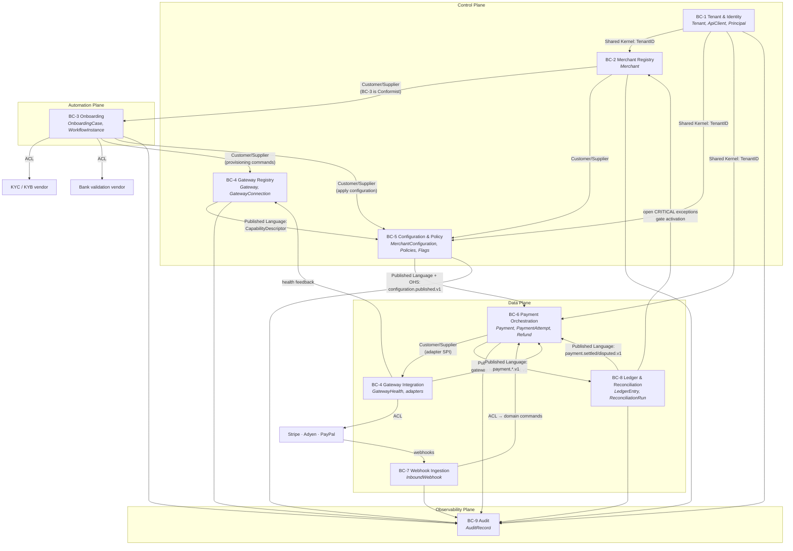

# 05 — Bounded Contexts and the Context Map

> Purpose: the binding definition of the nine bounded contexts named in
> [`00-design-baseline.md`](./00-design-baseline.md) §3 — what each owns, what it publishes,
> what it consumes, how it relates to its neighbours, and what may never cross the line between
> them. Aggregate names, table lists, event types and relationship patterns are the baseline's;
> this document expands them and adds the boundary rules that make them enforceable.

---

## 1. Why nine, and why these nine

The contexts are drawn on **three** axes simultaneously, and a boundary is only legitimate where
all three agree:

| Axis | Question it answers |
|---|---|
| **Language** | Does the word "merchant" mean the same thing on both sides? (In BC-2 it is a registry record; in BC-3 it is the subject of a case; in BC-6 it is a cached configuration snapshot. Three meanings ⇒ three contexts, with translation between them.) |
| **Consistency class** | Does a write here have to be transactionally consistent with a write there? (Baseline §15: payment writes are CP, config reads are AP with ≤ 30 s staleness. A boundary between them is what makes the data plane survive a control-plane outage.) |
| **Change and failure cadence** | Do these two things get deployed, scaled and paged on together? (Baseline §5 splits `payment-api` from `payment-orchestrator` for exactly this reason.) |

Boundaries drawn on language alone produce a distributed monolith with chatty synchronous calls.
Boundaries drawn on failure alone produce contexts whose ubiquitous languages leak into each
other. Nine is the number where all three axes agree; it is not a target.

---

## 2. Context map

Edge labels are the DDD relationship pattern in force. `BC-4` appears twice because the baseline
splits it across planes: the **registry** half is Control (low write rate, human-driven), the
**integration** half is Data (5 000 TPS, machine-driven). They share aggregates and a team but
not a runtime, and the split is why `gateway_health` has no `tenant_id` while
`gateway_connections` does.

---

## 3. Context catalogue

### BC-1 — Tenant & Identity

| Facet | Detail |
|---|---|
| **Purpose** | Establish who is calling and which isolation boundary they belong to. Every other context depends on this being right; nothing else works if it is wrong. |
| **Language deltas** | `Principal` here means an **authentication subject** (a human user or an `ApiClient`) — *not* a merchant director or UBO, which BC-2 calls `MerchantPrincipal`. `Scope` is an OAuth2 scope string, not a business scope. `Tier` is `POOLED \| SILOED` (baseline §16.1), never a commercial plan name. |
| **Aggregates owned** | `Tenant`, `ApiClient`, `Principal` |
| **Tables owned** | `tenants`, `api_clients`, `roles`, `role_bindings` |
| **Published events** | None in the baseline §13.2 catalog. Every mutation produces `audit.recorded.v1` via BC-9. Tenant lifecycle has no data-plane consumer, so publishing it would create a topic nobody reads. |
| **Consumed events** | None. |
| **Synchronous interfaces exposed** | gRPC `IdentityService.ResolvePrincipal(token) → {tenantID, subject, scopes}` (internal, mTLS, called by the edge middleware). JWKS endpoint. `GET /v1/tenants/{id}` (platform-operator scope only). |
| **Upstream of** | Every context. **Shared Kernel** — `TenantID` and the tenant-context propagation contract live in `internal/domain/shared` and change only with sign-off from every context owner (baseline §3). |
| **Downstream of** | Nothing. |
| **Team** | Platform Foundations |
| **Deployables** | `control-plane-api` (writes), and the identity resolution library linked into `payment-api`, `webhook-ingress`, `workflow-worker` — the *middleware* is shared code, the *authority* is BC-1. |

**Why the shared kernel is this small.** `TenantID` plus the rule "tenant comes from the token,
never from the body" (baseline §16.2) is the entire kernel. Adding `Merchant` to the kernel is the
most common suggestion and the most damaging: it would couple every context's deployment to BC-2's
model and make the tenancy guard un-auditable.

---

### BC-2 — Merchant Registry

| Facet | Detail |
|---|---|
| **Purpose** | System of record for *who the merchant is*: identity, business profile, bank accounts, principals, and lifecycle state. Owns the merchant FSM (baseline §8) and is the only writer of `merchants.status`. |
| **Language deltas** | `Merchant` here is the **registry record**, the full aggregate. In BC-6 the same word means a cached, read-only configuration snapshot with a status and a set of limits — a projection, not the aggregate. `Status` means the 20-state lifecycle FSM; it is never a boolean "active". `Principal` here is `MerchantPrincipal` (director/officer/UBO), disambiguated from BC-1's auth subject. |
| **Aggregates owned** | `Merchant` (with `BusinessProfile`, `BankAccount`, `MerchantPrincipal`) |
| **Tables owned** | `merchants`, `merchant_business_profile`, `merchant_bank_accounts`, `merchant_principals` ⊕ |
| **Published events** | `merchant.created.v1`, `merchant.activated.v1`, `merchant.suspended.v1`, `merchant.terminated.v1` |
| **Consumed events** | `merchant.validated.v1`, `merchant.kyc_approved.v1`, `merchant.kyc_failed.v1`, `merchant.bank_validated.v1`, `merchant.certified.v1` (all from BC-3) — each is a *request to consider a transition*, validated against the FSM before `merchants.status` moves. `configuration.published.v1` (BC-5) to know a validated configuration exists for the `→ ACTIVE` guard. |
| **Synchronous interfaces exposed** | `POST/GET/PATCH /v1/merchants`, `GET /v1/merchants` (cursor-paginated) — baseline §19.1. Internal gRPC `MerchantService.GetActivationEligibility(merchantID)`. |
| **Upstream of** | BC-3 (**Customer/Supplier**, with BC-3 as a **Conformist** — baseline §3: onboarding conforms to the registry's model rather than maintaining a translation), BC-5, BC-6 (via events). |
| **Downstream of** | BC-1 (Shared Kernel). BC-4 and BC-8 supply the `→ ACTIVE` guard inputs (certified connections; zero open critical exceptions) — a **Customer/Supplier** relationship in which BC-2 is the customer and refuses to activate without the supplier's evidence. |
| **Team** | Merchant Onboarding |
| **Deployables** | `control-plane-api`, `event-consumer` (for the BC-3 events it consumes) |

**The important asymmetry:** BC-3 drives the workflow but **BC-2 owns the FSM**. The workflow
*asks* for `→ KYC_APPROVED`; the merchant aggregate decides whether that transition is legal from
its current state. If BC-3 could write `merchants.status` directly, every guard in baseline §8
would be bypassable by a workflow bug, and the guards are the reason the FSM exists.

---

### BC-3 — Onboarding

| Facet | Detail |
|---|---|
| **Purpose** | Take a merchant from `CREATED` to `ACTIVE` through the durable, resumable, compensating 12-step workflow of baseline §11. Own the *process*, not the *decisions* — the KYC decision belongs to a vendor (baseline §1.2), the status transition belongs to BC-2, the provisioning belongs to BC-4. |
| **Language deltas** | `Case` is the business view; `Instance` is the engine view; they are 1:1 and both exist because a support agent asks about a case and an SRE asks about an instance. `Step` is a workflow step with a compensation, never an HTTP request. `Signal` is an external event the workflow waits for (`await-kyc-decision`, `compliance-review`), always authorized and always audited. `Gate` is a step that blocks on a human. |
| **Aggregates owned** | `OnboardingCase`, `WorkflowInstance`, `CertificationReport` |
| **Tables owned** | `onboarding_cases`, `workflow_instances`, `workflow_steps`, `workflow_dlq`, `certification_reports` ⊕ |
| **Published events** | `merchant.validated.v1`, `merchant.kyc_approved.v1`, `merchant.kyc_failed.v1`, `merchant.bank_validated.v1`, `merchant.certified.v1` |
| **Consumed events** | `merchant.created.v1` (starts the workflow), `merchant.gateway_provisioned.v1` (BC-4, resolves step 5), `configuration.published.v1` (BC-5, resolves step 8). |
| **Synchronous interfaces exposed** | `POST /v1/merchants/{id}/onboarding`, `GET /v1/merchants/{id}/onboarding`, `POST /v1/merchants/{id}/onboarding/signals/{signal}` (scope `onboarding:approve`). Internal gRPC `WorkflowService.Describe(instanceID)` for operator tooling. |
| **Upstream of** | Nothing in the domain sense; it *drives* BC-2, BC-4 and BC-5 through their published interfaces, as a customer. |
| **Downstream of** | BC-2 (**Conformist** — no translation layer, baseline §3). External KYC and bank-validation vendors (**Anti-Corruption Layer** — vendor types never reach `internal/domain`; each vendor gets a port and an adapter). |
| **Team** | Merchant Onboarding |
| **Deployables** | `workflow-worker` (leases and executes), `control-plane-api` (case reads and signal ingress), `platformctl` (certification runs) |

**ACL detail.** The KYC vendor's model — cases, checks, decisions, document uploads, webhook
callbacks — is entirely absent from `internal/domain`. The port is
`ports.KycProvider{Submit(subject) (VendorRef, error); FetchDecision(VendorRef) (Decision, error); Cancel(VendorRef) error}`,
where `Decision` is `APPROVED | REJECTED | REVIEW` and nothing else. When the vendor adds a fourth
outcome, exactly one adapter file changes.

---

### BC-4 — Gateway Registry & Integration

| Facet | Detail |
|---|---|
| **Purpose** | Be the single place that knows what a gateway can do (registry), how to talk to it (integration), whether it is currently working (health), and whether a given merchant is properly bound to it (connection). Contain every gateway's vocabulary so that no other context learns it. |
| **Language deltas** | `Gateway` is our normalized model of a processor, never the vendor's SDK object. `Operation` is our verb set (`AUTHORIZE, CAPTURE, REFUND, VOID, LOOKUP, PROVISION`), not the vendor's endpoint names. `Health` is per `(gateway, operation)` and **never** per merchant (baseline §10) — "this merchant's Stripe is unhealthy" is a sentence that cannot be said in this language. `Connection` is our binding record, not the vendor's account object. `Certified` means "a passing `CertificationReport` exists", never an operator's opinion (A11). |
| **Aggregates owned** | `Gateway`, `GatewayConnection`, `GatewayHealth` |
| **Tables owned** | `gateways`, `gateway_connections`, `gateway_credentials_meta`, `gateway_health` |
| **Published events** | `merchant.gateway_provisioned.v1`, `gateway.health_changed.v1` |
| **Consumed events** | `payment.attempted.v1`, `payment.failed.v1` — as health *samples* (routing feedback per baseline §13.2). Note the direction: BC-6 does not call BC-4 to report health; it publishes what happened and BC-4 draws its own conclusions. |
| **Synchronous interfaces exposed** | `GET /v1/gateways`, `GET /v1/gateways/{id}`, `GET /v1/gateways/{id}/health`, `POST /v1/gateways/{id}/credentials:rotate`. Internal: the **adapter SPI** (`internal/adapters/gateway/spi`) — an in-process Go interface, not a network call, consumed by `payment-orchestrator`. |
| **Upstream of** | BC-5 (**Published Language**: the `CapabilityDescriptor` is the vocabulary BC-5 validates configurations against), BC-6 (**Published Language**: `gateway.health_changed.v1`; and **Customer/Supplier** for the SPI, where BC-6 is the customer and the SPI may not break without a version bump). |
| **Downstream of** | Every external gateway (**Anti-Corruption Layer** — baseline §3: *no gateway type ever appears in `internal/domain`*). BC-3 for provisioning commands (Customer/Supplier, BC-3 is the customer). |
| **Team** | Gateway Integrations |
| **Deployables** | `control-plane-api` (registry reads/writes), `payment-orchestrator` (the adapters and the health windows), `workflow-worker` (provisioning steps), `gateway-simulator` (test only, `//go:build`-guarded out of prod images) |

**The ACL is the point of this context.** The contract test suite
(`internal/adapters/gateway/contract`) runs the identical scenario set against Stripe, Adyen,
PayPal and the simulator, asserting that all four produce the same normalized outcomes, the same
`DeclineReason` classification, and the same errors. A gateway whose adapter fails the suite
cannot be registered.

---

### BC-5 — Configuration & Policy

| Facet | Detail |
|---|---|
| **Purpose** | Own **desired state**: the versioned, validated, auditable configuration document (baseline §23) and the routing, risk and compliance policies it resolves. Publish it as a language the data plane can consume without ever calling back. |
| **Language deltas** | `Version` is a dense per-merchant integer, not a semver and not a timestamp. `Publish` is an append that supersedes; `Rollback` is *also* an append — nothing is ever deleted or edited (baseline §23). `Policy` is a declarative document, never executable code. `Desired state` vs **`Actual state`** is the axis this whole context lives on; a configuration that has been published is desired, and BC-4's connections are actual. |
| **Aggregates owned** | `MerchantConfiguration`, `RoutingPolicy`, `RiskPolicy`, `CompliancePolicy`, `FeatureFlag` |
| **Tables owned** | `configurations`, `configuration_versions`, `policies`, `feature_flags` |
| **Published events** | `configuration.published.v1`, `configuration.rolled_back.v1` |
| **Consumed events** | `merchant.gateway_provisioned.v1` (a new certified connection widens the set of valid configurations), `merchant.suspended.v1` / `merchant.terminated.v1` (mark configurations inert). |
| **Synchronous interfaces exposed** | `GET/PUT /v1/merchants/{id}/configuration`, `GET …/configuration/versions`, `POST …/configuration/rollback` — all with `If-Match` (baseline §19.1). Internal gRPC `ConfigService.GetActiveSnapshot(merchantID)` — the **cache-miss** path only, never the hot path. |
| **Upstream of** | BC-6, BC-4-integration (**Published Language** + **Open Host Service**). The configuration document schema in `api/openapi` is the published language; the OHS is the pair (`configuration.published.v1` topic, `GetActiveSnapshot` gRPC) that any consumer may use without a bespoke integration. |
| **Downstream of** | BC-2 (a configuration cannot exist without a merchant), BC-4 (capability descriptors constrain what is valid). |
| **Team** | Trust & Compliance (policy), Platform Foundations (configuration machinery) |
| **Deployables** | `control-plane-api`, `event-consumer` |

**Customer/Supplier obligation, stated as a contract.** BC-5 is the supplier and BC-6 the customer
(baseline §3). BC-5 may not make a breaking change to `configuration.published.v1` without
publishing a `.v2` alongside `.v1` and waiting for BC-6 to migrate (`docs/events.md` §3). The
enforcement is not goodwill: the schema-registry compatibility check in CI fails the build.

---

### BC-6 — Payment Orchestration

| Facet | Detail |
|---|---|
| **Purpose** | Execute payment intents against gateways with routing, failover, idempotency and a strict state machine. This is the context where correctness is expensive and everything else is negotiable. |
| **Language deltas** | `Merchant` here is a **read-only cached snapshot** with a status, limits and a routing policy — the aggregate lives in BC-2 and is unreachable from here. `Gateway` is an adapter handle plus a health verdict. `Attempt` is the unit of gateway interaction and is unique to this context. `Idempotency Key` here means the *client's* key; the gateway's key is always spelled `gateway_idempotency_key` (baseline §14.4) and confusing the two is the defect this vocabulary exists to prevent. |
| **Aggregates owned** | `Payment` (root), `PaymentAttempt`, `Refund`, `RoutingPlan`, `IdempotencyRecord` |
| **Tables owned** | `payments`, `payment_attempts`, `refunds`, `routing_plans`, `idempotency_records`, `payment_event_log` ⊕ |
| **Published events** | `payment.created.v1`, `payment.attempted.v1`, `payment.authorized.v1`, `payment.captured.v1`, `payment.failed.v1`, `payment.voided.v1`, `payment.refunded.v1`, `payment.reconciliation_required.v1` |
| **Consumed events** | `merchant.activated.v1`, `merchant.suspended.v1` (**priority cache invalidation** — baseline §13.2), `merchant.terminated.v1`, `configuration.published.v1`, `configuration.rolled_back.v1`, `gateway.health_changed.v1`, `payment.settled.v1` and `payment.disputed.v1` (from BC-8 — settlement and disputes are *observed*, and BC-6 applies them to the payment FSM). |
| **Synchronous interfaces exposed** | `POST /v1/payments`, `GET /v1/payments/{id}`, `GET /v1/payments`, `POST …/capture`, `…/refund`, `…/void` (baseline §19.2). Internal gRPC `PaymentCommandService` used by BC-7's processor and BC-8's reconciler to *issue commands* — never to write state. |
| **Upstream of** | BC-8 (**Published Language**: `payment.*.v1`). |
| **Downstream of** | BC-5 (**Customer**, cached config, fail-static), BC-4 (**Customer** of the adapter SPI and of health), BC-1 (Shared Kernel), BC-7 (receives translated commands). |
| **Team** | Payments Core |
| **Deployables** | `payment-api` (ingress, stateless, scales on connections), `payment-orchestrator` (FSM + gateway calls, bulkheaded per gateway, scales on in-flight calls), `outbox-relay`, `event-consumer` |

**Fail-static dependency on BC-5.** BC-6 never calls BC-5 synchronously on the payment path. It
holds a snapshot, refreshed by `configuration.published.v1` with a ≤ 30 s bound (baseline §15),
exports `pp_config_snapshot_age_seconds`, alerts past 5 minutes, and past
`max_config_staleness` (15 min) fails closed **for new merchants only** while continuing to serve
existing ones. That cliff is a designed behaviour, not a fallback.

---

### BC-7 — Webhook Ingestion

| Facet | Detail |
|---|---|
| **Purpose** | Accept gateway callbacks in ≤ 50 ms, verify them, persist them, and translate them into domain commands. It is an **anti-corruption layer with a database**, and it owns no money state. |
| **Language deltas** | `Webhook` here is an *inbound* callback from a gateway. Merchant-facing outbound notifications (configuration §23 `webhooks.endpoints`) are called **notifications** and belong to `event-consumer`; using the same word for both is the mistake this delta exists to prevent. `gateway_ref` is the gateway's own event ID, our dedup key and our partition key. `Verified` means signature-valid *and* within the ±5 min skew window. |
| **Aggregates owned** | `InboundWebhook` |
| **Tables owned** | `inbound_webhooks`, `webhook_dedup` |
| **Published events** | `webhook.received.v1` (partition key `gateway_ref`) |
| **Consumed events** | `webhook.received.v1` — the processor is a separate consumer of the ingress's own event, which is what makes ingest and processing independently scalable and independently failable. |
| **Synchronous interfaces exposed** | `POST /v1/webhooks/{gateway}` — signature-authenticated, no platform auth (baseline §19.2). |
| **Upstream of** | BC-6 (it issues commands via `PaymentCommandService`), BC-8 (settlement and dispute payloads). |
| **Downstream of** | Every external gateway (**Anti-Corruption Layer** — baseline §3). |
| **Team** | Gateway Integrations |
| **Deployables** | `webhook-ingress` (accept-and-persist only), `event-consumer` (processing) |

**Why the split into two deployables is a boundary decision, not a deployment decision.** Gateway
webhook volume is spiky and the gateway will retry aggressively if we are slow. The ingress must
therefore have a hard, small latency budget and no dependency that can be slow. Processing has to
load payments, evaluate state transitions and write the ledger — none of which fits in 50 ms.
Putting them in one process would make a slow payment write cause a gateway retry storm, which
would cause more slow payment writes.

---

### BC-8 — Ledger & Reconciliation

| Facet | Detail |
|---|---|
| **Purpose** | Maintain a shadow double-entry ledger of what the platform believes happened, and continuously prove that belief against the gateways' reports. Raise an exception whenever the two disagree. |
| **Language deltas** | `Ledger` is a **shadow** ledger for reconciliation, explicitly **not** a money-custody ledger (A1) — we take no custody of funds. `Settlement` is *observed*, never computed (A12). `Entry` is immutable; a correction is a **reversing entry**, and the word "adjust" does not exist in this language. `Exception` is a reconciliation discrepancy with a severity, not a programming exception. `Balance` is a projection; the entries are the authority. |
| **Aggregates owned** | `LedgerAccount`, `LedgerEntry`, `ReconciliationRun` (with `ReconciliationException`) |
| **Tables owned** | `ledger_entries`, `ledger_accounts`, `ledger_balances` ⊕, `reconciliation_runs`, `reconciliation_exceptions` |
| **Published events** | `payment.settled.v1`, `payment.disputed.v1` |
| **Consumed events** | `payment.authorized.v1`, `payment.captured.v1`, `payment.failed.v1`, `payment.voided.v1`, `payment.refunded.v1`, `payment.reconciliation_required.v1`, `webhook.received.v1` (settlement report payloads) |
| **Synchronous interfaces exposed** | Internal gRPC `ReconciliationService.OpenExceptionCount(merchantID, severity)` — the `→ ACTIVE` guard's evidence. Operator reads over `reconciliation_runs` / `reconciliation_exceptions`. No public API: merchants do not read our shadow ledger, because it is not the authoritative record of their money — their gateway statement is. |
| **Upstream of** | BC-6 (settlement/dispute events feed the payment FSM), BC-2 (open critical exceptions gate activation). |
| **Downstream of** | BC-6, BC-7 (**Published Language** — pure event consumer; it never calls BC-6 synchronously except to *issue a command* when a reconciliation resolves an unknown attempt). |
| **Team** | Money Data |
| **Deployables** | `event-consumer` (ledger projection), `platformctl` (reconciliation runs), `control-plane-api` (exception reads) |

**The one place BC-8 is allowed to affect BC-6.** Baseline §12.3: a payment stuck in `PROCESSING`
because of a `TIMEOUT_UNKNOWN` attempt may be resolved only by (a) a gateway webhook, (b) the
reconciler polling the gateway's lookup API with our deterministic key, or (c) a settlement
report. In all three cases BC-8 **issues a command** to BC-6 and BC-6's aggregate validates it.
BC-8 never writes `payments.state`. No timer may fail a payment.

---

### BC-9 — Audit

| Facet | Detail |
|---|---|
| **Purpose** | Record what an *actor* did, tamper-evidently, for seven years. Distinct from domain events, which record what the *domain decided*. |
| **Language deltas** | `Actor` is a human, API client, system component or workflow — the entity accountable for the action. `Record` is append-only and hash-chained; there is no update and no delete verb in this language. `Diff` is the before/after of a change with secrets and PII already redacted. |
| **Aggregates owned** | `AuditRecord` |
| **Tables owned** | `audit_records` (hash-chained, monthly range partitions) |
| **Published events** | `audit.recorded.v1` (partition key `tenant_id`; consumers: audit sink, SIEM) |
| **Consumed events** | Effectively all of them, plus direct audit writes from every context. |
| **Synchronous interfaces exposed** | Read-only operator/regulator queries by `(tenant, resource)` and `(tenant, actor)`; `platformctl audit verify` for chain verification. **No write API** — audit records are produced by the platform, never submitted to it. |
| **Upstream of** | Nothing. |
| **Downstream of** | Everything (**Conformist** — BC-9 accepts whatever vocabulary its producers use and normalizes only `actor`, `action`, `resource`, `outcome`). |
| **Team** | Trust & Compliance |
| **Deployables** | `event-consumer` (audit sink), plus the audit-write library linked into every service |

---

## 4. Summary matrix

| BC | Aggregates | Tables | Publishes | Consumes | Plane | Team | Deployables |
|---|---|---|---|---|---|---|---|
| 1 | Tenant, ApiClient, Principal | 4 | — (audit only) | — | Control | Platform Foundations | `control-plane-api` |
| 2 | Merchant | 4 | 4 merchant events | 5 BC-3 events, config | Control | Merchant Onboarding | `control-plane-api`, `event-consumer` |
| 3 | OnboardingCase, WorkflowInstance, CertificationReport | 5 | 5 merchant lifecycle events | created, provisioned, config | Automation | Merchant Onboarding | `workflow-worker`, `control-plane-api`, `platformctl` |
| 4 | Gateway, GatewayConnection, GatewayHealth | 4 | provisioned, health_changed | attempted, failed | Control + Data | Gateway Integrations | `control-plane-api`, `payment-orchestrator`, `workflow-worker`, `gateway-simulator` |
| 5 | MerchantConfiguration, Routing/Risk/CompliancePolicy, FeatureFlag | 4 | published, rolled_back | provisioned, suspended, terminated | Control | Trust & Compliance + Platform Foundations | `control-plane-api`, `event-consumer` |
| 6 | Payment, PaymentAttempt, Refund, RoutingPlan, IdempotencyRecord | 6 | 8 payment events | merchant, config, health, settled, disputed | Data | Payments Core | `payment-api`, `payment-orchestrator`, `outbox-relay`, `event-consumer` |
| 7 | InboundWebhook | 2 | webhook.received | webhook.received | Data | Gateway Integrations | `webhook-ingress`, `event-consumer` |
| 8 | LedgerAccount, LedgerEntry, ReconciliationRun | 5 | settled, disputed | 6 payment events, webhook.received | Data | Money Data | `event-consumer`, `platformctl` |
| 9 | AuditRecord | 1 | audit.recorded | all | Observability | Trust & Compliance | `event-consumer` + library |

---

## 5. Boundary rules

These are not guidelines. Each has a mechanical check, because a boundary that is only a
convention is a boundary that is already broken.

### 5.1 What may never cross a context boundary

| Rule | Statement | Check |
|---|---|---|
| **B1 — No shared tables** | A table has exactly one owning context. No other context reads it, writes it, or joins to it — not even `SELECT`. The owner may not grant access to another context's database role. | Per-context Postgres roles with `GRANT` only on owned tables. A `scripts/check-table-ownership.sh` diffing `information_schema.role_table_grants` against §4 would make this mechanical; **it does not exist**, so B1 is enforced by the per-context `GRANT`s in `migrations/0001_extensions_roles_schema.up.sql` and by review. | <!-- doc-refs: allow-missing -->
| **B2 — No cross-context foreign keys** | `payments.merchant_id` has **no** FK to `merchants`. `gateway_connections.merchant_id` has **no** FK to `merchants`. A FK is a synchronous coupling with a distributed-deadlock failure mode and it makes independent schema evolution impossible. | A migration linter parses every `REFERENCES` clause and fails if the referenced table belongs to a different context. |
| **B3 — No cross-context transactions** | One database transaction touches tables of one context only. There is no 2PC, no XA, no `dblink`, no distributed transaction manager. | The repository layer takes a context-scoped `*sql.DB`; there is only one handle per context in the composition root, so a cross-context transaction cannot be *expressed*. `scripts/check-architecture.sh` asserts the wiring. |
| **B4 — Integration is by event or published interface only** | The only two legal ways to reach another context are: consume its published event, or call its published synchronous interface (REST for external, gRPC for internal). Reading its cache, its Kafka internal topics, or its database is prohibited. | Network policies restrict database access per service account (IRSA, one IAM role per deployable — baseline §17.2). Kafka ACLs restrict per principal. |
| **B5 — No foreign domain types** | `internal/domain/<contextA>` may not import `internal/domain/<contextB>`. The only shared domain package is `internal/domain/shared` (the Shared Kernel). | `scripts/check-architecture.sh`, wired into CI (baseline §4). |
| **B6 — No gateway vocabulary in the domain** | No Stripe/Adyen/PayPal type, error code, status string or field name appears anywhere in `internal/domain` or `internal/application`. | Import-graph check plus a grep-based lint over a vendor-term deny-list. |
| **B7 — Events are the only cross-context write path** | A context never writes another context's state, even through an API. It issues a **command** to the owner, and the owner's aggregate validates it. BC-7 and BC-8 both issue payment commands; neither writes `payments`. | B1 makes it physically true; code review enforces the command-vs-write distinction. |
| **B8 — Tenant context propagates, tenant claims do not** | Every cross-context call and every event carries `tenantid`, but the *authority* for tenancy is always the original token (baseline §16.2). A downstream context may not accept a tenant asserted by an upstream service without the propagated, signed context. | Service-mesh mTLS identity + the `tenantid` envelope field; `TestCrossTenantAccessIsImpossible` at the database level. |

### 5.2 Referential integrity without foreign keys

Rule B2 removes the database's ability to guarantee that `payments.merchant_id` refers to a real
merchant. That guarantee is replaced by five mechanisms, in order of when they act:

| # | Mechanism | Acts when | Detail |
|---|---|---|---|
| 1 | **Validation at the boundary** | Before the write | `POST /v1/payments` resolves the merchant from BC-6's cached snapshot; an unknown merchant is `404 MERCHANT_NOT_FOUND`, a non-`ACTIVE` merchant is `409 MERCHANT_NOT_ACTIVE` (baseline §12 stage 9). A payment for a merchant that does not exist cannot be created. |
| 2 | **Format constraints** | At the write | `CHECK (merchant_id ~ '^mrc_[0-9A-HJKMNP-TV-Z]{26}$')`. This does not prove existence, but it makes a typo, a truncation or a cross-entity mix-up (`ten_` in a `merchant_id` column) impossible — which is the failure a FK would most often have caught. |
| 3 | **Event-driven propagation with ordering** | Continuously | Merchant lifecycle events are keyed on `merchant_id`, so all events for one merchant are ordered within their partition (baseline §13.3). BC-6's snapshot therefore converges monotonically; it cannot apply `activated` after `terminated`. |
| 4 | **Referential reconciliation** | Nightly | `reconciliation_runs` of type `DESIRED_VS_ACTUAL_CONFIG` includes a **referential sweep**: every distinct `merchant_id` in `payments` from the last 24 h is checked against BC-2 via `MerchantService`. A dangling reference opens a `CRITICAL` exception, pages, and is treated as a bug in mechanism 1 — not as routine cleanup. |
| 5 | **Deletion does not happen** | Always | There is no `DELETE` on `merchants`; terminal state is `TERMINATED`, and `→ TERMINATED` requires zero payments in a non-terminal state (baseline §8). The classic dangling-FK scenario — parent deleted, children orphaned — is therefore not reachable. This is why B2 is affordable: the platform has no hard deletes anywhere on the money path. |

**What is explicitly accepted.** Between a merchant's creation in BC-2 and its appearance in BC-6's
snapshot there is a window (≤ 30 s p99, baseline §18) in which a payment for that merchant is
rejected with `404`. That is a deliberate trade: the alternative is a synchronous control-plane
call on the payment hot path, which would take the data plane's availability down to the control
plane's (99.9 % instead of 99.99 % — baseline §18) and add a partition-mode failure that fails
*closed on revenue*. A 30-second onboarding-to-first-payment delay is cheaper than that, every time.

### 5.3 Consistency across boundaries

| Boundary | Consistency | Bound | What breaks if it is exceeded |
|---|---|---|---|
| BC-5 → BC-6 (configuration) | Eventual, bounded staleness | ≤ 30 s p99 | Payments processed against a superseded limit. Bounded by the cliff at 15 min (fail closed for new merchants). |
| BC-2 → BC-6 (merchant status) | Eventual, **priority invalidation** for `suspended` | ≤ 5 s target | A suspended merchant briefly still processes. Suspension is therefore also enforced at the gateway-connection layer as defence in depth. |
| BC-4 → BC-6 (health) | Eventual, AP, decaying confidence | ≤ 10 s | Routing sends traffic to a degraded gateway; the local circuit breaker catches it within one window. |
| BC-6 → BC-8 (ledger) | Eventual, at-least-once, idempotent | ≤ 60 s p99 | Ledger lags; reconciliation windows are sized to absorb it. |
| BC-6 internal (payment ⇄ attempts ⇄ refunds) | **Strong** — one aggregate, one transaction | 0 | I1, I2, I3 would be unenforceable. This is why R-TX-2 exists. |
| BC-3 → BC-2 (status transitions) | Eventual via events, validated by the FSM | ≤ 30 s | An onboarding step's effect appears late; the workflow's next step waits on the event, so it is self-correcting. |

### 5.4 Anti-patterns this document exists to prevent

| Anti-pattern | Why it is tempting | Why it is refused |
|---|---|---|
| A `merchants` join in a payments query | "It's one join, and the data is right there." | It makes BC-6's availability depend on BC-2's schema, blocks independent partitioning, and breaks the moment the contexts are deployed to separate clusters for a siloed tenant (baseline §16.1). |
| A shared "common" database schema | DRY instinct. | It is the mechanism by which nine contexts become one distributed monolith with nine deployment pipelines and one blast radius. |
| A synchronous `GetConfiguration` call on the payment path | Simplest correct-looking code. | Baseline §15 forbids it explicitly: the data plane must not have a synchronous dependency on the control plane. |
| `Merchant` in the Shared Kernel | It is used everywhere. | The kernel would then change on BC-2's cadence and every context would redeploy. The kernel stays at `TenantID`, `Money`, `Currency`, `Country`, `Clock`, `DomainError` (baseline §3). |
| BC-3 writing `merchants.status` directly | The workflow "knows" the next state. | It bypasses every guard in baseline §8, including "no open critical reconciliation exception" and "at least one CERTIFIED connection". The guards are the FSM's reason for existing. |
| A `payment_id` FK from `ledger_entries` | Ledger rows are about payments. | B2. The ledger is a downstream event consumer; a FK would make ledger writes fail when the payment partition has been archived, which is guaranteed to happen at month 14. |
