# State Machines

> Purpose: every finite state machine in the platform, as an explicit transition table with
> guards, side effects, emitted events, terminal states, forbidden transitions and dual
> (code + database) enforcement. Derived from and subordinate to
> [`docs/spec/00-design-baseline.md`](./spec/00-design-baseline.md) §8 (merchant), §9 (payment),
> §9.1 (attempt) and §10 (gateway health); the remaining machines are specified here and are
> binding on the same terms.

---

## 1. Conventions

| Convention | Meaning |
|---|---|
| **Trigger** | The command or observed fact that requests the transition. Named as it appears in `internal/domain`. |
| **Guard** | A pure predicate that must hold. A false guard is a rejection, not a retry. |
| **Side effects** | What the transaction does besides changing the state column — always including the outbox row when an event is emitted (baseline §13.4). |
| **Event** | The baseline §13.2 event type published. `—` means no catalog event; the change is audited only. |
| **Terminal** | No outgoing transitions. Enforced by the table's absence of rows, not by an `if`. |
| **Rejection** | Every transition not in the table fails with `409 INVALID_STATE_TRANSITION` (baseline §20.2) in code and SQLSTATE `23514` at the database. |

Every machine is defined once, in `api/fsm/<machine>.yaml`, from which three artifacts are
generated (§14.3): the Go transition table, the SQL seed for `fsm_transitions`, and the mermaid
diagrams in this document. A hand-edit to any of the three is a CI failure.

---

## 2. Merchant lifecycle

**Owner:** BC-2 Merchant Registry · **Table:** `merchants.status` · **States:** 20 · **Transitions:** 37

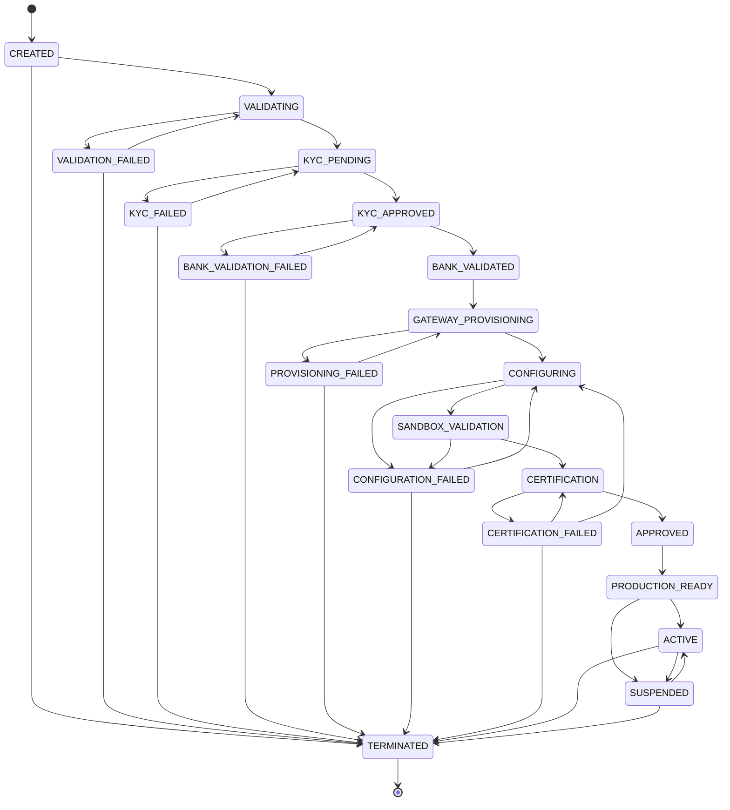

### 2.1 Transition table

| # | From | To | Trigger | Guard | Side effects | Event |
|---|---|---|---|---|---|---|
| 1 | `CREATED` | `VALIDATING` | `StartOnboarding` | business profile complete; ≥ 1 `MerchantPrincipal` with `is_ubo`; tenant `ACTIVE` and under `max_merchants` | open `OnboardingCase`; start `merchant-onboarding@v1` with business key `merchant_id` | `merchant.created.v1` (on create), workflow start |
| 2 | `CREATED` | `TERMINATED` | `TerminateMerchant` | zero payments in a non-terminal state | close case as `ABANDONED` | `merchant.terminated.v1` |
| 3 | `VALIDATING` | `KYC_PENDING` | `RecordValidationPassed` | all L2 rules `ERROR`-free | workflow step 2 `submit-kyc` dispatched | `merchant.validated.v1` |
| 4 | `VALIDATING` | `VALIDATION_FAILED` | `RecordValidationFailed` | ≥ 1 L2 `ERROR` outcome | annotate case with `RuleID`s; block case | — (audited) |
| 5 | `VALIDATION_FAILED` | `VALIDATING` | `ResubmitForValidation` | profile changed since the failure (`version` advanced) | unblock case; re-run L2 | — |
| 6 | `VALIDATION_FAILED` | `TERMINATED` | `TerminateMerchant` | as #2 | | `merchant.terminated.v1` |
| 7 | `KYC_PENDING` | `KYC_APPROVED` | `RecordKycDecision(APPROVED)` | vendor decision signed and matched to `kyc_reference`; evidence stored under Object Lock | step 3 signal resolved; step 4 dispatched | `merchant.kyc_approved.v1` |
| 8 | `KYC_PENDING` | `KYC_FAILED` | `RecordKycDecision(REJECTED)` | as above | block case; notify | `merchant.kyc_failed.v1` |
| 9 | `KYC_FAILED` | `KYC_PENDING` | `ResubmitKyc` | at least one principal or document changed; resubmission count < 3 | new vendor case; new `kyc_reference` | — |
| 10 | `KYC_FAILED` | `TERMINATED` | `TerminateMerchant` | as #2 | | `merchant.terminated.v1` |
| 11 | `KYC_APPROVED` | `BANK_VALIDATED` | `RecordBankValidation(PASSED)` | primary bank account exists for the settlement currency; vendor says the account is open and name-matched | mark account `VALIDATED` | `merchant.bank_validated.v1` |
| 12 | `KYC_APPROVED` | `BANK_VALIDATION_FAILED` | `RecordBankValidation(FAILED)` | — | annotate; block case | — |
| 13 | `BANK_VALIDATION_FAILED` | `KYC_APPROVED` | `ReplaceBankAccount` | a **new** bank account row exists (never a retry on the same failed account) | unblock; re-dispatch step 4 | — |
| 14 | `BANK_VALIDATION_FAILED` | `TERMINATED` | `TerminateMerchant` | as #2 | | `merchant.terminated.v1` |
| 15 | `BANK_VALIDATED` | `GATEWAY_PROVISIONING` | `BeginProvisioning` | ≥ 1 gateway selected; each selected gateway `ACTIVE` and its capability descriptor covers the declared currencies/methods/countries | fan-out step 5 per gateway; create `GatewayConnection` rows in `UNPROVISIONED` | — |
| 16 | `GATEWAY_PROVISIONING` | `CONFIGURING` | `RecordProvisioningComplete` | **every** selected connection in `PROVISIONED`; credentials stored; webhooks registered | dispatch step 8 | `merchant.gateway_provisioned.v1` (per connection, from BC-4) |
| 17 | `GATEWAY_PROVISIONING` | `PROVISIONING_FAILED` | `RecordProvisioningFailed` | a step-5 activity exhausted its retries | run compensations in reverse (de-provision sub-accounts) | — |
| 18 | `PROVISIONING_FAILED` | `GATEWAY_PROVISIONING` | `RetryProvisioning` | operator or automation retry; `attempt_epoch` incremented | new workflow epoch; idempotent on external refs | — |
| 19 | `PROVISIONING_FAILED` | `TERMINATED` | `TerminateMerchant` | as #2 | compensations completed | `merchant.terminated.v1` |
| 20 | `CONFIGURING` | `SANDBOX_VALIDATION` | `RecordConfigurationApplied` | `configuration.published.v1` observed for this merchant at the expected version; L4 passed | dispatch step 9 | — |
| 21 | `CONFIGURING` | `CONFIGURATION_FAILED` | `RecordConfigurationFailed` | L4 `ERROR` or apply timeout | roll back to the previous config version (append, not delete) | `configuration.rolled_back.v1` |
| 22 | `CONFIGURATION_FAILED` | `CONFIGURING` | `RetryConfiguration` | configuration document changed | | — |
| 23 | `CONFIGURATION_FAILED` | `TERMINATED` | `TerminateMerchant` | as #2 | | `merchant.terminated.v1` |
| 24 | `SANDBOX_VALIDATION` | `CERTIFICATION` | `RecordSandboxPassed` | sandbox suite passed for every enabled `(gateway, method, currency)` | dispatch step 10 (full matrix) | — |
| 25 | `SANDBOX_VALIDATION` | `CONFIGURATION_FAILED` | `RecordSandboxFailed` | any sandbox assertion failed | annotate with the failing assertion IDs | — |
| 26 | `CERTIFICATION` | `APPROVED` | `RecordCertificationPassed` | a `CertificationReport` in `PASSED` exists for the **production** environment, sealed, digest verified | attach `certification_report_id`; connections → `CERTIFIED` | `merchant.certified.v1` |
| 27 | `CERTIFICATION` | `CERTIFICATION_FAILED` | `RecordCertificationFailed` | any of the seven baseline §11.4 assertions failed in any matrix cell | report sealed as `FAILED` (immutable) | — |
| 28 | `CERTIFICATION_FAILED` | `CERTIFICATION` | `RerunCertification` | a change was made (adapter version, config version or connection) since the failure | **new** report; the failed one is never amended | — |
| 29 | `CERTIFICATION_FAILED` | `CONFIGURING` | `ReconfigureAfterCertificationFailure` | the failure class is configuration, not integration | | — |
| 30 | `CERTIFICATION_FAILED` | `TERMINATED` | `TerminateMerchant` | as #2 | | `merchant.terminated.v1` |
| 31 | `APPROVED` | `PRODUCTION_READY` | `MarkProductionReady` | passing production `CertificationReport` attached (A11 — unreachable without it) | | — |
| 32 | `PRODUCTION_READY` | `ACTIVE` | `Activate` | **the four-part guard**: ≥ 1 `GatewayConnection` in `CERTIFIED`; non-empty validated `MerchantConfiguration`; completed compliance attestation, unexpired; zero open `CRITICAL` reconciliation exceptions | set `activated_at`; publish for data-plane cache warm | `merchant.activated.v1` |
| 33 | `PRODUCTION_READY` | `SUSPENDED` | `Suspend(reason)` | operator or automation | | `merchant.suspended.v1` |
| 34 | `ACTIVE` | `SUSPENDED` | `Suspend(reason)` | operator **or** automation plane (risk breach, compliance expiry, gateway de-provisioning) | **priority cache invalidation** in the data plane; new payments rejected; refunds, voids and webhook processing continue | `merchant.suspended.v1` |
| 35 | `ACTIVE` | `TERMINATED` | `TerminateMerchant` | zero payments in a non-terminal state | revoke connections; retire configuration | `merchant.terminated.v1` |
| 36 | `SUSPENDED` | `ACTIVE` | `Resume` | the suspension reason is cleared; the #32 guard re-evaluated in full | | `merchant.activated.v1` |
| 37 | `SUSPENDED` | `TERMINATED` | `TerminateMerchant` | as #35 | | `merchant.terminated.v1` |

**Terminal states:** `TERMINATED` only. Every `*_FAILED` state is *recoverable* by design — a
failed KYC is a resubmission, not an ending.

### 2.2 Forbidden transitions worth naming

| Forbidden | Why it is dangerous |
|---|---|
| `CREATED → ACTIVE` (or any skip) | Skips KYC, bank validation, provisioning and certification. A merchant processing live money with no KYB record is a regulatory incident, not a bug. |
| `PRODUCTION_READY → CERTIFICATION` | Would allow re-certification to silently invalidate an already-live merchant's readiness while payments are in flight. Re-certification of a live merchant happens on a `CERTIFIED → CERTIFYING` connection transition (§7), which is scoped to one gateway and cannot un-activate the merchant. |
| `TERMINATED → *` | Termination releases the merchant's credentials, revokes its connections and permits data erasure. Resurrecting the record would re-associate a live merchant with de-provisioned gateway accounts. A returning merchant is a **new** `merchant_id`. |
| `SUSPENDED → PRODUCTION_READY` | Would let a suspension be cleared without re-evaluating the #32 guard. `SUSPENDED → ACTIVE` is the only exit and it re-runs all four guard clauses. |
| `KYC_FAILED → KYC_APPROVED` | Would let an approval overwrite a rejection without a new vendor decision. Approval must come from a *new* `kyc_reference`, which requires passing through `KYC_PENDING`. |
| `ACTIVE → CONFIGURING` | Configuration changes for a live merchant go through BC-5's versioned publish path, which is non-disruptive. Dropping a live merchant back into an onboarding state would stop payments for a config edit. |
| `BANK_VALIDATION_FAILED → BANK_VALIDATED` | The only exit is via `KYC_APPROVED` with a **new** account (#13). Retrying validation on an account that already failed is how a typo becomes a settlement to the wrong beneficiary. |

### 2.3 Enforcement

| Layer | Mechanism |
|---|---|
| Domain | `merchant.Status.CanTransitionTo(to)` consults the generated table. `Merchant.TransitionStatus()` calls it first, then evaluates the guard, then mutates. No other code path writes `status`. |
| Application | The activation guard's evidence (`CERTIFIED` connections, config, attestation, exception count) is gathered by `merchant.ActivationGuard` and passed *in*; the aggregate never fetches. |
| Database | `CHECK (status IN (…20 values…))`; `BEFORE UPDATE` trigger `merchants_status_transition()` looks up `(from, to)` in `fsm_transitions WHERE machine = 'merchant'` and raises `ERRCODE 23514` if absent; `CHECK (status <> 'ACTIVE' OR activated_at IS NOT NULL)`. |
| Test | `TestMerchantTransitionTableExhaustive` — all 400 `(from, to)` pairs; 37 accepted, 363 rejected. |

---

## 3. Payment

**Owner:** BC-6 · **Table:** `payments.state` · **States:** 14 · **Transitions:** 35

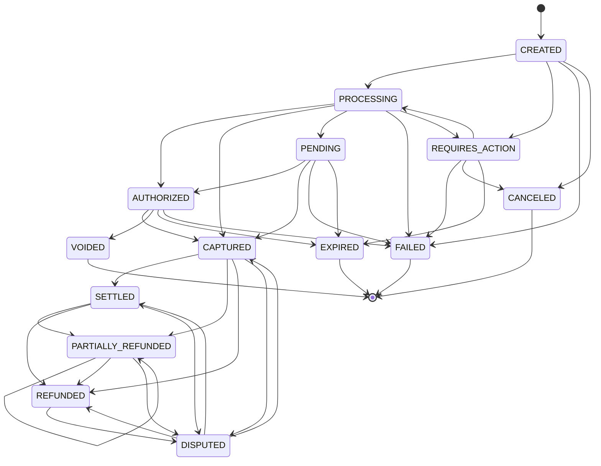

### 3.1 Transition table

| # | From | To | Trigger | Guard | Side effects | Event |
|---|---|---|---|---|---|---|
| 1 | `CREATED` | `PROCESSING` | orchestrator dispatch | routing plan non-empty; risk `ALLOW`; merchant `ACTIVE`; L5 passed | write `PaymentAttempt` row **before** the gateway call; set `current_attempt_id` | `payment.attempted.v1` |
| 2 | `CREATED` | `REQUIRES_ACTION` | risk forces 3DS, or gateway returns a challenge on the first call | `risk_decision = REQUIRE_3DS` or gateway challenge | store redirect/challenge reference | `payment.attempted.v1` |
| 3 | `CREATED` | `FAILED` | pre-flight rejection | L5 or risk `DECLINE`, or `NO_ELIGIBLE_GATEWAY` | no attempt row is created — nothing was dispatched | `payment.failed.v1` |
| 4 | `CREATED` | `CANCELED` | `CancelPayment` | no attempt dispatched | | `payment.failed.v1` (`reason: CANCELED`) |
| 5 | `REQUIRES_ACTION` | `PROCESSING` | customer completed the challenge | 3DS result present and verified | dispatch the authorization | `payment.attempted.v1` |
| 6 | `REQUIRES_ACTION` | `FAILED` | challenge failed | gateway reports authentication failure | | `payment.failed.v1` |
| 7 | `REQUIRES_ACTION` | `CANCELED` | customer abandoned / merchant cancelled | no authorization exists | | `payment.failed.v1` |
| 8 | `REQUIRES_ACTION` | `EXPIRED` | challenge window elapsed | `now() > expires_at` | | `payment.failed.v1` (`reason: EXPIRED`) |
| 9 | `PROCESSING` | `AUTHORIZED` | gateway authorization success | L6 response validation passed (signature, schema, **amount/currency echo**); attempt `outcome = SUCCESS` | set `authorized_amount`, `expires_at` | `payment.authorized.v1` |
| 10 | `PROCESSING` | `CAPTURED` | gateway sale / auto-capture success | `capture_mode = AUTOMATIC`; L6 passed | set `authorized_amount` and `captured_amount` | `payment.captured.v1` |
| 11 | `PROCESSING` | `PENDING` | asynchronous method, or attempt `TIMEOUT_UNKNOWN` | — | **A7:** on timeout the payment stays in flight; set `reconciliation_required = true` | `payment.reconciliation_required.v1` when the cause is `TIMEOUT_UNKNOWN` |
| 12 | `PROCESSING` | `FAILED` | definitive decline with no eligible failover | attempt `outcome = DECLINED` and (hard decline **or** failover budget exhausted **or** no remaining candidates) | | `payment.failed.v1` |
| 13 | `PROCESSING` | `REQUIRES_ACTION` | gateway returns a step-up challenge | — | | `payment.attempted.v1` |
| 14 | `PENDING` | `AUTHORIZED` | async confirmation or reconciliation resolves the unknown | source ∈ {webhook, gateway lookup, settlement report}; **never a timer** | clear `reconciliation_required` | `payment.authorized.v1` |
| 15 | `PENDING` | `CAPTURED` | as #14 for a sale-type method | as #14 | | `payment.captured.v1` |
| 16 | `PENDING` | `FAILED` | async rejection observed | as #14 | | `payment.failed.v1` |
| 17 | `PENDING` | `EXPIRED` | async method window elapsed (voucher, bank debit) | `now() > expires_at` **and** the gateway confirms non-payment | | `payment.failed.v1` (`reason: EXPIRED`) |
| 18 | `AUTHORIZED` | `CAPTURED` | `Capture(amount)` | **I2** `captured_amount + amount ≤ authorized_amount`; capture count ≤ `limits.maxPartialCaptures`; within the gateway's capture window | | `payment.captured.v1` |
| 19 | `AUTHORIZED` | `VOIDED` | `Void` | `captured_amount = 0` | release the hold at the gateway | `payment.voided.v1` |
| 20 | `AUTHORIZED` | `EXPIRED` | authorization hold lapsed | `now() > expires_at`; gateway confirms | | `payment.failed.v1` (`reason: AUTH_EXPIRED`) |
| 21 | `AUTHORIZED` | `FAILED` | capture definitively rejected and the auth is unusable | | | `payment.failed.v1` |
| 22 | `CAPTURED` | `SETTLED` | settlement report ingested | report matches amount and currency | ledger posting `MERCHANT_RECEIVABLE` | `payment.settled.v1` (BC-8) |
| 23 | `CAPTURED` | `PARTIALLY_REFUNDED` | refund succeeded, partial | **I1** `refunded_amount + amount < captured_amount`; within `maxRefundWindowDays` | | `payment.refunded.v1` |
| 24 | `CAPTURED` | `REFUNDED` | refund succeeded, full | **I1** `refunded_amount + amount = captured_amount` | | `payment.refunded.v1` |
| 25 | `CAPTURED` | `DISPUTED` | chargeback notified | signature-verified dispute webhook | ledger moves funds to `DISPUTES_HELD` | `payment.disputed.v1` (BC-8) |
| 26 | `SETTLED` | `PARTIALLY_REFUNDED` | refund after settlement — the **normal** case | as #23 | | `payment.refunded.v1` |
| 27 | `SETTLED` | `REFUNDED` | full refund after settlement | as #24 | | `payment.refunded.v1` |
| 28 | `SETTLED` | `DISPUTED` | chargeback after settlement | as #25 | | `payment.disputed.v1` |
| 29 | `PARTIALLY_REFUNDED` | `PARTIALLY_REFUNDED` | further partial refund (**self-loop**) | as #23; still strictly less than captured | version still increments (I5) | `payment.refunded.v1` |
| 30 | `PARTIALLY_REFUNDED` | `REFUNDED` | final refund reaches the captured total | as #24 | | `payment.refunded.v1` |
| 31 | `PARTIALLY_REFUNDED` | `DISPUTED` | chargeback | as #25 | | `payment.disputed.v1` |
| 32 | `REFUNDED` | `DISPUTED` | chargeback on a refunded payment | as #25 | | `payment.disputed.v1` |
| 33 | `DISPUTED` | `REFUNDED` | dispute lost — funds reversed | dispute outcome from the gateway | ledger reverses from `DISPUTES_HELD` | `payment.refunded.v1` |
| 34 | `DISPUTED` | `CAPTURED` | dispute won, pre-settlement | dispute outcome from the gateway | ledger returns funds | `payment.captured.v1` |
| 35 | `DISPUTED` | `SETTLED` | dispute won, post-settlement | dispute outcome from the gateway | | `payment.settled.v1` |

**Terminal states:** `FAILED`, `CANCELED`, `VOIDED`, `EXPIRED`.
`REFUNDED` is terminal for money-out but not for disputes (#32) — the baseline is explicit.

### 3.2 Forbidden transitions

| Forbidden | Why it is dangerous |
|---|---|
| `SETTLED → PROCESSING` | Would re-dispatch a payment whose funds have already moved to the merchant. A second authorization on settled money is a double charge with a settled counterpart — the hardest kind to unwind. |
| `REFUNDED → CAPTURED` | Would recreate captured funds that have already been returned to the cardholder, producing a ledger that says money exists where it does not. Restoring funds after a dispute win goes `DISPUTED → CAPTURED` (#34), which is a *different* fact with a gateway-issued outcome behind it. |
| `CAPTURED → AUTHORIZED` | Un-capturing is not an operation any gateway offers. A system that models it will eventually try to perform it. |
| `FAILED → *` | `FAILED` means "we told the merchant no." Any exit re-opens a payment the merchant has already reported to their customer as declined, and typically after they have already retried it — producing two payments for one order. |
| `CREATED → CAPTURED` | Must pass through `PROCESSING`, because `PROCESSING` is where the attempt row is written **before** the gateway call. Skipping it means a capture with no attempt record, no `gateway_idempotency_key`, and no way for the reconciler to find the transaction after a crash. |
| Any transition making `refunded_total > captured_total` | Refunding more than was captured is theft from the merchant. Enforced by I1 in three places: the aggregate, the `CHECK` constraint, and the `FOR UPDATE` serialization. |
| `PROCESSING → FAILED` **on timeout** | The single most common cause of double charges in real platforms (A7). A timeout means *we do not know*. The payment stays `PROCESSING`/`PENDING` and only a webhook, a gateway lookup or a settlement report may resolve it. **No timer may fail a payment.** |
| `PENDING → PROCESSING` | Would allow re-dispatch of a payment whose outcome is unknown, creating a second authorization for the same intent. Resolution is inbound-only. |
| `VOIDED → CAPTURED` | The hold is gone. Capturing a released authorization either fails at the gateway or, worse, succeeds against a re-used reference. |

### 3.3 Enforcement

| Layer | Mechanism |
|---|---|
| Domain | `payment.State.CanTransitionTo(to)` + per-transition guard functions. `Payment` exposes no `SetState`. |
| Application | Stage 16 of the pipeline (baseline §12) performs the transition and the outbox write in one transaction. |
| Database | `CHECK (state IN (…14 values…))`; trigger `payments_state_transition()` against `fsm_transitions WHERE machine = 'payment'`; `CHECK (refunded_amount <= captured_amount)` (I1); `CHECK (authorized_amount IS NULL OR captured_amount <= authorized_amount)` (I2); trigger `payments_immutable_fields()` (I4); `payment_event_log` UNIQUE `(payment_id, aggregate_version)` (I5). |
| Test | `TestPaymentTransitionTableExhaustive` — all 196 pairs; 35 accepted, 161 rejected. Plus `TestNoTimerCanFailAPayment`, which advances a fake clock arbitrarily against a `PROCESSING` payment with a `TIMEOUT_UNKNOWN` attempt and asserts the state never leaves `PROCESSING`/`PENDING`. |

---

## 4. Payment attempt

**Owner:** BC-6 (inside the `Payment` aggregate) · **Columns:** `payment_attempts.state` + `.outcome`

The schema separates *state* (`PENDING`, `DISPATCHED`, `COMPLETED`) from *outcome*
(`SUCCESS`, `DECLINED`, `ERROR`, `TIMEOUT_UNKNOWN`, baseline §9.1). The machine below is over the
composite, which is how the domain reasons about it.

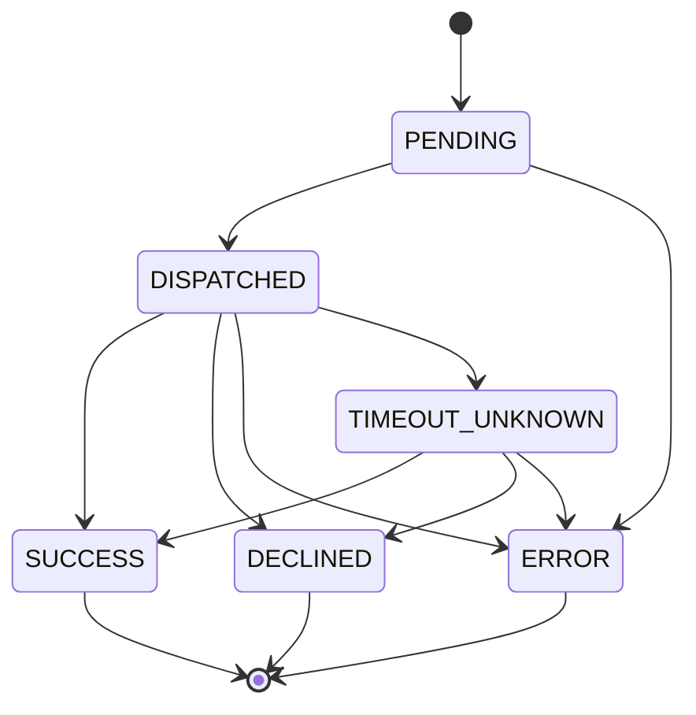

### 4.1 Transition table

| # | From | To | Trigger | Guard | Side effects | Event |
|---|---|---|---|---|---|---|
| 1 | — | `PENDING` | `BeginAttempt` | payment in `CREATED`/`PROCESSING`/`REQUIRES_ACTION`/`PENDING`; `attempt_number ≤ max_failover_attempts`; a routing candidate remains | derive and persist `gateway_idempotency_key` **before** dispatch | — |
| 2 | `PENDING` | `DISPATCHED` | request sent to the gateway | connection `CERTIFIED`; circuit not `OPEN`; bulkhead slot acquired | `request_sent_at` set | `payment.attempted.v1` |
| 3 | `PENDING` | `ERROR` | dispatch failed locally (circuit open, no slot, adapter error) | the request provably never left | safe to retry — nothing reached the gateway | — |
| 4 | `DISPATCHED` | `SUCCESS` | gateway approved | L6 response validation passed: signature valid, schema valid, **amount and currency echo match what we sent** | **I3** claims the payment's single success slot | `payment.attempted.v1` |
| 5 | `DISPATCHED` | `DECLINED` | gateway definitively said no | mapped to a normalized reason; `decline_is_retryable` set from the retryable-decline set | failover permitted **only if** `decline_is_retryable` | `payment.attempted.v1` |
| 6 | `DISPATCHED` | `ERROR` | our side or transport failed **before** the gateway could have acted | provable from the transport (connection refused, DNS, TLS, 4xx from our own proxy) | safe to retry | `payment.attempted.v1` |
| 7 | `DISPATCHED` | `TIMEOUT_UNKNOWN` | 8 s hard timeout, or an ambiguous transport error | — | payment → `PROCESSING`/`PENDING` with `reconciliation_required = true`; enqueue for reconciliation. **Never retried automatically.** | `payment.reconciliation_required.v1` |
| 8 | `TIMEOUT_UNKNOWN` | `SUCCESS` | reconciliation resolved it as authorized/captured | resolution source ∈ {webhook, gateway lookup by `gateway_idempotency_key`, settlement report} | claims the I3 success slot; payment advances | `payment.authorized.v1` / `payment.captured.v1` |
| 9 | `TIMEOUT_UNKNOWN` | `DECLINED` | reconciliation found a decline | as #8 | | `payment.failed.v1` |
| 10 | `TIMEOUT_UNKNOWN` | `ERROR` | reconciliation proved the request never reached the gateway | gateway lookup returns "no such transaction" **and** the gateway's lookup API is authoritative for that key | now safe to retry | — |

**Terminal states:** `SUCCESS`, `DECLINED`, `ERROR`. `TIMEOUT_UNKNOWN` is **not terminal** — it is a
parked state with an SLO (resolved within 24 h or it becomes a `CRITICAL` reconciliation exception).

### 4.2 Forbidden transitions

| Forbidden | Why it is dangerous |
|---|---|
| `TIMEOUT_UNKNOWN → SUCCESS` by inference (elapsed time, optimism, a second attempt succeeding) | The whole point of A7. Only an authoritative external observation may resolve it. Guard #8 names the three acceptable sources and the code takes the source as a required parameter with no default. |
| `DECLINED → *` when the decline is hard | Retrying a hard decline (stolen card, invalid account, `do_not_honor` with a hard code) on another gateway is card-testing behaviour and gets the platform de-registered from the schemes (baseline §9.1). |
| `SUCCESS → anything` | The attempt succeeded; money moved. A correction is a *void* or a *refund* on the payment, not an edit of the attempt. |
| Two attempts reaching `SUCCESS` for one payment | **I3.** Structurally impossible: per-partition partial unique index on `(payment_id) WHERE outcome = 'SUCCESS'`, with all attempts of a payment guaranteed to be in one partition (`04-domain-model.md` §8.3). |
| `ERROR → DISPATCHED` (reusing the attempt row) | A retry that reaches the gateway is a new dispatch; reusing the row destroys the timing record and the 1:1 relationship between an attempt and a `gateway_idempotency_key`. Transport retries *within* one dispatch (≤ 2, jittered) reuse the key and do not change state. |

### 4.3 Enforcement

| Layer | Mechanism |
|---|---|
| Domain | `Payment.RecordAttemptOutcome()` — the attempt has no independent repository. `FailoverPolicy` is a separate pure function so the hard-decline rule has its own test file. |
| Database | `CHECK ((state = 'COMPLETED') = (outcome IS NOT NULL))`; `CHECK (outcome <> 'DECLINED' OR decline_is_retryable IS NOT NULL)`; per-partition partial unique index for I3; `UNIQUE (payment_id, attempt_number)`; `UNIQUE (gateway_id, gateway_idempotency_key)`. |
| Test | `TestI3RejectsSecondSuccessfulAttempt` (raw SQL, domain bypassed); `TestHardDeclineNeverFailsOver` over the full decline-code catalog. |

---

## 5. Refund

**Owner:** BC-6 (inside the `Payment` aggregate) · **Table:** `refunds.state`

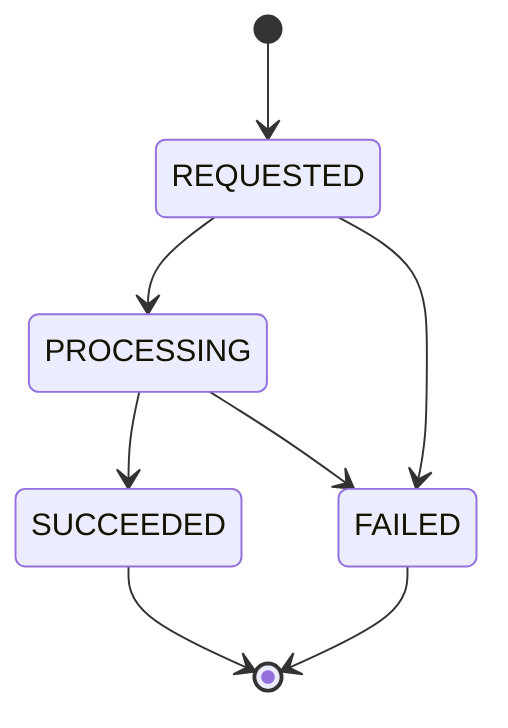

| # | From | To | Trigger | Guard | Side effects | Event |
|---|---|---|---|---|---|---|
| 1 | — | `REQUESTED` | `RequestRefund` | payment in `CAPTURED`/`SETTLED`/`PARTIALLY_REFUNDED`; **I1** `refunded_amount + amount ≤ captured_amount`; currency matches; within `maxRefundWindowDays`; idempotency key unused | **reserve** the amount by incrementing `payments.refunded_amount` under `FOR UPDATE` | — |
| 2 | `REQUESTED` | `PROCESSING` | dispatched to the gateway | connection usable; `gateway_idempotency_key` derived | | — |
| 3 | `REQUESTED` | `FAILED` | pre-dispatch rejection | | **release** the reservation (decrement `refunded_amount`) | — |
| 4 | `PROCESSING` | `SUCCEEDED` | gateway confirmed | L6 passed; amount echo matches | payment → `PARTIALLY_REFUNDED` or `REFUNDED`; ledger posts to `REFUNDS_PAYABLE` | `payment.refunded.v1` |
| 5 | `PROCESSING` | `FAILED` | gateway rejected | definitive rejection only — an ambiguous refund follows the same A7 rule as a payment and stays `PROCESSING` with a reconciliation flag | release the reservation | — |

**Terminal states:** `SUCCEEDED`, `FAILED`.

| Forbidden | Why |
|---|---|
| `FAILED → PROCESSING` | A retry is a **new** refund with a new idempotency key. Re-dispatching the same refund row with the same gateway key after a definitive failure risks a double refund if the first attempt's failure classification was wrong. |
| `SUCCEEDED → FAILED` | Money has left. A reversal of a refund is a new capture, which no gateway supports; the correct response is a reconciliation exception. |
| Refund while the payment is `AUTHORIZED` | There is nothing to refund; the operation is `Void` (#19 in §3.1). Offering "refund" on an uncaptured payment leads merchants to void and refund the same funds. |
| Reservation released on `SUCCEEDED` | Deliberately impossible: reservations are released only on `FAILED`. The nightly reconciliation asserts `payments.refunded_amount = SUM(amount) FILTER (WHERE state IN ('REQUESTED','PROCESSING','SUCCEEDED'))` and opens a `MAJOR` exception on drift. |

**Enforcement:** domain guard + `CHECK (amount > 0)` + `CHECK (refunded_amount <= captured_amount)` on the parent + `UNIQUE (tenant_id, idempotency_key)` + trigger against `fsm_transitions WHERE machine = 'refund'`.

---

## 6. Gateway health

**Owner:** BC-4 · **Table:** `gateway_health.state`, keyed `(gateway_id, operation)` · Baseline §10 verbatim.

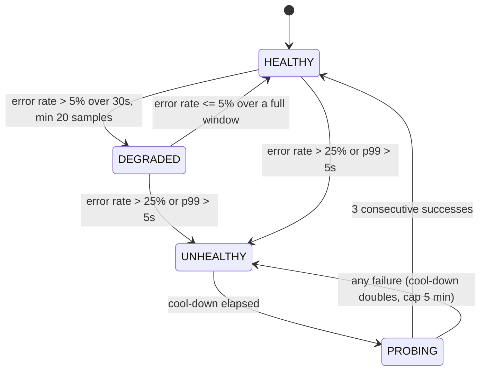

| # | From | To | Trigger | Guard | Side effects | Event |
|---|---|---|---|---|---|---|
| 1 | `HEALTHY` | `DEGRADED` | window evaluation | error rate > 5 % over 30 s **and** `sample_count ≥ 20` | routing de-prioritizes this gateway; circuit stays `CLOSED` | `gateway.health_changed.v1` |
| 2 | `DEGRADED` | `HEALTHY` | window evaluation | error rate ≤ 5 % over a full 30 s window with ≥ 20 samples | routing priority restored | `gateway.health_changed.v1` |
| 3 | `DEGRADED` | `UNHEALTHY` | window evaluation | error rate > 25 % **or** p99 > 5 s | **circuit `OPEN`**; routing excludes; `cooldown_seconds` starts at 30 | `gateway.health_changed.v1` |
| 4 | `HEALTHY` | `UNHEALTHY` | window evaluation | as #3 (a hard cliff skips `DEGRADED` — a gateway that goes from fine to 40 % errors must not spend a window in `DEGRADED` still taking traffic) | as #3 | `gateway.health_changed.v1` |
| 5 | `UNHEALTHY` | `PROBING` | cool-down timer | `now() ≥ state_changed_at + cooldown_seconds` | **circuit `HALF_OPEN`**; a single probe request is admitted | `gateway.health_changed.v1` |
| 6 | `PROBING` | `HEALTHY` | probe result | 3 consecutive successes | circuit `CLOSED`; `cooldown_seconds` reset to 30; `consecutive_probe_successes` reset | `gateway.health_changed.v1` |
| 7 | `PROBING` | `UNHEALTHY` | probe result | any failure | circuit back to `OPEN`; `cooldown_seconds = min(cooldown × 2, 300)` | `gateway.health_changed.v1` |

**Terminal states:** none. Health is a perpetual machine; an operator `ForceOpen`/`ForceClose`
break-glass is audited and expires automatically after 30 minutes so a forgotten override cannot
become permanent.

| Forbidden | Why |
|---|---|
| `DEGRADED → PROBING` | `PROBING` exists only to test a gateway we have stopped sending traffic to. A `DEGRADED` gateway is still receiving traffic, so a "probe" is indistinguishable from ordinary requests and its result means nothing. |
| `UNHEALTHY → HEALTHY` directly | Would slam full production traffic into a gateway that has not answered a single successful request. The three-probe ramp is the difference between recovery and a thundering-herd re-outage. |
| `PROBING → DEGRADED` | Only two outcomes exist for a probe: recovered (`HEALTHY` after 3) or not (`UNHEALTHY`). A third outcome invites "mostly working", which routing cannot act on. |
| Per-merchant health states | Baseline §10 is explicit: per-merchant samples are too sparse to be statistically meaningful. Per-merchant *pinning* is a routing policy, not a health state. |

**Enforcement:** the hot path is an in-process sliding window per orchestrator pod; the DB row is
the cross-pod gossip point and is written **only on state change**, not per sample. `CHECK` on both
`state` and `circuit_state`; `CHECK (cooldown_seconds BETWEEN 30 AND 300)`. Property test
`TestHealthWindowMonotonicity`: for any sample sequence, the state never oscillates more than once
per window.

---

## 7. Gateway connection

**Owner:** BC-4 · **Table:** `gateway_connections.state`

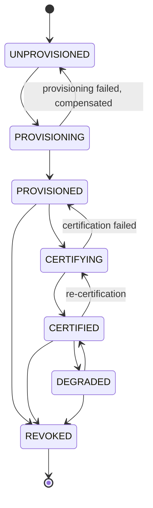

| # | From | To | Trigger | Guard | Side effects | Event |
|---|---|---|---|---|---|---|
| 1 | — | `UNPROVISIONED` | `CreateConnection` | merchant exists; gateway `ACTIVE`; unique on `(tenant, merchant, gateway, environment)` | | — |
| 2 | `UNPROVISIONED` | `PROVISIONING` | workflow step 5 `provision-gateways` | merchant in `GATEWAY_PROVISIONING`; capability descriptor covers the declared corridors | call adapter `Provision`, idempotent on external ref | — |
| 3 | `PROVISIONING` | `PROVISIONED` | adapter returned an account ref | `external_account_ref` non-null; credentials stored (step 6); webhook registered (step 7) | store `credential_ref`, `webhook_registration_ref` — **references only, never material** | `merchant.gateway_provisioned.v1` |
| 4 | `PROVISIONING` | `UNPROVISIONED` | provisioning exhausted retries | compensations completed (sub-account de-provisioned, secret version deleted, webhook registration deleted) | clears all refs so a retry is genuinely fresh | — |
| 5 | `PROVISIONED` | `CERTIFYING` | workflow steps 9–10 | credential and webhook refs present; suite version pinned | start a `CertificationReport` | — |
| 6 | `CERTIFYING` | `CERTIFIED` | report sealed `PASSED` | **every** matrix cell passed **all seven** baseline §11.4 assertions; report is for **this** environment; digest verified | `certified_at` set; connection becomes routable | `merchant.certified.v1` |
| 7 | `CERTIFYING` | `PROVISIONED` | report sealed `FAILED` | | connection remains non-routable; report immutable | — |
| 8 | `CERTIFIED` | `DEGRADED` | operational failure attributable to this connection | credential expiry imminent, webhook registration lost, or the gateway reports the sub-account restricted | routing de-prioritizes, does **not** exclude; alert raised | — |
| 9 | `DEGRADED` | `CERTIFIED` | the underlying condition cleared | credential rotated / webhook re-registered, verified by an L3 probe | | — |
| 10 | `CERTIFIED` | `CERTIFYING` | scheduled or triggered re-certification (adapter upgrade, gateway API version bump) | merchant may remain `ACTIVE`; other certified connections cover the corridors | the connection stays routable during re-certification | — |
| 11 | `CERTIFIED` \| `DEGRADED` \| `PROVISIONED` | `REVOKED` | `Revoke(reason)` | zero payments in a non-terminal state on this connection | delete webhook registration; destroy the secret version; retain the metadata row for audit | — |

**Terminal states:** `REVOKED`.

| Forbidden | Why |
|---|---|
| `UNPROVISIONED → CERTIFIED` | Certification asserts things about a *provisioned* account with *working credentials*. Certifying a connection that does not exist would produce a report about nothing, and `PRODUCTION_READY` depends on that report. |
| `PROVISIONED → CERTIFIED` (skipping `CERTIFYING`) | The only way to become `CERTIFIED` is to pass through a certification run that produces an artifact. Removing the intermediate state is how "certified" degrades into a boolean an operator can set (A11). |
| `REVOKED → *` | Revocation destroys the secret version and deletes the gateway-side webhook registration. Un-revoking would leave a connection pointing at credentials that no longer exist. A returning merchant/gateway pair gets a **new** `connection_id`. |
| `DEGRADED → CERTIFYING` | Certify a connection that is currently misbehaving and the report is meaningless. Fix it (`→ CERTIFIED`), then re-certify. |
| `CERTIFIED` with a sandbox report | `CHECK` + guard #6: environment must match. A sandbox pass certifying production is the exact shape of the failure the certification suite exists to prevent. |

**Enforcement:** `CHECK (state IN (…7 values…))`; `CHECK (state <> 'CERTIFIED' OR (certification_report_id IS NOT NULL AND credential_ref IS NOT NULL AND webhook_registration_ref IS NOT NULL))`; trigger against `fsm_transitions WHERE machine = 'gateway_connection'`; `TestGatewayConnectionTransitionTableExhaustive` (49 pairs, 14 accepted, 35 rejected).

---

## 8. Workflow instance

**Owner:** BC-3 · **Table:** `workflow_instances.state`

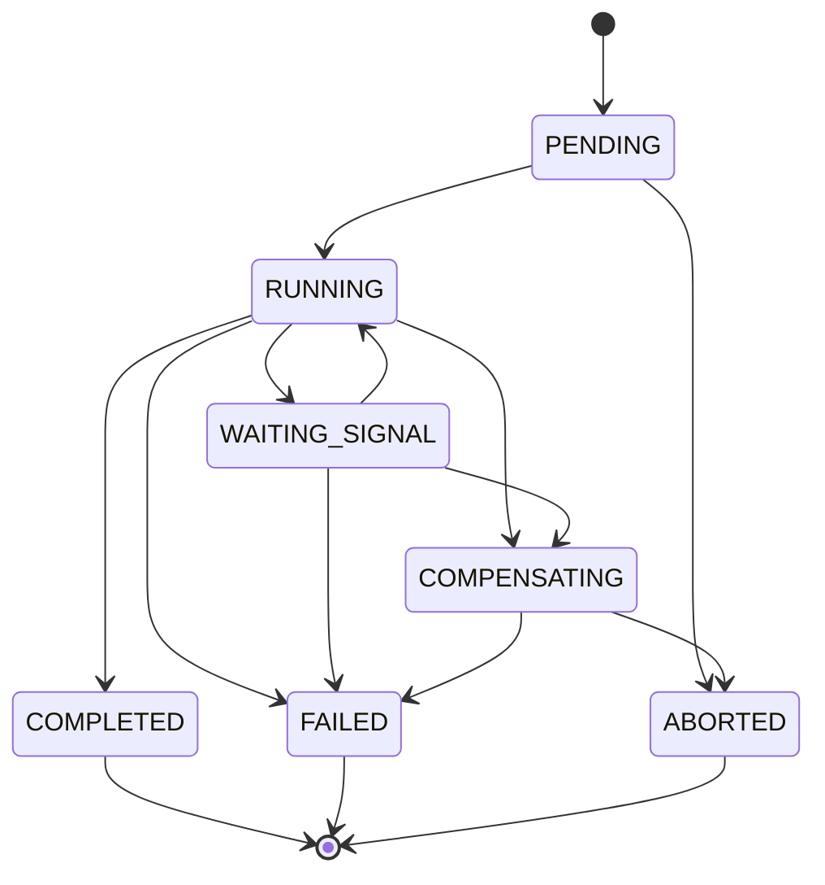

| # | From | To | Trigger | Guard | Side effects | Event |
|---|---|---|---|---|---|---|
| 1 | — | `PENDING` | `StartWorkflow` | **no live instance for `(workflow_name, business_key)`** — starting twice is a no-op returning the existing instance (baseline §11) | partial unique index makes the duplicate physically impossible | — |
| 2 | `PENDING` | `RUNNING` | a worker acquires the lease | `lease_expires_at IS NULL OR < now()`; lease claimed with `FOR UPDATE SKIP LOCKED` | `lease_owner`, `lease_expires_at = now() + 60s` | — |
| 3 | `RUNNING` | `WAITING_SIGNAL` | the current step is a signal wait (`await-kyc-decision`, `compliance-review`) | step's result checkpointed first | lease released; a signal-wait does not hold a worker | — |
| 4 | `WAITING_SIGNAL` | `RUNNING` | signal received | signal name matches; **the signalling principal is authorized and the signal is audited** (baseline §11) | checkpoint the signal payload | — |
| 5 | `RUNNING` | `COMPLETED` | last step succeeded | every step `SUCCEEDED` or `SKIPPED` | close the `OnboardingCase`; merchant → `ACTIVE` requested | `merchant.activated.v1` (via BC-2) |
| 6 | `RUNNING` | `COMPENSATING` | abort requested, or a step exhausted retries with compensation defined | ≥ 1 completed step has a compensation | run compensations in **strict reverse order** of completion | — |
| 7 | `RUNNING` | `FAILED` | a step exhausted retries with no compensation path | | step payload → `workflow_dlq` with the full error chain | — |
| 8 | `WAITING_SIGNAL` | `FAILED` | signal timeout (7 d for KYC, 5 d for compliance review) | `now() > step.deadline` | DLQ + alert | — |
| 9 | `WAITING_SIGNAL` | `COMPENSATING` | abort while waiting | | cancel the vendor case (step 3's compensation) | — |
| 10 | `COMPENSATING` | `ABORTED` | all compensations succeeded | every compensable completed step is `COMPENSATED` | case → `ABANDONED` | — |
| 11 | `COMPENSATING` | `FAILED` | a compensation itself failed | | **page** — a failed compensation means external state is now inconsistent with ours and needs a human | — |
| 12 | `PENDING` | `ABORTED` | abort before any step ran | no completed steps | | — |

**Terminal states:** `COMPLETED`, `FAILED`, `ABORTED`. All three release the business-key uniqueness
slot, so a new instance may then be started.

| Forbidden | Why |
|---|---|
| `COMPLETED → RUNNING` | Would re-run steps whose effects already happened — provisioning a second gateway sub-account, submitting a second KYC case. A re-run is a new instance with a new `attempt_epoch`. |
| `FAILED → RUNNING` | Same, plus it would silently drain the DLQ without a human deciding the failure was safe to replay. Replay is an explicit `ResumeWorkflow` that creates a new epoch. |
| Any transition without a valid lease | Two workers advancing one instance concurrently would double-execute activities. The lease guard is checked in the same `UPDATE` as the state change, so a stale lease loses. |
| `COMPENSATING → RUNNING` | Compensation is one-way. Resuming forward progress mid-rollback leaves half the steps compensated and half live, which is the worst state the engine can be in. |
| Compensations out of order | Reverse order is the only order in which each compensation's preconditions still hold (you cannot delete a webhook registration after de-provisioning the account that owns it). |

**Enforcement:** partial unique index on the business key; `CHECK (lease_owner IS NULL) = (lease_expires_at IS NULL)`; the lease predicate is part of every state-changing `UPDATE`'s `WHERE`; `fsm_transitions` trigger; `TestWorkflowResumeReplaysNoCompletedStep` (kill a worker mid-instance, assert each activity's side effect happened exactly once).

---

## 9. Workflow step

**Owner:** BC-3 · **Table:** `workflow_steps.state` (+ `compensation_state`)

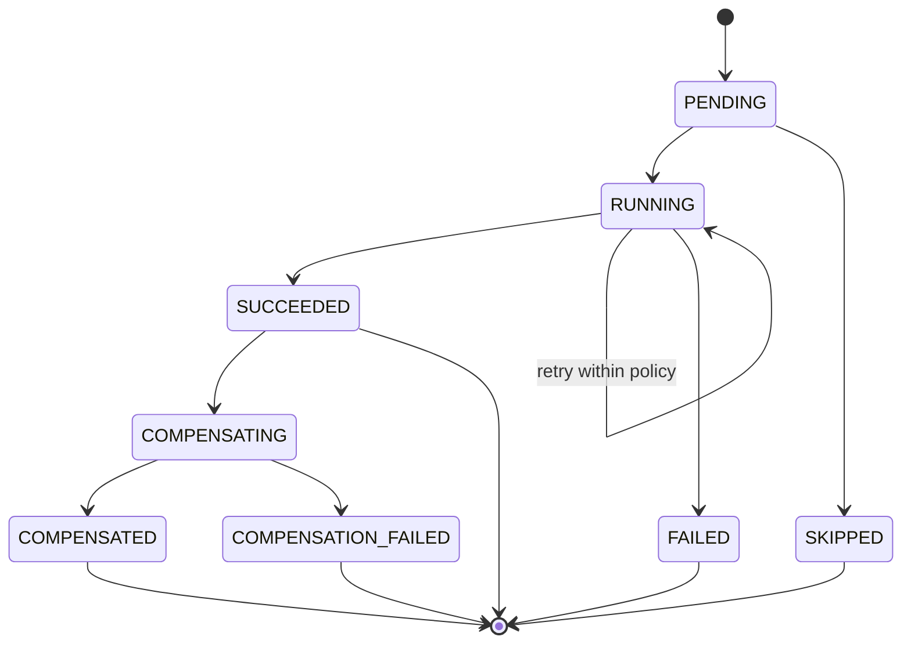

| # | From | To | Trigger | Guard | Side effects | Event |
|---|---|---|---|---|---|---|
| 1 | `PENDING` | `RUNNING` | scheduler picks the step | instance `RUNNING` with a valid lease; `sequence = current_step_index` | `started_at`, `attempt_count++` | — |
| 2 | `PENDING` | `SKIPPED` | step not applicable | e.g. `provision-gateways` for a gateway the merchant did not select | recorded, not silently omitted — a skipped step is auditable | — |
| 3 | `RUNNING` | `SUCCEEDED` | activity returned | output schema valid | **checkpoint the result before the next step begins** | — |
| 4 | `RUNNING` | `RUNNING` | retryable error | `attempt_count < policy.maxAttempts`; the error is classified `retryable` (baseline §20.1) | backoff per the step's policy (baseline §11) | — |
| 5 | `RUNNING` | `FAILED` | retries exhausted, or a non-retryable error | | full error chain to `workflow_dlq`; instance → `COMPENSATING` or `FAILED` | — |
| 6 | `SUCCEEDED` | `COMPENSATING` | instance is compensating and this step has a compensation | reverse-order position reached | run the compensation activity | — |
| 7 | `COMPENSATING` | `COMPENSATED` | compensation returned | | | — |
| 8 | `COMPENSATING` | `COMPENSATION_FAILED` | compensation exhausted retries | | **page**; instance → `FAILED` | — |

**Terminal states:** `SUCCEEDED` (until compensation), `FAILED`, `SKIPPED`, `COMPENSATED`, `COMPENSATION_FAILED`.

| Forbidden | Why |
|---|---|
| `FAILED → RUNNING` | A retry inside the policy is the self-loop (#4). Once the policy is exhausted the step is done; retrying it requires a new instance epoch so the attempt counters and the DLQ record stay honest. |
| `SUCCEEDED → RUNNING` | Would re-execute an activity whose result is already checkpointed — the exact double-execution the checkpoint exists to prevent. |
| Compensating a step that never succeeded | Compensations assume their forward action happened. De-provisioning an account that was never provisioned either errors or, worse, de-provisions someone else's. |
| Running a step out of sequence | `CHECK` on `sequence = current_step_index` at transition time. Out-of-order execution breaks the reverse-order compensation guarantee. |

---

## 10. Onboarding case

**Owner:** BC-3 · **Table:** `onboarding_cases.status`

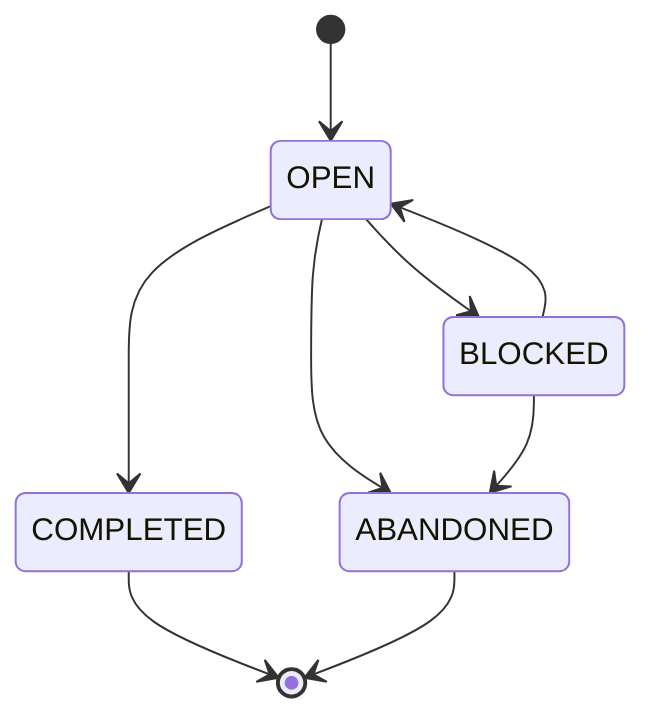

| # | From | To | Trigger | Guard | Side effects | Event |
|---|---|---|---|---|---|---|
| 1 | — | `OPEN` | `OpenCase` | no other case for this merchant in `OPEN`/`BLOCKED` | start the workflow instance | — |
| 2 | `OPEN` | `BLOCKED` | a step failed, or a manual gate was reached | reason recorded; annotations carry the failing `RuleID`s | SLA clock paused for vendor-wait; notification sent | — |
| 3 | `BLOCKED` | `OPEN` | the blocking condition cleared | the corresponding merchant transition succeeded, or the gate was signalled by an authorized principal | SLA clock resumed | — |
| 4 | `OPEN` | `COMPLETED` | workflow `COMPLETED` | **merchant is `ACTIVE`** | `closed_at` set | — |
| 5 | `OPEN` \| `BLOCKED` | `ABANDONED` | `AbandonCase` or workflow `ABORTED`/`FAILED` | compensations finished | `closed_at` set; releases the one-live-case slot | — |

**Terminal states:** `COMPLETED`, `ABANDONED`.

| Forbidden | Why |
|---|---|
| `COMPLETED → OPEN` | Re-opening a completed case would create a second live case for an already-active merchant and let onboarding-time transitions run against a live merchant. Changes to a live merchant go through the control plane, not through onboarding. |
| `→ COMPLETED` while the workflow is running | The case is the business view of the instance; a completed case with a running instance means compensations could still fire against a merchant we have told the customer is live. |
| Two live cases for one merchant | Partial unique index. Two cases means two workflow instances means duplicate KYC submissions and duplicate gateway sub-accounts. |

---

## 11. Idempotency record

**Owner:** BC-6 · **Table:** `idempotency_records.state` · Baseline §14.3.

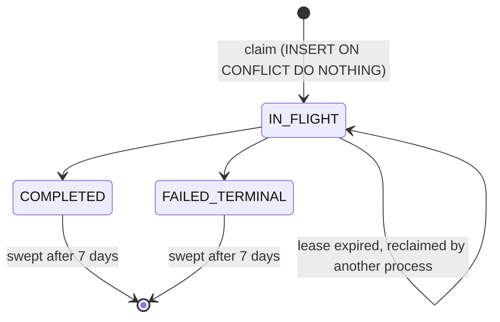

| # | From | To | Trigger | Guard | Side effects | Event |
|---|---|---|---|---|---|---|
| 1 | — | `IN_FLIGHT` | `Claim` | `INSERT … ON CONFLICT DO NOTHING` returned a row | `lease_owner`, `lease_expires_at = now() + 30s` | — |
| 2 | `IN_FLIGHT` | `IN_FLIGHT` | `Reclaim` | `lease_expires_at < now()` — the original process died | `UPDATE … WHERE lease_expires_at < now()`; new owner re-executes | — |
| 3 | `IN_FLIGHT` | `COMPLETED` | the operation succeeded | executed in the **same transaction** as the business effect | store the response snapshot (status, headers, body) and `resource_id` | — |
| 4 | `IN_FLIGHT` | `FAILED_TERMINAL` | non-retryable failure | error category ∈ {`VALIDATION`, `BUSINESS_RULE`, `AUTHORIZATION`, `NOT_FOUND`} (baseline §20.1) | store the error snapshot | — |

**Behaviour on a duplicate request**, which is what the machine is actually for:

| Observed state | Response |
|---|---|
| `IN_FLIGHT`, lease valid | `409 IDEMPOTENT_REQUEST_IN_PROGRESS` + `Retry-After: 1`. **We do not block and we do not process twice** (A6) — blocking a request thread on another process's lease is how thread pools die under retry storms. |
| `IN_FLIGHT`, lease expired | Reclaim atomically and re-execute. |
| `COMPLETED` | Replay the stored status + body + `Idempotent-Replay: true`. |
| `FAILED_TERMINAL` | Replay the stored error. |
| Any state, **different fingerprint** | `422 IDEMPOTENCY_KEY_REUSED` — the client reused one key for two different requests (baseline §14.2). |

**Terminal states:** `COMPLETED`, `FAILED_TERMINAL` — immutable, then swept at 7 days.

| Forbidden | Why |
|---|---|
| `COMPLETED → IN_FLIGHT` | Would allow a completed operation to be re-executed, defeating the entire mechanism. |
| `FAILED_TERMINAL → IN_FLIGHT` | The failure is terminal *for this key*. A retry needs a new key, which is the client's signal that it is a new logical operation. |
| Storing a *retryable* failure as `FAILED_TERMINAL` | A `503` or a gateway timeout must **not** be snapshotted as a terminal error, or the client's legitimate retry would replay the failure forever. Retryable failures release the lease and leave the record `IN_FLIGHT`. Guard #4 enumerates the terminal categories exhaustively; the default is "not terminal". |
| Trusting Redis | Redis mirrors `COMPLETED` records for latency only. A Redis miss or a total outage degrades latency, never correctness — Postgres is authoritative (baseline §14.3). |

**Enforcement:** `UNIQUE (tenant_id, merchant_id, method, path_template, idempotency_key)` — this index *is* the state machine's concurrency control; `CHECK (state = 'IN_FLIGHT' OR response_status IS NOT NULL)`; every transition is a conditional `UPDATE` whose `WHERE` includes the expected prior state, so a lost update is impossible without a version column.

---

## 12. Inbound webhook

**Owner:** BC-7 · **Table:** `inbound_webhooks.state`

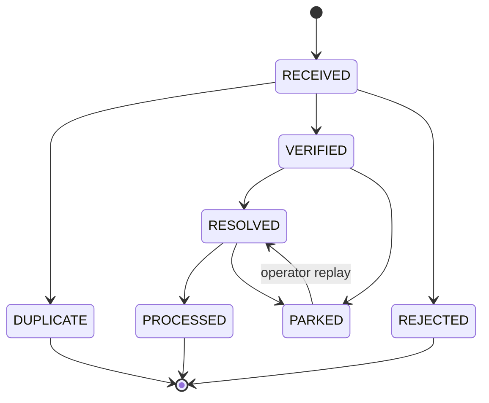

| # | From | To | Trigger | Guard | Side effects | Event |
|---|---|---|---|---|---|---|
| 1 | — | `RECEIVED` | HTTP POST to `/v1/webhooks/{gateway}` | body ≤ 1 MiB | persist raw body + allowlisted headers; **≤ 50 ms budget, no processing inline**; respond `200` | `webhook.received.v1` |
| 2 | `RECEIVED` | `DUPLICATE` | dedup claim returned 0 rows | `(gateway_code, gateway_ref)` already present | drop silently, increment a counter — a gateway retrying is normal, not an error | — |
| 3 | `RECEIVED` | `VERIFIED` | signature check | scheme-appropriate signature valid **and** timestamp within ±5 min **and** nonce unused | | — |
| 4 | `RECEIVED` | `REJECTED` | signature invalid, or replay detected | | `401 WEBHOOK_SIGNATURE_INVALID` / `WEBHOOK_REPLAY_DETECTED`; **security event raised**; body retained for forensics but never interpreted | — |
| 5 | `VERIFIED` | `RESOLVED` | payload mapped to a domain subject | `gateway_reference` matches a known payment/refund; tenant resolved | set `tenant_id`, `resolved_payment_id`, `resolved_event_type` | — |
| 6 | `VERIFIED` | `PARKED` | cannot resolve | unknown reference after the grace window (the webhook may legitimately arrive before our commit) | retried with backoff up to 8 attempts, then parked and alerted | — |
| 7 | `RESOLVED` | `PROCESSED` | domain command accepted | the `Payment` aggregate accepted the transition | | (the payment's own event) |
| 8 | `RESOLVED` | `PARKED` | domain command rejected | e.g. `INVALID_STATE_TRANSITION` — the gateway told us something inconsistent with our state | `MAJOR` reconciliation exception opened | — |
| 9 | `PARKED` | `RESOLVED` | operator replay after investigation | replay is authorized and audited | | — |

**Terminal states:** `PROCESSED`, `REJECTED`, `DUPLICATE`.

| Forbidden | Why |
|---|---|
| `RECEIVED → RESOLVED` (skipping verification) | An unverified webhook is attacker-controlled input. `CHECK (state NOT IN ('RESOLVED','PROCESSED') OR signature_valid)` makes the skip unwritable. |
| `REJECTED → *` | A rejected webhook failed authentication. Reprocessing it later would honour a forged message. If the rejection was our bug (wrong key version), the gateway is asked to resend — we do not resurrect. |
| `DUPLICATE → *` | The original is authoritative. Processing the duplicate is the double-processing the dedup table exists to prevent. |
| A webhook writing `payments.state` directly | B7 in `05-bounded-contexts.md`. BC-7 issues a command; BC-6's aggregate validates it against the payment FSM. A gateway that sends us `captured` for a payment we believe is `FAILED` must produce a reconciliation exception, not a state overwrite. |
| Processing inline in the ingress | Blows the 50 ms budget, which makes the gateway retry, which multiplies load exactly when we are already slow. |

---

## 13. Reconciliation exception

**Owner:** BC-8 · **Table:** `reconciliation_exceptions.state`

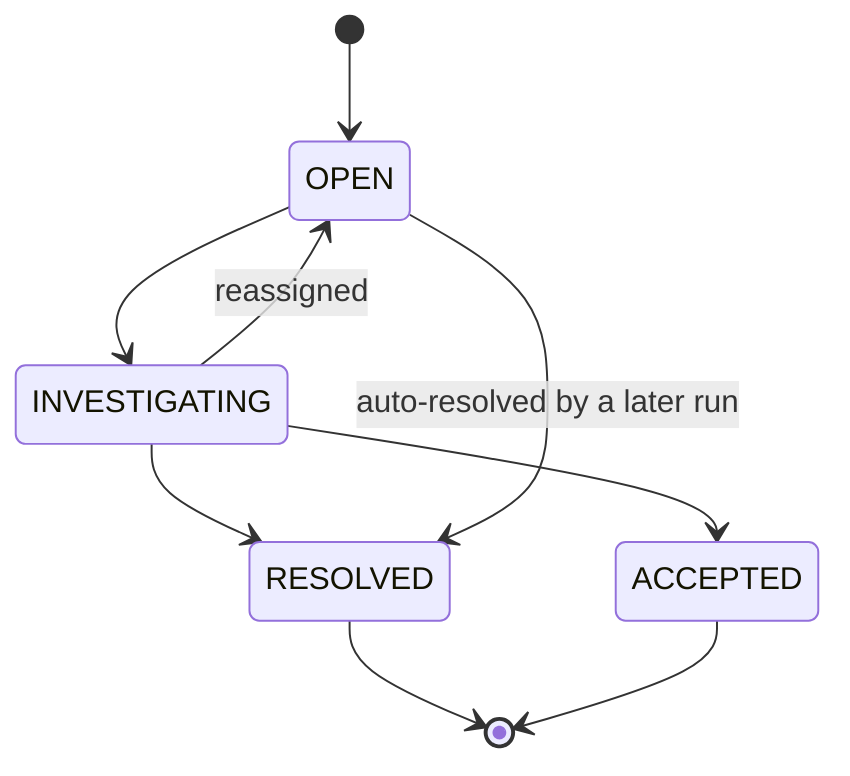

| # | From | To | Trigger | Guard | Side effects | Event |
|---|---|---|---|---|---|---|
| 1 | — | `OPEN` | a run detects a discrepancy | not already open on the same identity tuple (`run_type`, `kind`, subject) — re-detection **updates**, never duplicates | `CRITICAL` blocks the merchant's `→ ACTIVE` and pages; `MAJOR` tickets; `MINOR` dashboards | — |
| 2 | `OPEN` | `INVESTIGATING` | assigned to a human | assignee set | SLA clock starts (`CRITICAL` 4 h, `MAJOR` 2 d) | — |
| 3 | `INVESTIGATING` | `OPEN` | unassigned / reassigned | | | — |
| 4 | `INVESTIGATING` | `RESOLVED` | the discrepancy was corrected | resolution note required; for a payment-state discrepancy, the correcting **command** must have been accepted by BC-6 | | possibly `payment.settled.v1` / `payment.disputed.v1` |
| 5 | `OPEN` | `RESOLVED` | a later run no longer sees the discrepancy | the same run type over an overlapping window found agreement | auto-resolution is recorded with the resolving `run_id` | — |
| 6 | `INVESTIGATING` | `ACCEPTED` | a known, tolerated variance | requires an **explicit authorized actor**, a written justification and an expiry date | re-opens automatically at expiry if still present | — |

**Terminal states:** `RESOLVED`, `ACCEPTED`.

| Forbidden | Why |
|---|---|
| `OPEN → ACCEPTED` | Acceptance must be a deliberate human act after investigation. A path that lets an exception be accepted without being investigated is how a systematic reconciliation failure gets silently normalized. |
| `RESOLVED → *` | If the discrepancy recurs it is a **new** exception with a new `run_id`, so the recurrence is visible. Re-opening the old one hides the frequency, which is the most diagnostic signal there is. |
| Auto-resolving a `CRITICAL` without a correcting command | Guard #4: a `CRITICAL` payment-state discrepancy is only resolvable by a command BC-6 accepted. Otherwise "resolution" would mean "the reconciler stopped noticing". |
| Deleting an exception | No `DELETE` grant. An exception that was wrong is `RESOLVED` with a note saying so. |

---

## 14. Why transition tables, not `if` statements

### 14.1 The argument

Scattered conditionals fail in four specific, recurring ways. Every one of them is a real incident
class in payment systems:

| Failure mode | With scattered `if`s | With an explicit table |
|---|---|---|
| **The forgotten branch** | A new state is added and three of the eleven `if` chains that switch on state are updated. The other eight silently fall through to a default. | Adding a state to the YAML adds a row to `fsm_transitions` and breaks the exhaustive test until every pair is classified. Falling through is not expressible. |
| **The invisible machine** | The set of legal transitions exists only as the union of conditions spread across a service, a handler, a repository and a webhook processor. Nobody can enumerate it, so nobody can review it. | The machine is one file, diffable in a pull request. A reviewer can see that `SETTLED → PROCESSING` was added. |
| **Drift between layers** | The domain allows a transition the database's trigger rejects, or vice versa, and the disagreement is found in production. | Both are generated from the same source (§14.3). Disagreement is a build failure. |
| **Untestable negatives** | Tests cover the transitions someone thought of. The dangerous ones are the ones nobody thought of. | The negative space is enumerable: `|S|² − |T|` pairs, all asserted rejected (§14.2). |

Two further properties matter operationally. The table is **data**, so it can be rendered (the
mermaid diagrams in this document are generated from it) and queried (`SELECT` against
`fsm_transitions` answers "what can happen to a payment in `AUTHORIZED`?" during an incident, at
3 a.m., without reading Go). And it is **total** — `CanTransitionTo` is a pure lookup with no
default branch, so there is no path where an unclassified pair is accidentally permitted.

The cost is one indirection: reading the code no longer tells you what is legal. That is why the
table lives next to the aggregate, is generated into the same package, and is reproduced in full
in this document.

### 14.2 The exhaustive property test

Every machine gets the same test, generated from the same source:

```go
func TestTransitionTableExhaustive(t *testing.T) {
    for _, m := range fsm.AllMachines() {          // 12 machines
        for _, from := range m.States() {
            for _, to := range m.States() {         // |S|² pairs, including self-loops
                allowed := m.Table().Contains(from, to)
                err := m.Validate(from, to)
                if allowed {
                    require.NoError(t, err, "%s: %s→%s must be allowed", m.Name(), from, to)
                } else {
                    require.ErrorIs(t, err, domain.ErrInvalidStateTransition,
                        "%s: %s→%s must be rejected", m.Name(), from, to)
                }
            }
        }
    }
}
```

The same pairs are then asserted **at the database**, with the domain layer bypassed entirely,
because a domain-only test proves nothing about the last line of defence:

```go
func TestTransitionTableEnforcedByDatabase(t *testing.T) {
    for _, m := range fsm.AllMachines() {
        for _, from := range m.States() {
            for _, to := range m.States() {
                seedRowInState(t, db, m, from)
                _, err := db.Exec(rawUpdateStateSQL(m), to)  // no domain code involved
                if m.Table().Contains(from, to) {
                    require.NoError(t, err)
                } else {
                    requireSQLState(t, err, "23514")          // check_violation from the trigger
                }
            }
        }
    }
}
```

Coverage this produces:

| Machine | States | Legal transitions | Pairs asserted | Rejections asserted |
|---|---:|---:|---:|---:|
| Merchant | 20 | 37 | 400 | 363 |
| Payment | 14 | 35 | 196 | 161 |
| Payment attempt | 6 | 10 | 36 | 26 |
| Refund | 4 | 5 | 16 | 11 |
| Gateway health | 4 | 7 | 16 | 9 |
| Gateway connection | 7 | 14 | 49 | 35 |
| Workflow instance | 7 | 12 | 49 | 37 |
| Workflow step | 8 | 8 | 64 | 56 |
| Onboarding case | 4 | 5 | 16 | 11 |
| Idempotency record | 3 | 4 | 9 | 5 |
| Inbound webhook | 7 | 9 | 49 | 40 |
| Reconciliation exception | 4 | 6 | 16 | 10 |
| **Total** | **88** | **152** | **916** | **764** |

Three further properties are tested per machine:

| Property | Assertion |
|---|---|
| **Reachability** | Every non-initial state is reachable from the initial state. An unreachable state is dead code pretending to be a requirement. |
| **Termination** | Every state can reach a terminal state (for machines that have one). A state with no path to termination is a stuck-record generator. |
| **Terminality** | Every declared terminal state has zero outgoing rows, and the code path that would mutate it does not exist. |

Additionally, a fuzz test drives each machine with random trigger sequences for 10⁵ steps and
asserts that the invariants of the owning aggregate (I1–I5 for `Payment`) hold after every step.

### 14.3 Single source, three artifacts

```
api/fsm/payment.yaml   ──┬──► internal/domain/payment/transitions_gen.go   (Go table + CanTransitionTo)
                         ├──► migrations/0NNN_fsm_transitions.sql          (INSERT INTO fsm_transitions)
                         └──► docs/state-machines.md                        (mermaid + table)
```

| Artifact | Generated by | CI check |
|---|---|---|
| Go table | `go generate ./...` | `git diff --exit-code` after regeneration |
| SQL seed | same generator | migration checksum + a runtime assertion at service start that the DB's `fsm_transitions` rows for each machine equal the compiled table |
| This document | same generator | `git diff --exit-code`; a hand-edited table is a build failure |

The runtime assertion is the important one: on startup each service compares its compiled
transition table against `fsm_transitions` in the database and **refuses to start** on a mismatch.
A deploy that ships a new state without its migration therefore fails at boot in staging rather
than at the first payment in production.

### 14.4 The database trigger

One trigger function serves all twelve machines:

```sql
CREATE TABLE fsm_transitions (
    machine     TEXT NOT NULL,
    from_state  TEXT NOT NULL,
    to_state    TEXT NOT NULL,
    PRIMARY KEY (machine, from_state, to_state)
);

CREATE FUNCTION assert_fsm_transition() RETURNS trigger AS $$
DECLARE
    col     TEXT := TG_ARGV[1];
    machine TEXT := TG_ARGV[0];
    old_s   TEXT;
    new_s   TEXT;
BEGIN
    EXECUTE format('SELECT ($1).%I, ($2).%I', col, col) INTO old_s, new_s USING OLD, NEW;
    IF old_s IS NOT DISTINCT FROM new_s THEN
        RETURN NEW;                       -- not a state change
    END IF;
    IF NOT EXISTS (SELECT 1 FROM fsm_transitions f
                   WHERE f.machine = machine AND f.from_state = old_s AND f.to_state = new_s) THEN
        RAISE EXCEPTION 'INVALID_STATE_TRANSITION: % % -> %', machine, old_s, new_s
            USING ERRCODE = '23514';
    END IF;
    RETURN NEW;
END;
$$ LANGUAGE plpgsql;

CREATE TRIGGER payments_state_transition
    BEFORE UPDATE ON payments
    FOR EACH ROW EXECUTE FUNCTION assert_fsm_transition('payment', 'state');
```

Self-loops that *are* legal (`PARTIALLY_REFUNDED → PARTIALLY_REFUNDED`, `RUNNING → RUNNING`) are
handled by rows in `fsm_transitions`, with the early return above covering only the no-change case,
so a legal self-loop still increments the version and still writes its event-log row (I5).

`fsm_transitions` is read once per connection into a prepared statement; the lookup is a PK probe
on a table with 152 rows that lives permanently in shared buffers. The measured cost is under
20 µs per transition — roughly 0.008 % of the 250 ms p99 payment budget, for the guarantee that no
application bug can move money into an illegal state.
