# State Machines

> Purpose: every finite state machine in the platform, as an explicit transition table with
> guards, side effects, emitted events, terminal states, forbidden transitions and dual
> (code + database) enforcement. Derived from and subordinate to
> [`docs/spec/00-design-baseline.md`](./spec/00-design-baseline.md) §8 (merchant), §9 (payment),
> §9.1 (attempt) and §10 (gateway health); the remaining machines are specified here and are
> binding on the same terms. The merchant lifecycle in §2 is stated **post-amendment A-01**.
>
> Sections 2–11 document machines that exist in code as a `shared.StateMachine` table and are
> covered by an exhaustive property test. Sections 12–15 document machines that exist only as a
> column `CHECK` plus the SQL their commands issue; the note above §12 says what that costs.

---

## 1. Conventions

| Convention | Meaning |
|---|---|
| **Trigger** | The command or observed fact that requests the transition. Named as it appears in `internal/domain`. |
| **Guard** | A pure predicate that must hold. A false guard is a rejection, not a retry. |
| **Side effects** | What the transaction does besides changing the state column — always including the outbox row when an event is emitted (baseline §13.4). |
| **Event** | The baseline §13.2 event type published. `—` means no catalog event; the change is audited only. |
| **Terminal** | No outgoing transitions. Enforced by the table's absence of rows, not by an `if`. |
| **Rejection** | Every transition not in the table fails with `409 INVALID_STATE_TRANSITION` (baseline §20.2) in code. Two machines — payment and merchant — are additionally enforced at the database, where the rejection is SQLSTATE `23514` (`check_violation`); see §16.4 for exactly which. |
| **Construction** | A table row whose **From** is `—` is aggregate construction, not an edge. It is not counted in any transition total, because there is no prior state for the machine to reject. |

Each machine is declared **once**, as a `shared.NewStateMachine(...)` table in the package that
owns the aggregate (`internal/domain/shared/fsm.go` is the type). This document, the transition
tables in `migrations/0013_state_guards.up.sql` and those Go tables are three hand-maintained
statements of the same specification; §16.3 lists which mechanical check ties which pair
together, and which pair has no check.

---

## 2. Merchant lifecycle

**Owner:** BC-2 Merchant Registry · **Table:** `merchants.status` ·
**Source of truth:** `internal/domain/merchant/state.go` · **States:** 21 · **Transitions:** 42

Amendment **A-01** of [`docs/spec/00-design-baseline.md`](./spec/00-design-baseline.md) §8 added
the state `COMPLIANCE_REJECTED` and the edge `APPROVED → SUSPENDED`, and this section is stated
post-amendment. A-01 exists because the original lifecycle gave the manual compliance gate no
exit other than approval: a compliance officer's rejection could only be recorded by lying
(`CERTIFICATION_FAILED`, which blames the integration for a policy decision) or by leaving the
workflow hanging. `COMPLIANCE_REJECTED` is that exit — a rejection of the *business*, not of the
integration — and it routes back to `CONFIGURING` (fixable configuration), back to `KYC_PENDING`
(fixable evidence), or forward to `TERMINATED`, and nowhere else. In particular it does **not**
route back to `CERTIFICATION`, because nothing about the integration was the problem. The second
half of A-01 is `APPROVED → SUSPENDED`: an adverse finding between approval and activation has to
be expressible without terminating the merchant.

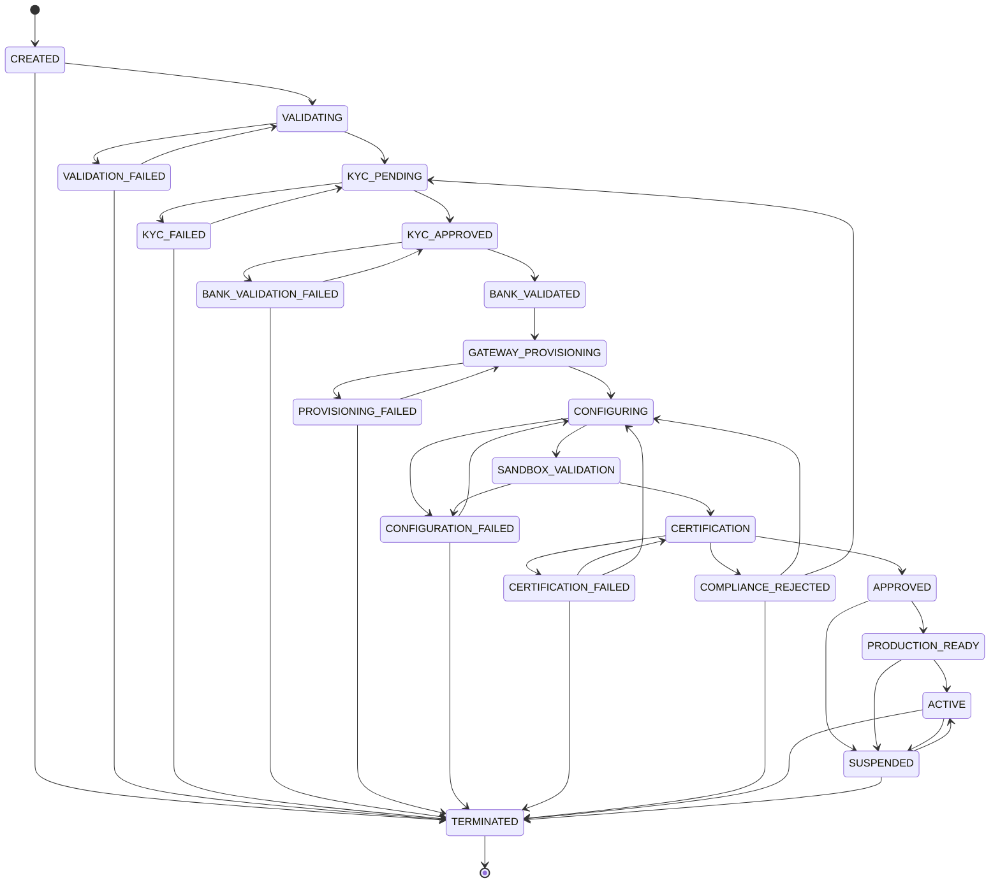

### 2.1 Transition table

| # | From | To | Trigger | Guard | Side effects | Event |
|---|---|---|---|---|---|---|
| 1 | `CREATED` | `VALIDATING` | `StartValidation` | business profile complete; ≥ 1 `MerchantPrincipal` with `is_ubo`; tenant `ACTIVE` and under `max_merchants` | open the onboarding case; start `merchant-onboarding@v1` with business key `merchant_id` | — (`merchant.created.v1` was raised at construction) |
| 2 | `CREATED` | `TERMINATED` | `Terminate` | zero payments in a non-terminal state | close case as `ABANDONED` | `merchant.terminated.v1` |
| 3 | `VALIDATING` | `KYC_PENDING` | `PassValidation` | all L2 rules `ERROR`-free | `kyc_status → IN_PROGRESS`; workflow step 2 `submit-kyc` dispatched | `merchant.validated.v1` |
| 4 | `VALIDATING` | `VALIDATION_FAILED` | `FailValidation(reason)` | ≥ 1 L2 `ERROR` outcome | annotate case with `RuleID`s; block case | `merchant.validation_failed.v1` |
| 5 | `VALIDATION_FAILED` | `VALIDATING` | `StartValidation` | profile changed since the failure (`version` advanced) | unblock case; re-run L2 | — |
| 6 | `VALIDATION_FAILED` | `TERMINATED` | `Terminate` | as #2 | | `merchant.terminated.v1` |
| 7 | `KYC_PENDING` | `KYC_APPROVED` | `ApproveKYC(providerRef, expiresAt, rating)` | vendor decision signed and matched to `kyc_reference`; evidence stored under Object Lock | `kyc_status → APPROVED`; risk rating stored; step 3 signal resolved; step 4 dispatched | `merchant.kyc_approved.v1` |
| 8 | `KYC_PENDING` | `KYC_FAILED` | `RejectKYC(providerRef, reason)` | as above | `kyc_status → REJECTED`; block case; notify | `merchant.kyc_failed.v1` |
| 9 | `KYC_FAILED` | `KYC_PENDING` | `ResubmitKYC` | at least one principal or document changed; resubmission count < 3 | new vendor case; new `kyc_reference`; `kyc_status → IN_PROGRESS` | — |
| 10 | `KYC_FAILED` | `TERMINATED` | `Terminate` | as #2 | | `merchant.terminated.v1` |
| 11 | `KYC_APPROVED` | `BANK_VALIDATED` | `ValidateBankAccount(accountID, ref)` | the named account exists on the aggregate; vendor says it is open and name-matched | mark the account `VERIFIED` with its validation reference | `merchant.bank_validated.v1` |
| 12 | `KYC_APPROVED` | `BANK_VALIDATION_FAILED` | `FailBankValidation(accountID, reason)` | — | mark the account `VERIFICATION_FAILED`; annotate; block case | `merchant.bank_validation_failed.v1` |
| 13 | `BANK_VALIDATION_FAILED` | `KYC_APPROVED` | `ApproveKYC` (see the note below) | a **new** bank account row exists (never a retry on the same failed account) | unblock; re-dispatch step 4 | `merchant.kyc_approved.v1` |
| 14 | `BANK_VALIDATION_FAILED` | `TERMINATED` | `Terminate` | as #2 | | `merchant.terminated.v1` |
| 15 | `BANK_VALIDATED` | `GATEWAY_PROVISIONING` | `StartProvisioning` | ≥ 1 gateway selected; each selected gateway `ACTIVE` and its capability descriptor covers the declared currencies/methods/countries | fan-out step 5 per gateway; create `GatewayConnection` rows in `UNPROVISIONED` | — |
| 16 | `GATEWAY_PROVISIONING` | `CONFIGURING` | `CompleteProvisioning(gatewayIDs)` | **every** selected connection in `PROVISIONED`; credentials stored; webhooks registered | dispatch step 8 | `merchant.gateway_provisioned.v1` |
| 17 | `GATEWAY_PROVISIONING` | `PROVISIONING_FAILED` | `FailProvisioning(reason)` | a step-5 activity exhausted its retries | run compensations in reverse (de-provision sub-accounts) | `merchant.provisioning_failed.v1` |
| 18 | `PROVISIONING_FAILED` | `GATEWAY_PROVISIONING` | `StartProvisioning` | operator or automation retry; `attempt_epoch` incremented | new workflow epoch; idempotent on external refs | — |
| 19 | `PROVISIONING_FAILED` | `TERMINATED` | `Terminate` | as #2 | compensations completed | `merchant.terminated.v1` |
| 20 | `CONFIGURING` | `SANDBOX_VALIDATION` | `ApplyConfiguration(version)` | `version > 0`; `configuration.published.v1` observed for this merchant at the expected version; L4 passed | record `active_config_version`; dispatch step 9 | — |
| 21 | `CONFIGURING` | `CONFIGURATION_FAILED` | `FailConfiguration(reason)` | L4 `ERROR` or apply timeout | roll back to the previous config version (append, not delete) | `merchant.configuration_failed.v1` |
| 22 | `CONFIGURATION_FAILED` | `CONFIGURING` | `CompleteProvisioning` (see the note below) | configuration document changed | | `merchant.gateway_provisioned.v1` |
| 23 | `CONFIGURATION_FAILED` | `TERMINATED` | `Terminate` | as #2 | | `merchant.terminated.v1` |
| 24 | `SANDBOX_VALIDATION` | `CERTIFICATION` | `StartCertification` | sandbox suite passed for every enabled `(gateway, method, currency)` | dispatch step 10 (full matrix) | — |
| 25 | `SANDBOX_VALIDATION` | `CONFIGURATION_FAILED` | `FailConfiguration(reason)` | any sandbox assertion failed | annotate with the failing assertion IDs | `merchant.configuration_failed.v1` |
| 26 | `CERTIFICATION` | `APPROVED` | `Approve(certificationReportID, approvedBy)` | a non-empty `CertificationReport` reference — the aggregate refuses an empty one, which is what makes "certified" an artifact rather than an opinion (A11) | attach `certification_report_id`; connections → `CERTIFIED` | `merchant.certified.v1` |
| 27 | `CERTIFICATION` | `CERTIFICATION_FAILED` | `FailCertification(reason)` | any of the seven baseline §11.4 assertions failed in any matrix cell | report sealed as `FAILED` (immutable) | `merchant.certification_failed.v1` |
| 28 | `CERTIFICATION` | `COMPLIANCE_REJECTED` | `RejectForCompliance(reasonCode, detail, rejectedBy)` | **A-01.** The manual compliance gate was signalled `reject` by a principal holding `onboarding:approve`; a reason code and a written justification are recorded. The integration itself is not implicated — that is what #27 is for | block the case; the signal and its actor are audited | `merchant.compliance_rejected.v1` |
| 29 | `CERTIFICATION_FAILED` | `CERTIFICATION` | `StartCertification` | a change was made (adapter version, config version or connection) since the failure | **new** report; the failed one is never amended | — |
| 30 | `CERTIFICATION_FAILED` | `CONFIGURING` | `CompleteProvisioning` (see the note below) | the failure class is configuration, not integration | | `merchant.gateway_provisioned.v1` |
| 31 | `CERTIFICATION_FAILED` | `TERMINATED` | `TerminateMerchant` | as #2 | | `merchant.terminated.v1` |
| 32 | `COMPLIANCE_REJECTED` | `CONFIGURING` | `CompleteProvisioning` (see the note below) | **A-01.** The rejection was about something configuration can fix — a prohibited MCC on a product that has been withdrawn, a corridor that has been removed | unblock the case; re-run L4 on the next publish | — |
| 33 | `COMPLIANCE_REJECTED` | `KYC_PENDING` | `ResubmitKYC` | **A-01.** The rejection was about the evidence — an unverifiable UBO, an expired incorporation document — so the merchant re-enters verification with a new `kyc_reference` | new vendor case; the previous decision is retained, never overwritten | — |
| 34 | `COMPLIANCE_REJECTED` | `TERMINATED` | `TerminateMerchant` | as #2 | | `merchant.terminated.v1` |
| 35 | `APPROVED` | `PRODUCTION_READY` | `MarkProductionReady` | passing production `CertificationReport` attached (A11 — unreachable without it) | | — |
| 36 | `APPROVED` | `SUSPENDED` | `Suspend(reason, detail)` | **A-01.** An adverse finding — sanctions hit, adverse media, a risk decision — landing between approval and activation. Expressible without terminating the merchant, which is the whole point: `APPROVED → TERMINATED` is **not** in the table | | `merchant.suspended.v1` |
| 37 | `PRODUCTION_READY` | `ACTIVE` | `Activate` | **the four-part guard**: ≥ 1 `GatewayConnection` in `CERTIFIED`; non-empty validated `MerchantConfiguration`; completed compliance attestation, unexpired; zero open `CRITICAL` reconciliation exceptions | set `activated_at`; publish for data-plane cache warm | `merchant.activated.v1` |
| 38 | `PRODUCTION_READY` | `SUSPENDED` | `Suspend(reason, detail)` | operator or automation | | `merchant.suspended.v1` |
| 39 | `ACTIVE` | `SUSPENDED` | `Suspend(reason, detail)` | operator **or** automation plane (risk breach, compliance expiry, gateway de-provisioning) | **priority cache invalidation** in the data plane; new payments rejected; refunds, voids and webhook processing continue | `merchant.suspended.v1` |
| 40 | `ACTIVE` | `TERMINATED` | `Terminate` | zero payments in a non-terminal state | revoke connections; retire configuration | `merchant.terminated.v1` |
| 41 | `SUSPENDED` | `ACTIVE` | `Reinstate(actorIsOperator)` | the suspension reason is cleared. A reason whose `RequiresOperatorReviewToLift()` is true (everything except risk-threshold, non-payment and merchant-request) is refused with `403` unless the caller declares operator authority | `suspension_reason` and `suspended_at` cleared | `merchant.reinstated.v1` |
| 42 | `SUSPENDED` | `TERMINATED` | `Terminate` | as #40 | | `merchant.terminated.v1` |

**Four edges have no purpose-built command on the aggregate**, and the Trigger column above says
so rather than naming a method that does not exist. `Merchant` exposes one command per *forward*
step, and the recovery edges reuse whichever command targets the same state:

| Edge | Reached by | Consequence |
|---|---|---|
| #13 `BANK_VALIDATION_FAILED → KYC_APPROVED` | `ApproveKYC`, which re-records the vendor decision | `ValidateBankAccount` — the method the documented bank-replacement recovery would use — special-cases `BANK_VALIDATION_FAILED` as a state to advance from, but then attempts `→ BANK_VALIDATED`, which the table does not permit from there. That call **always fails**, and it mutates the account record before the refused transition. See [`README.md`](../README.md#status-and-limitations). |
| #22 `CONFIGURATION_FAILED → CONFIGURING` | `CompleteProvisioning` | The transition is legal and the state lands correctly, but the event raised is `merchant.gateway_provisioned.v1`, which is not what happened. |
| #30 `CERTIFICATION_FAILED → CONFIGURING` | `CompleteProvisioning` | As #22. |
| #32 `COMPLIANCE_REJECTED → CONFIGURING` | `CompleteProvisioning` | As #22. |

**Terminal states:** `TERMINATED` only. Every `*_FAILED` state, and `COMPLIANCE_REJECTED`, is
*recoverable* by design — a failed KYC is a resubmission, not an ending, and a compliance
rejection is a decision the merchant may be able to answer. `Status.IsFailureState()` returns
true for exactly the seven parked-awaiting-correction states (`VALIDATION_FAILED`, `KYC_FAILED`,
`BANK_VALIDATION_FAILED`, `PROVISIONING_FAILED`, `CONFIGURATION_FAILED`,
`CERTIFICATION_FAILED`, `COMPLIANCE_REJECTED`), and `TestMerchantTerminalStates` asserts that no
state is both a failure state and terminal.

**Money in versus money out.** Exactly one state — `ACTIVE` — satisfies `CanAcceptPayments()`.
Four satisfy `CanIssueRefunds()`: `ACTIVE`, `SUSPENDED`, `PRODUCTION_READY` and `APPROVED`. The
asymmetry is deliberate and is the thing most likely to be "simplified" away: a merchant
suspended for a risk breach still has customers owed money, and blocking refunds during a
suspension converts a merchant problem into a consumer-harm problem and, in several
jurisdictions, a regulatory one. Only termination stops refunds, and termination requires zero
payments in a non-terminal state.

### 2.2 Forbidden transitions worth naming

| Forbidden | Why it is dangerous |
|---|---|
| `CREATED → ACTIVE` (or any skip) | Skips KYC, bank validation, provisioning and certification. A merchant processing live money with no KYB record is a regulatory incident, not a bug. |
| `PRODUCTION_READY → CERTIFICATION` | Would allow re-certification to silently invalidate an already-live merchant's readiness while payments are in flight. Re-certification of a live merchant happens on a `CERTIFIED → CERTIFYING` connection transition (§7), which is scoped to one gateway and cannot un-activate the merchant. |
| `TERMINATED → *` | Termination releases the merchant's credentials, revokes its connections and permits data erasure. Resurrecting the record would re-associate a live merchant with de-provisioned gateway accounts. A returning merchant is a **new** `merchant_id`. |
| `SUSPENDED → PRODUCTION_READY` | Would let a suspension be cleared without re-evaluating the #37 guard. `SUSPENDED → ACTIVE` is the only exit and it re-runs all four guard clauses. |
| `KYC_FAILED → KYC_APPROVED` | Would let an approval overwrite a rejection without a new vendor decision. Approval must come from a *new* `kyc_reference`, which requires passing through `KYC_PENDING`. |
| `ACTIVE → CONFIGURING` | Configuration changes for a live merchant go through BC-5's versioned publish path, which is non-disruptive. Dropping a live merchant back into an onboarding state would stop payments for a config edit. |
| `ACTIVE → APPROVED` | A live merchant does not walk backwards into the onboarding pipeline. Whatever the operator wanted, the expressible answer is `SUSPENDED`. |
| `BANK_VALIDATION_FAILED → BANK_VALIDATED` | The only exit is via `KYC_APPROVED` with a **new** account (#13). Retrying validation on an account that already failed is how a typo becomes a settlement to the wrong beneficiary. |
| `COMPLIANCE_REJECTED → CERTIFICATION` | **A-01.** A compliance rejection cannot be cleared by re-running certification, because nothing about the integration was the problem. The two recovery routes are the two things that can actually change the answer: the configuration (#32) or the evidence (#33). |
| `COMPLIANCE_REJECTED → APPROVED` \| `→ PRODUCTION_READY` \| `→ ACTIVE` | A rejected merchant reaching a live state without a *new* compliance decision is the failure the gate exists to prevent. `COMPLIANCE_REJECTED` has exactly three exits and none of them is forward. |
| `APPROVED → TERMINATED` | Suspension is the expressible answer to an adverse finding at this point (#36); termination here would destroy the certification evidence that `PRODUCTION_READY` depends on, for a merchant who has not been given a chance to answer. |

### 2.3 Enforcement

| Layer | Mechanism |
|---|---|
| Domain | `merchant.Machine().CanTransition(from, to)` is a pure lookup in the table in `internal/domain/merchant/state.go`. `Merchant.transition()` calls `Machine().Transition()` first, then mutates and raises the event. No other code path writes `status`. Self-transitions are never implicitly legal: `shared.StateMachine` requires an explicit `{From: X, To: X}` row, and the merchant table declares none. |
| Application | The activation guard's evidence (`CERTIFIED` connections, config, attestation, exception count) is gathered by the application layer and passed *in*; the aggregate never fetches. |
| Database | `CHECK (status IN (…21 values…))` on `pp.merchants.status` (`migrations/0003_merchant_registry.up.sql`), including `COMPLIANCE_REJECTED`; plus the `merchants_guard` `BEFORE UPDATE` trigger in `migrations/0013_state_guards.up.sql`, which looks `(from, to)` up in `pp.merchant_status_transitions` — a 42-row table seeded by that same migration — and raises `check_violation` (SQLSTATE `23514`) if absent. |
| Test | `TestMerchantMachineAcceptsExactlyTheDeclaredEdges` (`internal/domain/merchant/state_test.go`) walks all **441** `(from, to)` pairs over the 21 states and asserts **42** accepted, **399** rejected with `INVALID_STATE_TRANSITION`, against a hand-written expected table that is an independent transcription of this section rather than a derivation from the code under test. `TestAmendmentA01ComplianceRejection` pins A-01's five edges and its four forbidden ones specifically. `TestTransitionTablesMatchDomain` (`internal/infrastructure/postgres/migrations_test.go`) asserts the SQL seed and the Go table are identical, so a change to one that is not mirrored in the other fails CI. |

---

## 3. Payment

**Owner:** BC-6 · **Table:** `payments.state` ·
**Source of truth:** `internal/domain/payment/state.go` · **States:** 14 · **Transitions:** 35

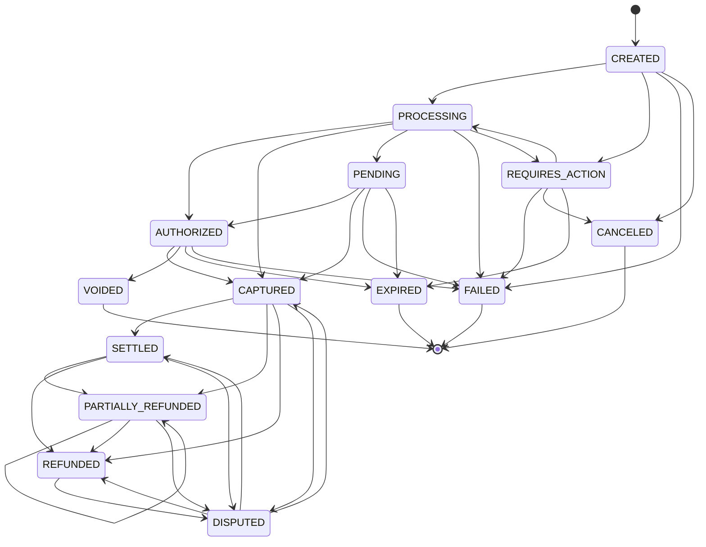

### 3.1 Transition table

| # | From | To | Trigger | Guard | Side effects | Event |
|---|---|---|---|---|---|---|
| 1 | `CREATED` | `PROCESSING` | orchestrator dispatch | routing plan non-empty; risk `ALLOW`; merchant `ACTIVE`; L5 passed | write `PaymentAttempt` row **before** the gateway call; set `current_attempt_id` | `payment.attempted.v1` |
| 2 | `CREATED` | `REQUIRES_ACTION` | risk forces 3DS, or gateway returns a challenge on the first call | `risk_decision = REQUIRE_3DS` or gateway challenge | store redirect/challenge reference | `payment.attempted.v1` |
| 3 | `CREATED` | `FAILED` | pre-flight rejection | L5 or risk `DECLINE`, or `NO_ELIGIBLE_GATEWAY` | no attempt row is created — nothing was dispatched | `payment.failed.v1` |
| 4 | `CREATED` | `CANCELED` | `CancelPayment` | no attempt dispatched | | `payment.failed.v1` (`reason: CANCELED`) |
| 5 | `REQUIRES_ACTION` | `PROCESSING` | customer completed the challenge | 3DS result present and verified | dispatch the authorization | `payment.attempted.v1` |
| 6 | `REQUIRES_ACTION` | `FAILED` | challenge failed | gateway reports authentication failure | | `payment.failed.v1` |
| 7 | `REQUIRES_ACTION` | `CANCELED` | customer abandoned / merchant cancelled | no authorization exists | | `payment.failed.v1` |
| 8 | `REQUIRES_ACTION` | `EXPIRED` | challenge window elapsed | `now() > expires_at` | | `payment.failed.v1` (`reason: EXPIRED`) |
| 9 | `PROCESSING` | `AUTHORIZED` | gateway authorization success | L6 response validation passed (signature, schema, **amount/currency echo**); attempt `outcome = SUCCESS` | set `authorized_amount`, `expires_at` | `payment.authorized.v1` |
| 10 | `PROCESSING` | `CAPTURED` | gateway sale / auto-capture success | `capture_mode = AUTOMATIC`; L6 passed | set `authorized_amount` and `captured_amount` | `payment.captured.v1` |
| 11 | `PROCESSING` | `PENDING` | asynchronous method, or attempt `TIMEOUT_UNKNOWN` | — | **A7:** on timeout the payment stays in flight; set `reconciliation_required = true` | `payment.reconciliation_required.v1` when the cause is `TIMEOUT_UNKNOWN` |
| 12 | `PROCESSING` | `FAILED` | definitive decline with no eligible failover | attempt `outcome = DECLINED` and (hard decline **or** failover budget exhausted **or** no remaining candidates) | | `payment.failed.v1` |
| 13 | `PROCESSING` | `REQUIRES_ACTION` | gateway returns a step-up challenge | — | | `payment.attempted.v1` |
| 14 | `PENDING` | `AUTHORIZED` | async confirmation or reconciliation resolves the unknown | source ∈ {webhook, gateway lookup, settlement report}; **never a timer** | clear `reconciliation_required` | `payment.authorized.v1` |
| 15 | `PENDING` | `CAPTURED` | as #14 for a sale-type method | as #14 | | `payment.captured.v1` |
| 16 | `PENDING` | `FAILED` | async rejection observed | as #14 | | `payment.failed.v1` |
| 17 | `PENDING` | `EXPIRED` | async method window elapsed (voucher, bank debit) | `now() > expires_at` **and** the gateway confirms non-payment | | `payment.failed.v1` (`reason: EXPIRED`) |
| 18 | `AUTHORIZED` | `CAPTURED` | `MarkCaptured(amount)` | **I2** `captured_amount + amount ≤ authorized_amount` (the ceiling is the payment amount when nothing was separately authorized); currency matches; amount positive | set `captured_amount` and `captured_at` | `payment.captured.v1` |
| 19 | `AUTHORIZED` | `VOIDED` | `Void` | `captured_amount = 0` | release the hold at the gateway | `payment.voided.v1` |
| 20 | `AUTHORIZED` | `EXPIRED` | authorization hold lapsed | `now() > expires_at`; gateway confirms | | `payment.failed.v1` (`reason: AUTH_EXPIRED`) |
| 21 | `AUTHORIZED` | `FAILED` | capture definitively rejected and the auth is unusable | | | `payment.failed.v1` |
| 22 | `CAPTURED` | `SETTLED` | settlement report ingested | report matches amount and currency | ledger posting `MERCHANT_RECEIVABLE` | `payment.settled.v1` (BC-8) |
| 23 | `CAPTURED` | `PARTIALLY_REFUNDED` | refund succeeded, partial | **I1** `refunded_amount + amount < captured_amount`; within `maxRefundWindowDays` | | `payment.refunded.v1` |
| 24 | `CAPTURED` | `REFUNDED` | refund succeeded, full | **I1** `refunded_amount + amount = captured_amount` | | `payment.refunded.v1` |
| 25 | `CAPTURED` | `DISPUTED` | chargeback notified | signature-verified dispute webhook | ledger moves funds to `DISPUTES_HELD` | `payment.disputed.v1` (BC-8) |
| 26 | `SETTLED` | `PARTIALLY_REFUNDED` | refund after settlement — the **normal** case | as #23 | | `payment.refunded.v1` |
| 27 | `SETTLED` | `REFUNDED` | full refund after settlement | as #24 | | `payment.refunded.v1` |
| 28 | `SETTLED` | `DISPUTED` | chargeback after settlement | as #25 | | `payment.disputed.v1` |
| 29 | `PARTIALLY_REFUNDED` | `PARTIALLY_REFUNDED` | further partial refund (**self-loop**) | as #23; still strictly less than captured | version still increments (I5) | `payment.refunded.v1` |
| 30 | `PARTIALLY_REFUNDED` | `REFUNDED` | final refund reaches the captured total | as #24 | | `payment.refunded.v1` |
| 31 | `PARTIALLY_REFUNDED` | `DISPUTED` | chargeback | as #25 | | `payment.disputed.v1` |
| 32 | `REFUNDED` | `DISPUTED` | chargeback on a refunded payment | as #25 | | `payment.disputed.v1` |
| 33 | `DISPUTED` | `REFUNDED` | dispute lost — funds reversed | dispute outcome from the gateway | ledger reverses from `DISPUTES_HELD` | `payment.refunded.v1` |
| 34 | `DISPUTED` | `CAPTURED` | dispute won, pre-settlement | dispute outcome from the gateway | ledger returns funds | `payment.captured.v1` |
| 35 | `DISPUTED` | `SETTLED` | dispute won, post-settlement | dispute outcome from the gateway | | `payment.settled.v1` |

**Terminal states:** `FAILED`, `CANCELED`, `VOIDED`, `EXPIRED`.
`REFUNDED` is terminal for money-out but not for disputes (#32) — the baseline is explicit.
`SETTLED` is deliberately **not** terminal: refund-after-settlement is the normal path (#26, #27).

**One declared self-transition.** `PARTIALLY_REFUNDED → PARTIALLY_REFUNDED` (#29) is the only
`X → X` edge in the table. `shared.StateMachine` never permits an implicit self-transition,
because one hides the duplicate-signal class of bug. Two consequences follow that a reader should
know about:

- **A second partial capture is not possible.** `CAPTURED → CAPTURED` is not declared, so a
  second `MarkCaptured` on an already-captured payment is refused with
  `INVALID_STATE_TRANSITION` — *after* invariant I2's cumulative check has already passed, so the
  error the caller sees is about the state machine, not about the amount. Any configured
  multiple-partial-capture limit above 1 is therefore unreachable.
- **A dispute won after settlement lands in `CAPTURED`, not `SETTLED`.** `ResolveDispute(won)`
  chooses between #34 and #35 by scanning the aggregate's *pending* event slice for
  `payment.settled.v1`, and the repository drains that slice on every write. Both are recorded in
  [`README.md`](../README.md#status-and-limitations) as open defects.

### 3.2 Forbidden transitions

| Forbidden | Why it is dangerous |
|---|---|
| `SETTLED → PROCESSING` | Would re-dispatch a payment whose funds have already moved to the merchant. A second authorization on settled money is a double charge with a settled counterpart — the hardest kind to unwind. |
| `REFUNDED → CAPTURED` | Would recreate captured funds that have already been returned to the cardholder, producing a ledger that says money exists where it does not. Restoring funds after a dispute win goes `DISPUTED → CAPTURED` (#34), which is a *different* fact with a gateway-issued outcome behind it. |
| `CAPTURED → AUTHORIZED` | Un-capturing is not an operation any gateway offers. A system that models it will eventually try to perform it. |
| `FAILED → *` | `FAILED` means "we told the merchant no." Any exit re-opens a payment the merchant has already reported to their customer as declined, and typically after they have already retried it — producing two payments for one order. |
| `CREATED → CAPTURED` | Must pass through `PROCESSING`, because `PROCESSING` is where the attempt row is written **before** the gateway call. Skipping it means a capture with no attempt record, no `gateway_idempotency_key`, and no way for the reconciler to find the transaction after a crash. |
| Any transition making `refunded_total > captured_total` | Refunding more than was captured is theft from the merchant. Enforced by I1 in three places: the aggregate, the `CHECK` constraint, and the `FOR UPDATE` serialization. |
| `PROCESSING → FAILED` **on timeout** | The single most common cause of double charges in real platforms (A7). A timeout means *we do not know*. The payment stays `PROCESSING`/`PENDING` and only a webhook, a gateway lookup or a settlement report may resolve it. **No timer may fail a payment.** |
| `PENDING → PROCESSING` | Would allow re-dispatch of a payment whose outcome is unknown, creating a second authorization for the same intent. Resolution is inbound-only. |
| `VOIDED → CAPTURED` | The hold is gone. Capturing a released authorization either fails at the gateway or, worse, succeeds against a re-used reference. |

### 3.3 Enforcement

| Layer | Mechanism |
|---|---|
| Domain | `payment.Machine().CanTransition(from, to)` + per-transition guard functions inside the aggregate's commands. `Payment` exposes no `SetState`. |
| Application | Stage 16 of the pipeline (baseline §12) performs the transition and the outbox write in one transaction. |
| Database | `CHECK (state IN (…14 values…))` on `pp.payments.state`; the `payments_guard` `BEFORE UPDATE` trigger in `migrations/0013_state_guards.up.sql`, which looks `(from, to)` up in the 35-row `pp.payment_state_transitions` table and raises `check_violation` (SQLSTATE `23514`) if absent, and which also enforces I4 (immutable identity/amount/currency) and the no-version-decrease rule. Plus `CHECK (refunded_amount <= captured_amount)` (I1) and the `payment_event_log` uniqueness that carries I5. |
| Test | `TestPaymentMachineAcceptsExactlyTheDeclaredEdges` (`internal/domain/payment/state_test.go`) — all **196** pairs; **35** accepted, **161** rejected, against an independently hand-written expected table. `TestPaymentMachineRefusesTheTransitionsTheBaselineNames` pins §3.2 specifically, and `TestMarkFailedRespectsTheTransitionTable` asserts that no elapsed time and no operator can fail a payment carrying an unresolved attempt. `TestTransitionTablesMatchDomain` asserts the SQL seed equals the Go table. |

---

## 4. Payment attempt

**Owner:** BC-6 (inside the `Payment` aggregate) · **Column:** `payment_attempts.outcome` ·
**Source of truth:** `internal/domain/payment/state.go` (`attemptMachine`) ·
**States:** 6 · **Transitions:** 9

The domain models the whole attempt lifecycle in **one** field, `AttemptOutcome`, using `PENDING`
and `DISPATCHED` as outcome values rather than as a separate phase with a NULL outcome. A nullable
outcome would make "not yet dispatched" and "dispatched, result lost" indistinguishable, and those
two need opposite handling. The coarse three-phase view the operator dashboards use
(`PENDING` / `DISPATCHED` / `COMPLETED`) is a **generated column** in the schema, derived from
`outcome`; it is not a second machine and nothing writes it.

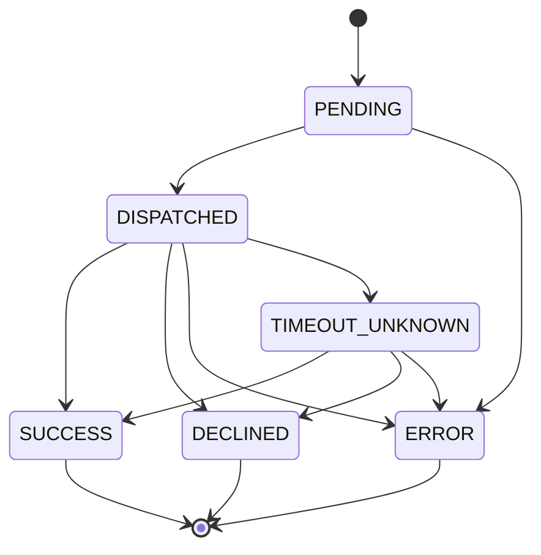

### 4.1 Transition table

| # | From | To | Trigger | Guard | Side effects | Event |
|---|---|---|---|---|---|---|
| — | — | `PENDING` | `Payment.StartAttempt(gatewayID, planID, op)` | payment in `CREATED`/`PROCESSING`/`REQUIRES_ACTION`/`PENDING`; `attempt_number` between 1 and 4; a routing candidate remains | derive and persist `gateway_idempotency_key` **before** dispatch. Construction, not an edge |  — |
| 1 | `PENDING` | `DISPATCHED` | request sent to the gateway | connection `CERTIFIED`; circuit not `OPEN`; bulkhead slot acquired | `request_sent_at` set | `payment.attempted.v1` |
| 2 | `PENDING` | `ERROR` | dispatch failed locally (circuit open, no slot, adapter error) | the request provably never left | safe to retry — nothing reached the gateway | — |
| 3 | `DISPATCHED` | `SUCCESS` | gateway approved | L6 response validation passed: signature valid, schema valid, **amount and currency echo match what we sent** | **I3** claims the payment's single success slot | `payment.attempted.v1` |
| 4 | `DISPATCHED` | `DECLINED` | gateway definitively said no | mapped to a normalized reason; `decline_is_retryable` set from the retryable-decline set | failover permitted **only if** `decline_is_retryable` | `payment.attempted.v1` |
| 5 | `DISPATCHED` | `ERROR` | our side or transport failed **before** the gateway could have acted | provable from the transport (connection refused, DNS, TLS, 4xx from our own proxy) | safe to retry | `payment.attempted.v1` |
| 6 | `DISPATCHED` | `TIMEOUT_UNKNOWN` | 8 s hard timeout, or an ambiguous transport error | — | payment → `PROCESSING`/`PENDING` with `reconciliation_required = true`; enqueue for reconciliation. **Never retried automatically.** | `payment.reconciliation_required.v1` |
| 7 | `TIMEOUT_UNKNOWN` | `SUCCESS` | reconciliation resolved it as authorized/captured | resolution source ∈ {webhook, gateway lookup by `gateway_idempotency_key`, settlement report} | claims the I3 success slot; payment advances | `payment.authorized.v1` / `payment.captured.v1` |
| 8 | `TIMEOUT_UNKNOWN` | `DECLINED` | reconciliation found a decline | as #7 | | `payment.failed.v1` |
| 9 | `TIMEOUT_UNKNOWN` | `ERROR` | reconciliation proved the request never reached the gateway | gateway lookup returns "no such transaction" **and** the gateway's lookup API is authoritative for that key | now safe to retry | — |

**Terminal states:** `SUCCESS`, `DECLINED`, `ERROR`. `TIMEOUT_UNKNOWN` is **not terminal** — it is a
parked state with an SLO (resolved within 24 h or it becomes a `CRITICAL` reconciliation exception).

### 4.2 Forbidden transitions

| Forbidden | Why it is dangerous |
|---|---|
| `TIMEOUT_UNKNOWN → SUCCESS` by inference (elapsed time, optimism, a second attempt succeeding) | The whole point of A7. Only an authoritative external observation may resolve it. Guard #7 names the three acceptable sources, and `AttemptOutcome.PermitsFailover()` returns true for `ERROR` alone — never for `TIMEOUT_UNKNOWN`. |
| `DECLINED → *` when the decline is hard | Retrying a hard decline (stolen card, invalid account, `do_not_honor` with a hard code) on another gateway is card-testing behaviour and gets the platform de-registered from the schemes (baseline §9.1). |
| `SUCCESS → anything` | The attempt succeeded; money moved. A correction is a *void* or a *refund* on the payment, not an edit of the attempt. |
| Two attempts reaching `SUCCESS` for one payment | **I3.** Structurally impossible: per-partition partial unique index on `(payment_id) WHERE outcome = 'SUCCESS'`, with all attempts of a payment guaranteed to be in one partition (`04-domain-model.md` §8.3). |
| `ERROR → DISPATCHED` (reusing the attempt row) | A retry that reaches the gateway is a new dispatch; reusing the row destroys the timing record and the 1:1 relationship between an attempt and a `gateway_idempotency_key`. Transport retries *within* one dispatch (≤ 2, jittered) reuse the key and do not change state. |

### 4.3 Enforcement

| Layer | Mechanism |
|---|---|
| Domain | The attempt has no independent repository; it is mutated only through the `Payment` aggregate. `AttemptOutcome.PermitsFailover()` and `DeclineReason.PermitsFailover()` are separate pure predicates so the hard-decline rule has its own tests. |
| Database | `CHECK (outcome IN (…6 values…))` with `state` a **generated** column derived from it; `CHECK (outcome <> 'DECLINED' OR decline_is_retryable IS NOT NULL)`; `CHECK (outcome IN ('PENDING','ERROR') OR request_sent_at IS NOT NULL)`; per-partition partial unique index for I3; `UNIQUE (payment_id, partition_month, attempt_number)`; and the composite FK to `pp.payments` that makes a wrong `partition_month` unwritable (A-02). There is **no** transition trigger for this machine — `migrations/0013_state_guards.up.sql` seeds transition tables for the payment and merchant machines only, so the attempt table's edges are enforced in the domain alone. |
| Test | `TestAttemptMachineAcceptsExactlyTheDeclaredEdges` (`internal/domain/payment/state_test.go`) — all **36** pairs; **9** accepted, **27** rejected. `TestAttemptOutcomeFailoverAndReconciliation` pins the failover rule per outcome. `TestI3HoldsWhenTwoAttemptsSucceedConcurrently` (`tests/integration/invariants_test.go`, tag `integration`) asserts I3 at the database with the domain bypassed. |

---

## 5. Refund

**Owner:** BC-6 (inside the `Payment` aggregate) · **Table:** `refunds.status` ·
**Source of truth:** `internal/domain/payment/refund.go` · **States:** 5 · **Transitions:** 5

The states are `PENDING`, `SUBMITTED`, `SUCCEEDED`, `FAILED`, `CANCELED`. A refund is
asynchronous at every gateway worth integrating — the gateway accepts the instruction and settles
it hours or days later — so modelling it as a boolean on the payment (`refunded: true`) would
lose exactly the window that support tickets are about: the merchant has promised the customer
their money back and the money has not moved.

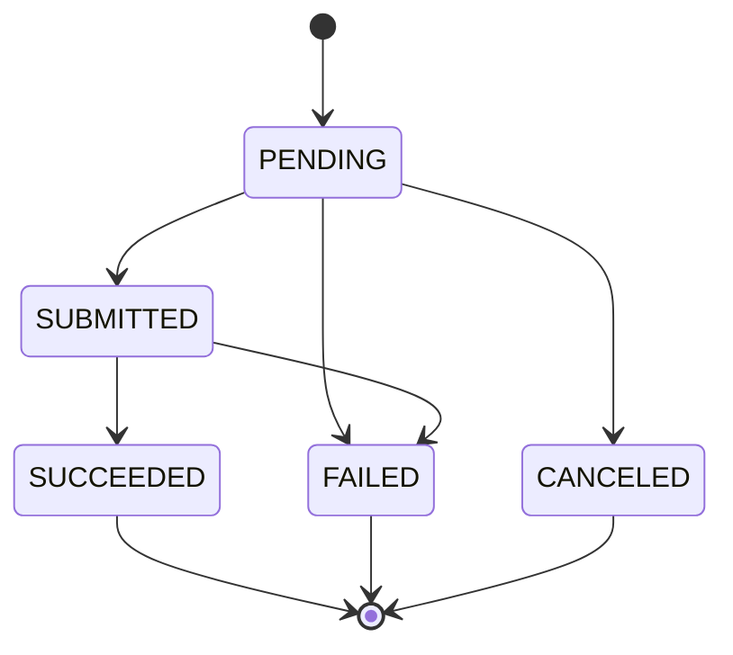

| # | From | To | Trigger | Guard | Side effects | Event |
|---|---|---|---|---|---|---|
| — | — | `PENDING` | `Payment.AddRefund(amount, reason, idempotencyKey)` | payment `AllowsRefund()` — `CAPTURED`/`SETTLED`/`PARTIALLY_REFUNDED`; **I1** `refunded_amount + amount ≤ captured_amount`; currency matches; amount positive; reason is a known `RefundReason`; idempotency key unused | **reserve** the amount by incrementing `payments.refunded_amount` under `FOR UPDATE`. Construction, not an edge | — |
| 1 | `PENDING` | `SUBMITTED` | dispatched to the gateway | connection usable; `gateway_idempotency_key` derived | | — |
| 2 | `PENDING` | `CANCELED` | withdrawn before submission | nothing has left; no gateway call was made | **release** the reservation (decrement `refunded_amount`) | — |
| 3 | `PENDING` | `FAILED` | pre-dispatch rejection | | **release** the reservation | — |
| 4 | `SUBMITTED` | `SUCCEEDED` | gateway confirmed (`Payment.ConfirmRefund`) | L6 passed; amount echo matches | payment → `PARTIALLY_REFUNDED` or `REFUNDED`; ledger posts to `REFUNDS_PAYABLE` | `payment.refunded.v1` |
| 5 | `SUBMITTED` | `FAILED` | gateway rejected | definitive rejection only — an ambiguous refund follows the same A7 rule as a payment and stays `SUBMITTED` with a reconciliation flag | release the reservation | — |

**Terminal states:** `SUCCEEDED`, `FAILED`, `CANCELED`.

| Forbidden | Why |
|---|---|
| `PENDING → SUCCEEDED` | Would let a refund skip the gateway entirely and move the payment to `REFUNDED` on the strength of a local write. There is no path to "money returned" that does not pass through a dispatch. |
| `FAILED → SUBMITTED` (or `→ PENDING`) | A retry is a **new** refund with a new idempotency key. Re-dispatching the same refund row with the same gateway key after a definitive failure risks a double refund if the first attempt's failure classification was wrong. |
| `SUCCEEDED → FAILED` | Money has left. A reversal of a refund is a new capture, which no gateway supports; the correct response is a reconciliation exception. |
| `CANCELED → *` | Cancellation released the reservation. Resurrecting the row would refund an amount the payment's refundable balance no longer accounts for. |
| Refund while the payment is `AUTHORIZED` | `State.AllowsRefund()` is false there; the operation is `Void` (#19 in §3.1). Offering "refund" on an uncaptured payment leads merchants to void and refund the same funds. |
| Reservation released on `SUCCEEDED` | Deliberately impossible: reservations are released only on `FAILED` and `CANCELED`. The nightly reconciliation asserts `payments.refunded_amount = SUM(amount) FILTER (WHERE status IN ('PENDING','SUBMITTED','SUCCEEDED'))` and opens a `MAJOR` exception on drift. |

**Enforcement:** the domain table above, plus `CHECK (status IN ('PENDING','SUBMITTED','SUCCEEDED','FAILED','CANCELED'))`, `CHECK (amount > 0)` and `CHECK (refunded_amount <= captured_amount)` on the parent payment. As with the attempt machine there is **no** database transition trigger for refunds. `TestRefundMachineAcceptsExactlyTheDeclaredEdges` walks all **25** pairs — **5** accepted, **20** rejected — and `TestRefundTransitionGuards` covers the amount and reason guards.

---

## 6. Gateway health

**Owner:** BC-4 · **Table:** `gateway_health.state`, keyed `(gateway_id, operation)` ·
**Source of truth:** `internal/domain/gateway/health.go` · **States:** 4 · **Transitions:** 7

Two of the seven edges are **not** in baseline §10's diagram, which draws only the common path,
and both are load-bearing. `HEALTHY → UNHEALTHY` (#4) exists because a gateway that starts
returning 500s for everything crosses both thresholds between two consecutive evaluations, and
forcing it through `DEGRADED` would mean one further thirty-second window of dispatching into a
wall before the circuit opens. `DEGRADED → HEALTHY` (#2) exists because without it every transient
blip that touches 6 % is permanent until the gateway gets bad enough to trip the circuit.

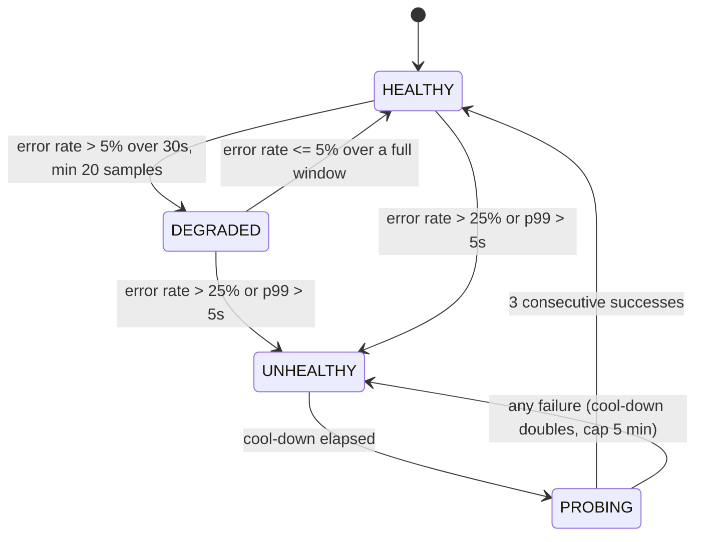

| # | From | To | Trigger | Guard | Side effects | Event |
|---|---|---|---|---|---|---|
| 1 | `HEALTHY` | `DEGRADED` | window evaluation | error rate > 5 % over 30 s **and** `sample_count ≥ 20` | routing de-prioritizes this gateway; circuit stays `CLOSED` | `gateway.health_changed.v1` |
| 2 | `DEGRADED` | `HEALTHY` | window evaluation | error rate ≤ 5 % over a full 30 s window with ≥ 20 samples | routing priority restored | `gateway.health_changed.v1` |
| 3 | `DEGRADED` | `UNHEALTHY` | window evaluation | error rate > 25 % **or** p99 > 5 s | **circuit `OPEN`**; routing excludes; `cooldown_seconds` starts at 30 | `gateway.health_changed.v1` |
| 4 | `HEALTHY` | `UNHEALTHY` | window evaluation | as #3 (a hard cliff skips `DEGRADED` — a gateway that goes from fine to 40 % errors must not spend a window in `DEGRADED` still taking traffic) | as #3 | `gateway.health_changed.v1` |
| 5 | `UNHEALTHY` | `PROBING` | cool-down timer | `now() ≥ state_changed_at + cooldown_seconds` | **circuit `HALF_OPEN`**; a single probe request is admitted | `gateway.health_changed.v1` |
| 6 | `PROBING` | `HEALTHY` | probe result | 3 consecutive successes | circuit `CLOSED`; `cooldown_seconds` reset to 30; `consecutive_probe_successes` reset | `gateway.health_changed.v1` |
| 7 | `PROBING` | `UNHEALTHY` | probe result | any failure | circuit back to `OPEN`; `cooldown_seconds = min(cooldown × 2, 300)` | `gateway.health_changed.v1` |

**Terminal states:** none. Health is a perpetual machine; an operator `ForceOpen`/`ForceClose`
break-glass is audited and expires automatically after 30 minutes so a forgotten override cannot
become permanent.

| Forbidden | Why |
|---|---|
| `DEGRADED → PROBING` | `PROBING` exists only to test a gateway we have stopped sending traffic to. A `DEGRADED` gateway is still receiving traffic, so a "probe" is indistinguishable from ordinary requests and its result means nothing. |
| `UNHEALTHY → HEALTHY` directly | Would slam full production traffic into a gateway that has not answered a single successful request. The three-probe ramp is the difference between recovery and a thundering-herd re-outage. |
| `PROBING → DEGRADED` | Only two outcomes exist for a probe: recovered (`HEALTHY` after 3) or not (`UNHEALTHY`). A third outcome invites "mostly working", which routing cannot act on. |
| Per-merchant health states | Baseline §10 is explicit: per-merchant samples are too sparse to be statistically meaningful. Per-merchant *pinning* is a routing policy, not a health state. |

**Enforcement:** the hot path is an in-process sliding window per orchestrator pod; the DB row is
the cross-pod gossip point and is written **only on state change**, not per sample. `CHECK` on
`state` in `migrations/0005_gateway_registry.up.sql`; no transition trigger — this machine is
enforced in the domain alone. `TestHealthMachineAcceptsExactlyTheDeclaredEdges` walks all **16**
pairs (**7** accepted, **9** rejected) and `TestHealthMachineHasNoTerminalOrSelfTransitions`
pins the "health is perpetual" property. The thresholds themselves have their own tests:
`TestErrorRateThresholds`, `TestP99LatencyArmOpensTheCircuit`,
`TestDegradedRecoversWithoutOpeningTheCircuit`, `TestCooldownProbeAndClose` and
`TestCooldownDoublesAndIsCapped`. The threshold constants (`MinSamples`, `DegradedErrorRate`,
`UnhealthyErrorRate`, `UnhealthyP99`, `BaseCooldown`, `MaxCooldown`, `ProbeSuccessesToClose`) are
exported from `health.go` so this document, the operator console and the tests cannot each carry
their own copy of a number.

---

## 7. Gateway connection

**Owner:** BC-4 · **Table:** `gateway_connections.status` ·
**Source of truth:** `internal/domain/gateway/connection.go` · **States:** 9 · **Transitions:** 20

The two in-flight phases each have their **own** failure state — `PROVISIONING_FAILED` and
`CERTIFICATION_FAILED` — rather than falling back to the state they came from. The reason is the
same one that gives the merchant lifecycle its `*_FAILED` states: a connection that has failed
provisioning is not the same thing as a connection nobody has tried to provision, and collapsing
the two loses the failure history and makes "retry" and "start" indistinguishable to the operator
and to the workflow.

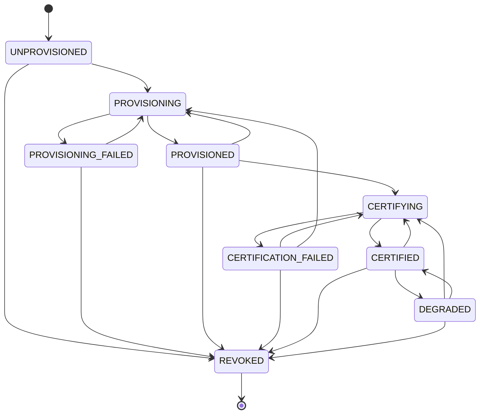

| # | From | To | Trigger | Guard | Side effects | Event |
|---|---|---|---|---|---|---|
| — | — | `UNPROVISIONED` | `NewConnection` | merchant exists; gateway `ACTIVE`; unique on `(tenant, merchant, gateway, environment)` | Construction, not an edge | — |
| 1 | `UNPROVISIONED` | `PROVISIONING` | workflow step 5 `provision-gateways` | merchant in `GATEWAY_PROVISIONING`; capability descriptor covers the declared corridors | call adapter `Provision`, idempotent on external ref | — |
| 2 | `PROVISIONING` | `PROVISIONED` | adapter returned an account ref | `external_account_ref` non-empty; credential ref **and** webhook registration ref both present — the aggregate refuses one without the other | store `credential_ref`, `webhook_registration_ref` — **references only, never material** | `merchant.gateway_provisioned.v1` |
| 3 | `PROVISIONING` | `PROVISIONING_FAILED` | the gateway refused, or provisioning exhausted its retries | | the reason is retained; refs are cleared so a retry is genuinely fresh | — |
| 4 | `PROVISIONING_FAILED` | `PROVISIONING` | retry | retrying is safe because the gateway APIs involved are idempotent on our external reference: a retry either creates the account or returns the one that already exists | new attempt epoch | — |
| 5 | `PROVISIONED` | `CERTIFYING` | workflow steps 9–10 | credential and webhook refs present; suite version pinned | start a `CertificationReport` | — |
| 6 | `PROVISIONED` | `PROVISIONING` | re-provisioning a working connection | a gateway-forced sub-merchant account migration, or a credential rotation that requires re-issuing the account reference rather than just the secret | | — |
| 7 | `CERTIFYING` | `CERTIFIED` | report sealed `PASSED` | a non-empty `certification_report_id` — the aggregate refuses to certify without one (A11); **every** matrix cell passed **all seven** baseline §11.4 assertions; report is for **this** environment | `certified_at` set; connection becomes routable | `merchant.certified.v1` |
| 8 | `CERTIFYING` | `CERTIFICATION_FAILED` | report sealed `FAILED` | | connection remains non-routable; report immutable | — |
| 9 | `CERTIFICATION_FAILED` | `CERTIFYING` | re-run after a fix | a change was made since the failure | **new** report; the failed one is never amended | — |
| 10 | `CERTIFICATION_FAILED` | `PROVISIONING` | the failure was a provisioning defect | a suite that fails on "webhook not received" is usually a provisioning defect — the endpoint was registered against the wrong account — so the deeper recovery has to be reachable without deleting and recreating the connection, which would lose the failure history | | — |
| 11 | `CERTIFIED` | `CERTIFYING` | scheduled or triggered re-certification (adapter upgrade, gateway API version bump) | merchant may remain `ACTIVE`; other certified connections cover the corridors | the connection stays routable during re-certification | — |
| 12 | `CERTIFIED` | `DEGRADED` | operational failure attributable to this connection | credential expiry imminent, webhook registration lost, or the gateway reports the sub-account restricted | routing de-prioritizes, does **not** exclude; alert raised | — |
| 13 | `DEGRADED` | `CERTIFIED` | the underlying condition cleared | credential rotated / webhook re-registered, verified by an L3 probe | | — |
| 14 | `DEGRADED` | `CERTIFYING` | re-certification of a degraded connection | running the suite is exactly how an operator confirms whether a warning is real | | — |
| 15–20 | `UNPROVISIONED` \| `PROVISIONING_FAILED` \| `PROVISIONED` \| `CERTIFICATION_FAILED` \| `CERTIFIED` \| `DEGRADED` | `REVOKED` | `Revoke(reason)` | a reason is required; zero payments in a non-terminal state on this connection | delete webhook registration; destroy the secret version; clear the credential ref; retain the metadata row for audit | — |

**Terminal states:** `REVOKED`. Both failure states are recoverable by design: a connection stuck
with no legal move is an onboarding case a human has to resolve by editing the database.

| Forbidden | Why |
|---|---|
| `UNPROVISIONED → CERTIFIED` | Certification asserts things about a *provisioned* account with *working credentials*. Certifying a connection that does not exist would produce a report about nothing, and `PRODUCTION_READY` depends on that report. |
| `PROVISIONED → CERTIFIED` (skipping `CERTIFYING`) | The only way to become `CERTIFIED` is to pass through a certification run that produces an artifact. Removing the intermediate state is how "certified" degrades into a boolean an operator can set (A11). |
| `REVOKED → *` | Revocation destroys the secret version and deletes the gateway-side webhook registration. Un-revoking would leave a connection pointing at credentials that no longer exist. A returning merchant/gateway pair gets a **new** `connection_id`. |
| `PROVISIONING → REVOKED` and `CERTIFYING → REVOKED` | Revocation is reachable from every *settled* state and deliberately from neither in-flight one. Revoking mid-provisioning would destroy our credentials while a sub-merchant account may or may not have just been created at the vendor, leaving an orphan we can neither see nor close — the same unknown-outcome problem as a payment timeout, and it gets the same answer: let the in-flight operation land first, then revoke. |
| `PROVISIONING_FAILED → CERTIFYING` | There is nothing provisioned to certify. The only way forward is back through `PROVISIONING`. |
| `CERTIFIED` with a sandbox report | Guard #7: environment must match. A sandbox pass certifying production is the exact shape of the failure the certification suite exists to prevent. |

**Enforcement:** the domain table above; `TestConnectionMachineAcceptsExactlyTheDeclaredEdges`
walks all **81** pairs (**20** accepted, **61** rejected),
`TestConnectionMachineTerminalAndSelfTransitions` pins `REVOKED` and the absence of self-edges,
and `TestRecoveryEdges` pins #4, #9 and #10 by name.

> **Known schema drift.** `pp.gateway_connections.status` in
> `migrations/0005_gateway_registry.up.sql` carries
> `CHECK (status IN ('UNPROVISIONED','PROVISIONING','PROVISIONED','CERTIFYING','CERTIFIED','DEGRADED','REVOKED'))`
> — the pre-failure-state list of **7** values. The domain has **9**, and the two it adds,
> `PROVISIONING_FAILED` and `CERTIFICATION_FAILED`, are exactly the states a connection enters
> when something goes wrong. A persisted transition into either would be rejected by the
> database. This is a defect in the migration, not in this document; it is recorded in
> [`README.md`](../README.md#status-and-limitations).

---

## 8. Workflow instance

**Owner:** BC-3 · **Table:** `workflow_instances.state` ·
**Source of truth:** `internal/workflows/engine/state.go` (`instanceMachine`) ·
**States:** 11 · **Transitions:** 21 · **Narrative:** [`docs/automation-plane.md`](./automation-plane.md) §6.1

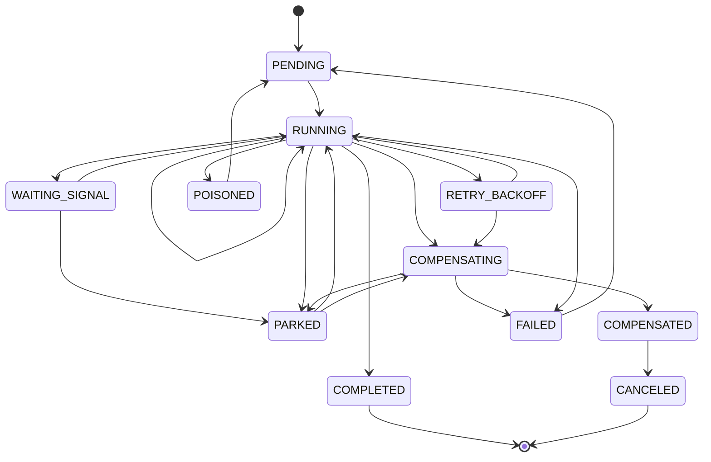

| # | From | To | Trigger | Guard | Side effects | Event |
|---|---|---|---|---|---|---|
| — | — | `PENDING` | `Start` | **no live instance for `(workflow_name, business_key)`** — starting twice is a no-op returning the existing instance (baseline §11) | the partial unique index `wfi_live_business_key` makes the duplicate physically impossible. Construction, not an edge | — |
| 1 | `PENDING` | `RUNNING` | a worker acquires the lease | `lease_expires_at IS NULL OR < now()`; `run_after` elapsed; `crash_count` below the poison threshold; claimed with `FOR UPDATE SKIP LOCKED` | `lease_owner`, `lease_expires_at`, `attempt_epoch + 1` | — |
| 2 | `RUNNING` | `RUNNING` | a step succeeded and the next one begins (**self-loop**) | declared explicitly, because `shared.StateMachine` refuses implicit self-transitions and this is the ordinary forward edge, not an accident | checkpoint, merchant FSM transition and outbox row in **one** transaction | — |
| 3 | `RUNNING` | `RETRY_BACKOFF` | a step failed transiently and attempts remain | error classified `ClassTransient` | the wait lives in the `run_after` **column**, never in an in-memory timer, so a worker that dies during backoff loses nothing | — |
| 4 | `RETRY_BACKOFF` | `RUNNING` | `run_after` reached and the instance is re-leased | as #1 | | — |
| 5 | `RUNNING` | `WAITING_SIGNAL` | the current step is a signal wait (`kyc-decision`, `compliance-approval`) | the step's result is checkpointed first | **lease released** — a seven-day KYC wait holds zero worker resource | — |
| 6 | `WAITING_SIGNAL` | `RUNNING` | signal received | signal name matches; **the signalling principal is authorized and the signal is audited** (baseline §11) | checkpoint the signal payload | — |
| 7 | `WAITING_SIGNAL` | `PARKED` | signal timeout (7 d for KYC, 5 d for compliance review) | `now() > step.deadline` | **not** a failure: a compliance review nobody performed is a late human, not a broken system. Alert raised | — |
| 8 | `PARKED` | `RUNNING` | a late signal arrives, or an operator acts | | resumes normally | — |
| 9 | `PARKED` | `COMPENSATING` | operator cancel | | reverse-order walk begins | — |
| 10 | `RUNNING` | `PARKED` | a step classified `ClassManual` — an ambiguous outcome a lookup could not resolve, or a refusal to roll back past the money pivot | | a human must decide; the instance is not failed | — |
| 11 | `RUNNING` | `COMPENSATING` | `ClassTerminalBusiness`, retries exhausted on a compensatable step, or cancel requested | ≥ 1 completed step has a compensation | run compensations in **strict reverse order** of completion | — |
| 12 | `RETRY_BACKOFF` | `COMPENSATING` | cancel requested while waiting out backoff | | | — |
| 13 | `COMPENSATING` | `COMPENSATED` | all compensations succeeded | every compensable completed step is `COMPENSATED` | case → `ABANDONED` | — |
| 14 | `COMPENSATING` | `FAILED` | a compensation itself failed | | **page** — orphaned external state now exists and nothing else will clean it up | — |
| 15 | `COMPENSATING` | `PARKED` | a compensation needs a human decision | | | — |
| 16 | `RUNNING` | `FAILED` | `ClassTerminalTechnical`, or a failure at or after the money pivot (step 12) | | step payload → `workflow_dlq` with the full error chain | — |
| 17 | `RUNNING` | `POISONED` | `crash_count ≥ 3` observed at lease time | the count is incremented at **lease** time, before execution, so an instance that kills its worker is still counted | quarantined: invisible to every poller, which bounds the blast radius to three worker deaths rather than an indefinite cycle through the fleet. **Pages** | — |
| 18 | `RUNNING` | `COMPLETED` | final step succeeded | every step `SUCCEEDED` or `SKIPPED` | close the onboarding case; merchant → `ACTIVE` requested | `merchant.activated.v1` (via BC-2) |
| 19 | `COMPENSATED` | `CANCELED` | compensation completed after a cancel | | | — |
| 20 | `POISONED` | `PENDING` | operator `Requeue --reset-crash-count` | deliberate, audited operator action | | — |
| 21 | `FAILED` | `PENDING` | operator `Requeue` from the DLQ | a human decided the failure is safe to replay | new `attempt_epoch` | — |

**Terminal states:** `COMPLETED` and `CANCELED` **only**. `FAILED`, `COMPENSATED` and `POISONED`
all read as endings but are not declared terminal, and the reason is the operator surface: a
requeue moves `FAILED` and `POISONED` back to `PENDING` (#20, #21), and a cancellation that
finishes compensating moves `COMPENSATED` to `CANCELED` (#19). Declaring them terminal would make
this table disagree with the runbook — and `shared.NewStateMachine` **panics** on an outgoing edge
from a terminal state, so the disagreement would be a startup panic rather than a quiet lie.

The operational "no longer live" question is a different, broader predicate: `IsFinal()` is true
for `COMPLETED`, `FAILED`, `COMPENSATED` and `CANCELED`. That set is exactly what the partial
unique index `wfi_live_business_key` excludes, so "one live onboarding per merchant" and "this
instance is finished" are the same question answered by the same list —
`TestIsFinalMatchesTheLiveBusinessKeyPredicate` pins it. Get that wrong and a merchant whose
onboarding failed can never start another one, or, worse, can start two.

| Forbidden | Why |
|---|---|
| `COMPLETED → *` | Would re-run steps whose effects already happened — provisioning a second gateway sub-account, submitting a second KYC case. A re-run is a new instance with a new `attempt_epoch`. |
| `CANCELED → *` | The cancellation is settled and its compensations have run. Resuming would re-enter a workflow whose external effects have been deliberately undone. |
| `FAILED → RUNNING` (directly) | Requeue goes through `PENDING` (#21), so the instance re-acquires a lease and a fresh epoch. Jumping straight to `RUNNING` would resume under whatever stale lease the dead worker left. |
| `POISONED → RUNNING` | Same, and it would skip the crash-count reset that is the entire point of the quarantine. |
| `COMPENSATING → RUNNING` | Compensation is one-way. Resuming forward progress mid-rollback leaves half the steps compensated and half live, which is the worst state the engine can be in. |
| Any transition without a valid lease | Two workers advancing one instance concurrently would double-execute activities. The lease predicate is part of every state-changing `UPDATE`'s `WHERE`, so a stale lease loses. |
| Compensations out of order | Reverse order is the only order in which each compensation's preconditions still hold (you cannot delete a webhook registration after de-provisioning the account that owns it). |

**Enforcement:** the partial unique index on the business key; `CHECK ((lease_owner IS NULL) = (lease_expires_at IS NULL))`; the fenced `WHERE lease_epoch = n` on every write; `TestInstanceMachineIsExhaustivelyCorrect` over all **121** pairs (**21** accepted, **100** rejected); `TestWorkerCrashAtEveryOnboardingStepResumesWithoutRepeatingWork` (`tests/integration/workflow_resume_test.go`, tag `integration`).

> **Known schema drift.** `pp.workflow_instances.state` in
> `migrations/0004_onboarding_workflow.up.sql` carries
> `CHECK (state IN ('PENDING','RUNNING','WAITING_SIGNAL','COMPENSATING','COMPLETED','FAILED','ABORTED'))`.
> The domain has eleven states; that list is missing `RETRY_BACKOFF`, `PARKED`, `POISONED`,
> `COMPENSATED` and `CANCELED`, and contains `ABORTED`, which the domain does **not** define.
> The related `workflow_terminal_has_completed_at` constraint refers to the same stale set. A
> defect in the migration, recorded in [`README.md`](../README.md#status-and-limitations).

---

## 9. Workflow step

**Owner:** BC-3 · **Table:** `workflow_steps.state` ·
**Source of truth:** `internal/workflows/engine/state.go` (`stepMachine`) ·
**States:** 13 · **Transitions:** 19 · **Narrative:** [`docs/automation-plane.md`](./automation-plane.md) §6.2

There is **no** `RUNNING → RUNNING` retry self-loop. A retry is an explicit round trip through
`RETRY_SCHEDULED`, because the backoff has to live in a column (`next_retry_at`) rather than in a
worker's memory: an in-process timer dies with its worker, and a step whose retry schedule dies
with the worker is a step that either never retries or retries immediately, forever.

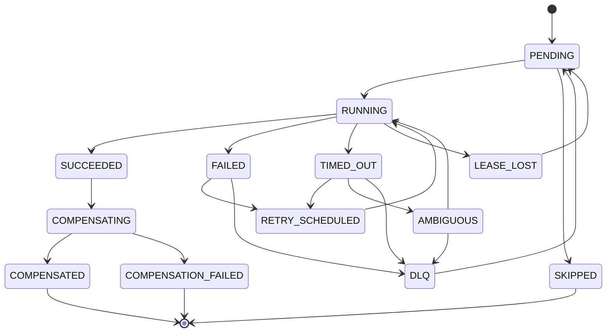

| # | From | To | Trigger | Guard | Side effects | Event |
|---|---|---|---|---|---|---|
| 1 | `PENDING` | `RUNNING` | attempt *n* starts | instance `RUNNING` with a valid lease | `timeout_at = now + StepDef.Timeout`; `lease_epoch` stamped; `attempt++` | — |
| 2 | `PENDING` | `SKIPPED` | step not applicable | e.g. a fan-out branch for a gateway the merchant did not select | recorded, not silently omitted — a skipped step is auditable | — |
| 3 | `RUNNING` | `SUCCEEDED` | activity returned | output schema valid | checkpoint, merchant FSM transition and outbox row in **one** transaction, which is why a resumed instance never has to reconcile "the step is done but the domain effect is missing" | — |
| 4 | `RUNNING` | `FAILED` | activity returned an error | awaiting classification | | — |
| 5 | `RUNNING` | `TIMED_OUT` | `timeout_at` passed | enforced in-process **and** by the reaper, because a worker that has stopped scheduling cannot enforce its own deadline | | — |
| 6 | `RUNNING` | `LEASE_LOST` | a fenced write matched zero rows | `WHERE lease_epoch = n` matched nothing: another worker owns the instance | this worker abandons the step **without having corrupted anything** | — |
| 7 | `LEASE_LOST` | `PENDING` | the owning worker picks it up | | | — |
| 8 | `FAILED` | `RETRY_SCHEDULED` | `ClassTransient` and attempts remain | | `next_retry_at = now + rand(0, min(cap, base·2ⁿ))`, in a column | — |
| 9 | `FAILED` | `DLQ` | `ClassTerminalTechnical`, or `ClassTransient` with attempts exhausted | | full error chain to the DLQ; instance → `COMPENSATING` or `FAILED` | — |
| 10 | `TIMED_OUT` | `RETRY_SCHEDULED` | the step has **no** external side effect | provable from the step definition | safe blind retry | — |
| 11 | `TIMED_OUT` | `AMBIGUOUS` | the step **has** an external side effect | | the next attempt must begin with lookup-before-act | — |
| 12 | `TIMED_OUT` | `DLQ` | attempts exhausted | | | — |
| 13 | `AMBIGUOUS` | `RUNNING` | next attempt begins | **lookup-before-act**: never a blind retry, because an unknown outcome resolved by assumption is how duplicate side effects reach production | the **same** deterministic idempotency key is reused | — |
| 14 | `AMBIGUOUS` | `DLQ` | the lookup was inconclusive | `ClassManual` | a human decides | — |
| 15 | `RETRY_SCHEDULED` | `RUNNING` | `next_retry_at` reached | | attempt *n+1* with the **same** deterministic idempotency key | — |
| 16 | `DLQ` | `PENDING` | operator requeue, optionally with an input patch | deliberate, audited operator action | | — |
| 17 | `SUCCEEDED` | `COMPENSATING` | instance is compensating and this step has a compensation | reverse-order position reached; `NeedsCompensation()` is true only for `SUCCEEDED` | run the compensation activity, idempotent on `K‖"compensate"` | — |
| 18 | `COMPENSATING` | `COMPENSATED` | compensation returned | | | — |
| 19 | `COMPENSATING` | `COMPENSATION_FAILED` | compensation exhausted retries | | **page** — this is the highest-severity workflow state there is: real external state is now orphaned and nothing else will clean it up | — |

**Terminal states:** `COMPENSATED`, `COMPENSATION_FAILED` and `SKIPPED`. `SUCCEEDED` is
deliberately **not** terminal — it has one outgoing edge, #17 — and neither are `FAILED`,
`TIMED_OUT`, `AMBIGUOUS`, `LEASE_LOST` or `DLQ`, all of which have a way forward. `IsComplete()`,
the predicate that makes resume replay-free, is true for `SUCCEEDED` alone: the engine skips every
step for which it holds and runs the next one.

| Forbidden | Why |
|---|---|
| `FAILED → RUNNING` (directly) | A retry goes through `RETRY_SCHEDULED` (#8, #15), so the backoff is durable and the attempt counter is honest. Jumping straight back to `RUNNING` would retry with no delay and no record. |
| `SUCCEEDED → RUNNING` | Would re-execute an activity whose result is already checkpointed — the exact double-execution the checkpoint exists to prevent. |
| `TIMED_OUT → RUNNING` (directly) | A step that may have had an external side effect must pass through `AMBIGUOUS` (#11) so the next attempt is a lookup, not a blind repeat. This is the workflow engine's version of A7. |
| `AMBIGUOUS → SUCCEEDED` | An ambiguous outcome resolved by optimism is a duplicate side effect waiting to be discovered. Only a lookup that actually ran (#13) or a human (#14) may resolve it. |
| Compensating a step that never succeeded | `NeedsCompensation()` is false for every state but `SUCCEEDED`. Compensations assume their forward action happened; de-provisioning an account that was never provisioned either errors or, worse, de-provisions someone else's. |
| `COMPENSATION_FAILED → *` | The failure is the alert. Retrying it automatically would clear the page without clearing the orphan. |

**Enforcement:** `TestStepMachineIsExhaustivelyCorrect` over all **169** pairs (**19** accepted, **150** rejected); `uq_step_name_attempt UNIQUE (instance_id, name, attempt)`; the fenced `lease_epoch` predicate on every write.

> **Known schema drift.** `pp.workflow_steps.state` in
> `migrations/0004_onboarding_workflow.up.sql` carries
> `CHECK (state IN ('PENDING','RUNNING','SUCCEEDED','FAILED','SKIPPED','COMPENSATING','COMPENSATED','COMPENSATION_FAILED'))`
> — **8** of the domain's **13** values. `TIMED_OUT`, `AMBIGUOUS`, `LEASE_LOST`,
> `RETRY_SCHEDULED` and `DLQ` cannot be persisted, which is to say the entire retry and
> unknown-outcome path cannot be persisted. Recorded in
> [`README.md`](../README.md#status-and-limitations).

---

## 10. Tenant

**Owner:** BC-1 · **Table:** `tenants.status` ·
**Source of truth:** `internal/domain/tenant/tenant.go` · **States:** 3 · **Transitions:** 4

Three states and no onboarding pipeline, unlike the merchant, and the asymmetry is deliberate: a
tenant is created by a commercial process that has already completed **outside** the platform — a
signed contract — whereas a merchant is onboarded *by* the platform through a workflow with KYC,
bank validation and certification. Giving the tenant a pipeline it does not have would mean
inventing states nothing ever sets. A tenant also starts `ACTIVE` rather than in a `CREATED`-like
state, because there is nothing left to do to it at creation time.

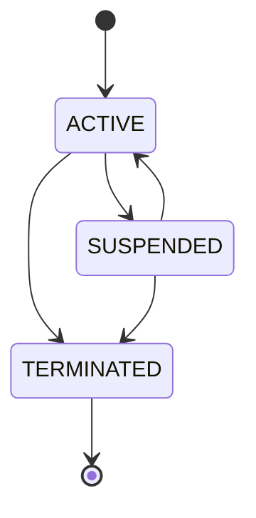

| # | From | To | Trigger | Guard | Side effects | Event |
|---|---|---|---|---|---|---|
| 1 | `ACTIVE` | `SUSPENDED` | `Suspend(reason)` | a reason is **required** — a suspension takes every merchant under the tenant offline and must record why (`L4.SUSPENSION_REQUIRES_REASON`) | `suspended_at` set; every write refused; nothing deleted | `tenant.suspended.v1` |
| 2 | `SUSPENDED` | `ACTIVE` | `Reinstate` | | `status_reason` and `suspended_at` cleared; the tenant resumes intact | `tenant.reinstated.v1` |
| 3 | `ACTIVE` | `TERMINATED` | `Terminate(reason, activeMerchants)` | `activeMerchants == 0` — terminate or migrate every merchant under the tenant first. The count is passed **in**, because this aggregate cannot see BC-2 | `terminated_at` set | `tenant.terminated.v1` |
| 4 | `SUSPENDED` | `TERMINATED` | `Terminate(reason, activeMerchants)` | as #3 | | `tenant.terminated.v1` |

**Terminal states:** `TERMINATED`.

| Forbidden | Why |
|---|---|
| `TERMINATED → *` | Data retention past termination is a legal-hold and regulatory-retention question answered in BC-9, not by resurrecting the tenant. A returning customer is a new `tenant_id`. |
| Suspending without a reason | Refused by the guard, not by convention. A suspension nobody recorded a reason for is one nobody can lift with confidence. |
| Changing `tier` or `residency_region` | Not a lifecycle transition at all, and both are refused by the `tenants_guard` trigger in `migrations/0013_state_guards.up.sql`. A `POOLED → SILOED` move is the online migration in [`docs/multi-tenancy.md`](./multi-tenancy.md) §5.1; an `UPDATE` that merely relabels the tier leaves the data in the pooled schema while every downstream component believes it is siloed. |

**Note that #4 is the normal path, not an exception.** The usual sequence is suspend for
non-payment, wait out the cure period, terminate. Requiring a reinstatement first would mean
briefly re-enabling processing for a tenant that is being shut down.

**Enforcement:** `CHECK (status IN ('ACTIVE','SUSPENDED','TERMINATED'))` on `pp.tenants.status`;
the `tenants_guard` trigger for the immutable fields (it does **not** check transitions);
`TestTenantMachineAcceptsExactlyTheDeclaredEdges` over all **9** pairs (**4** accepted, **5**
rejected), plus `TestSuspendedTenantCanBeTerminatedDirectly`, which exists specifically to stop
#4 being "simplified" away.

---

## 11. API client

**Owner:** BC-1 · **Table:** `api_clients.status` ·
**Source of truth:** `internal/domain/tenant/apiclient.go` · **States:** 3 · **Transitions:** 4

An API client is a machine identity, and every request to the platform is authenticated as one.
The tenant is derived from it and from nothing else (baseline §16.2), which is why the aggregate
has no method that can change its tenant: a client whose tenant could be reassigned would turn
the platform's entire isolation guarantee into a mutable field.

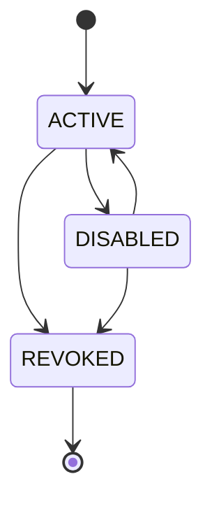

| # | From | To | Trigger | Guard | Side effects | Event |
|---|---|---|---|---|---|---|
| 1 | `ACTIVE` | `DISABLED` | `Disable(reason)` | | reversible stop — an unused integration parked, or a client held during an investigation. The credential still exists in the secret store | — |
| 2 | `DISABLED` | `ACTIVE` | `Enable` | | `status_reason` cleared | — |
| 3 | `ACTIVE` | `REVOKED` | `Revoke(reason)` | | the credential is **destroyed**; the secret references are cleared on the aggregate as well as in the store, so a revoked client does not name paths we intend nobody to resolve | — |
| 4 | `DISABLED` | `REVOKED` | `Revoke(reason)` | | as #3 | — |

**Terminal states:** `REVOKED`.

| Forbidden | Why |
|---|---|
| `REVOKED → *` | A revoked credential that could be resurrected is not revoked, and the entire value of revocation as an incident-response action is that it is irreversible. |
| Changing scopes on a non-`ACTIVE` client | `GrantScopes`/`RevokeScopes` refuse unless the client is `ACTIVE`. Editing the permissions of a disabled or revoked credential is a change nobody will notice until it is re-enabled. |

**Enforcement:** `CHECK (status IN ('ACTIVE','DISABLED','REVOKED'))` on `pp.api_clients.status`;
`TestClientMachineAcceptsExactlyTheDeclaredEdges` over all **9** pairs (**4** accepted, **5**
rejected).

---

> **Sections 12–15 are specified here and enforced elsewhere.** Unlike §2–§11, the four machines
> below have **no** `shared.StateMachine` table in `internal/domain`. Their states live as a
> `CHECK` constraint on the owning column and their transitions are enforced by the SQL each
> command issues — a conditional `UPDATE` whose `WHERE` names the expected prior state — and by
> the unique indexes described under each. They are binding on the same terms as the rest of this
> document, but "the code and this table cannot drift" is **not** true of them the way it is of
> §2–§11: there is no exhaustive property test to catch it. Treat the tables below as the
> specification, not as a transcription of a Go table.

---

## 12. Onboarding case

**Owner:** BC-3 · **Table:** `onboarding_cases.status`
(`CHECK (status IN ('OPEN','BLOCKED','COMPLETED','ABANDONED'))`, `migrations/0004_onboarding_workflow.up.sql`)

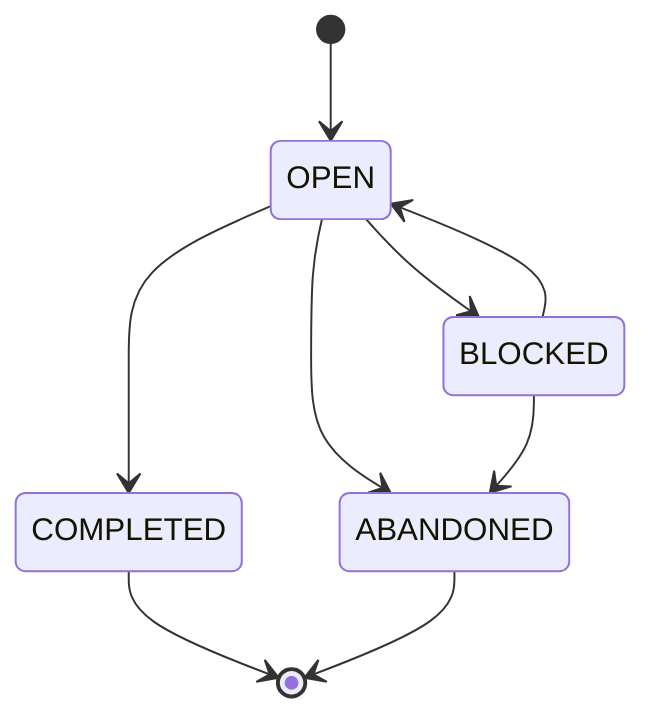

| # | From | To | Trigger | Guard | Side effects | Event |
|---|---|---|---|---|---|---|
| 1 | — | `OPEN` | `OpenCase` | no other case for this merchant in `OPEN`/`BLOCKED` | start the workflow instance | — |
| 2 | `OPEN` | `BLOCKED` | a step failed, or a manual gate was reached | reason recorded; annotations carry the failing `RuleID`s | SLA clock paused for vendor-wait; notification sent | — |
| 3 | `BLOCKED` | `OPEN` | the blocking condition cleared | the corresponding merchant transition succeeded, or the gate was signalled by an authorized principal | SLA clock resumed | — |
| 4 | `OPEN` | `COMPLETED` | workflow `COMPLETED` | **merchant is `ACTIVE`** | `closed_at` set | — |
| 5 | `OPEN` \| `BLOCKED` | `ABANDONED` | `AbandonCase` or workflow `ABORTED`/`FAILED` | compensations finished | `closed_at` set; releases the one-live-case slot | — |

**Terminal states:** `COMPLETED`, `ABANDONED`.

| Forbidden | Why |
|---|---|
| `COMPLETED → OPEN` | Re-opening a completed case would create a second live case for an already-active merchant and let onboarding-time transitions run against a live merchant. Changes to a live merchant go through the control plane, not through onboarding. |
| `→ COMPLETED` while the workflow is running | The case is the business view of the instance; a completed case with a running instance means compensations could still fire against a merchant we have told the customer is live. |
| Two live cases for one merchant | Partial unique index. Two cases means two workflow instances means duplicate KYC submissions and duplicate gateway sub-accounts. |

---

## 13. Idempotency record

**Owner:** BC-6 · **Table:** `idempotency_records.state` · Baseline §14.3.

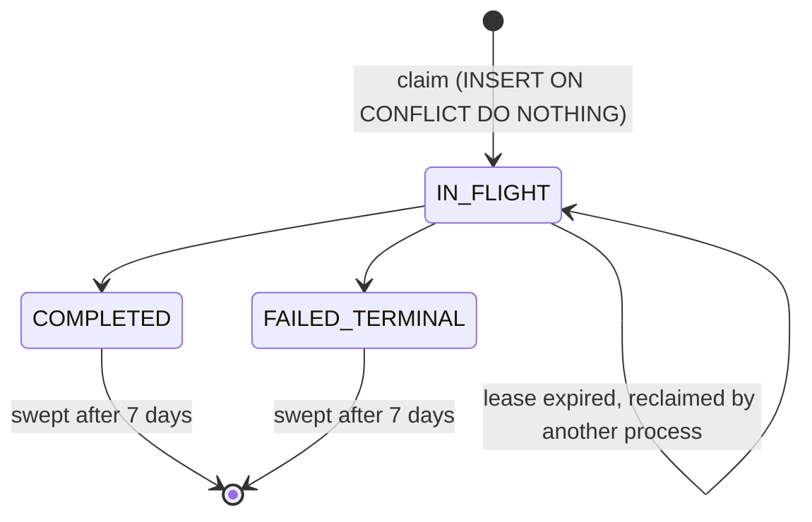

| # | From | To | Trigger | Guard | Side effects | Event |
|---|---|---|---|---|---|---|
| 1 | — | `IN_FLIGHT` | `Claim` | `INSERT … ON CONFLICT DO NOTHING` returned a row | `lease_owner`, `lease_expires_at = now() + 30s` | — |
| 2 | `IN_FLIGHT` | `IN_FLIGHT` | `Reclaim` | `lease_expires_at < now()` — the original process died | `UPDATE … WHERE lease_expires_at < now()`; new owner re-executes | — |
| 3 | `IN_FLIGHT` | `COMPLETED` | the operation succeeded | executed in the **same transaction** as the business effect | store the response snapshot (status, headers, body) and `resource_id` | — |
| 4 | `IN_FLIGHT` | `FAILED_TERMINAL` | non-retryable failure | error category ∈ {`VALIDATION`, `BUSINESS_RULE`, `AUTHORIZATION`, `NOT_FOUND`} (baseline §20.1) | store the error snapshot | — |

**Behaviour on a duplicate request**, which is what the machine is actually for:

| Observed state | Response |
|---|---|
| `IN_FLIGHT`, lease valid | `409 IDEMPOTENT_REQUEST_IN_PROGRESS` + `Retry-After: 1`. **We do not block and we do not process twice** (A6) — blocking a request thread on another process's lease is how thread pools die under retry storms. |
| `IN_FLIGHT`, lease expired | Reclaim atomically and re-execute. |
| `COMPLETED` | Replay the stored status + body + `Idempotent-Replay: true`. |
| `FAILED_TERMINAL` | Replay the stored error. |
| Any state, **different fingerprint** | `422 IDEMPOTENCY_KEY_REUSED` — the client reused one key for two different requests (baseline §14.2). |

**Terminal states:** `COMPLETED`, `FAILED_TERMINAL` — immutable, then swept at 7 days.

| Forbidden | Why |
|---|---|
| `COMPLETED → IN_FLIGHT` | Would allow a completed operation to be re-executed, defeating the entire mechanism. |
| `FAILED_TERMINAL → IN_FLIGHT` | The failure is terminal *for this key*. A retry needs a new key, which is the client's signal that it is a new logical operation. |
| Storing a *retryable* failure as `FAILED_TERMINAL` | A `503` or a gateway timeout must **not** be snapshotted as a terminal error, or the client's legitimate retry would replay the failure forever. Retryable failures release the lease and leave the record `IN_FLIGHT`. Guard #4 enumerates the terminal categories exhaustively; the default is "not terminal". |
| Trusting Redis | Redis mirrors `COMPLETED` records for latency only. A Redis miss or a total outage degrades latency, never correctness — Postgres is authoritative (baseline §14.3). |

**Enforcement:** `UNIQUE (tenant_id, merchant_id, method, path_template, idempotency_key)` — this index *is* the state machine's concurrency control; `CHECK (state = 'IN_FLIGHT' OR response_status IS NOT NULL)`; every transition is a conditional `UPDATE` whose `WHERE` includes the expected prior state, so a lost update is impossible without a version column.

---

## 14. Inbound webhook

**Owner:** BC-7 · **Table:** `inbound_webhooks.state`

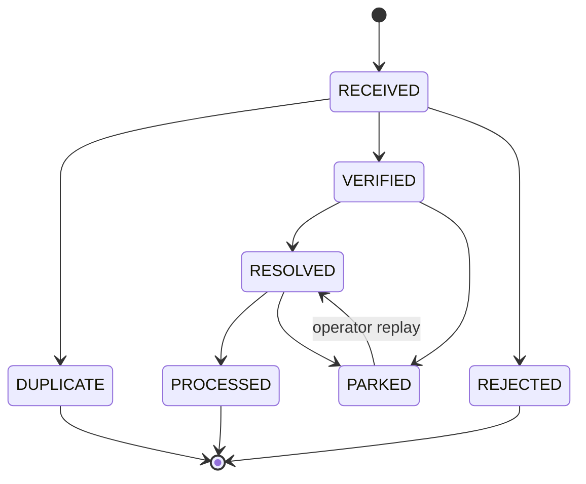

| # | From | To | Trigger | Guard | Side effects | Event |
|---|---|---|---|---|---|---|
| 1 | — | `RECEIVED` | HTTP POST to `/v1/webhooks/{gateway}` | body ≤ 1 MiB | persist raw body + allowlisted headers; **≤ 50 ms budget, no processing inline**; respond `200` | `webhook.received.v1` |
| 2 | `RECEIVED` | `DUPLICATE` | dedup claim returned 0 rows | `(gateway_code, gateway_ref)` already present | drop silently, increment a counter — a gateway retrying is normal, not an error | — |
| 3 | `RECEIVED` | `VERIFIED` | signature check | scheme-appropriate signature valid **and** timestamp within ±5 min **and** nonce unused | | — |
| 4 | `RECEIVED` | `REJECTED` | signature invalid, or replay detected | | `401 WEBHOOK_SIGNATURE_INVALID` / `WEBHOOK_REPLAY_DETECTED`; **security event raised**; body retained for forensics but never interpreted | — |
| 5 | `VERIFIED` | `RESOLVED` | payload mapped to a domain subject | `gateway_reference` matches a known payment/refund; tenant resolved | set `tenant_id`, `resolved_payment_id`, `resolved_event_type` | — |
| 6 | `VERIFIED` | `PARKED` | cannot resolve | unknown reference after the grace window (the webhook may legitimately arrive before our commit) | retried with backoff up to 8 attempts, then parked and alerted | — |
| 7 | `RESOLVED` | `PROCESSED` | domain command accepted | the `Payment` aggregate accepted the transition | | (the payment's own event) |
| 8 | `RESOLVED` | `PARKED` | domain command rejected | e.g. `INVALID_STATE_TRANSITION` — the gateway told us something inconsistent with our state | `MAJOR` reconciliation exception opened | — |
| 9 | `PARKED` | `RESOLVED` | operator replay after investigation | replay is authorized and audited | | — |

**Terminal states:** `PROCESSED`, `REJECTED`, `DUPLICATE`.

| Forbidden | Why |
|---|---|
| `RECEIVED → RESOLVED` (skipping verification) | An unverified webhook is attacker-controlled input. `CHECK (state NOT IN ('RESOLVED','PROCESSED') OR signature_valid)` makes the skip unwritable. |
| `REJECTED → *` | A rejected webhook failed authentication. Reprocessing it later would honour a forged message. If the rejection was our bug (wrong key version), the gateway is asked to resend — we do not resurrect. |
| `DUPLICATE → *` | The original is authoritative. Processing the duplicate is the double-processing the dedup table exists to prevent. |
| A webhook writing `payments.state` directly | B7 in `05-bounded-contexts.md`. BC-7 issues a command; BC-6's aggregate validates it against the payment FSM. A gateway that sends us `captured` for a payment we believe is `FAILED` must produce a reconciliation exception, not a state overwrite. |
| Processing inline in the ingress | Blows the 50 ms budget, which makes the gateway retry, which multiplies load exactly when we are already slow. |

---

## 15. Reconciliation exception

**Owner:** BC-8 · **Table:** `reconciliation_exceptions.state`

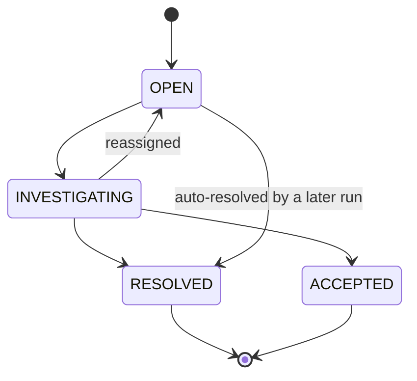

| # | From | To | Trigger | Guard | Side effects | Event |
|---|---|---|---|---|---|---|
| 1 | — | `OPEN` | a run detects a discrepancy | not already open on the same identity tuple (`run_type`, `kind`, subject) — re-detection **updates**, never duplicates | `CRITICAL` blocks the merchant's `→ ACTIVE` and pages; `MAJOR` tickets; `MINOR` dashboards | — |
| 2 | `OPEN` | `INVESTIGATING` | assigned to a human | assignee set | SLA clock starts (`CRITICAL` 4 h, `MAJOR` 2 d) | — |
| 3 | `INVESTIGATING` | `OPEN` | unassigned / reassigned | | | — |
| 4 | `INVESTIGATING` | `RESOLVED` | the discrepancy was corrected | resolution note required; for a payment-state discrepancy, the correcting **command** must have been accepted by BC-6 | | possibly `payment.settled.v1` / `payment.disputed.v1` |
| 5 | `OPEN` | `RESOLVED` | a later run no longer sees the discrepancy | the same run type over an overlapping window found agreement | auto-resolution is recorded with the resolving `run_id` | — |
| 6 | `INVESTIGATING` | `ACCEPTED` | a known, tolerated variance | requires an **explicit authorized actor**, a written justification and an expiry date | re-opens automatically at expiry if still present | — |

**Terminal states:** `RESOLVED`, `ACCEPTED`.

| Forbidden | Why |
|---|---|
| `OPEN → ACCEPTED` | Acceptance must be a deliberate human act after investigation. A path that lets an exception be accepted without being investigated is how a systematic reconciliation failure gets silently normalized. |
| `RESOLVED → *` | If the discrepancy recurs it is a **new** exception with a new `run_id`, so the recurrence is visible. Re-opening the old one hides the frequency, which is the most diagnostic signal there is. |
| Auto-resolving a `CRITICAL` without a correcting command | Guard #4: a `CRITICAL` payment-state discrepancy is only resolvable by a command BC-6 accepted. Otherwise "resolution" would mean "the reconciler stopped noticing". |
| Deleting an exception | No `DELETE` grant. An exception that was wrong is `RESOLVED` with a note saying so. |

---

## 16. Why transition tables, not `if` statements

### 16.1 The argument

Scattered conditionals fail in four specific, recurring ways. Every one of them is a real incident
class in payment systems:

| Failure mode | With scattered `if`s | With an explicit table |
|---|---|---|
| **The forgotten branch** | A new state is added and three of the eleven `if` chains that switch on state are updated. The other eight silently fall through to a default. | Adding a state to `AllStatuses` widens the exhaustive test's matrix, and every new pair must be classified before the test passes. Falling through is not expressible. |
| **The invisible machine** | The set of legal transitions exists only as the union of conditions spread across a service, a handler, a repository and a webhook processor. Nobody can enumerate it, so nobody can review it. | The machine is one literal, diffable in a pull request. A reviewer can see that `SETTLED → PROCESSING` was added. |
| **Drift between layers** | The domain allows a transition the database's trigger rejects, or vice versa, and the disagreement is found in production. | For the payment and merchant machines, `TestTransitionTablesMatchDomain` compares the Go table with the SQL seed and fails the build on disagreement (§16.3). |
| **Untestable negatives** | Tests cover the transitions someone thought of. The dangerous ones are the ones nobody thought of. | The negative space is enumerable: `|S|² − |T|` pairs, all asserted rejected (§16.2). |

Two further properties matter operationally. The table is **data**, so it can be rendered and
queried: `SELECT * FROM pp.payment_state_transitions WHERE from_state = 'AUTHORIZED'` answers
"what can happen to a payment in `AUTHORIZED`?" during an incident, at 3 a.m., without reading Go.
And it is **total** — `CanTransition` is a pure map lookup with no default branch, so there is no
path where an unclassified pair is accidentally permitted, and `shared.StateMachine` treats a
self-transition as needing an explicit row like any other edge, so `X → X` cannot be permitted by
omission.

The cost is one indirection: reading a command no longer tells you what is legal. That is why the
table lives in the same package as the aggregate, in a file named after the machine, and is
reproduced in full in this document.

### 16.2 The exhaustive property test

Every machine in §2–§11 has the same test, and this is what it actually looks like — the merchant
version, from `internal/domain/merchant/state_test.go`:

```go
func TestMerchantMachineAcceptsExactlyTheDeclaredEdges(t *testing.T) {
    m := Machine()
    accepted, pairs := 0, 0
    for _, from := range AllStatuses {
        for _, to := range AllStatuses {          // |S|² pairs, including self-loops
            pairs++
            want := declaredMerchantEdges[from][to]   // a HAND-WRITTEN table, not m.Edges()
            if want {
                accepted++
            }
            if got := m.CanTransition(from, to); got != want {
                t.Errorf("CanTransition(%s, %s) = %v, want %v", from, to, got, want)
            }
            err := m.Transition(from, to)
            if want {
                if err != nil {
                    t.Errorf("Transition(%s, %s) = %v, want nil", from, to, err)
                }
                continue
            }
            if apierror.CodeOf(err) != apierror.CodeInvalidStateTransition {
                t.Errorf("Transition(%s, %s) code = %s, want INVALID_STATE_TRANSITION",
                    from, to, apierror.CodeOf(err))
            }
        }
    }
    if accepted != declaredMerchantEdgeCount {      // 42
        t.Errorf("the declared table has %d edges, the specification states %d",
            accepted, declaredMerchantEdgeCount)
    }
    for _, s := range AllStatuses {                 // no implicit self-transitions anywhere
        if m.CanTransition(s, s) {
            t.Errorf("%s has an undeclared self-transition", s)
        }
    }
}
```

**The comment on `declaredMerchantEdges` is the point of the test.** It is written out longhand
rather than derived from `Machine().Edges()`, because an expectation computed from the code under
test proves nothing: it would pass for *any* table, including one with `SETTLED → PROCESSING` in
it. The map in the test and the literal in `state.go` are two independent transcriptions of this
document, and the test is where they are compared. The merchant, payment, attempt, refund, tenant,
API-client, gateway-health and gateway-connection machines are all tested this way.

The two workflow machines are the exception and are weaker for it:
`internal/workflows/engine/state_test.go` derives its expectation from `sm.Edges()`, so
`TestInstanceMachineIsExhaustivelyCorrect` and `TestStepMachineIsExhaustivelyCorrect` prove that
`CanTransition`, `Transition` and `Edges` agree with each other — real value, since that is where
the self-transition and terminal-state rules live — but they cannot catch a wrong edge in the
table. For those two, this document is the only independent statement.

Coverage the machines with a `shared.StateMachine` table produce:

| Machine | States | Legal transitions | Pairs asserted | Rejections asserted | Expectation is independent |
|---|---:|---:|---:|---:|:---:|
| Merchant | 21 | 42 | 441 | 399 | yes |
| Payment | 14 | 35 | 196 | 161 | yes |
| Payment attempt | 6 | 9 | 36 | 27 | yes |
| Refund | 5 | 5 | 25 | 20 | yes |
| Gateway health | 4 | 7 | 16 | 9 | yes |
| Gateway connection | 9 | 20 | 81 | 61 | yes |
| Workflow instance | 11 | 21 | 121 | 100 | no |
| Workflow step | 13 | 19 | 169 | 150 | no |
| Tenant | 3 | 4 | 9 | 5 | yes |
| API client | 3 | 4 | 9 | 5 | yes |
| **Total** | **89** | **166** | **1 103** | **937** | |

The four machines of §12–§15 are not in this table because they have no `shared.StateMachine` and
therefore no exhaustive test. That is the gap in this section, stated rather than papered over.

Three further properties are asserted per machine, by name rather than by a shared harness:

| Property | Assertion |
|---|---|
| **Terminality** | Every declared terminal state has zero outgoing rows. `shared.NewStateMachine` **panics** at construction if a terminal state has an outgoing edge, so this one cannot be got wrong quietly: the binary does not start. |
| **No implicit self-transitions** | `CanTransition(s, s)` is false for every `s` unless `{From: s, To: s}` is declared. Two edges in the whole platform are declared self-transitions: `PARTIALLY_REFUNDED → PARTIALLY_REFUNDED` (§3.1 #29) and `RUNNING → RUNNING` (§8 #2). |
| **Universe agreement** | `len(machine.States())`, `len(AllX)` and the size of the test's declared table must all be equal, so a state added to one and not the others fails immediately rather than silently escaping the matrix. |

### 16.3 Three statements, and the checks that tie them together

There is **no** generator. The machine exists as up to three hand-maintained artifacts, and what
makes them trustworthy is not that one is derived from another but that a test compares them:

```
internal/domain/payment/state.go       ──┐
  (the Go transition table)              │
                                         ├── TestTransitionTablesMatchDomain
migrations/0013_state_guards.up.sql    ──┘     (internal/infrastructure/postgres)
  (INSERT INTO pp.payment_state_transitions)

docs/state-machines.md §3.1            ──── compared by a human at review time,
  (this document)                            and transcribed by hand into
                                             declaredPaymentEdges in state_test.go
```

| Pair | Tied together by | Strength |
|---|---|---|
| Go table ↔ SQL seed | `TestTransitionTablesMatchDomain` compares `payment.Machine().Edges()` and `merchant.Machine().Edges()` against the `INSERT` rows parsed out of `migrations/0013_state_guards.up.sql`. | **Mechanical.** Covers the payment and merchant machines only — the two machines that have a SQL transition table at all. |
| Go table ↔ this document | The hand-written `declared*Edges` map in each package's `state_test.go`, which the exhaustive test compares against the machine. Its doc comment names the section it transcribes. | **Mechanical, but only as good as the transcription.** A change made to the code *and* to the test map, without touching this document, passes. |
| This document ↔ SQL | Nothing. | **None.** |
| Go table ↔ column `CHECK` constraint | Nothing. | **None** — and this is where the three known drifts in §7, §8 and §9 come from: a state added to a Go machine whose column `CHECK` was never widened. |

The last row is the honest weakness of the current arrangement, and it is worth stating plainly
because the three boxed notes in §7, §8 and §9 are all instances of it. A check that compared each
machine's `States()` against the `CHECK (… IN (…))` list for its column would have caught all
three the day they were introduced.

### 16.4 The database triggers

There is no single generic `fsm_transitions` table. `migrations/0013_state_guards.up.sql` creates
**two** transition tables and three `BEFORE UPDATE` triggers:

```sql
CREATE TABLE pp.payment_state_transitions (
    from_state TEXT NOT NULL,
    to_state   TEXT NOT NULL,
    PRIMARY KEY (from_state, to_state)
);
-- 35 rows, mirroring internal/domain/payment.Machine()

CREATE TABLE pp.merchant_status_transitions (
    from_status TEXT NOT NULL,
    to_status   TEXT NOT NULL,
    PRIMARY KEY (from_status, to_status)
);
-- 42 rows, mirroring internal/domain/merchant.Machine(), amendment A-01 included

REVOKE INSERT, UPDATE, DELETE ON pp.payment_state_transitions  FROM pp_app;
REVOKE INSERT, UPDATE, DELETE ON pp.merchant_status_transitions FROM pp_app;
```

The `payments_guard` trigger checks I4 (immutable identity, amount, currency, merchant, tenant and
partition key), refuses a version that moves backwards, and then — **only when the state column
actually changes** — looks the pair up:

```sql
IF NEW.state IS DISTINCT FROM OLD.state THEN
    IF NOT EXISTS (
        SELECT 1 FROM pp.payment_state_transitions t
        WHERE t.from_state = OLD.state AND t.to_state = NEW.state
    ) THEN
        RAISE EXCEPTION 'payment % : illegal state transition % -> %',
            OLD.payment_id, OLD.state, NEW.state
            USING ERRCODE = 'check_violation',
                  CONSTRAINT = 'payments_illegal_state_transition';
    END IF;
END IF;
```

`merchants_guard` is the same shape against `pp.merchant_status_transitions`, plus immutable
identity and tenant. `tenants_guard` enforces only the immutable `tier` and `residency_region` —
it does **not** check tenant transitions.

Two details are load-bearing. `IS DISTINCT FROM` means a no-change `UPDATE` is not treated as a
transition, so a legal declared self-loop (`PARTIALLY_REFUNDED → PARTIALLY_REFUNDED`) still has to
be a row in the table and still increments the version — the early return covers only the case
where the column did not move. And the exception is raised with `ERRCODE = 'check_violation'`
(SQLSTATE `23514`) rather than the default `raise_exception`, so the error mapper classifies it
alongside the declarative `CHECK`s without parsing a message.

**What the database does not enforce.** The other eight machines have a `CHECK (… IN (…))` on
their column and no transition trigger. A support script that `UPDATE`s
`pp.gateway_connections.status` from `UNPROVISIONED` straight to `CERTIFIED` will succeed. The two
machines that move money are the two that are defended twice, which is the right place to spend a
trigger; the asymmetry is deliberate, but it should not be mistaken for uniformity.
