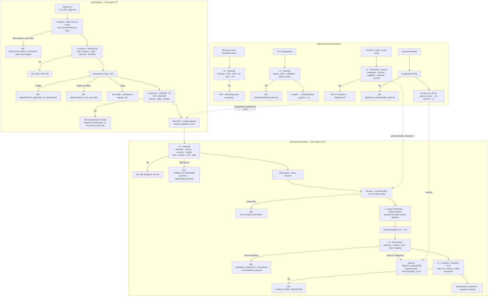

# Validation Plane

> Runtime behaviour of the seven-level validation plane: its engine, its complete rule catalog, and the process for changing it.
> Derived from and subordinate to [`docs/spec/00-design-baseline.md`](spec/00-design-baseline.md) — primarily §21 (validation contract), §20 (error model), §9 (payment FSM + invariants I1–I5), §12 (pipeline), §17 (PCI boundary), §23 (configuration document). If this file disagrees with the baseline, the baseline wins and this file is a defect.

---

## 1. Why validation is a plane, not a utility

A "utility" is a package other packages call when they remember to. That is how payment platforms end up with three different definitions of "the amount is too large" — one in the HTTP handler, one in the risk service, one in a gateway adapter — that disagree at the third decimal of a currency exponent and produce three different error strings for the same rejection.

The validation plane exists because five properties are only obtainable if validation is a **first-class horizontal slice** with its own package boundary (`internal/validation/**`, restricted by §4 to `stdlib + domain + application/ports`):

| Property | What it buys | What breaks without it |
|---|---|---|
| **Single rule registry** | Every assertion the platform makes about a subject is enumerable at build time. `registry.All()` returns 200+ rules; CI can count, diff and document them. | Rules hide inside handlers. Nobody can answer "what do we actually check?" without reading the whole codebase. |
| **Stable rule IDs** | `L5.AMOUNT_WITHIN_MERCHANT_LIMIT` is a permanent, greppable, documented identifier that appears in the error `details[]`, the audit record, the metric exemplar and the support runbook. | Rejections are identified by prose, which is translated, reworded and A/B-tested — so they cannot be counted or alerted on. |
| **Deterministic outcomes** | A rule is pure and total: same subject → same `Outcome`, no clock read, no network, no panic. Rejections are reproducible from the persisted subject snapshot months later. | "It rejected yesterday and passes today" with no way to tell whether the rule, the config or the data changed. |
| **One error shape** | Every failure becomes the same RFC 9457 `problem+json` (§20) with `code`, `category`, `retryable` and a `details[]` entry per failed rule. Client SDKs branch on one shape. | Each service invents an envelope; integrators write per-endpoint parsers; `retryable` becomes advisory prose. |
| **One place to audit "why was this rejected"** | The `Outcome` set is persisted with the payment/case and hash-chained into the audit trail (BC-9). Compliance answers "why did you decline this merchant on 2026-03-14" with a rule ID list, not an archaeology project. | Regulatory questions are answered from log greps, which are retained 30 days (§17.3) and contain no PII by policy. |

The plane is also the enforcement point for the PCI boundary (§17.2): the PAN detector is a **rule** (`L1.NO_PAN_IN_ANY_STRING_FIELD`), not a middleware special case, so it is registered, documented, tested and counted like everything else.

### 1.1 The seven levels (restated from §21, binding)

| Level | Name | Runs where | Pure? | Failure |
|---|---|---|---|---|
| L1 | API / schema | edge middleware (`payment-api`, `control-plane-api`) | yes | `400 VALIDATION_FAILED` |
| L2 | Merchant | onboarding workflow, merchant writes | mostly (vendor calls impure) | `422` + case annotation |
| L3 | Gateway | onboarding, credential rotation, scheduled probe | no (network) | `422` / marks connection unhealthy |
| L4 | Configuration | control plane write path | yes | `422 CONFIGURATION_INVALID` |
| L5 | Payment | data plane, pre-dispatch | yes (config is an input) | `422` |
| L6 | Response | data plane, post-gateway | yes | `502 GATEWAY_CONTRACT_VIOLATION` |
| L7 | Domain / state | aggregate methods | yes | `409 INVALID_STATE_TRANSITION` |

Two invariants of the level structure:

1. **Impure rules never run on the payment hot path.** L3 is the only network-touching level and it runs in the automation plane or on a scheduled probe. L5 reads *cached* config and *pre-computed* velocity counters; it does not call the control plane.
2. **Levels are ordered by cost and by trust.** L1 rejects garbage before it costs a database round-trip; L7 is the last line and is backed by database constraints, because a bug in L5 must still not be able to move money twice (§13.5).

---

## 2. Engine design

### 2.1 Core types

```go
package validation

type RuleID string // "L<n>.<ASSERTION_IN_SCREAMING_SNAKE>"

type Severity uint8
const (
    Warning Severity = iota // recorded, surfaced, does not stop the operation
    Error                   // stops the operation for its rule set's semantics
)

// Outcome is a value, not an error: a rule that fails is not an exceptional
// condition, it is a fact about the subject.
type Outcome struct {
    Rule     RuleID
    Passed   bool
    Severity Severity
    Code     string            // error catalog code, e.g. "AMOUNT_EXCEEDS_LIMIT"
    Field    string            // JSON pointer into the subject: "/amount"
    Message  string            // remediation, addressed to the caller
    Params   map[string]string // bounded, non-PII, for message rendering + metrics
}

func Pass(id RuleID) Outcome
func Fail(id RuleID, code, field, msg string, p ...Param) Outcome

type Rule[T any] interface {
    ID() RuleID
    Severity() Severity
    Evaluate(ctx context.Context, subject T) Outcome
}
```

`Outcome` deliberately carries no `error`. Wrapping a business rejection in Go's `error` interface tempts callers to `errors.Is` their way into control flow and loses the multiplicity — a request can fail eight rules and the caller must see all eight.

Two optional interfaces let the engine reason about rules without executing them:

```go
type Preconditioned[T any] interface{ AppliesTo(subject T) bool } // skip, do not fail
type Impure interface{ Impure() }                                 // network/clock/vendor
type Explains interface{ Explain() string }                       // one-line doc, exported to CI
```

`AppliesTo` is the *precondition* column of the catalog below. A rule that does not apply produces no `Outcome` at all — it is not a pass. This distinction matters for coverage metrics: "how often does `L5.REFUND_WITHIN_WINDOW` actually run" is a different question from "how often does it pass".

### 2.2 Rule sets and evaluation semantics

```go
type RuleSet[T any] struct {
    Name  string
    Rules []Rule[T]
    Mode  Mode // ShortCircuit | CollectAll
}

type Report struct {
    Set       string
    Outcomes  []Outcome  // in registry order; only rules whose precondition held
    Skipped   []RuleID
    Elapsed   time.Duration
}

func (r Report) OK() bool          // no Error-severity failure
func (r Report) Failures() []Outcome
func (r Report) Warnings() []Outcome
func (r Report) Problem() *apierror.Problem // §20 shape, details[] = failures
```

| Mode | Semantics | Used by | Why |
|---|---|---|---|
| **CollectAll** | Every applicable rule runs; all failures returned together. | L1 body/schema, L2, L4, L5 pre-dispatch | The caller is a human or an integrator fixing a form. Returning one error at a time turns a 9-field fix into 9 round-trips. Cost is bounded: all these rules are pure and sub-microsecond. |
| **ShortCircuit** | Evaluation stops at the first `Error`. | L1 auth/tenancy/rate-limit prefix, L3, L6, L7 | (a) *Security*: after `L1.JWT_SIGNATURE_VERIFIES` fails there is no authenticated subject, so every later rule would be evaluating attacker-controlled input and leaking through its error messages. (b) *Cost*: L3 rules are network calls — probing a gateway with dead credentials 12 more times is pointless. (c) *Correctness*: L6/L7 rules are sequentially dependent — `L6.STATUS_IS_MAPPABLE` must pass before `L6.STATE_IS_REACHABLE_FROM_CURRENT` has a status to check. |

**The hybrid that L1 actually uses.** L1 is one rule set with an ordered *phase* boundary:

```
phase A (ShortCircuit): transport → auth → tenancy → authorization → rate limit
phase B (CollectAll)  : schema → types → bounds → PAN detector → idempotency header
```

A failure in phase A never reveals phase B outcomes. This is why an unauthenticated request cannot be used to probe which fields a schema accepts.

### 2.3 Composition

Rules compose with three combinators and nothing else. Deliberately not a DSL:

```go
func All[T any](id RuleID, rs ...Rule[T]) Rule[T]     // conjunction, reports as one ID
func When[T any](p func(T) bool, r Rule[T]) Rule[T]   // precondition wrapper
func Lift[T, U any](id RuleID, f func(T) U, r Rule[U]) Rule[T] // project subject
```

`Lift` is what lets one rule be reused at two levels without duplicating the assertion. Example: the ISO-4217 currency check is written once over `Currency`; L1 lifts it from `/amount/currency` on the raw request, L4 lifts it over each element of `supportedCurrencies[]`, L5 lifts it from the payment subject. Three rule IDs, one implementation, one test of the underlying predicate plus three thin projection tests.

Subjects are **snapshots, not live handles**. `L5PaymentSubject` embeds the config *version number* and the merchant *state at read time*, so the report is reproducible:

```go
type L5PaymentSubject struct {
    Op            Operation      // CREATE | CAPTURE | REFUND | VOID
    Request       PaymentRequest // already L1-clean
    Merchant      MerchantSnapshot
    Config        ConfigSnapshot // includes Version and SnapshotAge
    Payment       *PaymentView   // nil on CREATE
    Velocity      VelocityCounters // pre-read, see data-plane.md §6.2
    Risk          RiskInputs
    Now           time.Time      // injected clock — the rule never calls time.Now()
}
```

### 2.4 Config-driven rules without a scripting language

The configuration document (§23) contains merchant-authored predicates — `routing.rules[].when`, `risk.blockedCountries`, `limits.maxRefundWindowDays`. These must be *evaluated* per payment. The failure mode to avoid is obvious: once you accept an expression, someone asks for `&&`, then a function call, then a loop, and you are operating an untrusted interpreter on the payment hot path with an unbounded latency tail.

The rule: **config supplies parameters to compiled rules; it never supplies logic.**

| Mechanism | Constraint |
|---|---|
| **Fixed predicate grammar** | A `when` clause is a flat map of `field → matcher`. Fields come from a closed enum (`currency`, `paymentMethod`, `country`, `amountRange`, `cardBrand`, `customerSegment`). Matchers are `eq`, `in`, `range`, `prefix`. No boolean operators — the map is an implicit AND; alternation is expressed as multiple rules. |
| **Compile at publish, not at evaluation** | L4 compiles the document into a `CompiledPolicy` (a decision table plus a bitset index per field) during the control-plane write. A document that will not compile is rejected with `CONFIGURATION_INVALID` before it can reach the data plane. Payment-time evaluation is a bitset intersection: O(fields), no allocation, no parsing. |
| **Total by construction** | Every matcher is total over its field domain. There is no division, no regex (regex is a DoS vector via catastrophic backtracking), no user-supplied string that is ever compiled. |
| **Bounded size** | ≤ 64 routing rules, ≤ 16 predicates per rule, ≤ 256 values per `in` matcher — enforced by `L4.ROUTING_RULES_WITHIN_SIZE_BUDGET`. This is what makes the p99 of stage 10 (§12) a 5 ms budget rather than a hope. |
| **Reachability is a validation concern** | `L4.ROUTING_RULES_ARE_REACHABLE` computes whether rule *n* is fully shadowed by rules 1..*n*−1 over the field domains, and warns. A merchant with a dead routing rule discovers it at publish time rather than during an incident. |

The result: a merchant can express "EUR card payments go to Adyen first" declaratively, and the platform can still state a hard latency bound and prove termination.

### 2.5 Where the engine runs

| Level | Host binary | Invocation point | Subject built by |
|---|---|---|---|
| L1 | `payment-api`, `control-plane-api`, `webhook-ingress` | phase A in the middleware chain (§12 stages 3–6); the PAN scan inside `bodylimit`, above authentication; the schema decode in the handler, below the stage-8 claim | HTTP decoder |
| L2 | `workflow-worker`, `control-plane-api` | onboarding step 1 `validate-merchant`; every merchant write | Merchant Registry repo + vendor ACL results |
| L3 | `workflow-worker`, `platformctl`, health prober | onboarding steps 5–7, credential rotation, 5-min scheduled probe | Gateway adapter SPI |
| L4 | `control-plane-api` | `PUT /v1/merchants/{id}/configuration` | draft document + capability descriptors + tenant policy |
| L5 | `payment-orchestrator` (called by `payment-api`) | §12 stage 10 | cached config snapshot + velocity counters |
| L6 | `payment-orchestrator`, `webhook-ingress` | §12 stage 15; webhook processing | gateway adapter normalizer |
| L7 | `payment-orchestrator`, `workflow-worker` | inside aggregate methods, §12 stage 16 | the aggregate itself |

---

## 3. Rule catalog

**Reading the catalog.** *Subject* is the type the rule evaluates. *Precondition* is `AppliesTo`; "always" means the rule runs on every invocation of its set. *Severity* is `E` (Error) or `W` (Warning). *Pure* is `Y` for a total, deterministic, side-effect-free rule; `N` for one that reads the network, a vendor decision or a shared counter. Error codes marked **†** are catalog entries in `api/errors/catalog.yaml` beyond the §20.2 excerpt; unmarked codes are from the excerpt and are reserved.

Rule IDs are permanent. A rule may be retired (`status: RETIRED` in the registry, still documented) but its ID is never reused for a different assertion.

### 3.1 L1 — API / schema, authentication, rate limiting

Subject: `L1Request{Raw []byte, Headers, Route, Principal, TenantClaim}`. Set mode: ShortCircuit for A1–A13, CollectAll for A14–A33. Failure → `400 VALIDATION_FAILED` unless the code column says otherwise. All L1 rules run inside the 3 ms budget of §12 stage 7 (plus stages 3–6). `Raw` is the exact buffered octets: `bodylimit` reads the body once and puts those bytes on the context, because three consumers need the *same* bytes and two of them run before the handler — the idempotency fingerprint, the PAN detector, and the webhook verifier whose HMAC a re-encoding silently invalidates.

| Rule ID | Subject | Precondition | Check | Sev | Code | Remediation shown to caller | Pure |
|---|---|---|---|---|---|---|---|
| `L1.TLS_VERSION_AT_LEAST_1_2` | connection | always | Negotiated TLS ≥ 1.2; 1.3 preferred | E | `VALIDATION_FAILED` | Upgrade your TLS client. This API requires TLS 1.2 or later. | Y |
| `L1.CONTENT_TYPE_IS_JSON` | headers | method has body | `Content-Type` is `application/json`, optional `charset=utf-8` | E | `VALIDATION_FAILED` | Set `Content-Type: application/json`. | Y |
| `L1.BODY_WITHIN_SIZE_LIMIT` | raw body | method has body | `len(body) ≤ 256 KiB` (webhooks: 1 MiB) | E | `VALIDATION_FAILED` | Request body exceeds 256 KiB. Split the request or remove metadata. | Y |
| `L1.BODY_IS_WELL_FORMED_JSON` | raw body | method has body | Parses as a JSON object; not an array, not a scalar | E | `VALIDATION_FAILED` | Body must be a well-formed JSON object. | Y |
| `L1.BODY_NESTING_WITHIN_LIMIT` | parsed body | body present | Nesting depth ≤ 12 | E | `VALIDATION_FAILED` | Reduce JSON nesting depth to 12 or fewer levels. | Y |
| `L1.AUTH_CREDENTIAL_PRESENT` | headers | route is authenticated | `Authorization: Bearer` present, or mTLS client cert presented | E | `UNAUTHENTICATED`† | Provide a bearer token or a client certificate. | Y |
| `L1.JWT_IS_WELL_FORMED` | token | bearer auth | Three base64url segments, decodable header/claims, `alg` in allowlist `{RS256,ES256}` | E | `UNAUTHENTICATED`† | Malformed access token. Obtain a new token from the token endpoint. | Y |
| `L1.JWT_SIGNATURE_VERIFIES` | token + JWKS | bearer auth | Signature verifies against a cached JWKS key by `kid` | E | `UNAUTHENTICATED`† | Access token signature is invalid. Obtain a new token. | Y |
| `L1.JWT_NOT_EXPIRED` | token, clock | bearer auth | `exp > now − 60 s` skew; `nbf ≤ now + 60 s` | E | `UNAUTHENTICATED`† | Access token expired. Refresh and retry. | Y |
| `L1.JWT_ISSUER_TRUSTED` | token | bearer auth | `iss` ∈ configured issuer set for this environment | E | `UNAUTHENTICATED`† | Token was issued by an untrusted issuer. | Y |
| `L1.JWT_AUDIENCE_MATCHES` | token | bearer auth | `aud` contains this API's audience | E | `UNAUTHENTICATED`† | Token audience does not include this API. | Y |
| `L1.MTLS_CHAIN_VALID` | client cert | mTLS auth | Chain verifies to the platform CA; not revoked; SAN maps to an `ApiClient` | E | `UNAUTHENTICATED`† | Client certificate is invalid, expired or revoked. | N |
| `L1.TENANT_CLAIM_PRESENT` | token | authenticated | `tenantid` claim present and resolves to an active tenant | E | `TENANT_MISMATCH` | Token carries no usable tenant. Contact your platform administrator. | Y |
| `L1.BODY_TENANT_MATCHES_TOKEN` | body + token | body has `tenantId` | Body/query `tenantId` equals the token's, else **security event** (§16.2) | E | `TENANT_MISMATCH` | `tenantId` in the request does not match your credentials. Omit it. | Y |
| `L1.TOKEN_SCOPE_COVERS_ROUTE` | token + route | authenticated | Required scope (§19) ⊆ token scopes | E | `FORBIDDEN`† | Token lacks the `payments:write` scope required by this endpoint. | Y |
| `L1.PRINCIPAL_ROLE_PERMITS_ACTION` | principal + route | authenticated | RBAC role binding grants the action; ABAC attributes satisfied | E | `FORBIDDEN`† | Your role does not permit this action. | Y |
| `L1.TENANT_RATE_LIMIT_NOT_EXCEEDED` | tenant + route class | authenticated | Token bucket for `(tenant, route class)` has a token | E | `RATE_LIMITED` | Rate limit exceeded. Retry after the interval in `Retry-After`. | N |
| `L1.MERCHANT_RATE_LIMIT_NOT_EXCEEDED` | merchant + route class | body names a merchant | Token bucket for `(tenant, merchant, route class)` has a token | E | `RATE_LIMITED` | Per-merchant rate limit exceeded. Retry after `Retry-After`. | N |
| `L1.CONCURRENCY_BULKHEAD_AVAILABLE` | tenant | authenticated | In-flight count for the tenant < bulkhead limit | E | `RATE_LIMITED` | Too many concurrent requests for your tenant. Retry after `Retry-After`. | N |
| `L1.REQUIRED_FIELDS_PRESENT` | body + schema | body present | Every `required` field of the route's JSON Schema is present and non-null | E | `VALIDATION_FAILED` | Field `<f>` is required. | Y |
| `L1.NO_UNKNOWN_FIELDS` | body + schema | body present | No property outside the schema (strict decoding) | E | `VALIDATION_FAILED` | Unknown field `<f>`. Check for a typo or an unsupported API version. | Y |
| `L1.FIELD_TYPES_MATCH_SCHEMA` | body + schema | body present | Each field's JSON type matches; no coercion (`"100"` ≠ `100`) | E | `VALIDATION_FAILED` | Field `<f>` must be of type `<t>`. | Y |
| `L1.STRING_LENGTHS_WITHIN_BOUNDS` | body | body present | Each string within its schema `minLength`/`maxLength`; UTF-8 valid; no control chars except `\n` in declared multiline fields | E | `VALIDATION_FAILED` | Field `<f>` must be between `<min>` and `<max>` characters. | Y |
| `L1.ENUM_VALUES_ARE_KNOWN` | body | body has enum fields | Value ∈ the schema enum for this API version | E | `VALIDATION_FAILED` | `<v>` is not a valid value for `<f>`. Allowed: `<list>`. | Y |
| `L1.AMOUNT_IS_POSITIVE_MINOR_UNITS` | `/amount` | body has amount | Integer, `> 0`, `≤ 2^53−1`, no decimal point, no exponent, not a string (§7.5, §7.6) | E | `VALIDATION_FAILED` | `amount` must be a positive integer in minor units, e.g. `1050` for USD 10.50. | Y |
| `L1.CURRENCY_IS_ISO4217` | `/currency` | body has currency | Uppercase alpha-3 present in the embedded ISO 4217 table | E | `CURRENCY_NOT_SUPPORTED` | `<c>` is not a valid ISO 4217 currency code. | Y |
| `L1.COUNTRY_IS_ISO3166_ALPHA2` | country fields | present | Uppercase alpha-2 in the ISO 3166-1 table | E | `VALIDATION_FAILED` | `<c>` is not a valid ISO 3166-1 alpha-2 country code. | Y |
| `L1.TIMESTAMPS_ARE_RFC3339_UTC` | timestamp fields | present | RFC 3339 with an explicit offset; rejected if > 24 h in the future | E | `VALIDATION_FAILED` | `<f>` must be an RFC 3339 timestamp with a UTC offset. | Y |
| `L1.NO_PAN_IN_ANY_STRING_FIELD` | every string in body | body present | 13–19 digits after stripping `-`, space, `.`; Luhn-valid; not an allowlisted numeric field (e.g. `metadata.orderNumber` is still scanned) → **security event; value never logged** (§17.2) | E | `SENSITIVE_DATA_IN_REQUEST` | This API does not accept card numbers. Tokenize with the gateway SDK and send the token. | Y |
| `L1.NO_CVV_FIELD_NAMES` | body keys | body present | No key matching `cvv|cvc|cvv2|cid|securityCode` (case/underscore-insensitive) | E | `SENSITIVE_DATA_IN_REQUEST` | This API does not accept CVV data. Remove `<f>`. | Y |
| `L1.NO_TRACK_DATA_PATTERN` | every string | body present | No `%B…^…^…?` or `;…=…?` magnetic-stripe pattern | E | `SENSITIVE_DATA_IN_REQUEST` | Track data is never accepted. Remove it. | Y |
| `L1.IDEMPOTENCY_KEY_PRESENT` | headers | route requires a key (§19) | `Idempotency-Key` header present | E | `IDEMPOTENCY_KEY_REQUIRED` | This endpoint requires an `Idempotency-Key` header. Use a fresh UUID per logical operation. | Y |
| `L1.IDEMPOTENCY_KEY_WELL_FORMED` | headers | key present | 1–255 chars, printable ASCII, no whitespace | E | `IDEMPOTENCY_KEY_REQUIRED` | `Idempotency-Key` must be 1–255 printable ASCII characters. | Y |
| `L1.IF_MATCH_PRESENT_ON_MUTATION` | headers | `PATCH`/`PUT` on a mutable resource | `If-Match` present (§19.3) | E | `CONFIGURATION_VERSION_CONFLICT` | Send `If-Match` with the ETag you last read. | Y |
| `L1.PAGINATION_WITHIN_BOUNDS` | query | list route | `1 ≤ limit ≤ 100` | E | `VALIDATION_FAILED` | `limit` must be between 1 and 100. | Y |
| `L1.CURSOR_IS_DECODABLE` | query | `cursor` present | Cursor decodes, HMAC verifies, tenant matches the caller | E | `VALIDATION_FAILED` | Invalid pagination cursor. Restart the listing without `cursor`. | Y |
| `L1.METADATA_WITHIN_QUOTA` | `/metadata` | present | ≤ 40 keys; key ≤ 40 chars; value ≤ 500 chars; total ≤ 8 KiB | E | `VALIDATION_FAILED` | `metadata` may contain at most 40 keys and 8 KiB in total. | Y |
| `L1.TRACEPARENT_WELL_FORMED` | headers | `traceparent` present | W3C format; malformed → new trace started and warned | W | — | `traceparent` was malformed and was ignored; a new trace was started. | Y |

### 3.2 L2 — Merchant: business, country, tax, KYC/KYB, bank, risk profile, compliance

Subject: `L2MerchantSubject{Profile, Principals, TaxIdentifiers, BankAccounts, ProcessingProfile, VendorResults, TenantPolicy, Now}`. Mode: CollectAll. Failure → `422` plus an annotation on the onboarding case (`onboarding_cases.validation_report`), which is what the merchant portal renders. Vendor-dependent rules (`Pure = N`) are evaluated from a **persisted vendor decision**, so re-running L2 over the stored subject is deterministic even though obtaining the decision was not.

| Rule ID | Subject | Precondition | Check | Sev | Code | Remediation | Pure |
|---|---|---|---|---|---|---|---|
| `L2.LEGAL_NAME_PRESENT` | profile | always | Non-empty after Unicode NFKC + trim; 2–200 chars | E | `VALIDATION_FAILED` | Enter the registered legal name exactly as it appears on the incorporation document. | Y |
| `L2.BUSINESS_TYPE_IS_KNOWN` | profile | always | ∈ `{SOLE_TRADER, PARTNERSHIP, LLC, CORPORATION, NON_PROFIT, PUBLIC_BODY}` | E | `VALIDATION_FAILED` | Select a supported business type. | Y |
| `L2.REGISTRATION_NUMBER_FORMAT_VALID` | profile | business type ≠ `SOLE_TRADER` | Matches the registry format for the incorporation country (UK CRN 8 chars, DE HRB, US EIN 9 digits, …) | E | `VALIDATION_FAILED` | `registrationNumber` does not match the format used by the `<country>` company registry. | Y |
| `L2.REGISTRY_RECORD_MATCHES` | profile + KYB result | KYB completed | Vendor-returned legal name and registration number match the submission within an accepted normalization | E | `KYB_MISMATCH`† | The company registry shows a different legal name. Correct the submission or upload an amended certificate. | N |
| `L2.REGISTRY_STATUS_IS_ACTIVE` | KYB result | KYB completed | Registry status ∈ `{ACTIVE, GOOD_STANDING}`; not dissolved, struck off or in liquidation | E | `KYB_REJECTED`† | The registry reports this company as `<status>`. We cannot onboard a company that is not in good standing. | N |
| `L2.INCORPORATION_COUNTRY_SUPPORTED` | profile + tenant policy | always | ∈ tenant's supported country set | E | `COUNTRY_NOT_SUPPORTED`† | We do not currently onboard merchants incorporated in `<country>`. | Y |
| `L2.COUNTRY_NOT_SANCTIONED` | profile | always | Incorporation and all operating countries ∉ the platform sanctions list (FATF/OFAC-derived, versioned) | E | `COUNTRY_BLOCKED`† | We cannot onboard merchants in `<country>`. | Y |
| `L2.OPERATING_COUNTRIES_SUBSET_OF_TENANT` | profile | operating countries declared | ⊆ tenant's licensed countries | E | `COUNTRY_NOT_SUPPORTED`† | `<country>` is outside your platform's licensed territory. | Y |
| `L2.MCC_IS_VALID` | profile | always | 4 digits, present in the ISO 18245 table | E | `VALIDATION_FAILED` | `<mcc>` is not a valid merchant category code. | Y |
| `L2.MCC_NOT_PROHIBITED` | profile + policy | always | ∉ platform prohibited set (e.g. 7995 gambling, 5967 adult, 6051 crypto) unless the tenant holds an explicit exception | E | `MCC_PROHIBITED`† | Category `<mcc>` is not supported. If you believe this is incorrect, request a category exception. | Y |
| `L2.MCC_CONSISTENT_WITH_DESCRIPTION` | profile | description present | Classifier confidence for the declared MCC ≥ 0.4 | W | — | Your business description suggests MCC `<x>`; you selected `<y>`. An operator will confirm. | Y |
| `L2.WEBSITE_IS_HTTPS` | profile | website declared | Scheme is `https`, host is a public suffix + label, not an IP literal | E | `VALIDATION_FAILED` | Provide a public HTTPS URL for your storefront. | Y |
| `L2.WEBSITE_REACHABLE` | probe result | website declared | HTTP 200–399 within 10 s from the probe worker | W | — | We could not reach `<url>`. Ensure it is publicly reachable before certification. | N |
| `L2.WEBSITE_HAS_POLICY_PAGES` | probe result | website reachable | Refund, privacy and contact pages discoverable | W | — | Card scheme rules require published refund, privacy and contact information. | N |
| `L2.TAX_ID_PRESENT_FOR_COUNTRY` | tax identifiers | country mandates one | An identifier of the required kind exists (US EIN, EU VAT, UK UTR/VAT, …) | E | `VALIDATION_FAILED` | A `<type>` is required for merchants in `<country>`. | Y |
| `L2.TAX_ID_CHECKSUM_VALID` | tax identifiers | identifier present | Country-specific checksum (VAT mod-97 variants, ABN weighted mod-89, …) | E | `VALIDATION_FAILED` | `<taxId>` fails the `<country>` checksum. Check for a transposed digit. | Y |
| `L2.VAT_NUMBER_VERIFIED` | VIES result | EU VAT declared | VIES returns `valid = true` and the name matches | W | — | VIES could not confirm this VAT number. Reverse-charge treatment may not apply. | N |
| `L2.AT_LEAST_ONE_PRINCIPAL` | principals | always | ≥ 1 principal with a control role (director, officer, owner) | E | `VALIDATION_FAILED` | Add at least one director or controlling officer. | Y |
| `L2.UBO_COVERAGE_COMPLETE` | principals | business type ≠ `SOLE_TRADER` | Every natural person holding ≥ 25 % beneficial ownership is declared, or a "no qualifying UBO" attestation is present | E | `KYB_INCOMPLETE`† | Declare every beneficial owner holding 25 % or more, or attest that none exists. | Y |
| `L2.UBO_OWNERSHIP_SUMS_PLAUSIBLE` | principals | UBOs declared | Σ ownership ≤ 100.5 % and ≥ declared direct ownership | E | `VALIDATION_FAILED` | Declared ownership percentages sum to `<x>` %. Correct the breakdown. | Y |
| `L2.PRINCIPAL_IS_ADULT` | principals | DOB present | Age ≥ 18 at `Now` in the principal's jurisdiction | E | `VALIDATION_FAILED` | All principals must be at least 18 years old. | Y |
| `L2.PRINCIPAL_ADDRESS_COMPLETE` | principals | always | Line 1, city, postal code (where the country uses one), country present and postal format valid | E | `VALIDATION_FAILED` | Complete the residential address for `<principal>`. | Y |
| `L2.PRINCIPAL_ID_DOCUMENT_PRESENT` | documents | KYC vendor requires it | Document of an accepted type, unexpired, both sides where required | E | `KYC_DOCUMENT_REQUIRED`† | Upload a valid government ID for `<principal>`. | Y |
| `L2.KYC_DECISION_IS_APPROVED` | vendor result | KYC completed | Decision = `APPROVED` (not `REVIEW`, not `REJECTED`) | E | `KYC_REJECTED`† | Identity verification did not pass for `<principal>`. See the case for the vendor's reason code. | N |
| `L2.KYB_DECISION_IS_APPROVED` | vendor result | KYB completed | Decision = `APPROVED` | E | `KYB_REJECTED`† | Business verification did not pass. See the case for details. | N |
| `L2.NO_SANCTIONS_HIT` | screening result | screening completed | Zero unresolved hits against consolidated sanctions lists for the entity and every principal | E | `SANCTIONS_HIT`† | We cannot proceed. Contact compliance. *(Detail is deliberately withheld from the merchant; tipping-off risk.)* | N |
| `L2.PEP_HIT_IS_MITIGATED` | screening result | PEP hit exists | An enhanced-due-diligence record exists and is approved by a compliance principal | E | `COMPLIANCE_REVIEW_REQUIRED`† | Additional review is required before activation. | N |
| `L2.ADVERSE_MEDIA_WITHIN_TOLERANCE` | screening result | screening completed | Adverse-media score ≤ tenant threshold | W | — | Adverse media was found; an operator will review before activation. | N |
| `L2.BANK_ACCOUNT_FORMAT_VALID` | bank accounts | ≥ 1 account | IBAN mod-97, ABA routing checksum, BSB/sort-code format per country | E | `VALIDATION_FAILED` | `<account>` fails the `<scheme>` checksum. Re-enter the account details. | Y |
| `L2.BANK_ACCOUNT_COUNTRY_SUPPORTS_CURRENCY` | bank accounts + profile | ≥ 1 account | The account's country can receive the declared settlement currency | E | `VALIDATION_FAILED` | A `<currency>` payout cannot settle to a `<country>` account. Add an account that can receive `<currency>`. | Y |
| `L2.BANK_ACCOUNT_OWNERSHIP_VERIFIED` | vendor result | bank validation completed | Vendor confirms account holder name matches the legal name (or an approved trading-name variant) | E | `BANK_VALIDATION_FAILED`† | The bank account holder name does not match your legal name. Use a business account in the registered name. | N |
| `L2.BANK_ACCOUNT_NOT_SHARED` | registry query | ≥ 1 account | Account fingerprint not already bound to a different, non-terminated merchant in this tenant | E | `BANK_ACCOUNT_IN_USE`† | This bank account is already registered to another merchant. | N |
| `L2.EXPECTED_VOLUME_WITHIN_TIER` | processing profile | always | Declared monthly volume ≤ tenant tier ceiling | E | `VOLUME_EXCEEDS_TIER`† | Declared volume of `<x>` exceeds your tier limit. Contact your platform administrator to raise it. | Y |
| `L2.AVERAGE_TICKET_CONSISTENT` | processing profile | volume + ticket declared | `monthlyVolume / averageTicket` within [1, 10⁷] transactions | W | — | Declared volume and average ticket imply `<n>` transactions per month; confirm this is correct. | Y |
| `L2.HIGH_RISK_PROFILE_HAS_RESERVE` | profile + policy | MCC in high-risk set | A rolling-reserve term is configured | E | `COMPLIANCE_REVIEW_REQUIRED`† | Your category requires a rolling reserve. An operator will configure it. | Y |
| `L2.RISK_SCORE_BELOW_AUTO_DECLINE` | risk profile | scored | Composite onboarding risk score < 85 | E | `MERCHANT_RISK_DECLINED`† | We are unable to onboard this business at this time. | N |
| `L2.RISK_SCORE_BELOW_REVIEW` | risk profile | scored | Score < 60, else route to manual review | W | — | Your application requires manual review; expect up to 2 business days. | N |
| `L2.COMPLIANCE_ATTESTATION_SIGNED` | documents | always | Terms + card scheme rules attestation signed by an authorized principal, with timestamp and IP | E | `COMPLIANCE_REVIEW_REQUIRED`† | An authorized principal must accept the merchant agreement. | Y |
| `L2.PCI_SAQ_ON_FILE` | documents | merchant handles card data directly | SAQ of the correct type on file, `validUntil > Now` | E | `COMPLIANCE_REVIEW_REQUIRED`† | Upload a current PCI SAQ `<type>`. Using our hosted fields keeps you on SAQ-A. | Y |
| `L2.DATA_RESIDENCY_DECLARED` | profile | always | Residency region declared and ∈ tenant's permitted regions (§17.3) | E | `CONFIGURATION_INVALID` | Select a data residency region. | Y |

### 3.3 L3 — Gateway: credentials, connectivity, currency, method, capability, webhook, API version

Subject: `L3ConnectionSubject{Connection, Descriptor, Credentials, ProbeResult, MerchantConfig, Now}`. Mode: ShortCircuit (credentials → connectivity → account → capability → webhook → version). **Impure by definition; never invoked on the payment hot path.** Failure → `422` on the onboarding step, or marks the connection `UNHEALTHY` when run as a scheduled probe.

| Rule ID | Subject | Precondition | Check | Sev | Code | Remediation | Pure |
|---|---|---|---|---|---|---|---|
| `L3.CREDENTIALS_PRESENT` | connection | always | A credential reference exists for `(tenant, merchant, gateway, environment)` | E | `CONFIGURATION_INVALID` | No credentials stored for `<gateway>`. Re-run provisioning. | Y |
| `L3.CREDENTIAL_REFERENCE_RESOLVES` | secrets port | reference present | Secrets Manager returns a current version; envelope decrypts | E | `SERVICE_UNAVAILABLE` | Credential material could not be retrieved. This is a platform issue; it has been raised. | N |
| `L3.CREDENTIAL_NOT_EXPIRED` | credential meta | resolved | `expiresAt > Now`, where the gateway exposes an expiry | E | `GATEWAY_CREDENTIAL_EXPIRED`† | `<gateway>` credentials expired on `<date>`. Rotation has been triggered. | Y |
| `L3.CREDENTIAL_ROTATION_NOT_OVERDUE` | credential meta | resolved | Age ≤ 90 days (§17.2) | W | — | `<gateway>` credentials are `<n>` days old; rotation is due. | Y |
| `L3.CREDENTIALS_AUTHENTICATE` | probe | resolved | A read-only gateway call returns 2xx (Stripe `GET /v1/account`, Adyen `POST /Account/...`, PayPal `POST /v1/oauth2/token`) | E | `GATEWAY_AUTH_FAILED`† | `<gateway>` rejected our credentials. Re-authorize the connection. | N |
| `L3.CREDENTIAL_SCOPES_SUFFICIENT` | probe | authenticated | Returned scopes/permissions ⊇ `{charges, refunds, webhooks, account_read}` | E | `GATEWAY_AUTH_FAILED`† | The `<gateway>` connection lacks the `<scope>` permission. Re-authorize with full permissions. | N |
| `L3.TLS_HANDSHAKE_SUCCEEDS` | probe | always | TLS 1.2+ to the gateway host; chain verifies against the pinned root set | E | `SERVICE_UNAVAILABLE` | Cannot establish a secure connection to `<gateway>`. | N |
| `L3.PROBE_LATENCY_WITHIN_BUDGET` | probe | probe succeeded | p95 probe latency ≤ 1 500 ms over the last 20 probes | W | — | `<gateway>` is responding slowly; routing weight has been reduced. | N |
| `L3.ACCOUNT_REFERENCE_EXISTS` | probe | provisioned | The stored sub-merchant / connected-account ref resolves at the gateway | E | `GATEWAY_ACCOUNT_MISSING`† | The `<gateway>` account for this merchant no longer exists. Re-provisioning is required. | N |
| `L3.ACCOUNT_CHARGES_ENABLED` | probe | account exists | `charges_enabled` / equivalent is true | E | `GATEWAY_ACCOUNT_RESTRICTED`† | `<gateway>` has not enabled charges for this account. Complete the outstanding requirements. | N |
| `L3.ACCOUNT_PAYOUTS_ENABLED` | probe | account exists | `payouts_enabled` / equivalent is true | W | — | `<gateway>` has not enabled payouts yet; you can process but not settle. | N |
| `L3.ACCOUNT_HAS_NO_OPEN_REQUIREMENTS` | probe | account exists | `requirements.currently_due` is empty | E | `GATEWAY_ACCOUNT_RESTRICTED`† | `<gateway>` still requires: `<list>`. Provide these to complete activation. | N |
| `L3.DESCRIPTOR_COVERS_CURRENCIES` | descriptor + config | config present | `config.supportedCurrencies ⊆ descriptor.currencies` for this account's country | E | `CURRENCY_NOT_SUPPORTED` | `<gateway>` cannot process `<currency>` for a `<country>` account. Remove the currency or add another gateway. | Y |
| `L3.DESCRIPTOR_COVERS_METHODS` | descriptor + config | config present | `config.paymentMethods ⊆ descriptor.methods` | E | `PAYMENT_METHOD_NOT_SUPPORTED` | `<gateway>` does not support `<method>`. | Y |
| `L3.DESCRIPTOR_COVERS_COUNTRIES` | descriptor + config | config present | `config.countries ⊆ descriptor.countries` | E | `COUNTRY_NOT_SUPPORTED`† | `<gateway>` cannot accept payments from `<country>`. | Y |
| `L3.DESCRIPTOR_SUPPORTS_OPERATIONS` | descriptor | always | Descriptor declares `authorize`, `capture`, `refund`, `void`, `lookup` | E | `CONFIGURATION_INVALID` | `<gateway>` does not expose `<operation>`; it cannot be used as a primary route. | Y |
| `L3.DESCRIPTOR_SUPPORTS_3DS_WHEN_REQUIRED` | descriptor + config | risk config requires 3DS | Descriptor declares 3DS 2.x support for the enabled corridors | E | `CONFIGURATION_INVALID` | Your risk policy requires 3DS, which `<gateway>` does not support for `<corridor>`. | Y |
| `L3.DESCRIPTOR_PARTIAL_CAPTURE_MATCHES` | descriptor + config | `featureFlags.partialCapture` | Descriptor declares partial capture and `maxPartialCaptures ≥ config value` | E | `CONFIGURATION_INVALID` | `<gateway>` supports at most `<n>` partial captures. | Y |
| `L3.DESCRIPTOR_REFUND_WINDOW_COVERS_CONFIG` | descriptor + config | config present | `descriptor.refundWindowDays ≥ config.limits.maxRefundWindowDays` | E | `CONFIGURATION_INVALID` | `<gateway>` allows refunds for `<n>` days; your policy asks for `<m>`. | Y |
| `L3.WEBHOOK_ENDPOINT_REGISTERED` | probe | provisioned | The gateway lists our endpoint URL for this account | E | `WEBHOOK_NOT_REGISTERED`† | Webhook registration is missing at `<gateway>`; it has been re-queued. | N |
| `L3.WEBHOOK_URL_IS_HTTPS_AND_PUBLIC` | registration | endpoint registered | `https`, publicly resolvable, not RFC 1918, matches the environment's ingress host | E | `CONFIGURATION_INVALID` | Webhook URL must be the platform's public HTTPS ingress. | Y |
| `L3.WEBHOOK_SECRET_STORED` | secrets | endpoint registered | A signing secret exists and its fingerprint matches what the gateway reports | E | `CONFIGURATION_INVALID` | The webhook signing secret is missing; re-register the endpoint. | N |
| `L3.WEBHOOK_SUBSCRIPTION_COMPLETE` | registration | endpoint registered | Subscribed event types ⊇ the adapter's required set (auth, capture, refund, dispute, payout) | E | `WEBHOOK_SUBSCRIPTION_INCOMPLETE`† | Webhook subscription is missing `<events>`; it has been re-queued. | N |
| `L3.WEBHOOK_SIGNATURE_SCHEME_SUPPORTED` | descriptor | endpoint registered | Scheme ∈ adapter-implemented set (Stripe HMAC-SHA256 `t=,v1=`; Adyen HMAC-SHA256 base64; PayPal CERT-based `PAYPAL-TRANSMISSION-SIG`) | E | `CONFIGURATION_INVALID` | Unsupported webhook signature scheme `<s>`. | Y |
| `L3.API_VERSION_PINNED` | connection | always | A pinned gateway API version is stored on the connection | E | `CONFIGURATION_INVALID` | No API version pinned for `<gateway>`; provisioning is incomplete. | Y |
| `L3.API_VERSION_SUPPORTED_BY_ADAPTER` | adapter | version pinned | Pinned version ∈ adapter's supported set | E | `CONFIGURATION_INVALID` | Adapter does not support `<gateway>` API version `<v>`. | Y |
| `L3.API_VERSION_NOT_DEPRECATED` | probe | version pinned | Gateway does not return a deprecation/sunset signal for the pinned version | W | — | `<gateway>` API `<v>` is deprecated (sunset `<date>`); an upgrade is scheduled. | N |
| `L3.CERTIFICATION_REPORT_PASSING` | connection | connection is `CERTIFIED` | A signed `CertificationReport` exists, all §11.4 assertions pass, and it is not older than 180 days | E | `CERTIFICATION_REQUIRED`† | This connection must be re-certified before it can carry production traffic. | Y |

### 3.4 L4 — Configuration: routing, currency, method, limits, capability and policy compatibility, tenant restrictions

Subject: `L4ConfigSubject{Draft, Previous, Merchant, Connections[], Descriptors[], TenantPolicy, Now}`. Mode: CollectAll — a configuration author must see every problem at once. Failure → `422 CONFIGURATION_INVALID` with one `details[]` entry per rule. Runs on `PUT /v1/merchants/{id}/configuration` and again (as a guard) inside the onboarding `apply-configuration` step.

| Rule ID | Subject | Precondition | Check | Sev | Code | Remediation | Pure |
|---|---|---|---|---|---|---|---|
| `L4.SCHEMA_VERSION_KNOWN` | draft | always | Document schema version ∈ supported set | E | `CONFIGURATION_INVALID` | Unsupported configuration schema version `<v>`. | Y |
| `L4.VERSION_IS_SUCCESSOR` | draft + previous | previous exists | `draft.version == previous.version + 1` and `If-Match` ETag matched | E | `CONFIGURATION_VERSION_CONFLICT` | The configuration changed since you read it. Re-read and re-apply. | Y |
| `L4.ENVIRONMENT_MATCHES_MERCHANT_STATE` | draft + merchant | always | `environment == "production"` only if merchant state ≥ `APPROVED` | E | `CONFIGURATION_INVALID` | A production configuration cannot be published before approval. | Y |
| `L4.CURRENCIES_NON_EMPTY` | draft | always | `len(supportedCurrencies) ≥ 1` | E | `CONFIGURATION_INVALID` | Enable at least one currency. | Y |
| `L4.CURRENCIES_ARE_ISO4217` | draft | always | Each ∈ ISO 4217 table | E | `CURRENCY_NOT_SUPPORTED` | `<c>` is not a valid currency code. | Y |
| `L4.CURRENCIES_WITHIN_TENANT_ALLOWLIST` | draft + tenant policy | tenant restricts currencies | ⊆ tenant allowlist | E | `CONFIGURATION_INVALID` | `<c>` is not enabled for your platform. | Y |
| `L4.METHODS_NON_EMPTY` | draft | always | `len(paymentMethods) ≥ 1` | E | `CONFIGURATION_INVALID` | Enable at least one payment method. | Y |
| `L4.METHODS_ARE_KNOWN` | draft | always | Each ∈ the platform payment-method enum | E | `PAYMENT_METHOD_NOT_SUPPORTED` | `<m>` is not a recognized payment method. | Y |
| `L4.COUNTRIES_ARE_ISO3166` | draft | always | Each ∈ ISO 3166-1 alpha-2 | E | `CONFIGURATION_INVALID` | `<c>` is not a valid country code. | Y |
| `L4.COUNTRIES_SUBSET_OF_MERCHANT_LICENSED` | draft + merchant | always | ⊆ merchant's validated operating countries (L2) | E | `CONFIGURATION_INVALID` | `<c>` is not in your validated operating territory. | Y |
| `L4.ROUTING_STRATEGY_IS_KNOWN` | draft | always | ∈ `{PRIORITY_WITH_FALLBACK, WEIGHTED, LEAST_COST, LOWEST_LATENCY}` | E | `CONFIGURATION_INVALID` | Unknown routing strategy `<s>`. | Y |
| `L4.ROUTING_PRIMARY_IS_CONNECTED` | draft + connections | always | `routing.primary` names a gateway with a `CERTIFIED` connection for this merchant and environment | E | `CONFIGURATION_INVALID` | `<gateway>` is not a certified connection for this merchant. | Y |
| `L4.ROUTING_FALLBACKS_ARE_CONNECTED` | draft + connections | fallback list non-empty | Every fallback is `CERTIFIED` | E | `CONFIGURATION_INVALID` | Fallback `<gateway>` is not certified. | Y |
| `L4.ROUTING_FALLBACK_EXCLUDES_PRIMARY` | draft | fallback list non-empty | `primary ∉ fallback` | E | `CONFIGURATION_INVALID` | The primary gateway must not also appear in the fallback list. | Y |
| `L4.ROUTING_HAS_AT_LEAST_ONE_FALLBACK` | draft | strategy is `PRIORITY_WITH_FALLBACK` | `len(fallback) ≥ 1` | W | — | With no fallback, a `<gateway>` outage stops all payments. | Y |
| `L4.ROUTING_RULE_PREDICATE_FIELDS_KNOWN` | draft | rules present | Every `when` key ∈ the closed predicate field enum (§2.4) | E | `CONFIGURATION_INVALID` | `<f>` is not a routing predicate field. Allowed: `<list>`. | Y |
| `L4.ROUTING_RULE_MATCHER_VALUES_VALID` | draft | rules present | Each matcher's values are type-correct and within domain (currency codes exist, amount ranges ordered) | E | `CONFIGURATION_INVALID` | Rule `<n>`: `<f>` has an invalid value. | Y |
| `L4.ROUTING_RULES_WITHIN_SIZE_BUDGET` | draft | rules present | ≤ 64 rules, ≤ 16 predicates/rule, ≤ 256 values per `in` | E | `CONFIGURATION_INVALID` | Routing rules exceed the size budget (`<limit>`). Consolidate them. | Y |
| `L4.ROUTING_RULES_ARE_REACHABLE` | draft | ≥ 2 rules | Rule *n* is not fully shadowed by rules 1..*n*−1 over the field domains | W | — | Rule `<n>` can never match; rule `<m>` already covers it. | Y |
| `L4.ROUTING_WEIGHTS_NON_NEGATIVE` | draft | weights present | Every weight ≥ 0 | E | `CONFIGURATION_INVALID` | Routing weights must not be negative. | Y |
| `L4.ROUTING_WEIGHTS_SUM_TO_ONE` | draft | weights present | `|Σw − 1.0| ≤ 1e−6` over `{health, successRate, cost, latency}` | E | `CONFIGURATION_INVALID` | Routing weights must sum to 1.0; yours sum to `<x>`. | Y |
| `L4.EVERY_CURRENCY_METHOD_PAIR_ROUTABLE` | draft + descriptors | always | For every `(currency, method, country)` triple the config enables, ≥ 1 certified connection's descriptor supports it | E | `NO_ELIGIBLE_GATEWAY` | No certified gateway can process `<method>` in `<currency>` from `<country>`. Add a gateway or remove the combination. | Y |
| `L4.ROUTED_GATEWAY_SUPPORTS_ITS_PREDICATE` | draft + descriptors | rules present | For each rule, the `then.primary` descriptor supports everything the `when` clause can select | E | `CONFIGURATION_INVALID` | Rule `<n>` routes `<currency>`/`<method>` to `<gateway>`, which does not support it. | Y |
| `L4.RISK_LIMIT_CURRENCY_SUPPORTED` | draft | risk limits present | `maxTransactionAmount.currency`, `require3DSAbove.currency`, `dailyVolumeLimit.currency` ∈ `supportedCurrencies` ∪ tenant base currency | E | `CONFIGURATION_INVALID` | Limit currency `<c>` is not enabled for this merchant. | Y |
| `L4.THREEDS_THRESHOLD_BELOW_MAX_AMOUNT` | draft | both present | `require3DSAbove ≤ maxTransactionAmount` | E | `CONFIGURATION_INVALID` | The 3DS threshold is above your maximum transaction amount, so 3DS would never trigger. | Y |
| `L4.THREEDS_THRESHOLD_MEETS_SCA_FLOOR` | draft + policy | EEA/UK corridor enabled | Threshold ≤ the regulatory SCA floor for the corridor (EUR 30 low-value exemption ceiling) | E | `CONFIGURATION_INVALID` | PSD2 requires SCA above `<amount>` for `<corridor>`. Lower the threshold. | Y |
| `L4.DAILY_LIMIT_AT_LEAST_MAX_TRANSACTION` | draft | both present | `dailyVolumeLimit ≥ maxTransactionAmount` | E | `CONFIGURATION_INVALID` | A single maximum-size payment would exceed your daily limit. | Y |
| `L4.VELOCITY_LIMITS_POSITIVE` | draft | velocity present | Each velocity limit ≥ 1 | E | `CONFIGURATION_INVALID` | Velocity limits must be at least 1. | Y |
| `L4.VELOCITY_CONSISTENT_WITH_VOLUME` | draft + profile | both present | `maxPaymentsPerMinute × 60 × 24 ≥ expected daily count` | W | — | Your velocity limit is below your declared volume; legitimate traffic may be throttled. | Y |
| `L4.BLOCKED_COUNTRIES_DISJOINT` | draft | both lists present | `blockedCountries ∩ countries = ∅` | E | `CONFIGURATION_INVALID` | `<c>` appears in both enabled and blocked countries. | Y |
| `L4.BLOCKED_COUNTRIES_INCLUDE_MANDATORY` | draft + policy | always | `blockedCountries ⊇` the platform's mandatory sanctions set | E | `CONFIGURATION_INVALID` | `<c>` must remain blocked; it cannot be removed. | Y |
| `L4.REFUND_WINDOW_WITHIN_GATEWAY_MAX` | draft + descriptors | always | `maxRefundWindowDays ≤ min(descriptor.refundWindowDays)` over routable gateways | E | `CONFIGURATION_INVALID` | `<gateway>` allows refunds for only `<n>` days. | Y |
| `L4.MAX_PARTIAL_CAPTURES_SUPPORTED` | draft + descriptors | `maxPartialCaptures > 1` | Every routable gateway supports ≥ that many partial captures | E | `CONFIGURATION_INVALID` | `<gateway>` supports at most `<n>` partial captures. | Y |
| `L4.WEBHOOK_ENDPOINTS_HTTPS` | draft | endpoints present | Each URL `https`, public host, ≤ 2 048 chars | E | `CONFIGURATION_INVALID` | Webhook endpoints must be public HTTPS URLs. | Y |
| `L4.WEBHOOK_EVENT_PATTERNS_KNOWN` | draft | endpoints present | Each pattern matches ≥ 1 event type in the §13.2 catalog | E | `CONFIGURATION_INVALID` | `<pattern>` matches no known event type. | Y |
| `L4.WEBHOOK_RETRY_POLICY_WITHIN_BOUNDS` | draft | endpoints present | `1 ≤ maxAttempts ≤ 12`; backoff ∈ known enum | E | `CONFIGURATION_INVALID` | `maxAttempts` must be between 1 and 12. | Y |
| `L4.SETTLEMENT_CURRENCY_HAS_BANK_ACCOUNT` | draft + merchant | settlement present | A validated bank account can receive `settlement.currency` | E | `CONFIGURATION_INVALID` | No validated bank account can receive `<currency>`. | Y |
| `L4.SETTLEMENT_HOLD_DAYS_WITHIN_POLICY` | draft + tenant policy | settlement present | `0 ≤ holdDays ≤ tenant maximum` | E | `CONFIGURATION_INVALID` | `holdDays` must be between 0 and `<max>`. | Y |
| `L4.FEATURE_FLAGS_ARE_KNOWN` | draft | flags present | Each key ∈ the registered flag set | E | `CONFIGURATION_INVALID` | Unknown feature flag `<f>`. | Y |
| `L4.FEATURE_FLAG_HAS_CAPABILITY` | draft + descriptors | flag enabled | Every routable gateway supports the capability the flag implies (`networkTokens`, `partialCapture`, `incrementalAuth`) | E | `CONFIGURATION_INVALID` | `<gateway>` does not support `<capability>`; disable the flag or remove the gateway. | Y |
| `L4.TENANT_GATEWAY_ALLOWLIST` | draft + tenant policy | tenant restricts gateways | Every referenced gateway ∈ tenant allowlist | E | `CONFIGURATION_INVALID` | `<gateway>` is not enabled for your platform. | Y |
| `L4.TENANT_RESIDENCY_COMPATIBLE` | draft + descriptors + policy | always | No routable gateway processes or stores in a region outside the tenant's residency policy (§17.3) | E | `CONFIGURATION_INVALID` | `<gateway>` processes in `<region>`, which violates your data residency policy. | Y |
| `L4.TENANT_LIMIT_CEILING_RESPECTED` | draft + tenant policy | always | `maxTransactionAmount ≤ tenant ceiling` and `dailyVolumeLimit ≤ tenant ceiling` | E | `AMOUNT_EXCEEDS_LIMIT` | `<limit>` exceeds the maximum your platform permits (`<ceiling>`). | Y |
| `L4.NO_SILENT_CAPABILITY_REGRESSION` | draft + previous | previous exists | A currency/method removed while payments in a non-terminal state still reference it → warn, do not block | W | — | `<n>` in-flight payments use `<method>`; removing it will not affect them but new ones will be rejected. | Y |

### 3.5 L5 — Payment: pre-dispatch validation on the hot path

Subject: `L5PaymentSubject` (§2.3). Mode: CollectAll. Budget: 5 ms (§12 stage 10) — every rule is pure and operates on pre-loaded inputs. Failure → `422` with the code shown. Velocity rules read counters that were fetched once at stage 9, so the rules themselves remain pure and the Redis read is a single pipelined call.

| Rule ID | Subject | Precondition | Check | Sev | Code | Remediation | Pure |
|---|---|---|---|---|---|---|---|
| `L5.MERCHANT_EXISTS` | merchant snapshot | always | Snapshot resolved for `(tenant, merchant)` | E | `MERCHANT_NOT_FOUND` | Merchant `<id>` does not exist under your tenant. | Y |
| `L5.MERCHANT_IS_ACTIVE` | merchant snapshot | op = `CREATE` | State = `ACTIVE` | E | `MERCHANT_NOT_ACTIVE` | Merchant `<id>` is `<state>` and cannot accept new payments. | Y |
| `L5.SUSPENDED_PERMITS_MONEY_OUT` | merchant snapshot | state = `SUSPENDED` | Op ∈ `{REFUND, VOID}` (§8) | E | `MERCHANT_NOT_ACTIVE` | This merchant is suspended. Refunds and voids are still permitted. | Y |
| `L5.CONFIG_SNAPSHOT_FRESH_ENOUGH` | config snapshot | always | `SnapshotAge ≤ max_config_staleness` (default 15 min, §15); new merchants fail closed past the cliff | E | `SERVICE_UNAVAILABLE` | Configuration is temporarily unavailable. Retry shortly. | Y |
| `L5.AMOUNT_IS_POSITIVE` | request | op ∈ `{CREATE, CAPTURE, REFUND}` | `amount > 0` (§7.6) | E | `VALIDATION_FAILED` | `amount` must be greater than zero. | Y |
| `L5.AMOUNT_RESPECTS_CURRENCY_EXPONENT` | request | always | Value is representable in the currency's minor units (JPY: no sub-unit implied by the caller's own decimal handling) | E | `VALIDATION_FAILED` | `<currency>` has `<n>` minor digits; `<amount>` is not a valid minor-unit amount. | Y |
| `L5.AMOUNT_WITHIN_MERCHANT_LIMIT` | request + config | op = `CREATE` | `amount ≤ config.risk.maxTransactionAmount`, currency-normalized | E | `AMOUNT_EXCEEDS_LIMIT` | Amount `<x>` exceeds your per-transaction limit of `<y>`. Contact your platform administrator to raise it. | Y |
| `L5.AMOUNT_ABOVE_METHOD_MINIMUM` | request + descriptor | op = `CREATE` | `amount ≥ method minimum` for the currency (card: 50 minor units typical) | E | `AMOUNT_BELOW_MINIMUM`† | The minimum `<method>` payment in `<currency>` is `<min>`. | Y |
| `L5.CURRENCY_IS_ENABLED` | request + config | op = `CREATE` | `currency ∈ config.supportedCurrencies` | E | `CURRENCY_NOT_SUPPORTED` | `<currency>` is not enabled for this merchant. | Y |
| `L5.PAYMENT_METHOD_IS_ENABLED` | request + config | op = `CREATE` | `method ∈ config.paymentMethods` | E | `PAYMENT_METHOD_NOT_SUPPORTED` | `<method>` is not enabled for this merchant. | Y |
| `L5.METHOD_CURRENCY_PAIR_ROUTABLE` | request + config | op = `CREATE` | The compiled policy has ≥ 1 candidate for `(method, currency, country)` | E | `NO_ELIGIBLE_GATEWAY` | No gateway is configured for `<method>` in `<currency>`. | Y |
| `L5.CUSTOMER_COUNTRY_IN_SUPPORTED_SET` | request + config | country present | `∈ config.countries` | E | `COUNTRY_NOT_SUPPORTED`† | Payments from `<country>` are not enabled for this merchant. | Y |
| `L5.CUSTOMER_COUNTRY_NOT_BLOCKED` | request + config | country present | `∉ config.risk.blockedCountries` | E | `RISK_DECLINED` | Payments from `<country>` are blocked by your risk policy. | Y |
| `L5.IP_COUNTRY_NOT_SANCTIONED` | request | IP geo present | Resolved country ∉ platform sanctions set | E | `RISK_DECLINED` | This payment cannot be processed. | Y |
| `L5.TOKEN_REFERENCE_PRESENT` | request | op = `CREATE`, method is tokenized | A `paymentMethodToken` or network-token reference is present (§A2) | E | `VALIDATION_FAILED` | Provide a gateway or network token. Raw card data is never accepted. | Y |
| `L5.TOKEN_BELONGS_TO_MERCHANT` | request + token meta | token present | Token's owning merchant equals the request merchant | E | `FORBIDDEN`† | This token does not belong to merchant `<id>`. | Y |
| `L5.TOKEN_NOT_EXPIRED` | token meta | token present | `expiresAt > Now`; card expiry month/year not in the past | E | `PAYMENT_METHOD_EXPIRED`† | The saved payment method has expired. Ask the customer to re-enter it. | Y |
| `L5.CAPTURE_MODE_IS_SUPPORTED` | request + config | op = `CREATE` | `captureMode ∈ {AUTOMATIC, MANUAL}` and manual is permitted by config and by every candidate descriptor | E | `PAYMENT_METHOD_NOT_SUPPORTED` | Manual capture is not available for `<method>`. | Y |
| `L5.IDEMPOTENCY_SCOPE_MATCHES` | idempotency record | record exists | Stored scope tuple equals `(tenant, merchant, method, path template)` (§14.1) | E | `IDEMPOTENCY_KEY_REUSED` | This idempotency key was used on a different endpoint. Use a fresh key. | Y |
| `L5.IDEMPOTENCY_FINGERPRINT_MATCHES` | idempotency record | record exists | SHA-256 of the JCS-canonicalized body matches the stored fingerprint (§14.2) | E | `IDEMPOTENCY_KEY_REUSED` | This idempotency key was already used with a different request body. Use a fresh key. | Y |
| `L5.NO_INFLIGHT_DUPLICATE` | idempotency record | record `IN_FLIGHT` | Lease not expired → reject with `Retry-After` (§A6) | E | `IDEMPOTENT_REQUEST_IN_PROGRESS` | An identical request is in progress. Retry after `Retry-After` seconds. | Y |
| `L5.OPERATION_SCOPE_AUTHORIZED` | principal + op | always | Principal holds the scope for this op (`payments:refund` for refunds, etc.) | E | `FORBIDDEN`† | Your credentials lack the `<scope>` scope. | Y |
| `L5.REFUND_REQUIRES_ELEVATED_ROLE_ABOVE_THRESHOLD` | principal + request | op = `REFUND`, amount > tenant threshold | Principal holds `payments:refund:elevated` | E | `FORBIDDEN`† | Refunds above `<threshold>` require an elevated role. | Y |
| `L5.DAILY_VOLUME_WITHIN_LIMIT` | velocity + config | op = `CREATE` | `todayVolume + amount ≤ config.risk.dailyVolumeLimit` | E | `AMOUNT_EXCEEDS_LIMIT` | This payment would exceed your daily volume limit of `<x>`. | Y |
| `L5.VELOCITY_PAYMENTS_PER_MINUTE` | velocity + config | op = `CREATE` | `countLastMinute < maxPaymentsPerMinute` | E | `RISK_DECLINED` | Payment rate limit reached. Retry shortly. | Y |
| `L5.VELOCITY_PER_CARD_PER_HOUR` | velocity + config | token fingerprint present | `countForFingerprintLastHour < maxPerCardPerHour` | E | `RISK_DECLINED` | This payment method has been used too many times in the last hour. | Y |
| `L5.VELOCITY_PER_CUSTOMER_PER_DAY` | velocity + config | customer ref present | `countForCustomerToday < limit` (default 20) | E | `RISK_DECLINED` | This customer has reached the daily payment limit. | Y |
| `L5.VELOCITY_DISTINCT_CARDS_PER_CUSTOMER` | velocity + config | customer ref present | `distinctFingerprintsLastHour ≤ 3` — card-testing signal | E | `RISK_DECLINED` | Too many payment methods attempted for this customer. | Y |
| `L5.VELOCITY_DECLINE_RATIO` | velocity | ≥ 20 attempts in window | `declines / attempts ≤ 0.6` over the last 15 min for the merchant | E | `RISK_DECLINED` | Elevated decline rate detected; payments are temporarily paused. | Y |
| `L5.NOT_ON_MERCHANT_BLOCKLIST` | risk inputs | blocklist configured | Token fingerprint, email, IP and device ∉ merchant blocklist | E | `RISK_DECLINED` | This payment was declined by your risk rules. | Y |
| `L5.NOT_ON_PLATFORM_BLOCKLIST` | risk inputs | always | Not on the platform-wide fraud blocklist | E | `RISK_DECLINED` | This payment cannot be processed. | Y |
| `L5.RISK_SCORE_BELOW_DECLINE_THRESHOLD` | risk inputs | scorer produced a score | `score < policy.declineAt` (default 90) | E | `RISK_DECLINED` | This payment was declined by risk screening. | Y |
| `L5.THREE_DS_REQUIRED_ABOVE_THRESHOLD` | request + config | method = card, op = `CREATE` | If `amount > require3DSAbove` and no valid exemption → force `REQUIRES_ACTION` | E | `THREE_DS_REQUIRED` | This payment requires 3-D Secure. Complete the returned challenge. | Y |
| `L5.SCA_EXEMPTION_IS_CLAIMABLE` | request + config | exemption claimed | Claimed exemption ∈ `{LOW_VALUE, TRA, MIT, RECURRING, CORPORATE}` and its preconditions hold (low value ≤ EUR 30 and ≤ 5 consecutive/EUR 100 cumulative; TRA requires the acquirer fraud rate band) | E | `THREE_DS_REQUIRED` | The `<exemption>` exemption does not apply here; 3-D Secure is required. | Y |
| `L5.MIT_HAS_INITIAL_REFERENCE` | request | `merchantInitiated = true` | A prior `initialTransactionId` / network transaction reference is present | E | `VALIDATION_FAILED` | A merchant-initiated transaction requires the network reference from the initial customer-initiated payment. | Y |
| `L5.RECURRING_HAS_MANDATE` | request | `recurring = true` | A mandate reference exists and is active | E | `VALIDATION_FAILED` | A recurring payment requires an active mandate. | Y |
| `L5.PAYMENT_EXISTS` | payment view | op ≠ `CREATE` | Payment resolves within the tenant and merchant | E | `PAYMENT_NOT_FOUND` | Payment `<id>` was not found. | Y |
| `L5.PAYMENT_STATE_PERMITS_OPERATION` | payment view | op ≠ `CREATE` | Current state permits the op per §9 (capture: `AUTHORIZED`; refund: `CAPTURED`/`SETTLED`/`PARTIALLY_REFUNDED`; void: `AUTHORIZED`) | E | `PAYMENT_ALREADY_PROCESSED` | Payment is `<state>` and cannot be `<op>`ed. | Y |
| `L5.CAPTURE_AMOUNT_WITHIN_AUTHORIZED` | payment view + request | op = `CAPTURE` | `capturedTotal + amount ≤ authorizedAmount` (I2) | E | `AMOUNT_EXCEEDS_LIMIT` | Capture of `<x>` exceeds the remaining authorized amount of `<y>`. | Y |
| `L5.CAPTURE_COUNT_WITHIN_MAX_PARTIALS` | payment view + config | op = `CAPTURE` | `captureCount < config.limits.maxPartialCaptures` | E | `AMOUNT_EXCEEDS_LIMIT` | You have used all `<n>` permitted partial captures on this payment. | Y |
| `L5.CAPTURE_WITHIN_AUTH_VALIDITY` | payment view | op = `CAPTURE` | `Now ≤ authorizedAt + descriptor.authValidityDays` (card default 7) | E | `AUTHORIZATION_EXPIRED`† | The authorization expired on `<date>`. Create a new payment. | Y |
| `L5.REFUND_AMOUNT_WITHIN_CAPTURED` | payment view + request | op = `REFUND` | `refundedTotal + amount ≤ capturedTotal` (I1) | E | `REFUND_EXCEEDS_CAPTURED` | Refund of `<x>` exceeds the refundable balance of `<y>`. | Y |
| `L5.REFUND_CURRENCY_MATCHES_PAYMENT` | payment view + request | op = `REFUND` | Same currency as the payment (§7.3) | E | `CURRENCY_NOT_SUPPORTED` | Refunds must be in the original currency `<c>`. | Y |
| `L5.REFUND_WITHIN_WINDOW` | payment view + config | op = `REFUND` | `Now ≤ capturedAt + config.limits.maxRefundWindowDays` | E | `REFUND_WINDOW_EXPIRED`† | The refund window closed on `<date>`. Issue the refund out of band. | Y |
| `L5.VOID_ONLY_WHEN_UNCAPTURED` | payment view | op = `VOID` | `capturedTotal == 0` and state = `AUTHORIZED` | E | `PAYMENT_ALREADY_PROCESSED` | This payment has been captured; issue a refund instead of a void. | Y |
| `L5.NO_OPEN_DISPUTE_BLOCKS_REFUND` | payment view | op = `REFUND` | No open dispute on the payment (refunding a disputed payment double-debits the merchant) | E | `PAYMENT_ALREADY_PROCESSED` | This payment is disputed. Defend or accept the dispute instead of refunding. | Y |
| `L5.STATEMENT_DESCRIPTOR_WELL_FORMED` | request | descriptor present | 5–22 chars, ASCII printable, no `< > \ ' " *`, ≥ 1 letter | W | — | The statement descriptor was normalized to `<x>` to satisfy scheme rules. | Y |
| `L5.METADATA_LOOKS_NON_PII` | request | metadata present | No value matching email, phone, IBAN or national-ID patterns | W | — | `metadata.<k>` looks like personal data. Metadata is not covered by our PII controls. | Y |

### 3.6 L6 — Gateway response validation

Subject: `L6ResponseSubject{Attempt, Raw, Normalized, Descriptor, PinnedAPIVersion, Signature, Now}`. Mode: ShortCircuit. Budget: 3 ms (§12 stage 15). Failure → `502 GATEWAY_CONTRACT_VIOLATION` for synchronous responses; for webhooks, failure → `401` (signature family) or park in the webhook DLQ (schema family). **A failed L6 rule never fails the payment** — it produces an `ERROR`/`TIMEOUT_UNKNOWN` classification and, where money may have moved, `payment.reconciliation_required.v1`.

| Rule ID | Subject | Precondition | Check | Sev | Code | Remediation / operator action | Pure |
|---|---|---|---|---|---|---|---|
| `L6.SIGNATURE_PRESENT` | headers | inbound webhook | The gateway's signature header is present | E | `WEBHOOK_SIGNATURE_INVALID` | Reject `401`; security event. Verify the endpoint's registered secret. | Y |
| `L6.SIGNATURE_VERIFIES` | raw + secret | inbound webhook | Constant-time HMAC/certificate verification over the **raw** body, per the gateway's scheme | E | `WEBHOOK_SIGNATURE_INVALID` | Reject `401`; security event; do not parse the body further. | Y |
| `L6.SIGNATURE_TIMESTAMP_WITHIN_SKEW` | headers + clock | inbound webhook | `|now − t| ≤ 5 min` (§24 clock skew row) | E | `WEBHOOK_REPLAY_DETECTED` | Reject `401`; check NTP on ingress if this spikes. | Y |
| `L6.SIGNATURE_NONCE_NOT_REPLAYED` | dedup table | inbound webhook | `(gateway, event_id)` not already in `webhook_dedup` | W | `WEBHOOK_REPLAY_DETECTED` | Drop silently, increment counter (§24 duplicate-webhook row). Not an error. | N |
| `L6.RESPONSE_IS_WELL_FORMED` | raw | always | Body parses as JSON (or the adapter's declared media type) | E | `GATEWAY_CONTRACT_VIOLATION` | Classify `ERROR`; retryable on the same attempt. Raise an adapter defect if sustained. | Y |
| `L6.RESPONSE_MATCHES_ADAPTER_SCHEMA` | normalized | parsed | Required fields for the operation present and correctly typed | E | `GATEWAY_CONTRACT_VIOLATION` | Classify `ERROR`; alert — the gateway changed its contract. | Y |
| `L6.RESPONSE_API_VERSION_MATCHES_PINNED` | headers | gateway echoes version | Echoed version equals the pinned version | W | — | Warn and record; a silent version change is an incident precursor. | Y |
| `L6.RESPONSE_HAS_TRANSACTION_ID` | normalized | outcome ≠ hard error | A non-empty gateway transaction reference exists | E | `GATEWAY_CONTRACT_VIOLATION` | Classify `TIMEOUT_UNKNOWN` — we cannot look it up later without an ID. | Y |
| `L6.TRANSACTION_ID_STABLE_ACROSS_RETRIES` | normalized + attempt | attempt was retried | The returned ID equals the ID from the previous transport retry of the same attempt | E | `GATEWAY_CONTRACT_VIOLATION` | **Two authorizations may exist.** Emit `payment.reconciliation_required.v1`, page. Gateway idempotency (§14.4) failed. | Y |
| `L6.RESPONSE_CORRELATES_TO_ATTEMPT` | normalized + attempt | gateway echoes the key | Echoed idempotency key equals `attempt.gateway_idempotency_key` | E | `GATEWAY_CONTRACT_VIOLATION` | Discard the response, classify `TIMEOUT_UNKNOWN`, reconcile. A mismatch means a crossed response. | Y |
| `L6.AMOUNT_ECHO_MATCHES` | normalized + attempt | outcome = success | Echoed amount equals the dispatched amount exactly (minor units) | E | `GATEWAY_CONTRACT_VIOLATION` | Do not transition. Emit `payment.reconciliation_required.v1`, page. §11.4 asserts this in certification. | Y |
| `L6.CURRENCY_ECHO_MATCHES` | normalized + attempt | outcome = success | Echoed currency equals the dispatched currency | E | `GATEWAY_CONTRACT_VIOLATION` | Same as above. A currency mismatch is never recoverable automatically. | Y |
| `L6.CAPTURED_NOT_ABOVE_AUTHORIZED` | normalized + payment | op = capture | Echoed captured total ≤ authorized amount (I2) | E | `GATEWAY_CONTRACT_VIOLATION` | Do not transition; open a reconciliation exception at severity `CRITICAL`. | Y |
| `L6.REFUNDED_NOT_ABOVE_CAPTURED` | normalized + payment | op = refund | Echoed refunded total ≤ captured total (I1) | E | `GATEWAY_CONTRACT_VIOLATION` | Do not transition; reconciliation exception `CRITICAL`. | Y |
| `L6.STATUS_IS_MAPPABLE` | normalized | parsed | The gateway status maps to exactly one domain outcome via the adapter's total mapping table | E | `GATEWAY_CONTRACT_VIOLATION` | Classify `TIMEOUT_UNKNOWN`; never guess. Add the mapping and re-drive from the raw record. | Y |
| `L6.DECLINE_REASON_IS_MAPPABLE` | normalized | outcome = declined | Reason code maps to a normalized reason in the catalog | W | `GATEWAY_DECLINED` | Map to `UNKNOWN_DECLINE`, treat as **hard** (never fail over on an unmapped reason), alert. | Y |
| `L6.DECLINE_CLASS_IS_KNOWN` | normalized | outcome = declined | Mapped reason carries an explicit `HARD`/`SOFT` class (§9.1) | E | `GATEWAY_DECLINED` | Absent class ⇒ treat as `HARD`. Failing over on an unclassified decline is card-testing behaviour. | Y |
| `L6.THREE_DS_ACTION_HAS_PAYLOAD` | normalized | outcome = requires action | A redirect URL or challenge payload plus a resume reference is present | E | `GATEWAY_CONTRACT_VIOLATION` | Classify `ERROR`; the customer cannot complete SCA without it. | Y |
| `L6.STATE_IS_REACHABLE_FROM_CURRENT` | normalized + payment | outcome maps to a state | The mapped state is an allowed successor of the payment's current state (§9) | E | `INVALID_STATE_TRANSITION` | Do not apply. Park in the exception queue: usually a late/out-of-order webhook. | Y |
| `L6.NO_SUCCESS_AFTER_TERMINAL_FAILURE` | normalized + payment | payment is terminal-failed | A success response for a `FAILED`/`CANCELED` payment is rejected | E | `INVALID_STATE_TRANSITION` | **Money may have moved on a payment we told the client had failed.** Reconciliation exception `CRITICAL`, page. | Y |
| `L6.SETTLEMENT_FIELDS_PRESENT` | normalized | event is settlement | Settlement date, net amount, fee and payout reference present | E | `GATEWAY_CONTRACT_VIOLATION` | Park the settlement record; the ledger cannot be balanced without fees. | Y |
| `L6.DISPUTE_FIELDS_PRESENT` | normalized | event is dispute | Dispute ID, reason code, amount, evidence deadline present | E | `GATEWAY_CONTRACT_VIOLATION` | Park; a dispute without a deadline cannot be worked. | Y |

### 3.7 L7 — Domain / state: transitions and aggregate invariants

Subject: the aggregate plus the command. These rules live inside aggregate methods and are mirrored by database constraints — the rule is the fast, explanatory check; the constraint is the one that is true even if the rule has a bug. Mode: ShortCircuit. Failure → `409 INVALID_STATE_TRANSITION` unless noted. All are pure.

| Rule ID | Subject | Precondition | Check | Sev | Code | Remediation | DB backstop |
|---|---|---|---|---|---|---|---|
| `L7.PAYMENT_TRANSITION_IS_ALLOWED` | `Payment` + target | always | `(from, to)` ∈ the §9 transition table | E | `INVALID_STATE_TRANSITION` | Payment is `<from>`; `<to>` is not a permitted transition. | `CHECK` on a transition-pair enum + trigger |
| `L7.NO_TRANSITION_FROM_TERMINAL` | `Payment` | state ∈ `{FAILED, CANCELED, VOIDED, EXPIRED}` | Reject every transition | E | `INVALID_STATE_TRANSITION` | Payment `<id>` is terminal in state `<s>`. | same |
| `L7.CREATED_MUST_PASS_THROUGH_PROCESSING` | `Payment` | from = `CREATED`, to = `CAPTURED` | Reject — must go via `PROCESSING` (§9) | E | `INVALID_STATE_TRANSITION` | Internal transition error; the request was not applied. | same |
| `L7.ATTEMPT_TRANSITION_IS_ALLOWED` | `PaymentAttempt` | always | `PENDING → DISPATCHED → {SUCCESS,DECLINED,ERROR,TIMEOUT_UNKNOWN}` (§9.1); outcomes are terminal | E | `INVALID_STATE_TRANSITION` | Internal attempt transition error. | `CHECK` on `(status, outcome)` |
| `L7.MERCHANT_TRANSITION_IS_ALLOWED` | `Merchant` + target | always | `(from, to)` ∈ the §8 transition table | E | `INVALID_STATE_TRANSITION` | Merchant is `<from>`; `<to>` is not permitted. | `CHECK` + trigger |
| `L7.AGGREGATE_VERSION_MATCHES` | aggregate + command | always | `command.expectedVersion == aggregate.version` (I5) | E | `CONFIGURATION_VERSION_CONFLICT` | The resource changed concurrently. Re-read and retry. | `UPDATE … WHERE version = $n` affecting 1 row |
| `L7.EVENT_APPENDED_PER_TRANSITION` | aggregate | state changed | Exactly one event-log row appended; version incremented by 1 (I5) | E | `INTERNAL_ERROR` | Internal consistency error; the change was rolled back. | unique `(aggregate_id, version)` |
| `L7.OUTBOX_WRITE_IN_SAME_TRANSACTION` | unit of work | state changed | The `outbox_events` insert shares the state row's transaction (§13.4) | E | `INTERNAL_ERROR` | Internal consistency error; the change was rolled back. | transactional assertion in the repo test |
| `L7.PAYMENT_IMMUTABLE_FIELDS_UNCHANGED` | `Payment` + command | payment exists | Amount, currency, merchant, tenant unchanged (I4) | E | `INVALID_STATE_TRANSITION` | A payment's amount, currency and merchant cannot be modified. Create a new payment. | `BEFORE UPDATE` trigger raising on change |
| `L7.MONEY_CURRENCY_CONSISTENT` | any `Money` op | always | Operands share a currency (§7.3) | E | `CURRENCY_NOT_SUPPORTED` | Currency mismatch between `<a>` and `<b>`. | `CHECK (currency = …)` on child tables |
| `L7.REFUNDS_NOT_EXCEED_CAPTURED` | `Payment` + refund | op = refund | `Σ refunds.amount ≤ captured_amount` (I1) | E | `REFUND_EXCEEDS_CAPTURED` | Refundable balance is `<x>`. | `CHECK` + serialized update on the payment row |
| `L7.CAPTURED_NOT_EXCEED_AUTHORIZED` | `Payment` + capture | two-step flow | `captured_amount ≤ authorized_amount` (I2) | E | `AMOUNT_EXCEEDS_LIMIT` | Capturable balance is `<x>`. | `CHECK (captured_amount <= authorized_amount)` |
| `L7.AT_MOST_ONE_SUCCESSFUL_ATTEMPT` | `Payment` + attempt | attempt reaches `SUCCESS` | At most one attempt per payment in a successful terminal state (I3) | E | `PAYMENT_ALREADY_PROCESSED` | This payment already succeeded on another attempt. | **partial unique index** `(payment_id) WHERE outcome='SUCCESS'` — the structural anti-double-charge |
| `L7.ATTEMPT_BELONGS_TO_PAYMENT` | attempt + payment | always | `attempt.payment_id`, tenant and merchant match | E | `INTERNAL_ERROR` | Internal reference error. | FK + composite tenant FK |
| `L7.LEDGER_ENTRY_BALANCED` | `LedgerEntry` set | ledger append | Σ debits = Σ credits per entry group; currencies uniform | E | `INTERNAL_ERROR` | Internal ledger error; the transaction was rolled back. | deferred constraint trigger over the entry group |
| `L7.LEDGER_IS_APPEND_ONLY` | `LedgerEntry` | any write | No `UPDATE`/`DELETE` on `ledger_entries` | E | `INTERNAL_ERROR` | Ledger entries are immutable; post a reversing entry instead. | `REVOKE UPDATE, DELETE` + rule |
| `L7.DISPUTE_RESOLUTION_RESTORES_PRIOR_STATE` | `Payment` + dispute | dispute resolved | Won → previous state (`CAPTURED`/`SETTLED`); lost → `REFUNDED` (§9) | E | `INVALID_STATE_TRANSITION` | Dispute resolution could not be applied; an exception was opened. | transition table |
| `L7.ACTIVATION_REQUIRES_CERTIFIED_CONNECTION` | `Merchant` | to = `ACTIVE` | ≥ 1 `GatewayConnection` in `CERTIFIED` (§8 guard) | E | `INVALID_STATE_TRANSITION` | At least one certified gateway connection is required to activate. | `EXISTS` guard in the activation SP |
| `L7.ACTIVATION_REQUIRES_VALID_CONFIG` | `Merchant` | to = `ACTIVE` | A non-empty L4-valid `MerchantConfiguration` is published | E | `INVALID_STATE_TRANSITION` | Publish a valid configuration before activation. | FK to `configuration_versions` |
| `L7.ACTIVATION_REQUIRES_ATTESTATION` | `Merchant` | to = `ACTIVE` | Compliance attestation complete (§8 guard) | E | `INVALID_STATE_TRANSITION` | Compliance attestation is outstanding. | column `NOT NULL` guard |
| `L7.ACTIVATION_REQUIRES_CLEAN_RECONCILIATION` | `Merchant` | to = `ACTIVE` | No open `CRITICAL` reconciliation exception (§8 guard) | E | `INVALID_STATE_TRANSITION` | Resolve open critical reconciliation exceptions first. | `NOT EXISTS` guard |
| `L7.SUSPENSION_PERMITS_MONEY_OUT` | `Merchant` | state = `SUSPENDED` | Refund/void/webhook processing allowed; new payments rejected (§8) | E | `MERCHANT_NOT_ACTIVE` | Merchant is suspended; refunds and voids remain available. | policy check in the use case |
| `L7.TERMINATION_REQUIRES_NO_OPEN_PAYMENTS` | `Merchant` | to = `TERMINATED` | Zero payments in a non-terminal state (§8) | E | `INVALID_STATE_TRANSITION` | `<n>` payments are still in flight; settle or resolve them first. | `NOT EXISTS` guard |

### 3.8 Catalog totals

| Level | Rules | Errors | Warnings | Impure |
|---|---|---|---|---|
| L1 | 38 | 37 | 1 | 4 |
| L2 | 40 | 35 | 5 | 12 |
| L3 | 28 | 25 | 3 | 12 |
| L4 | 44 | 40 | 4 | 0 |
| L5 | 48 | 46 | 2 | 0 |
| L6 | 22 | 19 | 3 | 1 |
| L7 | 23 | 23 | 0 | 0 |
| **Total** | **243** | **225** | **18** | **29** |

These 243 are the *registered* rules — the ones the engine owns, stages and evaluates. They are
not the whole identifier space a caller can receive: §6 documents a further 156 identifiers that
aggregates and invariant checks emit directly from the point of mutation, without registering a
rule. A `ruleId` in a problem document resolves to §3 or to §6, and the two together are exhaustive
(`scripts/check-rules-documented.sh` D1 and D3 assert both halves).

Twenty-nine impure rules, none of them on the payment hot path — L1's four are Redis/CA lookups outside the money decision, and the rest are L2/L3/L6-dedup rules that run in the automation plane or on webhook ingress.

---

## 4. Testing

### 4.1 Table-driven, one case set per rule ID

Each level's rules are tested together in one file per level — `internal/validation/rules/l5payment/rules_test.go` for L5 — with a fixed per-rule shape:

```go
func TestL5_AMOUNT_WITHIN_MERCHANT_LIMIT(t *testing.T) {
    r := l5.AmountWithinMerchantLimit{}
    cases := []ruletest.Case[validation.L5PaymentSubject]{
        {Name: "under limit",         Subject: sub(900_00, limit(1000_00)), Want: ruletest.Pass},
        {Name: "exactly at limit",    Subject: sub(1000_00, limit(1000_00)), Want: ruletest.Pass},
        {Name: "one minor unit over", Subject: sub(1000_01, limit(1000_00)), Want: ruletest.Fail("AMOUNT_EXCEEDS_LIMIT")},
        {Name: "different currency",  Subject: sub(1000_00, limitIn("EUR", 1000_00)), Want: ruletest.Fail("AMOUNT_EXCEEDS_LIMIT")},
        {Name: "zero-decimal JPY",    Subject: subJPY(150_000, limitJPY(100_000)), Want: ruletest.Fail("AMOUNT_EXCEEDS_LIMIT")},
        {Name: "no limit configured", Subject: sub(1000_00, noLimit()), Want: ruletest.Skip}, // precondition false
    }
    ruletest.Run(t, r, cases)
}
```

`ruletest.Run` enforces the properties that make the plane trustworthy, so individual test authors cannot forget them:

| Property asserted for every rule, automatically | How |
|---|---|
| **Determinism** | Each case is evaluated 3× with shuffled map iteration; outcomes must be byte-identical. |
| **Totality** | The rule is run against the zero value of its subject and against a fuzz corpus; a panic fails the test. |
| **Purity** (rules not marked `Impure`) | Executed with a `context` carrying a poisoned clock, a nil network dialer and a nil DB handle; touching any of them panics. |
| **ID/severity/code stability** | Compared against a golden `registry.json`; a change requires an explicit golden update in the same PR, which makes the diff visible to reviewers. |
| **Message hygiene** | The rendered message is checked against the PAN/PII detectors and asserted to contain no subject value that is not in `Params`. |
| **Boundary coverage** | Rules with a numeric threshold must have cases at `n−1`, `n`, `n+1`; `ruletest` fails if the case set has fewer than three distinct values around a declared threshold. |

### 4.2 The CI checks

| Check | What it asserts | Fails the build when |
|---|---|---|
| `TestEveryRuleIsDocumented` (§21, binding) | Every `RuleID` in `registry.All()` appears in this file's catalog with a non-empty check, code and remediation cell. | A rule is added to code and not to §3 here. |
| `TestEveryDocumentedRuleExists` | The reverse direction: every ID in §3 resolves in the registry, or is explicitly marked `RETIRED`. | A rule is deleted from code but left documented as live. |
| `TestEveryRuleHasATest` | Each ID has ≥ 1 test case set, with ≥ 1 pass and ≥ 1 fail case (warnings excepted). | A rule ships untested. |
| `TestRuleIDsAreWellFormed` | `^L[1-7]\.[A-Z0-9_]{4,60}$`, unique, and the level prefix matches the package the rule is registered from. | An ID drifts from its level. |
| `TestEveryCodeIsInErrorCatalog` | Every `Outcome.Code` exists in `api/errors/catalog.yaml` with a category and `retryable` flag matching §20.1. | A rule invents an error code. |
| `TestRuleIDsAreNeverReused` | Diffs the registry against the golden from the last release tag: an ID may be added or retired, never redefined. | A rule ID's meaning changes silently. |
| `TestHotPathRulesArePure` | Every rule registered into the L5/L7 sets fails to compile if it implements `Impure`. | Someone adds a network call to the payment path. |
| `TestValidationBudget` | Benchmarks each set against a realistic subject: L1 ≤ 3 ms, L5 ≤ 5 ms, L6 ≤ 3 ms, L7 ≤ 10 ms at p99 on CI hardware (§12). | A rule set regresses past its budget. |

Beyond unit tests: `tests/contract` replays recorded gateway responses through L6 for every adapter and API version; `tests/integration` asserts that each L7 rule's database backstop actually rejects the write when the domain check is bypassed (`TestInvariantsHoldWithoutTheDomain`); `tests/e2e` asserts that a rejected request's `details[]` carries the exact rule IDs the scenario expects.

### 4.3 Adding a rule safely: shadow → warn → enforce

A new `Error` rule is a behaviour change with revenue consequences. A rule that looks obviously correct ("amount must be at least the method minimum") will reject 0.4 % of a merchant's traffic that has been succeeding for two years, because the real world contains a legacy integration you did not know about. So new rules ship through three stages, controlled by the registry entry, not by a code edit:

```go
Register(l5.AmountAboveMethodMinimum{}, validation.Stage(validation.Shadow),
         validation.Since("2026-09-01"), validation.Owner("payments-core"))
```

| Stage | Runs? | Outcome recorded? | Affects the response? | Exit criterion |
|---|---|---|---|---|
| **Shadow** | Yes, on every request | Yes — into `pp_validation_outcomes_total{rule,stage="shadow",result}` and the audit record | **No.** The report drops shadow outcomes before building the `Problem`. | ≥ 7 days and ≥ 10⁵ evaluations with a would-reject rate ≤ the pre-agreed budget (default 0.05 % of requests), and every distinct rejecting merchant reviewed. |
| **Warn** | Yes | Yes, `severity=WARNING` | Yes — appears in `details[]` with `severity: "warning"` and in the merchant's dashboard; the operation still succeeds. | ≥ 14 days, and the top-20 affected merchants have been notified and have either fixed their integration or been granted an exception. |
| **Enforce** | Yes | Yes, `severity=ERROR` | Yes — rejects. | — |

Supporting machinery:

- **Per-tenant stage overrides.** A rule can be `Enforce` platform-wide and `Warn` for a named tenant during their migration window, with an expiry date. An override without an expiry fails `TestNoPermanentOverrides`.
- **Instant rollback.** Stage is configuration (§23 feature-flag mechanism), propagated in ≤ 30 s. Demoting `Enforce → Warn` is a config publish, not a deploy — this is the lever during an incident.
- **The shadow report is the artifact.** Promotion requires a link to a dashboard showing would-reject rate by merchant, by route and by rule, plus a sample of 20 shadow-rejected requests with a human judgement that each *should* have been rejected.
- **Retirement is symmetric.** `Enforce → Warn → Shadow → RETIRED`. The ID stays in this document with `status: RETIRED` and the date, because old audit records reference it.
- **Exception:** a rule closing a security or compliance hole (a new sanctioned country, a PAN-detector gap) ships directly to `Enforce` with an incident-style approval recorded in the PR. That path exists, is rare, and is audited.

---

## 5. The validation pipeline across the request lifecycle



One thing the diagram deliberately does *not* smooth over: **L1 is split in the implementation,
and the halves land on opposite sides of the idempotency claim.** `ScanForPAN` runs inside the
`bodylimit` middleware — above authentication, let alone above the claim — which is stronger than
§12 asks for and is what keeps a PAN out of the logs, out of the authenticator and out of the
idempotency fingerprint. The schema decode runs in the handler, *below* the claim, so a
syntactically invalid body consumes its key and the 400 is what a duplicate replays. §12's table
says stage 7 precedes stage 8; for the schema half, the code does the reverse.

Two further properties the diagram is meant to make obvious. First, **L4 is what makes L5 cheap**: everything expensive about a merchant's configuration — cross-checking it against capability descriptors, proving every enabled combination is routable, compiling the predicate table — happens once at publish time in the control plane, so the hot path only intersects bitsets. Second, **nothing on the hot path is impure**: the only arrows leaving the hot path are the dotted ones, and they are asynchronous inputs (config publication, health gossip, webhook resolution), never synchronous dependencies.

---

## 6. Domain-emitted rule identifiers

Every identifier in this section reaches a caller in exactly the same place as one from §3 — the
`ruleId` field of a `details[]` entry in an RFC 9457 problem document — and none of them is a
registered `engine.Rule`.

That is not an oversight, and the two kinds should not be merged. A §3 rule is a value the engine
owns: it is registered, it is staged (shadow → warn → enforce), it is evaluated against a subject
the engine assembled, and it can be demoted to `Warn` by a configuration publish during an
incident. The identifiers below are **aggregate invariants enforced at the point of mutation**.
They live inside the constructor or the state-changing method that would otherwise produce an
illegal value, and they run because that method ran — there is no subject to hand an engine, no
point at which the check could be skipped without also skipping the write, and deliberately no
lever that turns one off. `L7.I1_REFUND_WITHIN_CAPTURE` is the clearest case: it is checked
inside `Payment.Refund`, immediately before the amount is accumulated, because a refund that
exceeds capture is money created from nothing and the only safe place to refuse it is the line
that would otherwise create it. Making that a pluggable, stage-controlled rule would be making it
optional.

So they are distinct, and they still need anchors. Baseline §21 makes the rule ID a *published*
identifier, and a merchant's engineer holding a `ruleId` cannot tell which side of this
distinction it came from — the field, the response and the support ticket are identical. An ID
with no documentation anchor is a rejection nobody can act on, which §20 exists to prevent. This
section is that anchor. `scripts/check-rules-documented.sh` D3 enforces it: any rule ID emitted
as a literal from non-test Go source and absent from this file fails the build.

Reading the tables: **Raised in** is the package that owns the invariant, **Means** is the
condition that was violated, **Remediation** is what the caller does about it. Where an entry has
no caller-side remediation — the database backstops, the audit-chain checks — that is stated
plainly rather than dressed up; those identifiers exist so an operator can find the defect, and
saying "retry" would be false.

### 6.1 L1 — request shape, identifiers and tenancy

| Rule ID | Raised in | Means | Remediation |
|---|---|---|---|
| `L1.AMOUNT_POSITIVE` | `transport/httpapi` | An amount was supplied as zero or negative on an operation that moves money. | Send at least one minor unit, or omit the field entirely where the contract allows it to mean "the full remaining amount". Refused at the edge rather than in the domain because a zero-amount capture is almost always a serialisation bug in the caller, and naming the field is what makes that findable. |
| `L1.BODY_REQUIRED` | `transport/httpapi` | The request body was empty on an operation that requires one. | Send the documented JSON body. Named separately from a parse failure because "unexpected end of JSON input" tells a caller nothing. |
| `L1.CONDITIONAL_WRITE_REQUIRED` | `transport/httpapi` | A conditional write arrived with no `If-Match` header. | Read the resource, take its `ETag`, repeat the write with it. The header is required so a concurrent modification cannot be silently overwritten. |
| `L1.CURRENCY_SUPPORTED` | `transport/httpapi` | The `currency` field is not a three-letter code in the platform's supported set. | Use a supported ISO 4217 code. Distinct from `L5.AMOUNT_CURRENCY_SUPPORTED`, which is about the *gateway's* corridor: this one is a request-shape failure and never reaches routing. |
| `L1.CURSOR_WELL_FORMED` | `infrastructure/postgres` | The pagination cursor is malformed, or was not issued and signed by this service. | Restart the listing without a cursor. Cursors are bound to the originating filter set; reusing one across different filters would return the wrong page rather than an error. |
| `L1.ENUM_MEMBER` | `transport/httpapi` | A field carries a value outside the enumeration the contract declares for it. | Use a member listed in `api/openapi/payments-platform.v1.yaml`. The detail names the field; the contract is the authority, because an enum the platform accepts but does not document is a value no client can rely on. |
| `L1.FIELD_SUPPORTED` | `transport/httpapi` | The request set an attribute the contract declares but this operation does not yet apply. | Remove the field, or use the operation that owns it. Rejected rather than ignored: silently dropping a mutation the caller believes succeeded is how a merchant discovers months later that a display name never changed. |
| `L1.FIELD_TYPE` | `transport/httpapi` | A field carries the wrong JSON type. | Correct the named field's type. The detail states what was expected and what arrived. |
| `L1.GATEWAY_ID_WELL_FORMED` | `domain/shared` | A gateway identifier does not match the platform's slug form. | Use an identifier from the gateway catalogue; do not construct one. |
| `L1.IDEMPOTENCY_KEY_LENGTH` | `platform/idempotency` | The `Idempotency-Key` header is longer than 255 characters. | Use a key of 1–255 characters. A UUIDv4 is a good default. |
| `L1.IDENTIFIER_WELL_FORMED` | `infrastructure/postgres` | A resource identifier is not a prefixed ULID, so it resolves to no partition. | Pass an identifier the platform issued. Refused here rather than queried, because a malformed identifier would scan every partition to find nothing. |
| `L1.IF_MATCH_REQUIRED` | `application/config` | A configuration replace arrived with no `If-Match` precondition. | Read the active version and send its `ETag`. Publishing without a precondition would overwrite an edit the caller has not seen. |
| `L1.NO_CARDHOLDER_DATA` | `transport/httpapi` | A field in the request matched the primary account number detector. The value was discarded and not logged. | Submit a gateway token or a vault reference. This API accepts a PAN on no endpoint (§17); use the gateway's hosted fields so card data never traverses this platform. |
| `L1.NO_PAN_IN_REQUEST` | `infrastructure/postgres` | The schema-level PAN tripwire fired: something tried to write a bare card number into a token column. | Tokenize at the gateway edge. This is a security event, not a validation nicety — reaching the database check means an upstream detector was bypassed. |
| `L1.PAGE_LIMIT_RANGE` | `transport/httpapi` | `?limit=` is not an integer within the permitted range. | Use a limit inside the range stated in the detail. |
| `L1.PATH_PARAM_PRESENT` | `transport/httpapi` | A required path segment was empty after trimming. | Supply the identifier. An empty segment usually means a client interpolated a nil variable into the URL, and answering with the named parameter is faster to act on than a 404. |
| `L1.PAYMENT_METHOD_KNOWN` | `domain/shared` | The payment method string is not one the platform recognises. | Use a method from the platform's supported set. Distinct from `L5.PAYMENT_METHOD_IS_ENABLED`, which is about this merchant's configuration. |
| `L1.REFUND_REASON_PRESENT` | `transport/httpapi` | A refund was requested with no reason. | Supply one of the documented reasons. The reason is not bookkeeping: it drives scheme reporting and the merchant's own dispute posture, and a refund with no reason cannot be classified after the fact. |
| `L1.ROLLBACK_REASON_PRESENT` | `transport/httpapi` | A configuration rollback was requested with no justification. | State why. A rollback is an operator action against live routing, and its justification is part of the audit record rather than a courtesy. |
| `L1.SELECTED_GATEWAYS_PRESENT` | `transport/httpapi` | An onboarding request selected no gateway. | Select at least one. Onboarding exists to provision gateway connections; with none selected the workflow would run its full length and provision nothing. |
| `L1.SIGNAL_DECISION_PRESENT` | `transport/httpapi` | An onboarding signal arrived with no decision. | Supply the decision the signal carries. A signal without one advances the workflow to a state nobody chose. |
| `L1.SINGLE_JSON_VALUE` | `transport/httpapi` | Content was found after the first JSON value in the body. | Send exactly one JSON document. Trailing content usually means a double-encoded body or a concatenated retry. |
| `L1.TENANT_CONTEXT_PRESENT` | `infrastructure/redis` | A cache key was built with no tenant in context. | Internal defect, not a caller error. An untenanted cache key is readable by every tenant, so the platform refuses to build one rather than isolating by convention. |
| `L1.TIMESTAMP_FORMAT` | `transport/httpapi` | A timestamp query parameter is not RFC 3339. | Send an RFC 3339 instant, e.g. `2026-08-01T00:00:00.000Z`. Parsed strictly and normalised to UTC, so a listing window means the same thing regardless of the caller's offset. |
| `L1.VERSION_RANGE` | `transport/httpapi` | A configuration version was given as less than 1. | Configuration versions are dense and start at 1; read the version history and name one of them. |
| `L1.VOID_REASON_PRESENT` | `transport/httpapi` | A void was requested with no reason. | Supply one of the documented reasons. A void releases an authorization hold, and which of the several very different situations caused it is not recoverable from the state transition alone. |

### 6.2 L2 — merchant, onboarding input and compliance posture

| Rule ID | Raised in | Means | Remediation |
|---|---|---|---|
| `L2.AT_LEAST_ONE_CURRENCY` | `workflows/onboarding` | The onboarding input declares no settlement currency. | Declare at least one. There is nothing to provision otherwise. |
| `L2.AT_LEAST_ONE_GATEWAY` | `workflows/onboarding` | The onboarding input selects no gateway. | Select at least one gateway; the workflow's provisioning steps have no subject without one. |
| `L2.AT_LEAST_ONE_METHOD` | `workflows/onboarding` | The onboarding input enables no payment method. | Enable at least one method. |
| `L2.COMPLIANCE_ATTESTATIONS_CURRENT` | `domain/merchant` | Activation was attempted with a required attestation missing or expired. | Have an authorised principal sign the named attestation. The signal is itself audited with actor, time, scopes and justification. |
| `L2.COUNTRIES_VALID` | `workflows/onboarding` | A country in the onboarding input is not ISO 3166-1 alpha-2. | Use alpha-2 codes. The detail names the offending value. |
| `L2.COUNTRY_IS_VALID_ISO` | `workflows/onboarding` | The merchant profile's own business country is not ISO 3166-1 alpha-2. | Correct `profile.country`. This is the business's country of registration, not a trading country. |
| `L2.CURRENCIES_SUPPORTED` | `workflows/onboarding` | A requested settlement currency is not supported by the platform. | Remove it, or ask for it to be added platform-wide. Rejected here rather than by a gateway three steps later. |
| `L2.ENVIRONMENT_MATCHES_MERCHANT` | `workflows/onboarding` | The onboarding environment differs from the merchant's own environment. | Onboard the merchant in its own environment. The failure mode this exists for is a certification run charging a real card. |
| `L2.ENVIRONMENT_VALID` | `workflows/onboarding` | The environment is neither `sandbox` nor `production`. | Send one of the two. |
| `L2.GATEWAYS_DISTINCT` | `workflows/onboarding` | A gateway is listed twice in the onboarding input. | De-duplicate the list. Provisioning the same gateway twice creates two sub-accounts, and settlement then reconciles against neither. |
| `L2.MCC_WELL_FORMED` | `domain/shared` | The merchant category code is not a four-digit MCC. | Send a valid MCC. Distinct from `L2.MCC_NOT_PROHIBITED`, which is about policy rather than shape. |
| `L2.MERCHANT_EXTERNAL_REF_UNIQUE` | `infrastructure/postgres` | Another merchant in this tenant already uses that external reference. | Use a distinct reference, or update the existing merchant. External references are unique within a tenant precisely so an integration can use them as an idempotent lookup key. |
| `L2.MERCHANT_PRESENT` | `workflows/onboarding` | The onboarding input names no merchant. | Supply a merchant identifier; onboarding is scoped to exactly one. |
| `L2.ONE_PRIMARY_PER_CURRENCY` | `infrastructure/postgres` | The merchant already has a primary bank account for that settlement currency. | Demote the existing primary first. Exactly one primary account per currency, because settlement has to pick one and a tie is not a decision. |
| `L2.OWNERSHIP_SUMS_CORRECTLY` | `workflows/onboarding` | Declared beneficial ownership exceeds 100 %. | Correct the principals' percentages. Over-100 % ownership fails KYB at the vendor with a much less specific message. |
| `L2.PAYMENT_METHODS_VALID` | `workflows/onboarding` | A payment method in the onboarding input is not a recognised method. | Use methods from the platform's supported set. |
| `L2.REGISTRATION_NUMBER_PRESENT` | `workflows/onboarding` | The merchant profile carries no company registration number. | Supply it. Know-your-business verification cannot proceed without one. |
| `L2.SETTLEMENT_ACCOUNT_PRESENT` | `workflows/onboarding` | The merchant has no bank account on file before onboarding proceeds. | Add a settlement account first. Discovering its absence at step 4 would mean discovering it after the KYC submission, past the point where an abort is clean. |
| `L2.SETTLEMENT_ACCOUNT_VERIFIED` | `domain/merchant` | Activation was attempted with no *verified* settlement account. | Complete micro-deposit or open-banking verification on at least one account. An unverified account is a payout to an unproven destination. |
| `L2.SUPPORT_CONTACT_PRESENT` | `workflows/onboarding` | The merchant profile carries no support contact. | Supply `profile.supportEmail`. It is what a cardholder is shown on a disputed charge, so its absence becomes a chargeback rather than a support email. |
| `L2.SUSPENSION_LIFT_AUTHORITY` | `domain/merchant` | A suspension whose reason requires operator review was lifted by a non-operator principal. | Escalate to an operator. Some suspension reasons — sanctions, fraud, scheme action — cannot be cleared by the party that was suspended. |

### 6.3 L3 — gateway connection lifecycle

| Rule ID | Raised in | Means | Remediation |
|---|---|---|---|
| `L3.CERTIFICATION_REQUIRES_REPORT` | `domain/gateway` | Certification was recorded with no report identifier. | Supply the report ID. Certification without retrievable evidence is, for audit purposes, a control that does not exist. |
| `L3.FAILURE_CARRIES_REASON` | `domain/gateway` | Provisioning was marked failed with no reason. | Record what the gateway said. It is the first thing an operator reads, and an empty reason turns a two-minute answer into an investigation. |
| `L3.PROVISIONING_YIELDS_ACCOUNT_REF` | `domain/gateway` | Provisioning completed without an external account reference from the gateway. | Treat the step as failed and retry it. The gateway's own account identifier is what settlement reports are reconciled against; a connection without one cannot be reconciled. |
| `L3.WEBHOOK_REGISTRATION_COMPLETE` | `domain/gateway` | A webhook registration was recorded with a missing identifier or endpoint. | Supply both. The registration ID is needed to deregister at revocation; the endpoint is needed to verify deliveries. |

### 6.4 L4 — configuration, gateway catalogue, tenancy and platform config

The registered §3.4 rules validate a *merchant configuration document*. The identifiers below sit
at the same level because they are the same kind of check — a document or descriptor is refused at
write time so the data plane never has to cope with it — but their subject is a gateway
descriptor, a tenant entitlement, an API client, a feature flag or a broker configuration rather
than a merchant's configuration.

| Rule ID | Raised in | Means | Remediation |
|---|---|---|---|
| `L4.API_CLIENT_CIDR_WELL_FORMED` | `domain/tenant` | An entry in the API client's allowed-address list is not CIDR notation. | Use CIDR, for example `203.0.113.0/24`. A bare address is not accepted, because `203.0.113.5` and `203.0.113.5/32` differing silently is how an allowlist stops matching. |
| `L4.API_CLIENT_NAME_REQUIRED` | `domain/tenant` | An API client was created with no name. | Name it. The name is how an operator identifies which integration a credential belongs to at revocation time. |
| `L4.API_CLIENT_SCOPES_REQUIRED` | `domain/tenant` | An API client was created with no scopes. | Grant at least one scope. A credential with no scopes is a credential whose blast radius nobody has decided. |
| `L4.BLOCKED_COUNTRIES_VALID` | `domain/risk` | A country in the risk policy's blocked list is not ISO 3166-1 alpha-2. | Correct the code. A typo in a blocked list silently blocks nothing. |
| `L4.CONFIG_ENVIRONMENT_VALID` | `domain/config` | The configuration document's environment is neither `sandbox` nor `production`. | Send one of the two. |
| `L4.CONFIG_HAS_MERCHANT` | `domain/config` | The configuration document names no merchant. | Supply the merchant identifier. Configuration is per merchant; there is no tenant-wide document. |
| `L4.CONNECTION_REQUIRES_GATEWAY` | `domain/gateway` | A gateway connection was constructed with no gateway. | Supply the gateway identifier. |
| `L4.CONNECTION_REQUIRES_MERCHANT` | `domain/gateway` | A gateway connection was constructed with no merchant. | Supply the merchant identifier. A connection is the binding of one merchant to one gateway; neither half is optional. |
| `L4.CONSUMER_GROUP_NAME` | `infrastructure/kafka` | A Kafka consumer group name does not match `pp.<service>[.<purpose>].v<n>`. | Rename the group. The `v<n>` suffix is the replay lever: a group without it cannot be replayed without silently changing identity and reprocessing a whole topic. |
| `L4.COUNTRY_VALID` | `domain/config` | A country in the merchant configuration is not ISO 3166-1 alpha-2. | Use alpha-2 codes. |
| `L4.CREDENTIAL_IS_A_REFERENCE` | `application/webhook` | A webhook endpoint has no signing-secret reference. | Configure `webhooks.endpoints.secretRef`. An unsigned outbound webhook cannot be authenticated by the merchant receiving it, so it is worth nothing as an event source. |
| `L4.CURRENCIES_UNIQUE` | `domain/config` | A currency appears more than once in `supportedCurrencies`. | De-duplicate. |
| `L4.CURRENCY_SUPPORTED` | `domain/config` | A configured currency is not a supported ISO 4217 code. | Remove it, or have it enabled platform-wide first. |
| `L4.EVERY_COMBINATION_ROUTABLE` | `domain/config` | An enabled `(currency, method)` pair is supported by no gateway in the routing policy. | Add a gateway that serves the pair, or stop enabling the pair. This is the check that catches "we enabled SEPA but only route to a US-only gateway" at publish time instead of at payment time. |
| `L4.FALLBACK_DISTINCT` | `domain/routing` | A gateway appears more than once in a fallback chain. | De-duplicate the chain. A repeated entry wastes a failover attempt on a gateway that has already refused. |
| `L4.FLAG_CLASS_REQUIRED` | `platform/config` | A feature flag declares no class. | Declare one. The class is what determines the flag's review and ramp requirements. |
| `L4.FLAG_DEFAULT_REQUIRED` | `platform/config` | A feature flag declares no default. | Declare a default. A flag with no default has undefined behaviour the first time the config store is unreachable, which is exactly when it matters. |
| `L4.FLAG_KEY_REQUIRED` | `platform/config` | A feature flag has no key. | Give it one. |
| `L4.FLAG_MONEY_SEMANTIC_GUARDED` | `platform/config` | A money-semantic flag declares no guard metric. | Name the metric its ramp will be judged against. A flag that changes money behaviour and cannot be observed while ramping is being ramped on hope. |
| `L4.FLAG_ROLLOUT_IN_RANGE` | `platform/config` | A flag's rollout is outside 0–10 000 basis points. | Use a value in range. |
| `L4.GATEWAY_BASE_URL_REQUIRED` | `domain/gateway` | A gateway descriptor declares no base URL. | Declare one per environment the gateway serves. |
| `L4.GATEWAY_CAPABILITIES_COHERENT` | `domain/gateway` | A descriptor claims multiple captures without partial capture. | Declare `supportsPartialCapture` as well. Every capture after the first is necessarily partial, so the combination is not expressible — and accepting it would let the router promise a split shipment it cannot deliver. |
| `L4.GATEWAY_CAPABILITIES_COMPLETE` | `domain/gateway` | A descriptor declares no countries, currencies, methods or operations. | Declare the full capability set at registration. An empty dimension is indistinguishable from "everything" at routing time, which is the wrong default for a licensing constraint. |
| `L4.GATEWAY_COST_MODEL_COVERS_ROUTE` | `domain/gateway` | No cost rate is configured for the requested currency and method. | Add a rate for the currency, or a currency-wide fallback rate. Routing scores on cost, and an uncosted route is one the router cannot rank. |
| `L4.GATEWAY_COST_MODEL_VALID` | `domain/gateway` | A gateway cost model is internally inconsistent — duplicate or malformed rates. | Correct the rate table; the detail names the offending field. |
| `L4.GATEWAY_DISPLAY_NAME_REQUIRED` | `domain/gateway` | A gateway descriptor has no display name. | Supply one. Operators identify gateways by display name in the console, and a blank row in an incident is a delay. |
| `L4.GATEWAY_ID_REQUIRED` | `domain/gateway` | A gateway descriptor has no identifier. | Supply the gateway slug. |
| `L4.GATEWAY_REGISTERED` | `adapters/gateway/registry` | No adapter is registered for the named gateway. | Add the gateway's factory to the registry wiring. There is no switch statement to edit — the registry is the only place a gateway becomes reachable. |
| `L4.GATEWAY_WEBHOOKS_SIGNED_IN_PRODUCTION` | `domain/gateway` | A gateway with no webhook signature scheme was registered for production. | Configure a signature scheme, or register the gateway for sandbox only. Unsigned webhooks are accepted in sandbox and nowhere else. |
| `L4.HEALTH_KEY_COMPLETE` | `domain/gateway` | A health record was created without an operation. | Supply it. Health is tracked per `(gateway, operation)`; a gateway-wide record would open a breaker for refunds because authorizations are failing. |
| `L4.KAFKA_CONFIG_VALID` | `infrastructure/kafka` | The Kafka client configuration would start but be wrong — unauthenticated in production, certificate verification disabled, or a missing broker list. | Correct the named field. These are the guards that would otherwise fail silently: an unauthenticated connection works perfectly until an auditor asks about it. |
| `L4.MERCHANT_WITHIN_TENANT_CURRENCIES` | `domain/tenant` | A merchant was configured for a currency its tenant is not entitled to. | Enable the currency at the tenant level first. Tenant entitlements are a ceiling on merchant configuration, not a default. |
| `L4.MERCHANT_WITHIN_TENANT_GATEWAYS` | `domain/tenant` | A merchant was configured for a gateway its tenant is not entitled to. | Enable the gateway at the tenant level first. |
| `L4.MERCHANT_WITHIN_TENANT_METHODS` | `domain/tenant` | A merchant was configured for a payment method its tenant is not entitled to. | Enable the method at the tenant level first. |
| `L4.METHODS_UNIQUE` | `domain/config` | A payment method appears more than once in the configuration. | De-duplicate. |
| `L4.METHOD_SUPPORTED` | `domain/config` | A configured payment method is not one the platform supports. | Remove it, or have it added platform-wide first. |
| `L4.MONEY_IS_MINOR_UNITS` | `domain/risk` | A risk limit is negative. | Use a non-negative amount in the currency's minor units. A negative ceiling is a typo that declines everything. |
| `L4.PARTIAL_CAPTURE_RANGE` | `domain/config` | `limits.maxPartialCaptures` is negative. | Use zero or a positive count. |
| `L4.PUBLISH_HAS_COMMENT` | `application/config` | A configuration publish carried no change comment. | Describe why the change is being made. The version history is what a rollback decision is made from, and it is unreadable without comments. |
| `L4.REDIS_CONFIG_VALID` | `infrastructure/redis` | The Redis configuration would start but be wrong. | Correct the named field. Same rationale as `L4.KAFKA_CONFIG_VALID`. |
| `L4.REFUND_WINDOW_RANGE` | `domain/config` | `limits.maxRefundWindowDays` is outside 0–3650. | Use a value in range. |
| `L4.REVOCATION_REQUIRES_REASON` | `domain/tenant` | An API client was revoked with no reason. | State one. Revocation is irreversible and its cause has to be recoverable afterwards. |
| `L4.RISK_CURRENCY_CONSISTENT` | `domain/risk` | Risk limits are denominated in more than one currency. | Denominate every limit in the same currency as `maxTransactionAmount`. Comparing across currencies would require an exchange rate the risk engine deliberately does not have. |
| `L4.RISK_FAILURE_POSTURE_KNOWN` | `domain/risk` | The policy declares a failure posture for a check this binary does not know. | Remove the entry, or deploy the version that implements the check. An unknown check with a declared posture is a policy that is not being applied. |
| `L4.RISK_LIMIT_ORDERING` | `domain/risk` | `maxTransactionAmount` is present but not greater than zero. | Set a positive ceiling. A zero ceiling declines every payment. |
| `L4.RISK_SCORE_THRESHOLDS_ORDERED` | `domain/risk` | A risk score threshold is outside 0–100. | Use a threshold on 0..100. |
| `L4.ROTATION_CHANGES_CREDENTIAL` | `domain/tenant` | A rotation was started with a credential reference identical to the current one. | Supply the new reference. A rotation that does not change the reference is not a rotation, and recording it as one would reset the rotation clock on an unrotated credential. |
| `L4.ROTATION_OVERLAP_IN_FUTURE` | `domain/tenant` | The rotation overlap deadline is not in the future. | Pass a future deadline, or revoke instead. An already-expired overlap makes the rotation an immediate cutover, which will fail every in-flight request holding the old credential. |
| `L4.SILOED_TENANT_HAS_DEDICATED_KEY` | `domain/tenant` | A tenant on the siloed tier was created without a dedicated KMS key reference. | Provision the key first. The siloed tier is *defined* by a dedicated customer master key; without one the isolation claim on the contract is false. |
| `L4.SUSPENSION_REQUIRES_REASON` | `domain/tenant` | A tenant was suspended with no reason. | State one. A suspension takes every merchant under the tenant offline, and "suspended, cause unknown" turns a two-minute answer into an investigation. |
| `L4.TENANT_IS_ACTIVE` | `domain/tenant` | Configuration was changed on a tenant that is not `ACTIVE`. | Reinstate the tenant first. A suspended tenant's configuration is frozen deliberately, so that a suspension cannot be worked around by editing around it. |
| `L4.TENANT_MAX_PAYMENT_AMOUNT` | `domain/tenant` | The amount exceeds the tenant-level payment ceiling. | Reduce the amount, or raise the tenant quota. This ceiling applies *in addition* to the merchant's own limits and is not visible in merchant configuration. |
| `L4.TENANT_NAME_REQUIRED` | `domain/tenant` | A tenant was created with no name. | Supply one. |
| `L4.TENANT_QUOTAS_NON_NEGATIVE` | `domain/tenant` | A tenant quota is negative. | Use zero for unlimited; negative is not a value the quota check can honour. |
| `L4.TENANT_RESIDENCY_KNOWN` | `domain/tenant` | The data-residency region is not one of `GLOBAL`, `EU`, `UK`, `US`, `APAC`. | Use one of the five. Residency is a hard routing exclusion, so an unrecognised region cannot be treated as "no restriction". |
| `L4.TERMINATE_REQUIRES_NO_ACTIVE_MERCHANTS` | `domain/tenant` | Tenant termination was attempted with active merchants underneath. | Terminate or migrate every merchant first. Terminating over live merchants strands their in-flight payments with nobody entitled to capture, void or refund them. |
| `L4.THREE_DS_THRESHOLD_REACHABLE` | `domain/config` | The 3-D Secure threshold is above `maxTransactionAmount`, so it can never trigger. | Lower the 3DS threshold or raise the maximum. This presents as "3DS never triggers", which is a compliance finding rather than an obvious bug. |
| `L4.WEBHOOK_HAS_EVENTS` | `domain/config` | A webhook endpoint declares no event patterns. | Declare at least one. An endpoint with no patterns will never receive anything, and will be reported as an outage. |
| `L4.WEBHOOK_URL_SAFE` | `domain/config` | A webhook URL is not a permitted destination — wrong scheme, or an address inside a private or link-local range. | Use an `https` URL on a publicly routable host. Outbound webhooks to internal addresses are a server-side request forgery primitive. |

### 6.5 L5 — pre-dispatch: gateway capability, compliance and payment shape

| Rule ID | Raised in | Means | Remediation |
|---|---|---|---|
| `L5.AMOUNT_CURRENCY_SUPPORTED` | `domain/gateway` | The amount carries a currency outside the platform's supported set. | Use a supported ISO 4217 currency. |
| `L5.AMOUNT_WITHIN_GATEWAY_BOUNDS` | `domain/gateway` | The amount is below the gateway's minimum or above its maximum for that currency. | Adjust the amount, or route the corridor to a gateway with wider bounds. This is the acquirer's floor, not a merchant limit — it is not negotiable through configuration. |
| `L5.CAPTURE_METHOD_SUPPORTED` | `domain/payment` | Manual capture was requested on a payment method with no authorization step. | Use `AUTOMATIC`. The method settles in a single step, and the gateway would reject the two-step flow later with a much worse error. |
| `L5.COMPLIANCE_DOCUMENT_ATTRIBUTED` | `domain/compliance` | A compliance document was recorded with no uploading principal. | Name the uploader. Evidence with no provenance is not evidence. |
| `L5.COMPLIANCE_DOCUMENT_HASHED` | `domain/compliance` | A compliance document has no valid hex-encoded SHA-256 content hash. | Supply 64 lowercase hex characters. Without it the artifact's integrity cannot be asserted at audit time, which is the only time it will be asked for. |
| `L5.COMPLIANCE_DOCUMENT_REFERENCED` | `domain/compliance` | A compliance document was recorded with no storage key. | Supply the object-store key. The domain holds a reference to the artifact, never its content. |
| `L5.COMPLIANCE_DOCUMENT_TYPE_KNOWN` | `domain/compliance` | The compliance document type is not one the platform knows. | Use a known type. The type drives retention and access control, so it may not be invented at the call site. |
| `L5.COMPLIANCE_RETENTION_FUTURE` | `domain/compliance` | A compliance document arrived with a retention deadline already in the past. | Correct the retention class. An artifact that is expired on arrival was filed under the wrong class and would be purged before it is ever read. |
| `L5.CONFIRMED_MATCH_IS_TERMINAL` | `domain/compliance` | An automated path tried to clear a confirmed sanctions or PEP match. | Escalate to the obliged entity's compliance function. A confirmed match is a hard stop with no automated override, by construction. |
| `L5.ERASURE_RESPECTS_CARVE_OUT` | `domain/compliance` | An erasure request reported a data class as erased that is under a legal hold or a regulatory retention carve-out. | Erase only the classes the carve-out permits. Money records under AML retention survive an erasure request; reporting them erased would be a false attestation. |
| `L5.ERASURE_SUBJECT_REFERENCED` | `domain/compliance` | An erasure request carries no subject reference. | Identify the subject by reference. Do not copy their personal data into the erasure record — the record outlives the data it is about. |
| `L5.GATEWAY_ACCEPTS_TRAFFIC` | `domain/gateway` | The gateway integration is disabled in the registry and is not accepting new traffic. | Route elsewhere, or re-enable the integration. Distinct from a circuit breaker: this is a deliberate operator state, not a health signal. |
| `L5.GATEWAY_CONNECTION_EXISTS` | `application/payment` | The merchant has no connection to the selected gateway. | Provision the connection through onboarding. A connection is created by a workflow step, not by a configuration write. |
| `L5.GATEWAY_CONNECTION_USABLE` | `application/payment` | The connection exists but its state does not permit payments. | Certify the connection. Only `CERTIFIED` and `DEGRADED` connections may be dispatched over; a `PROVISIONING` or `SUSPENDED` one may not. |
| `L5.GATEWAY_SUPPORTS_COUNTRY` | `domain/gateway` | The gateway is not licensed to acquire in the payer's country. | Route the corridor to a gateway licensed there. This is a licensing restriction of the gateway, not a sanctions block — `COUNTRY_BLOCKED` is the policy one. |
| `L5.GATEWAY_SUPPORTS_CURRENCY` | `domain/gateway` | The presentment currency is not in the gateway's declared set. | Route to a gateway that accepts it, or present in a currency it does. |
| `L5.GATEWAY_SUPPORTS_METHOD` | `domain/gateway` | The payment method is not in the gateway's declared set. | Route to a gateway that supports it. |
| `L5.GATEWAY_SUPPORTS_OPERATION` | `domain/gateway` | The gateway integration does not implement the requested operation. | Use an operation the adapter implements, or extend the adapter. Common for `PARTIAL_REFUND` and `INCREMENTAL_AUTH`. |
| `L5.MERCHANT_KYC_CURRENT` | `domain/merchant` | The merchant's verification has expired; periodic re-verification is overdue. | Renew the verification. Processing resumes when it is current — this is not a suspension and the merchant's existing payments are unaffected. |
| `L5.ON_MERCHANT_ALLOWLIST` | `domain/risk` | The risk engine's decision names the merchant's own trusted set as the deciding check. | Informational on an allow decision. When it appears on a decline, the instrument is *not* on the allowlist and the decline came from another check; read the decision's full check list. |
| `L5.PAYMENT_METHOD_TOKENIZED` | `domain/payment` | The payment method reference carries no token. | Submit a gateway token or vault reference. Card data is tokenized at the gateway edge; this API accepts only a token reference (§17). |
| `L5.SCREENING_ATTRIBUTED` | `domain/compliance` | A screening result was recorded without the provider that produced it. | Name the provider. A screening decision is only defensible with its source. |
| `L5.SCREENING_DISPOSITION_DUAL_CONTROL` | `domain/compliance` | A screening disposition names no reviewer, or no separate approver. | Supply both, and they must be distinct principals. Screening dispositions are dual-controlled because a single person clearing their own match is not a control. |
| `L5.SCREENING_DISPOSITION_KNOWN` | `domain/compliance` | The disposition decision is not `FALSE_POSITIVE`, `TRUE_MATCH` or `ESCALATED`. | Use one of the three. |
| `L5.SCREENING_DISPOSITION_REASONED` | `domain/compliance` | A screening disposition carries no stated reason. | State what distinguished the subject from the listed party. "Reviewed" is not a reason and will not survive an examination. |
| `L5.SCREENING_HIT_REQUIRES_DISPOSITION` | `domain/compliance` | A potential match was treated as clear with no human disposition. | Record a disposition with a reviewer, an approver and a reason. A potential match cannot be cleared automatically. |
| `L5.SCREENING_MUST_COMPLETE` | `domain/compliance` | The screening run did not complete, so it has cleared nothing. | Re-run the screening. A provider outage is not a clear result, and the platform fails closed rather than treating "unknown" as "not listed". |
| `L5.SCREENING_OUTCOME_KNOWN` | `domain/compliance` | The screening outcome is not `CLEAR`, `POTENTIAL_MATCH`, `CONFIRMED_MATCH` or `ERROR`. | Map the vendor response to one of the four. An unmapped outcome is refused rather than defaulted. |
| `L5.SCREENING_RESULT_CONSISTENT` | `domain/compliance` | A `CLEAR` screening result carries matches. | Map a run that returned hits to `POTENTIAL_MATCH`. A result that is internally contradictory would clear a party the provider flagged. |
| `L5.TENANT_ISOLATION` | `transport/httpapi` | The authenticated principal's merchant scope does not cover the merchant named in the path. | Request a token whose `merchant_scope` includes this merchant. Enforced in middleware, before the handler and before any repository call, so a scope mismatch cannot be answered with a 404 that confirms whether the merchant exists. |

### 6.6 L6 — responses and inbound messages

| Rule ID | Raised in | Means | Remediation |
|---|---|---|---|
| `L6.EVENT_ENVELOPE_VALID` | `internal/events` | A consumed record's body is not a parseable event envelope. | None for a caller. It is a poison message: it goes to the DLQ rather than blocking the partition, and the producer is the defect. |
| `L6.EVENT_TYPE_REGISTERED` | `internal/events` | The event type is not in the platform catalogue. | Either a producer is ahead of its schema or this consumer is behind. Deploy the consumer that knows the type; the event is parked, not dropped. |
| `L6.GATEWAY_ECHOES_AMOUNT` | `adapters/gateway/paypal` | The gateway echoed a larger amount than was requested. | Do not re-issue. The payment is left for reconciliation because the gateway may have acted on the larger amount; poll it. This is a money-correctness incident and alerts as one. |
| `L6.GATEWAY_ECHOES_CURRENCY` | `adapters/gateway/paypal` | The gateway echoed a different currency from the one requested. | As above — poll, do not re-issue. A currency echo mismatch means the gateway acted on a different amount of money than was authorised. |
| `L6.HEALTH_OUTCOME_CLASSIFIED` | `domain/gateway` | A gateway adapter produced a health observation outcome this binary does not classify. | Internal defect. The observation is refused rather than guessed at: folding an unknown outcome into the failure count would open a breaker on a healthy gateway, and folding it into successes would hide a real outage. |

### 6.7 L7 — aggregate invariants, ledger, audit and database backstops

These are the identifiers §21's L7 row is about, and the money-invariant ones — `I1` and `I2` —
are the reason this section exists at all. Each is checked inside the aggregate method that would
otherwise perform the write, and each is mirrored by a database constraint: the rule is the fast,
explanatory check; the constraint is the one that is still true if the rule has a bug.

| Rule ID | Raised in | Means | Remediation |
|---|---|---|---|
| `L7.I1_REFUND_WITHIN_CAPTURE` | `domain/payment` | Cumulative refunds, including any in flight, would exceed the captured amount (invariant I1). | Refund at most the remaining refundable balance, which the detail states. Enforced in the aggregate, by a `CHECK` constraint and by a serialized update of the payment row — three layers, because a refund that exceeds capture is money created from nothing. |
| `L7.I2_CAPTURE_WITHIN_AUTHORIZATION` | `domain/payment` | Cumulative captures would exceed the authorized amount (invariant I2). | Capture at most the remaining capturable balance. Same three-layer enforcement as I1: capturing beyond an authorization takes money the issuer never agreed to. |
| `L7.NO_RETRY_WHILE_UNRESOLVED` | `domain/payment` | The payment has an attempt whose outcome is unknown, and a retry was requested. | Poll the payment. A reconciler resolves the ambiguous attempt from a gateway lookup, a webhook or a settlement report. Retrying now is the double-charge path: the first attempt may already have succeeded. |
| `L7.NO_FAIL_WHILE_UNRESOLVED` | `domain/payment` | Something tried to declare the payment failed while an attempt's outcome was still unknown. | None for a caller; the platform refuses. No timer and no operator may fail a payment while there is an outstanding possibility that money moved — that is how a captured payment becomes an unrefundable one. |
| `L7.VOID_REQUIRES_UNCAPTURED` | `domain/payment` | A void was requested on a payment with a non-zero captured amount. | Issue a refund instead. Voiding releases an authorization; captured funds come back only through a refund, and the two settle differently. |
| `L7.STATE_TRANSITION_LEGAL` | `infrastructure/postgres` | The database refused a state transition that is not in the state machine. | None for a caller. Reaching the database check is itself a defect: the domain should have refused first, so this identifier appearing in production means an aggregate method was bypassed. |
| `L7.EVENT_MATCHES_AGGREGATE_STATE` | `internal/events` | A consumed event contradicts the aggregate's current state. | None for a caller. The event is routed to the DLQ non-retryably and pages: replaying it would apply a change the aggregate has already refused or superseded. |
| `L7.REFERENTIAL_INTEGRITY` | `infrastructure/postgres` | A referenced row does not exist, or its partition key disagrees with its parent's. | Verify the identifiers in the request. A partition-key disagreement is the interesting case: it means a child row was addressed into a different partition from its parent, which only a composite-key bug produces. |
| `L7.DATABASE_INVARIANT` | `infrastructure/postgres` | A `CHECK` constraint refused the value. | Correct the value named in the detail. The constraint is a backstop for a domain rule, so this normally means the domain check was bypassed rather than that the caller found a new way to be wrong. |
| `L7.LEDGER_ACCOUNT_KNOWN` | `domain/ledger` | The ledger account type is not in the platform's chart of accounts. | Use a chart-of-accounts entry. Accounts are not created on demand; an unknown type would post money to a bucket nobody reconciles. |
| `L7.LEDGER_ACCOUNT_CURRENCY` | `domain/ledger` | A ledger account was addressed with an unsupported currency. | Use a supported currency. An account holds exactly one currency, and mixing them inside one account destroys the balance. |
| `L7.LEDGER_ACCOUNT_SCOPED` | `domain/ledger` | A ledger transaction was created with no merchant. | Supply the merchant. Ledger postings are per merchant; an unscoped posting is money with no owner. |
| `L7.LEDGER_AMOUNT_POSITIVE` | `domain/ledger` | A ledger entry amount is zero or negative. | Post the opposite side rather than a negative amount. Direction is carried by `DEBIT`/`CREDIT`; allowing signed amounts as well would make every balance query ambiguous. |
| `L7.LEDGER_SIDE_KNOWN` | `domain/ledger` | The ledger side is neither `DEBIT` nor `CREDIT`. | Use one of the two. |
| `L7.LEDGER_ENTRY_TYPE_KNOWN` | `domain/ledger` | The ledger entry type is not one the platform posts. | Use a known type. An authorization in particular is a hold, not a movement, and has no entry type. |
| `L7.LEDGER_DISPUTE_STAGE_KNOWN` | `domain/ledger` | The dispute stage is not `OPENED`, `WON` or `LOST`. | Use one of the three. |
| `L7.SETTLEMENT_GROSS_EQUALS_NET_PLUS_FEES` | `domain/ledger` | A settlement record does not reconcile: gross ≠ net + fees. | None for a caller; the posting is refused and a reconciliation exception is opened. Posting an unbalanced settlement would put the discrepancy into the ledger, where it becomes indistinguishable from real money. |
| `L7.AUDIT_ACTION_KNOWN` | `domain/audit` | The audit action name is not in the closed action set. | Add the action to `internal/domain/audit`. The set is closed deliberately: an audit trail whose vocabulary anyone may extend at a call site cannot be queried. |
| `L7.AUDIT_OUTCOME_KNOWN` | `domain/audit` | The audit outcome is not `SUCCESS`, `FAILURE` or `DENIED`. | Use one of the three. |
| `L7.AUDIT_RESOURCE_IDENTIFIED` | `domain/audit` | An audit record names no resource type or no resource identifier. | Name the resource. "Something was changed" is not an audit record. |
| `L7.AUDIT_ACTOR_IDENTIFIED` | `application/onboarding` | A manual gate signal arrived with no principal. | Authenticate the signal. An approval nobody can be held to is not a control, and manual gates exist precisely to be attributable. |
| `L7.AUDIT_REASON_REQUIRED` | `application/merchant` | A high-consequence merchant change was made with no stated reason. | State one. Suspensions, terminations and limit changes are unreviewable without a reason, and the review is what makes them reversible. |
| `L7.AUDIT_CHAIN_GENESIS` | `domain/audit` | An audit chain was opened with no genesis nonce. | Internal defect. Without a nonce the opening digest is predictable, and a whole chain can be forged from nothing — which would make the hash chain decorative. |
| `L7.AUDIT_CHAIN_INTACT` | `domain/audit` | The audit chain has a sequence gap or a broken digest link. | None for a caller; this pages. A sequence gap is a deleted record until an operational error correlates it away, and it is treated as tampering until proven otherwise. |
